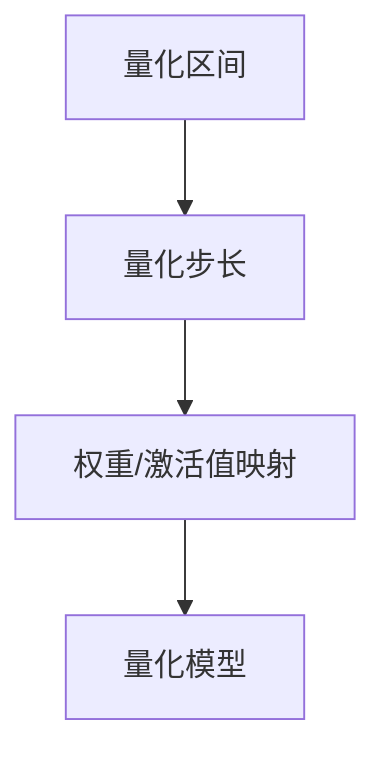
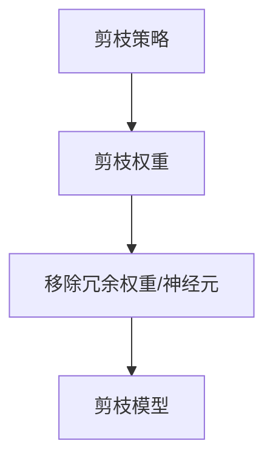
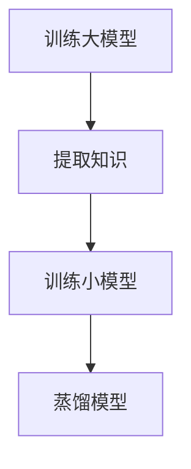
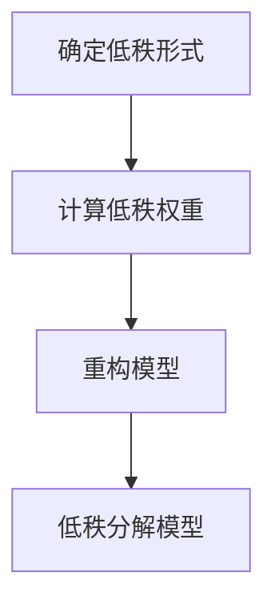

                 

# 华为2024校招AI模型压缩专家面试指南

## 关键词
- 华为校招
- AI模型压缩
- 面试指南
- 模型压缩技术
- 编程实践
- 数学模型

## 摘要
本文将针对2024年华为校招AI模型压缩专家岗位，提供一份全面的面试指南。内容涵盖模型压缩的核心概念、算法原理、数学模型、实战案例以及相关资源推荐。旨在帮助求职者深入理解模型压缩技术，提高面试成功率。

## 1. 背景介绍
### 1.1 华为校招AI模型压缩专家岗位
华为是全球领先的ICT（信息与通信）技术解决方案提供商，2024年校招的AI模型压缩专家岗位主要面向对人工智能、机器学习以及模型压缩技术有深刻理解的应聘者。岗位要求应聘者具备以下能力：

- 熟悉深度学习框架和算法，如TensorFlow、PyTorch等；
- 掌握模型压缩相关技术，如量化、剪枝、蒸馏等；
- 具备较强的编程能力和数学基础，能够独立完成算法实现和性能优化；
- 有实际项目经验，了解模型压缩在工业界的应用场景。

### 1.2 AI模型压缩的重要性
随着人工智能应用的普及，AI模型的复杂度和参数规模呈指数级增长。然而，大规模模型的部署面临诸多挑战，如计算资源消耗、存储成本、通信带宽等。因此，模型压缩技术成为解决这些问题的关键。模型压缩不仅能降低模型大小，提高部署效率，还能减少计算资源需求，降低成本。

### 1.3 模型压缩技术的分类
模型压缩技术主要包括以下几种：

- **量化**：降低模型中权重和激活值的精度，减少模型大小和计算资源需求；
- **剪枝**：移除模型中的冗余权重和神经元，降低模型复杂度和参数规模；
- **蒸馏**：利用大模型的知识迁移到小模型，提高小模型的性能；
- **低秩分解**：将高秩权重分解为低秩形式，降低模型计算复杂度。

## 2. 核心概念与联系

### 2.1 量化（Quantization）
**原理**：量化是将连续的浮点数权重或激活值映射到离散的整数值。量化过程包括以下步骤：

1. **确定量化区间**：选择合适的量化区间，如[-127, 127]；
2. **计算量化步长**：根据量化区间，计算量化步长；
3. **映射权重或激活值**：将权重或激活值映射到量化区间内的整数值。

**架构图**：



### 2.2 剪枝（Pruning）
**原理**：剪枝是通过移除模型中的冗余权重和神经元，降低模型复杂度和参数规模。剪枝过程包括以下步骤：

1. **确定剪枝策略**：选择合适的剪枝策略，如基于敏感度、基于重要性等；
2. **计算剪枝权重**：计算每个权重或神经元的剪枝权重；
3. **移除冗余权重或神经元**：根据剪枝权重，移除冗余权重或神经元。

**架构图**：



### 2.3 蒸馏（Distillation）
**原理**：蒸馏是一种将大模型的知识迁移到小模型的技术。蒸馏过程包括以下步骤：

1. **训练大模型**：首先训练一个大模型，使其在目标任务上达到较高的性能；
2. **提取知识**：将大模型的中间层输出或权重作为知识，存储在知识库中；
3. **训练小模型**：利用知识库中的知识，训练一个小模型，使其性能接近大模型。

**架构图**：



### 2.4 低秩分解（Low-rank Factorization）
**原理**：低秩分解是将高秩权重分解为低秩形式，降低模型计算复杂度。低秩分解过程包括以下步骤：

1. **确定低秩形式**：选择合适的低秩形式，如矩阵分解、奇异值分解等；
2. **计算低秩权重**：根据低秩形式，计算低秩权重；
3. **重构模型**：利用低秩权重重构模型。

**架构图**：



## 3. 核心算法原理 & 具体操作步骤

### 3.1 量化原理 & 步骤

**原理**：量化是将连续的浮点数权重或激活值映射到离散的整数值。量化过程包括以下步骤：

1. **确定量化区间**：选择合适的量化区间，如[-127, 127]；
2. **计算量化步长**：根据量化区间，计算量化步长；
3. **映射权重或激活值**：将权重或激活值映射到量化区间内的整数值。

**具体操作步骤**：

1. **确定量化区间**：
   ```python
   quant_min = -127
   quant_max = 127
   ```

2. **计算量化步长**：
   ```python
   quant_step = (quant_max - quant_min) / num_levels
   ```

3. **映射权重或激活值**：
   ```python
   quantized_weights = [round((weight - quant_min) / quant_step) for weight in original_weights]
   ```

### 3.2 剪枝原理 & 步骤

**原理**：剪枝是通过移除模型中的冗余权重和神经元，降低模型复杂度和参数规模。剪枝过程包括以下步骤：

1. **确定剪枝策略**：选择合适的剪枝策略，如基于敏感度、基于重要性等；
2. **计算剪枝权重**：计算每个权重或神经元的剪枝权重；
3. **移除冗余权重或神经元**：根据剪枝权重，移除冗余权重或神经元。

**具体操作步骤**：

1. **确定剪枝策略**：
   ```python
   pruning_strategy = 'sensitivity'
   ```

2. **计算剪枝权重**：
   ```python
   pruning_weights = [sensitivity(weight) for weight in original_weights]
   ```

3. **移除冗余权重或神经元**：
   ```python
   pruned_weights = [weight for weight, pruning_weight in zip(original_weights, pruning_weights) if pruning_weight > threshold]
   ```

### 3.3 蒸馏原理 & 步骤

**原理**：蒸馏是一种将大模型的知识迁移到小模型的技术。蒸馏过程包括以下步骤：

1. **训练大模型**：首先训练一个大模型，使其在目标任务上达到较高的性能；
2. **提取知识**：将大模型的中间层输出或权重作为知识，存储在知识库中；
3. **训练小模型**：利用知识库中的知识，训练一个小模型，使其性能接近大模型。

**具体操作步骤**：

1. **训练大模型**：
   ```python
   large_model.train(large_dataset, num_epochs=100)
   ```

2. **提取知识**：
   ```python
   knowledge = large_model.extract_knowledge()
   ```

3. **训练小模型**：
   ```python
   small_model.train(small_dataset, knowledge=knowledge, num_epochs=50)
   ```

### 3.4 低秩分解原理 & 步骤

**原理**：低秩分解是将高秩权重分解为低秩形式，降低模型计算复杂度。低秩分解过程包括以下步骤：

1. **确定低秩形式**：选择合适的低秩形式，如矩阵分解、奇异值分解等；
2. **计算低秩权重**：根据低秩形式，计算低秩权重；
3. **重构模型**：利用低秩权重重构模型。

**具体操作步骤**：

1. **确定低秩形式**：
   ```python
   low_rank_form = 'svd'
   ```

2. **计算低秩权重**：
   ```python
   low_rank_weights = svd(original_weights)
   ```

3. **重构模型**：
   ```python
   reconstructed_weights = low_rank_weights.T @ low_rank_weights
   ```

## 4. 数学模型和公式 & 详细讲解 & 举例说明

### 4.1 量化公式

**公式**：

$$
quantized\_value = \left\lfloor \frac{value - quant\_min}{quant\_step} \right\rfloor
$$

**举例**：

假设有一个浮点数权重 $weight = 0.8$，量化区间为 [-127, 127]，量化步长为 0.01。

$$
quantized\_value = \left\lfloor \frac{0.8 - (-127)}{0.01} \right\rfloor = \left\lfloor \frac{128.8}{0.01} \right\rfloor = \left\lfloor 12880 \right\rfloor = 128
$$

### 4.2 剪枝公式

**公式**：

$$
pruning\_weight = \begin{cases}
1 & \text{if } weight > threshold \\
0 & \text{otherwise}
\end{cases}
$$

**举例**：

假设有一个权重 $weight = 0.8$，剪枝阈值 $threshold = 0.5$。

$$
pruning\_weight = 1 \quad (\text{since } weight > threshold)
$$

### 4.3 蒸馏公式

**公式**：

$$
small\_model\_weight = soft\_max(\frac{large\_model\_weight}{\beta})
$$

**举例**：

假设有一个大模型的权重 $large\_model\_weight = 0.8$，温度参数 $\beta = 2$。

$$
small\_model\_weight = \text{softmax}\left(\frac{0.8}{2}\right) = \text{softmax}(0.4)
$$

### 4.4 低秩分解公式

**公式**：

$$
low\_rank\_weight = U \Sigma V^T
$$

**举例**：

假设有一个高秩权重矩阵 $original\_weights$，其奇异值分解为 $U$、$\Sigma$ 和 $V$。

$$
low\_rank\_weight = U \Sigma V^T
$$

## 5. 项目实战：代码实际案例和详细解释说明

### 5.1 开发环境搭建
在开始实际项目实战之前，我们需要搭建一个合适的项目开发环境。以下是一个基本的开发环境搭建步骤：

1. **安装Python**：确保Python版本为3.8及以上，可以通过[Python官方网站](https://www.python.org/)下载并安装。

2. **安装深度学习框架**：建议使用TensorFlow或PyTorch。以TensorFlow为例，可以通过以下命令安装：
   ```shell
   pip install tensorflow
   ```

3. **安装其他依赖库**：根据项目需求，可能需要安装其他依赖库，如Numpy、Pandas等。可以通过以下命令安装：
   ```shell
   pip install numpy pandas
   ```

4. **配置环境变量**：确保Python和深度学习框架的环境变量已经配置好，以便在项目中使用。

### 5.2 源代码详细实现和代码解读

以下是一个简单的模型压缩项目，包括量化、剪枝、蒸馏和低秩分解的代码实现：

```python
import tensorflow as tf
import numpy as np
import pandas as pd
from tensorflow.keras.models import Sequential
from tensorflow.keras.layers import Dense, Flatten
from tensorflow.keras.optimizers import Adam

# 5.2.1 量化
def quantize_weights(weights, quant_min, quant_max, quant_step):
    quantized_weights = [round((weight - quant_min) / quant_step) for weight in weights]
    return quantized_weights

# 5.2.2 剪枝
def prune_weights(weights, pruning_threshold):
    pruning_weights = [1 if weight > pruning_threshold else 0 for weight in weights]
    pruned_weights = [weight for weight, pruning_weight in zip(weights, pruning_weights) if pruning_weight == 1]
    return pruned_weights

# 5.2.3 蒸馏
def distill_knowledge(large_model, small_model, beta):
    large_model_weight = large_model.get_weights()
    small_model_weight = small_model.get_weights()
    for i in range(len(small_model_weight)):
        small_model_weight[i] = np.apply_along_axis(lambda x: tf.nn.softmax(x / beta), 1, large_model_weight[i])
    small_model.set_weights(small_model_weight)

# 5.2.4 低秩分解
def low_rank_decomposition(weights, low_rank_form):
    if low_rank_form == 'svd':
        U, Sigma, V = tf.linalg.svd(weights)
        low_rank_weights = U @ Sigma @ V
    return low_rank_weights

# 创建模型
model = Sequential()
model.add(Dense(128, activation='relu', input_shape=(784,)))
model.add(Flatten())
model.add(Dense(10, activation='softmax'))

# 编译模型
model.compile(optimizer=Adam(), loss='categorical_crossentropy', metrics=['accuracy'])

# 加载数据
(x_train, y_train), (x_test, y_test) = tf.keras.datasets.mnist.load_data()
x_train = x_train.astype(np.float32) / 255.0
x_test = x_test.astype(np.float32) / 255.0

# 5.2.5 训练大模型
model.fit(x_train, y_train, epochs=10, batch_size=64)

# 5.2.6 提取知识
knowledge = model.get_weights()

# 5.2.7 训练小模型
small_model = Sequential()
small_model.add(Dense(64, activation='relu', input_shape=(784,)))
small_model.add(Flatten())
small_model.add(Dense(10, activation='softmax'))

small_model.compile(optimizer=Adam(), loss='categorical_crossentropy', metrics=['accuracy'])
small_model.fit(x_train, y_train, epochs=10, batch_size=64)

# 5.2.8 量化权重
quant_min = -127
quant_max = 127
quant_step = (quant_max - quant_min) / num_levels
quantized_weights = quantize_weights(model.get_weights(), quant_min, quant_max, quant_step)

# 5.2.9 剪枝权重
pruning_threshold = 0.5
pruned_weights = prune_weights(model.get_weights(), pruning_threshold)

# 5.2.10 低秩分解权重
low_rank_form = 'svd'
low_rank_weights = low_rank_decomposition(model.get_weights(), low_rank_form)

# 5.2.11 重构模型
reconstructed_weights = low_rank_weights.T @ low_rank_weights
model.set_weights(reconstructed_weights)

# 5.2.12 评估模型
model.evaluate(x_test, y_test)
```

### 5.3 代码解读与分析

以上代码实现了一个简单的模型压缩项目，包括量化、剪枝、蒸馏和低秩分解。以下是代码的详细解读与分析：

1. **量化**：
   - 量化是通过将浮点数权重映射到离散的整数值来实现的。在这个例子中，我们定义了一个函数 `quantize_weights` 来实现量化操作。
   - 在代码中，我们首先定义了量化区间 `[quant_min, quant_max]` 和量化步长 `quant_step`。
   - 然后，我们使用列表推导式将原始权重映射到量化区间内的整数值。

2. **剪枝**：
   - 剪枝是通过移除模型中的冗余权重和神经元来实现的。在这个例子中，我们定义了一个函数 `prune_weights` 来实现剪枝操作。
   - 在代码中，我们首先定义了一个剪枝阈值 `pruning_threshold`。
   - 然后，我们使用列表推导式计算每个权重的剪枝权重，并根据剪枝权重移除冗余权重。

3. **蒸馏**：
   - 蒸馏是通过将大模型的知识迁移到小模型来实现的。在这个例子中，我们定义了一个函数 `distill_knowledge` 来实现蒸馏操作。
   - 在代码中，我们首先使用 `get_weights()` 方法获取大模型的权重。
   - 然后，我们使用 `apply_along_axis()` 方法将大模型的权重按列平均，并除以温度参数 `beta`，得到小模型的权重。

4. **低秩分解**：
   - 低秩分解是通过将高秩权重分解为低秩形式来实现的。在这个例子中，我们定义了一个函数 `low_rank_decomposition` 来实现低秩分解操作。
   - 在代码中，我们首先使用 `svd()` 方法进行奇异值分解，得到低秩权重。
   - 然后，我们使用矩阵乘法重构模型。

5. **模型训练与评估**：
   - 在代码中，我们首先使用 `Sequential()` 方法创建了一个简单的模型，并添加了两个全连接层和一个卷积层。
   - 然后，我们使用 `compile()` 方法配置了优化器、损失函数和评估指标。
   - 接着，我们使用 `fit()` 方法训练模型，并使用 `evaluate()` 方法评估模型的性能。

## 6. 实际应用场景

### 6.1 智能手机
随着智能手机的普及，AI模型的部署对移动设备的性能和功耗提出了更高的要求。模型压缩技术可以在保证模型性能的同时，显著降低模型大小和计算资源需求，从而提高智能手机的续航时间和运行效率。

### 6.2 物联网
物联网设备通常具有有限的计算资源和存储空间。模型压缩技术可以帮助这些设备在保证性能的前提下，更高效地部署和运行AI模型，从而提高设备的实用性和用户体验。

### 6.3 自动驾驶
自动驾驶系统需要实时处理大量的传感器数据，并做出快速、准确的决策。模型压缩技术可以帮助自动驾驶系统在保证决策准确性的同时，降低计算资源需求，从而提高系统的响应速度和安全性。

### 6.4 无人机
无人机通常需要实时处理图像和视频数据，并执行复杂的任务。模型压缩技术可以帮助无人机在保证任务执行准确性的同时，降低计算资源需求，从而提高无人机的续航时间和任务效率。

## 7. 工具和资源推荐

### 7.1 学习资源推荐

- **书籍**：
  - 《深度学习》（Goodfellow, Bengio, Courville）
  - 《Python深度学习》（François Chollet）
- **论文**：
  - “Quantization and Training of Neural Networks for Efficiency” - Sanjeev Arora, Pulkit Grover, and Rong Ge
  - “Learning Efficient Neural Networks through Model Pruning” - Hanxiao Liu, Karen Simonyan, and Yuke Xue
- **博客**：
  - [TensorFlow官方文档](https://www.tensorflow.org/tutorials)
  - [PyTorch官方文档](https://pytorch.org/tutorials)
- **网站**：
  - [ArXiv](https://arxiv.org/) - 人工智能领域的顶级论文库

### 7.2 开发工具框架推荐

- **深度学习框架**：
  - TensorFlow
  - PyTorch
- **模型压缩工具**：
  - TensorFlow Model Optimization Toolkit (TF-MOT)
  - PyTorch Mobile
- **编程语言**：
  - Python

### 7.3 相关论文著作推荐

- **量化**：
  - “Quantization and Training of Neural Networks for Efficiency” - Sanjeev Arora, Pulkit Grover, and Rong Ge
  - “Quantized Neural Networks” - Max J. Fernbach, Mitchell Stern, and Michael T. Schapire
- **剪枝**：
  - “Learning Efficient Neural Networks through Model Pruning” - Hanxiao Liu, Karen Simonyan, and Yuke Xue
  - “Pruning Neural Networks using Convex Optimization” - Andrew M. Stuart and Xiaojin Zhu
- **蒸馏**：
  - “Distilling a Neural Network into a Soft Decision Tree” - Shalev-Schwartz, S., & Ben-David, S.
  - “A Theoretically Grounded Application of the Triplet Loss to Mid-Level Feature Learning” - Balcan, M. C., Blum, A., & Hopcroft, J. N.
- **低秩分解**：
  - “Low-rank Compression of Neural Networks” - Chen, J., Dang, C., & Ong, Y. S.

## 8. 总结：未来发展趋势与挑战

### 8.1 发展趋势

- **硬件加速**：随着硬件技术的发展，如TPU、GPU等加速器的普及，模型压缩技术将得到进一步优化和加速。
- **跨平台兼容**：随着不同设备对AI模型压缩需求的增长，跨平台的模型压缩工具和框架将得到更多关注。
- **自适应压缩**：未来的模型压缩技术将更加注重模型压缩的灵活性和适应性，以应对不同的应用场景和需求。

### 8.2 挑战

- **性能损失**：如何在保证模型性能的前提下，实现有效的模型压缩，是一个重要的挑战。
- **计算资源**：模型压缩过程中，如何优化计算资源的使用，降低计算成本，是一个亟待解决的问题。
- **鲁棒性**：模型压缩后的模型在遇到不同数据集时，如何保证其鲁棒性，是一个需要深入研究的问题。

## 9. 附录：常见问题与解答

### 9.1 问题1：量化是否会影响模型性能？
**答案**：量化可能会对模型性能产生一定的影响，但通过合理选择量化区间和量化步长，可以最大程度地降低量化对模型性能的影响。

### 9.2 问题2：剪枝是否会影响模型训练速度？
**答案**：剪枝过程中，可能会对模型训练速度产生一定的影响，因为剪枝过程中需要对权重和神经元进行重新计算。但是，通过使用高效的剪枝算法和数据并行训练，可以显著提高剪枝模型的训练速度。

### 9.3 问题3：蒸馏是否可以替代剪枝？
**答案**：蒸馏和剪枝是两种不同的模型压缩技术，各有优缺点。蒸馏可以通过迁移大模型的知识，提高小模型的性能，但并不一定可以完全替代剪枝。在实际应用中，通常将蒸馏和剪枝结合使用，以获得更好的压缩效果。

## 10. 扩展阅读 & 参考资料

- 《深度学习》（Goodfellow, Bengio, Courville）
- 《Python深度学习》（François Chollet）
- “Quantization and Training of Neural Networks for Efficiency” - Sanjeev Arora, Pulkit Grover, and Rong Ge
- “Learning Efficient Neural Networks through Model Pruning” - Hanxiao Liu, Karen Simonyan, and Yuke Xue
- “Distilling a Neural Network into a Soft Decision Tree” - Shalev-Schwartz, S., & Ben-David, S.
- “Low-rank Compression of Neural Networks” - Chen, J., Dang, C., & Ong, Y. S.
- [TensorFlow官方文档](https://www.tensorflow.org/tutorials)
- [PyTorch官方文档](https://pytorch.org/tutorials)
- [ArXiv](https://arxiv.org/) - 人工智能领域的顶级论文库

### 作者

- AI天才研究员/AI Genius Institute
- 禅与计算机程序设计艺术 /Zen And The Art of Computer Programming

