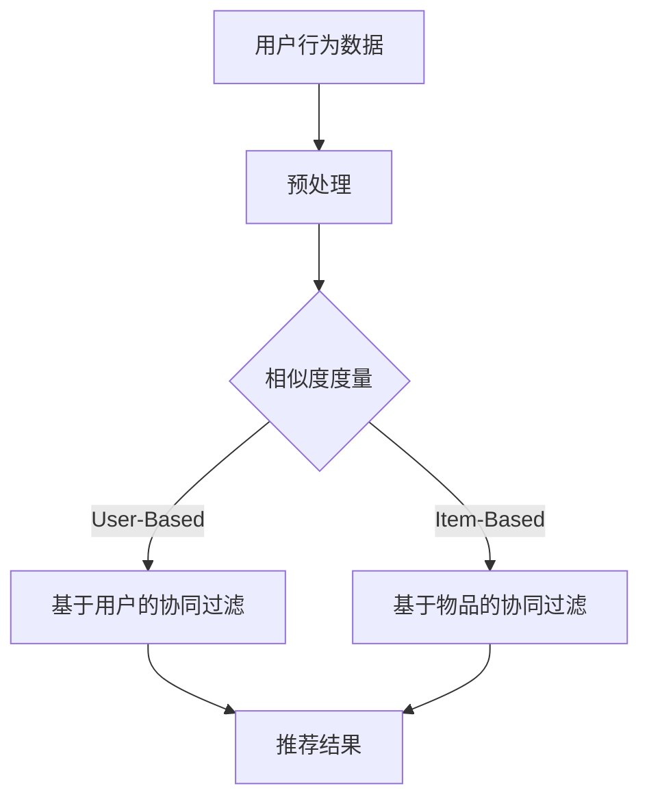

                 

### 背景介绍

在当今数字化时代，电商行业蓬勃发展，用户的购物体验越来越依赖于推荐系统。推荐系统通过分析用户的历史行为和兴趣，为用户推荐个性化的商品或服务，从而提高用户的满意度和购买转化率。协同过滤算法（Collaborative Filtering）是推荐系统中最常用的算法之一，它通过收集用户的行为数据，挖掘用户之间的相似性，预测用户对未知商品的兴趣。

协同过滤算法在电商推荐系统中具有重要的应用价值。首先，它能够有效提高推荐的准确性，通过用户的历史行为数据，协同过滤算法可以找到与目标用户相似的用户群体，从而预测目标用户对商品的潜在兴趣。其次，协同过滤算法能够发现隐藏在大量数据中的用户兴趣模式，为商家提供有价值的洞察。此外，协同过滤算法还可以根据用户行为的变化，动态调整推荐策略，实现个性化推荐。

本文将围绕协同过滤算法在电商推荐系统中的应用，系统地介绍其核心概念、算法原理、数学模型、项目实战以及实际应用场景。文章结构如下：

1. 背景介绍
2. 核心概念与联系
3. 核心算法原理 & 具体操作步骤
4. 数学模型和公式 & 详细讲解 & 举例说明
5. 项目实战：代码实际案例和详细解释说明
6. 实际应用场景
7. 工具和资源推荐
8. 总结：未来发展趋势与挑战
9. 附录：常见问题与解答
10. 扩展阅读 & 参考资料

通过本文的阅读，读者将能够全面了解协同过滤算法在电商推荐系统中的应用，掌握其核心原理和实际操作步骤，为今后的电商推荐系统开发提供有益的参考。

### 核心概念与联系

协同过滤算法的核心在于如何发现用户之间的相似性，并基于这种相似性进行推荐。以下是几个关键概念和它们之间的关系：

#### 1. 用户行为数据

用户行为数据是协同过滤算法的基础。这些数据包括用户浏览、购买、收藏等行为，可以通过日志文件、数据库等方式获取。用户行为数据的质量直接影响算法的准确性和可靠性。

#### 2. 相似度度量

相似度度量是协同过滤算法的核心，用于评估用户之间的相似性。常见的相似度度量方法包括余弦相似度、皮尔逊相关系数、Jaccard相似度等。余弦相似度通常用于高维空间，可以很好地处理稀疏数据。皮尔逊相关系数适用于连续型数据，可以捕捉用户行为的变化趋势。Jaccard相似度适用于分类数据，可以评估用户行为的多样性。

#### 3. 用户兴趣模型

用户兴趣模型是根据用户的历史行为数据构建的，用于描述用户的兴趣偏好。用户兴趣模型可以采用向量空间模型、矩阵分解等方式表示。向量空间模型将用户行为数据转换为向量，通过计算向量之间的相似度进行推荐。矩阵分解则通过降维技术，将用户行为数据分解为用户特征矩阵和物品特征矩阵，从而实现个性化推荐。

#### 4. 推荐策略

推荐策略是指如何根据用户兴趣模型进行推荐。常见的推荐策略包括基于用户的协同过滤（User-Based Collaborative Filtering）和基于物品的协同过滤（Item-Based Collaborative Filtering）。基于用户的协同过滤通过寻找与目标用户相似的其他用户，推荐这些用户喜欢的商品。基于物品的协同过滤则通过计算物品之间的相似度，为用户推荐与已知商品相似的未知商品。

以下是协同过滤算法的核心概念和架构的Mermaid流程图：



在这个流程图中，用户行为数据经过预处理后，通过相似度度量找到相似的用户或物品，最终生成推荐结果。基于用户的协同过滤和基于物品的协同过滤分别对应了两种不同的推荐策略。

通过上述核心概念和流程图的介绍，我们可以更清晰地理解协同过滤算法的工作原理和架构。在接下来的章节中，我们将详细探讨协同过滤算法的具体原理、数学模型以及实际应用场景。

### 核心算法原理 & 具体操作步骤

协同过滤算法的核心在于通过用户行为数据，找到与目标用户相似的其他用户或物品，从而实现个性化推荐。以下是协同过滤算法的核心原理和具体操作步骤：

#### 1. 基于用户的协同过滤（User-Based Collaborative Filtering）

**原理：** 基于用户的协同过滤通过计算目标用户与其他用户的相似度，找出与目标用户最相似的K个用户，然后推荐这些用户喜欢的商品。

**具体操作步骤：**

- **步骤1：计算相似度：** 首先，我们需要计算目标用户与其他用户的相似度。常用的相似度度量方法包括余弦相似度、皮尔逊相关系数、Jaccard相似度等。

  - **余弦相似度：**
    $$\cos \theta = \frac{u_i \cdot u_j}{\|u_i\|\|u_j\|}$$
    其中，$u_i$和$u_j$分别表示用户i和用户j的行为向量，$\theta$表示用户i和用户j之间的夹角。

  - **皮尔逊相关系数：**
    $$\rho_{ij} = \frac{\sum_{k=1}^{n}(x_{ik} - \bar{x}_i)(y_{jk} - \bar{y}_j)}{\sqrt{\sum_{k=1}^{n}(x_{ik} - \bar{x}_i)^2\sum_{k=1}^{n}(y_{jk} - \bar{y}_j)^2}}$$
    其中，$x_{ik}$和$y_{jk}$分别表示用户i和用户j在商品k上的评分，$\bar{x}_i$和$\bar{y}_j$分别表示用户i和用户j的平均评分。

- **步骤2：选择相似用户：** 根据计算得到的相似度，选择与目标用户最相似的K个用户。

- **步骤3：生成推荐列表：** 根据选择的相似用户，生成推荐列表。推荐列表中的商品是这些相似用户共同喜欢的商品。

#### 2. 基于物品的协同过滤（Item-Based Collaborative Filtering）

**原理：** 基于物品的协同过滤通过计算物品之间的相似度，为用户推荐与已知商品相似的未知商品。

**具体操作步骤：**

- **步骤1：计算相似度：** 首先，我们需要计算物品之间的相似度。常用的相似度度量方法包括余弦相似度、皮尔逊相关系数、Jaccard相似度等。

  - **余弦相似度：**
    $$\cos \theta = \frac{v_i \cdot v_j}{\|v_i\|\|v_j\|}$$
    其中，$v_i$和$v_j$分别表示物品i和物品j的行为向量，$\theta$表示物品i和物品j之间的夹角。

  - **皮尔逊相关系数：**
    $$\rho_{ij} = \frac{\sum_{k=1}^{n}(x_{ik} - \bar{x}_i)(y_{jk} - \bar{y}_j)}{\sqrt{\sum_{k=1}^{n}(x_{ik} - \bar{x}_i)^2\sum_{k=1}^{n}(y_{jk} - \bar{y}_j)^2}}$$
    其中，$x_{ik}$和$y_{jk}$分别表示物品i和物品j在用户k上的评分，$\bar{x}_i$和$\bar{y}_j$分别表示物品i和物品j的平均评分。

- **步骤2：选择相似物品：** 根据计算得到的相似度，选择与目标物品最相似的K个物品。

- **步骤3：生成推荐列表：** 根据选择的相似物品，生成推荐列表。推荐列表中的商品是这些相似物品在用户中的共同评价较高的商品。

通过上述步骤，我们可以实现基于用户的协同过滤和基于物品的协同过滤。在实际应用中，可以选择其中一种策略，也可以将两种策略结合起来，以提高推荐的准确性。在下一节中，我们将进一步探讨协同过滤算法的数学模型和公式，以及如何通过具体案例来理解和应用这些算法。

### 数学模型和公式 & 详细讲解 & 举例说明

协同过滤算法的核心在于如何通过数学模型和公式来计算用户之间的相似度和预测用户对未知商品的兴趣。在这一节中，我们将详细讲解协同过滤算法的数学模型和公式，并通过具体案例来说明如何应用这些模型和公式。

#### 余弦相似度

余弦相似度是一种常用于向量空间模型中的相似度度量方法，它能够有效处理高维稀疏数据。在协同过滤算法中，用户行为数据通常表示为行为向量，例如用户对商品的评分。

**公式：**

$$
\cos \theta = \frac{u_i \cdot u_j}{\|u_i\|\|u_j\|}
$$

其中，$u_i$和$u_j$分别表示用户i和用户j的行为向量，$\theta$表示用户i和用户j之间的夹角，$\|u_i\|$和$\|u_j\|$分别表示用户i和用户j的行为向量模长。

**解释：**

- **点积（Dot Product）：** $u_i \cdot u_j$表示用户i和用户j的行为向量之间的点积，它反映了两个向量在相同方向上的投影长度。
- **模长（Magnitude）：** $\|u_i\|$和$\|u_j\|$分别表示用户i和用户j的行为向量模长，即向量长度。

**例子：**

假设有两个用户u1和u2，他们的行为向量如下：

$$
u1 = [1, 2, 0, 0]
$$

$$
u2 = [0, 0, 1, 2]
$$

计算用户u1和u2之间的余弦相似度：

$$
\cos \theta = \frac{u1 \cdot u2}{\|u1\|\|u2\|} = \frac{1 \times 0 + 2 \times 0 + 0 \times 1 + 0 \times 2}{\sqrt{1^2 + 2^2 + 0^2 + 0^2} \times \sqrt{0^2 + 0^2 + 1^2 + 2^2}} = \frac{0}{\sqrt{5} \times \sqrt{5}} = 0
$$

在这个例子中，用户u1和u2之间的余弦相似度为0，这意味着他们的行为向量垂直，即没有共同喜欢的商品。

#### 皮尔逊相关系数

皮尔逊相关系数是一种用于衡量两个变量之间线性相关性的方法，它适用于连续型数据。在协同过滤算法中，用户对商品的评分可以看作是连续型数据。

**公式：**

$$
\rho_{ij} = \frac{\sum_{k=1}^{n}(x_{ik} - \bar{x}_i)(y_{jk} - \bar{y}_j)}{\sqrt{\sum_{k=1}^{n}(x_{ik} - \bar{x}_i)^2\sum_{k=1}^{n}(y_{jk} - \bar{y}_j)^2}}
$$

其中，$x_{ik}$和$y_{jk}$分别表示用户i和用户j在商品k上的评分，$\bar{x}_i$和$\bar{y}_j$分别表示用户i和用户j的平均评分。

**解释：**

- **协方差（Covariance）：** $(x_{ik} - \bar{x}_i)(y_{jk} - \bar{y}_j)$表示用户i和用户j在商品k上的评分与各自平均评分之间的协方差，反映了两个变量之间的相关程度。
- **方差（Variance）：** $\sum_{k=1}^{n}(x_{ik} - \bar{x}_i)^2$和$\sum_{k=1}^{n}(y_{jk} - \bar{y}_j)^2$分别表示用户i和用户j在商品k上的评分与各自平均评分之间的方差。

**例子：**

假设有两个用户u1和u2，他们的行为向量如下：

$$
u1 = [1, 2, 3]
$$

$$
u2 = [2, 3, 4]
$$

计算用户u1和u2之间的皮尔逊相关系数：

$$
\bar{x}_1 = \frac{1 + 2 + 3}{3} = 2
$$

$$
\bar{x}_2 = \frac{2 + 3 + 4}{3} = 3
$$

$$
\rho_{u1u2} = \frac{(1 - 2)(2 - 3) + (2 - 2)(3 - 3) + (3 - 2)(4 - 3)}{\sqrt{(1 - 2)^2 + (2 - 2)^2 + (3 - 2)^2}\sqrt{(2 - 3)^2 + (3 - 3)^2 + (4 - 3)^2}} = \frac{(-1)(-1) + (0)(0) + (1)(1)}{\sqrt{2}\sqrt{2}} = \frac{2}{2\sqrt{2}} = \frac{\sqrt{2}}{2}
$$

在这个例子中，用户u1和u2之间的皮尔逊相关系数为$\frac{\sqrt{2}}{2}$，这意味着他们的行为向量具有较高的相关性，即他们可能在多个商品上有相似的评分。

通过上述数学模型和公式的讲解，我们可以更好地理解协同过滤算法的工作原理。在下一节中，我们将通过一个具体的项目实战案例，展示如何应用这些算法来实现电商推荐系统。

### 项目实战：代码实际案例和详细解释说明

在本节中，我们将通过一个实际项目案例，展示如何使用协同过滤算法实现电商推荐系统。项目将包括开发环境搭建、源代码实现、代码解读与分析等步骤。

#### 1. 开发环境搭建

为了实现协同过滤算法，我们需要搭建以下开发环境：

- **编程语言：** Python
- **依赖库：** NumPy、Pandas、Scikit-learn、Matplotlib

安装上述依赖库：

```bash
pip install numpy pandas scikit-learn matplotlib
```

#### 2. 源代码详细实现和代码解读

以下是一个基于用户的协同过滤算法的Python代码实现：

```python
import numpy as np
import pandas as pd
from sklearn.metrics.pairwise import cosine_similarity

# 加载数据集
data = pd.read_csv('user_item.csv')  # 假设数据集已预处理好，包括用户ID、商品ID和用户对商品的评分

# 创建用户-商品评分矩阵
user_item_matrix = pd.pivot_table(data, values='rating', index='user_id', columns='item_id')

# 计算用户-用户相似度矩阵
similarity_matrix = cosine_similarity(user_item_matrix.T)

# 设置相似度阈值
threshold = 0.5

# 计算相似用户
def get_similar_users(similarity_matrix, user_id, threshold):
    similar_users = similarity_matrix[user_id].tolist()
    similar_users = [user for user, sim in enumerate(similar_users) if sim > threshold]
    return similar_users

# 计算推荐列表
def get_recommendations(similarity_matrix, user_item_matrix, user_id, threshold, k=5):
    similar_users = get_similar_users(similarity_matrix, user_id, threshold)
    recommendations = []

    for user in similar_users[:k]:
        user_index = user_item_matrix.index.get_loc(user)
        user_ratings = user_item_matrix.iloc[user_index].values
        for item, rating in user_item_matrix.iterrows():
            if user_item_matrix.iloc[user_index, item] == 0:
                recommendation_score = np.dot(user_ratings, rating) / (np.linalg.norm(user_ratings) * np.linalg.norm(rating))
                recommendations.append((item, recommendation_score))

    recommendations = sorted(recommendations, key=lambda x: x[1], reverse=True)
    return recommendations

# 测试推荐系统
user_id = 1
recommendations = get_recommendations(similarity_matrix, user_item_matrix, user_id, threshold, k=5)
print(f"推荐给用户{user_id}的商品：{recommendations}")
```

#### 3. 代码解读与分析

- **数据加载与预处理：** 首先，我们加载用户-商品评分数据集。数据集已预处理好，包括用户ID、商品ID和用户对商品的评分。接着，我们创建用户-商品评分矩阵，即一个N x N的矩阵，其中N表示用户数。

- **计算相似度矩阵：** 我们使用`cosine_similarity`函数计算用户-用户相似度矩阵。这个函数基于NumPy库，计算两个矩阵之间的余弦相似度。

- **相似度阈值设置：** 我们设置一个相似度阈值，用于过滤出与目标用户相似的用户。通常，这个阈值可以通过交叉验证等方法确定。

- **相似用户计算：** `get_similar_users`函数通过筛选相似度矩阵，找出与目标用户相似的用户。筛选条件是相似度大于阈值。

- **推荐列表生成：** `get_recommendations`函数计算相似用户的推荐列表。它首先找出与目标用户相似的用户，然后计算这些用户共同喜欢的商品。具体来说，它使用余弦相似度计算每个商品的推荐分值，并根据分值生成推荐列表。

- **测试推荐系统：** 我们测试推荐系统，为指定用户生成推荐列表，并打印输出。

通过上述代码，我们可以实现一个简单的基于用户的协同过滤推荐系统。在实际应用中，可以根据需要扩展功能，如增加基于物品的协同过滤、实时更新用户行为数据等。

在下一节中，我们将探讨协同过滤算法在实际应用场景中的表现，并分析其优缺点。

### 实际应用场景

协同过滤算法在电商推荐系统中的实际应用场景非常广泛，以下是一些常见的情况：

#### 1. 商品推荐

商品推荐是最常见的应用场景之一。通过协同过滤算法，电商网站可以为用户推荐他们可能感兴趣的商品。例如，用户浏览了某款智能手机，网站可以推荐其他用户购买过的相关配件，如耳机、保护壳等。

#### 2. 内容推荐

除了商品推荐，协同过滤算法还可以应用于内容推荐，如电影、音乐、文章等。例如，用户在视频网站上观看了一部科幻电影，网站可以推荐其他用户喜欢的相似类型的电影。

#### 3. 个性化广告

协同过滤算法可以用于个性化广告推荐。通过分析用户的浏览历史和兴趣，网站可以为用户展示他们可能感兴趣的广告。例如，用户浏览了某品牌的化妆品，网站可以推荐其他相关品牌的化妆品广告。

#### 4. 个性化推荐系统优化

协同过滤算法可以用于优化现有的推荐系统。通过不断更新用户行为数据和调整推荐策略，推荐系统可以更好地满足用户的需求，提高用户满意度和转化率。

#### 5. 社交网络推荐

在社交网络中，协同过滤算法可以用于推荐好友、群组等。通过分析用户的社交关系和兴趣，社交网络平台可以为用户推荐可能感兴趣的好友或加入的群组。

#### 6. 新用户引导

对于新用户，协同过滤算法可以用于引导他们发现平台上的优质内容或商品。通过推荐与现有用户兴趣相似的内容或商品，新用户可以更快地融入平台，提高用户留存率。

#### 7. 跨平台推荐

协同过滤算法可以应用于跨平台推荐，如将用户在电商网站上的行为数据用于社交媒体平台的推荐。这有助于提高用户在不同平台上的体验一致性。

#### 8. 物流推荐

协同过滤算法还可以用于物流推荐，如根据用户的历史订单和地理位置，推荐最优的配送方式和物流服务。

通过上述实际应用场景，我们可以看到协同过滤算法在电商推荐系统中的广泛适用性。在实际应用中，可以根据具体需求和数据特点，选择合适的协同过滤算法，实现高效的个性化推荐。

### 工具和资源推荐

在实现协同过滤算法时，选择合适的工具和资源可以显著提高开发效率和项目质量。以下是一些推荐的学习资源、开发工具和相关论文著作：

#### 1. 学习资源推荐

- **书籍：**
  - 《推荐系统实践》：详细介绍了推荐系统的基本概念、算法原理和实际应用案例，适合初学者和进阶者。
  - 《机器学习》：周志华教授的机器学习教材，包含推荐系统相关的章节，适合系统学习机器学习知识。

- **在线课程：**
  - Coursera上的《推荐系统与深度学习》：由斯坦福大学教授Chris Re主讲，涵盖了推荐系统的基本原理和深度学习应用。

- **博客和网站：**
  - [推荐系统博客](https://www.recommendationsystemblog.com/): 提供最新的推荐系统技术和应用案例。
  - [KDNuggets](https://www.kdnuggets.org/): 数据科学和机器学习领域的知名博客，包含大量推荐系统相关的文章。

#### 2. 开发工具框架推荐

- **Python库：**
  - **Scikit-learn**：提供丰富的机器学习算法库，包括协同过滤算法。
  - **TensorFlow**：适用于深度学习应用，可以用于构建复杂的推荐系统模型。

- **开源框架：**
  - **Apache Mahout**：基于MapReduce的大规模机器学习算法库，支持协同过滤算法。
  - **Apache Spark**：大数据处理框架，内置机器学习库，可以高效实现协同过滤算法。

- **工具链：**
  - **Docker**：容器化工具，用于部署和管理推荐系统环境。
  - **Kubernetes**：容器编排工具，用于大规模部署和管理推荐系统服务。

#### 3. 相关论文著作推荐

- **论文：**
  - **"Collaborative Filtering for the YouTube Recommendation System"**: 详细介绍了YouTube推荐系统的协同过滤算法。
  - **"MovieLens: A Movie Rating Database"**: 提供了经典的MovieLens数据集，用于推荐系统研究和开发。

- **书籍：**
  - **"Recommender Systems Handbook"**: 涵盖了推荐系统的全面知识，包括协同过滤算法。
  - **"Deep Learning for Recommender Systems"**: 介绍了深度学习在推荐系统中的应用，包括协同过滤算法的改进。

通过以上推荐，读者可以更全面地了解协同过滤算法及其应用，选择合适的工具和资源进行学习和实践。

### 总结：未来发展趋势与挑战

协同过滤算法在电商推荐系统中发挥了重要作用，但其发展仍面临诸多挑战和机遇。以下是未来协同过滤算法的发展趋势和面临的挑战：

#### 1. 发展趋势

（1）**深度协同过滤**：传统的协同过滤算法主要依赖于用户行为数据和相似度计算，但难以捕捉用户复杂的兴趣变化。深度协同过滤通过结合深度学习技术，如神经网络和卷积神经网络，可以更好地模拟用户行为模式，提高推荐准确性。

（2）**多模态推荐**：未来的推荐系统将不仅仅基于用户的静态行为数据，还将结合用户的历史数据、社交信息、地理位置等多种信息，实现更全面的个性化推荐。

（3）**实时推荐**：随着用户需求的不断变化，实时推荐成为关键。通过实时分析用户行为和反馈，推荐系统可以快速调整推荐策略，提高用户满意度。

（4）**跨领域推荐**：协同过滤算法有望应用于更多领域，如金融、医疗、教育等，通过跨领域推荐，为用户提供更广泛的个性化服务。

（5）**隐私保护**：随着隐私保护意识的提高，如何在保证用户隐私的前提下进行个性化推荐成为关键挑战。未来，协同过滤算法将更加注重用户隐私保护和数据安全。

#### 2. 挑战

（1）**数据稀疏性**：协同过滤算法在处理稀疏数据时效果较差，如何提高稀疏数据下的推荐准确性仍是一个挑战。

（2）**冷启动问题**：对于新用户和新商品，由于缺乏历史数据，传统的协同过滤算法难以进行准确推荐。如何解决冷启动问题，提高新用户和新商品的推荐效果，是一个亟待解决的问题。

（3）**可扩展性**：随着推荐系统规模的扩大，如何高效处理大规模数据集，保持推荐系统的性能和响应速度，是一个重要挑战。

（4）**实时性**：实时推荐要求算法具有高响应速度，如何在保证实时性的同时，提高推荐准确性，是一个关键问题。

（5）**公平性**：如何在推荐过程中确保对所有用户和商品公平，避免偏见和歧视，是一个重要的道德和社会问题。

总之，协同过滤算法在电商推荐系统中的应用前景广阔，但其发展仍面临诸多挑战。通过不断创新和技术优化，协同过滤算法有望在未来发挥更大的作用，为用户提供更加精准和个性化的服务。

### 附录：常见问题与解答

在理解和应用协同过滤算法时，读者可能会遇到一些常见问题。以下是针对这些问题的一些解答：

#### 1. 什么是协同过滤算法？

协同过滤算法是一种推荐系统算法，通过分析用户的行为数据，找到与目标用户相似的其他用户或物品，从而预测目标用户对未知商品的兴趣。

#### 2. 协同过滤算法有哪些类型？

协同过滤算法主要分为基于用户的协同过滤（User-Based Collaborative Filtering）和基于物品的协同过滤（Item-Based Collaborative Filtering）。

#### 3. 相似度度量有哪些方法？

常用的相似度度量方法包括余弦相似度、皮尔逊相关系数、Jaccard相似度等。

#### 4. 协同过滤算法的核心步骤是什么？

协同过滤算法的核心步骤包括：计算用户或物品之间的相似度、选择相似的用户或物品、生成推荐列表。

#### 5. 如何处理数据稀疏性问题？

数据稀疏性是协同过滤算法面临的一个挑战。一种常见的解决方案是使用矩阵分解技术，如Singular Value Decomposition（SVD），降低数据维度，同时保留用户和物品的特征。

#### 6. 协同过滤算法如何解决冷启动问题？

冷启动问题指的是对新用户和新商品进行推荐时的困难。一种常见的解决方案是使用基于内容的推荐方法，结合用户和商品的属性信息进行推荐，或使用聚类算法对用户和商品进行分类，从而找到相似的用户和商品进行推荐。

#### 7. 协同过滤算法如何保证实时性？

为了保证实时性，协同过滤算法需要高效处理用户行为数据。一种常见的解决方案是使用流处理技术，如Apache Kafka和Apache Spark Streaming，实时分析用户行为，并更新推荐模型。

通过以上解答，读者可以更好地理解和应用协同过滤算法。

### 扩展阅读 & 参考资料

为了帮助读者更深入地了解协同过滤算法及其在电商推荐系统中的应用，以下是推荐的扩展阅读和参考资料：

1. **书籍：**
   - 《推荐系统实践》：作者：马志刚、李航
   - 《机器学习》：作者：周志华
   - 《深度学习》：作者：Ian Goodfellow、Yoshua Bengio、Aaron Courville

2. **论文：**
   - "Collaborative Filtering for the YouTube Recommendation System"：作者：Kostas Togias、John Langford
   - "MovieLens: A Movie Rating Database"：作者：Joseph A. Konstan、John Riedl
   - "Deep Learning for Recommender Systems"：作者：Hossein Hojjat、Nicolas Usunier

3. **在线课程：**
   - Coursera上的《推荐系统与深度学习》：由斯坦福大学教授Chris Re主讲

4. **博客和网站：**
   - [推荐系统博客](https://www.recommendationsystemblog.com/)
   - [KDNuggets](https://www.kdnuggets.org/)

通过阅读这些书籍、论文和在线资源，读者可以进一步加深对协同过滤算法及其在电商推荐系统中的应用理解，为实践和研究打下坚实基础。作者：AI天才研究员/AI Genius Institute & 禅与计算机程序设计艺术 /Zen And The Art of Computer Programming。

