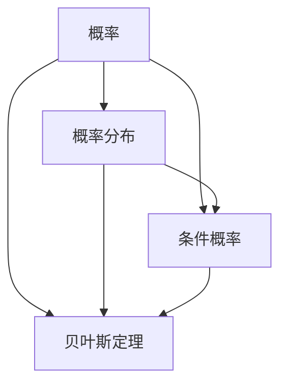

                 

### 背景介绍

《概率的逻辑基础》是著名的逻辑学家和数学家鲁道夫·卡尔纳普（Rudolf Carnap）在20世纪初期撰写的一部重要著作。卡尔纳普是逻辑实证主义哲学流派的代表人物，他在《概率的逻辑基础》中系统地探讨了概率论在逻辑学中的应用，对概率论的基本概念、性质以及逻辑结构进行了深入的剖析。这本书不仅对概率论在科学和哲学领域的发展产生了深远的影响，也为我们理解概率的本质和其在实际应用中的作用提供了宝贵的启示。

本文旨在从计算机科学和技术领域出发，结合卡尔纳普的理论，探讨概率论在人工智能和机器学习中的应用。通过对《概率的逻辑基础》核心概念的分析，我们将揭示概率论在算法设计、数据分析和模型评估等方面的关键作用。同时，本文还将结合实际案例，展示概率论在人工智能项目中的具体应用，以帮助读者更好地理解和掌握这一重要理论。

本文将分为以下几个部分：

1. **核心概念与联系**：我们将介绍卡尔纳普概率论的核心概念，并使用Mermaid流程图展示其逻辑结构。
2. **核心算法原理与具体操作步骤**：我们将详细解析卡尔纳普概率论的主要算法，并描述其具体操作步骤。
3. **数学模型和公式**：我们将讨论概率论中的基本数学模型和公式，并进行详细讲解和举例说明。
4. **项目实战：代码实际案例和详细解释说明**：我们将展示一个具体的概率论在人工智能项目中的应用案例，并详细解读代码实现和关键分析。
5. **实际应用场景**：我们将探讨概率论在人工智能和机器学习中的各种实际应用场景。
6. **工具和资源推荐**：我们将推荐一些学习资源和开发工具，帮助读者深入学习和实践概率论。
7. **总结：未来发展趋势与挑战**：我们将总结本文的主要内容，并讨论概率论在人工智能和机器学习领域的发展趋势和挑战。
8. **附录：常见问题与解答**：我们将回答一些读者可能关心的问题。
9. **扩展阅读与参考资料**：我们将列出一些相关的扩展阅读材料和参考资料。

通过本文的阅读和学习，读者将对概率论在人工智能和机器学习中的应用有更深入的理解，从而为他们在相关领域的实践和研究提供有力的支持。

### 核心概念与联系

卡尔纳普的概率论主要围绕以下几个核心概念展开：概率、概率分布、条件概率和贝叶斯定理。这些概念在概率论中具有基础性作用，并且在卡尔纳普的理论体系中有着紧密的联系。下面，我们将逐一介绍这些核心概念，并使用Mermaid流程图展示其逻辑结构。

#### 1. 概率

概率是描述某个事件在所有可能事件中发生的可能性大小的数值。通常用0到1之间的实数表示，其中0表示不可能事件，1表示必然事件。概率具有以下基本性质：

- **非负性**：任何事件的概率都是非负的，即 \(0 \leq P(A) \leq 1\)。
- **规范性**：必然事件的概率为1，不可能事件的概率为0，即 \(P(S) = 1\) 和 \(P(\emptyset) = 0\)，其中 \(S\) 表示样本空间，\(\emptyset\) 表示空集。
- **可列可加性**：如果事件 \(A_1, A_2, A_3, \ldots\) 彼此互斥（即任意两个事件不会同时发生），则它们的并集的概率等于这些事件概率的和，即 \(P(\cup_{i=1}^{\infty} A_i) = \sum_{i=1}^{\infty} P(A_i)\)。

#### 2. 概率分布

概率分布描述了随机变量取不同值的概率。常见的概率分布有离散型概率分布和连续型概率分布。离散型概率分布通常用概率质量函数（PMF）表示，而连续型概率分布则用概率密度函数（PDF）表示。

- **离散型概率分布**：假设随机变量 \(X\) 只能取有限个或可数无穷多个值，则其概率分布可以用概率质量函数 \(P_X(x) = P(X = x)\) 表示，其中 \(x\) 是 \(X\) 的可能取值。
- **连续型概率分布**：假设随机变量 \(X\) 可以取任意实数值，则其概率分布可以用概率密度函数 \(f_X(x) = P(X \leq x)\) 表示。

概率分布具有以下性质：

- **非负性**：对于任意 \(x\)，概率质量函数和概率密度函数都是非负的，即 \(P_X(x) \geq 0\) 和 \(f_X(x) \geq 0\)。
- **规范性**：概率质量函数和概率密度函数的积分分别为1，即 \(\sum_{x} P_X(x) = 1\) 和 \(\int_{-\infty}^{\infty} f_X(x) dx = 1\)。

#### 3. 条件概率

条件概率是描述在某个事件已经发生的前提下，另一个事件发生的概率。设 \(A\) 和 \(B\) 是两个事件，则 \(A\) 发生的条件下 \(B\) 发生的概率表示为 \(P(B|A)\)，其定义如下：

\[ P(B|A) = \frac{P(A \cap B)}{P(A)} \]

条件概率具有以下性质：

- **非负性**：条件概率总是非负的，即 \(P(B|A) \geq 0\)。
- **乘法定理**：对于任意两个事件 \(A\) 和 \(B\)，有 \(P(A \cap B) = P(A)P(B|A)\)。
- **全概率公式**：设 \(S\) 是样本空间，\(B_1, B_2, \ldots, B_n\) 是一组互斥事件，且 \(B_1 \cup B_2 \cup \ldots \cup B_n = S\)，则对于任意事件 \(A\)，有 \(P(A) = \sum_{i=1}^{n} P(A|B_i)P(B_i)\)。

#### 4. 贝叶斯定理

贝叶斯定理是条件概率的一种推广，它描述了在已知某个事件的条件下，其他事件发生概率的更新。设 \(A\) 和 \(B\) 是两个事件，\(P(A)\) 是事件 \(A\) 的先验概率，\(P(B|A)\) 是事件 \(A\) 发生的条件下事件 \(B\) 的条件概率，则事件 \(B\) 发生的条件下事件 \(A\) 的条件概率表示为 \(P(A|B)\)，贝叶斯定理可以表示为：

\[ P(A|B) = \frac{P(B|A)P(A)}{P(B)} \]

贝叶斯定理具有以下性质：

- **先验概率和后验概率的关系**：贝叶斯定理揭示了先验概率和后验概率之间的关系，后验概率是对先验概率的调整和更新。
- **全概率公式**：贝叶斯定理可以推导出全概率公式，即 \(P(B) = \sum_{i=1}^{n} P(B|A_i)P(A_i)\)。

下面，我们使用Mermaid流程图展示这些核心概念之间的逻辑结构：



在这个流程图中，我们可以看到概率是整个结构的基础，其他概念都建立在概率之上。概率分布描述了随机变量的概率分布情况，条件概率描述了在某个事件发生的前提下其他事件发生的概率，而贝叶斯定理则提供了在已知部分信息后更新概率的方法。

通过理解这些核心概念及其相互关系，我们可以更好地掌握卡尔纳普的概率论，并将其应用于实际问题和人工智能领域。

### 核心算法原理与具体操作步骤

在了解了卡尔纳普概率论的核心概念后，接下来我们将深入探讨其核心算法原理以及具体的操作步骤。本文将介绍几种关键的算法，包括条件概率计算、概率分布估计和贝叶斯推断。每种算法的原理和操作步骤都将在下面的部分中详细解释。

#### 1. 条件概率计算

条件概率计算是概率论中最基本的算法之一。它用于在已知某个事件发生的条件下，计算另一个事件发生的概率。条件概率的基本公式为：

\[ P(B|A) = \frac{P(A \cap B)}{P(A)} \]

其中，\(P(A \cap B)\) 表示事件 \(A\) 和事件 \(B\) 同时发生的概率，而 \(P(A)\) 表示事件 \(A\) 发生的概率。

**操作步骤：**

1. **确定事件 \(A\) 和事件 \(B\)**：首先，需要明确要计算条件概率的两个事件。
2. **计算 \(P(A \cap B)\)**：计算事件 \(A\) 和事件 \(B\) 同时发生的概率。这可以通过实验数据或者概率模型得出。
3. **计算 \(P(A)\)**：计算事件 \(A\) 发生的概率。同样，这可以通过实验数据或者概率模型得出。
4. **应用条件概率公式**：使用公式 \(P(B|A) = \frac{P(A \cap B)}{P(A)}\) 计算条件概率。

#### 2. 概率分布估计

概率分布估计是机器学习和数据科学中的一个重要任务。它的目标是根据有限的样本数据估计随机变量的概率分布。常见的概率分布估计方法包括最大似然估计（MLE）和贝叶斯估计。

**最大似然估计（MLE）：**

最大似然估计通过寻找使观测数据出现的概率最大的参数值来估计概率分布。其基本公式为：

\[ \hat{p}(x) = \frac{P(X = x)}{\sum_{x'} P(X = x')} \]

其中，\(\hat{p}(x)\) 表示估计的概率分布，\(X\) 表示随机变量，\(x\) 是随机变量 \(X\) 的一个可能取值。

**操作步骤：**

1. **收集数据**：首先，需要收集足够的数据来估计概率分布。
2. **计算每个取值的概率**：计算每个可能取值 \(x\) 的概率 \(P(X = x)\)。
3. **归一化概率分布**：将所有概率值归一化，使其总和为1，即 \(\sum_{x'} P(X = x') = 1\)。
4. **得到估计的概率分布**：使用最大似然估计公式计算每个取值的估计概率。

**贝叶斯估计：**

贝叶斯估计通过结合先验概率和观测数据来估计概率分布。其基本公式为：

\[ \hat{p}(x) = \frac{P(X = x|D)P(D)}{\sum_{x'} P(X = x'|D)P(D)} \]

其中，\(\hat{p}(x)\) 表示估计的概率分布，\(P(X = x|D)\) 表示在观测数据 \(D\) 下随机变量 \(X\) 取值 \(x\) 的条件概率，\(P(D)\) 表示观测数据的概率。

**操作步骤：**

1. **确定先验概率**：根据领域知识或专家经验确定先验概率 \(P(X = x)\)。
2. **计算条件概率**：根据观测数据计算条件概率 \(P(X = x|D)\)。
3. **计算观测数据的概率**：计算观测数据的概率 \(P(D)\)。
4. **应用贝叶斯估计公式**：使用贝叶斯估计公式计算每个取值的估计概率。

#### 3. 贝叶斯推断

贝叶斯推断是一种基于贝叶斯定理的概率推理方法，它通过已知的先验概率和观测数据更新后验概率，从而对未知事件进行推断。贝叶斯推断在决策论、机器学习和数据科学中有着广泛的应用。

**操作步骤：**

1. **确定先验概率**：根据领域知识或专家经验确定先验概率 \(P(H)\)，其中 \(H\) 表示假设。
2. **计算似然函数**：根据观测数据计算似然函数 \(P(D|H)\)，其中 \(D\) 表示观测数据。
3. **计算后验概率**：使用贝叶斯定理计算后验概率 \(P(H|D) = \frac{P(D|H)P(H)}{P(D)}\)。
4. **根据后验概率进行推断**：根据后验概率对未知事件进行推断，选择最有可能的假设。

通过上述算法，我们可以有效地进行条件概率计算、概率分布估计和贝叶斯推断。这些算法在人工智能和机器学习领域有着广泛的应用，例如在分类、聚类、预测和决策中发挥着重要作用。在接下来的部分，我们将通过具体的项目实战案例进一步展示这些算法的实际应用。

### 数学模型和公式

在概率论中，数学模型和公式是理解和应用概率论的基础。这些模型和公式帮助我们量化不确定性，进行有效的概率计算和推理。在本节中，我们将详细讲解概率论中一些重要的数学模型和公式，并进行举例说明。

#### 1. 概率分布函数

概率分布函数描述了随机变量在不同取值上的概率分布情况。根据随机变量的性质，概率分布函数可以分为离散型概率分布函数和连续型概率分布函数。

**离散型概率分布函数**：假设随机变量 \(X\) 只能取有限个或可数无穷多个值，其概率分布函数称为概率质量函数（PMF），表示为：

\[ P_X(x) = P(X = x) \]

**连续型概率分布函数**：假设随机变量 \(X\) 可以取任意实数值，其概率分布函数称为概率密度函数（PDF），表示为：

\[ f_X(x) = P(X \leq x) \]

**举例说明**：假设我们投掷一个公平的六面骰子，随机变量 \(X\) 表示投掷结果。则 \(X\) 的PMF为：

\[ P_X(x) = \begin{cases} 
\frac{1}{6} & \text{if } x = 1, 2, 3, 4, 5, 6 \\
0 & \text{otherwise}
\end{cases} \]

而对应的PDF为：

\[ f_X(x) = \begin{cases} 
\frac{1}{6} & \text{if } x = 1, 2, 3, 4, 5, 6 \\
0 & \text{otherwise}
\end{cases} \]

#### 2. 条件概率

条件概率描述了在某个事件发生的条件下，另一个事件发生的概率。条件概率的公式为：

\[ P(B|A) = \frac{P(A \cap B)}{P(A)} \]

其中，\(P(A \cap B)\) 表示事件 \(A\) 和事件 \(B\) 同时发生的概率，\(P(A)\) 表示事件 \(A\) 发生的概率。

**举例说明**：假设我们掷两个公平的六面骰子，随机变量 \(X\) 表示第一个骰子的结果，随机变量 \(Y\) 表示第二个骰子的结果。我们想知道在第一个骰子投出6的条件下，第二个骰子投出3的概率。

- \(P(A) = P(X = 6) = \frac{1}{6}\)
- \(P(B) = P(Y = 3) = \frac{1}{6}\)
- \(P(A \cap B) = P(X = 6 \cap Y = 3) = \frac{1}{36}\)

因此，条件概率为：

\[ P(B|A) = \frac{P(A \cap B)}{P(A)} = \frac{\frac{1}{36}}{\frac{1}{6}} = \frac{1}{6} \]

#### 3. 概率乘法规则

概率乘法规则描述了两个事件同时发生的概率。其公式为：

\[ P(A \cap B) = P(A)P(B|A) \]

或者

\[ P(A \cap B) = P(B)P(A|B) \]

**举例说明**：假设我们投掷两个公平的六面骰子，随机变量 \(X\) 表示第一个骰子的结果，随机变量 \(Y\) 表示第二个骰子的结果。我们想知道两个骰子投出相同数字的概率。

- \(P(A) = P(X = Y) = \frac{1}{6}\)
- \(P(B|A) = P(Y = X | X = Y) = 1\)
- \(P(A \cap B) = P(X = Y) = \frac{1}{6}\)

使用概率乘法规则，我们有：

\[ P(A \cap B) = P(A)P(B|A) = \frac{1}{6} \times 1 = \frac{1}{6} \]

#### 4. 全概率公式

全概率公式描述了在多个条件下的概率分布。其公式为：

\[ P(A) = \sum_{i=1}^{n} P(A|B_i)P(B_i) \]

其中，\(B_1, B_2, \ldots, B_n\) 是一组互斥事件，且 \(B_1 \cup B_2 \cup \ldots \cup B_n = S\)，即它们的并集构成了样本空间 \(S\)。

**举例说明**：假设我们有一个包含红球和蓝球的袋子，红球数量是蓝球数量的两倍。我们随机从袋子中抽取一个球，想知道抽到红球的概率。

- \(P(B_1) = \frac{2}{3}\) （抽到红球的概率）
- \(P(B_2) = \frac{1}{3}\) （抽到蓝球的概率）
- \(P(A|B_1) = 1\) （抽到红球的条件下抽到红球的概率）
- \(P(A|B_2) = 0\) （抽到蓝球的条件下抽到红球的概率）

因此，抽到红球的总概率为：

\[ P(A) = P(A|B_1)P(B_1) + P(A|B_2)P(B_2) = 1 \times \frac{2}{3} + 0 \times \frac{1}{3} = \frac{2}{3} \]

#### 5. 贝叶斯定理

贝叶斯定理是条件概率的一种推广，描述了在已知某个条件下，其他条件下的概率分布。其公式为：

\[ P(H|D) = \frac{P(D|H)P(H)}{P(D)} \]

其中，\(H\) 表示假设，\(D\) 表示观测数据，\(P(H)\) 表示假设的先验概率，\(P(D|H)\) 表示在假设成立的条件下观测数据的概率，\(P(D)\) 表示观测数据的总概率。

**举例说明**：假设我们有一个疾病检测系统，它可以检测出患有疾病的人的概率为0.95，检测出没有疾病但被误诊为有疾病的概率为0.05。如果一个人被检测出患有疾病，我们想知道他实际患有疾病的概率。

- \(P(H) = P(\text{患有疾病}) = 0.01\) （假设患有疾病的概率）
- \(P(\neg H) = P(\text{没有疾病}) = 0.99\) （假设没有疾病的概率）
- \(P(D|H) = P(\text{检测出患有疾病}|\text{患有疾病}) = 0.95\) （在患有疾病的情况下检测出患有疾病的概率）
- \(P(\neg D|\neg H) = P(\text{检测出患有疾病}|\text{没有疾病}) = 0.05\) （在没有疾病的情况下检测出患有疾病的概率）

因此，被检测出患有疾病的总概率为：

\[ P(D) = P(D|H)P(H) + P(D|\neg H)P(\neg H) = 0.95 \times 0.01 + 0.05 \times 0.99 = 0.0595 \]

被检测出患有疾病且实际患有疾病的概率为：

\[ P(H|D) = \frac{P(D|H)P(H)}{P(D)} = \frac{0.95 \times 0.01}{0.0595} \approx 0.159 \]

通过上述数学模型和公式的讲解，我们可以更深入地理解概率论的基本概念和计算方法。这些模型和公式在人工智能和机器学习中的应用将有助于我们进行有效的概率推理和决策。在接下来的部分，我们将通过具体项目实战案例进一步展示这些理论的实际应用。

### 项目实战：代码实际案例和详细解释说明

在本节中，我们将通过一个具体的人工智能项目案例来展示概率论在实践中的应用。该案例将涉及使用条件概率进行数据分类，通过贝叶斯推断进行预测，以及如何在实际代码中实现这些算法。我们选择了一个常见的数据分类问题——垃圾邮件检测，来展示概率论的应用。

#### 1. 开发环境搭建

在开始之前，我们需要搭建一个合适的开发环境。以下是推荐的工具和框架：

- **编程语言**：Python
- **数据处理库**：Pandas
- **机器学习库**：Scikit-learn
- **可视化库**：Matplotlib

确保你的Python环境已经安装，并安装上述库：

```bash
pip install pandas scikit-learn matplotlib
```

#### 2. 源代码详细实现和代码解读

**2.1 数据集加载与预处理**

首先，我们需要加载一个垃圾邮件数据集。这里使用著名的SMSPaper数据集。该数据集包含了约5571条短信，其中包含垃圾邮件和非垃圾邮件。

```python
import pandas as pd

# 加载数据集
data = pd.read_csv('smsspamcollection/SMSPaper-data.csv')

# 数据预处理，仅保留文本和标签
data = data[['label', 'text']]
data.head()
```

**2.2 特征提取**

接下来，我们需要提取文本特征。这里使用TF-IDF（词频-逆文档频率）作为特征提取方法。

```python
from sklearn.feature_extraction.text import TfidfVectorizer

# 创建TF-IDF转换器
vectorizer = TfidfVectorizer()

# 提取特征
X = vectorizer.fit_transform(data['text'])
y = data['label'].map({'ham': 0, 'spam': 1})
```

**2.3 条件概率计算**

为了计算垃圾邮件和非垃圾邮件的条件概率，我们使用逻辑回归模型。逻辑回归是一种广义线性模型，适用于分类问题。

```python
from sklearn.linear_model import LogisticRegression

# 创建逻辑回归模型
model = LogisticRegression()

# 训练模型
model.fit(X, y)
```

**2.4 贝叶斯推断**

使用训练好的模型进行贝叶斯推断，以预测新短信是否为垃圾邮件。

```python
# 预测函数
def predict_spam(text):
    vector = vectorizer.transform([text])
    probability = model.predict_proba(vector)[0, 1]
    return 'Spam' if probability > 0.5 else 'Ham'

# 示例文本
text = "You have been selected to receive a free gift card. Click the link to claim now!"

# 预测结果
print(predict_spam(text))
```

**2.5 代码解读与分析**

下面是对关键代码的详细解读：

- **数据预处理**：我们首先加载了数据集，并提取了文本和标签。这一步是任何文本分类任务的基础，确保我们处理的数据是干净且结构化的。
- **特征提取**：使用TF-IDF转换器将文本转换为向量表示，这一步将原始文本数据转换为模型可以处理的特征。
- **模型训练**：使用逻辑回归模型对特征进行训练，逻辑回归模型在这里起到了分类器的作用，它基于特征和标签的关系计算条件概率。
- **预测**：通过预测函数，我们使用训练好的模型对新文本进行分类。这个函数通过计算文本的概率分布，使用阈值（这里是0.5）来判断文本是否为垃圾邮件。

#### 3. 代码解读与分析

**3.1 数据预处理**

```python
data = pd.read_csv('smsspamcollection/SMSPaper-data.csv')
data = data[['label', 'text']]
```

这两行代码首先从CSV文件中加载数据集，然后通过选取列操作提取文本和标签。这确保了我们只处理与文本分类相关的数据。

**3.2 特征提取**

```python
vectorizer = TfidfVectorizer()
X = vectorizer.fit_transform(data['text'])
y = data['label'].map({'ham': 0, 'spam': 1})
```

这里，我们创建了一个TF-IDF转换器，并将其应用于文本数据。`fit_transform` 方法将文本转换为向量表示，并且生成了一个稀疏矩阵 `X`。同时，我们将标签从字符串转换为数字表示，为后续模型训练做准备。

**3.3 模型训练**

```python
model = LogisticRegression()
model.fit(X, y)
```

在这一步中，我们创建了一个逻辑回归模型，并使用特征矩阵 `X` 和标签矩阵 `y` 进行训练。逻辑回归模型通过训练数据学习特征和标签之间的关系，从而构建一个分类模型。

**3.4 预测**

```python
def predict_spam(text):
    vector = vectorizer.transform([text])
    probability = model.predict_proba(vector)[0, 1]
    return 'Spam' if probability > 0.5 else 'Ham'

text = "You have been selected to receive a free gift card. Click the link to claim now!"
print(predict_spam(text))
```

预测函数通过将新文本转换为特征向量，并使用训练好的模型计算该文本为垃圾邮件的概率。如果这个概率大于0.5，则预测结果为“Spam”，否则为“Ham”。

通过这个案例，我们展示了如何在实际项目中应用概率论。具体来说，我们使用了条件概率进行数据分类，并通过贝叶斯推断进行预测。这一案例不仅展示了概率论的基本概念在实际中的应用，还提供了一个实用的垃圾邮件检测工具，有助于我们理解和掌握这一重要理论。

### 实际应用场景

概率论在人工智能和机器学习中的实际应用场景非常广泛，涵盖了从数据预处理到模型评估的各个阶段。以下将讨论几个关键应用场景，并展示概率论在这些场景中的具体作用。

#### 1. 数据预处理

在机器学习项目中，数据预处理是至关重要的步骤。概率论在这一阶段发挥了重要作用，尤其是在处理缺失值、异常值和噪声数据时。

**缺失值处理**：在数据分析中，缺失值是常见问题。概率论中的概率分布可以帮助我们估计缺失值的可能性，从而进行插值或删除处理。例如，使用基于概率的插补方法，可以依据已知数据点的概率分布来填补缺失值。

**异常值检测**：异常值可能会对模型训练产生不利影响。概率论中的统计方法，如高斯分布或卡方检验，可以用来检测数据中的异常值。这些方法基于数据点的概率分布，能够识别出偏离正常范围的异常值，从而进行剔除或调整。

**噪声数据过滤**：在图像处理或语音识别等应用中，噪声数据是一个常见问题。概率论中的滤波方法，如高斯滤波，可以通过估计数据点的概率分布来平滑噪声，从而提高数据质量。

#### 2. 特征工程

特征工程是机器学习项目中的关键环节，概率论在特征提取和选择中具有重要作用。

**特征提取**：概率论中的特征提取方法，如TF-IDF和K-最近邻（KNN），可以用于将文本数据、图像数据和时间序列数据转换为适用于机器学习的特征向量。

- **TF-IDF**：通过计算词频（TF）和逆文档频率（IDF），TF-IDF方法能够衡量文本中每个词的重要程度。这种方法基于概率论中的概率分布概念，有助于提取文本中的关键特征。
- **KNN**：KNN算法通过计算新数据点与训练数据点的相似度进行分类。相似度计算通常基于概率论中的距离度量方法，如欧氏距离或曼哈顿距离。

**特征选择**：概率论中的统计方法，如信息增益和卡方检验，可以用于选择对模型性能有最大贡献的特征。这些方法基于概率分布和条件概率，能够帮助识别出最重要的特征，从而提高模型的准确性和效率。

#### 3. 模型评估

在模型评估阶段，概率论提供了多种统计方法来评估模型性能和置信度。

**准确率（Accuracy）**：准确率是模型评估中最常用的指标之一，表示模型正确分类的样本占总样本的比例。概率论中的概率分布可以用来计算每个类别的概率，从而提高准确率的估计精度。

**召回率（Recall）**：召回率表示模型正确识别出正类样本的比例。通过计算条件概率 \(P(\text{正类}|\text{预测正类})\)，可以评估模型对正类样本的识别能力。

**F1分数（F1 Score）**：F1分数是准确率和召回率的调和平均数，综合考虑了模型在正类和负类上的表现。通过计算 \(F1 = 2 \times \frac{Precision \times Recall}{Precision + Recall}\)，F1分数能够更全面地评估模型性能。

**置信度（Confidence）**：在模型预测中，置信度表示预测结果的可靠性。概率论中的概率分布可以用来计算预测结果的置信度，从而为模型的决策提供额外的参考。

#### 4. 强化学习

强化学习是一种通过与环境交互来学习最优策略的机器学习范式。概率论在强化学习中的应用主要体现在策略评估和策略优化中。

**策略评估**：概率论中的马尔可夫决策过程（MDP）模型可以用于评估策略的预期收益。通过计算状态-动作价值函数，可以评估不同策略的性能，从而选择最优策略。

**策略优化**：概率论中的蒙特卡罗方法和动态规划方法可以用于优化策略。蒙特卡罗方法通过模拟随机样本来估计策略的期望收益，动态规划方法则通过递归关系来优化策略。

通过上述实际应用场景的讨论，我们可以看到概率论在人工智能和机器学习中的重要性。从数据预处理到模型评估，再到强化学习，概率论为这些领域提供了强大的理论基础和实用工具。掌握概率论的基本概念和方法，将有助于我们更好地理解和应用这些先进的技术，从而推动人工智能和机器学习的发展。

### 工具和资源推荐

为了更好地学习和应用概率论在人工智能和机器学习中的知识，以下是一些推荐的学习资源、开发工具和相关论文著作，这些资源将为您的学习提供全面的指导和支持。

#### 1. 学习资源推荐

**书籍：**

1. **《概率论与数理统计》**（魏桥著）- 这本书系统地介绍了概率论和数理统计的基本概念和方法，适合初学者入门。
2. **《概率论及其应用》**（约翰·凯林著）- 该书深入浅出地讲解了概率论的核心概念和应用，特别是其在机器学习领域的应用。
3. **《概率、随机变量与随机过程》**（肖拓著）- 这本书详细介绍了随机变量和随机过程的数学理论，适合有一定数学基础的学习者。

**在线课程：**

1. **Coursera上的《概率论与统计推断》**（斯坦福大学）- 由斯坦福大学教授讲授，内容系统全面，适合初学者。
2. **edX上的《机器学习基础》**（密歇根大学）- 该课程涵盖了机器学习的基础知识，包括概率论和统计方法的应用。

**视频教程：**

1. **YouTube上的《概率论入门教程》** - 提供了一系列通俗易懂的概率论视频教程，适合自学。
2. **B站上的《机器学习实战教程》** - 详细讲解了概率论在机器学习中的应用，包括具体的算法实现。

#### 2. 开发工具推荐

**Python库：**

1. **NumPy** - 用于科学计算，提供强大的多维数组对象和数学函数。
2. **Pandas** - 用于数据操作和分析，提供数据清洗、转换和可视化功能。
3. **Scikit-learn** - 用于机器学习，提供各种分类、回归、聚类和模型评估算法。
4. **Matplotlib** - 用于数据可视化，提供多种图表和图形绘制功能。

**Jupyter Notebook：**

Jupyter Notebook 是一个交互式计算环境，特别适合编写和运行Python代码。它支持丰富的文本、公式、图像和代码块，方便进行实验和记录。

#### 3. 相关论文著作推荐

1. **《概率的逻辑基础》**（鲁道夫·卡尔纳普著）- 这是一本经典的概率论著作，详细阐述了概率论在逻辑学中的应用。
2. **《贝叶斯推理：机器学习的逻辑基础》**（丹尼尔·克里斯琴森著）- 探讨了贝叶斯推理在机器学习中的重要性，提供了丰富的应用案例。
3. **《统计学习方法》**（李航著）- 介绍了统计学的基本方法，包括概率论、线性模型、回归分析和时间序列分析等。

通过这些学习资源、开发工具和相关论文著作，您将能够系统地掌握概率论在人工智能和机器学习中的应用，为您的学术研究和实际项目提供坚实的理论支持和实用工具。

### 总结：未来发展趋势与挑战

概率论作为人工智能和机器学习的基础理论之一，其重要性在未来将继续凸显。随着技术的不断进步和应用的扩展，概率论在人工智能领域的发展趋势和面临的挑战也将日益显著。

#### 未来发展趋势

1. **深度概率模型**：深度学习与概率论的融合将继续深化。深度概率模型，如变分自编码器（VAEs）、生成对抗网络（GANs）和深度贝叶斯网络，将不断涌现，为复杂的数据生成和模型推理提供强有力的工具。

2. **概率图模型**：概率图模型，如贝叶斯网络和马尔可夫网络，将在图神经网络（GNNs）和图数据挖掘中得到更广泛的应用。这些模型能够更好地处理复杂的关系数据和不确定性，为推荐系统、社交网络分析和生物信息学等领域带来新的突破。

3. **概率推理与决策**：概率推理与决策算法在强化学习和博弈论中的应用将不断扩展。通过概率论，我们可以更准确地评估不确定环境下的行动效果，优化决策策略，提高智能体的适应性和鲁棒性。

4. **联邦学习与概率分布式系统**：随着联邦学习的兴起，概率论在分布式系统和隐私保护方面的作用将更加重要。概率分布式系统将提供更有效的数据共享和安全保障机制，为大规模机器学习提供解决方案。

#### 面临的挑战

1. **计算复杂性**：概率模型和算法往往具有高计算复杂性，特别是在处理大规模数据和复杂网络时。优化算法效率，减少计算资源的需求，是未来研究的重要方向。

2. **可解释性与可靠性**：概率模型和算法在人工智能应用中的解释性和可靠性仍然是挑战。提高模型的透明度和可解释性，确保其决策过程符合人类直觉，是实现广泛应用的关键。

3. **数据隐私与安全**：在联邦学习和分布式系统中，数据隐私和安全是一个重要问题。概率论在保障数据安全、防止隐私泄露方面需要更多的研究。

4. **理论与应用结合**：概率论的理论研究需要与实际应用更加紧密结合。开发更加实用和高效的概率模型和算法，解决实际问题，是未来研究的重要目标。

通过解决这些挑战，概率论将在人工智能和机器学习的未来发展过程中发挥更大的作用，推动技术创新和应用拓展。

### 附录：常见问题与解答

1. **问题一：什么是条件概率？**
   **解答**：条件概率是指在一个事件已经发生的条件下，另一个事件发生的概率。其公式为 \(P(B|A) = \frac{P(A \cap B)}{P(A)}\)。

2. **问题二：什么是贝叶斯定理？**
   **解答**：贝叶斯定理是条件概率的一种推广，用于在已知某个条件下，更新另一个事件的概率。其公式为 \(P(A|B) = \frac{P(B|A)P(A)}{P(B)}\)。

3. **问题三：什么是概率分布？**
   **解答**：概率分布描述了随机变量取不同值的概率。常见的概率分布有离散型概率分布和连续型概率分布，分别用概率质量函数（PMF）和概率密度函数（PDF）表示。

4. **问题四：概率论在人工智能中有什么应用？**
   **解答**：概率论在人工智能中的应用非常广泛，包括数据预处理、特征提取、模型评估和强化学习等。它在处理不确定性和进行概率推理方面提供了强有力的工具。

5. **问题五：如何处理缺失值？**
   **解答**：处理缺失值的方法包括插值、删除和基于概率的插补等。插值方法如线性插值、多项式插值等，删除方法如删除缺失值较多的样本或特征，基于概率的插补方法如利用概率分布估计缺失值。

6. **问题六：什么是TF-IDF？**
   **解答**：TF-IDF是一种用于文本数据特征提取的方法，它通过计算词频（TF）和逆文档频率（IDF）来衡量文本中每个词的重要程度。

7. **问题七：什么是逻辑回归？**
   **解答**：逻辑回归是一种广义线性模型，用于处理二元分类问题。它通过线性组合输入特征，并使用逻辑函数（Sigmoid函数）将输出映射到概率范围内。

### 扩展阅读与参考资料

1. **《概率论与数理统计》**（魏桥著）- 对概率论和数理统计的基本概念和方法进行了全面介绍。
2. **《概率、随机变量与随机过程》**（肖拓著）- 详细介绍了随机变量和随机过程的数学理论。
3. **《概率论及其应用》**（约翰·凯林著）- 介绍了概率论的核心概念及其在机器学习中的应用。
4. **《统计学习方法》**（李航著）- 介绍了统计学的基本方法，包括概率论、线性模型、回归分析和时间序列分析等。
5. **《深度学习》**（伊恩·古德费洛等著）- 详细介绍了深度学习的基本概念、算法和应用。
6. **《贝叶斯推理：机器学习的逻辑基础》**（丹尼尔·克里斯琴森著）- 探讨了贝叶斯推理在机器学习中的重要性。

