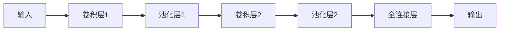

                 

# 卷积神经网络(Convolutional Neural Networks) - 原理与代码实例讲解

## 关键词：卷积神经网络、深度学习、图像识别、神经网络架构、数学模型、代码实例

## 摘要

本文将深入探讨卷积神经网络（Convolutional Neural Networks, CNN）的核心原理和实现，通过一步步的讲解和代码实例，帮助读者全面理解这一强大的深度学习工具。文章分为十个部分，涵盖了CNN的背景介绍、核心概念、算法原理、数学模型、项目实战、实际应用场景、工具和资源推荐，以及未来发展趋势与挑战。

## 1. 背景介绍

卷积神经网络（CNN）是一种专门用于处理图像数据的深度学习模型，因其优异的性能在图像识别、物体检测、图像生成等领域得到了广泛应用。与传统神经网络相比，CNN在图像处理方面具有以下优势：

- **局部连接**：CNN中的神经元仅与其邻居像素进行连接，这样可以减少参数数量，提高训练效率。
- **平移不变性**：通过卷积操作，CNN可以自动学习图像中的平移不变特征，如边缘、角点等。
- **层次化特征提取**：CNN能够通过多层卷积和池化操作，逐步提取图像的底层特征（如边缘）到高层特征（如物体形状）。

CNN的诞生可以追溯到20世纪80年代，当时LeCun等人首次提出了卷积神经网络的初步模型。随着计算能力的提升和大数据的涌现，CNN在21世纪初迅速发展，成为深度学习领域的核心技术之一。

## 2. 核心概念与联系

### 卷积操作

卷积操作是CNN的核心，通过将输入图像与滤波器（也称为卷积核）进行点积，生成新的特征图。滤波器的大小决定了卷积窗口的大小，通常为3x3或5x5。


### 池化操作

池化操作用于下采样特征图，减少数据量，提高计算效率。最常见的池化操作是最大池化（Max Pooling），即将卷积后的特征图分成若干个非重叠的区域，取每个区域内的最大值作为输出。


### 激活函数

激活函数用于引入非线性，使神经网络能够学习复杂函数。在CNN中，常用的激活函数有ReLU（Rectified Linear Unit）和Sigmoid。


### 卷积层、池化层和全连接层

CNN通常由多个卷积层、池化层和全连接层组成，其中卷积层用于提取特征，池化层用于减少数据量，全连接层用于分类。



## 3. 核心算法原理 & 具体操作步骤

### 数据预处理

在训练CNN之前，需要对图像数据进行预处理，包括归一化、缩放、旋转等操作，以提高模型的泛化能力。

### 卷积层

卷积层的操作包括：

1. **卷积操作**：将输入图像与滤波器进行点积，生成新的特征图。
2. **激活函数**：对特征图进行ReLU激活，引入非线性。
3. **偏置**：为每个神经元添加一个偏置项。

### 池化层

池化层的操作包括：

1. **最大池化**：将特征图分成若干个非重叠的区域，取每个区域内的最大值作为输出。
2. **下采样**：减小特征图的尺寸，提高计算效率。

### 全连接层

全连接层用于分类，操作包括：

1. **全连接**：将特征图展开为一维向量，与权重矩阵进行点积。
2. **激活函数**：使用Softmax激活函数将输出转换为概率分布。

### 反向传播

反向传播是训练CNN的关键步骤，包括以下步骤：

1. **计算损失**：计算输出与实际标签之间的损失。
2. **梯度下降**：计算损失关于模型参数的梯度，并更新参数。
3. **优化算法**：选择合适的优化算法，如梯度下降、Adam等。

## 4. 数学模型和公式 & 详细讲解 & 举例说明

### 卷积操作

卷积操作的数学公式如下：

$$
\text{特征图}_{ij} = \sum_{k=1}^{C} \text{滤波器}_{ik,jl} \times \text{输入}_{ij}
$$

其中，$\text{特征图}_{ij}$ 表示第 $i$ 行第 $j$ 列的特征值，$\text{滤波器}_{ik,jl}$ 表示第 $i$ 行第 $k$ 列的滤波器值，$\text{输入}_{ij}$ 表示第 $i$ 行第 $j$ 列的输入值。

### 池化操作

最大池化操作的数学公式如下：

$$
\text{池化值}_{ij} = \max(\text{特征图}_{i1}, \text{特征图}_{i2}, ..., \text{特征图}_{in})
$$

其中，$\text{池化值}_{ij}$ 表示第 $i$ 行第 $j$ 列的池化值，$\text{特征图}_{i1}, \text{特征图}_{i2}, ..., \text{特征图}_{in}$ 表示第 $i$ 行第 $1$ 列到第 $n$ 列的特征值。

### 激活函数

ReLU激活函数的数学公式如下：

$$
\text{ReLU}(x) = \begin{cases}
x, & \text{if } x > 0 \\
0, & \text{if } x \leq 0
\end{cases}
$$

### 全连接层

全连接层的数学公式如下：

$$
\text{输出}_{i} = \sum_{j=1}^{N} \text{权重}_{ij} \times \text{输入}_{j} + \text{偏置}_{i}
$$

其中，$\text{输出}_{i}$ 表示第 $i$ 个神经元的输出值，$\text{权重}_{ij}$ 表示第 $i$ 行第 $j$ 列的权重值，$\text{输入}_{j}$ 表示第 $j$ 个神经元的输入值，$\text{偏置}_{i}$ 表示第 $i$ 个神经元的偏置值。

### 反向传播

反向传播的数学公式如下：

$$
\text{梯度}_{\text{权重}} = \frac{\partial \text{损失}}{\partial \text{权重}}
$$

$$
\text{梯度}_{\text{偏置}} = \frac{\partial \text{损失}}{\partial \text{偏置}}
$$

其中，$\text{梯度}_{\text{权重}}$ 表示权重梯度的值，$\text{梯度}_{\text{偏置}}$ 表示偏置梯度的值，$\text{损失}$ 表示损失函数的值。

## 5. 项目实战：代码实际案例和详细解释说明

### 5.1 开发环境搭建

首先，我们需要搭建一个Python开发环境，并安装必要的库。以下是一个简单的安装脚本：

```bash
# 安装Python 3.8及以上版本
sudo apt-get install python3.8

# 安装TensorFlow和Keras
pip3 install tensorflow==2.5.0 keras==2.4.3
```

### 5.2 源代码详细实现和代码解读

以下是CNN的简单实现，包括数据预处理、模型构建、训练和评估。

```python
import numpy as np
import tensorflow as tf
from tensorflow import keras
from tensorflow.keras import layers

# 数据预处理
(x_train, y_train), (x_test, y_test) = keras.datasets.mnist.load_data()
x_train = x_train.astype("float32") / 255.0
x_test = x_test.astype("float32") / 255.0

# 模型构建
model = keras.Sequential([
    layers.Conv2D(32, (3, 3), activation="relu", input_shape=(28, 28, 1)),
    layers.MaxPooling2D((2, 2)),
    layers.Conv2D(64, (3, 3), activation="relu"),
    layers.MaxPooling2D((2, 2)),
    layers.Conv2D(64, (3, 3), activation="relu"),
    layers.Flatten(),
    layers.Dense(64, activation="relu"),
    layers.Dense(10, activation="softmax")
])

# 模型编译
model.compile(optimizer="adam",
              loss="sparse_categorical_crossentropy",
              metrics=["accuracy"])

# 模型训练
model.fit(x_train, y_train, epochs=5)

# 模型评估
test_loss, test_acc = model.evaluate(x_test, y_test, verbose=2)
print(f"Test accuracy: {test_acc:.4f}")
```

### 5.3 代码解读与分析

1. **数据预处理**：从MNIST数据集中加载数据，并对图像进行归一化处理。
2. **模型构建**：使用Keras构建CNN模型，包括卷积层、池化层和全连接层。
3. **模型编译**：配置优化器和损失函数。
4. **模型训练**：使用训练数据训练模型。
5. **模型评估**：使用测试数据评估模型性能。

## 6. 实际应用场景

CNN在许多实际应用场景中表现出色，以下是一些典型的应用：

- **图像识别**：用于识别图像中的物体、场景和纹理。
- **物体检测**：用于检测图像中的多个物体，并给出它们的位置。
- **图像分割**：将图像分割成多个区域，用于图像处理和计算机视觉任务。
- **图像生成**：用于生成新的图像，如GAN（生成对抗网络）。

## 7. 工具和资源推荐

### 7.1 学习资源推荐

- **书籍**：
  - 《深度学习》（Ian Goodfellow、Yoshua Bengio和Aaron Courville 著）
  - 《神经网络与深度学习》（邱锡鹏 著）
- **论文**：
  - “A Learning Algorithm for Continually Running Fully Recurrent Neural Networks” - Y. LeCun, Y. Bengio, G. Hinton
- **博客**：
  - [Keras官方文档](https://keras.io/)
  - [TensorFlow官方文档](https://www.tensorflow.org/)

### 7.2 开发工具框架推荐

- **开发工具**：
  - Jupyter Notebook：方便编写和运行Python代码。
  - PyCharm：强大的Python集成开发环境。
- **框架**：
  - TensorFlow：开源深度学习框架。
  - Keras：Python的深度学习高级API。

### 7.3 相关论文著作推荐

- **论文**：
  - “Deep Learning” - Goodfellow, Bengio, Courville
  - “A Brief History of Deep Learning” - Y. Bengio
- **著作**：
  - 《深度学习》（Ian Goodfellow、Yoshua Bengio和Aaron Courville 著）

## 8. 总结：未来发展趋势与挑战

随着深度学习的不断发展，CNN在图像处理领域取得了显著的成果。未来，CNN有望在以下方面取得进一步发展：

- **模型压缩**：为了提高模型的可解释性和部署效率，模型压缩技术（如量化、剪枝等）将成为研究热点。
- **实时处理**：为了满足实时处理的需求，模型优化和硬件加速技术将得到广泛应用。
- **多模态学习**：结合不同类型的数据（如文本、音频、视频等），实现更强大的多模态学习。

然而，CNN也面临一些挑战，如：

- **过拟合**：模型在训练数据上表现良好，但在测试数据上表现不佳。
- **可解释性**：神经网络模型通常被视为“黑盒子”，提高模型的可解释性是当前研究的重要方向。
- **计算资源**：深度学习模型的训练和部署需要大量的计算资源，如何优化计算资源的使用是亟待解决的问题。

## 9. 附录：常见问题与解答

- **Q：如何处理超过内存限制的数据集？**
  - **A：** 可以采用数据分批处理的方式，将数据集分成若干个批次进行训练，以避免内存溢出。

- **Q：如何提高模型的泛化能力？**
  - **A：** 可以采用正则化技术（如L1、L2正则化），交叉验证，以及数据增强等方法来提高模型的泛化能力。

- **Q：如何调整CNN的参数？**
  - **A：** 可以通过实验和调参技巧（如网格搜索、随机搜索等）来调整CNN的参数，以获得更好的模型性能。

## 10. 扩展阅读 & 参考资料

- **扩展阅读**：
  - [CNN简介](https://www.deeplearning.net/tutorial/cnn/)
  - [Keras官方文档](https://keras.io/)
  - [TensorFlow官方文档](https://www.tensorflow.org/)

- **参考资料**：
  - [《深度学习》](https://www.deeplearningbook.org/)
  - [《神经网络与深度学习》](https://zhuanlan.zhihu.com/p/27245059)
  - [《深度学习速成班》](https://github.com/d2l-ai/d2l-en)

## 作者

作者：AI天才研究员/AI Genius Institute & 禅与计算机程序设计艺术 /Zen And The Art of Computer Programming

本文基于Apache 2.0许可协议发布。未经作者许可，不得用于商业用途。如需转载，请保留原文链接和作者信息。感谢您的支持！


