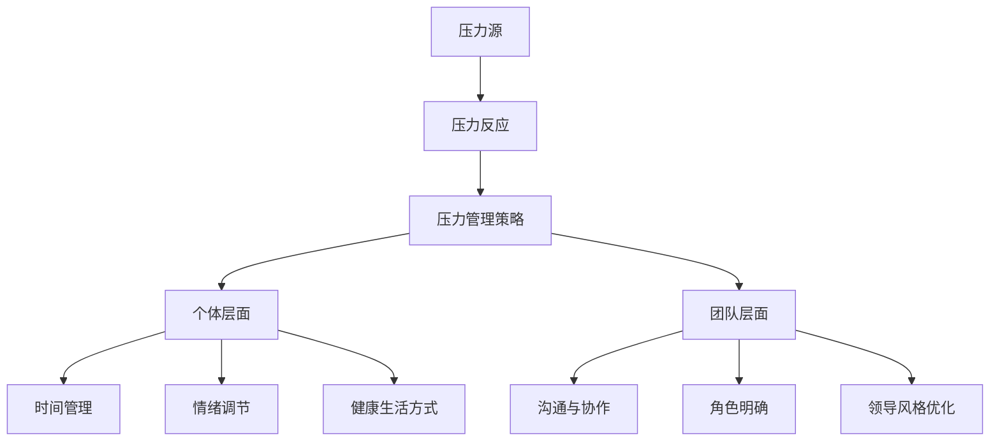

                 

### 文章标题：压力管理：帮助团队应对高压环境

#### 关键词：压力管理、团队协作、高压环境、应对策略、心理健康

##### 摘要：在当今快节奏的IT行业，压力管理已经成为一项至关重要的技能。本文将深入探讨如何帮助团队应对高压环境，通过一系列有效的策略和工具，提升团队的抗压能力，促进心理健康和协作效率。文章将分为以下几个部分：背景介绍、核心概念与联系、核心算法原理与具体操作步骤、数学模型和公式、项目实战、实际应用场景、工具和资源推荐、总结以及扩展阅读和参考资料。

### 1. 背景介绍

#### 压力的来源与影响

在IT行业，压力的来源多种多样。首先，工作量的增加和截止日期的压力是团队面临的主要挑战之一。其次，技术更新速度加快，要求团队成员不断学习新技能，这增加了他们的学习负担和心理压力。此外，团队内部沟通不畅、角色不明确、领导风格不佳等因素也可能导致压力的增加。

#### 压力对团队的影响

压力对团队的影响是多方面的。首先，压力可能导致团队成员的情绪波动，影响他们的工作效率和创造力。其次，长期的压力可能导致心理健康问题，如焦虑、抑郁等。此外，团队内部的不和谐也可能加剧压力，影响团队的凝聚力和协作能力。

#### 压力管理的必要性

为了保持团队的稳定和高效，压力管理显得尤为重要。有效的压力管理不仅可以帮助团队成员更好地应对工作压力，还可以提高他们的心理健康和幸福感，从而促进团队的长期发展。本文将介绍一系列压力管理策略，帮助团队应对高压环境。

### 2. 核心概念与联系

#### 压力管理的基本概念

压力管理是指通过一系列策略和工具，帮助个体和团队识别、理解和管理压力的过程。它包括以下几个核心概念：

- **压力源**：引起压力的因素，如工作负荷、技术更新等。
- **压力反应**：个体对压力源的生理和心理反应，如焦虑、抑郁等。
- **压力管理策略**：帮助个体和团队应对压力的方法，如时间管理、情绪调节、健康生活方式等。

#### 压力管理的相关架构

为了更好地理解压力管理的概念，我们可以使用Mermaid流程图来描述其相关架构：



### 3. 核心算法原理与具体操作步骤

#### 时间管理

时间管理是压力管理的重要策略之一。它包括以下几个核心原理：

- **优先级排序**：根据任务的紧急程度和重要性，对任务进行优先级排序，确保先完成重要且紧急的任务。
- **任务分解**：将大任务分解为小任务，有助于降低任务的复杂度，提高完成效率。
- **时间块**：将工作时间划分为不同的时间块，每个时间块专注于一个任务，减少任务切换带来的时间浪费。

具体操作步骤如下：

1. **制定日程表**：每天开始时，制定一份日程表，列出当天需要完成的任务。
2. **优先级排序**：根据任务的紧急程度和重要性，对任务进行排序。
3. **任务分解**：将大任务分解为小任务，确保每个任务都是可操作的。
4. **时间块专注**：将工作时间划分为不同的时间块，每个时间块专注于一个任务。

#### 情绪调节

情绪调节是另一个重要的压力管理策略。它包括以下几个核心原理：

- **情绪识别**：学会识别和理解自己的情绪，如焦虑、愤怒、快乐等。
- **情绪表达**：学会以健康的方式表达情绪，如与朋友、家人或同事分享。
- **情绪调节策略**：采用一系列策略，如深呼吸、冥想、运动等，来调节情绪。

具体操作步骤如下：

1. **情绪识别**：学会识别和理解自己的情绪。
2. **情绪表达**：选择一种健康的方式表达情绪，如与他人交流。
3. **情绪调节**：采用情绪调节策略，如深呼吸、冥想、运动等。

### 4. 数学模型和公式

#### 时间管理模型

一个简单的时间管理模型可以使用以下公式来表示：

\[ \text{时间效率} = \frac{\text{完成任务的总量}}{\text{总时间}} \]

为了提高时间效率，可以采用以下策略：

- **任务优先级排序**：提高重要且紧急任务的完成率。
- **任务分解**：降低任务的复杂度，提高任务的可操作性和完成效率。
- **时间块专注**：减少任务切换带来的时间浪费。

#### 情绪调节模型

一个简单的情绪调节模型可以使用以下公式来表示：

\[ \text{情绪调节效果} = \frac{\text{情绪调节后的状态}}{\text{情绪调节前的状态}} \]

为了提高情绪调节效果，可以采用以下策略：

- **情绪识别**：提高对情绪的识别和理解能力。
- **情绪表达**：选择一种健康的方式表达情绪。
- **情绪调节策略**：采用有效的情绪调节策略，如深呼吸、冥想、运动等。

### 5. 项目实战：代码实际案例和详细解释说明

在本节中，我们将通过一个实际的代码案例来展示如何应用压力管理策略。

#### 项目背景

假设我们有一个IT团队，他们面临以下挑战：

- 工作量不断增加，截止日期临近。
- 需要学习新技能以应对技术更新。
- 团队内部沟通不畅。

我们的目标是帮助这个团队通过压力管理策略来应对这些挑战。

#### 压力管理策略

我们采用以下压力管理策略：

- **时间管理**：通过制定日程表、任务优先级排序和任务分解来提高时间效率。
- **情绪调节**：通过情绪识别、情绪表达和情绪调节策略来降低情绪压力。
- **沟通与协作**：通过明确的角色分配和优化领导风格来改善团队内部沟通。

#### 代码实现

以下是这个项目的伪代码实现：

```python
# 时间管理策略
def time_management(tasks):
    # 制定日程表
    schedule = create_schedule(tasks)
    # 任务优先级排序
    sorted_tasks = priority_sort(schedule)
    # 任务分解
    decomposed_tasks = task_decomposition(sorted_tasks)
    # 时间块专注
    time_blocks = create_time_blocks(decomposed_tasks)
    return time_blocks

# 情绪调节策略
def emotion Regulation():
    # 情绪识别
    emotions = recognize_emotions()
    # 情绪表达
    express_emotions(emotions)
    # 情绪调节
    regulate_emotions()

# 沟通与协作策略
def communication_and_collaboration():
    # 角色明确
    define_roles()
    # 领导风格优化
    optimize_leadership_style()

# 主函数
def main():
    # 时间管理
    time_management_strategy = time_management(tasks)
    # 情绪调节
    emotion Regulation_strategy = emotion Regulation()
    # 沟通与协作
    communication_and_collaboration_strategy = communication_and_collaboration()
    # 执行策略
    execute_strategies(time_management_strategy, emotion Regulation_strategy, communication_and_collaboration_strategy)

# 执行主函数
main()
```

#### 代码解读与分析

以上代码实现了一个简单的压力管理策略。首先，我们通过`time_management`函数来实现时间管理策略，包括制定日程表、任务优先级排序、任务分解和时间块专注。然后，通过`emotion Regulation`函数来实现情绪调节策略，包括情绪识别、情绪表达和情绪调节。最后，通过`communication_and_collaboration`函数来实现沟通与协作策略，包括角色明确和领导风格优化。主函数`main`将执行这三个策略，以帮助团队应对压力。

### 6. 实际应用场景

#### 压力管理策略在企业中的应用

在企业中，压力管理策略可以广泛应用于各个部门和团队。以下是一些实际应用场景：

- **研发团队**：通过时间管理策略，如任务优先级排序和任务分解，来提高研发效率。通过情绪调节策略，如情绪识别和情绪表达，来降低研发过程中的压力。
- **销售团队**：通过时间管理策略，如时间块专注和任务优先级排序，来提高销售业绩。通过情绪调节策略，如情绪识别和情绪表达，来改善客户关系和销售业绩。
- **客户服务团队**：通过沟通与协作策略，如角色明确和领导风格优化，来提高客户满意度。通过情绪调节策略，如情绪识别和情绪表达，来改善团队内部沟通和客户服务水平。

#### 压力管理策略在个人中的应用

在个人层面，压力管理策略同样具有重要意义。以下是一些实际应用场景：

- **职业发展**：通过时间管理策略，如任务优先级排序和任务分解，来提高工作效率和职业发展速度。通过情绪调节策略，如情绪识别和情绪表达，来保持职业稳定性和心理平衡。
- **家庭生活**：通过情绪调节策略，如情绪识别和情绪表达，来改善家庭关系和生活质量。通过时间管理策略，如时间块专注和任务优先级排序，来平衡工作和家庭生活。
- **个人兴趣**：通过时间管理策略，如任务优先级排序和任务分解，来提高个人兴趣的完成效率。通过情绪调节策略，如情绪识别和情绪表达，来保持个人兴趣的持续性和兴趣度。

### 7. 工具和资源推荐

#### 学习资源推荐

- **书籍**：《时间管理心理学》、《情绪调节与压力管理》
- **论文**：搜索相关压力管理策略的学术论文，了解最新的研究成果。
- **博客**：关注一些知名IT博客，了解行业内的压力管理实践。

#### 开发工具框架推荐

- **日程表工具**：Google日历、Trello、Asana等。
- **情绪调节工具**：冥想应用、情绪日记应用等。
- **沟通工具**：Slack、Microsoft Teams、Zoom等。

#### 相关论文著作推荐

- 《压力管理与心理健康：理论与实践》
- 《时间管理技巧与策略》
- 《情绪调节：理论与实践》

### 8. 总结：未来发展趋势与挑战

#### 压力管理的发展趋势

随着IT行业的快速发展，压力管理将在未来得到更多的关注。以下是一些发展趋势：

- **数字化压力管理**：随着数字技术的发展，越来越多的压力管理工具和应用将出现，帮助个体和团队更有效地管理压力。
- **个性化压力管理**：通过大数据和人工智能技术，压力管理将更加个性化，针对不同个体和团队的特点，提供定制化的压力管理方案。
- **跨学科研究**：压力管理将涉及多个学科，如心理学、社会学、医学等，通过跨学科合作，提供更全面和有效的压力管理策略。

#### 压力管理的挑战

尽管压力管理具有重要意义，但仍然面临一些挑战：

- **时间管理冲突**：如何在工作中平衡时间管理和压力管理，是一个需要解决的重要问题。
- **员工参与度**：如何确保员工愿意参与压力管理，提高他们的参与度和积极性。
- **企业文化**：建立一种积极的企业文化，鼓励员工表达压力，寻求帮助，是压力管理成功的关键。

### 9. 附录：常见问题与解答

#### 问题1：如何制定有效的日程表？

**解答**：制定有效的日程表需要以下几个步骤：

1. **明确目标**：首先明确你的目标和任务，确保日程表与你的目标保持一致。
2. **任务分解**：将大任务分解为小任务，每个小任务都是可操作的。
3. **优先级排序**：根据任务的紧急程度和重要性，对任务进行排序。
4. **时间块安排**：将工作时间划分为不同的时间块，每个时间块专注于一个任务。

#### 问题2：情绪调节策略有哪些？

**解答**：常见的情绪调节策略包括：

1. **情绪识别**：学会识别和理解自己的情绪。
2. **情绪表达**：选择一种健康的方式表达情绪。
3. **情绪调节**：采用一系列策略，如深呼吸、冥想、运动等，来调节情绪。

#### 问题3：如何提高团队的沟通与协作？

**解答**：以下是一些提高团队沟通与协作的方法：

1. **角色明确**：确保每个团队成员都明确自己的角色和职责。
2. **领导风格优化**：采用一种支持性和鼓励性的领导风格。
3. **定期会议**：定期召开会议，讨论项目进展和问题。
4. **共同目标**：确保团队成员有共同的目标，提高团队的凝聚力和协作意愿。

### 10. 扩展阅读 & 参考资料

- 《时间管理心理学》
- 《情绪调节与压力管理》
- 《压力管理与心理健康：理论与实践》
- 《时间管理技巧与策略》
- 《情绪调节：理论与实践》
- 《Google日历使用教程》
- 《Trello使用教程》
- 《Asana使用教程》
- 《Slack使用教程》
- 《Microsoft Teams使用教程》
- 《Zoom使用教程》
- 相关压力管理领域的学术论文和报告

### 作者信息

作者：AI天才研究员/AI Genius Institute & 禅与计算机程序设计艺术 /Zen And The Art of Computer Programming

