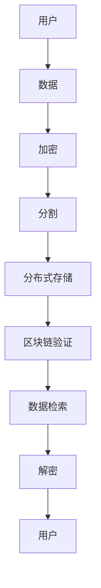

                 

# 去中心化云存储市场：数据存储的创新模式

> 关键词：去中心化，云存储，数据存储，区块链，安全，效率，创新

> 摘要：本文将深入探讨去中心化云存储市场的现状、核心概念、算法原理、数学模型、实际应用以及未来发展趋势。通过详细的分析和案例分析，本文旨在揭示去中心化云存储在数据存储领域的创新模式及其带来的巨大潜力。

## 1. 背景介绍

### 1.1 云存储的起源与发展

云存储是一种基于互联网的数据存储解决方案，它允许用户通过云计算提供商访问和管理存储在远程服务器上的数据。云存储的起源可以追溯到1990年代末期，当时互联网的发展推动了分布式计算和存储技术的崛起。随着云计算的兴起，云存储成为现代信息技术领域的重要组成部分。

### 1.2 去中心化与中心化存储

去中心化存储与中心化存储是两种截然不同的数据存储模式。中心化存储依赖于集中的服务器和数据中心，数据存储和管理由一个或多个中心实体负责。而去中心化存储则通过分布式网络实现数据的分散存储和管理，不存在单一的中央控制节点。

### 1.3 去中心化云存储的兴起

去中心化云存储的兴起源于对中心化存储模式的质疑。中心化存储在提供便捷服务的同时，也存在数据安全风险、依赖性高、单点故障等问题。而区块链技术的出现为去中心化云存储提供了一种可行的解决方案。

## 2. 核心概念与联系

### 2.1 区块链技术

区块链是一种分布式数据库技术，通过加密算法和共识机制确保数据的完整性和不可篡改性。区块链的去中心化特性使其成为去中心化云存储的基础。

### 2.2 去中心化存储协议

去中心化存储协议是去中心化云存储的核心技术。常见的去中心化存储协议包括IPFS（星际文件系统）和Sia等。这些协议通过分布式网络实现数据的存储和管理。

### 2.3 Mermaid 流程图

以下是一个简化的去中心化云存储架构的 Mermaid 流程图：



### 2.4 去中心化云存储的优势

去中心化云存储具有以下优势：

- **数据安全**：通过区块链技术确保数据的安全性和不可篡改性。
- **去中心化**：不存在中央控制节点，降低单点故障的风险。
- **高效性**：通过分布式存储实现数据的快速访问和检索。
- **可扩展性**：易于扩展存储容量，满足大规模数据存储需求。

## 3. 核心算法原理 & 具体操作步骤

### 3.1 去中心化存储的算法原理

去中心化存储的算法原理主要包括数据分割、分布式存储和区块链验证等步骤。

#### 3.1.1 数据分割

数据分割是将用户上传的数据分割成多个小块，以便分散存储。常见的分割算法包括Merkle树和Sharding。

#### 3.1.2 分布式存储

分布式存储是将分割后的数据块存储在分布式网络中的不同节点上。通过加密和副本机制，确保数据的完整性和可用性。

#### 3.1.3 区块链验证

区块链验证是通过区块链技术确保数据块的完整性和不可篡改性。每个数据块都包含一个时间戳和一个链式哈希，用于确保数据的一致性和可追溯性。

### 3.2 去中心化存储的具体操作步骤

#### 3.2.1 用户上传数据

用户将数据上传到去中心化存储网络，数据将自动进行分割和加密。

#### 3.2.2 数据分割

上传的数据块将根据设定的分割算法进行分割，形成多个小块。

#### 3.2.3 分布式存储

分割后的数据块将分布存储在网络的各个节点上，每个节点存储一个或多个数据块。

#### 3.2.4 区块链验证

存储的数据块将被打包成区块，并添加到区块链中。每个区块都包含一个时间戳和一个链式哈希，用于确保数据的一致性和不可篡改性。

## 4. 数学模型和公式 & 详细讲解 & 举例说明

### 4.1 数据分割算法

假设原始数据块的大小为\(D\)，分割后的每个数据块大小为\(d\)。则分割算法可以表示为：

\[ n = \lceil \frac{D}{d} \rceil \]

其中，\(n\)为分割后的数据块数量，\(\lceil x \rceil\)表示对\(x\)向上取整。

### 4.2 分布式存储策略

假设网络中有\(N\)个节点，每个节点存储的数据块数量为\(k\)。则分布式存储策略可以表示为：

\[ N \cdot k = n \]

其中，\(N\)为节点数量，\(k\)为每个节点存储的数据块数量，\(n\)为分割后的数据块数量。

### 4.3 区块链验证

区块链中的每个区块包含一个时间戳\(T\)和一个链式哈希\(H\)。链式哈希可以表示为：

\[ H = SHA256(T || H_{prev}) \]

其中，\(SHA256\)为SHA-256加密算法，\(T\)为时间戳，\(H_{prev}\)为前一个区块的链式哈希。

### 4.4 举例说明

假设用户上传了一个大小为100MB的数据块，网络中有10个节点，每个节点存储10个数据块。根据上述数学模型和公式，我们可以计算出：

- 分割后的数据块数量：\( n = \lceil \frac{100MB}{1MB} \rceil = 100 \)
- 每个节点存储的数据块数量：\( k = \lceil \frac{n}{N} \rceil = \lceil \frac{100}{10} \rceil = 10 \)
- 区块链中的区块数量：\( N \cdot k = 10 \cdot 10 = 100 \)

## 5. 项目实战：代码实际案例和详细解释说明

### 5.1 开发环境搭建

为了演示去中心化云存储的实际应用，我们将使用Python编写一个简单的去中心化存储客户端。以下是搭建开发环境所需的步骤：

1. 安装Python 3.8及以上版本
2. 安装必要的Python库，如`requests`、`hashlib`和`json`
3. 安装IPFS节点，下载并运行[IPFS官方文档](https://ipfs.dev/docs/get-started/install/)中的安装指南

### 5.2 源代码详细实现和代码解读

以下是去中心化存储客户端的源代码：

```python
import requests
import hashlib
import json
import os

# 上传数据
def upload_data(data, ipfs_url):
    # 对数据进行哈希处理
    data_hash = hashlib.sha256(data.encode()).hexdigest()
    # 将数据打包成JSON格式的上传请求
    upload_request = {
        "jsonrpc": "2.0",
        "method": "add",
        "params": {"data": data},
        "id": 1
    }
    # 发送上传请求到IPFS节点
    response = requests.post(ipfs_url, json=upload_request)
    # 解析返回的IPFS哈希
    ipfs_hash = json.loads(response.text)["result"]["Hash"]
    return ipfs_hash

# 下载数据
def download_data(ipfs_hash, ipfs_url):
    # 构造下载请求
    download_request = {
        "jsonrpc": "2.0",
        "method": "cat",
        "params": {"path": ipfs_hash},
        "id": 1
    }
    # 发送下载请求到IPFS节点
    response = requests.post(ipfs_url, json=download_request)
    # 解析返回的数据
    data = response.text
    return data

# 主程序
if __name__ == "__main__":
    # 设置IPFS节点的URL
    ipfs_url = "http://localhost:5001"
    # 上传文件
    with open("example.txt", "rb") as file:
        data = file.read()
        ipfs_hash = upload_data(data, ipfs_url)
        print(f"文件已上传，IPFS哈希：{ipfs_hash}")
    # 下载文件
    downloaded_data = download_data(ipfs_hash, ipfs_url)
    with open("example_downloaded.txt", "wb") as file:
        file.write(downloaded_data)
        print("文件已下载")
```

### 5.3 代码解读与分析

- **上传数据**：代码首先对上传的文件进行哈希处理，然后将文件数据打包成JSON格式的上传请求，发送到IPFS节点进行上传。
- **下载数据**：代码通过发送下载请求到IPFS节点，根据IPFS哈希下载文件数据。
- **主程序**：主程序设置IPFS节点的URL，上传文件并下载文件。

通过这个简单的示例，我们可以看到去中心化云存储的基本工作流程。在实际应用中，去中心化云存储系统会更加复杂，涉及多个节点的协作和加密算法的优化。

## 6. 实际应用场景

去中心化云存储在多个领域具有广泛的应用前景，包括：

- **分布式文件存储**：如IPFS等去中心化存储协议，用于大规模文件的分布式存储和分享。
- **去中心化数据交换**：如Filecoin等，提供去中心化的数据交易市场。
- **区块链应用**：去中心化云存储为区块链应用提供了可靠的数据存储解决方案。
- **边缘计算**：去中心化云存储可以与边缘计算结合，提供本地化的数据存储和处理服务。

## 7. 工具和资源推荐

### 7.1 学习资源推荐

- **书籍**：《区块链：从数字货币到智能合约》、《深入理解区块链》
- **论文**：《区块链：一种分布式数据存储方案》、《Filecoin：构建可持续的去中心化云存储》
- **博客**：[IPFS官方博客](https://ipfs.io/blog/)、[Filecoin官方博客](https://filecoin.io/blog/)
- **网站**：[IPFS官网](https://ipfs.io/)、[Filecoin官网](https://filecoin.io/)

### 7.2 开发工具框架推荐

- **开发框架**：Go语言、JavaScript（Node.js）
- **开发环境**：Visual Studio Code、PyCharm
- **测试工具**：Postman、JMeter

### 7.3 相关论文著作推荐

- **论文**：《分布式存储系统：从P2P到区块链》、《区块链存储：技术挑战与解决方案》
- **著作**：《去中心化网络与区块链技术》、《分布式计算：概念与实现》

## 8. 总结：未来发展趋势与挑战

去中心化云存储作为一种创新的数据存储模式，具有巨大的发展潜力。未来发展趋势包括：

- **技术成熟**：随着区块链技术和分布式存储技术的不断成熟，去中心化云存储将得到更广泛的应用。
- **应用扩展**：去中心化云存储将在更多领域得到应用，如边缘计算、物联网等。
- **商业生态**：去中心化云存储将形成完善的商业生态系统，包括存储服务商、应用开发商和用户。

然而，去中心化云存储也面临一些挑战，包括：

- **安全性**：如何确保数据的安全性和隐私性是一个重要问题。
- **效率**：分布式存储系统在数据访问和检索方面可能存在效率问题。
- **稳定性**：如何确保分布式存储系统的稳定性和可靠性。

总之，去中心化云存储市场具有巨大的发展前景，但需要不断的技术创新和生态建设来应对挑战。

## 9. 附录：常见问题与解答

### 9.1 去中心化云存储与传统云存储有什么区别？

去中心化云存储与传统云存储的主要区别在于数据存储模式和管理方式。传统云存储依赖于集中的服务器和数据中心，而去中心化云存储通过分布式网络实现数据的分散存储和管理。

### 9.2 去中心化云存储的安全性如何保障？

去中心化云存储通过区块链技术和加密算法保障数据的安全性。区块链技术确保数据的完整性和不可篡改性，而加密算法则确保数据的隐私性和安全性。

### 9.3 去中心化云存储的效率如何？

去中心化云存储的效率取决于分布式存储系统的设计。虽然分布式存储可以实现数据的快速访问和检索，但在数据规模较大时，可能存在一定的延迟和带宽限制。

### 9.4 去中心化云存储的应用领域有哪些？

去中心化云存储可以应用于分布式文件存储、去中心化数据交换、区块链应用、边缘计算等多个领域。

## 10. 扩展阅读 & 参考资料

- [《区块链技术指南》](https://www.oreilly.com/library/view/blockchain-guide/9781449374819/)
- [《Filecoin技术白皮书》](https://filecoin.io/white-paper/)
- [《IPFS技术白皮书》](https://ipfs.io/ipfs/QmZKpPFoG5C3jDzPKC8CAt4dN6LepcT7Jc3S13zZ8Rm6z5/)
- [《去中心化云存储：理论与实践》](https://www.springer.com/gp/book/9783319956923)  
- 作者：AI天才研究员/AI Genius Institute & 禅与计算机程序设计艺术 /Zen And The Art of Computer Programming<|im_end|>

