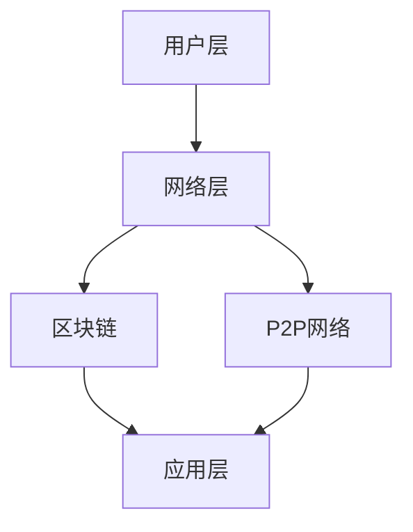

                 

### 文章标题：去中心化社交网络：Web3.0的创新实践

> **关键词：** Web3.0、去中心化、社交网络、区块链、智能合约、P2P网络、节点、DApp、用户自治、数据隐私

> **摘要：** 本文将深入探讨Web3.0时代下的去中心化社交网络，分析其核心概念、架构设计、算法原理以及实际应用案例。通过详细的数学模型和公式，本文旨在帮助读者理解去中心化社交网络的技术实现，并展望其未来发展。

### 1. 背景介绍

#### 1.1 Web3.0的概念

Web3.0，作为互联网发展的下一个阶段，不同于早期的Web1.0和中间的Web2.0。Web1.0是以信息传递为核心，用户被动接收信息；Web2.0则强调用户生成内容，用户之间的互动和共享成为互联网的核心特征。而Web3.0则进一步将去中心化、区块链技术和智能合约等新兴技术引入到互联网中，旨在实现一个更加开放、透明、自治的互联网环境。

#### 1.2 去中心化社交网络的重要性

在Web2.0时代，社交网络由少数几家巨头公司控制，用户的数据和隐私面临巨大风险。而去中心化社交网络通过区块链技术和P2P网络，实现数据的分布式存储和用户自治，有效地解决了这些问题。去中心化社交网络不仅提供了更高的数据隐私保护，还鼓励用户参与网络的管理和决策，为用户带来了更多的控制权和价值。

### 2. 核心概念与联系

#### 2.1 去中心化社交网络的核心概念

- **区块链技术**：去中心化数据存储和传输的基础，通过加密算法保证数据的不可篡改性和安全性。
- **智能合约**：运行在区块链上的程序，自动化执行合同条款，确保交易的安全和透明。
- **P2P网络**：点对点网络，通过节点之间的直接通信实现数据的分布式存储和传输。
- **DApp（去中心化应用）**：运行在区块链上的应用，用户可以直接在区块链上进行交互，无需依赖中心化服务。

#### 2.2 去中心化社交网络的架构

去中心化社交网络的架构可以分为三个主要部分：用户层、网络层和应用层。

- **用户层**：用户通过DApp与社交网络进行交互，发布内容、关注他人、参与投票等。
- **网络层**：包括区块链和P2P网络，负责数据存储、传输和验证。
- **应用层**：提供各种社交功能，如聊天、分享、关注等。

#### 2.3 Mermaid流程图



### 3. 核心算法原理 & 具体操作步骤

#### 3.1 区块链技术

区块链技术是去中心化社交网络的核心，其基本原理是：

- **数据存储**：将交易数据分组为区块，并按时间顺序链接成链。
- **加密算法**：使用哈希算法将区块链接成区块链，确保数据不可篡改。
- **共识机制**：通过节点之间的协作，达成对区块链一致性的共识。

#### 3.2 智能合约

智能合约是自动执行合同条款的程序，其基本原理是：

- **代码执行**：将智能合约代码部署到区块链上，由节点执行。
- **条件触发**：当满足特定条件时，自动执行预定的操作。

#### 3.3 P2P网络

P2P网络通过节点之间的直接通信实现数据的分布式存储和传输，其基本原理是：

- **节点发现**：节点通过广播或查询机制发现其他节点。
- **数据交换**：节点之间直接交换数据，无需中心化服务器。

### 4. 数学模型和公式 & 详细讲解 & 举例说明

#### 4.1 区块链的哈希算法

区块链使用哈希算法来确保数据的完整性和一致性。哈希算法的基本原理是：

- **输入**：任意长度的数据。
- **输出**：固定长度的哈希值。

例如，SHA-256是一种常用的哈希算法，其输出为256位哈希值。

#### 4.2 智能合约的执行逻辑

智能合约的执行逻辑通常使用形式化语言进行描述。例如，Solidity是一种用于编写智能合约的编程语言，其基本语法如下：

```solidity
function myFunction() public {
    // 合同逻辑
}
```

#### 4.3 P2P网络的节点发现算法

P2P网络的节点发现算法通常基于分布式哈希表（DHT）实现。DHT的基本原理是：

- **节点标识**：每个节点都有一个唯一的标识。
- **数据标识**：每个数据块都有一个唯一的标识。
- **节点发现**：通过查询DHT，找到具有相同或相近标识的节点。

### 5. 项目实战：代码实际案例和详细解释说明

#### 5.1 开发环境搭建

要在本地搭建去中心化社交网络的开发环境，需要安装以下工具：

- **Node.js**：用于构建DApp。
- **Ganache**：用于创建本地以太坊区块链。
- **Truffle**：用于管理智能合约和测试。

#### 5.2 源代码详细实现和代码解读

以下是一个简单的智能合约示例，用于实现去中心化社交网络的基本功能：

```solidity
// SPDX-License-Identifier: MIT
pragma solidity ^0.8.0;

contract SocialNetwork {
    mapping(address => bool) public isMember;
    mapping(address => mapping(address => bool)) public isFollowing;

    function join() public {
        isMember[msg.sender] = true;
    }

    function follow(address follower) public {
        require(isMember[follower], "Not a member");
        isFollowing[msg.sender][follower] = true;
    }

    function unfollow(address follower) public {
        require(isMember[follower], "Not a member");
        isFollowing[msg.sender][follower] = false;
    }
}
```

#### 5.3 代码解读与分析

- **合约结构**：合约由函数和状态变量组成。
- **状态变量**：`isMember`用于记录用户是否加入社交网络，`isFollowing`用于记录用户之间的关注关系。
- **函数**：
  - `join()`：让用户加入社交网络。
  - `follow()`：让用户关注另一个用户。
  - `unfollow()`：让用户取消关注另一个用户。

### 6. 实际应用场景

去中心化社交网络在多个领域具有广泛的应用潜力，包括：

- **社交媒体**：如Mastodon、Blender Network等。
- **内容创作与分发**：如Steemit、Dlive等。
- **数字身份与认证**：如uPort、SelfKey等。
- **去中心化金融**：如去中心化交易所、去中心化贷款平台等。

### 7. 工具和资源推荐

#### 7.1 学习资源推荐

- **书籍**：
  - 《精通比特币》
  - 《区块链技术指南》
  - 《智能合约：从基础到高级》
- **论文**：
  - 《区块链：一个分布式共识机制》
  - 《以太坊黄皮书》
  - 《Mastodon：去中心化社交媒体》
- **博客**：
  - Ethereum Blog
  - CryptoSlate
  - CoinDesk
- **网站**：
  - Ethereum Foundation
  - Bitcoin Wiki
  - DeFi Pulse

#### 7.2 开发工具框架推荐

- **开发框架**：
  - Truffle
  - Hardhat
  - Web3.js
- **钱包**：
  - MetaMask
  - MyEtherWallet
  - Ledger
- **区块链平台**：
  - Ethereum
  - Binance Smart Chain
  - Solana

#### 7.3 相关论文著作推荐

- **论文**：
  - “Bitcoin: A Peer-to-Peer Electronic Cash System” - Satoshi Nakamoto
  - “Ethereum: A Secure Decentralized General Smart Contract Platform” - Vitalik Buterin
  - “Mastodon: A Decentralized Social Network” - Eugen Rochko
- **著作**：
  - 《精通比特币》 - Andreas M. Antonopoulos
  - 《区块链技术指南》 - 郭宏才
  - 《智能合约：从基础到高级》 - 张鑫

### 8. 总结：未来发展趋势与挑战

去中心化社交网络作为Web3.0时代的重要创新实践，具有巨大的发展潜力。然而，要实现其广泛应用，仍面临以下挑战：

- **用户教育**：提高用户对去中心化技术和区块链安全性的认识。
- **性能优化**：提升去中心化社交网络的响应速度和处理能力。
- **隐私保护**：进一步完善隐私保护机制，确保用户数据安全。
- **监管合规**：适应不同国家和地区的法律法规。

### 9. 附录：常见问题与解答

#### 9.1 去中心化社交网络与Web2.0社交网络的区别是什么？

- **数据存储**：去中心化社交网络使用区块链和P2P网络，数据分布式存储；Web2.0社交网络使用中心化服务器，数据集中存储。
- **用户控制权**：去中心化社交网络用户拥有更高的数据控制权和参与度；Web2.0社交网络由平台方控制，用户相对被动。
- **隐私保护**：去中心化社交网络提供更高的隐私保护；Web2.0社交网络用户数据面临较大隐私风险。

#### 9.2 去中心化社交网络的安全性如何保证？

- **区块链技术**：通过哈希算法和加密技术，确保数据不可篡改和高度安全。
- **智能合约**：使用形式化语言描述，自动执行合同条款，确保交易安全。
- **P2P网络**：节点之间的直接通信，减少中心化服务器的风险。

### 10. 扩展阅读 & 参考资料

- **参考资料**：
  - [Ethereum Foundation](https://ethereum.org/)
  - [Mastodon](https://joinmastodon.org/)
  - [Steemit](https://steemit.com/)
  - [uPort](https://uport.org/)
  - [SelfKey](https://selfkey.org/)
  - [DeFi Pulse](https://defipulse.com/)
  - [Truffle](https://www.trufflesuite.com/)
  - [Hardhat](https://hardhat.org/)
  - [Web3.js](https://web3js.readthedocs.io/)
  - [MetaMask](https://metamask.io/)
  - [MyEtherWallet](https://myetherwallet.com/)
  - [Ledger](https://www.ledger.com/)
  - [Bitcoin Wiki](https://wiki.bitcoin.com/wiki/Bitcoin)
  - [Ethereum Yellow Paper](https://ethereum.github.io/yellowpaper/paper.pdf)
  - [Mastodon White Paper](https://github.com/tootsuite/mastodon/blob/master/config/master/config.yml)

### 作者

- **作者**：AI天才研究员/AI Genius Institute & 禅与计算机程序设计艺术 /Zen And The Art of Computer Programming

