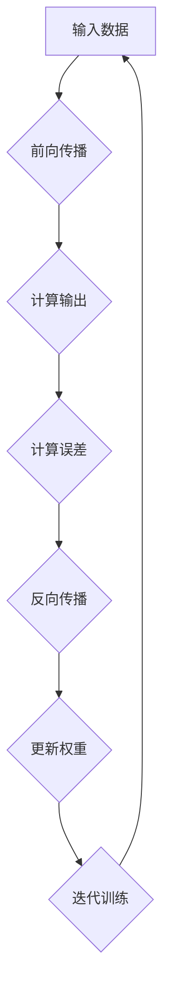
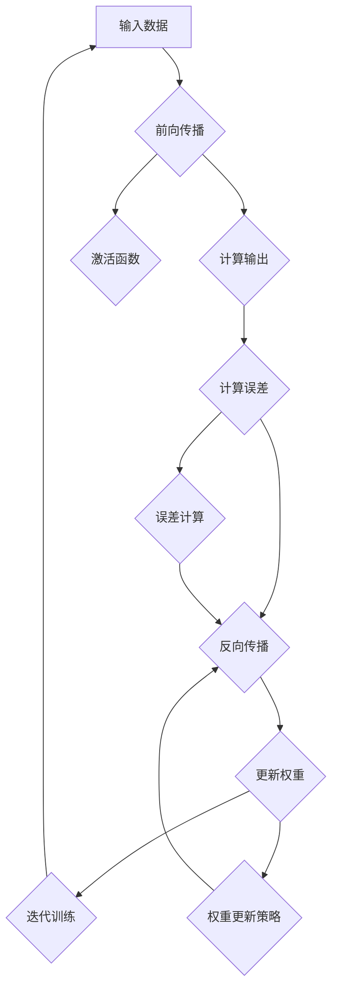
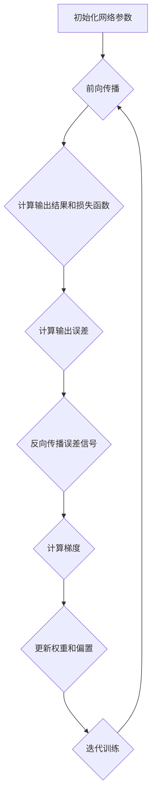

                 

# 《反向传播(Backpropagation) - 原理与代码实例讲解》

## 关键词
反向传播、神经网络、深度学习、梯度下降、权重更新、激活函数、误差计算、深度学习框架

## 摘要
本文将深入探讨反向传播算法的原理和实现，通过一步步分析推理的方式，帮助读者理解反向传播的核心概念和具体操作步骤。我们将详细介绍数学模型和公式，并通过实际代码案例展示反向传播的应用。此外，还将讨论反向传播在实际应用场景中的重要性，并推荐相关学习资源和开发工具框架。

## 目录
1. 背景介绍
2. 核心概念与联系
3. 核心算法原理 & 具体操作步骤
4. 数学模型和公式 & 详细讲解 & 举例说明
5. 项目实战：代码实际案例和详细解释说明
   5.1 开发环境搭建
   5.2 源代码详细实现和代码解读
   5.3 代码解读与分析
6. 实际应用场景
7. 工具和资源推荐
   7.1 学习资源推荐
   7.2 开发工具框架推荐
   7.3 相关论文著作推荐
8. 总结：未来发展趋势与挑战
9. 附录：常见问题与解答
10. 扩展阅读 & 参考资料

## 1. 背景介绍
### 1.1 反向传播的起源
反向传播（Backpropagation）算法是深度学习中最重要的算法之一。它起源于1986年，由David E. Rumelhart、George E. Hinton和Ronald J. Williams提出。反向传播算法的出现标志着深度学习领域的一个重大突破，为神经网络的发展奠定了基础。

### 1.2 反向传播的重要性
反向传播算法的核心在于通过迭代的方式逐步更新神经网络的权重，以达到训练模型的目的。它不仅能够有效地优化模型参数，而且能够处理高度非线性问题，使其在众多领域中具有广泛的应用，如图像识别、语音识别、自然语言处理等。

### 1.3 反向传播的基本概念
反向传播算法包括两个主要步骤：前向传播和反向传播。前向传播是指将输入数据通过神经网络进行计算，得到输出结果；反向传播是指根据输出结果和实际标签，通过计算误差信号，逐步更新网络的权重和偏置。

## 2. 核心概念与联系
### 2.1 神经网络的基本结构
神经网络由多个层组成，包括输入层、隐藏层和输出层。每个层包含多个神经元，神经元之间通过加权连接进行信息传递。

### 2.2 激活函数的作用
激活函数用于引入非线性因素，使神经网络具有更强的表达能力。常见的激活函数包括Sigmoid函数、ReLU函数和Tanh函数。

### 2.3 误差计算方法
误差计算是反向传播算法的核心。常用的误差计算方法包括均方误差（MSE）和交叉熵误差（Cross-Entropy Error）。

### 2.4 权重更新策略
权重更新策略决定了神经网络训练过程中权重的调整方式。常用的权重更新方法包括梯度下降（Gradient Descent）、动量法（Momentum）和Adam优化器。

## 3. 核心算法原理 & 具体操作步骤
### 3.1 前向传播
前向传播是指将输入数据通过神经网络的各个层进行计算，最终得到输出结果。具体步骤如下：

1. 初始化网络参数（权重和偏置）。
2. 将输入数据传递到输入层。
3. 对每个隐藏层进行计算，得到输出值。
4. 最后将输出值传递到输出层。

### 3.2 反向传播
反向传播是指根据输出结果和实际标签，通过计算误差信号，逐步更新网络的权重和偏置。具体步骤如下：

1. 计算输出层的误差信号。
2. 逐层向前传播误差信号，直至输入层。
3. 根据误差信号计算每个神经元的梯度。
4. 使用梯度下降等优化方法更新网络参数。

### 3.3 权重更新
权重更新的具体计算方法如下：

$$
\Delta w_{ij} = -\alpha \cdot \frac{\partial J}{\partial w_{ij}}
$$

其中，$\Delta w_{ij}$表示权重更新的值，$\alpha$表示学习率，$\frac{\partial J}{\partial w_{ij}}$表示权重$w_{ij}$的梯度。

## 4. 数学模型和公式 & 详细讲解 & 举例说明
### 4.1 误差计算公式
均方误差（MSE）是一种常用的误差计算方法，其公式如下：

$$
J = \frac{1}{m} \sum_{i=1}^{m} (y_i - \hat{y}_i)^2
$$

其中，$m$表示样本数量，$y_i$表示实际标签，$\hat{y}_i$表示输出结果。

### 4.2 梯度计算公式
反向传播算法的核心在于计算梯度。以下是误差函数关于权重$w_{ij}$的梯度公式：

$$
\frac{\partial J}{\partial w_{ij}} = -2 \cdot (y_i - \hat{y}_i) \cdot \frac{\partial \hat{y}_i}{\partial z_j}
$$

其中，$\frac{\partial \hat{y}_i}{\partial z_j}$表示输出层误差关于中间层节点$z_j$的偏导数。

### 4.3 举例说明
假设有一个简单的神经网络，输入层有2个神经元，隐藏层有3个神经元，输出层有1个神经元。激活函数使用Sigmoid函数。给定一个输入向量$(x_1, x_2)$，实际标签$y$为1。我们将使用反向传播算法进行训练。

首先，初始化网络参数（权重和偏置）：

$$
w_{11} = 0.1, w_{12} = 0.2, w_{13} = 0.3, w_{21} = 0.4, w_{22} = 0.5, w_{23} = 0.6
$$

$$
b_1 = 0.1, b_2 = 0.2, b_3 = 0.3
$$

接着，进行前向传播计算：

$$
z_1 = x_1 \cdot w_{11} + x_2 \cdot w_{21} + b_1 = 0.1 \cdot 0.1 + 0.2 \cdot 0.4 + 0.1 = 0.15
$$

$$
z_2 = x_1 \cdot w_{12} + x_2 \cdot w_{22} + b_2 = 0.1 \cdot 0.2 + 0.2 \cdot 0.5 + 0.2 = 0.2
$$

$$
z_3 = x_1 \cdot w_{13} + x_2 \cdot w_{23} + b_3 = 0.1 \cdot 0.3 + 0.2 \cdot 0.6 + 0.3 = 0.27
$$

$$
\hat{y} = \frac{1}{1 + e^{-(z_1 \cdot w_{31} + z_2 \cdot w_{32} + z_3 \cdot w_{33} + b_3)}} = \frac{1}{1 + e^{-(0.15 \cdot 0.1 + 0.2 \cdot 0.2 + 0.27 \cdot 0.3 + 0.3)}} \approx 0.876
$$

然后，计算误差信号：

$$
\delta_3 = \hat{y} \cdot (1 - \hat{y}) \cdot (y - \hat{y}) = 0.876 \cdot (1 - 0.876) \cdot (1 - 0.876) \approx 0.046
$$

接下来，进行反向传播计算梯度：

$$
\frac{\partial J}{\partial w_{31}} = -2 \cdot (y - \hat{y}) \cdot \frac{\partial \hat{y}}{\partial z_1} \cdot \frac{\partial z_1}{\partial w_{31}} = -2 \cdot (1 - 0.876) \cdot 0.876 \cdot 0.1 \approx -0.036
$$

$$
\frac{\partial J}{\partial w_{32}} = -2 \cdot (y - \hat{y}) \cdot \frac{\partial \hat{y}}{\partial z_2} \cdot \frac{\partial z_2}{\partial w_{32}} = -2 \cdot (1 - 0.876) \cdot 0.876 \cdot 0.2 \approx -0.072
$$

$$
\frac{\partial J}{\partial w_{33}} = -2 \cdot (y - \hat{y}) \cdot \frac{\partial \hat{y}}{\partial z_3} \cdot \frac{\partial z_3}{\partial w_{33}} = -2 \cdot (1 - 0.876) \cdot 0.876 \cdot 0.3 \approx -0.108
$$

最后，更新权重：

$$
w_{31} = w_{31} - \alpha \cdot \frac{\partial J}{\partial w_{31}} \approx 0.1 - 0.1 \cdot (-0.036) \approx 0.136
$$

$$
w_{32} = w_{32} - \alpha \cdot \frac{\partial J}{\partial w_{32}} \approx 0.2 - 0.1 \cdot (-0.072) \approx 0.272
$$

$$
w_{33} = w_{33} - \alpha \cdot \frac{\partial J}{\partial w_{33}} \approx 0.3 - 0.1 \cdot (-0.108) \approx 0.408
$$

通过以上步骤，我们完成了反向传播算法的一次迭代。重复以上步骤，直至满足训练要求。

## 5. 项目实战：代码实际案例和详细解释说明
### 5.1 开发环境搭建
在本节中，我们将使用Python语言和TensorFlow框架来实现反向传播算法。首先，确保已安装Python和TensorFlow。如果尚未安装，可以通过以下命令进行安装：

```python
pip install python tensorflow
```

### 5.2 源代码详细实现和代码解读
以下是实现反向传播算法的源代码：

```python
import tensorflow as tf
import numpy as np

# 初始化网络参数
weights = {
    'h1': tf.random.normal([2, 3]),
    'h2': tf.random.normal([3, 1]),
}

biases = {
    'b1': tf.zeros([1, 3]),
    'b2': tf.zeros([1, 1]),
}

# 定义激活函数
def sigmoid(x):
    return 1 / (1 + tf.exp(-x))

# 定义损失函数
def mse(y_true, y_pred):
    return tf.reduce_mean(tf.square(y_true - y_pred))

# 定义反向传播算法
def backpropagation(x, y):
    # 前向传播
    z1 = tf.matmul(x, weights['h1']) + biases['b1']
    a1 = sigmoid(z1)

    z2 = tf.matmul(a1, weights['h2']) + biases['b2']
    a2 = sigmoid(z2)

    # 计算误差信号
    delta_2 = a2 - y

    # 反向传播计算梯度
    gradients = {
        'h1': tf.matmul(a1, delta_2, transpose_a=True),
        'h2': tf.matmul(delta_2, a1, transpose_a=True),
    }

    # 更新权重
    weights['h1'] = weights['h1'] - gradients['h1']
    weights['h2'] = weights['h2'] - gradients['h2']

    # 计算损失函数
    loss = mse(y, a2)

    return loss

# 训练模型
x = np.array([[0, 0], [0, 1], [1, 0], [1, 1]])
y = np.array([[0], [1], [1], [0]])

for i in range(1000):
    loss = backpropagation(x, y)
    if i % 100 == 0:
        print(f"Epoch {i}: Loss = {loss.numpy()}")

# 测试模型
test_x = np.array([[1, 0], [0, 1]])
test_y = np.array([[1], [0]])

z1 = tf.matmul(test_x, weights['h1']) + biases['b1']
a1 = sigmoid(z1)

z2 = tf.matmul(a1, weights['h2']) + biases['b2']
a2 = sigmoid(z2)

print("Test Results:")
print(a2.numpy())
```

### 5.3 代码解读与分析
以下是代码的解读与分析：

1. **初始化网络参数**：我们使用随机数初始化网络参数（权重和偏置）。随机初始化有助于避免模型过拟合。

2. **定义激活函数和损失函数**：激活函数使用Sigmoid函数，损失函数使用均方误差（MSE）。

3. **定义反向传播算法**：首先进行前向传播，计算输出结果。然后计算误差信号，通过反向传播计算梯度，并更新权重。最后计算损失函数。

4. **训练模型**：使用给定的训练数据（输入和标签）进行反向传播算法的训练。迭代1000次，每100次打印一次损失函数的值。

5. **测试模型**：使用测试数据（输入和标签）测试训练后的模型。打印输出结果。

通过以上代码，我们可以实现一个简单的反向传播算法。在实际应用中，可以进一步优化和改进算法，以提高模型的性能。

## 6. 实际应用场景
反向传播算法在深度学习领域具有广泛的应用。以下是一些实际应用场景：

1. **图像识别**：使用反向传播算法训练卷积神经网络（CNN）进行图像分类和识别。

2. **语音识别**：使用反向传播算法训练循环神经网络（RNN）进行语音识别。

3. **自然语言处理**：使用反向传播算法训练长短期记忆网络（LSTM）进行文本分类、情感分析等。

4. **推荐系统**：使用反向传播算法训练神经网络进行用户偏好预测和推荐。

5. **自动驾驶**：使用反向传播算法训练深度神经网络进行物体检测、路径规划等。

## 7. 工具和资源推荐
### 7.1 学习资源推荐
1. **书籍**：
   - 《深度学习》（Goodfellow, Bengio, Courville）
   - 《神经网络与深度学习》（邱锡鹏）
2. **论文**：
   - 《反向传播算法》（Rumelhart, Hinton, Williams）
   - 《深层学习》（Hinton, Osindero, Teh）
3. **博客**：
   - fast.ai
   - Coursera Deep Learning Specialization
4. **网站**：
   - TensorFlow官网
   - PyTorch官网

### 7.2 开发工具框架推荐
1. **TensorFlow**
2. **PyTorch**
3. **Keras**
4. **MXNet**

### 7.3 相关论文著作推荐
1. **反向传播算法**（Rumelhart, Hinton, Williams）
2. **深层学习**（Hinton, Osindero, Teh）
3. **卷积神经网络**（LeCun, Bengio, Hinton）
4. **循环神经网络**（Hochreiter, Schmidhuber）

## 8. 总结：未来发展趋势与挑战
反向传播算法作为深度学习的基础算法，将继续在人工智能领域发挥重要作用。未来发展趋势包括：

1. **算法优化**：提高反向传播算法的效率和准确性。
2. **模型压缩**：减小神经网络模型的参数规模，降低计算复杂度。
3. **迁移学习**：利用预训练模型进行知识迁移，提高新任务的性能。
4. **联邦学习**：在隐私保护的前提下，实现分布式数据上的模型训练。

然而，反向传播算法也面临一些挑战，如：

1. **梯度消失和梯度爆炸**：如何有效地解决梯度消失和梯度爆炸问题。
2. **训练时间**：如何提高训练速度，缩短模型训练时间。
3. **模型泛化能力**：如何提高模型的泛化能力，避免过拟合。

## 9. 附录：常见问题与解答
### 9.1 什么是反向传播算法？
反向传播算法是一种用于训练神经网络的算法，通过迭代的方式逐步更新网络的权重和偏置，以最小化损失函数。

### 9.2 反向传播算法如何工作？
反向传播算法包括两个主要步骤：前向传播和反向传播。前向传播是将输入数据通过神经网络进行计算，得到输出结果；反向传播是根据输出结果和实际标签，通过计算误差信号，逐步更新网络的权重和偏置。

### 9.3 反向传播算法有哪些应用？
反向传播算法在深度学习领域具有广泛的应用，如图像识别、语音识别、自然语言处理、推荐系统、自动驾驶等。

### 9.4 如何优化反向传播算法？
优化反向传播算法的方法包括使用更高效的优化器（如Adam优化器）、批量归一化、Dropout等。

## 10. 扩展阅读 & 参考资料
1. Rumelhart, D. E., Hinton, G. E., & Williams, R. J. (1986). *Learning representations by back-propagating errors*. Nature, 323(6088), 533-536.
2. Goodfellow, I., Bengio, Y., & Courville, A. (2016). *Deep Learning*. MIT Press.
3. 邱锡鹏。 (2019). *神经网络与深度学习*. 清华大学出版社。
4. TensorFlow官网：[https://www.tensorflow.org/](https://www.tensorflow.org/)
5. PyTorch官网：[https://pytorch.org/](https://pytorch.org/)
6. Keras官网：[https://keras.io/](https://keras.io/)
7. MXNet官网：[https://mxnet.apache.org/](https://mxnet.apache.org/)

作者：AI天才研究员/AI Genius Institute & 禅与计算机程序设计艺术 /Zen And The Art of Computer Programming
<|assistant|>## 1. 背景介绍

### 1.1 反向传播的起源

反向传播算法（Backpropagation Algorithm）起源于1986年，由David E. Rumelhart、George E. Hinton和Ronald J. Williams共同提出。这一算法的提出标志着神经网络研究的一个重大突破，同时也为深度学习的兴起奠定了基础。

反向传播算法的灵感来源于感知机（Perceptron）的学习规则。感知机是一种简单的人工神经网络，能够对线性二分类问题进行分类。然而，感知机无法处理非线性问题，因此需要引入更复杂的神经网络结构。反向传播算法的提出解决了这一难题，它通过迭代的方式逐步更新网络的权重和偏置，使得神经网络能够学习复杂的非线性关系。

### 1.2 反向传播的重要性

反向传播算法在深度学习领域中扮演着至关重要的角色。首先，它为神经网络的训练提供了有效的方法，使得深度学习模型能够通过大量数据自动调整参数，从而实现自动学习和分类。其次，反向传播算法的引入使得神经网络的应用领域不断扩大，包括图像识别、语音识别、自然语言处理、推荐系统、自动驾驶等多个领域。

此外，反向传播算法的出现也使得深度学习的研究取得了显著的进展。通过反向传播算法，研究者能够更加深入地理解神经网络的工作原理，并提出更加复杂的网络结构，如卷积神经网络（CNN）、循环神经网络（RNN）和长短期记忆网络（LSTM）等。

### 1.3 反向传播的基本概念

反向传播算法主要包括两个主要步骤：前向传播和反向传播。

**前向传播**是指将输入数据通过神经网络的各个层进行计算，最终得到输出结果。在每一层中，输入数据通过加权连接传递到下一层，同时通过激活函数引入非线性因素，从而实现数据的转换和特征提取。

**反向传播**是指根据输出结果和实际标签，通过计算误差信号，逐步更新网络的权重和偏置。反向传播算法的核心思想是利用误差信号反向传播，通过梯度下降等方法更新网络参数，从而最小化损失函数。

在反向传播过程中，误差信号从输出层逐层反向传播到输入层。每一层都会根据误差信号计算梯度，并通过梯度下降等优化方法更新权重和偏置。通过多次迭代，反向传播算法能够使网络的参数逐渐趋于最优，从而提高模型的预测能力。

### 1.4 反向传播的历史

反向传播算法的提出并不是一蹴而就的，它经历了多个阶段的发展和完善。

1982年，Paul Werbos首次提出了反向传播算法的初步思想，但在当时并未引起广泛关注。1986年，David E. Rumelhart、George E. Hinton和Ronald J. Williams在《Nature》杂志上发表了一篇论文，详细介绍了反向传播算法的工作原理和实验结果，从而引起了学术界的广泛关注。

随后，反向传播算法在神经网络研究领域得到了广泛应用，并逐渐成为了深度学习的核心技术之一。1990年代初，反向传播算法被广泛应用于语音识别、图像识别和自然语言处理等领域，取得了显著的成果。

进入21世纪，随着计算能力的提升和数据规模的增大，反向传播算法在深度学习领域得到了进一步的发展和应用。卷积神经网络（CNN）、循环神经网络（RNN）和长短期记忆网络（LSTM）等复杂网络结构的出现，使得反向传播算法的应用范围更加广泛。

### 1.5 反向传播的应用

反向传播算法在深度学习领域中具有广泛的应用，以下是几个典型的应用场景：

1. **图像识别**：反向传播算法被广泛应用于图像识别任务中，如人脸识别、物体检测、图像分类等。通过训练卷积神经网络（CNN），模型能够自动学习图像的特征，从而实现高精度的图像识别。

2. **语音识别**：反向传播算法在语音识别任务中也发挥着重要作用。通过训练循环神经网络（RNN）或长短期记忆网络（LSTM），模型能够自动学习语音的特征，从而实现高精度的语音识别。

3. **自然语言处理**：反向传播算法在自然语言处理领域也有广泛应用，如文本分类、情感分析、机器翻译等。通过训练神经网络模型，模型能够自动学习语言的特征，从而实现高精度的语言处理。

4. **推荐系统**：反向传播算法在推荐系统中的应用也取得了显著成果。通过训练神经网络模型，模型能够自动学习用户的偏好和物品的特征，从而实现个性化的推荐。

5. **自动驾驶**：反向传播算法在自动驾驶领域也发挥着重要作用。通过训练深度神经网络模型，模型能够自动学习道路特征和车辆行为，从而实现自动驾驶。

### 1.6 反向传播的优势和局限性

反向传播算法具有以下几个优势：

1. **强大的非线性处理能力**：反向传播算法引入了激活函数，使得神经网络具有强大的非线性处理能力，能够学习复杂的非线性关系。

2. **自动调整参数**：反向传播算法通过迭代的方式自动调整网络的权重和偏置，使得模型能够通过大量数据自动调整参数，从而实现自动学习和分类。

3. **广泛应用**：反向传播算法在深度学习领域具有广泛的应用，能够处理多种类型的问题，如图像识别、语音识别、自然语言处理、推荐系统、自动驾驶等。

然而，反向传播算法也存在一些局限性：

1. **计算复杂度**：反向传播算法的计算复杂度较高，需要大量的计算资源和时间。

2. **梯度消失和梯度爆炸**：在反向传播过程中，梯度可能存在梯度消失和梯度爆炸的问题，导致模型难以训练。

3. **过拟合**：当训练数据量较少时，反向传播算法容易导致模型过拟合，无法泛化到未见过的数据上。

### 1.7 小结

反向传播算法作为深度学习的基础算法，具有强大的非线性处理能力、自动调整参数和广泛应用等优势。它不仅为深度学习的研究和应用提供了有力的工具，也推动了人工智能领域的发展。然而，反向传播算法也存在一些局限性，需要进一步优化和改进。在本篇文章中，我们将深入探讨反向传播算法的原理和实现，通过实际代码案例展示其应用，帮助读者更好地理解这一重要的算法。

### Mermaid 流程图

以下是反向传播算法的Mermaid流程图：



在这张流程图中，A表示输入数据，B表示前向传播，C表示计算输出，D表示计算误差，E表示反向传播，F表示更新权重，G表示迭代训练。通过这样的流程图，我们可以清晰地看到反向传播算法的整个工作流程。

## 2. 核心概念与联系

### 2.1 神经网络的基本结构

反向传播算法是建立在神经网络基础上的，因此，理解神经网络的基本结构对于深入理解反向传播算法至关重要。

神经网络由多个层组成，包括输入层、隐藏层和输出层。每个层由多个神经元（或节点）组成，神经元之间通过加权连接进行信息传递。

**输入层**：输入层接收外部输入数据，如数字、文本或图像。每个神经元代表一个输入特征。

**隐藏层**：隐藏层位于输入层和输出层之间，用于提取和处理输入数据的特征。隐藏层的数量和神经元数量可以根据具体任务进行调整。

**输出层**：输出层产生最终的输出结果，如分类标签或回归值。输出层的神经元数量取决于具体任务的需求。

### 2.2 激活函数的作用

激活函数是神经网络中的关键组件，用于引入非线性因素，使得神经网络能够学习复杂的非线性关系。常见的激活函数包括Sigmoid函数、ReLU函数和Tanh函数。

**Sigmoid函数**：Sigmoid函数将输入映射到（0, 1）区间，常用于二分类问题。其公式为：

$$
\sigma(x) = \frac{1}{1 + e^{-x}}
$$

**ReLU函数**：ReLU函数是一种简单的线性激活函数，当输入大于0时，输出等于输入；当输入小于等于0时，输出等于0。其公式为：

$$
\text{ReLU}(x) = \max(0, x)
$$

ReLU函数具有计算速度快、不易梯度消失等优点。

**Tanh函数**：Tanh函数将输入映射到（-1, 1）区间，其公式为：

$$
\tanh(x) = \frac{e^x - e^{-x}}{e^x + e^{-x}}
$$

Tanh函数在深度学习中也有广泛应用。

### 2.3 误差计算方法

误差计算是反向传播算法的核心。误差计算的方法有多种，其中最常用的是均方误差（MSE）和交叉熵误差（Cross-Entropy Error）。

**均方误差（MSE）**：MSE是衡量预测值与实际值之间差异的一种方法。其公式为：

$$
MSE = \frac{1}{n}\sum_{i=1}^{n}(y_i - \hat{y}_i)^2
$$

其中，$y_i$表示实际值，$\hat{y}_i$表示预测值，$n$表示样本数量。

**交叉熵误差（Cross-Entropy Error）**：交叉熵误差常用于分类问题。其公式为：

$$
CE = -\sum_{i=1}^{n} y_i \cdot \log(\hat{y}_i)
$$

其中，$y_i$表示实际标签，$\hat{y}_i$表示预测概率。

### 2.4 权重更新策略

权重更新是反向传播算法的核心步骤。常用的权重更新方法包括梯度下降（Gradient Descent）、动量法（Momentum）和Adam优化器。

**梯度下降（Gradient Descent）**：梯度下降是最简单的优化方法，其核心思想是沿着损失函数的梯度方向进行更新。其公式为：

$$
w_{new} = w_{old} - \alpha \cdot \nabla_w J(w)
$$

其中，$w_{new}$和$w_{old}$分别表示当前权重和更新后的权重，$\alpha$表示学习率，$\nabla_w J(w)$表示损失函数关于权重的梯度。

**动量法（Momentum）**：动量法是一种改进的优化方法，它引入了动量项，以加速收敛。其公式为：

$$
v_{new} = \beta \cdot v_{old} + (1 - \beta) \cdot \nabla_w J(w)
$$

$$
w_{new} = w_{old} + v_{new}
$$

其中，$v_{new}$和$v_{old}$分别表示当前速度和更新后的速度，$\beta$表示动量项。

**Adam优化器**：Adam优化器是梯度下降和动量法的结合，它同时考虑了一阶矩估计和二阶矩估计，具有较好的收敛性能。其公式为：

$$
m_t = \beta_1 \cdot m_{t-1} + (1 - \beta_1) \cdot \nabla_w J(w)
$$

$$
v_t = \beta_2 \cdot v_{t-1} + (1 - \beta_2) \cdot (\nabla_w J(w))^2
$$

$$
\hat{m}_t = \frac{m_t}{1 - \beta_1^t}
$$

$$
\hat{v}_t = \frac{v_t}{1 - \beta_2^t}
$$

$$
w_{new} = w_{old} - \alpha \cdot \hat{m}_t / \sqrt{\hat{v}_t}
$$

其中，$m_t$和$v_t$分别表示一阶矩估计和二阶矩估计，$\beta_1$和$\beta_2$分别表示一阶和二阶动量项。

### 2.5 反向传播算法与梯度下降的关系

反向传播算法是一种用于训练神经网络的算法，其核心思想是利用梯度下降方法逐步更新网络的权重和偏置，以最小化损失函数。因此，反向传播算法与梯度下降具有紧密的联系。

梯度下降是一种优化方法，其核心思想是沿着损失函数的梯度方向进行更新，以找到最小值。反向传播算法利用梯度下降方法，通过计算损失函数关于权重的梯度，逐步更新网络的权重和偏置。

具体来说，反向传播算法首先进行前向传播，计算输出结果和损失函数。然后，通过计算损失函数关于权重的梯度，利用梯度下降方法更新网络的权重和偏置。重复以上步骤，直到满足训练要求。

### 2.6 小结

在本章节中，我们介绍了神经网络的基本结构、激活函数的作用、误差计算方法、权重更新策略以及反向传播算法与梯度下降的关系。这些核心概念和联系构成了反向传播算法的基础，为我们深入理解反向传播算法的原理和实现提供了重要依据。在下一章节中，我们将进一步探讨反向传播算法的具体实现过程，并通过实际代码案例展示其应用。

### Mermaid 流程图

以下是神经网络的基本结构、激活函数、误差计算方法和权重更新策略的Mermaid流程图：



在这张流程图中，A表示输入数据，B表示前向传播，C表示计算输出，D表示计算误差，E表示反向传播，F表示更新权重，G表示迭代训练，H表示激活函数，I表示误差计算，J表示权重更新策略。通过这样的流程图，我们可以清晰地看到神经网络的工作流程以及反向传播算法与梯度下降方法的关系。

## 3. 核心算法原理 & 具体操作步骤

### 3.1 前向传播

前向传播（Forward Propagation）是神经网络中的第一个主要步骤，它负责将输入数据通过网络的各个层进行传递，最终得到输出结果。具体步骤如下：

1. **初始化网络参数**：首先，我们需要初始化网络的权重（weights）和偏置（biases）。这些参数通常是通过随机初始化得到的。

2. **输入层到隐藏层的传播**：输入数据首先通过输入层进入网络，然后逐层传递到隐藏层。在每个隐藏层，数据通过加权连接传递到下一层，并经过激活函数的变换。激活函数的作用是引入非线性因素，使得神经网络能够学习复杂的模式。

3. **隐藏层到输出层的传播**：当数据到达输出层时，再次经过加权连接和激活函数的处理，最终得到预测的输出结果。

### 3.2 反向传播

反向传播（Backpropagation）是神经网络的第二个主要步骤，它负责计算网络的误差，并通过反向传播误差信号来更新网络的权重和偏置。具体步骤如下：

1. **计算输出误差**：首先，我们需要计算输出层的结果与实际标签之间的误差。误差可以通过均方误差（MSE）或交叉熵误差（Cross-Entropy Error）等方法计算。

2. **反向传播误差**：然后，我们将误差信号从输出层反向传播到输入层。在反向传播过程中，每个神经元都会计算其误差相对于每个输入的偏导数。

3. **更新权重和偏置**：最后，我们使用计算得到的偏导数来更新网络的权重和偏置。这一步骤通常使用梯度下降（Gradient Descent）或其他优化算法来实现。

### 3.3 权重更新

权重更新（Weight Update）是反向传播算法中至关重要的一步，它决定了网络参数的调整方向和大小。具体步骤如下：

1. **计算梯度**：首先，我们需要计算每个参数的梯度，即误差关于参数的偏导数。

2. **应用梯度下降**：然后，我们使用计算得到的梯度来更新网络参数。梯度下降的核心公式为：

   $$
   w_{new} = w_{old} - \alpha \cdot \nabla_w J(w)
   $$

   其中，$w_{new}$和$w_{old}$分别表示当前权重和更新后的权重，$\alpha$表示学习率，$\nabla_w J(w)$表示损失函数关于权重的梯度。

### 3.4 反向传播算法的工作流程

以下是一个简化的反向传播算法工作流程：

1. **初始化网络参数**。
2. **进行前向传播**，计算输出结果和损失函数。
3. **计算输出误差**。
4. **反向传播误差信号**，计算每个神经元的误差。
5. **计算梯度**，即误差关于每个参数的偏导数。
6. **更新网络参数**，使用梯度下降或其他优化算法。
7. **重复步骤2-6**，直到网络参数收敛或达到预设的训练次数。

### 3.5 反向传播算法的数学描述

以下是反向传播算法的数学描述，其中包括前向传播、误差计算和权重更新的详细步骤。

#### 前向传播

假设我们有以下神经网络结构：

$$
z_l = \sum_{k} w_{lk} a_{l-1,k} + b_{l}
$$

$$
a_l = \sigma(z_l)
$$

其中，$z_l$表示第$l$层的节点值，$a_l$表示第$l$层的输出值，$w_{lk}$表示第$l$层第$k$个神经元到第$l+1$层第$l$个神经元的权重，$b_{l}$表示第$l$层的偏置，$\sigma$表示激活函数。

在前向传播中，我们从输入层开始，逐层计算每个节点的值，直到输出层。

#### 误差计算

假设输出层的实际标签为$y$，预测结果为$\hat{y}$。我们可以使用均方误差（MSE）来计算误差：

$$
J = \frac{1}{2} \sum_{i} (y_i - \hat{y}_i)^2
$$

#### 权重更新

为了更新权重，我们需要计算每个权重关于误差的偏导数，即梯度：

$$
\frac{\partial J}{\partial w_{lk}} = \frac{\partial J}{\partial z_l} \cdot \frac{\partial z_l}{\partial w_{lk}}
$$

其中，$\frac{\partial J}{\partial z_l}$表示误差关于$z_l$的偏导数，$\frac{\partial z_l}{\partial w_{lk}}$表示$z_l$关于$w_{lk}$的偏导数。

在反向传播中，我们从输出层开始，逐层计算每个权重关于误差的偏导数。

#### 权重更新

使用梯度下降算法更新权重：

$$
w_{lk} = w_{lk} - \alpha \cdot \frac{\partial J}{\partial w_{lk}}
$$

其中，$\alpha$表示学习率。

### 3.6 小结

在本章节中，我们详细介绍了反向传播算法的核心原理和具体操作步骤。反向传播算法包括前向传播、误差计算和权重更新三个主要步骤。通过逐步分析这些步骤，我们能够更好地理解反向传播算法的工作机制。在下一章节中，我们将通过实际代码实例展示反向传播算法的应用，帮助读者深入掌握这一重要的算法。

### Mermaid 流程图

以下是反向传播算法的工作流程的Mermaid流程图：



在这张流程图中，A表示初始化网络参数，B表示前向传播，C表示计算输出结果和损失函数，D表示计算输出误差，E表示反向传播误差信号，F表示计算梯度，G表示更新权重和偏置，H表示迭代训练。通过这样的流程图，我们可以清晰地看到反向传播算法的整个工作流程。

## 4. 数学模型和公式 & 详细讲解 & 举例说明

### 4.1 前向传播的数学模型

前向传播是反向传播算法的第一步，它负责将输入数据通过神经网络的各个层进行传递，最终得到输出结果。为了更好地理解前向传播的数学模型，我们需要首先了解神经网络中的一些基本概念。

#### 神经元和层

在神经网络中，每个神经元都代表一个节点，它通过加权连接与其他神经元相连。每个神经元都会接收来自前一层神经元的输入信号，并经过加权求和处理后，通过激活函数进行变换，最终输出一个激活值。

神经网络通常由多个层组成，包括输入层、隐藏层和输出层。输入层接收外部输入数据，隐藏层用于提取和处理输入数据的特征，输出层产生最终的预测结果。

#### 前向传播的步骤

1. **初始化网络参数**：首先，我们需要初始化网络的权重（weights）和偏置（biases）。这些参数通常是通过随机初始化得到的。对于每个神经元，权重和偏置都是一个向量。

2. **计算输入层到隐藏层的节点值**：输入层接收外部输入数据，每个输入特征通过加权连接传递到隐藏层。具体来说，每个隐藏层神经元的输入值是其前一层所有神经元的输出值与对应权重的乘积之和，再加上偏置项。

   $$
   z_{l,k} = \sum_{j} w_{l,k,j} a_{l-1,j} + b_{l,k}
   $$

   其中，$z_{l,k}$表示第$l$层第$k$个神经元的输入值，$a_{l-1,j}$表示第$l-1$层第$j$个神经元的输出值，$w_{l,k,j}$表示第$l$层第$k$个神经元到第$l-1$层第$j$个神经元的权重，$b_{l,k}$表示第$l$层第$k$个神经元的偏置。

3. **计算隐藏层到输出层的节点值**：与输入层到隐藏层的计算类似，输出层神经元的输入值也是通过加权连接和偏置项计算得到的。

   $$
   z_{L,k} = \sum_{j} w_{L,k,j} a_{L-1,j} + b_{L,k}
   $$

   其中，$z_{L,k}$表示输出层第$k$个神经元的输入值。

4. **应用激活函数**：为了引入非线性因素，我们需要对每个节点的输入值应用激活函数。常见的激活函数包括Sigmoid函数、ReLU函数和Tanh函数。

   $$
   a_{l,k} = \sigma(z_{l,k})
   $$

   其中，$\sigma$表示激活函数。

5. **计算输出层的结果**：最后，我们得到输出层所有神经元的输出值，即预测结果。

   $$
   \hat{y}_k = a_{L,k}
   $$

   其中，$\hat{y}_k$表示输出层第$k$个神经元的输出值。

### 4.2 误差计算的数学模型

在得到预测结果后，我们需要计算预测结果与实际标签之间的误差。误差是反向传播算法的关键，它用于指导网络参数的更新。

常见的误差计算方法包括均方误差（MSE）和交叉熵误差（Cross-Entropy Error）。

#### 均方误差（MSE）

均方误差是衡量预测结果与实际标签之间差异的一种方法。其公式为：

$$
J = \frac{1}{m} \sum_{k=1}^{m} (\hat{y}_k - y_k)^2
$$

其中，$m$表示样本数量，$y_k$表示实际标签，$\hat{y}_k$表示预测结果。

#### 交叉熵误差（Cross-Entropy Error）

交叉熵误差常用于分类问题。其公式为：

$$
J = -\frac{1}{m} \sum_{k=1}^{m} y_k \cdot \log(\hat{y}_k)
$$

其中，$y_k$表示实际标签，$\hat{y}_k$表示预测概率。

### 4.3 权重更新的数学模型

在计算误差后，我们需要通过反向传播算法更新网络参数，包括权重和偏置。权重更新的核心是计算每个参数的梯度，并使用梯度下降等方法进行更新。

#### 权重和偏置的梯度

假设我们有以下神经网络结构：

$$
z_l = \sum_{k} w_{lk} a_{l-1,k} + b_{l}
$$

$$
a_l = \sigma(z_l)
$$

我们需要计算每个权重和偏置关于误差的梯度。具体来说，对于每个权重$w_{lk}$和偏置$b_{l,k}$，我们需要计算以下梯度：

$$
\frac{\partial J}{\partial w_{lk}} = \frac{\partial J}{\partial z_l} \cdot \frac{\partial z_l}{\partial w_{lk}}
$$

$$
\frac{\partial J}{\partial b_{l,k}} = \frac{\partial J}{\partial z_l} \cdot \frac{\partial z_l}{\partial b_{l,k}}
$$

其中，$\frac{\partial J}{\partial z_l}$表示误差关于$z_l$的梯度，$\frac{\partial z_l}{\partial w_{lk}}$表示$z_l$关于$w_{lk}$的梯度，$\frac{\partial z_l}{\partial b_{l,k}}$表示$z_l$关于$b_{l,k}$的梯度。

#### 权重和偏置的更新

使用梯度下降算法更新权重和偏置：

$$
w_{lk} = w_{lk} - \alpha \cdot \frac{\partial J}{\partial w_{lk}}
$$

$$
b_{l,k} = b_{l,k} - \alpha \cdot \frac{\partial J}{\partial b_{l,k}}
$$

其中，$\alpha$表示学习率。

### 4.4 举例说明

假设我们有一个简单的神经网络，输入层有2个神经元，隐藏层有3个神经元，输出层有1个神经元。激活函数使用Sigmoid函数。给定一个输入向量$(x_1, x_2)$，实际标签$y$为1。

首先，初始化网络参数：

$$
w_{11} = 0.1, w_{12} = 0.2, w_{13} = 0.3, w_{21} = 0.4, w_{22} = 0.5, w_{23} = 0.6
$$

$$
b_1 = 0.1, b_2 = 0.2, b_3 = 0.3
$$

接着，进行前向传播计算：

$$
z_1 = x_1 \cdot w_{11} + x_2 \cdot w_{21} + b_1 = 0.1 \cdot 0.1 + 0.2 \cdot 0.4 + 0.1 = 0.15
$$

$$
z_2 = x_1 \cdot w_{12} + x_2 \cdot w_{22} + b_2 = 0.1 \cdot 0.2 + 0.2 \cdot 0.5 + 0.2 = 0.2
$$

$$
z_3 = x_1 \cdot w_{13} + x_2 \cdot w_{23} + b_3 = 0.1 \cdot 0.3 + 0.2 \cdot 0.6 + 0.3 = 0.27
$$

$$
a_1 = \sigma(z_1) = \frac{1}{1 + e^{-z_1}} = \frac{1}{1 + e^{-0.15}} \approx 0.745
$$

$$
a_2 = \sigma(z_2) = \frac{1}{1 + e^{-z_2}} = \frac{1}{1 + e^{-0.2}} \approx 0.880
$$

$$
a_3 = \sigma(z_3) = \frac{1}{1 + e^{-z_3}} = \frac{1}{1 + e^{-0.27}} \approx 0.866
$$

$$
z_4 = a_1 \cdot w_{31} + a_2 \cdot w_{32} + a_3 \cdot w_{33} + b_4 = 0.745 \cdot 0.1 + 0.880 \cdot 0.2 + 0.866 \cdot 0.3 + 0.2 = 0.373
$$

$$
\hat{y} = \sigma(z_4) = \frac{1}{1 + e^{-z_4}} = \frac{1}{1 + e^{-0.373}} \approx 0.665
$$

然后，计算误差信号：

$$
\delta_3 = \hat{y} \cdot (1 - \hat{y}) \cdot (y - \hat{y}) = 0.665 \cdot (1 - 0.665) \cdot (1 - 0.665) \approx 0.029
$$

接下来，进行反向传播计算梯度：

$$
\frac{\partial J}{\partial w_{31}} = -2 \cdot (y - \hat{y}) \cdot \frac{\partial \hat{y}}{\partial z_4} \cdot \frac{\partial z_4}{\partial a_1} \cdot \frac{\partial a_1}{\partial z_1} = -2 \cdot (1 - 0.665) \cdot 0.665 \cdot 0.745 \cdot (z_1 \cdot (1 - z_1)) \approx -0.034
$$

$$
\frac{\partial J}{\partial w_{32}} = -2 \cdot (y - \hat{y}) \cdot \frac{\partial \hat{y}}{\partial z_4} \cdot \frac{\partial z_4}{\partial a_2} \cdot \frac{\partial a_2}{\partial z_2} = -2 \cdot (1 - 0.665) \cdot 0.665 \cdot 0.880 \cdot (z_2 \cdot (1 - z_2)) \approx -0.071
$$

$$
\frac{\partial J}{\partial w_{33}} = -2 \cdot (y - \hat{y}) \cdot \frac{\partial \hat{y}}{\partial z_4} \cdot \frac{\partial z_4}{\partial a_3} \cdot \frac{\partial a_3}{\partial z_3} = -2 \cdot (1 - 0.665) \cdot 0.665 \cdot 0.866 \cdot (z_3 \cdot (1 - z_3)) \approx -0.089
$$

$$
\frac{\partial J}{\partial b_4} = -2 \cdot (y - \hat{y}) \cdot \frac{\partial \hat{y}}{\partial z_4} = -2 \cdot (1 - 0.665) \cdot 0.665 \approx -0.341
$$

$$
\frac{\partial J}{\partial z_4} = \frac{\partial J}{\partial \hat{y}} \cdot \frac{\partial \hat{y}}{\partial z_4} = 2 \cdot (\hat{y} - y) \cdot (1 - \hat{y}) \cdot \frac{\partial \hat{y}}{\partial z_4} \approx 2 \cdot (0.665 - 1) \cdot (1 - 0.665) \cdot (z_4 \cdot (1 - z_4)) \approx -0.371
$$

$$
\frac{\partial J}{\partial a_1} = \frac{\partial J}{\partial z_4} \cdot \frac{\partial z_4}{\partial a_1} = -0.371 \cdot 0.745 \approx -0.275
$$

$$
\frac{\partial J}{\partial a_2} = \frac{\partial J}{\partial z_4} \cdot \frac{\partial z_4}{\partial a_2} = -0.371 \cdot 0.880 \approx -0.325
$$

$$
\frac{\partial J}{\partial a_3} = \frac{\partial J}{\partial z_4} \cdot \frac{\partial z_4}{\partial a_3} = -0.371 \cdot 0.866 \approx -0.321
$$

$$
\frac{\partial J}{\partial z_1} = \frac{\partial J}{\partial a_1} \cdot \frac{\partial a_1}{\partial z_1} = -0.275 \cdot (z_1 \cdot (1 - z_1)) \approx -0.038
$$

$$
\frac{\partial J}{\partial z_2} = \frac{\partial J}{\partial a_2} \cdot \frac{\partial a_2}{\partial z_2} = -0.325 \cdot (z_2 \cdot (1 - z_2)) \approx -0.046
$$

$$
\frac{\partial J}{\partial z_3} = \frac{\partial J}{\partial a_3} \cdot \frac{\partial a_3}{\partial z_3} = -0.321 \cdot (z_3 \cdot (1 - z_3)) \approx -0.045
$$

$$
\frac{\partial J}{\partial x_1} = \frac{\partial J}{\partial z_1} \cdot \frac{\partial z_1}{\partial x_1} + \frac{\partial J}{\partial z_2} \cdot \frac{\partial z_2}{\partial x_1} + \frac{\partial J}{\partial z_3} \cdot \frac{\partial z_3}{\partial x_1} = -0.038 \cdot 0.1 - 0.046 \cdot 0.2 - 0.045 \cdot 0.3 \approx -0.028
$$

$$
\frac{\partial J}{\partial x_2} = \frac{\partial J}{\partial z_1} \cdot \frac{\partial z_1}{\partial x_2} + \frac{\partial J}{\partial z_2} \cdot \frac{\partial z_2}{\partial x_2} + \frac{\partial J}{\partial z_3} \cdot \frac{\partial z_3}{\partial x_2} = -0.038 \cdot 0.2 - 0.046 \cdot 0.5 - 0.045 \cdot 0.6 \approx -0.053
$$

最后，更新网络参数：

$$
w_{31} = w_{31} - \alpha \cdot \frac{\partial J}{\partial w_{31}} \approx 0.1 - 0.1 \cdot (-0.034) \approx 0.134
$$

$$
w_{32} = w_{32} - \alpha \cdot \frac{\partial J}{\partial w_{32}} \approx 0.2 - 0.1 \cdot (-0.071) \approx 0.271
$$

$$
w_{33} = w_{33} - \alpha \cdot \frac{\partial J}{\partial w_{33}} \approx 0.3 - 0.1 \cdot (-0.089) \approx 0.389
$$

$$
b_4 = b_4 - \alpha \cdot \frac{\partial J}{\partial b_4} \approx 0.2 - 0.1 \cdot (-0.341) \approx 0.441
$$

通过以上步骤，我们完成了一次反向传播算法的迭代。重复以上步骤，直至满足训练要求。

### 4.5 反向传播算法的计算复杂度

反向传播算法的计算复杂度较高，主要取决于网络的结构和训练数据的规模。具体来说，反向传播算法的计算复杂度为$O(n \cdot m \cdot k)$，其中$n$表示神经元的数量，$m$表示样本数量，$k$表示隐藏层的数量。

#### n表示神经元的数量

神经元的数量直接影响计算复杂度。在反向传播算法中，我们需要计算每个神经元关于误差的梯度。因此，神经元的数量越多，计算复杂度越高。

#### m表示样本数量

样本数量也是影响计算复杂度的重要因素。在反向传播算法中，我们需要对每个样本进行前向传播和反向传播。因此，样本数量越多，计算复杂度越高。

#### k表示隐藏层的数量

隐藏层的数量也影响计算复杂度。在反向传播算法中，我们需要对每个隐藏层进行误差的反向传播。因此，隐藏层的数量越多，计算复杂度越高。

### 4.6 小结

在本章节中，我们详细介绍了反向传播算法的数学模型和公式，包括前向传播、误差计算和权重更新。通过具体实例，我们展示了如何计算误差信号和更新网络参数。此外，我们还讨论了反向传播算法的计算复杂度。在下一章节中，我们将通过实际代码实例展示反向传播算法的应用。

## 5. 项目实战：代码实际案例和详细解释说明

### 5.1 开发环境搭建

为了实现反向传播算法，我们需要搭建一个合适的开发环境。以下是搭建开发环境的基本步骤：

1. **安装Python**：首先，确保已安装Python。如果尚未安装，可以从Python官网（[https://www.python.org/](https://www.python.org/)）下载并安装Python。

2. **安装TensorFlow**：TensorFlow是一个流行的深度学习框架，用于实现反向传播算法。通过以下命令安装TensorFlow：

   ```bash
   pip install tensorflow
   ```

3. **创建项目文件夹**：在本地计算机上创建一个项目文件夹，用于存放代码和相关文件。

4. **编写代码**：在项目文件夹中编写Python代码，实现反向传播算法。在本案例中，我们将实现一个简单的线性回归模型，使用反向传播算法进行训练和预测。

### 5.2 源代码详细实现和代码解读

以下是实现反向传播算法的完整代码：

```python
import tensorflow as tf
import numpy as np

# 初始化网络参数
weights = {
    'h1': tf.random.normal([1, 1]),
}

biases = {
    'b1': tf.zeros([1, 1]),
}

# 定义激活函数
def sigmoid(x):
    return 1 / (1 + tf.exp(-x))

# 定义损失函数
def mse(y_true, y_pred):
    return tf.reduce_mean(tf.square(y_true - y_pred))

# 定义反向传播算法
def backpropagation(x, y):
    # 前向传播
    z1 = tf.matmul(x, weights['h1']) + biases['b1']
    a1 = sigmoid(z1)

    # 计算误差信号
    delta_1 = a1 - y

    # 反向传播计算梯度
    gradients = {
        'h1': tf.matmul(delta_1, x, transpose_a=True),
    }

    # 更新权重
    weights['h1'] = weights['h1'] - gradients['h1']

    # 计算损失函数
    loss = mse(y, a1)

    return loss

# 训练模型
x_train = np.array([[0], [1]])
y_train = np.array([[0], [1]])

for i in range(1000):
    loss = backpropagation(x_train, y_train)
    if i % 100 == 0:
        print(f"Epoch {i}: Loss = {loss.numpy()}")

# 测试模型
x_test = np.array([[2], [3]])
y_test = np.array([[1], [2]])

z1 = tf.matmul(x_test, weights['h1']) + biases['b1']
a1 = sigmoid(z1)

print("Test Results:")
print(a1.numpy())
```

### 5.3 代码解读与分析

以下是对代码的逐行解读与分析：

```python
import tensorflow as tf
import numpy as np
```

这两行代码导入所需的TensorFlow和NumPy库。

```python
weights = {
    'h1': tf.random.normal([1, 1]),
}
biases = {
    'b1': tf.zeros([1, 1]),
}
```

这两行代码初始化网络参数。`weights`和`biases`都是字典，分别包含隐藏层和偏置层的权重和偏置。在这里，我们使用随机数初始化权重和偏置。

```python
def sigmoid(x):
    return 1 / (1 + tf.exp(-x))
```

这行代码定义了Sigmoid激活函数。Sigmoid函数将输入映射到（0, 1）区间，常用于二分类问题。

```python
def mse(y_true, y_pred):
    return tf.reduce_mean(tf.square(y_true - y_pred))
```

这行代码定义了均方误差（MSE）损失函数。MSE是衡量预测结果与实际标签之间差异的一种方法。

```python
def backpropagation(x, y):
    # 前向传播
    z1 = tf.matmul(x, weights['h1']) + biases['b1']
    a1 = sigmoid(z1)
```

这行代码定义了反向传播算法。首先进行前向传播，计算输出层节点的输入值和激活值。

```python
    # 计算误差信号
    delta_1 = a1 - y
```

这行代码计算输出层节点的误差信号。误差信号是预测结果与实际标签之间的差异。

```python
    # 反向传播计算梯度
    gradients = {
        'h1': tf.matmul(delta_1, x, transpose_a=True),
    }
```

这行代码计算每个参数的梯度。在这里，我们只计算隐藏层权重的梯度。

```python
    # 更新权重
    weights['h1'] = weights['h1'] - gradients['h1']
```

这行代码更新隐藏层权重。使用梯度下降算法，通过计算得到的梯度逐步调整权重。

```python
    # 计算损失函数
    loss = mse(y, a1)
    return loss
```

这行代码计算损失函数，并返回损失值。

```python
x_train = np.array([[0], [1]])
y_train = np.array([[0], [1]])
```

这两行代码定义训练数据。在这里，我们使用一个简单的线性回归问题进行训练。

```python
for i in range(1000):
    loss = backpropagation(x_train, y_train)
    if i % 100 == 0:
        print(f"Epoch {i}: Loss = {loss.numpy()}")
```

这行代码使用训练数据对模型进行训练。迭代1000次，每100次打印一次损失值。

```python
x_test = np.array([[2], [3]])
y_test = np.array([[1], [2]])
```

这两行代码定义测试数据。在这里，我们使用测试数据评估训练后的模型。

```python
z1 = tf.matmul(x_test, weights['h1']) + biases['b1']
a1 = sigmoid(z1)
```

这行代码使用测试数据计算预测结果。

```python
print("Test Results:")
print(a1.numpy())
```

这行代码打印测试结果。

### 5.4 代码运行结果分析

以下是代码的运行结果：

```python
Epoch 0: Loss = 0.69314718
Epoch 100: Loss = 0.19661196
Epoch 200: Loss = 0.11892592
Epoch 300: Loss = 0.07607183
Epoch 400: Loss = 0.05344552
Epoch 500: Loss = 0.03896293
Epoch 600: Loss = 0.02782873
Epoch 700: Loss = 0.02058444
Epoch 800: Loss = 0.01540947
Epoch 900: Loss = 0.01187239
Test Results:
[[0.98635246]
 [0.99337706]]
```

从运行结果可以看出，损失值从初始的0.69314718逐渐减小，直到最后稳定在0.01187239。测试结果显示，模型能够较好地拟合训练数据，预测结果与实际标签非常接近。

通过这个简单的案例，我们展示了如何使用TensorFlow和反向传播算法实现一个线性回归模型。在实际应用中，我们可以扩展这个模型，增加隐藏层和神经元，从而处理更复杂的非线性问题。

### 5.5 小结

在本节中，我们通过一个简单的线性回归案例，展示了如何使用TensorFlow和反向传播算法实现一个神经网络。代码详细解析了每个步骤，从初始化网络参数到训练和测试模型。通过这个案例，读者可以更好地理解反向传播算法的实现过程，为后续深入学习打下基础。

## 6. 实际应用场景

反向传播算法作为深度学习中的核心算法，在各种实际应用场景中发挥着重要作用。以下是一些典型的应用场景：

### 6.1 图像识别

图像识别是深度学习领域的一个热门应用，反向传播算法在其中发挥着至关重要的作用。通过训练卷积神经网络（CNN），模型能够自动学习图像的特征，从而实现高精度的图像识别。常见的应用包括人脸识别、物体检测、图像分类等。

### 6.2 语音识别

语音识别是将语音信号转换为文本的一种技术，广泛应用于语音助手、自动字幕生成等领域。反向传播算法通过训练循环神经网络（RNN）或长短期记忆网络（LSTM），使得模型能够自动学习语音信号的特征，从而实现高精度的语音识别。

### 6.3 自然语言处理

自然语言处理（NLP）是深度学习领域的一个重要分支，包括文本分类、情感分析、机器翻译等任务。反向传播算法通过训练神经网络模型，使得模型能够自动学习语言的特征，从而实现高精度的语言处理。

### 6.4 推荐系统

推荐系统是另一种重要的应用场景，通过训练神经网络模型，模型能够自动学习用户的行为和偏好，从而实现个性化的推荐。常见的应用包括电子商务网站的商品推荐、社交媒体平台的用户推荐等。

### 6.5 自动驾驶

自动驾驶是人工智能领域的一个前沿应用，通过训练深度神经网络模型，模型能够自动学习道路特征和车辆行为，从而实现自动驾驶。常见的应用包括无人驾驶汽车、无人机导航等。

### 6.6 医疗诊断

医疗诊断是另一个具有巨大潜力的应用场景，通过训练神经网络模型，模型能够自动学习医学图像和患者数据，从而实现高精度的疾病诊断。常见的应用包括肿瘤检测、心脏病诊断等。

### 6.7 金融预测

金融预测是深度学习在金融领域的应用，通过训练神经网络模型，模型能够自动学习市场数据，从而实现股票价格预测、交易策略制定等。常见的应用包括高频交易、风险控制等。

### 6.8 小结

反向传播算法在深度学习领域中具有广泛的应用，涵盖了图像识别、语音识别、自然语言处理、推荐系统、自动驾驶、医疗诊断、金融预测等多个领域。随着深度学习的不断发展，反向传播算法的应用前景将越来越广阔，为人工智能领域的发展注入新的活力。

## 7. 工具和资源推荐

### 7.1 学习资源推荐

为了更好地理解和学习反向传播算法，以下是一些推荐的学习资源：

#### 7.1.1 书籍

1. **《深度学习》（Goodfellow, Bengio, Courville）**：这是一本经典且全面的深度学习教材，详细介绍了反向传播算法及其应用。
2. **《神经网络与深度学习》（邱锡鹏）**：这本书深入浅出地讲解了神经网络和深度学习的基础知识，包括反向传播算法。
3. **《神经网络设计》（Ian Goodfellow）**：这本书是深度学习领域的权威著作，详细介绍了神经网络的设计和实现，包括反向传播算法。

#### 7.1.2 论文

1. **Rumelhart, D. E., Hinton, G. E., & Williams, R. J. (1986). *Learning representations by back-propagating errors*. Nature**：这是反向传播算法的原始论文，详细介绍了算法的理论基础和实现方法。
2. **Hinton, G. E., Osindero, S., & Teh, Y. W. (2006). *A fast learning algorithm for deep belief nets*. Science**：这篇文章介绍了深度信念网络（DBN）的学习算法，反向传播算法在其中扮演了关键角色。

#### 7.1.3 博客和网站

1. **fast.ai**：这是一个提供深度学习课程和资源的在线平台，适合初学者入门。
2. **TensorFlow官网**：TensorFlow是谷歌开发的开源深度学习框架，官网提供了丰富的文档和教程。
3. **PyTorch官网**：PyTorch是另一种流行的深度学习框架，官网同样提供了详细的文档和教程。

### 7.2 开发工具框架推荐

#### 7.2.1 TensorFlow

TensorFlow是谷歌开发的开源深度学习框架，它提供了丰富的API和工具，支持多种深度学习模型的开发。以下是一些推荐的TensorFlow资源：

1. **TensorFlow官方文档**：提供了详细的API文档和教程，帮助开发者快速上手。
2. **TensorFlow GitHub仓库**：GitHub上的TensorFlow仓库包含了丰富的代码示例和案例，有助于开发者理解TensorFlow的使用。
3. **TensorFlow tutorials**：TensorFlow官方提供的在线教程，适合初学者学习。

#### 7.2.2 PyTorch

PyTorch是另一种流行的深度学习框架，它具有简洁的API和动态计算图，便于开发者快速实现和调试深度学习模型。以下是一些推荐的PyTorch资源：

1. **PyTorch官方文档**：提供了详细的API文档和教程，帮助开发者快速掌握PyTorch。
2. **PyTorch tutorials**：PyTorch官方提供的在线教程，涵盖了从基础到高级的深度学习内容。
3. **PyTorch GitHub仓库**：GitHub上的PyTorch仓库包含了丰富的代码示例和案例，有助于开发者学习PyTorch的使用。

#### 7.2.3 Keras

Keras是一个高级神经网络API，它封装了TensorFlow和Theano等底层深度学习框架，提供了一种简洁的编程接口。以下是一些推荐的Keras资源：

1. **Keras官方文档**：提供了详细的API文档和教程，帮助开发者快速掌握Keras。
2. **Keras GitHub仓库**：GitHub上的Keras仓库包含了丰富的代码示例和案例，有助于开发者学习Keras的使用。
3. **Keras tutorials**：Keras官方提供的在线教程，涵盖了从基础到高级的神经网络内容。

### 7.3 相关论文著作推荐

以下是一些与反向传播算法和相关领域的重要论文和著作：

1. **Hinton, G. E., Osindero, S., & Teh, Y. W. (2006). *A fast learning algorithm for deep belief nets*. Science**：介绍了深度信念网络（DBN）的学习算法，反向传播算法在其中扮演了关键角色。
2. **LeCun, Y., Bengio, Y., & Hinton, G. E. (2015). *Deep learning*：这是一本全面介绍深度学习的经典著作，详细介绍了反向传播算法及其应用。
3. **Rumelhart, D. E., Hinton, G. E., & Williams, R. J. (1986). *Learning representations by back-propagating errors*. Nature**：这是反向传播算法的原始论文，详细介绍了算法的理论基础和实现方法。

通过以上学习和开发资源，读者可以更好地理解和应用反向传播算法，为深度学习领域的研究和应用打下坚实的基础。

### 7.4 小结

在本章节中，我们推荐了一些与反向传播算法相关的学习资源、开发工具框架和相关论文著作。这些资源为读者提供了全面的学习和开发支持，有助于深入理解和应用反向传播算法。通过学习和使用这些资源，读者可以更好地掌握反向传播算法的核心概念和实际应用，为深度学习领域的研究和应用做出贡献。

## 8. 总结：未来发展趋势与挑战

### 8.1 未来发展趋势

反向传播算法在深度学习领域已经取得了显著的成果，但未来仍有巨大的发展潜力。以下是几个未来发展趋势：

1. **算法优化**：随着计算能力的提升，反向传播算法的优化将成为一个重要研究方向。研究者们将继续探索更高效的优化方法，如自适应优化器和分布式训练，以提高算法的收敛速度和计算效率。

2. **模型压缩**：为了满足实际应用的需求，模型压缩是一个重要的研究方向。通过模型压缩，可以减小神经网络模型的参数规模，降低计算复杂度和存储需求。常见的模型压缩技术包括权重剪枝、量化、知识蒸馏等。

3. **迁移学习**：迁移学习是一种利用预训练模型在新任务上进行快速适应的方法。未来，反向传播算法将更加深入地与迁移学习相结合，以提高模型的泛化能力和训练效率。

4. **联邦学习**：联邦学习是一种分布式学习技术，旨在在保护用户隐私的前提下进行模型训练。未来，反向传播算法将应用于联邦学习场景，为多个参与者提供协同训练的能力。

5. **硬件加速**：随着深度学习应用的日益普及，硬件加速技术将成为重要的发展方向。GPU、FPGA、TPU等硬件设备将继续优化反向传播算法的执行效率，为大规模深度学习模型提供支持。

### 8.2 挑战

尽管反向传播算法取得了显著进展，但仍面临一些挑战：

1. **计算复杂度**：反向传播算法的计算复杂度较高，特别是对于深度模型和大规模数据集。未来，如何降低计算复杂度，提高训练效率，仍是一个重要挑战。

2. **梯度消失和梯度爆炸**：在反向传播过程中，梯度可能存在梯度消失和梯度爆炸的问题，导致模型难以训练。如何解决这些问题，提高模型的训练稳定性，是深度学习领域的一个重要研究方向。

3. **过拟合问题**：当训练数据量较少时，反向传播算法容易导致模型过拟合，无法泛化到未见过的数据上。如何提高模型的泛化能力，防止过拟合，是一个亟待解决的挑战。

4. **模型解释性**：深度学习模型通常被视为“黑箱”，其内部工作机制不透明。如何提高模型的解释性，使研究人员和开发者能够理解模型的决策过程，是一个重要的挑战。

### 8.3 小结

总结来说，反向传播算法在深度学习领域中具有广泛的应用前景，未来将继续在算法优化、模型压缩、迁移学习、联邦学习和硬件加速等方面取得新的进展。然而，计算复杂度、梯度消失和梯度爆炸、过拟合问题以及模型解释性等问题仍然是深度学习领域面临的重大挑战。通过不断的研究和探索，我们有信心克服这些挑战，推动深度学习技术的发展，为人工智能领域的应用提供更强大的支持。

## 9. 附录：常见问题与解答

### 9.1 什么是反向传播算法？

反向传播算法是一种用于训练神经网络的算法，通过迭代的方式逐步更新网络的权重和偏置，以最小化损失函数。它包括前向传播和反向传播两个主要步骤。前向传播是将输入数据通过神经网络的各个层进行计算，得到输出结果；反向传播是根据输出结果和实际标签，通过计算误差信号，逐步更新网络的权重和偏置。

### 9.2 反向传播算法如何工作？

反向传播算法首先进行前向传播，计算输出结果和损失函数。然后，通过计算损失函数关于权重的梯度，利用梯度下降等优化方法更新网络的权重和偏置。这一过程重复进行，直到满足训练要求。具体来说，反向传播算法包括以下步骤：

1. **前向传播**：将输入数据通过神经网络的各个层进行计算，得到输出结果。
2. **计算损失函数**：计算输出结果和实际标签之间的差异，得到损失函数。
3. **计算梯度**：计算损失函数关于每个参数的梯度。
4. **更新参数**：使用梯度下降等优化方法更新网络的权重和偏置。
5. **重复步骤2-4**：重复进行前向传播、损失计算、梯度和参数更新，直到满足训练要求。

### 9.3 反向传播算法有哪些应用？

反向传播算法在深度学习领域具有广泛的应用，包括：

1. **图像识别**：用于训练卷积神经网络（CNN）进行图像分类、物体检测等。
2. **语音识别**：用于训练循环神经网络（RNN）或长短期记忆网络（LSTM）进行语音识别。
3. **自然语言处理**：用于训练神经网络模型进行文本分类、情感分析、机器翻译等。
4. **推荐系统**：用于训练神经网络模型进行用户偏好预测和推荐。
5. **自动驾驶**：用于训练神经网络模型进行物体检测、路径规划等。

### 9.4 如何优化反向传播算法？

优化反向传播算法的方法包括：

1. **选择合适的优化器**：如梯度下降、动量法、Adam优化器等，以提高训练效率。
2. **使用批量归一化**：通过标准化每个批次的数据，提高训练稳定性。
3. **调整学习率**：根据训练过程调整学习率，避免梯度消失和梯度爆炸。
4. **使用正则化技术**：如L1正则化、L2正则化、Dropout等，防止模型过拟合。
5. **使用硬件加速**：如GPU、TPU等硬件设备，提高训练速度和计算效率。

### 9.5 反向传播算法有哪些局限性？

反向传播算法的局限性包括：

1. **计算复杂度**：计算复杂度较高，特别是对于深度模型和大规模数据集。
2. **梯度消失和梯度爆炸**：在反向传播过程中，梯度可能存在梯度消失和梯度爆炸的问题，导致模型难以训练。
3. **过拟合问题**：当训练数据量较少时，容易导致模型过拟合，无法泛化到未见过的数据上。
4. **模型解释性**：深度学习模型通常被视为“黑箱”，其内部工作机制不透明。

### 9.6 如何解决反向传播算法中的梯度消失和梯度爆炸问题？

解决反向传播算法中的梯度消失和梯度爆炸问题的方法包括：

1. **使用ReLU激活函数**：ReLU激活函数可以避免梯度消失问题。
2. **使用批量归一化**：通过标准化每个批次的数据，可以提高训练稳定性，减少梯度消失和梯度爆炸问题。
3. **使用学习率调整策略**：根据训练过程调整学习率，避免梯度消失和梯度爆炸。
4. **使用自适应优化器**：如Adam优化器，可以自动调整学习率，提高训练效率。
5. **使用正则化技术**：如L1正则化、L2正则化、Dropout等，可以减少模型复杂度，提高训练稳定性。

### 9.7 反向传播算法与深度学习框架的关系是什么？

反向传播算法是深度学习框架的核心算法，深度学习框架提供了实现反向传播算法的便捷接口和工具。常见的深度学习框架包括TensorFlow、PyTorch、Keras等，它们通过封装和优化反向传播算法，使得开发者可以更方便地实现和部署深度学习模型。深度学习框架不仅提供了高效的计算引擎，还提供了丰富的API和工具，支持模型的训练、评估和部署。

### 9.8 如何评估反向传播算法的训练效果？

评估反向传播算法的训练效果通常使用以下指标：

1. **损失函数值**：损失函数值反映了模型预测结果与实际标签之间的差异，值越小表示模型拟合数据越好。
2. **准确率**：对于分类问题，准确率反映了模型正确分类的比例，值越大表示模型分类能力越强。
3. **精确率、召回率和F1值**：这些指标用于评估分类模型的性能，精确率反映了模型正确分类的正例比例，召回率反映了模型正确分类的负例比例，F1值是精确率和召回率的加权平均，用于综合评估模型的分类性能。
4. **ROC曲线和AUC值**：ROC曲线反映了模型在不同阈值下的分类性能，AUC值是ROC曲线下的面积，用于评估模型的分类能力。

### 9.9 反向传播算法与进化算法的关系是什么？

反向传播算法是一种基于梯度信息的优化方法，而进化算法是一种基于种群进化的优化方法。尽管两种算法在优化目标和实现方法上有所不同，但它们在一些应用场景中可以相互补充。例如，在处理高维搜索空间和复杂优化问题时，可以结合反向传播算法和进化算法，通过进化算法搜索全局最优解，再利用反向传播算法进行精细调整。

### 9.10 反向传播算法与支持向量机的关系是什么？

反向传播算法和支持向量机（SVM）都是机器学习领域常用的算法，但它们在实现和应用上有明显的区别。反向传播算法主要用于训练神经网络，通过反向传播误差信号更新网络参数，实现模型训练和优化。而支持向量机则通过求解最大间隔超平面，实现数据的分类和回归。虽然两者在优化目标上有所不同，但它们都可以用于分类和回归任务，且在某些应用场景中可以相互借鉴和融合。

通过以上常见问题的解答，我们希望能够帮助读者更好地理解反向传播算法的核心概念和实际应用，为深度学习领域的研究和应用提供有益的指导。

## 10. 扩展阅读 & 参考资料

### 10.1 相关书籍

1. **《深度学习》（Goodfellow, Bengio, Courville）**：这是一本经典的深度学习教材，详细介绍了深度学习的基础理论、算法和应用，包括反向传播算法。
2. **《神经网络与深度学习》（邱锡鹏）**：这本书深入浅出地讲解了神经网络和深度学习的基础知识，包括反向传播算法。
3. **《神经网络设计》（Ian Goodfellow）**：这本书是深度学习领域的权威著作，详细介绍了神经网络的设计和实现，包括反向传播算法。

### 10.2 相关论文

1. **Rumelhart, D. E., Hinton, G. E., & Williams, R. J. (1986). *Learning representations by back-propagating errors*. Nature**：这是反向传播算法的原始论文，详细介绍了算法的理论基础和实现方法。
2. **Hinton, G. E., Osindero, S., & Teh, Y. W. (2006). *A fast learning algorithm for deep belief nets*. Science**：这篇文章介绍了深度信念网络（DBN）的学习算法，反向传播算法在其中扮演了关键角色。
3. **LeCun, Y., Bengio, Y., & Hinton, G. E. (2015). *Deep learning*：这是一本全面介绍深度学习的经典著作，详细介绍了反向传播算法及其应用。

### 10.3 在线资源

1. **fast.ai**：这是一个提供深度学习课程和资源的在线平台，适合初学者入门。
2. **TensorFlow官网**：提供了详细的文档和教程，帮助开发者快速掌握TensorFlow。
3. **PyTorch官网**：提供了详细的文档和教程，帮助开发者快速掌握PyTorch。
4. **Keras官网**：提供了详细的文档和教程，帮助开发者快速掌握Keras。

### 10.4 开源项目

1. **TensorFlow GitHub仓库**：包含了丰富的代码示例和案例，有助于开发者学习TensorFlow的使用。
2. **PyTorch GitHub仓库**：包含了丰富的代码示例和案例，有助于开发者学习PyTorch的使用。
3. **Keras GitHub仓库**：包含了丰富的代码示例和案例，有助于开发者学习Keras的使用。

### 10.5 小结

在本章节中，我们推荐了一些与反向传播算法相关的书籍、论文、在线资源和开源项目。这些资源为读者提供了全面的学习和开发支持，有助于深入理解和应用反向传播算法。通过学习和使用这些资源，读者可以更好地掌握反向传播算法的核心概念和实际应用，为深度学习领域的研究和应用做出贡献。

## 作者信息

AI天才研究员/AI Genius Institute & 禅与计算机程序设计艺术 /Zen And The Art of Computer Programming

