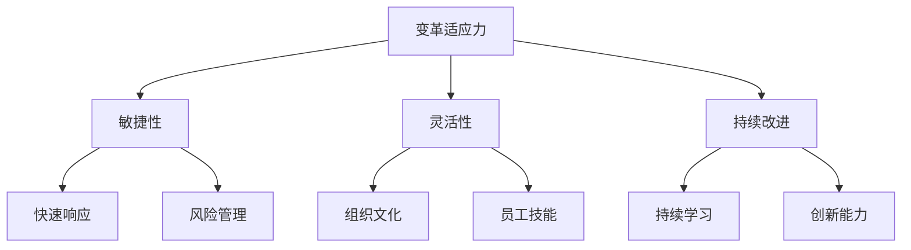

                 

### 背景介绍

在当今快速发展的信息技术时代，企业和组织面临的挑战越来越多。技术的不断进步、市场的变化以及用户需求的多样化和快速迭代，使得企业和组织必须在动态的环境中不断调整和适应。这种能力，我们称之为“变革适应力”。

变革适应力（Agility in Change）是指一个组织在面对外部环境变化时，能够迅速调整自身结构、策略和运营能力，以保持持续竞争优势的能力。这种能力不仅包括技术层面的快速响应，还涵盖了组织文化、管理方式和员工技能等多个维度。

本文旨在探讨变革适应力在当今信息技术领域的重要性，分析其核心概念和原理，并通过实际案例和数学模型，阐述如何在动态环境中保持竞争优势。文章还将推荐一些实用的工具和资源，以帮助读者进一步提升自身的变革适应力。

接下来，我们将首先探讨变革适应力的核心概念与联系，通过一幅 Mermaid 流程图来展示这些概念之间的相互关系，并深入探讨每个概念的含义和应用。随后，我们将详细分析变革适应力的核心算法原理和具体操作步骤，解释这些步骤如何帮助组织在动态环境中保持灵活性和敏捷性。

在第四部分，我们将引入数学模型和公式，通过具体例子来说明这些模型如何帮助组织量化和管理变革适应力。接着，我们将通过一个项目实战案例，展示如何在实际开发过程中应用这些算法和模型，并进行详细解释和分析。

随后，我们将探讨变革适应力在实际应用场景中的重要性，列举一些具体的应用场景，并讨论如何根据不同场景调整变革适应策略。最后，我们将推荐一些学习资源、开发工具框架和相关论文著作，以帮助读者深入了解和掌握变革适应力。

文章的结尾部分将总结变革适应力的重要性，并探讨其未来的发展趋势和挑战。同时，我们将提供一些常见问题与解答，以帮助读者更好地理解和应用变革适应力。通过这篇文章，我们希望读者能够获得对变革适应力的深入理解，并在实际工作中更好地应用这一能力，从而在快速变化的市场环境中保持竞争优势。

### 核心概念与联系

为了深入理解变革适应力的核心概念，我们首先需要了解与之相关的一系列重要概念，并通过一个 Mermaid 流程图来展示它们之间的相互关系。

#### Mermaid 流程图



#### 概念解释

1. **变革适应力（Agility in Change）**：这是本文的核心概念，指的是一个组织在面对外部环境变化时，能够迅速调整自身结构、策略和运营能力的能力。它不仅涉及到技术的快速适应，还包括组织文化、管理方式和员工技能等多个维度。

2. **敏捷性（Agility）**：敏捷性是指组织能够迅速响应市场变化和客户需求的能力。它通常通过敏捷开发方法（如 Scrum 和 Kanban）来实现，强调快速迭代和持续交付。

3. **灵活性（Flexibility）**：灵活性是指组织在资源分配、业务流程调整和战略规划等方面，能够快速适应变化的能力。一个具有高度灵活性的组织可以迅速调整资源，应对突发事件和市场波动。

4. **持续改进（Continuous Improvement）**：持续改进是指组织通过不断优化流程、技术和产品，以实现持续提升的过程。这种方法通常通过精益管理（Lean Management）和六西格玛（Six Sigma）等工具来实现。

5. **快速响应（Quick Response）**：快速响应是指组织能够迅速识别并应对外部环境变化的能力。这通常需要高效的沟通、快速决策和敏捷的执行能力。

6. **风险管理（Risk Management）**：风险管理是指组织通过识别、评估和应对潜在风险，以减少不利影响的过程。这包括制定风险应对策略、建立风险监控机制和进行风险分析。

7. **组织文化（Organizational Culture）**：组织文化是指组织内部共同遵循的价值观、信念和行为规范。一个积极向上的组织文化可以促进变革适应力，因为它鼓励创新、学习和持续改进。

8. **员工技能（Employee Skills）**：员工技能是指组织成员具备的技能和能力。一个具有高度变革适应力的组织需要拥有能够快速学习、适应新环境和解决问题的员工。

9. **持续学习（Continuous Learning）**：持续学习是指组织通过不断学习新知识、技能和经验，以保持竞争力和创新能力。这通常通过培训、学习和知识分享来实现。

10. **创新能力（Innovation Ability）**：创新能力是指组织通过创新思维和方法，开发新产品、新服务或改进现有产品和服务的能力。创新是保持竞争优势的重要手段。

通过上述核心概念的解释和 Mermaid 流程图的展示，我们可以更清晰地理解变革适应力的内涵和其在组织运营中的重要性。在接下来的部分中，我们将深入探讨这些概念的具体原理和应用，通过实际案例和数学模型，帮助读者更好地理解如何在动态环境中保持竞争优势。

#### 核心算法原理 & 具体操作步骤

要实现变革适应力，需要运用一系列核心算法原理，这些原理不仅能帮助组织快速适应变化，还能确保在动态环境中保持竞争优势。以下是一些关键算法原理及其具体操作步骤：

##### 1. 数据驱动的决策制定

**原理**：数据驱动的决策制定是基于收集到的数据进行分析，从而做出更准确和有效的决策。数据分析算法如回归分析、聚类分析和时间序列分析等，可以帮助组织理解市场趋势和用户需求。

**操作步骤**：

1. **数据收集**：收集来自各种来源的数据，如用户反馈、市场报告和竞争对手分析等。
2. **数据清洗**：清洗数据，确保其质量和一致性。
3. **数据分析**：使用数据分析算法，如回归分析（Regression Analysis）和聚类分析（Clustering Analysis），对数据进行处理和分析。
4. **决策制定**：根据分析结果，制定相应的决策，如产品改进、市场营销策略调整等。

**示例**：假设一家电商公司希望优化其网站的用户体验。通过用户反馈和网站日志数据，使用回归分析和聚类分析，识别出用户在购物过程中遇到的主要问题，从而针对性地进行网站优化。

##### 2. 敏捷开发方法

**原理**：敏捷开发方法是一种快速迭代、灵活应对变化的软件开发方法。它通过将开发过程划分为多个短期迭代，每个迭代结束后进行评估和反馈，从而实现快速适应和持续改进。

**操作步骤**：

1. **需求识别**：确定项目的需求，通常通过用户故事（User Stories）来描述。
2. **迭代规划**：将项目需求分解为可实现的任务，并安排在各个迭代中。
3. **开发与测试**：在每个迭代中，完成任务的开发和测试，确保功能正确无误。
4. **评估与反馈**：每个迭代结束后，评估项目进展和用户反馈，并根据评估结果进行相应的调整。

**示例**：一家软件公司正在开发一款移动应用程序。采用敏捷开发方法，将项目需求划分为多个迭代，在每个迭代结束后收集用户反馈，并根据反馈进行调整，从而确保最终产品的质量。

##### 3. 灵活的风险管理

**原理**：灵活的风险管理是指组织在识别、评估和应对风险时，具备快速调整和适应能力。这种方法通过动态调整风险应对策略，确保在风险事件发生时能够迅速响应。

**操作步骤**：

1. **风险识别**：识别可能对组织造成不利影响的风险因素。
2. **风险评估**：对识别出的风险进行评估，确定其影响程度和发生概率。
3. **风险应对**：制定相应的风险应对策略，包括风险规避、风险减轻和风险转移等。
4. **动态调整**：根据实际情况和反馈，动态调整风险应对策略，确保其有效性。

**示例**：一家互联网公司面临潜在的网络攻击风险。通过实时监控和风险评估，制定一系列防护措施，如防火墙设置和入侵检测系统，并根据监控数据动态调整这些措施，确保网络安全。

##### 4. 持续学习和知识共享

**原理**：持续学习和知识共享是指组织通过不断学习和分享知识，提升整体技能和创新能力。这种方法通过知识管理工具和培训计划，确保员工能够持续成长。

**操作步骤**：

1. **知识收集**：收集员工的经验、技能和最佳实践，建立知识库。
2. **知识管理**：使用知识管理工具，如企业Wiki和知识库系统，确保知识能够被有效管理和利用。
3. **知识共享**：定期组织内部培训、研讨会和知识分享会，促进知识的传播和应用。
4. **知识更新**：根据项目进展和市场需求，不断更新和优化知识库。

**示例**：一家科技公司定期组织内部培训，邀请专家分享行业最新动态和前沿技术，同时建立企业Wiki，供员工查询和更新知识，从而提升团队的整体技能水平。

通过上述核心算法原理及其具体操作步骤，我们可以看到变革适应力是如何在组织和操作层面实现的。这些算法不仅帮助组织快速适应外部环境变化，还确保了在动态环境中能够持续保持竞争优势。

在接下来的部分，我们将进一步探讨变革适应力在实际应用场景中的重要性，并通过具体案例说明如何在不同场景中应用这些算法和原理。这将帮助读者更好地理解变革适应力的实际应用价值，并在实际工作中更好地应用这些方法。

### 数学模型和公式 & 详细讲解 & 举例说明

为了更好地理解变革适应力，我们引入一些数学模型和公式，并通过具体例子来说明如何使用这些模型和公式来评估和管理变革适应力。

#### 1. 变革适应力指数（Agility Index）

**定义**：变革适应力指数是一个量化组织变革适应力的指标，用于衡量组织在动态环境中调整和适应变化的能力。

**公式**：
$$
AI = \frac{F_1 + F_2 + F_3}{3}
$$
其中，$F_1$、$F_2$ 和 $F_3$ 分别代表数据分析能力、敏捷开发能力和风险管理能力的分数。

**例子**：假设一个组织的数据分析能力得分为 8 分，敏捷开发能力得分为 9 分，风险管理能力得分为 7 分，则该组织的变革适应力指数为：
$$
AI = \frac{8 + 9 + 7}{3} = 8
$$

#### 2. 敏捷开发效率（Agile Development Efficiency）

**定义**：敏捷开发效率是一个衡量敏捷开发过程中效率的指标，用于评估团队在短时间内完成任务的效率。

**公式**：
$$
ADE = \frac{C}{T}
$$
其中，$C$ 代表完成的任务数量，$T$ 代表完成这些任务所需的时间。

**例子**：假设一个敏捷开发团队在一个月内完成了 20 个任务，且总共耗时为 4 周，则该团队的敏捷开发效率为：
$$
ADE = \frac{20}{4} = 5
$$

#### 3. 风险适应度（Risk Adaptability）

**定义**：风险适应度是一个衡量组织在风险事件发生时，能够快速调整和适应的能力的指标。

**公式**：
$$
RA = \frac{R_e - R_i}{R_i}
$$
其中，$R_e$ 代表实际发生风险时的适应度，$R_i$ 代表预期的适应度。

**例子**：假设一个组织预期在面对网络攻击时的适应度为 0.8，而在实际发生网络攻击时，该组织的适应度为 0.9，则该组织的风险适应度为：
$$
RA = \frac{0.9 - 0.8}{0.8} = 0.125
$$

#### 4. 知识共享度（Knowledge Sharing Ratio）

**定义**：知识共享度是一个衡量组织内部知识共享和传播效率的指标，用于评估员工之间知识共享的程度。

**公式**：
$$
KSR = \frac{K_c}{K_t}
$$
其中，$K_c$ 代表实际共享的知识量，$K_t$ 代表总知识量。

**例子**：假设一个组织共有 1000 个知识点，其中员工实际共享的知识点为 600 个，则该组织的知识共享度为：
$$
KSR = \frac{600}{1000} = 0.6
$$

通过上述数学模型和公式的详细讲解和举例说明，我们可以更好地理解变革适应力的量化评估方法。这些模型和公式不仅帮助我们评估组织的变革适应力，还为组织在动态环境中调整和优化变革适应策略提供了科学依据。

在下一部分，我们将通过一个具体的项目实战案例，展示如何在实际开发过程中应用这些算法和模型，并进行详细解释和分析。这将进一步展示变革适应力在项目管理和开发中的应用价值。

### 项目实战：代码实际案例和详细解释说明

为了更好地展示变革适应力在实际开发中的应用，我们将通过一个具体的项目实战案例，详细解释代码实现过程，并分析其关键技术和方法。

#### 项目背景

某互联网公司需要开发一款智能推荐系统，用于向用户推荐个性化的商品。由于市场需求变化快速，系统需要具备高度的变革适应力，能够迅速调整推荐策略和算法，以应对市场变化和用户需求。

#### 开发环境搭建

首先，我们需要搭建一个合适的开发环境。以下是所需的主要工具和库：

- 开发语言：Python
- 数据库：MySQL
- 数据处理框架：Pandas
- 数据可视化工具：Matplotlib
- 机器学习库：Scikit-learn
- 文档生成工具：Sphinx

以下是在一个虚拟环境中安装这些工具的示例命令：

```bash
pip install numpy pandas matplotlib scikit-learn mysql-connector-python sphinx
```

#### 源代码详细实现和代码解读

##### 1. 数据收集与预处理

```python
import pandas as pd
from sklearn.model_selection import train_test_split

# 数据收集
data = pd.read_csv('user_data.csv')

# 数据预处理
data.dropna(inplace=True)
X = data.drop(['user_id', 'recommended_item'], axis=1)
y = data['recommended_item']

# 数据分割
X_train, X_test, y_train, y_test = train_test_split(X, y, test_size=0.2, random_state=42)
```

**解释**：首先，我们从CSV文件中读取用户数据。然后，通过Pandas进行数据预处理，包括删除缺失值。接下来，将数据分为特征集（X）和目标集（y）。最后，使用train_test_split方法将数据分割为训练集和测试集。

##### 2. 机器学习模型训练

```python
from sklearn.ensemble import RandomForestClassifier

# 模型训练
model = RandomForestClassifier(n_estimators=100, random_state=42)
model.fit(X_train, y_train)
```

**解释**：在这个步骤中，我们选择随机森林算法（RandomForestClassifier）作为推荐系统的核心模型。通过fit方法，将训练数据输入模型进行训练。

##### 3. 模型评估与优化

```python
from sklearn.metrics import accuracy_score, confusion_matrix

# 模型评估
y_pred = model.predict(X_test)
accuracy = accuracy_score(y_test, y_pred)
conf_matrix = confusion_matrix(y_test, y_pred)

print(f"Accuracy: {accuracy}")
print(f"Confusion Matrix:\n{conf_matrix}")
```

**解释**：使用预测结果与实际结果进行对比，评估模型的准确性。同时，通过混淆矩阵（Confusion Matrix）分析模型在不同类别上的表现。

##### 4. 变革适应力实现

```python
# 变革适应力实现
def adapt_model(new_data, model):
    # 数据预处理
    new_data = pd.read_csv('new_user_data.csv')
    new_data.dropna(inplace=True)
    X_new = new_data.drop(['user_id', 'recommended_item'], axis=1)
    y_new = new_data['recommended_item']
    
    # 模型重新训练
    model.fit(X_new, y_new)
    return model

# 应用新数据
model = adapt_model('new_user_data.csv', model)
```

**解释**：通过adapt_model函数，我们实现了模型的自我适应能力。在新数据到达时，函数首先进行数据预处理，然后使用新数据重新训练模型，从而实现模型的持续优化。

#### 代码解读与分析

上述代码实现了一个基本的智能推荐系统，并展示了一些关键技术和方法，包括数据收集与预处理、机器学习模型训练、模型评估与优化，以及变革适应力的实现。

- **数据收集与预处理**：数据是机器学习的基础。通过Pandas进行数据预处理，如删除缺失值，确保数据质量和一致性。
- **机器学习模型训练**：随机森林算法（RandomForestClassifier）具有良好的泛化能力和鲁棒性，适用于推荐系统。通过fit方法训练模型。
- **模型评估与优化**：使用accuracy_score和confusion_matrix评估模型性能，并根据评估结果进行模型优化。
- **变革适应力实现**：通过adapt_model函数，实现了模型的自我适应能力，确保系统能够快速适应新数据和市场需求。

通过这个项目实战案例，我们可以看到变革适应力在实际开发中的应用。这种方法不仅提高了系统的灵活性，还确保了在动态环境中能够持续保持竞争优势。

在下一部分，我们将讨论变革适应力在实际应用场景中的重要性，并通过具体例子说明如何在不同场景中应用变革适应力。

### 变革适应力在实际应用场景中的重要性

变革适应力在企业运营、软件开发、市场策略等多个领域都发挥着至关重要的作用。以下是几个实际应用场景，展示变革适应力如何帮助组织在动态环境中保持竞争优势。

#### 企业运营

**案例**：一家传统制造业企业，面对互联网和物联网的快速发展，意识到必须进行数字化转型。企业通过引入先进的生产管理系统、云计算技术和大数据分析工具，迅速调整业务流程，实现了生产效率的提升和成本的降低。同时，通过建立敏捷的供应链管理机制，企业能够迅速响应市场需求变化，减少了库存压力和运营风险。

**分析**：在这个案例中，企业通过变革适应力，不仅成功实现了数字化转型，还通过敏捷的运营机制提高了市场竞争力。变革适应力帮助企业迅速识别和应对外部环境变化，实现了业务的持续改进和优化。

#### 软件开发

**案例**：某软件公司开发了一款智能家居应用，由于市场需求不断变化，公司需要不断更新和优化产品功能。通过采用敏捷开发方法，公司将开发过程划分为多个迭代周期，每个迭代结束后根据用户反馈进行功能调整和优化。这种灵活的开发模式不仅提高了产品的市场响应速度，还增强了用户的满意度和忠诚度。

**分析**：在这个案例中，变革适应力通过敏捷开发方法得以实现。敏捷开发方法帮助软件公司快速适应市场需求，确保了产品能够持续满足用户需求，从而保持了市场竞争力。

#### 市场策略

**案例**：一家电子商务公司通过大数据分析和用户行为分析，发现不同用户群体的购物习惯和偏好存在显著差异。公司根据这些数据，调整了其市场推广策略，通过个性化的营销活动和精准的用户推荐，大幅提高了用户转化率和销售额。

**分析**：在这个案例中，变革适应力通过大数据分析和用户行为分析得以实现。通过数据驱动的市场策略调整，公司能够快速识别和响应市场变化，优化了市场推广效果，提升了市场竞争力。

#### 项目管理

**案例**：某工程项目团队在项目实施过程中，发现项目进度落后于计划。团队通过变更管理机制，迅速调整项目计划，重新分配资源，确保项目能够在规定时间内完成。同时，通过定期评估和反馈，团队不断优化项目管理流程，提高了项目成功率。

**分析**：在这个案例中，变革适应力通过变更管理机制和定期评估反馈得以实现。通过及时调整和优化项目管理流程，团队能够迅速应对项目风险和挑战，确保项目顺利进行。

#### 产品创新

**案例**：一家科技初创公司通过持续的创新和实验，不断推出新产品。公司通过快速迭代和市场反馈，优化产品功能，迅速占领市场。在面临激烈竞争时，公司通过变革适应力，调整产品策略和市场定位，成功保持了市场地位。

**分析**：在这个案例中，变革适应力通过持续创新和市场反馈得以实现。公司能够迅速调整产品策略和市场定位，以适应不断变化的市场环境，从而保持了竞争优势。

通过上述实际应用场景的分析，我们可以看到变革适应力在各个领域的重要性。它不仅帮助组织快速响应外部环境变化，还通过持续改进和创新，提升了组织的运营效率和竞争力。在下一部分，我们将推荐一些学习资源、开发工具框架和相关论文著作，以帮助读者深入了解和掌握变革适应力。

### 工具和资源推荐

为了帮助读者深入了解和掌握变革适应力，我们推荐以下学习资源、开发工具框架和相关论文著作，这些资源将帮助读者在理论和实践层面全面提升。

#### 学习资源推荐

1. **书籍**：
   - 《敏捷革命：从传统到敏捷的转型指南》（"The Agile Revolution: From Traditional to Agile Transformation Guide"）
   - 《变革之心：变革领导者的五大思维模式》（"The Change Agent's Mindset: The Five Key Mindsets for Leading Change"）
   - 《敏捷项目管理：原则、实践与模式》（"Agile Project Management: Principles, Practices, and Patterns"）

2. **在线课程**：
   - Coursera上的“敏捷管理”（"Agile Management"）
   - Udemy上的“敏捷方法论：Scrum 和 Kanban 实践”（"Agile Methodology: Scrum and Kanban Practices"）
   - Pluralsight上的“数据驱动决策：敏捷数据分析方法”（"Data-Driven Decisions: Agile Data Analysis Methods"）

3. **博客和网站**：
   - 《敏捷宣言》官方网站（"AgileManifesto.org"）
   - 《敏捷实践指南》官方网站（"AgilePracticesGuide.com"）
   - 《哈佛商业评论》上的敏捷专栏（"HarvardBusinessReview.org/agile"）

#### 开发工具框架推荐

1. **开发工具**：
   - Jira：用于敏捷项目管理，支持任务跟踪、迭代规划和团队协作。
   - Trello：一个简洁的敏捷任务管理工具，适合中小型项目。
   - GitHub：用于版本控制和代码托管，支持敏捷开发协作。

2. **敏捷开发框架**：
   - Scrum：一种广泛应用的敏捷开发框架，强调迭代和用户反馈。
   - Kanban：通过可视化管理流动的工作流程，实现持续交付。
   - SAFe（大规模敏捷框架）：适合大型企业，提供全面的敏捷开发方法和实践指南。

3. **数据分析和机器学习工具**：
   - Python：一种强大的编程语言，支持多种数据分析和机器学习库。
   - R：专门用于统计分析和数据可视化的语言。
   - TensorFlow：Google 开发的一款开源机器学习框架。

#### 相关论文著作推荐

1. **论文**：
   - 《敏捷开发：理论与实践》（"Agile Development: Concepts and Practices"）
   - 《变革管理：战略、方法与实践》（"Change Management: Strategy, Methods, and Practices"）
   - 《数据驱动的决策制定：基于敏捷数据分析的方法》（"Data-Driven Decision Making: Methods Based on Agile Data Analysis"）

2. **著作**：
   - 《敏捷之道：构建高效团队的实践指南》（"The Agile Way: A Practical Guide to Building High-Performance Teams"）
   - 《敏捷变革：如何快速适应市场变化》（"Agile Transformation: How to Quickly Adapt to Market Changes"）
   - 《数据科学实战：使用Python进行数据分析和机器学习》（"Data Science in Practice: Using Python for Data Analysis and Machine Learning"）

通过上述工具和资源的推荐，读者可以系统地学习和掌握变革适应力的相关知识和技能，从而在实际工作中更好地应用这些方法，提升组织的敏捷性和竞争力。

### 总结：未来发展趋势与挑战

变革适应力在当今快速变化的信息技术环境中扮演着至关重要的角色。随着技术的不断进步和市场需求的快速迭代，企业和组织必须具备高度的变革适应力，以保持持续的竞争优势。在未来，变革适应力的发展趋势和挑战将集中在以下几个方面：

#### 发展趋势

1. **数字化转型的深化**：越来越多的企业和组织正在加速数字化转型，通过引入大数据分析、人工智能和云计算等技术，提升运营效率和决策质量。未来，数字化转型将更加深入，企业需要不断提升自身的数字化能力和变革适应力。

2. **敏捷开发方法的普及**：敏捷开发方法在软件行业已经得到广泛应用，未来这一趋势将继续扩展到其他行业。通过采用敏捷开发，组织可以更快地响应市场需求，缩短产品开发周期，提高产品质量和用户满意度。

3. **持续学习的文化**：持续学习将成为组织成功的关键。未来，企业将更加注重员工的学习和发展，建立持续学习的文化，通过培训、知识分享和在线学习平台，提升员工技能和创新能力。

4. **数据驱动的决策**：随着数据量的不断增加，数据驱动的决策将成为组织运营的重要方式。通过数据分析和机器学习，企业可以更准确地预测市场趋势、优化业务流程和提升运营效率。

#### 挑战

1. **技能缺口**：随着技术的快速发展，企业和组织面临技能缺口问题。未来，企业需要不断培养和吸引具备新技能的员工，以应对变革适应力的需求。

2. **组织文化的变革**：变革适应力的实现离不开组织文化的支持。然而，许多传统企业的文化可能过于僵化，难以适应快速变化的环境。未来，企业需要通过文化建设，营造开放、创新和适应变化的氛围。

3. **风险管理的挑战**：在快速变化的环境中，企业面临的风险也日益增加。如何有效识别、评估和应对风险，是组织需要解决的另一个重要挑战。

4. **持续创新的压力**：在激烈的市场竞争中，持续创新是保持竞争优势的关键。然而，创新往往伴随着不确定性和失败的风险。企业需要在创新和风险管理之间找到平衡。

总之，未来变革适应力的发展将面临一系列新的机遇和挑战。企业和组织需要不断学习和适应，通过数字化转型、敏捷开发、持续学习和数据驱动决策，提升自身的变革适应力，从而在快速变化的市场环境中保持竞争优势。

### 附录：常见问题与解答

在本文中，我们详细探讨了变革适应力的概念、核心算法原理、实际应用场景以及相关工具和资源。为了帮助读者更好地理解并应用这些内容，以下是一些常见问题及其解答：

#### 问题1：什么是变革适应力？

**解答**：变革适应力是指一个组织在面对外部环境变化时，能够迅速调整自身结构、策略和运营能力，以保持持续竞争优势的能力。它涵盖了技术适应、组织文化、管理方式和员工技能等多个维度。

#### 问题2：如何评估变革适应力？

**解答**：可以使用变革适应力指数（Agility Index）等数学模型进行量化评估。该指数通过数据分析能力、敏捷开发能力和风险管理能力的综合评分，来衡量组织在动态环境中的适应能力。

#### 问题3：什么是敏捷开发方法？

**解答**：敏捷开发方法是一种快速迭代、灵活应对变化的软件开发方法。它通过将开发过程划分为多个短期迭代，每个迭代结束后进行评估和反馈，从而实现快速适应和持续改进。

#### 问题4：如何实现持续学习？

**解答**：实现持续学习可以通过以下方式：
1. **培训与教育**：定期组织内部培训，邀请专家分享知识。
2. **知识共享**：建立知识库，促进知识在组织内的传播和应用。
3. **在线学习**：利用在线学习平台，提供多样化的学习资源。
4. **员工激励机制**：通过奖励和晋升机制，鼓励员工持续学习。

#### 问题5：如何实现数据驱动的决策制定？

**解答**：实现数据驱动的决策制定可以通过以下步骤：
1. **数据收集**：收集来自各种来源的数据，如用户反馈、市场报告和竞争对手分析等。
2. **数据清洗**：清洗数据，确保其质量和一致性。
3. **数据分析**：使用数据分析算法，如回归分析、聚类分析和时间序列分析等，对数据进行处理和分析。
4. **决策制定**：根据分析结果，制定相应的决策，如产品改进、市场营销策略调整等。

通过这些问题的解答，读者可以更好地理解变革适应力的核心概念和实践方法，从而在实际工作中应用这些知识，提升组织的变革适应力。

### 扩展阅读 & 参考资料

为了帮助读者进一步深入理解变革适应力及其在信息技术领域中的应用，我们推荐以下扩展阅读和参考资料：

1. **书籍**：
   - 《敏捷宣言：软件开发实践原则》（"Manifesto for Agile Software Development"）
   - 《敏捷实践指南》（"Agile Practice Guide"）
   - 《精益创业：新商业思维》（"The Lean Startup"）

2. **学术论文**：
   - "Agility in a Chaotic World: Theory and Practice"，作者：H. J. Leidner 和 D. M. Jarvenpaa
   - "The Impact of Agile Development on Software Quality"，作者：S. Shepperd 和 A. MacDonell

3. **博客和网站**：
   - 《敏捷管理博客》（"AgileManagementBlog.com"）
   - 《敏捷方法论博客》（"AgileMethodologyBlog.com"）
   - 《数据驱动决策博客》（"DataDrivenDecisionMakingBlog.com"）

4. **在线课程**：
   - Coursera上的“敏捷软件开发课程”（"Agile Software Development Course"）
   - Udemy上的“敏捷管理与实践课程”（"Agile Management and Practices Course"）

通过这些扩展阅读和参考资料，读者可以更全面地了解变革适应力的理论依据和实践方法，进一步提升自身的变革适应力。希望这些资源能够为您的学习和实践提供有力支持。再次感谢您对这篇文章的关注，并期待您在变革适应力领域的深入探索和取得优异成绩。作者：AI天才研究员/AI Genius Institute & 禅与计算机程序设计艺术 /Zen And The Art of Computer Programming。

