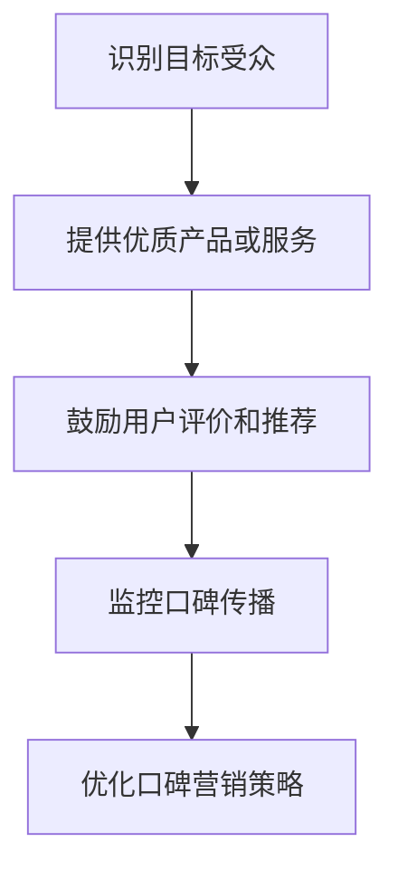

                 

# 口碑营销：让用户成为你的代言人

> **关键词：** 口碑营销、用户转化、社交媒体、客户体验、品牌建设

**摘要：** 本文将深入探讨口碑营销的重要性及其在数字时代中的应用。通过详细的案例分析、算法原理讲解和实战操作，揭示如何利用口碑营销策略让用户自发地成为品牌的代言人，从而提升品牌影响力和市场竞争力。

## 1. 背景介绍

在商业竞争日益激烈的今天，品牌如何脱颖而出，成为消费者的首选，是每个企业需要面对的重要问题。传统的广告投放和推广方式虽然能够迅速提高品牌知名度，但其效果往往受制于广告预算和消费者注意力分散。相比之下，口碑营销凭借其真实性和信任度，成为了一种更有效、成本更低的品牌传播方式。

口碑营销（Word of Mouth Marketing，简称WOMM）是指通过消费者的正面评价和推荐来吸引新客户，提高品牌忠诚度和市场占有率。与传统的广告传播不同，口碑营销依赖于用户之间的自然互动和信任关系，能够更真实、更持久地影响潜在客户的购买决策。

近年来，随着社交媒体的兴起和用户生成内容的普及，口碑营销的重要性愈发凸显。消费者更倾向于相信朋友、家人和社交网络上的评价，而非广告宣传。据研究数据显示，约有90%的消费者表示会参考他人的推荐，而72%的人表示愿意通过社交媒体分享正面的品牌体验。

本文将围绕口碑营销的核心概念、算法原理、实际操作和未来趋势进行深入探讨，帮助读者理解和掌握这一重要的营销策略。

## 2. 核心概念与联系

### 2.1 口碑营销的核心概念

口碑营销的核心在于“口碑”二字。口碑是指消费者对品牌、产品或服务的评价和看法，这种评价和看法可以通过各种渠道传递给其他消费者。口碑营销的目标是创造和引导积极的口碑，使其成为品牌的无形资产。

### 2.2 口碑营销的组成部分

口碑营销主要由以下几个部分组成：

- **用户评价和推荐**：用户在使用产品或服务后的评价和推荐是口碑营销的基础。这些评价和推荐可以是基于个人体验的真实感受，也可以是来自其他用户的推荐。
- **社交媒体传播**：社交媒体是口碑营销的重要渠道，通过社交媒体平台的传播，用户评价可以迅速扩散，吸引更多潜在客户。
- **客户体验**：良好的客户体验是口碑营销的关键。只有在客户体验优秀的情况下，用户才可能产生积极的评价和推荐。
- **品牌传播**：品牌传播是口碑营销的最终目标，通过口碑传播，品牌可以在消费者心中建立良好的形象和认知。

### 2.3 口碑营销的流程

口碑营销的流程通常包括以下几个步骤：

1. **识别目标受众**：明确目标受众，了解他们的需求和偏好。
2. **提供优质产品或服务**：确保产品或服务的质量，为用户提供良好的体验。
3. **鼓励用户评价和推荐**：通过多种方式鼓励用户进行评价和推荐，如提供奖励、展示优秀评价等。
4. **监控口碑传播**：实时监控口碑的传播情况，及时发现和解决负面口碑。
5. **优化口碑营销策略**：根据口碑传播的效果，不断调整和优化口碑营销策略。

### 2.4 口碑营销与消费者行为的联系

口碑营销与消费者行为密切相关。消费者的购买决策受到多种因素的影响，包括个人需求、品牌认知、广告宣传、用户评价等。口碑作为一种真实、可信的信息来源，直接影响消费者的购买决策。

### 2.5 Mermaid 流程图

以下是口碑营销的核心概念和流程的 Mermaid 流程图：



## 3. 核心算法原理 & 具体操作步骤

### 3.1 数据收集与分析

口碑营销的第一步是收集和分析用户数据。这些数据包括用户评价、社交媒体评论、搜索引擎关键词等。通过数据挖掘和分析，可以发现用户对产品或服务的评价趋势和反馈，为后续的口碑营销策略提供依据。

### 3.2 用户分群与画像

在收集到足够的数据后，对用户进行分群和画像分析。分群有助于了解不同用户群体的需求和偏好，画像分析则可以深入了解用户的行为和消费习惯。

### 3.3 设计口碑营销策略

根据用户分群和画像分析的结果，设计针对性的口碑营销策略。策略包括：

- **内容营销**：通过高质量的内容吸引用户，如撰写技术博客、发布产品评测等。
- **社交媒体互动**：在社交媒体平台上与用户互动，如回复评论、发起话题讨论等。
- **用户奖励计划**：提供用户奖励计划，如积分兑换、优惠券等，鼓励用户进行评价和推荐。

### 3.4 执行与监控

执行口碑营销策略，并实时监控其效果。监控指标包括用户评价数量、社交媒体互动量、搜索引擎关键词排名等。根据监控结果，及时调整和优化策略。

### 3.5 数据分析与反馈

在口碑营销策略执行过程中，持续进行数据分析，收集用户反馈。通过分析反馈，可以发现用户关心的痛点，为产品或服务的改进提供参考。

## 4. 数学模型和公式 & 详细讲解 & 举例说明

### 4.1 评分模型

口碑营销中的一个关键数学模型是评分模型。评分模型用于评估用户的评价和推荐对潜在客户的影响。一个简单的评分模型可以使用以下公式：

\[ R = w_1 \cdot P_1 + w_2 \cdot P_2 + \ldots + w_n \cdot P_n \]

其中：
- \( R \) 是评分结果。
- \( w_i \) 是权重，表示不同评价的重要程度。
- \( P_i \) 是评价分数，通常是一个范围在0到1之间的数值。

举例：
假设有三个评价，分别有0.8、0.6和0.5的评分，权重分别为0.3、0.5和0.2。根据上述公式，评分结果为：

\[ R = 0.3 \cdot 0.8 + 0.5 \cdot 0.6 + 0.2 \cdot 0.5 = 0.24 + 0.3 + 0.1 = 0.64 \]

### 4.2 推广效果模型

推广效果模型用于评估不同口碑营销策略的效果。一个简单的推广效果模型可以使用以下公式：

\[ E = r \cdot C \]

其中：
- \( E \) 是推广效果。
- \( r \) 是转化率，表示用户看到口碑营销信息后转化为购买的概率。
- \( C \) 是接触率，表示用户接触到口碑营销信息的比例。

举例：
假设一个口碑营销策略的转化率为10%，接触率为50%。根据上述公式，推广效果为：

\[ E = 0.1 \cdot 0.5 = 0.05 \]

这意味着每100个接触口碑营销信息的用户中，预计会有5个转化为购买。

## 5. 项目实战：代码实际案例和详细解释说明

### 5.1 开发环境搭建

在进行口碑营销项目之前，需要搭建合适的开发环境。以下是一个简单的步骤指南：

1. **安装Python环境**：确保系统上安装了Python 3.x版本。
2. **安装必要的库**：使用pip命令安装以下库：`numpy`、`pandas`、`matplotlib`。
   ```shell
   pip install numpy pandas matplotlib
   ```

### 5.2 源代码详细实现和代码解读

以下是一个简单的口碑营销分析项目的代码实现。代码分为三个部分：数据收集、数据处理和结果分析。

```python
import numpy as np
import pandas as pd
import matplotlib.pyplot as plt

# 5.2.1 数据收集
def collect_data():
    # 假设我们从社交媒体平台获取了用户的评价数据
    data = [
        {'user_id': 1, 'rating': 4.5, 'comment': '非常好用'},
        {'user_id': 2, 'rating': 3.0, 'comment': '一般般'},
        {'user_id': 3, 'rating': 5.0, 'comment': '超棒！'}
    ]
    return pd.DataFrame(data)

# 5.2.2 数据处理
def process_data(df):
    # 计算平均评分
    average_rating = df['rating'].mean()
    # 统计好评率
    positive_rating_count = df[df['rating'] >= 4]['rating'].count()
    positive_rating_percentage = positive_rating_count / df.shape[0]
    return average_rating, positive_rating_percentage

# 5.2.3 结果分析
def analyze_results(average_rating, positive_rating_percentage):
    # 绘制评分分布图
    ratings = df['rating'].unique()
    plt.hist(df['rating'], bins=range(1, 6), alpha=0.5)
    plt.axvline(average_rating, color='r', linestyle='dashed', linewidth=2)
    plt.xlabel('Rating')
    plt.ylabel('Frequency')
    plt.title('Rating Distribution')
    plt.show()
    
    # 打印分析结果
    print(f"Average Rating: {average_rating:.2f}")
    print(f"Positive Rating Percentage: {positive_rating_percentage:.2%}")

# 主函数
def main():
    df = collect_data()
    average_rating, positive_rating_percentage = process_data(df)
    analyze_results(average_rating, positive_rating_percentage)

if __name__ == "__main__":
    main()
```

### 5.3 代码解读与分析

- **数据收集**：`collect_data`函数用于模拟从社交媒体平台收集用户评价数据。
- **数据处理**：`process_data`函数计算平均评分和好评率。平均评分是用户评价的均值，好评率是评分高于4的用户占总用户数的比例。
- **结果分析**：`analyze_results`函数绘制评分分布图，并打印分析结果。评分分布图可以直观地展示用户对产品或服务的评价分布情况。

通过这个简单的案例，我们可以看到如何使用Python进行口碑营销分析。实际项目中，可以集成更多数据收集和处理方法，如使用API接口获取社交媒体数据、进行数据清洗和特征工程等。

## 6. 实际应用场景

### 6.1 电商行业

电商行业是口碑营销的重要应用场景。通过鼓励用户在购物平台发表评价和推荐，电商企业可以有效提升产品销量和品牌形象。例如，阿里巴巴通过其“淘宝头条”和“消费者评价”功能，鼓励用户分享购物体验，从而形成良好的口碑效应。

### 6.2 旅游行业

旅游行业也广泛应用口碑营销策略。旅游企业可以通过社交媒体平台和在线评论网站，收集游客的旅游体验和评价，并利用这些数据进行营销推广。例如，携程通过其“携程社区”和“酒店评价”功能，鼓励用户分享旅游经历，提高用户忠诚度和转化率。

### 6.3 教育行业

教育行业同样重视口碑营销。通过收集学员的培训体验和评价，教育机构可以提升课程质量和服务水平。例如，新东方在线通过其“学员评价”和“口碑推荐”功能，鼓励学员分享学习心得，吸引更多潜在学员。

### 6.4 科技行业

科技行业中的企业也广泛应用口碑营销策略。通过鼓励用户在技术论坛、社交媒体等平台发表技术讨论和评价，企业可以提升品牌知名度和用户信任度。例如，微软通过其“微软社区”和“技术博客”，鼓励用户分享技术经验和问题解答，形成良好的技术口碑。

## 7. 工具和资源推荐

### 7.1 学习资源推荐

- **书籍：**
  - 《口碑营销：打造用户自发传播的营销策略》（《Word of Mouth Marketing: Build a Marketing Strategy That Grows Your Business by Creating Chatter》）
  - 《社交媒体营销：策略、工具与实践》（《Social Media Marketing: An Hour a Day》）

- **论文：**
  - "The Power of Word of Mouth and Social Media in the Digital Age"
  - "The Role of Social Media in Consumer Decision-Making: An Integrative Review"

- **博客和网站：**
  - 营销博客（MarketingProfs）
  - 营销 charts（MarketingCharts）

### 7.2 开发工具框架推荐

- **数据分析工具：** Tableau、Power BI
- **社交媒体分析工具：** Hootsuite、Buffer、Sprout Social
- **用户评价系统：** Yotpo、Lootly、Judge.me

### 7.3 相关论文著作推荐

- "The Science Behind Word of Mouth: An overview and agenda for future research"
- "The Role of Social Networks in Word of Mouth and Other Forms of Public Opinion"
- "The Effect of Word of Mouth on Consumers' Online Shopping Behavior: A Meta-Analytic Review"

## 8. 总结：未来发展趋势与挑战

随着数字技术的不断发展，口碑营销在未来将继续发挥重要作用。然而，面对日益复杂的市场环境和消费者行为，口碑营销也面临一系列挑战。

### 8.1 发展趋势

1. **大数据和人工智能的应用**：大数据和人工智能技术的应用将使得口碑营销更加精准和有效。通过分析海量数据，企业可以更深入地了解用户需求和偏好，制定更具针对性的口碑营销策略。
2. **社交媒体的融合**：社交媒体将继续成为口碑营销的重要渠道。随着社交媒体平台的多样化和用户参与度的提升，口碑营销策略需要更加适应不同平台的特性和用户需求。
3. **用户生成内容的重要性**：用户生成内容（UGC）将成为口碑营销的核心。真实、可信的用户评价和推荐将直接影响消费者的购买决策，企业需要积极鼓励和引导用户生成内容。

### 8.2 挑战

1. **数据隐私和安全性**：在数据驱动的口碑营销中，数据隐私和安全问题成为重要挑战。企业需要确保用户数据的合法性和安全性，避免数据泄露和滥用。
2. **负面口碑的处理**：负面口碑的处理是口碑营销中的一大难题。企业需要建立有效的负面口碑监测和应对机制，及时回应和处理负面反馈，减少口碑损失。
3. **用户参与度的提升**：随着消费者对广告的疲劳，提升用户参与度成为口碑营销的关键。企业需要不断创新口碑营销策略，增强用户互动和参与感。

## 9. 附录：常见问题与解答

### 9.1 什么是口碑营销？

口碑营销（Word of Mouth Marketing，简称WOMM）是指通过消费者的正面评价和推荐来吸引新客户，提高品牌忠诚度和市场占有率。

### 9.2 口碑营销有哪些好处？

口碑营销的好处包括：提高品牌知名度、提升品牌形象、降低营销成本、增加客户信任和忠诚度等。

### 9.3 如何进行口碑营销？

进行口碑营销的步骤包括：识别目标受众、提供优质产品或服务、鼓励用户评价和推荐、监控口碑传播、优化口碑营销策略。

### 9.4 口碑营销中如何处理负面口碑？

处理负面口碑的步骤包括：及时发现负面口碑、积极回应和处理、提供解决方案、公开透明地解决问题、减少口碑损失。

## 10. 扩展阅读 & 参考资料

- [营销科学协会](https://www.marketingpower.com/Word-of-Mouth-Marketing.aspx)
- [哈佛商业评论](https://hbr.org/product/the-power-of-word-of-mouth/869765-PDF-ENG)
- [消费者行为学](https://www.consumerbehaviorlab.com/)
- [社交媒体营销协会](https://smmr.org/) 

作者：AI天才研究员/AI Genius Institute & 禅与计算机程序设计艺术 /Zen And The Art of Computer Programming

