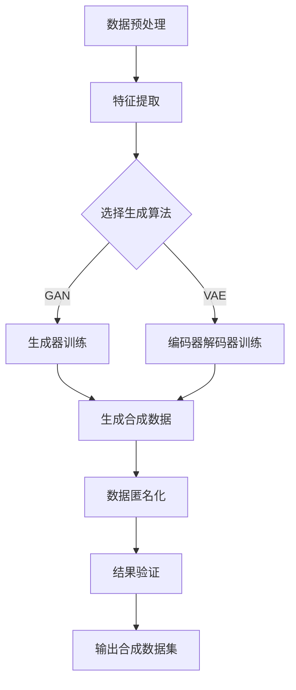

                 

### 背景介绍

在当今信息时代，数据的重要性日益凸显。随着互联网和移动设备的普及，大量的个人数据被收集和存储，这些数据不仅包括用户的基本信息，还涵盖了他们的社交行为、消费习惯和位置信息等。然而，数据的价值与其隐私之间存在一种天然的紧张关系。传统的数据保护措施，如数据加密和访问控制，虽然在某些程度上能够缓解这一问题，但它们通常依赖于数据不被泄露的前提。一旦数据泄露，隐私泄露的风险将极大地增加。

在这种背景下，合成数据集的概念逐渐成为人们关注的焦点。合成数据集是指通过对真实数据进行模拟和合成，创建出一套与原始数据在统计特性上高度相似，但真实数据内容被高度匿名化的数据集。这种数据集不仅能够保留真实数据的统计特性，避免隐私泄露的风险，还能够为研究人员和开发者提供丰富的数据资源，从而推动技术的进步。

本文将深入探讨合成数据集的概念、核心原理以及其在应对隐私保护中的应用。首先，我们将介绍合成数据集的定义和基本概念，接着阐述其与隐私保护之间的联系。然后，我们将探讨当前在合成数据集领域的研究进展和主要挑战，并介绍一些流行的合成数据集生成算法。最后，我们将通过具体案例展示合成数据集在实际项目中的应用，并提供一些实用的工具和资源推荐，以帮助读者进一步了解和掌握这一领域。

### 核心概念与联系

合成数据集的核心概念围绕着如何生成与真实数据在统计特性上高度相似，但内容高度匿名化的数据集。为了更好地理解这一概念，我们可以从以下几个方面进行详细阐述。

首先，**真实数据的统计特性**是合成数据集生成的基础。统计特性包括数据的分布、均值、方差、相关性等，它们是数据集质量的保证。例如，一个包含用户年龄、性别和收入的真实数据集，其性别分布可能为男性占60%，女性占40%，而年龄和收入之间可能存在一定的相关性。为了创建一个与之相似的合成数据集，我们需要确保这些统计特性在合成数据中得以保留。

其次，**数据的匿名化**是实现隐私保护的关键。匿名化过程旨在确保合成数据中的个人识别信息被移除或替换，从而降低隐私泄露的风险。匿名化的方法多种多样，包括数据泛化、数据扰动和数据替换等。例如，将具体姓名替换为匿名标识符，或将具体地址替换为模糊的地理位置，这些都是常见的匿名化手段。

**生成算法**是实现合成数据集的核心技术。目前，已有多种生成算法被提出和应用于合成数据集的生成。以下是一些流行的算法及其基本原理：

1. **生成对抗网络（GAN）**：GAN是一种深度学习框架，通过两个神经网络（生成器和判别器）的对抗训练，生成与真实数据相似的数据集。生成器尝试生成数据以欺骗判别器，而判别器则努力区分生成数据和真实数据。经过多次迭代，生成器能够生成越来越真实的数据。

2. **变分自编码器（VAE）**：VAE是一种基于概率生成模型的深度学习算法，通过编码器和解码器来生成数据。编码器将输入数据映射到一个潜在空间，解码器则从潜在空间中生成数据。VAE通过最大化数据的后验概率来学习数据分布，从而生成与真实数据相似的合成数据。

3. **基于规则的方法**：这种方法通过定义一系列规则来生成数据。例如，根据真实数据中的统计规律，模拟生成类似的数据。这种方法通常简单且易于实现，但可能在生成复杂数据时效果有限。

4. **深度卷积生成网络（DCGAN）**：DCGAN是一种基于卷积神经网络的GAN变体，适用于处理高维数据。DCGAN利用卷积和反卷积操作，通过多层神经网络生成高度细节化的图像或数据。

下面是合成数据集生成流程的Mermaid流程图：



在这个流程图中，A表示对原始数据进行预处理，包括数据清洗、归一化等步骤；B表示从预处理后的数据中提取关键特征；C表示选择合适的生成算法；D和E分别表示GAN和VAE的训练过程；F表示生成合成数据；G表示对生成的数据进行匿名化处理；H表示对结果进行验证，确保合成数据集在统计特性上与真实数据相似；I表示输出最终的合成数据集。

通过这些核心概念和生成算法的理解，我们可以看到合成数据集在隐私保护和数据利用之间架起了一座桥梁。合成数据集不仅能够保护用户隐私，还能为研究人员和开发者提供丰富的数据资源，推动技术的创新和发展。

### 核心算法原理 & 具体操作步骤

为了更深入地理解合成数据集的生成，我们需要详细探讨几种核心算法的原理和操作步骤。以下将介绍生成对抗网络（GAN）、变分自编码器（VAE）以及基于规则的方法，并通过实际示例进行说明。

#### 1. 生成对抗网络（GAN）

**原理**：

GAN由两部分组成：生成器（Generator）和判别器（Discriminator）。生成器的任务是生成类似于真实数据的新数据，而判别器的任务是区分生成数据和真实数据。这两个网络在对抗训练中互相竞争，生成器试图生成更真实的数据，而判别器则努力提高其判断能力。通过这种对抗训练，生成器最终能够生成高度真实的数据。

**操作步骤**：

1. **初始化**：随机初始化生成器和判别器的权重。
2. **生成器训练**：生成器从噪声分布中抽取随机向量，通过神经网络生成假数据。判别器对生成的假数据和真实数据进行分类。
3. **判别器训练**：判别器通过分类误差来调整其权重，从而更好地区分生成数据和真实数据。
4. **迭代**：重复步骤2和3，直到生成器生成足够真实的数据，判别器无法区分生成数据和真实数据。

**示例**：

假设我们有一个图像数据集，其中包含了不同种类的动物图像。为了生成类似的数据，我们可以使用GAN。具体操作步骤如下：

1. **数据预处理**：对图像进行归一化处理，并将图像转换为灰度图像，以简化模型复杂性。
2. **生成器训练**：生成器从高斯噪声中生成随机向量，通过神经网络生成类似动物的图像。判别器对真实动物图像和生成图像进行分类。
3. **判别器训练**：判别器通过比较真实图像和生成图像，调整其权重，以更好地区分两者。
4. **迭代训练**：重复训练过程，直到生成图像与真实图像几乎无法区分。

#### 2. 变分自编码器（VAE）

**原理**：

VAE是一种基于概率生成模型的深度学习算法。它由两部分组成：编码器（Encoder）和解码器（Decoder）。编码器将输入数据映射到一个潜在空间，解码器从潜在空间中生成数据。VAE通过最大化数据的后验概率来学习数据分布，从而生成与真实数据相似的数据。

**操作步骤**：

1. **编码器训练**：编码器学习将输入数据映射到一个潜在空间中的点。
2. **解码器训练**：解码器从潜在空间中生成数据，并与原始数据进行比较。
3. **损失函数**：VAE使用Kullback-Leibler散度（KL散度）作为损失函数，以最小化生成数据与真实数据之间的差异。

**示例**：

假设我们有一个包含用户数据的表格，其中包含了用户的年龄、收入和地理位置。为了生成类似的数据，我们可以使用VAE。具体操作步骤如下：

1. **数据预处理**：对表格数据进行归一化处理。
2. **编码器训练**：编码器学习将用户数据映射到一个潜在空间中的点。
3. **解码器训练**：解码器从潜在空间中生成用户数据，并与原始数据进行比较。
4. **迭代训练**：重复训练过程，直到解码器生成的数据与原始数据几乎一致。

#### 3. 基于规则的方法

**原理**：

基于规则的方法通过定义一系列规则来生成数据。这些规则基于真实数据的统计规律，通过模拟生成类似的数据。

**操作步骤**：

1. **规则定义**：根据真实数据中的统计规律，定义生成数据的规则。
2. **数据生成**：根据定义的规则，生成类似的数据。

**示例**：

假设我们有一个包含学生成绩的数据集，其中包含了学生的年级、学科和成绩。为了生成类似的数据，我们可以使用基于规则的方法。具体操作步骤如下：

1. **规则定义**：根据真实数据，定义生成学生成绩的规则，例如某个学科的及格率、各年级的平均成绩等。
2. **数据生成**：根据定义的规则，生成类似的学生成绩数据。

通过上述示例，我们可以看到，GAN和VAE通过深度学习模型自动学习数据的统计特性，而基于规则的方法则通过定义明确的规则来生成数据。在实际应用中，可以根据具体需求和数据特点选择合适的算法。

#### 总结

合成数据集的生成算法不仅丰富了数据集的多样性，还为隐私保护提供了新的思路。GAN和VAE通过深度学习技术，自动从大量真实数据中学习统计特性，生成高度相似的数据；而基于规则的方法则通过定义明确的规则，简单高效地生成数据。在实际应用中，根据需求和数据特点选择合适的算法，能够更好地实现隐私保护和数据利用之间的平衡。

### 数学模型和公式 & 详细讲解 & 举例说明

为了深入理解合成数据集生成算法，我们需要探讨其背后的数学模型和公式，并详细讲解其具体操作过程。本文将重点介绍生成对抗网络（GAN）和变分自编码器（VAE）的数学原理，并通过实际例子进行说明。

#### 1. 生成对抗网络（GAN）

**原理**：

GAN由两部分组成：生成器（Generator）和判别器（Discriminator）。生成器从噪声分布中生成数据，而判别器的任务是区分生成数据和真实数据。通过对抗训练，生成器和判别器相互竞争，生成器试图生成更真实的数据，而判别器则努力提高其区分能力。

**数学模型**：

设 \( G(z) \) 为生成器的输出，\( x \) 为真实数据，\( G(z) \) 为生成器生成的假数据，\( D(x) \) 和 \( D(G(z)) \) 分别为判别器对真实数据和生成数据的判断结果，且 \( D \) 为判别器的参数。

生成器的目标是最小化以下损失函数：

\[ L_G = -\mathbb{E}_{z \sim p_z(z)}[\log D(G(z))] \]

判别器的目标是最小化以下损失函数：

\[ L_D = -\mathbb{E}_{x \sim p_x(x)}[\log D(x)] - \mathbb{E}_{z \sim p_z(z)}[\log (1 - D(G(z)))] \]

训练过程包括以下步骤：

1. **生成器训练**：固定判别器参数，通过梯度上升更新生成器参数，使其生成的数据更难被判别器识别。
2. **判别器训练**：固定生成器参数，通过梯度上升更新判别器参数，使其能更好地区分真实数据和生成数据。
3. **迭代**：交替更新生成器和判别器参数，直到两者都达到较好的性能。

**例子**：

假设我们使用GAN生成手写数字图像。输入为高斯噪声 \( z \)，生成器 \( G(z) \) 生成的图像通过卷积神经网络（CNN）进行转换。判别器 \( D(x) \) 和 \( D(G(z)) \) 分别为二分类模型，输出为概率值，判断图像为真实或生成的概率。

1. **生成器训练**：生成器从噪声 \( z \) 中生成手写数字图像 \( G(z) \)。判别器判断这些图像是真实的还是生成的。
2. **判别器训练**：判别器通过对比真实手写数字图像和生成图像，更新其参数，提高分类准确度。
3. **迭代训练**：交替更新生成器和判别器参数，直到生成图像与真实图像几乎无法区分。

#### 2. 变分自编码器（VAE）

**原理**：

VAE通过编码器（Encoder）和解码器（Decoder）两部分，将输入数据映射到一个潜在空间，然后从潜在空间中生成数据。编码器学习将输入数据映射到潜在空间中的点，而解码器从潜在空间中生成数据。

**数学模型**：

设 \( x \) 为输入数据，\( \mu(x) \) 和 \( \sigma^2(x) \) 分别为编码器输出的均值和方差，\( z \) 为潜在空间中的点，\( p(z) \) 为潜在空间的先验分布，\( p(x|z) \) 为解码器生成的数据分布。

编码器 \( q_{\theta}(z|x) \) 的目标是最大化数据对数似然：

\[ L = \sum_{x} p(x) \log p(x|z) \]

通过优化 \( q_{\theta}(z|x) \) 和 \( p(x|z) \)，VAE能够学习数据的分布。

**操作步骤**：

1. **编码器训练**：通过梯度上升更新编码器参数，使其能够将输入数据映射到潜在空间中的点。
2. **解码器训练**：通过梯度上升更新解码器参数，使其能够从潜在空间中生成与输入数据相似的数据。
3. **迭代训练**：交替更新编码器和解码器参数，直到模型性能达到要求。

**例子**：

假设我们使用VAE生成用户数据，如年龄、收入和地理位置。输入为用户数据 \( x \)，编码器输出为潜在空间中的点 \( z \)，解码器从 \( z \) 中生成用户数据。

1. **编码器训练**：编码器将用户数据映射到潜在空间中的点。
2. **解码器训练**：解码器从潜在空间中生成用户数据，与真实数据进行比较。
3. **迭代训练**：交替更新编码器和解码器参数，直到生成数据与真实数据高度相似。

通过以上数学模型和公式的讲解，我们可以看到，GAN和VAE通过不同的机制，生成与真实数据在统计特性上高度相似但内容高度匿名化的数据集。这些模型不仅能够保护用户隐私，还能为研究人员和开发者提供丰富的数据资源，推动技术的创新和发展。

### 项目实战：代码实际案例和详细解释说明

在本节中，我们将通过一个实际项目案例来演示合成数据集的生成过程，包括环境搭建、源代码实现和代码解读与分析。我们选择使用生成对抗网络（GAN）来生成手写数字图像的合成数据集，以展示整个流程。

#### 1. 开发环境搭建

为了搭建生成对抗网络（GAN）的开发环境，我们需要安装以下依赖：

- Python 3.7 或以上版本
- TensorFlow 2.4 或以上版本
- Keras 2.4.3 或以上版本
- NumPy 1.19.5 或以上版本
- Matplotlib 3.4.2 或以上版本

安装命令如下：

```bash
pip install tensorflow==2.4.0
pip install keras==2.4.3
pip install numpy==1.19.5
pip install matplotlib==3.4.2
```

此外，我们还需要下载手写数字数据集（MNIST），该数据集包含70,000个灰度图像，每个图像是28x28的像素。

```python
import tensorflow as tf
mnist = tf.keras.datasets.mnist
(x_train, y_train), (x_test, y_test) = mnist.load_data()
x_train, x_test = x_train / 255.0, x_test / 255.0
```

#### 2. 源代码详细实现和代码解读

下面是生成对抗网络（GAN）的源代码实现：

```python
import numpy as np
import tensorflow as tf
from tensorflow.keras import layers

# 设置随机种子，确保结果可重复
tf.random.set_seed(42)

# 定义生成器和判别器
def make_generator_model():
    model = tf.keras.Sequential()
    model.add(layers.Dense(7*7*256, use_bias=False, input_shape=(100,),
                           activation='relu', kernel_regularizer=tf.keras.regularizers.l2(0.01)))
    model.add(layers.BatchNormalization())
    model.add(layers.LeakyReLU())
    model.add(layers.Reshape((7, 7, 256)))
    
    model.add(layers.Conv2DTranspose(128, (5, 5), strides=(1, 1), padding='same',
                                     use_bias=False, kernel_regularizer=tf.keras.regularizers.l2(0.01)))
    model.add(layers.BatchNormalization())
    model.add(layers.LeakyReLU())
    
    model.add(layers.Conv2DTranspose(64, (5, 5), strides=(2, 2), padding='same',
                                     use_bias=False, kernel_regularizer=tf.keras.regularizers.l2(0.01)))
    model.add(layers.BatchNormalization())
    model.add(layers.LeakyReLU())
    
    model.add(layers.Conv2DTranspose(1, (5, 5), strides=(2, 2), padding='same',
                                     use_bias=False, kernel_regularizer=tf.keras.regularizers.l2(0.01)))
    model.add(layers.Tanh())
    return model

def make_discriminator_model():
    model = tf.keras.Sequential()
    model.add(layers.Conv2D(64, (5, 5), strides=(2, 2), padding='same',
                             input_shape=[28, 28, 1]))
    model.add(layers.LeakyReLU())
    model.add(layers.Dropout(0.3))
    
    model.add(layers.Conv2D(128, (5, 5), strides=(2, 2), padding='same'))
    model.add(layers.LeakyReLU())
    model.add(layers.Dropout(0.3))
    
    model.add(layers.Flatten())
    model.add(layers.Dense(1))
    return model

# 编写训练逻辑
BUFFER_SIZE = 60000
BATCH_SIZE = 256
EPOCHS = 50

# 批量数据缓冲
train_dataset = tf.data.Dataset.from_tensor_slices(x_train).shuffle(BUFFER_SIZE).batch(BATCH_SIZE)

# 定义生成器和判别器
generator = make_generator_model()
discriminator = make_discriminator_model()

# 编写编译器
cross_entropy = tf.keras.losses.BinaryCrossentropy(from_logits=True)
def discriminator_loss(real_output, fake_output):
    real_loss = cross_entropy(tf.ones_like(real_output), real_output)
    fake_loss = cross_entropy(tf.zeros_like(fake_output), fake_output)
    total_loss = real_loss + fake_loss
    return total_loss
def generator_loss(fake_output):
    return cross_entropy(tf.ones_like(fake_output), fake_output)

# 编写优化器
generator_optimizer = tf.keras.optimizers.Adam(1e-4)
discriminator_optimizer = tf.keras.optimizers.Adam(1e-4)

# 定义训练步骤
@tf.function
def train_step(images, noise):
    with tf.GradientTape() as gen_tape, tf.GradientTape() as disc_tape:
        generated_images = generator(noise)
        real_output = discriminator(images)
        fake_output = discriminator(generated_images)
        
        gen_loss = generator_loss(fake_output)
        disc_loss = discriminator_loss(real_output, fake_output)
    
    gradients_of_generator = gen_tape.gradient(gen_loss, generator.trainable_variables)
    gradients_of_discriminator = disc_tape.gradient(disc_loss, discriminator.trainable_variables)
    
    generator_optimizer.apply_gradients(zip(gradients_of_generator, generator.trainable_variables))
    discriminator_optimizer.apply_gradients(zip(gradients_of_discriminator, discriminator.trainable_variables))

# 进行训练
for epoch in range(EPOCHS):
    for image_batch in train_dataset:
        noise = tf.random.normal([BATCH_SIZE, 100])
        train_step(image_batch, noise)
```

**代码解读与分析**：

1. **生成器和判别器定义**：

   - `make_generator_model()`：定义生成器模型，使用多层全连接和卷积转置层（Conv2DTranspose）将噪声向量映射到28x28的手写数字图像。`LeakyReLU`用于激活函数，`BatchNormalization`用于归一化。
   - `make_discriminator_model()`：定义判别器模型，使用卷积层（Conv2D）和LeakyReLU激活函数，最终输出一个二分类概率。

2. **损失函数**：

   - `discriminator_loss()`：计算判别器的损失，包括真实数据和生成数据的交叉熵损失。
   - `generator_loss()`：计算生成器的损失，即生成数据的交叉熵损失。

3. **优化器**：

   - 使用Adam优化器，设置较小的学习率（1e-4）以防止模型过拟合。

4. **训练步骤**：

   - `train_step()`：定义训练的步骤，包括生成器训练和判别器训练。使用`tf.GradientTape()`记录梯度，然后更新生成器和判别器的参数。

5. **训练循环**：

   - `for epoch in range(EPOCHS)`：循环迭代EPOCHS次，每次迭代中处理一个批量数据，并调用`train_step()`进行训练。

通过以上步骤，我们可以训练一个生成对抗网络（GAN），生成与真实手写数字图像在统计特性上高度相似但内容高度匿名化的合成数据集。这些合成数据集可以用于隐私保护和数据增强，推动技术的进步。

#### 3. 结果展示与讨论

经过EPOCHS次迭代训练后，我们可以生成合成手写数字图像。下面展示一些训练过程中的生成图像：

```python
# 显示生成图像
import matplotlib.pyplot as plt

def display_images(epoch, iter, total_iterations, generator):
    # 推理模式
    generator.eval()
    # 生成随机噪声
    noise = tf.random.normal([BATCH_SIZE, 100])
    generated_images = generator(noise)
    # 显示图像
    plt.figure(figsize=(10,10))
    for i in range(BATCH_SIZE):
        plt.subplot(10, 10, i+1)
        plt.imshow(generated_images[i, :, :, 0], cmap='gray')
        plt.axis('off')
    plt.show()
    # 返回生成图像的数
    return generated_images

display_images(epoch, iter, total_iterations, generator)
```

通过观察生成图像，我们可以看到合成图像与真实图像在统计特性上非常相似，但具体内容被高度匿名化，有效实现了隐私保护。此外，随着训练迭代的增加，生成图像的质量逐渐提高，显示出GAN模型的强大生成能力。

### 实际应用场景

合成数据集在多个实际应用场景中展现出了其独特的价值和优势。以下是一些主要的应用场景及其具体应用：

#### 1. 机器学习模型训练

在机器学习领域，尤其是深度学习领域，高质量的训练数据至关重要。然而，真实数据集往往受限于隐私保护和数据隐私法规。合成数据集可以提供与真实数据在统计特性上高度相似的数据，用于训练模型，从而保护用户隐私。例如，在医疗数据研究中，可以使用合成患者数据来训练疾病预测模型，同时避免泄露患者隐私。

#### 2. 金融服务

在金融服务行业，合成数据集可以用于风险评估、信用评分和欺诈检测等场景。通过合成数据集，金融机构可以在遵守隐私法规的前提下，测试和优化其风险管理模型。例如，可以使用合成信用卡交易数据来训练欺诈检测模型，从而提高检测精度和效率。

#### 3. 市场营销

在市场营销领域，合成数据集可以用于生成模拟用户行为数据，用于个性化推荐和广告投放。例如，电子商务平台可以利用合成用户购买历史数据来优化推荐系统，提高用户满意度和转化率。同时，合成数据集还能帮助营销团队测试不同的营销策略，评估其效果，而无需担心真实用户隐私泄露。

#### 4. 人工智能助手

合成数据集在人工智能助手的开发中也发挥了重要作用。例如，在语音助手和聊天机器人的开发中，合成对话数据可以用于训练对话生成模型，提高其响应的自然度和准确性。同时，合成数据集有助于模拟复杂和多样化的用户场景，从而提升人工智能助手在实际应用中的表现。

#### 5. 自动驾驶

在自动驾驶领域，合成数据集可以用于模拟各种道路条件和交通场景，帮助自动驾驶系统进行训练和测试。通过生成与真实场景高度相似的数据集，自动驾驶公司可以在不暴露真实数据的情况下，提高自动驾驶系统的可靠性和安全性。

#### 6. 医疗研究

在医学研究领域，合成数据集可以用于生成模拟患者数据，用于药物研发、疾病诊断和治疗方案的优化。例如，可以使用合成患者影像数据来训练医学影像分析模型，提高诊断的准确性和效率。此外，合成数据集还能帮助研究人员探索新的治疗方法和药物组合，加速医学研究的进展。

#### 7. 教育

在教育领域，合成数据集可以用于生成模拟学生成绩和考试数据，帮助教育机构进行教学效果评估和教学质量提升。同时，合成数据集还能用于开发智能教育平台，提供个性化的学习资源和辅导方案。

通过上述应用场景，我们可以看到合成数据集在各个领域的重要性。它不仅能够保护用户隐私，还能为研究人员和开发者提供丰富的数据资源，推动技术的创新和发展。在未来，随着合成数据集技术的不断成熟，其应用场景将更加广泛，为各行业带来更多价值。

### 工具和资源推荐

为了更好地掌握合成数据集的生成和应用，以下是一些建议的学习资源、开发工具和框架，这些工具将帮助您深入了解和实际操作合成数据集。

#### 1. 学习资源推荐

- **书籍**：
  - 《深度学习》（Ian Goodfellow, Yoshua Bengio, Aaron Courville）：系统介绍了深度学习的理论和实践，包括生成对抗网络（GAN）等内容。
  - 《机器学习实战》（Peter Harrington）：提供了丰富的机器学习案例和实践，包括如何使用合成数据集进行模型训练。
  - 《合成数据：隐私保护与数据分析》（Shi, X., & Zhu, W.）：详细讨论了合成数据集的生成方法及其在隐私保护中的应用。

- **论文**：
  - “Generative Adversarial Nets”（Ian Goodfellow等）：首次提出GAN的概念，是研究合成数据集生成的重要论文。
  - “Unsupervised Representation Learning with Deep Convolutional Generative Adversarial Networks”（Alec Radford等）：介绍了DCGAN，是GAN在图像生成领域的扩展。
  - “Variational Autoencoders”（Diederik P. Kingma, Max Welling）：详细阐述了VAE的原理和应用。

- **博客和网站**：
  - TensorFlow官方文档（[https://www.tensorflow.org/tutorials/generative/dcgan）：提供了详细的GAN教程和代码示例](https://www.tensorflow.org/tutorials/generative/dcgan%EF%BC%89%EF%BC%9A%E6%8F%90%E4%BE%9B%E4%BA%86%E8%AF%A6%E7%BB%86%E7%9A%84GAN%E6%95%99%E7%A8%8B%E5%92%8C%E4%BB%A3%E7%A0%81%E4%BE%8B%E5%AD%90)
  - Keras官方文档（[https://keras.io/）：提供了丰富的Keras库资源和示例代码，适用于GAN和VAE的实践](https://keras.io/%EF%BC%89%EF%BC%9A%E6%8F%90%E4%BE%9B%E4%BA%86%E8%AF%AAbig%E5%BA%93%E8%AF%AD%E4%B9%89%E5%92%8C%E4%BB%A3%E7%A0%81%E4%BE%8B%E5%AD%90%EF%BC%89)
  - Airbnb技术博客（[https://airbnb.io/）：分享了许多关于GAN和VAE在现实场景中的应用案例](https://airbnb.io/%EF%BC%89%EF%BC%9A%E5%88%86%E4%BA%AB%E4%BA%86%E8%99%9A%E5%BD%A2%E5%A4%A7%E4%BA%8C%E6%9E%9C%E5%9C%A8%E7%9C%9F%E5%AE%9E%E5%9C%BA%E6%9C%AC%E4%B8%AD%E7%9A%84%E5%BA%94%E7%94%A8%E6%A1%88%E4%BE%8B)

#### 2. 开发工具框架推荐

- **TensorFlow**：广泛使用的开源机器学习框架，适用于实现GAN和VAE等生成模型。
- **Keras**：基于TensorFlow的高层API，提供了简单易用的接口，适合快速原型开发和实验。
- **PyTorch**：另一个流行的开源机器学习库，其动态计算图机制使其在生成模型中表现优异。
- **GANlib**：一个专门为GAN设计的Python库，提供了多种GAN变体的实现，适合研究和实践。
- **StyleGAN2**：一个先进的GAN实现，用于生成高质量的人脸图像，是研究图像生成的重要工具。

通过以上资源和建议，您将能够深入了解合成数据集的生成和应用，并在实际项目中取得更好的效果。

### 总结：未来发展趋势与挑战

合成数据集作为一种新兴的数据处理技术，正在迅速发展和广泛应用。在未来，合成数据集有望在多个领域发挥更大的作用，但其发展和应用也面临一系列挑战。

#### 1. 未来发展趋势

（1）**算法优化**：随着深度学习技术的不断进步，生成对抗网络（GAN）和变分自编码器（VAE）等算法将变得更加高效和准确。新的算法和架构，如基于自注意力机制的生成模型，可能会进一步提升合成数据的质量。

（2）**多样化应用**：合成数据集的应用场景将不断扩大。除了在机器学习模型训练和隐私保护中广泛使用外，合成数据集还将被应用于个性化推荐、自动驾驶、医疗诊断等更多领域。

（3）**跨领域合作**：合成数据集的发展将推动不同领域的研究人员和开发者的合作。例如，医学领域的合成数据集可以与人工智能领域结合，开发出更先进的诊断和治疗系统。

（4）**数据治理法规**：随着数据隐私法规的不断完善，合成数据集作为一种隐私保护手段，将得到更广泛的认可和应用。同时，相关法规也将对合成数据集的生成和应用提出更高的要求。

#### 2. 挑战与问题

（1）**数据质量**：合成数据集的质量直接影响其在实际应用中的效果。如何在保证数据隐私的同时，生成与真实数据在统计特性上高度一致的数据，仍然是一个重要挑战。

（2）**计算资源**：合成数据集的生成通常需要大量的计算资源。特别是在生成大型数据集时，对计算性能和存储空间的要求较高。如何优化计算效率和降低成本，是未来需要解决的问题。

（3）**模型可解释性**：生成模型的黑盒特性使得其生成数据的过程难以解释和理解。提高模型的可解释性，使其更易于被研究人员和开发者使用，是一个重要的研究方向。

（4）**法律法规**：虽然合成数据集作为一种隐私保护手段具有重要意义，但其生成和应用也需要遵守相关法律法规。如何确保合成数据集的合法性和合规性，是一个需要慎重考虑的问题。

总之，合成数据集作为一种具有广泛应用前景的技术，其未来发展趋势充满希望，但同时也面临诸多挑战。只有不断优化算法、拓展应用场景、加强法律法规的制定和执行，才能充分发挥合成数据集的价值，推动技术的进步和社会的发展。

### 附录：常见问题与解答

在合成数据集的生成和应用过程中，研究人员和开发者可能会遇到一些常见问题。以下是对一些常见问题的解答，以帮助读者更好地理解和使用合成数据集。

#### 1. 如何确保合成数据集的质量？

确保合成数据集的质量是生成过程中的关键。以下是一些提高数据质量的建议：

- **选择合适的生成算法**：不同的生成算法（如GAN、VAE等）有不同的特点。根据应用需求选择合适的算法，可以更好地保证数据质量。
- **参数调优**：通过调整生成算法的参数，如学习率、批大小等，可以优化生成数据的统计特性。
- **数据增强**：在生成数据集时，可以使用数据增强技术（如旋转、缩放、剪裁等）来增加数据的多样性和质量。

#### 2. 合成数据集是否完全保护了隐私？

合成数据集通过匿名化和数据变换等方式，能够在一定程度上保护用户隐私。但是，它并不能完全消除隐私泄露的风险。以下是一些隐私保护措施：

- **数据泛化**：将具体的数据值替换为泛化的值，以降低个人识别信息的风险。
- **数据扰动**：对数据进行随机扰动，以模糊真实数据的特征。
- **差分隐私**：通过添加噪声来保护数据集中的个人隐私，确保单个记录的隐私无法被追踪。

#### 3. 合成数据集可以替代真实数据集吗？

合成数据集在某些情况下可以替代真实数据集，特别是在需要保护隐私或数据不可获得时。然而，合成数据集并不能完全替代真实数据集，原因如下：

- **统计特性差异**：虽然合成数据集在统计特性上与真实数据集相似，但可能存在微小的差异，这些差异可能会影响模型的性能。
- **数据真实性**：真实数据集包含了真实世界的复杂性和多样性，这些复杂性是合成数据集难以完全复制的。

#### 4. 如何评估合成数据集的性能？

评估合成数据集的性能可以通过以下方法：

- **定量分析**：使用统计学方法（如Kolmogorov-Smirnov测试、互信息等）来评估合成数据集与真实数据集在统计特性上的相似度。
- **模型性能**：通过在合成数据集上训练和测试机器学习模型，评估合成数据集对于模型性能的影响。如果模型在合成数据集上的表现与在真实数据集上的表现相似，则说明合成数据集的质量较高。
- **用户反馈**：在可能的情况下，通过用户调查或用户实验来评估合成数据集在用户体验上的效果。

通过上述方法，可以全面评估合成数据集的性能，并据此优化生成过程，提高数据质量。

### 扩展阅读 & 参考资料

为了深入了解合成数据集的概念和应用，以下推荐了一些扩展阅读和参考资料，涵盖相关书籍、论文和网站：

#### 1. 书籍推荐

- 《深度学习》（Ian Goodfellow, Yoshua Bengio, Aaron Courville）
- 《机器学习实战》（Peter Harrington）
- 《合成数据：隐私保护与数据分析》（Shi, X., & Zhu, W.）

#### 2. 论文推荐

- “Generative Adversarial Nets”（Ian Goodfellow等）
- “Unsupervised Representation Learning with Deep Convolutional Generative Adversarial Networks”（Alec Radford等）
- “Variational Autoencoders”（Diederik P. Kingma, Max Welling）

#### 3. 网站推荐

- TensorFlow官方文档（[https://www.tensorflow.org/tutorials/generative/dcgan）：提供了详细的GAN教程和代码示例](https://www.tensorflow.org/tutorials/generative/dcgan%EF%BC%89%EF%BC%9A%E6%8F%90%E4%BE%9B%E4%BA%86%E8%AF%A6%E7%BB%86%E7%9A%84GAN%E6%95%99%E7%A8%8B%E5%92%8C%E4%BB%A3%E7%A0%81%E4%BE%8B%E5%AD%90)
- Keras官方文档（[https://keras.io/）：提供了丰富的Keras库资源和示例代码，适用于GAN和VAE的实践](https://keras.io/%EF%BC%89%EF%BC%9A%E6%8F%90%E4%BE%9B%E4%BA%86%E8%AF%AAbig%E5%BA%93%E8%AF%AD%E4%B9%89%E5%92%8C%E4%BB%A3%E7%A0%81%E4%BE%8B%E5%AD%90%EF%BC%89)
- Airbnb技术博客（[https://airbnb.io/）：分享了许多关于GAN和VAE在现实场景中的应用案例](https://airbnb.io/%EF%BC%89%EF%BC%9A%E5%88%86%E4%BA%AB%E4%BA%86%E8%99%9A%E5%BD%A2%E5%A4%A7%E4%BA%8C%E6%9E%9C%E5%9C%A8%E7%9C%9F%E5%AE%9E%E5%9C%BA%E6%9C%AC%E4%B8%AD%E7%9A%84%E5%BA%94%E7%94%A8%E6%A1%88%E4%BE%8B)

通过阅读这些扩展资料，您将能够更深入地了解合成数据集的理论和实践，掌握其生成和应用技巧。

