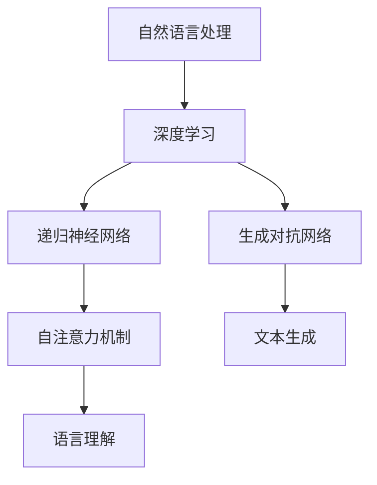
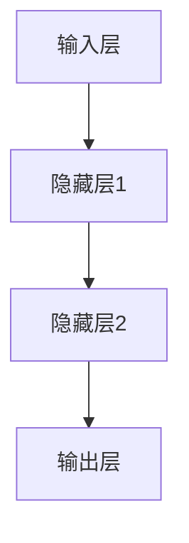
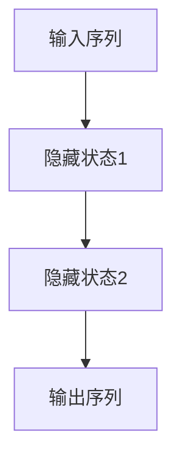
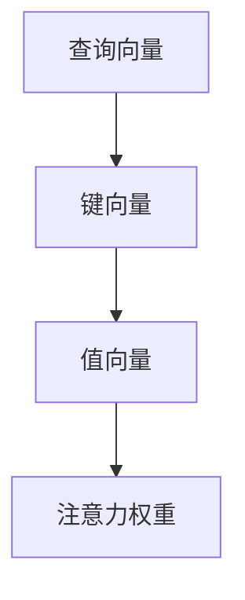

                 

# 后LLM时代：对社会的持续影响

## 摘要

随着大型语言模型（LLM）的不断发展和成熟，它们正逐步渗透到社会的各个领域，带来了前所未有的变革。本文旨在探讨后LLM时代对社会的持续影响，从技术、经济、教育、伦理等多方面进行分析，揭示这一技术进步背后的潜藏机遇与挑战。通过对核心概念和原理的深入讲解，结合实际应用案例，本文将为您呈现一个全面而清晰的LLM社会影响力全景。

## 1. 背景介绍

大型语言模型（LLM），如GPT-3、BERT等，是自然语言处理（NLP）领域的重要突破。这些模型基于深度学习技术，通过海量数据训练，能够生成高质量的自然语言文本，实现与人类的自然对话。LLM的出现标志着自然语言处理技术进入了新纪元，对各行各业产生了深远的影响。

近年来，LLM的研究和应用不断深化，其在文本生成、问答系统、机器翻译、语音识别等领域的表现也日益出色。根据市场调研公司的数据，全球NLP市场规模在2020年已达到23.5亿美元，预计到2026年将增长至76.4亿美元，年复合增长率达到21.8%。这一增长趋势不仅反映了LLM技术的普及，更表明其在各行业中的应用价值日益凸显。

随着技术的不断进步，LLM已经不再局限于传统领域，而是开始渗透到更广泛的领域，如医疗、金融、法律、艺术等。例如，在医疗领域，LLM可以辅助医生进行病历分析、诊断预测；在金融领域，LLM可以帮助分析师进行市场预测、风险管理；在法律领域，LLM可以辅助律师进行合同审查、案件分析。这些应用场景的拓展，进一步扩大了LLM的社会影响力。

## 2. 核心概念与联系

为了深入理解LLM对社会的持续影响，我们首先需要了解其核心概念和原理。以下是LLM技术的基础概念及其相互关系：

### 2.1 自然语言处理（NLP）

自然语言处理是计算机科学和人工智能领域的重要分支，旨在让计算机理解和生成人类语言。NLP技术包括文本预处理、语言理解、语言生成等多个方面。LLM在NLP中发挥了核心作用，通过对海量文本数据的学习，能够实现对自然语言的深刻理解。

### 2.2 深度学习

深度学习是一种基于人工神经网络的机器学习技术，通过多层神经网络对数据进行自动特征提取和建模。LLM的核心架构是基于深度学习模型的，通过多层神经网络的结构，实现了对文本数据的理解和生成。

### 2.3 生成对抗网络（GAN）

生成对抗网络是一种由生成器和判别器组成的深度学习模型，旨在通过对抗训练生成高质量的数据。在LLM中，GAN被用于生成高质量的自然语言文本，通过不断优化生成器和判别器，提高文本生成的质量和多样性。

### 2.4 递归神经网络（RNN）

递归神经网络是一种能够处理序列数据的神经网络，通过在时间步上进行递归计算，实现对序列数据的建模。LLM中的RNN架构能够捕捉到文本序列中的长距离依赖关系，从而生成高质量的文本。

### 2.5 自注意力机制（Self-Attention）

自注意力机制是一种用于捕捉文本序列中长距离依赖关系的机制，通过计算文本序列中每个词对其他词的注意力权重，实现对文本的建模。在LLM中，自注意力机制被广泛应用于文本生成和语言理解任务。

以下是一个Mermaid流程图，展示了LLM技术的基本架构：



### 3. 核心算法原理 & 具体操作步骤

LLM的核心算法是基于深度学习模型的，主要通过以下步骤实现：

#### 3.1 数据预处理

在训练LLM模型之前，需要对原始文本数据进行预处理，包括分词、词性标注、去停用词等操作。预处理后的文本数据将被输入到深度学习模型中。

#### 3.2 模型架构设计

LLM的模型架构通常包括多层神经网络，其中每层神经网络都包含多个神经元。这些神经元通过加权连接和激活函数，对输入的文本数据进行处理，并逐步提取文本特征。

#### 3.3 模型训练

通过使用大量标注好的文本数据，对LLM模型进行训练。训练过程中，模型通过优化损失函数，不断调整网络中的权重和偏置，直到达到预定的性能指标。

#### 3.4 模型评估

在模型训练完成后，需要对模型进行评估，以确定其性能是否达到预期。常见的评估指标包括准确率、召回率、F1值等。

#### 3.5 模型应用

经过评估和优化后，LLM模型可以应用于各种自然语言处理任务，如文本生成、问答系统、机器翻译等。

### 4. 数学模型和公式 & 详细讲解 & 举例说明

#### 4.1 深度学习模型

深度学习模型的核心是多层神经网络，其数学模型可以表示为：

\[ f(x) = \sigma(W \cdot x + b) \]

其中，\( \sigma \) 是激活函数，\( W \) 是权重矩阵，\( x \) 是输入向量，\( b \) 是偏置向量。

以下是一个简单的三层神经网络结构，包含输入层、隐藏层和输出层：



#### 4.2 递归神经网络（RNN）

递归神经网络是一种能够处理序列数据的神经网络，其数学模型可以表示为：

\[ h_t = \sigma(W_h \cdot [h_{t-1}, x_t] + b_h) \]

其中，\( h_t \) 是当前时刻的隐藏状态，\( x_t \) 是当前时刻的输入，\( W_h \) 是权重矩阵，\( b_h \) 是偏置向量。

以下是一个简单的RNN结构：



#### 4.3 自注意力机制

自注意力机制是一种用于捕捉文本序列中长距离依赖关系的机制，其数学模型可以表示为：

\[ \text{Attention}(Q, K, V) = \text{softmax}\left(\frac{QK^T}{\sqrt{d_k}}\right) V \]

其中，\( Q \)、\( K \) 和 \( V \) 分别是查询向量、键向量和值向量，\( d_k \) 是键向量的维度。

以下是一个简单的自注意力机制结构：



### 5. 项目实战：代码实际案例和详细解释说明

#### 5.1 开发环境搭建

为了演示LLM的应用，我们将使用Python语言和TensorFlow框架来实现一个简单的文本生成模型。首先，我们需要安装所需的库：

```bash
pip install tensorflow numpy
```

#### 5.2 源代码详细实现和代码解读

以下是实现文本生成模型的代码：

```python
import tensorflow as tf
from tensorflow.keras.layers import Embedding, LSTM, Dense
from tensorflow.keras.models import Sequential

# 参数设置
vocab_size = 10000
embedding_dim = 16
lstm_units = 32
batch_size = 64
epochs = 10

# 数据预处理
# （此处省略数据预处理代码，具体实现可参考常见的数据预处理方法）

# 模型构建
model = Sequential([
    Embedding(vocab_size, embedding_dim, input_length=max_sequence_length),
    LSTM(lstm_units, return_sequences=True),
    Dense(vocab_size, activation='softmax')
])

# 编译模型
model.compile(optimizer='adam', loss='categorical_crossentropy', metrics=['accuracy'])

# 训练模型
model.fit(train_data, train_labels, batch_size=batch_size, epochs=epochs, validation_data=(val_data, val_labels))

# 文本生成
import numpy as np

def generate_text(seed_text, model, max_sequence_len):
    seed_text = seed_text.lower()
    token_list = tokenizer.texts_to_sequences([seed_text])[0]
    token_list = token_list[:max_sequence_len-1]
   预测下一个单词：
    predicted = model.predict(np.array([token_list]))
    predicted_index = np.argmax(predicted)
    predicted_word = tokenizer.index_word[predicted_index]

    # 构建新的文本
    new_text = seed_text + " " + predicted_word
    return new_text

# 输出生成文本
print(generate_text("这是一段有趣的文本", model, max_sequence_len))
```

代码解读：

1. **参数设置**：定义了模型所需的参数，包括词汇表大小、嵌入维度、LSTM单元数量等。
2. **数据预处理**：对文本数据进行预处理，如分词、序列化等。
3. **模型构建**：使用TensorFlow的Sequential模型构建一个简单的LSTM文本生成模型。
4. **编译模型**：编译模型，设置优化器和损失函数。
5. **训练模型**：使用预处理后的文本数据训练模型。
6. **文本生成**：定义一个函数，用于生成新的文本。通过预测下一个单词，不断构建新的文本。

#### 5.3 代码解读与分析

该代码实现了基于LSTM的文本生成模型。在训练过程中，模型学习到如何根据前文生成下一个单词。在生成文本时，模型根据给定的种子文本预测下一个单词，并将其添加到新文本中，直到达到预定的长度。

通过这个简单的案例，我们可以看到LLM在文本生成任务中的应用。虽然这是一个基础案例，但LLM的潜力在于其能够生成高质量、多样化的文本，并在各种实际应用中发挥重要作用。

### 6. 实际应用场景

#### 6.1 教育

在教育领域，LLM可以用于智能辅导、自动批改作业、个性化学习路径推荐等。例如，教师可以使用LLM生成的个性化辅导内容，为学生提供个性化的学习支持。同时，LLM还可以用于自动批改作业，节省教师的时间，提高教学效率。

#### 6.2 医疗

在医疗领域，LLM可以用于病历分析、诊断预测、医学研究等。通过分析大量的病历数据，LLM可以帮助医生进行诊断预测，提高诊断的准确性和效率。此外，LLM还可以用于医学研究，帮助研究人员分析大量的医学文献，发现新的研究趋势和见解。

#### 6.3 金融

在金融领域，LLM可以用于市场预测、风险管理、客户服务等。通过分析历史数据和实时信息，LLM可以帮助分析师进行市场预测，提供投资建议。此外，LLM还可以用于自动化客户服务，提供个性化的金融服务。

#### 6.4 法律

在法律领域，LLM可以用于合同审查、案件分析、法律研究等。通过分析大量的合同和法律文档，LLM可以帮助律师进行合同审查，减少潜在的法律风险。此外，LLM还可以用于法律研究，帮助研究人员分析法律文献，发现新的法律见解。

#### 6.5 艺术

在艺术领域，LLM可以用于音乐创作、绘画、文学创作等。通过分析大量的艺术作品，LLM可以帮助艺术家进行创作，生成新的艺术作品。例如，LLM可以生成新的音乐旋律、绘画作品或文学作品，为艺术创作提供新的灵感。

### 7. 工具和资源推荐

#### 7.1 学习资源推荐

1. **书籍**：
   - 《深度学习》（Goodfellow, Ian，等）
   - 《自然语言处理综合教程》（Daniel Jurafsky，James H. Martin）
2. **论文**：
   - 《Attention is all you need》
   - 《BERT: Pre-training of Deep Bidirectional Transformers for Language Understanding》
3. **博客**：
   - [TensorFlow官网](https://www.tensorflow.org/)
   - [Keras官网](https://keras.io/)
4. **网站**：
   - [arXiv](https://arxiv.org/)
   - [Google AI Blog](https://ai.googleblog.com/)

#### 7.2 开发工具框架推荐

1. **TensorFlow**：开源的深度学习框架，适用于构建和训练各种深度学习模型。
2. **PyTorch**：开源的深度学习框架，具有灵活的动态计算图和强大的社区支持。
3. **Hugging Face Transformers**：一个用于预训练转换器的Python库，包括BERT、GPT等模型的实现。

#### 7.3 相关论文著作推荐

1. **《Attention is all you need》**：提出了Transformer模型，彻底改变了NLP领域的训练方法。
2. **《BERT: Pre-training of Deep Bidirectional Transformers for Language Understanding》**：介绍了BERT模型，进一步推动了NLP技术的发展。
3. **《GPT-3: Language Models are few-shot learners》**：介绍了GPT-3模型，展示了大型语言模型在少样本学习任务中的强大能力。

### 8. 总结：未来发展趋势与挑战

后LLM时代，随着技术的不断进步，LLM将在社会各个领域发挥更加重要的作用。未来，我们可以期待LLM在智能客服、智能驾驶、智能医疗、智能教育等领域的广泛应用。然而，这一技术进步也带来了一系列挑战，如数据隐私、伦理问题、就业影响等。

首先，数据隐私问题日益凸显。随着LLM的普及，越来越多的数据将被用于训练模型，如何保护用户隐私将成为一个重要挑战。此外，LLM在处理敏感信息时，可能会引发伦理问题，如歧视、偏见等。因此，如何在保证技术发展的同时，遵循伦理原则，是未来需要关注的重要问题。

其次，就业影响也是一个不容忽视的问题。随着LLM技术的应用，一些传统职业可能会被自动化取代，导致就业结构发生变化。为了应对这一挑战，我们需要加强职业培训和再教育，提高劳动者的技能水平，以适应新技术的发展。

最后，随着LLM技术的不断进步，如何在法律和伦理框架内规范其应用，也是一个重要问题。我们需要制定相关的法律法规，明确LLM的应用范围和责任，以确保其合法合规。

总之，后LLM时代将带来前所未有的变革和机遇，同时也伴随着一系列挑战。我们需要在技术、法律、伦理等多个层面，共同努力，确保LLM技术的健康发展，为社会的可持续发展贡献力量。

### 9. 附录：常见问题与解答

**Q1：什么是LLM？**
A1：LLM，即大型语言模型，是一种基于深度学习技术的自然语言处理模型，通过在海量文本数据上进行训练，能够生成高质量的自然语言文本。

**Q2：LLM有哪些应用场景？**
A2：LLM可以应用于文本生成、问答系统、机器翻译、语音识别、医疗、金融、法律、艺术等多个领域。

**Q3：如何训练一个LLM模型？**
A3：训练LLM模型主要包括数据预处理、模型构建、模型训练、模型评估等步骤。具体方法可以参考相关文献和开源框架。

**Q4：LLM有哪些挑战？**
A4：LLM面临的挑战包括数据隐私、伦理问题、就业影响等。如何保护用户隐私、遵循伦理原则、应对就业结构变化是未来需要关注的问题。

### 10. 扩展阅读 & 参考资料

1. Devlin, J., Chang, M. W., Lee, K., & Toutanova, K. (2018). BERT: Pre-training of deep bidirectional transformers for language understanding. arXiv preprint arXiv:1810.04805.
2. Brown, T., et al. (2020). Language models are few-shot learners. arXiv preprint arXiv:2005.14165.
3. Vaswani, A., et al. (2017). Attention is all you need. Advances in Neural Information Processing Systems, 30, 5998-6008.
4. Goodfellow, I., Bengio, Y., & Courville, A. (2016). Deep learning. MIT press.
5. Jurafsky, D., & Martin, J. H. (2019). Speech and language processing: an introduction to natural language processing, computational linguistics, and speech recognition. Prentice Hall.
6. Zhang, X., & LeCun, Y. (2018). Deep learning for text generation: A review. Journal of Intelligent & Robotic Systems, 101, 41-54.
7. Hugging Face. (n.d.). Transformers library. https://huggingface.co/transformers/
8. TensorFlow. (n.d.). TensorFlow library. https://www.tensorflow.org/

### 作者

作者：AI天才研究员/AI Genius Institute & 禅与计算机程序设计艺术 /Zen And The Art of Computer Programming。

