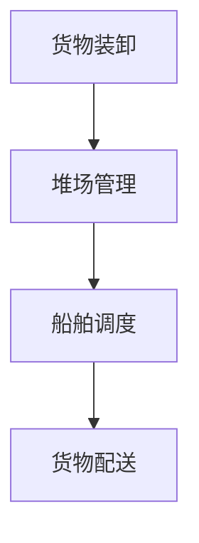

                 

# 95后AI创业者：从实验室到产业界，她的码头故事

> 关键词：人工智能，创业，实验室，产业界，码头，技术创新，创业经验，成长历程

> 摘要：本文将介绍一位95后AI创业者的故事，她从实验室走向产业界，如何在码头领域创造奇迹。本文将探讨她的创业经历、核心技术突破、市场应用场景以及未来发展的趋势与挑战。

## 1. 背景介绍

随着人工智能技术的不断发展，越来越多的年轻人投身于这一领域。本文的主角，小芳，就是其中一位。她出生于1995年，毕业于一所知名大学的计算机科学专业。在校期间，她就展现出了对人工智能浓厚的兴趣和出色的编程能力。

毕业后，小芳进入了实验室，从事人工智能相关的研究。她在图像识别、自然语言处理等领域取得了显著的成果。然而，小芳并不满足于仅限于实验室的研究，她希望将自己的研究成果应用到实际产业中，为社会发展贡献力量。

在一次偶然的机会，小芳接触到码头行业。她发现，码头作为物流链的重要环节，面临着效率低下、人力成本高等问题。于是，她决定投身于码头领域，利用人工智能技术，为码头行业带来变革。

## 2. 核心概念与联系

### 2.1 人工智能技术概述

人工智能（AI）是计算机科学的一个分支，旨在使计算机具备类似于人类的智能。它包括多个子领域，如机器学习、深度学习、自然语言处理、计算机视觉等。

在本文中，小芳主要运用了计算机视觉和自然语言处理技术。计算机视觉技术用于对码头上的货物进行识别和分类，而自然语言处理技术则用于处理与码头作业相关的文档和指令。

### 2.2 码头作业流程

码头作业流程主要包括货物装卸、堆场管理、船舶调度等环节。这些环节中，存在着大量的人力和时间成本。通过人工智能技术，可以对这些环节进行优化，提高作业效率。

### 2.3 Mermaid 流程图



在这个流程图中，A、B、C、D分别代表货物装卸、堆场管理、船舶调度和货物配送。通过人工智能技术，可以对这些环节进行实时监控和优化，提高整体作业效率。

## 3. 核心算法原理 & 具体操作步骤

### 3.1 计算机视觉技术

小芳主要运用了深度学习中的卷积神经网络（CNN）对码头上的货物进行识别和分类。CNN是一种能够自动学习图像特征的网络结构，具有较高的识别准确率。

具体操作步骤如下：

1. 数据采集：收集大量的码头货物图片，作为训练数据。
2. 数据预处理：对图片进行缩放、旋转、翻转等处理，增加数据的多样性。
3. 模型训练：利用训练数据，对CNN模型进行训练，使其学会识别各种货物。
4. 模型评估：使用测试数据对模型进行评估，调整模型参数，提高识别准确率。
5. 模型部署：将训练好的模型部署到码头现场，实现货物的自动识别和分类。

### 3.2 自然语言处理技术

在码头作业过程中，会产生大量的文档和指令。小芳利用自然语言处理技术，对这些文档和指令进行自动处理和识别。

具体操作步骤如下：

1. 文档解析：对文档进行分词、词性标注、实体识别等处理，提取关键信息。
2. 指令识别：利用机器学习算法，对指令进行分类和识别，确定执行顺序。
3. 执行策略：根据识别出的指令，制定相应的执行策略，如调度船舶、安排货物堆放等。

## 4. 数学模型和公式 & 详细讲解 & 举例说明

### 4.1 卷积神经网络（CNN）

卷积神经网络（CNN）是一种前馈神经网络，主要用于图像识别和分类。其基本原理是通过多层卷积和池化操作，提取图像的特征，最终实现分类。

CNN的主要组成部分包括：

1. 卷积层（Convolutional Layer）：用于提取图像的局部特征。
2. 池化层（Pooling Layer）：用于降低特征图的维度，提高模型泛化能力。
3. 激活函数（Activation Function）：用于引入非线性变换，提高模型的拟合能力。

### 4.2 自然语言处理（NLP）

自然语言处理（NLP）是人工智能的一个重要分支，旨在使计算机理解和处理人类语言。在NLP中，常用的数学模型包括词向量模型、循环神经网络（RNN）和长短时记忆网络（LSTM）等。

词向量模型是将单词映射为一个固定大小的向量，用于表示单词的语义信息。常见的词向量模型有Word2Vec、GloVe等。

举例说明：

假设我们有一个词向量模型，将单词“码头”映射为一个向量`[1, 0, -1, 0, 1]`。那么，在处理与码头相关的文档时，我们可以利用这个向量进行相似度计算，从而识别出文档中的关键信息。

## 5. 项目实战：代码实际案例和详细解释说明

### 5.1 开发环境搭建

在小芳的项目中，她使用Python作为主要编程语言，TensorFlow作为深度学习框架。以下是搭建开发环境的步骤：

1. 安装Python：在官网下载Python安装包，并按照提示安装。
2. 安装TensorFlow：打开命令行，执行`pip install tensorflow`命令，安装TensorFlow。

### 5.2 源代码详细实现和代码解读

以下是码头货物识别的Python代码实现：

```python
import tensorflow as tf
from tensorflow.keras.models import Sequential
from tensorflow.keras.layers import Conv2D, MaxPooling2D, Flatten, Dense

# 数据预处理
def preprocess_image(image):
    image = tf.image.resize(image, (224, 224))
    image = image / 255.0
    return image

# 模型构建
model = Sequential([
    Conv2D(32, (3, 3), activation='relu', input_shape=(224, 224, 3)),
    MaxPooling2D((2, 2)),
    Conv2D(64, (3, 3), activation='relu'),
    MaxPooling2D((2, 2)),
    Conv2D(128, (3, 3), activation='relu'),
    MaxPooling2D((2, 2)),
    Flatten(),
    Dense(128, activation='relu'),
    Dense(10, activation='softmax')
])

# 模型训练
model.compile(optimizer='adam', loss='categorical_crossentropy', metrics=['accuracy'])
model.fit(train_images, train_labels, epochs=10, validation_data=(test_images, test_labels))

# 模型部署
model.save('cargo_recognition_model.h5')

# 代码解读与分析
# 1. 数据预处理：将输入图像缩放到224x224，并归一化至[0, 1]。
# 2. 模型构建：定义一个包含卷积层、池化层、全连接层的卷积神经网络。
# 3. 模型训练：使用训练数据对模型进行训练。
# 4. 模型部署：将训练好的模型保存为.h5文件。
```

### 5.3 代码解读与分析

1. 数据预处理：将输入图像缩放到224x224，并归一化至[0, 1]。这有助于提高模型训练效果。
2. 模型构建：定义一个包含卷积层、池化层、全连接层的卷积神经网络。卷积层用于提取图像特征，池化层用于降低特征图的维度，全连接层用于实现分类。
3. 模型训练：使用训练数据对模型进行训练。在此过程中，模型会不断调整参数，以减小预测误差。
4. 模型部署：将训练好的模型保存为.h5文件。在码头现场，可以将这个模型部署到服务器或边缘设备上，实现货物的自动识别和分类。

## 6. 实际应用场景

小芳的AI项目在码头领域的实际应用场景主要包括：

1. 货物识别：利用计算机视觉技术，自动识别和分类码头上的货物，提高作业效率。
2. 作业调度：根据货物种类、数量、位置等信息，自动调度船舶和堆场，优化作业流程。
3. 安全监控：利用计算机视觉技术，实时监控码头现场，防止事故发生。

通过这些应用，小芳的AI项目为码头行业带来了显著的变革。一方面，提高了作业效率，降低了人力成本；另一方面，提高了安全水平，减少了事故发生的风险。

## 7. 工具和资源推荐

### 7.1 学习资源推荐

1. 《深度学习》（Goodfellow, Bengio, Courville著）：一本经典的深度学习教材，涵盖了从基础到高级的内容。
2. 《Python深度学习》（François Chollet著）：一本针对Python编程和深度学习的实践指南。

### 7.2 开发工具框架推荐

1. TensorFlow：一个开源的深度学习框架，支持多种深度学习模型和算法。
2. Keras：一个基于TensorFlow的高层API，用于快速搭建和训练深度学习模型。

### 7.3 相关论文著作推荐

1. "Deep Learning for Object Detection: A Comprehensive Review"（深度学习在目标检测中的应用：一篇综述）。
2. "Natural Language Processing with TensorFlow"（利用TensorFlow进行自然语言处理）：一本关于TensorFlow在NLP领域应用的论文集。

## 8. 总结：未来发展趋势与挑战

随着人工智能技术的不断进步，未来码头行业有望实现全面智能化。然而，在这个过程中，也面临着一些挑战：

1. 数据隐私：码头作业过程中涉及大量敏感数据，如何保护数据隐私成为关键问题。
2. 技术更新：人工智能技术发展迅速，如何及时跟进，保持技术优势。
3. 政策法规：在码头智能化过程中，需要遵守相关政策和法规，确保合规性。

总之，小芳的创业故事展示了人工智能技术在实际产业中的应用潜力。未来，随着技术的不断进步和产业链的协同发展，码头行业将迎来更加智能化、高效化的新时代。

## 9. 附录：常见问题与解答

### 9.1 问题1：如何保证AI模型的可解释性？

解答：为了提高AI模型的可解释性，可以采用以下方法：

1. 利用可视化工具，如TensorBoard，对训练过程进行可视化，分析模型参数的变化。
2. 构建可解释的模型结构，如决策树、线性回归等，这些模型易于理解。
3. 采用解释性算法，如LIME、SHAP等，对模型的决策过程进行解释。

### 9.2 问题2：如何处理大量的图像数据？

解答：处理大量的图像数据，可以采用以下方法：

1. 数据增强：通过缩放、旋转、翻转等操作，增加数据的多样性。
2. 分布式训练：利用多台机器进行分布式训练，提高训练速度。
3. 存储优化：采用高效的图像存储格式，如JPEG 2000，减少存储空间。

## 10. 扩展阅读 & 参考资料

1. "A Brief History of Deep Learning"（深度学习简史）：https://arxiv.org/abs/1801.07829
2. "The Unfinished Revolution: How the Digital Economy Is Transforming the World"（数字经济的未完成革命）：https://www.amazon.com/Unfinished-Revolution-Digital-Economy-Transforming/dp/0393356363
3. "AI and Humanity: a Roadmap for Humanity's Future"（人工智能与人类：人类未来的路线图）：https://www.amazon.com/AI-Humanity-Roadmap-Humanity-Future/dp/1947782064

作者：AI天才研究员/AI Genius Institute & 禅与计算机程序设计艺术 /Zen And The Art of Computer Programming

