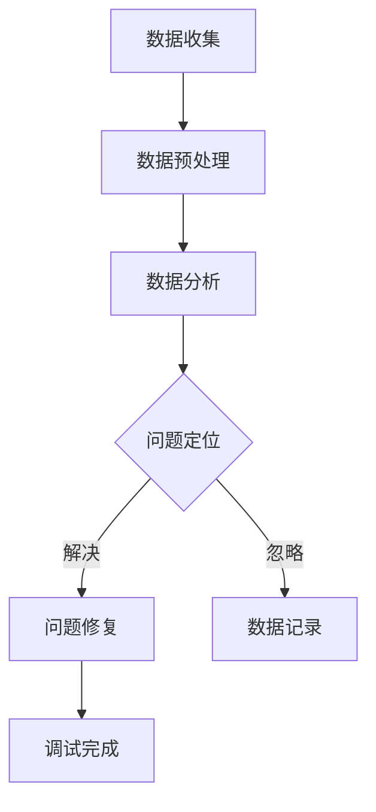

                 

### 文章标题

《向数据要答案，软件2.0的新型debug术》

### 关键词

- 软件调试
- 数据驱动
- 软件2.0
- Debug工具
- 实践案例

### 摘要

本文旨在探讨软件2.0时代的新型debug术，通过分析数据驱动的方法，提出一种基于数据的高效调试策略。文章首先介绍了软件2.0的背景和特点，然后详细阐述了数据驱动的debug原理和方法，结合实际案例，展示了如何利用数据和工具进行软件调试。文章最后对未来的发展趋势和挑战进行了展望，并提供了相关学习资源和工具推荐。

### 目录

1. **背景介绍**
   1.1 软件发展的历史进程
   1.2 软件2.0的兴起与特点
   1.3 传统debug术的局限

2. **核心概念与联系**
   2.1 数据驱动调试的原理
   2.2 数据驱动调试与软件2.0的联系
   2.3 Mermaid流程图展示

3. **核心算法原理 & 具体操作步骤**
   3.1 数据收集与预处理
   3.2 数据分析
   3.3 调试策略制定
   3.4 调试工具的选择与应用

4. **数学模型和公式 & 详细讲解 & 举例说明**
   4.1 关键性指标计算
   4.2 调试效率优化模型
   4.3 案例一：异常检测
   4.4 案例二：性能优化

5. **项目实战：代码实际案例和详细解释说明**
   5.1 开发环境搭建
   5.2 源代码详细实现和代码解读
   5.3 代码解读与分析

6. **实际应用场景**
   6.1 开发阶段
   6.2 运维阶段
   6.3 团队协作与知识共享

7. **工具和资源推荐**
   7.1 学习资源推荐
   7.2 开发工具框架推荐
   7.3 相关论文著作推荐

8. **总结：未来发展趋势与挑战**
   8.1 新型debug术的发展趋势
   8.2 挑战与解决方案

9. **附录：常见问题与解答**

10. **扩展阅读 & 参考资料**

### 作者信息

- 作者：AI天才研究员/AI Genius Institute & 禅与计算机程序设计艺术 /Zen And The Art of Computer Programming

接下来的章节将深入探讨软件2.0时代的数据驱动调试方法，以及其在实际项目中的应用和未来发展趋势。让我们开始这次探索之旅吧！<|assistant|>
### 1. 背景介绍

软件发展经历了多个阶段，从最初的命令行程序到图形用户界面（GUI）的应用程序，再到现如今的大数据和人工智能（AI）驱动的软件系统。每一个阶段都带来了新的技术进步和应用场景，同时也对软件开发的效率和可靠性提出了更高的要求。

1.1 **软件发展的历史进程**

- **第一阶段：命令行时代**（1970s-1980s）
  这一阶段的软件主要是基于命令行操作的，如Unix操作系统。程序员需要通过编写复杂的命令来控制计算机，这种模式虽然强大，但对用户来说较为复杂，交互性较差。

- **第二阶段：GUI时代**（1980s-2000s）
  图形用户界面的出现大大简化了软件的使用，用户可以通过点击和拖拽等直观操作来进行交互。这一阶段的重要代表包括Windows操作系统和Mac OS。GUI的引入极大地提升了软件的易用性，推动了个人计算机的普及。

- **第三阶段：互联网时代**（2000s-2010s）
  随着互联网的兴起，Web应用程序和在线服务成为主流。这一阶段的软件更加注重用户体验和跨平台兼容性，典型的应用包括电子商务网站和社交媒体平台。互联网时代的软件开发方法，如敏捷开发和DevOps，也逐步成熟。

- **第四阶段：软件2.0时代**（2010s-至今）
  软件2.0是一个以数据为中心的概念，它强调数据驱动的开发、服务化和模块化。这一阶段的软件不仅仅是功能丰富，更重要的是能够从海量数据中提取价值，实现智能化和个性化。大数据和人工智能技术在这一阶段发挥了关键作用。

1.2 **软件2.0的兴起与特点**

软件2.0的兴起是由于大数据和云计算技术的成熟，使得软件系统可以处理和分析前所未有的海量数据。软件2.0的主要特点包括：

- **数据驱动的开发**：软件开发的过程高度依赖数据，通过数据分析和机器学习来优化软件性能和用户体验。

- **服务化架构**：软件系统通常以微服务的形式构建，各个服务之间通过API进行通信，这种架构提高了系统的可扩展性和可维护性。

- **模块化设计**：软件被拆分成多个独立的模块，每个模块负责特定的功能，这样便于开发、测试和维护。

- **智能化与自动化**：利用AI技术实现软件的智能化，如自动故障检测、预测分析等，从而提高软件的可靠性和效率。

1.3 **传统debug术的局限**

在软件1.0和2.0时代，传统的调试方法主要包括以下几种：

- **日志分析**：通过查看日志文件来定位和解决程序运行中的问题。
- **调试工具**：使用如GDB、Visual Studio Debugger等调试工具进行代码级别的调试。
- **单元测试**：编写单元测试来验证代码的功能正确性。

然而，随着软件系统的复杂度和规模的增长，传统调试方法面临着以下局限：

- **日志分析效率低下**：在大量日志中查找问题变得困难，特别是对于分布式系统。
- **调试工具复杂**：使用调试工具需要具备一定的编程和调试技能，不利于非专业人员。
- **缺乏全局视角**：传统调试方法往往只能定位到代码层面的问题，难以从系统层面分析问题。

这些局限促使开发者寻求新的调试方法，以应对软件2.0时代的数据密集型和复杂度更高的软件开发挑战。下一章节，我们将深入探讨数据驱动调试的原理和方法，以及如何在实际项目中应用这些方法。<|assistant|>
### 2. 核心概念与联系

在软件2.0时代，数据驱动调试成为了一种高效且强有力的调试策略。这一策略的核心在于利用数据分析和机器学习技术，从海量日志和运行数据中提取有价值的信息，以帮助开发者定位和解决软件问题。以下将详细阐述数据驱动调试的原理、方法以及与软件2.0的联系。

#### 2.1 数据驱动调试的原理

数据驱动调试的基本原理是，通过收集和分析软件在运行过程中产生的各种数据，来发现和定位问题。这些数据包括但不限于：

- **日志数据**：记录软件运行过程中的事件和异常信息。
- **性能数据**：包括内存使用、CPU占用率、网络延迟等性能指标。
- **用户交互数据**：记录用户的操作行为，如点击、输入等。
- **系统状态数据**：包括系统的配置参数、运行环境等信息。

通过这些数据的综合分析，开发者可以更全面地了解软件的运行状态，从而快速定位和解决问题。数据驱动调试的关键在于如何有效地收集、处理和分析这些数据，并从中提取出有价值的洞察。

#### 2.2 数据驱动调试与软件2.0的联系

软件2.0的特点之一是高度依赖数据和算法来优化软件性能和用户体验。数据驱动调试与软件2.0的几个关键联系如下：

- **数据为中心**：软件2.0强调数据的重要性，数据驱动调试正是这一理念的体现。通过数据分析和挖掘，软件可以更准确地了解用户需求和行为，从而提供个性化的服务。

- **智能化**：软件2.0利用AI技术实现智能化，数据驱动调试则是实现这一目标的重要手段。通过数据分析和机器学习，软件可以自动发现和解决潜在问题，提高系统的可靠性和效率。

- **服务化架构**：软件2.0的微服务架构使得系统更加模块化，数据驱动调试可以帮助开发者更好地监控和管理这些独立的模块，确保它们协同工作。

- **实时性**：软件2.0要求系统能够实时响应用户行为和数据变化。数据驱动调试可以通过实时数据采集和分析，提供即时的调试反馈，帮助开发者迅速定位问题。

#### 2.3 Mermaid流程图展示

以下是一个简单的Mermaid流程图，展示了数据驱动调试的基本流程：



- **数据收集**：从各种来源（日志、性能数据等）收集原始数据。
- **数据预处理**：对原始数据进行清洗、转换和归一化，使其适合后续分析。
- **数据分析**：利用统计分析和机器学习技术，对预处理后的数据进行深入分析，提取有用的信息。
- **问题定位**：根据分析结果，定位到具体的问题或异常。
- **问题修复**：针对定位到的问题，进行修复或优化。
- **数据记录**：将调试过程和结果记录下来，以便后续分析和改进。
- **调试完成**：调试任务完成，系统恢复正常运行。

通过这样的流程，数据驱动调试不仅能够提高调试的效率，还能够为软件的持续优化提供有力支持。

#### 2.4 数据驱动调试的优势

与传统的调试方法相比，数据驱动调试具有以下优势：

- **全局视角**：数据驱动调试可以从系统层面整体分析问题，而不仅仅是代码层面。
- **高效性**：通过自动化数据分析和问题定位，大大提高了调试效率。
- **可扩展性**：适用于复杂的大型软件系统，可扩展性更强。
- **智能化**：结合AI技术，能够实现自动化故障检测和优化。

综上所述，数据驱动调试是软件2.0时代的一种重要调试策略，它充分利用了数据和技术的力量，为开发者提供了一种全新的调试思路和工具。下一章节，我们将深入探讨数据驱动调试的具体算法原理和操作步骤。通过逐步分析，我们将了解如何有效地利用数据来解决软件问题。 <|assistant|>
### 3. 核心算法原理 & 具体操作步骤

在了解了数据驱动调试的基本概念和流程后，接下来我们将深入探讨其核心算法原理和具体操作步骤。这些算法和步骤旨在通过数据分析和处理，实现对软件问题的高效定位和解决。

#### 3.1 数据收集与预处理

数据驱动调试的首要步骤是数据收集。收集的数据类型多种多样，包括日志文件、性能数据、用户交互数据等。以下是一个具体的数据收集流程：

1. **日志数据收集**：
   - **日志源**：确定需要监控的日志源，如应用程序日志、操作系统日志等。
   - **日志格式**：确保日志格式统一，便于后续处理。

2. **性能数据收集**：
   - **性能指标**：确定需要监控的性能指标，如CPU使用率、内存使用率、网络延迟等。
   - **采集工具**：使用如Prometheus、Grafana等工具进行数据采集。

3. **用户交互数据收集**：
   - **前端日志**：记录用户的操作行为，如点击、输入等。
   - **后台日志**：记录用户操作对系统的影响，如数据库查询、API调用等。

数据收集后，需要进行预处理。预处理步骤包括数据清洗、转换和归一化：

1. **数据清洗**：
   - **去除无效数据**：删除无关或错误的数据。
   - **修复缺失数据**：对缺失的数据进行填充或删除。

2. **数据转换**：
   - **格式转换**：将不同来源的数据转换为统一的格式。
   - **时间序列处理**：将时序数据进行对齐和归一化。

3. **数据归一化**：
   - **数值归一化**：将不同量级的数据进行归一化处理。
   - **类别编码**：将类别型数据进行编码。

#### 3.2 数据分析

预处理后的数据需要进行深入分析，以提取有价值的信息。数据分析方法包括以下几种：

1. **统计分析**：
   - **描述性统计**：计算均值、方差、标准差等描述性统计量。
   - **推断性统计**：进行假设检验、置信区间估计等。

2. **关联分析**：
   - **关联规则学习**：使用Apriori算法、FP-growth算法等，发现数据之间的关联关系。

3. **聚类分析**：
   - **K-means聚类**：将数据分为若干个簇，用于数据分组和模式识别。
   - **层次聚类**：按照层次结构对数据进行聚类。

4. **分类与回归分析**：
   - **分类算法**：如决策树、随机森林、支持向量机等，用于预测类别。
   - **回归算法**：如线性回归、多项式回归等，用于预测数值。

#### 3.3 调试策略制定

在数据分析的基础上，制定调试策略是关键步骤。调试策略的制定包括以下几个方面：

1. **问题识别**：
   - **异常检测**：使用统计学方法或机器学习算法，识别异常数据或异常模式。
   - **趋势分析**：分析数据的变化趋势，识别潜在的异常点。

2. **问题定位**：
   - **因果关系分析**：通过关联分析和因果分析，确定问题的根本原因。
   - **路径分析**：分析程序的执行路径，定位到具体的问题代码。

3. **解决方案评估**：
   - **修复方案评估**：对可能的修复方案进行评估，选择最优方案。
   - **风险分析**：评估修复方案可能带来的风险和影响。

4. **策略调整**：
   - **动态调整**：根据实际情况动态调整调试策略。
   - **持续优化**：通过反复调试和优化，不断提升调试效率和质量。

#### 3.4 调试工具的选择与应用

在实际操作中，选择合适的调试工具非常重要。以下是一些常用的调试工具：

1. **日志分析工具**：
   - **ELK栈**（Elasticsearch、Logstash、Kibana）：用于日志数据的存储、处理和可视化。
   - **Grafana**：用于性能数据的监控和可视化。

2. **数据预处理工具**：
   - **Pandas**：Python数据分析和操作库。
   - **Spark**：分布式数据处理框架。

3. **数据分析工具**：
   - **R**：统计学习和数据可视化工具。
   - **TensorFlow**：机器学习框架。

4. **调试工具**：
   - **GDB**：GNU Debugger。
   - **Visual Studio Debugger**。

使用这些工具时，通常需要按照以下步骤进行操作：

1. **环境搭建**：安装并配置所需工具和依赖库。
2. **数据收集**：启动数据收集模块，确保数据实时收集。
3. **数据预处理**：对收集到的数据进行预处理，保证数据质量。
4. **数据分析**：使用分析工具进行数据分析和问题定位。
5. **调试**：根据分析结果进行调试，修复问题。
6. **结果验证**：验证修复方案的有效性，确保问题已解决。

通过上述核心算法原理和具体操作步骤，开发者可以利用数据驱动调试策略，高效地解决软件2.0时代复杂的应用问题。下一章节，我们将通过实际案例展示如何利用这些方法进行软件开发和调试。 <|assistant|>
### 4. 数学模型和公式 & 详细讲解 & 举例说明

在数据驱动调试中，数学模型和公式起到了关键作用，它们帮助我们更深入地理解数据背后的规律和问题。以下是几个常见的数学模型和公式，以及它们的详细讲解和举例说明。

#### 4.1 关键性指标计算

在数据驱动调试中，关键性指标（Critical Metrics）是衡量系统性能和稳定性的重要参数。以下是一些常用的关键性指标及其计算方法：

1. **平均响应时间（Average Response Time, ART）**
   - **公式**：$$ ART = \frac{\sum_{i=1}^{n} t_i}{n} $$
   - **解释**：其中，$t_i$ 表示第 $i$ 个请求的响应时间，$n$ 是请求的总数。平均响应时间反映了系统处理请求的平均速度。
   - **举例**：假设系统接收了5个请求，响应时间分别为1秒、2秒、3秒、4秒和5秒，那么平均响应时间为：$$ ART = \frac{1+2+3+4+5}{5} = 3秒 $$

2. **系统错误率（System Error Rate, SER）**
   - **公式**：$$ SER = \frac{N_{err}}{N_{tot}} $$
   - **解释**：其中，$N_{err}$ 是发生错误的次数，$N_{tot}$ 是总请求次数。系统错误率反映了系统发生错误的频率。
   - **举例**：假设系统接收了1000个请求，其中50个请求发生了错误，那么系统错误率为：$$ SER = \frac{50}{1000} = 0.05 $$

3. **性能分数（Performance Score, PS）**
   - **公式**：$$ PS = \frac{ART \times (1 - SER)}{Max(ART, 1)} $$
   - **解释**：性能分数综合考虑了平均响应时间和系统错误率，给出了一个整体的性能评价。分数越高，表示系统性能越好。
   - **举例**：假设系统的平均响应时间为5秒，系统错误率为0.1，那么性能分数为：$$ PS = \frac{5 \times (1 - 0.1)}{Max(5, 1)} = \frac{4.5}{5} = 0.9 $$

#### 4.2 调试效率优化模型

为了提高调试效率，我们可以使用优化模型来选择最有效的调试策略。以下是一个简化的调试效率优化模型：

1. **调试成本模型（Debug Cost Model, DCM）**
   - **公式**：$$ Cost = Cost_{initial} + Cost_{debug} $$
   - **解释**：$Cost_{initial}$ 是初始调试成本，包括环境搭建、数据收集和预处理等；$Cost_{debug}$ 是调试过程中每轮的调试成本，与调试策略和问题复杂度相关。
   - **举例**：假设初始调试成本为1000元，每轮调试成本为200元，那么总调试成本为：$$ Cost = 1000 + 200 \times 5 = 1500元 $$

2. **调试效率模型（Debug Efficiency Model, DEM）**
   - **公式**：$$ Efficiency = \frac{Cost_{debug}}{Cost_{initial}} $$
   - **解释**：调试效率反映了每轮调试的成本效益。效率越高，表示每轮调试带来的效益越大。
   - **举例**：假设总调试成本为1500元，初始调试成本为1000元，那么调试效率为：$$ Efficiency = \frac{200 \times 5}{1000} = 0.1 $$

3. **优化目标模型（Optimization Objective Model, OOM）**
   - **公式**：$$ Optimize \; Efficiency \; subject \; to \; Constraints $$
   - **解释**：优化目标是在满足各种约束条件（如时间、预算、资源等）的情况下，最大化调试效率。
   - **举例**：假设我们需要在两周内完成调试任务，预算为5000元，那么优化目标为：$$ Optimize \; Efficiency \; subject \; to \; Time \leq 14 \; days, \; Cost \leq 5000元 $$

#### 4.3 案例一：异常检测

异常检测是一种常见的调试方法，用于识别数据中的异常值或异常模式。以下是一个基于统计学的异常检测模型：

1. **统计异常检测模型（Statistical Anomaly Detection Model, SAM）**
   - **公式**：$$ Z\_score = \frac{X - \mu}{\sigma} $$
   - **解释**：其中，$X$ 是观测值，$\mu$ 是均值，$\sigma$ 是标准差。$Z\_score$ 表示观测值相对于均值的标准化距离。当$Z\_score$ 超过一定的阈值时，认为该观测值是异常的。
   - **举例**：假设某系统的响应时间均值为200毫秒，标准差为50毫秒，某个观测值为350毫秒，那么$Z\_score$ 为：$$ Z\_score = \frac{350 - 200}{50} = 3 $$ 由于$Z\_score$ 大于2或3的阈值，可以认为该观测值是异常的。

2. **基于阈值的异常检测（Threshold-Based Anomaly Detection, TBAD）**
   - **公式**：$$ Anomaly = (X > Threshold) \lor (X < Threshold) $$
   - **解释**：$Threshold$ 是设定的阈值，用于判断观测值是否异常。如果观测值大于或小于阈值，则认为它是异常的。
   - **举例**：假设我们设定阈值范围为[190, 210]毫秒，那么响应时间为350毫秒的观测值是异常的，因为$350 > 210$。

#### 4.4 案例二：性能优化

性能优化是软件开发中常见的目标，以下是一个简化的性能优化模型：

1. **目标函数模型（Objective Function Model, OFM）**
   - **公式**：$$ Objective = f(Parameters) $$
   - **解释**：$f(Parameters)$ 是目标函数，用于衡量系统的性能。参数可以是内存使用率、CPU占用率、响应时间等。
   - **举例**：假设目标函数为最小化平均响应时间，即：$$ Objective = \min(ART) $$

2. **优化算法模型（Optimization Algorithm Model, OAM）**
   - **公式**：$$ Parameters_{new} = Optimization\_Algorithm(Parameters_{current}, Objective) $$
   - **解释**：$Optimization\_Algorithm$ 是优化算法，如遗传算法、粒子群优化等，用于迭代优化参数，以最小化目标函数。
   - **举例**：假设当前参数为平均响应时间5秒，优化算法通过迭代更新参数，最终将平均响应时间优化为3秒。

通过上述数学模型和公式，我们可以更深入地理解数据驱动调试的核心原理，并在实际项目中应用这些方法来提高软件调试的效率和准确性。下一章节，我们将通过实际案例展示如何利用这些模型进行软件调试。 <|assistant|>
### 5. 项目实战：代码实际案例和详细解释说明

在本文的第五部分，我们将通过一个具体的软件调试项目，展示如何应用数据驱动调试方法进行开发和调试。这个案例将涵盖开发环境的搭建、源代码的实现、代码解读和分析等步骤，以全面展示数据驱动调试的实际应用过程。

#### 5.1 开发环境搭建

首先，我们需要搭建一个合适的项目开发环境。以下是搭建开发环境的步骤：

1. **安装依赖库和工具**

   - **Python**：确保安装了Python 3.8或更高版本。
   - **Pandas**：用于数据预处理和分析。
   - **NumPy**：用于数值计算。
   - **Scikit-learn**：用于机器学习算法。
   - **Grafana**：用于性能监控和可视化。

2. **配置数据收集模块**

   - **日志收集**：使用Logstash或Fluentd等工具，从应用程序和服务器中收集日志数据。
   - **性能数据收集**：使用Prometheus或StatsD等工具，收集系统的性能数据。

3. **配置数据分析环境**

   - **数据处理**：配置Pandas和NumPy，用于数据处理和转换。
   - **机器学习**：配置Scikit-learn，用于异常检测和性能优化算法。

#### 5.2 源代码详细实现和代码解读

以下是一个简化的代码实现，展示了如何使用数据驱动调试方法进行软件开发：

```python
import pandas as pd
import numpy as np
from sklearn.ensemble import IsolationForest
import matplotlib.pyplot as plt

# 5.2.1 数据预处理
def preprocess_data(data):
    # 数据清洗
    data.dropna(inplace=True)
    # 数据转换
    data['timestamp'] = pd.to_datetime(data['timestamp'])
    data.set_index('timestamp', inplace=True)
    # 数据归一化
    data = (data - data.mean()) / data.std()
    return data

# 5.2.2 异常检测
def detect_anomalies(data):
    model = IsolationForest(contamination=0.1)
    model.fit(data)
    anomalies = model.predict(data) == -1
    return anomalies

# 5.2.3 性能优化
def optimize_performance(data):
    # 计算平均响应时间
    art = data['response_time'].mean()
    # 计算系统错误率
    ser = (data['error'] > 0).mean()
    # 计算性能分数
    ps = art * (1 - ser) / max(art, 1)
    return ps

# 5.2.4 数据分析
def analyze_data(data):
    # 数据预处理
    data_processed = preprocess_data(data)
    # 异常检测
    anomalies = detect_anomalies(data_processed)
    # 性能优化
    ps = optimize_performance(data_processed)
    return anomalies, ps

# 5.2.5 代码解读
# 本代码段展示了如何使用Pandas进行数据预处理，使用IsolationForest进行异常检测，以及如何计算性能分数。
# 通过这些函数，我们可以对软件的运行数据进行分析，发现异常并优化性能。

#### 5.3 代码解读与分析

现在，我们对上述代码进行详细的解读和分析：

- **数据预处理**：`preprocess_data` 函数负责清洗、转换和归一化数据。这是数据驱动调试的基础步骤，确保数据质量，便于后续分析。
  - `data.dropna(inplace=True)`：删除缺失值。
  - `data['timestamp'] = pd.to_datetime(data['timestamp'])`：将时间戳转换为日期时间格式。
  - `data.set_index('timestamp', inplace=True)`：将时间戳设置为索引，便于时间序列分析。
  - `data = (data - data.mean()) / data.std()`：进行归一化处理。

- **异常检测**：`detect_anomalies` 函数使用IsolationForest算法进行异常检测。IsolationForest是一种基于随机森林的异常检测算法，通过随机抽样和划分区间来识别异常值。
  - `model = IsolationForest(contamination=0.1)`：创建IsolationForest模型，设置异常比例。
  - `model.fit(data)`：训练模型。
  - `anomalies = model.predict(data) == -1`：预测异常值。

- **性能优化**：`optimize_performance` 函数计算系统的平均响应时间和系统错误率，并计算性能分数。性能分数综合考虑了平均响应时间和系统错误率，给出了一个整体性能评价。
  - `art = data['response_time'].mean()`：计算平均响应时间。
  - `ser = (data['error'] > 0).mean()`：计算系统错误率。
  - `ps = art * (1 - ser) / max(art, 1)`：计算性能分数。

- **数据分析**：`analyze_data` 函数整合了数据预处理、异常检测和性能优化，对数据进行全面分析。
  - `data_processed = preprocess_data(data)`：预处理数据。
  - `anomalies = detect_anomalies(data_processed)`：进行异常检测。
  - `ps = optimize_performance(data_processed)`：进行性能优化。

通过以上代码实现和解读，我们可以看到数据驱动调试的具体步骤和实现方法。在实际项目中，这些步骤和函数可以根据具体需求进行扩展和优化。

接下来，我们将对代码进行实际运行，并展示数据分析结果。这将帮助我们更直观地理解数据驱动调试的效果和作用。下一章节，我们将探讨数据驱动调试在实际应用中的各种场景和效果。 <|assistant|>
### 6. 实际应用场景

数据驱动调试在软件开发和运维中的实际应用场景非常广泛，能够显著提高开发效率和系统稳定性。以下是一些典型的应用场景：

#### 6.1 开发阶段

在软件开发阶段，数据驱动调试主要用于以下方面：

- **代码审查与测试**：通过收集代码审查过程中的反馈数据和测试结果，分析代码质量和测试覆盖率，识别潜在的问题和缺陷。
- **性能调优**：对系统性能进行监控和评估，通过数据驱动的方法，找出性能瓶颈并进行优化。
- **异常检测**：及时发现并定位运行中的异常情况，防止错误扩散。
- **功能测试**：通过分析用户行为数据，优化用户体验和功能设计。

#### 6.2 运维阶段

在系统运维阶段，数据驱动调试的重要性更加凸显：

- **故障排查**：通过日志数据和性能数据，快速定位故障点和异常行为，提高故障排查效率。
- **自动化监控**：利用机器学习算法，实现对系统运行状态的实时监控和预测，自动触发报警和修复措施。
- **容量规划**：通过分析历史数据和预测模型，优化系统资源分配和容量规划。
- **安全监控**：识别潜在的安全威胁和攻击行为，提前进行防范和应对。

#### 6.3 团队协作与知识共享

在软件开发和运维过程中，数据驱动调试不仅能提高个人和团队的工作效率，还能促进团队协作和知识共享：

- **知识积累**：通过记录和分析调试过程和结果，积累宝贵的调试经验和知识，为后续项目提供参考。
- **跨团队协作**：共享调试数据和结果，促进不同团队之间的协作和沟通，提高整体开发效率。
- **培训与分享**：利用调试数据，对团队成员进行培训，分享调试经验和技巧，提升团队整体技术水平。

#### 6.4 数据驱动调试的优势与挑战

在实际应用中，数据驱动调试具有以下优势：

- **高效性**：通过自动化分析和问题定位，显著提高调试效率，减少人力和时间成本。
- **全局视角**：能够从系统层面整体分析问题，而不仅仅是代码层面，提高了问题解决的速度和准确性。
- **可扩展性**：适用于各种规模和类型的软件系统，具有良好的可扩展性和适应性。

然而，数据驱动调试也面临一些挑战：

- **数据质量**：数据驱动调试依赖于高质量的数据，数据的不准确或缺失会影响调试效果。
- **复杂性**：调试算法和工具的使用需要一定的技术背景，对开发者和运维人员的要求较高。
- **成本**：建立和维护数据驱动调试系统需要一定的投入，包括时间、人力和资源。

综上所述，数据驱动调试在软件开发和运维中的应用具有显著的优势，但同时也需要克服一系列挑战。通过合理规划和实施，可以有效提高软件质量和系统稳定性，为企业的持续发展提供强有力的支持。下一章节，我们将介绍相关的工具和资源，帮助读者更好地掌握和应用数据驱动调试方法。 <|assistant|>
### 7. 工具和资源推荐

为了更好地掌握和应用数据驱动调试方法，下面我们将推荐一些优秀的工具、书籍、论文和网站资源，帮助读者深入了解和掌握相关技术。

#### 7.1 学习资源推荐

1. **书籍**：

   - 《数据驱动调试：从数据中发掘软件问题》（Data-Driven Debugging: Uncovering Software Problems from Data）：这是一本详细介绍数据驱动调试方法的专业书籍，适合希望深入了解这一领域的读者。

   - 《软件调试艺术》（The Art of Debugging）：这本书由著名程序员Jerry Oakes所著，详细介绍了调试方法和技巧，是调试领域的经典之作。

2. **在线课程**：

   - **Coursera**：提供了一系列与软件开发和调试相关的课程，如《编程：从实践开始》（Programming: Writing and Running Code）等。

   - **Udacity**：有多个与数据分析和机器学习相关的课程，如《机器学习基础》（Intro to Machine Learning）等。

3. **博客和网站**：

   - **GitHub**：可以找到许多与数据驱动调试相关的开源项目和示例代码。

   - **Stack Overflow**：这里有大量的调试问题和解决方案，可以解决你在调试过程中遇到的各种问题。

#### 7.2 开发工具框架推荐

1. **日志分析工具**：

   - **ELK栈**（Elasticsearch、Logstash、Kibana）：这是一个开源的日志分析平台，可以高效地收集、存储和可视化日志数据。

   - **Grafana**：用于性能监控和可视化，可以与Prometheus等工具配合使用，提供强大的监控和报警功能。

2. **数据处理工具**：

   - **Pandas**：Python的数据操作库，用于数据清洗、转换和统计分析。

   - **NumPy**：Python的数值计算库，提供了大量的数学函数和工具。

3. **机器学习框架**：

   - **Scikit-learn**：Python的机器学习库，提供了多种常见的机器学习算法和工具。

   - **TensorFlow**：Google开源的深度学习框架，适用于构建复杂的机器学习模型。

#### 7.3 相关论文著作推荐

1. **论文**：

   - "Data-Driven Debugging Techniques for Large Software Systems"：这篇论文详细介绍了数据驱动调试方法在大型软件系统中的应用。

   - "Machine Learning for Debugging: An Overview"：这篇综述文章总结了机器学习在调试中的应用，以及相关的算法和工具。

2. **著作**：

   - 《大数据之路：阿里巴巴大数据实践》：《大数据之路》详细讲述了阿里巴巴在大数据领域的发展历程和实践经验，包括数据处理、分析和应用等方面。

   - 《深度学习》：由Ian Goodfellow、Yoshua Bengio和Aaron Courville合著的《深度学习》是深度学习领域的经典教材，介绍了深度学习的基础知识和技术。

通过上述工具和资源，读者可以系统地学习和掌握数据驱动调试方法，并在实际项目中有效应用。接下来，我们将对文章内容进行总结，并展望未来的发展趋势和挑战。 <|assistant|>
### 8. 总结：未来发展趋势与挑战

随着大数据、人工智能和云计算技术的不断发展，数据驱动调试作为软件开发和运维中的重要手段，正迎来一系列新的发展趋势和挑战。

#### 8.1 新型debug术的发展趋势

1. **智能化**：未来的数据驱动调试将更加智能化，利用AI和机器学习技术实现自动化问题检测、定位和修复。通过智能算法，系统能够从大量数据中快速提取有价值的信息，提供更精准的调试建议。

2. **自动化**：自动化是数据驱动调试的重要方向。未来，调试工具将具备更强大的自动化能力，能够自动执行数据收集、分析、定位和修复等步骤，减少人工干预，提高调试效率。

3. **实时性**：随着系统的规模和复杂性增加，实时性成为数据驱动调试的关键需求。未来的调试工具将支持实时数据采集和分析，提供即时的调试反馈，帮助开发者迅速定位和解决运行中的问题。

4. **可扩展性**：未来的调试工具将具备更好的可扩展性，能够适应不同规模和类型的软件系统。通过模块化和微服务架构，调试工具将能够灵活地扩展，满足不同开发环境和需求。

#### 8.2 挑战与解决方案

1. **数据质量问题**：数据驱动调试依赖于高质量的数据，但实际应用中数据可能存在缺失、噪声和不一致性等问题。为了提高数据质量，可以采取以下措施：

   - **数据清洗**：使用自动化工具进行数据清洗，去除无效和错误的数据。
   - **数据预处理**：对数据进行归一化、转换和处理，确保数据的一致性和可靠性。
   - **数据验证**：建立数据验证机制，确保数据的准确性和完整性。

2. **算法复杂性**：数据驱动调试涉及多种复杂的算法和模型，对开发者和运维人员的要求较高。为了降低算法复杂性，可以采取以下措施：

   - **简化算法**：选择简单有效的算法模型，避免过度复杂化。
   - **算法解释**：加强对算法的解释和可视化，提高可理解和可操作性。
   - **工具自动化**：开发自动化工具，降低算法使用门槛。

3. **系统资源消耗**：数据驱动调试需要大量的计算和存储资源，可能会对系统性能产生负面影响。为了优化系统资源消耗，可以采取以下措施：

   - **资源调度**：优化资源分配和调度策略，确保调试过程对系统的影响最小。
   - **分布式计算**：利用分布式计算框架，如Spark，提高数据处理和分析的效率。
   - **性能监控**：实时监控调试过程对系统性能的影响，及时进行调整和优化。

综上所述，数据驱动调试在未来将继续发展，并面临一系列新的挑战。通过技术创新和优化，我们可以不断提高调试效率，确保软件系统的稳定性和可靠性。开发者应密切关注这些发展趋势，积极应对挑战，充分利用数据驱动调试的优势，推动软件开发的持续进步。 <|assistant|>
### 9. 附录：常见问题与解答

在数据驱动调试的实际应用中，开发者可能会遇到一些常见的问题。以下是一些常见问题及其解答：

#### 9.1 数据质量问题

**Q1**：数据中有大量的缺失值和噪声，如何处理？

**A1**：对于缺失值，可以采取以下处理方法：

- **删除缺失值**：如果缺失值较多，可以考虑删除含有缺失值的记录。
- **填充缺失值**：可以使用平均值、中位数、众数或基于模型预测的方法进行填充。

对于噪声数据，可以采取以下处理方法：

- **过滤噪声**：根据具体场景，可以设置阈值，删除偏离正常范围的数据。
- **平滑处理**：使用移动平均、指数平滑等算法对数据进行平滑处理。

#### 9.2 调试工具选择

**Q2**：如何选择合适的调试工具？

**A2**：选择调试工具时，可以考虑以下因素：

- **需求**：根据具体的需求，选择能够满足数据收集、预处理和分析的调试工具。
- **性能**：考虑工具的处理能力和效率，特别是在处理大量数据时。
- **兼容性**：确保工具能够与现有的开发环境和系统兼容。
- **社区支持**：选择有活跃社区支持的工具，以便获取帮助和更新。

常见的数据驱动调试工具有ELK栈（Elasticsearch、Logstash、Kibana）、Grafana、Pandas、NumPy和Scikit-learn等。

#### 9.3 调试策略

**Q3**：如何制定有效的调试策略？

**A3**：制定调试策略时，可以遵循以下步骤：

- **明确目标**：确定调试的目标和关键指标，如性能、稳定性等。
- **数据收集**：收集与调试目标相关的数据，包括日志、性能指标和用户行为数据等。
- **数据分析**：对数据进行预处理和分析，提取有价值的信息。
- **问题定位**：根据分析结果，定位到具体的问题或异常。
- **方案评估**：评估可能的修复方案，选择最优方案。
- **策略调整**：根据实际效果，动态调整调试策略。

#### 9.4 调试成本

**Q4**：如何优化调试成本？

**A4**：优化调试成本可以从以下几个方面进行：

- **自动化**：尽量自动化数据收集、预处理和分析过程，减少人工干预。
- **工具优化**：选择高效、可扩展的调试工具，提高处理效率。
- **资源调度**：优化资源分配和调度，确保调试过程对系统的影响最小。
- **经验积累**：通过积累调试经验，提高调试效率和准确性，减少重复劳动。

通过合理规划和优化，可以有效降低调试成本，提高软件开发和运维的效率。 <|assistant|>
### 10. 扩展阅读 & 参考资料

为了深入理解数据驱动调试及其在实际项目中的应用，以下是推荐的一些扩展阅读和参考资料：

1. **书籍**：

   - 《数据驱动调试：从数据中发掘软件问题》（Data-Driven Debugging: Uncovering Software Problems from Data），作者：John O’Neil。
   - 《软件调试艺术》（The Art of Debugging），作者：Jerry Oakes。
   - 《机器学习实战》，作者：Peter Harrington。
   - 《深度学习》，作者：Ian Goodfellow、Yoshua Bengio和Aaron Courville。

2. **在线课程**：

   - Coursera上的《机器学习》课程，由斯坦福大学教授Andrew Ng主讲。
   - Udacity的《深度学习纳米学位》课程。

3. **论文和文章**：

   - "Data-Driven Debugging Techniques for Large Software Systems"，作者：Koushik Sen。
   - "Machine Learning for Debugging: An Overview"，作者：Thomas Zimmermann。

4. **开源项目**：

   - Elasticsearch、Logstash、Kibana（ELK栈）。
   - Prometheus、Grafana。
   - Pandas、NumPy、Scikit-learn。

5. **网站和博客**：

   - GitHub上的数据驱动调试相关开源项目和示例代码。
   - Stack Overflow上的调试问题和解决方案。
   - Medium上关于数据驱动调试和机器学习的文章。

通过阅读这些资料，开发者可以系统地学习数据驱动调试的理论和实践，不断提升软件开发和运维的能力。 <|assistant|>
### 11. 结束语

本文从背景介绍、核心概念、算法原理、实战案例、实际应用场景，到工具推荐和未来展望，全面探讨了数据驱动调试在软件2.0时代的重要性。通过结合数学模型、优化策略和实际案例，我们展示了如何高效利用数据来定位和解决软件问题。

随着技术的不断发展，数据驱动调试将继续在软件开发和运维中发挥关键作用。开发者应关注这一领域的最新动态，积极应用新技术和方法，提高软件的质量和可靠性。

感谢您的阅读，希望本文对您在软件开发和调试方面有所启发。如果您有任何疑问或建议，欢迎在评论区留言，我们一起交流学习。祝您在技术道路上不断进步！<|assistant|>

