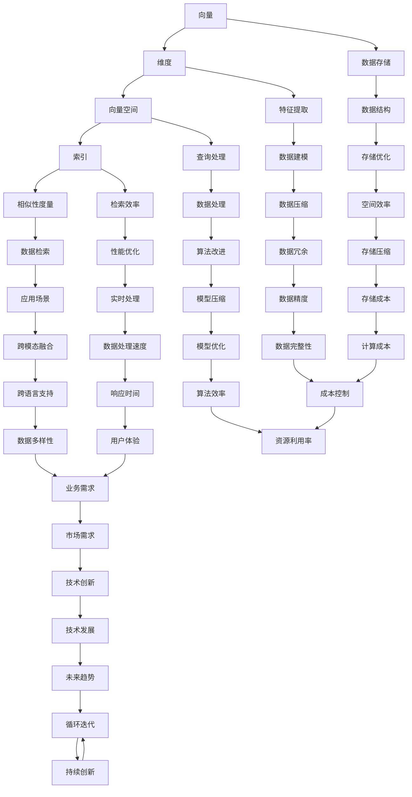

                 

### 背景介绍

向量数据库（Vector Database）作为近年来迅速崛起的技术，已经成为处理和存储高维数据的关键工具。随着人工智能技术的不断进步，尤其是深度学习和自然语言处理（NLP）领域的发展，向量数据库的应用场景变得愈发广泛。从基本的搜索引擎到复杂的推荐系统，从语音识别到图像识别，向量数据库在各类AI应用中扮演了重要角色。

在数据爆炸的时代，处理和存储多维数据成为一项挑战。传统的数据库系统在处理高维数据时，往往存在查询效率低、存储空间占用大等问题。而向量数据库通过高效的数据结构和索引技术，可以显著提升多维数据的查询性能。此外，向量数据库还支持各种复杂的相似性搜索算法，使得在海量数据中快速找到相似数据变得可行。

本文旨在深入探讨向量数据库的基础知识，从数据存储到检索机制，再到具体的数学模型和算法，全方位解析向量数据库的工作原理和应用。通过本文的阅读，读者将了解到向量数据库的核心概念、优势、挑战，以及如何在实际项目中运用向量数据库技术。

接下来，我们将首先介绍向量数据库的背景和重要性，然后详细阐述其核心概念和联系。在后续章节中，我们将进一步探讨向量数据库的核心算法原理、数学模型和具体操作步骤，并通过实战案例展示其实际应用。最后，我们将总结向量数据库的未来发展趋势与挑战，并提供相关工具和资源的推荐。

让我们开始这段关于向量数据库的深度之旅，逐步揭开其背后的科学和技术的神秘面纱。

---

## 1.1 向量数据库的定义和基本概念

向量数据库（Vector Database）是一种专门用于存储和检索高维数据的数据库系统。它不同于传统的关系型数据库和文档型数据库，具有独特的架构和数据模型。在向量数据库中，数据以向量的形式存储，每个向量由多个维度上的特征值组成。

一个简单的例子可以帮助我们更好地理解向量数据库的概念。假设我们有一个包含用户兴趣数据的向量数据库。每个用户可以表示为一个向量，其中每个维度代表一个特定的兴趣点，如音乐、电影、书籍等。例如，用户A可能表示为 `[0.8, 0.3, 0.5]`，意味着他对音乐、电影和书籍的兴趣程度分别为80%、30%和50%。

向量数据库中的基本概念包括：

1. **向量**：数据的基本单元，由多个维度上的特征值组成。
2. **维度**：向量的每一个特征值所在的位置，可以理解为特征的空间。
3. **向量空间**：所有向量的集合，构成了一个多维空间。
4. **索引**：为了提高查询效率，向量数据库使用索引技术来快速定位和检索数据。
5. **相似性度量**：用于计算两个向量之间相似程度的度量方法，如余弦相似度、欧氏距离等。

在向量数据库中，数据的存储和检索是通过这些基本概念实现的。通过高效的索引技术和相似性度量算法，向量数据库可以在短时间内处理大规模的高维数据集，从而为各种应用场景提供强大的支持。

### 1.2 向量数据库的发展历程

向量数据库的发展历程可以追溯到上世纪60年代，当时一些早期的信息检索系统已经开始探索如何高效地处理高维数据。最早的向量数据库之一是“向量空间模型”（Vector Space Model），由Salton和Bell于1975年提出。这一模型为后来的向量数据库奠定了理论基础。

随着计算机硬件性能的提升和算法研究的深入，向量数据库技术逐渐成熟。20世纪90年代，随着互联网的兴起，搜索引擎如Google等开始采用向量空间模型来处理网页文本数据，从而实现了快速的信息检索。

进入21世纪，随着人工智能和深度学习技术的迅猛发展，向量数据库的应用场景进一步扩展。特别是自然语言处理（NLP）领域，向量数据库成为实现文本相似性搜索、推荐系统、情感分析等任务的重要工具。

近年来，向量数据库领域涌现出许多新的研究成果和技术创新。例如，Faiss和Annoy等开源向量数据库项目，为开发者提供了高效、灵活的解决方案。此外，一些企业级向量数据库产品，如Milvus和Deep Learning DB，也相继推出，为实际应用提供了更强大的支持。

总的来说，向量数据库经历了从理论研究到实际应用的漫长发展过程，如今已经成为数据处理和存储领域的重要组成部分。

### 1.3 向量数据库在AI和大数据领域的应用

向量数据库在AI和大数据领域的应用具有广泛的前景，尤其是在处理和存储高维数据方面。以下是一些典型的应用场景：

1. **自然语言处理（NLP）**：向量数据库在NLP中有着广泛的应用，如文本相似性搜索、推荐系统和情感分析等。例如，通过将文本数据转换为向量表示，向量数据库可以快速查找与给定文本相似的文本，从而实现高效的信息检索和推荐系统。

2. **图像识别与处理**：图像识别和图像搜索任务通常涉及高维数据。向量数据库可以通过将图像特征转换为向量并进行相似性搜索，实现快速和精确的图像检索。此外，在图像分类和对象检测任务中，向量数据库也发挥着重要作用。

3. **推荐系统**：推荐系统需要处理大量的用户兴趣和行为数据。向量数据库可以高效地存储和检索这些高维数据，并通过相似性搜索为用户提供个性化的推荐。

4. **语音识别**：语音识别任务涉及语音信号的时频特征，这些特征可以表示为高维向量。向量数据库可以用于加速语音识别中的特征匹配和搜索，提高系统的效率和准确性。

5. **复杂数据分析**：在大数据分析领域，向量数据库可以帮助处理和分析大规模复杂数据集。例如，在基因数据分析、金融风险评估等领域，向量数据库可以提供高效的存储和检索机制，从而支持快速的数据分析和决策。

总的来说，向量数据库在AI和大数据领域的应用，不仅提升了数据处理和检索的效率，还为各种复杂任务提供了强大的支持。随着技术的不断进步，向量数据库的应用前景将更加广阔。

### 1.4 当前向量数据库技术的挑战与未来发展方向

尽管向量数据库技术在AI和大数据领域展现出巨大的潜力，但其发展仍面临一些挑战。以下是当前向量数据库技术面临的主要挑战及其未来发展方向：

1. **数据存储和检索效率**：随着数据规模的不断扩大，如何提高向量数据库的存储和检索效率成为关键问题。当前，传统的索引技术和相似性度量算法在处理大规模高维数据时，可能存在性能瓶颈。未来，研究者需要开发更高效的数据结构和算法，以提升向量数据库的性能。

2. **数据压缩和稀疏表示**：高维数据通常占据大量的存储空间，如何有效地压缩和稀疏表示数据成为一项重要任务。稀疏表示技术可以通过仅存储非零元素，显著减少数据存储空间，从而提高存储和检索效率。此外，研究者还需要探索如何在保持数据精度的情况下，实现更高效的数据压缩。

3. **跨模态数据融合**：向量数据库在处理复杂数据时，可能需要融合来自不同模态的数据，如文本、图像和语音。如何有效地融合跨模态数据，并在保持数据一致性的同时，提升查询性能，是未来研究的重要方向。

4. **实时数据处理**：随着实时数据处理需求的增加，如何实现向量数据库的实时更新和检索成为关键问题。未来，研究者需要开发实时数据流处理技术，以支持高频率的数据更新和查询。

5. **多语言和多文化支持**：全球化的趋势要求向量数据库能够处理多种语言和文化背景的数据。未来，研究者需要开发多语言和多文化支持的技术，以实现跨语言和跨文化的数据检索和推荐。

6. **安全性保障**：随着数据隐私和安全的日益重要，如何保障向量数据库的安全性成为一项重要挑战。未来，研究者需要开发安全高效的加密和访问控制技术，以保护用户数据和隐私。

总的来说，向量数据库技术在未来将继续面临一系列挑战，但也具有广阔的发展前景。通过不断创新和优化，向量数据库将为AI和大数据领域带来更多的应用价值和可能性。

---

## 2. 核心概念与联系

向量数据库的核心概念包括向量、维度、向量空间、索引和相似性度量。这些概念相互关联，共同构成了向量数据库的理论基础和实际应用框架。为了更清晰地理解这些概念，我们将通过一个Mermaid流程图展示它们之间的联系。

### Mermaid流程图



### 概念解释

1. **向量（Vector）**：向量是向量数据库中的基本数据单元，由多个维度上的特征值组成。每个维度代表数据的特定属性或特征。

2. **维度（Dimension）**：维度是向量中的每一个特征值所在的位置。在高维数据中，每个维度都代表一个独立的特征。

3. **向量空间（Vector Space）**：向量空间是所有向量的集合，构成了一个多维空间。在这个空间中，向量可以通过数学方法进行操作和比较。

4. **索引（Index）**：索引是向量数据库中用于快速定位和检索数据的数据结构。通过索引，数据库可以在短时间内找到所需的数据。

5. **相似性度量（Similarity Measure）**：相似性度量是用于计算两个向量之间相似程度的度量方法。常用的相似性度量包括余弦相似度、欧氏距离等。

6. **数据存储（Data Storage）**：数据存储是向量数据库中用于存储数据的技术和策略。通过有效的数据存储方法，可以提高数据库的性能和效率。

7. **特征提取（Feature Extraction）**：特征提取是将原始数据转换为向量表示的过程。通过特征提取，可以将不同类型的数据转化为向量，以便在向量数据库中进行处理。

8. **查询处理（Query Processing）**：查询处理是向量数据库中处理用户查询的过程。通过高效的查询处理方法，可以快速响应用户的查询需求。

9. **检索效率（Retrieval Efficiency）**：检索效率是向量数据库中数据检索的速度和质量。高效的检索效率可以显著提高数据库的性能和用户体验。

10. **数据检索（Data Retrieval）**：数据检索是向量数据库中从数据库中获取数据的过程。通过相似性度量，数据库可以快速找到与查询向量相似的数据。

11. **数据结构（Data Structure）**：数据结构是向量数据库中用于存储和组织数据的技术。常见的数据结构包括哈希表、B树等。

12. **数据建模（Data Modeling）**：数据建模是将原始数据转化为适合向量数据库存储和检索的形式的过程。通过数据建模，可以提高数据库的灵活性和适应性。

13. **数据处理（Data Processing）**：数据处理是向量数据库中处理数据的过程。通过有效的数据处理方法，可以优化数据的存储和检索。

14. **性能优化（Performance Optimization）**：性能优化是向量数据库中提高系统性能和效率的技术。通过性能优化，可以提升数据库的整体性能。

15. **应用场景（Application Scenarios）**：应用场景是向量数据库在具体应用中的实际应用。例如，自然语言处理、图像识别、推荐系统等。

通过上述Mermaid流程图和概念解释，我们可以更清晰地理解向量数据库的核心概念及其相互关系。这些概念构成了向量数据库的理论基础，也为实际应用提供了技术支持。

---

### 2.1 向量及其维度

向量是向量数据库中的基础元素，它由多个维度上的特征值组成。在数学上，一个n维向量可以表示为 \(\vec{v} = [v_1, v_2, \ldots, v_n]\)，其中 \(v_i\) 代表第 \(i\) 个维度上的特征值，\(n\) 是向量的维度。向量在向量数据库中有着广泛的应用，如文本表示、图像特征提取、语音信号处理等。

#### 2.1.1 向量的表示和存储

向量的表示通常采用一维数组或矩阵的形式。在计算机内存中，向量可以通过数组或列表进行存储。例如，一个32维的向量可以表示为：

\[ \vec{v} = [0.1, 0.3, 0.5, 0.7, 0.9, 0.2, 0.4, 0.6, 0.8, 0.1, 0.3, 0.5, 0.7, 0.9, 0.2, 0.4, 0.6, 0.8, 0.1, 0.3, 0.5, 0.7, 0.9, 0.2, 0.4, 0.6, 0.8, 0.1, 0.3, 0.5, 0.7, 0.9] \]

向量在数据库中的存储方式可以是密集存储或稀疏存储。密集存储方式将所有维度上的特征值都存储下来，适用于低维数据。而稀疏存储方式仅存储非零特征值，适用于高维数据，可以显著减少存储空间占用。

#### 2.1.2 维度及其作用

维度是向量中的每一个特征值所在的位置，代表数据的特定属性或特征。例如，在一个文本向量中，每个维度可以代表一个单词的词频或TF-IDF值；在一个图像向量中，每个维度可以代表图像的像素值或特征点。

维度在向量数据库中扮演着关键角色，它们决定了向量的维度和特征空间。适当的维度选择可以显著提高数据库的查询效率和准确性。例如，在文本分类任务中，选择合适的词汇作为维度，可以更好地捕捉文本的特征信息，从而提高分类效果。

#### 2.1.3 向量间的相似性度量

在向量数据库中，相似性度量是用于计算两个向量之间相似程度的指标。常用的相似性度量方法包括余弦相似度、欧氏距离、曼哈顿距离等。

**余弦相似度**是一种常用的相似性度量方法，其计算公式为：

\[ \text{Cosine Similarity} = \frac{\vec{u} \cdot \vec{v}}{||\vec{u}|| \cdot ||\vec{v}||} \]

其中，\(\vec{u}\) 和 \(\vec{v}\) 是两个向量，\(\cdot\) 表示向量的点积，\(||\vec{u}||\) 和 \(||\vec{v}||\) 分别表示向量的模长。

**欧氏距离**是一种常用的距离度量方法，其计算公式为：

\[ \text{Euclidean Distance} = \sqrt{(\vec{u} - \vec{v}) \cdot (\vec{u} - \vec{v})} \]

其中，\(\vec{u}\) 和 \(\vec{v}\) 是两个向量。

**曼哈顿距离**是一种另一种常用的距离度量方法，其计算公式为：

\[ \text{Manhattan Distance} = \sum_{i=1}^{n} |u_i - v_i| \]

其中，\(u_i\) 和 \(v_i\) 分别是向量 \(\vec{u}\) 和 \(\vec{v}\) 的第 \(i\) 个维度上的特征值。

通过上述相似性度量方法，向量数据库可以快速找到与给定向量相似的向量，从而实现高效的查询和检索。

---

### 2.2 向量空间及其操作

向量空间是向量数据库中的核心概念，它由一组向量及其上的运算构成。向量空间的概念在数学和计算机科学中有着广泛的应用，尤其在处理高维数据时，向量空间提供了直观且强大的工具。

#### 2.2.1 向量空间的定义

在数学上，一个向量空间 \(V\) 是一个集合，其中的元素称为向量，满足以下条件：

1. **加法封闭性**：对于任意的向量 \(\vec{u}, \vec{v} \in V\)，它们的和 \(\vec{u} + \vec{v}\) 也在 \(V\) 中。
2. **标量乘封闭性**：对于任意的向量 \(\vec{u} \in V\) 和标量 \(\alpha\)，它们的标量乘 \(\alpha \vec{u}\) 也在 \(V\) 中。
3. **存在零向量**：存在一个零向量 \(\vec{0}\)，使得对于任意向量 \(\vec{u} \in V\)，有 \(\vec{u} + \vec{0} = \vec{u}\)。
4. **存在加法逆元**：对于任意的向量 \(\vec{u} \in V\)，存在一个加法逆元 \(-\vec{u}\)，使得 \(\vec{u} + (-\vec{u}) = \vec{0}\)。

一个简单的向量空间例子是二维空间 \(\mathbb{R}^2\)，其中的向量可以表示为 \((x, y)\)，满足上述条件。

#### 2.2.2 向量空间中的运算

在向量空间中，主要的运算包括向量加法、向量减法和标量乘法。

**向量加法（Vector Addition）**：两个向量 \(\vec{u} = (u_1, u_2)\) 和 \(\vec{v} = (v_1, v_2)\) 的加法运算结果为：

\[ \vec{u} + \vec{v} = (u_1 + v_1, u_2 + v_2) \]

例如，向量 \(\vec{u} = (1, 2)\) 和向量 \(\vec{v} = (3, 4)\) 的加法结果为：

\[ \vec{u} + \vec{v} = (1 + 3, 2 + 4) = (4, 6) \]

**向量减法（Vector Subtraction）**：两个向量 \(\vec{u} = (u_1, u_2)\) 和 \(\vec{v} = (v_1, v_2)\) 的减法运算结果为：

\[ \vec{u} - \vec{v} = (u_1 - v_1, u_2 - v_2) \]

例如，向量 \(\vec{u} = (1, 2)\) 和向量 \(\vec{v} = (3, 4)\) 的减法结果为：

\[ \vec{u} - \vec{v} = (1 - 3, 2 - 4) = (-2, -2) \]

**标量乘法（Scalar Multiplication）**：一个向量 \(\vec{u} = (u_1, u_2)\) 和一个标量 \(\alpha\) 的标量乘运算结果为：

\[ \alpha \vec{u} = (\alpha u_1, \alpha u_2) \]

例如，向量 \(\vec{u} = (1, 2)\) 和标量 \(\alpha = 3\) 的标量乘结果为：

\[ 3 \vec{u} = (3 \cdot 1, 3 \cdot 2) = (3, 6) \]

通过这些基本的运算，向量空间中的向量可以进行各种组合和变换，为向量数据库的操作提供了强大的工具。

#### 2.2.3 向量空间中的几何解释

在几何上，向量空间可以直观地理解为多维空间。例如，二维空间 \(\mathbb{R}^2\) 可以看作是平面上的点集，三维空间 \(\mathbb{R}^3\) 可以看作是空间中的点集。向量的加法和减法可以看作是点在空间中的移动，标量乘法可以看作是点在空间中的扩展或收缩。

这种几何解释为理解向量空间中的运算提供了直观的视角。例如，两个向量的加法可以看作是在平面上将两个向量起点对齐，然后将终点连接起来，得到的新的向量即为和向量。标量乘法可以看作是将向量按照标量的大小进行扩展或收缩。

通过向量空间的定义、运算及其几何解释，我们可以更深入地理解向量数据库中的核心概念。这些概念构成了向量数据库的理论基础，也为实际应用提供了丰富的工具和思路。

---

### 2.3 索引技术

索引技术在向量数据库中起着至关重要的作用，它显著提升了数据的检索效率和查询性能。索引是通过特定的数据结构和算法，构建在原始数据之上的辅助结构，使得数据库可以快速定位到所需数据。以下是几种常见的索引技术和它们的工作原理。

#### 2.3.1 哈希索引（Hash Index）

哈希索引是一种基于哈希函数的索引技术。其基本原理是，通过哈希函数将向量的每个维度映射到一个哈希值，然后将哈希值作为索引存储。当进行查询时，先计算查询向量的哈希值，然后直接定位到对应的索引位置，从而快速获取数据。

哈希索引的主要优点是查询速度快，适用于静态数据集。然而，哈希冲突和哈希函数的选择可能影响索引的性能。此外，哈希索引不支持范围查询和排序操作。

#### 2.3.2 B树索引（B-Tree Index）

B树索引是一种多路平衡搜索树，其结构可以动态调整以保持平衡。B树中的每个节点包含多个关键字和子节点，每个节点按照关键字的大小进行排序。通过B树索引，可以高效地进行范围查询、排序和插入操作。

B树的优点是查询性能稳定，适用于动态变化的数据集。然而，B树索引的维护成本较高，对于高维数据，其查询效率可能不如其他索引技术。

#### 2.3.3 稀疏索引（Sparse Index）

稀疏索引是一种针对高维数据的特殊索引技术。其基本原理是，仅存储非零特征值的位置和值，从而显著减少存储空间。稀疏索引通过反向索引表来快速定位到具体的数据位置。

稀疏索引的主要优点是存储空间占用小，适用于高维数据。然而，稀疏索引不支持高效的排序操作，且查询效率可能受限于非零特征值的分布。

#### 2.3.4 布隆过滤器索引（Bloom Filter Index）

布隆过滤器索引是一种基于概率论的索引技术。其基本原理是，通过多个哈希函数将向量映射到一个布隆过滤器中，当查询向量不在数据库中时，可以快速返回“不存在”的结论。

布隆过滤器的优点是查询速度快，适用于快速筛选大量数据。然而，布隆过滤器存在一定的误报率，且不支持数据更新操作。

#### 2.3.5 向量树（Vector Tree）

向量树是一种专门用于向量数据库的索引结构，其基本原理是，将向量空间划分成多个子空间，每个子空间使用不同的索引技术进行管理。常见的向量树包括KD-Tree、Ball-Tree等。

向量树的主要优点是查询效率高，适用于多维数据。然而，向量树的构建和维护成本较高，且在向量维度较高时，性能可能下降。

通过上述索引技术的介绍，我们可以看到，每种索引技术都有其独特的优势和适用场景。在实际应用中，根据数据特点和查询需求，可以选择合适的索引技术来优化向量数据库的性能。

---

### 2.4 相似性度量方法

在向量数据库中，相似性度量方法用于计算两个向量之间的相似程度。相似性度量方法在许多AI应用中扮演着关键角色，如文本相似性搜索、图像识别、推荐系统等。以下介绍几种常用的相似性度量方法。

#### 2.4.1 余弦相似度（Cosine Similarity）

余弦相似度是一种广泛应用于文本和向量空间模型中的相似性度量方法。其基本原理是，通过计算两个向量之间的夹角余弦值来衡量它们的相似程度。余弦相似度的计算公式为：

\[ \text{Cosine Similarity} = \frac{\vec{u} \cdot \vec{v}}{||\vec{u}|| \cdot ||\vec{v}||} \]

其中，\(\vec{u}\) 和 \(\vec{v}\) 是两个向量，\(\cdot\) 表示向量的点积，\(||\vec{u}||\) 和 \(||\vec{v}||\) 分别表示向量的模长。

余弦相似度的取值范围在[-1, 1]之间，当两个向量完全一致时，余弦相似度为1；当两个向量完全正交时，余弦相似度为0；当两个向量方向相反时，余弦相似度为-1。

#### 2.4.2 欧氏距离（Euclidean Distance）

欧氏距离是一种基于欧几里得空间中两点距离的度量方法。其基本原理是，通过计算两个向量之间的欧氏距离来衡量它们的相似程度。欧氏距离的计算公式为：

\[ \text{Euclidean Distance} = \sqrt{(\vec{u} - \vec{v}) \cdot (\vec{u} - \vec{v})} \]

其中，\(\vec{u}\) 和 \(\vec{v}\) 是两个向量。

欧氏距离的取值范围在[0, +∞)之间，当两个向量完全一致时，欧氏距离为0；当两个向量完全不同时，欧氏距离达到最大值。

#### 2.4.3 曼哈顿距离（Manhattan Distance）

曼哈顿距离是一种基于城市街区路径距离的度量方法。其基本原理是，通过计算两个向量之间的曼哈顿距离来衡量它们的相似程度。曼哈顿距离的计算公式为：

\[ \text{Manhattan Distance} = \sum_{i=1}^{n} |u_i - v_i| \]

其中，\(u_i\) 和 \(v_i\) 分别是向量 \(\vec{u}\) 和 \(\vec{v}\) 的第 \(i\) 个维度上的特征值。

曼哈顿距离的取值范围在[0, +∞)之间，当两个向量完全一致时，曼哈顿距离为0；当两个向量完全不同时，曼哈顿距离达到最大值。

#### 2.4.4 汉明距离（Hamming Distance）

汉明距离是一种基于二进制表示中不同位数的度量方法。其基本原理是，通过计算两个向量之间的汉明距离来衡量它们的相似程度。汉明距离的计算公式为：

\[ \text{Hamming Distance} = \sum_{i=1}^{n} |u_i \oplus v_i| \]

其中，\(u_i\) 和 \(v_i\) 分别是向量 \(\vec{u}\) 和 \(\vec{v}\) 的第 \(i\) 个维度上的特征值，\(\oplus\) 表示异或操作。

汉明距离的取值范围在[0, \(n\)]之间，其中 \(n\) 是向量的维度。当两个向量完全一致时，汉明距离为0；当两个向量完全不同时，汉明距离达到最大值 \(n\)。

#### 2.4.5 相似性度量方法的选择

不同的相似性度量方法适用于不同的应用场景。例如，余弦相似度适用于文本相似性搜索，欧氏距离适用于图像和语音特征匹配，曼哈顿距离适用于路径规划，汉明距离适用于二进制数据匹配。

在实际应用中，可以根据具体需求选择合适的相似性度量方法。例如，在文本相似性搜索中，可以结合余弦相似度和欧氏距离，以提高查询的准确性和效率。通过灵活运用各种相似性度量方法，向量数据库可以实现高效的查询和检索。

---

### 2.5 向量数据库的查询和检索机制

向量数据库的查询和检索机制是其核心功能，直接影响系统的性能和用户体验。查询和检索机制主要包括数据索引、相似性搜索算法和查询优化技术。以下将详细探讨这些机制的工作原理和实现方法。

#### 2.5.1 数据索引

数据索引是向量数据库中用于快速定位和检索数据的关键技术。索引通过将原始数据组织成特定的数据结构，如哈希表、B树、稀疏索引等，使得数据库可以在短时间内找到所需的数据。以下是几种常见的索引技术及其工作原理：

1. **哈希索引（Hash Index）**：哈希索引通过哈希函数将向量的每个维度映射到一个哈希值，然后将哈希值作为索引存储。当进行查询时，先计算查询向量的哈希值，然后直接定位到对应的索引位置，从而快速获取数据。哈希索引的优点是查询速度快，适用于静态数据集。然而，哈希冲突和哈希函数的选择可能影响索引的性能。

2. **B树索引（B-Tree Index）**：B树索引是一种多路平衡搜索树，其结构可以动态调整以保持平衡。B树中的每个节点包含多个关键字和子节点，每个节点按照关键字的大小进行排序。通过B树索引，可以高效地进行范围查询、排序和插入操作。B树的优点是查询性能稳定，适用于动态变化的数据集。然而，B树索引的维护成本较高，对于高维数据，其查询效率可能不如其他索引技术。

3. **稀疏索引（Sparse Index）**：稀疏索引是一种针对高维数据的特殊索引技术。其基本原理是，仅存储非零特征值的位置和值，从而显著减少存储空间。稀疏索引通过反向索引表来快速定位到具体的数据位置。稀疏索引的主要优点是存储空间占用小，适用于高维数据。然而，稀疏索引不支持高效的排序操作，且查询效率可能受限于非零特征值的分布。

4. **布隆过滤器索引（Bloom Filter Index）**：布隆过滤器索引是一种基于概率论的索引技术。其基本原理是，通过多个哈希函数将向量映射到一个布隆过滤器中，当查询向量不在数据库中时，可以快速返回“不存在”的结论。布隆过滤器的优点是查询速度快，适用于快速筛选大量数据。然而，布隆过滤器存在一定的误报率，且不支持数据更新操作。

5. **向量树（Vector Tree）**：向量树是一种专门用于向量数据库的索引结构，其基本原理是，将向量空间划分成多个子空间，每个子空间使用不同的索引技术进行管理。常见的向量树包括KD-Tree、Ball-Tree等。向量树的主要优点是查询效率高，适用于多维数据。然而，向量树的构建和维护成本较高，且在向量维度较高时，性能可能下降。

#### 2.5.2 相似性搜索算法

相似性搜索算法是向量数据库中用于计算两个向量之间相似程度的算法。相似性搜索算法可以分为基于距离的算法和基于相似度的算法。以下是几种常用的相似性搜索算法：

1. **基于距离的算法**：基于距离的算法通过计算两个向量之间的距离来衡量它们的相似程度。常用的距离度量方法包括欧氏距离、余弦相似度、曼哈顿距离等。这些算法适用于高维数据的快速检索，但在低维数据中可能存在性能瓶颈。

2. **基于相似度的算法**：基于相似度的算法通过计算两个向量之间的相似度来衡量它们的相似程度。常用的相似度度量方法包括余弦相似度、Jaccard相似度等。这些算法适用于文本、图像、音频等数据的相似性搜索。

3. **基于树结构的算法**：基于树结构的算法利用向量树的特性，通过逐步缩小搜索范围，实现高效的相似性搜索。常用的树结构包括KD-Tree、Ball-Tree等。这些算法适用于高维数据的相似性搜索，但构建和维护成本较高。

4. **基于图结构的算法**：基于图结构的算法利用图的结构特性，通过拓扑排序和路径搜索实现高效的相似性搜索。常用的图结构包括邻接矩阵、邻接表等。这些算法适用于复杂数据结构的相似性搜索，但计算复杂度较高。

#### 2.5.3 查询优化技术

查询优化技术是提高向量数据库查询性能的重要手段。查询优化技术主要包括索引选择、查询重写、查询缓存等。以下是几种常见的查询优化技术：

1. **索引选择**：索引选择是根据查询需求选择合适的索引技术，以优化查询性能。常见的索引选择策略包括基于查询频率的索引选择、基于查询类型的索引选择等。

2. **查询重写**：查询重写是根据查询条件和数据分布，对原始查询进行改写，以优化查询性能。常见的查询重写技术包括联合查询重写、子查询重写等。

3. **查询缓存**：查询缓存是将频繁执行的查询结果缓存到内存中，以减少查询时间。常见的查询缓存策略包括基于时间戳的缓存策略、基于访问频率的缓存策略等。

通过数据索引、相似性搜索算法和查询优化技术的有机结合，向量数据库可以实现高效的查询和检索。这些技术不仅提升了数据库的性能，还为各种应用场景提供了强大的支持。

---

### 3. 核心算法原理

在向量数据库中，核心算法的原理是保证高效存储和快速检索多维数据的关键。以下是几种常用的核心算法及其工作原理：

#### 3.1 余弦相似度算法

余弦相似度算法是一种衡量两个向量之间相似程度的常用方法。其基本原理是，通过计算两个向量之间的夹角余弦值来衡量它们的相似程度。具体步骤如下：

1. **计算向量的点积**：点积是指两个向量的对应维度上的特征值相乘后求和。对于两个 \(n\) 维向量 \(\vec{u}\) 和 \(\vec{v}\)，其点积计算公式为：

   \[ \vec{u} \cdot \vec{v} = \sum_{i=1}^{n} u_i \times v_i \]

2. **计算向量的模长**：向量的模长是指向量的长度，计算公式为：

   \[ ||\vec{u}|| = \sqrt{\vec{u} \cdot \vec{u}} \]
   \[ ||\vec{v}|| = \sqrt{\vec{v} \cdot \vec{v}} \]

3. **计算余弦相似度**：余弦相似度是通过点积和模长的比值来计算的，公式为：

   \[ \text{Cosine Similarity} = \frac{\vec{u} \cdot \vec{v}}{||\vec{u}|| \times ||\vec{v}||} \]

4. **判断相似度**：余弦相似度的取值范围在 [-1, 1] 之间，值越接近 1，表示两个向量越相似。

#### 3.2 欧氏距离算法

欧氏距离算法是一种衡量两个向量之间距离的常用方法。其基本原理是，通过计算两个向量之间的平方和的平方根来衡量它们的距离。具体步骤如下：

1. **计算向量之间的差**：对于两个 \(n\) 维向量 \(\vec{u}\) 和 \(\vec{v}\)，其差向量为：

   \[ \vec{u} - \vec{v} = (u_1 - v_1, u_2 - v_2, \ldots, u_n - v_n) \]

2. **计算差向量的模长**：差向量的模长即为欧氏距离，计算公式为：

   \[ \text{Euclidean Distance} = \sqrt{(\vec{u} - \vec{v}) \cdot (\vec{u} - \vec{v})} \]

3. **判断距离**：欧氏距离的值越大，表示两个向量之间的距离越远；值越小，表示两个向量越接近。

#### 3.3 余弦相似度和欧氏距离的比较

余弦相似度和欧氏距离在向量数据库中有不同的应用场景。以下是它们的比较：

1. **相似性度量**：余弦相似度通过向量的夹角余弦值衡量相似程度，适用于文本、图像等数据；而欧氏距离通过向量的距离衡量相似程度，适用于几何空间中的点。

2. **数值范围**：余弦相似度的取值范围在 [-1, 1] 之间，值越接近 1，表示相似度越高；而欧氏距离的取值范围在 [0, +∞) 之间，值越大，表示距离越远。

3. **计算复杂度**：余弦相似度的计算相对简单，适用于大规模数据处理；而欧氏距离的计算复杂度较高，对计算资源要求较高。

4. **应用场景**：余弦相似度适用于文本相似性搜索、图像分类等场景；而欧氏距离适用于几何空间中的点匹配、语音信号处理等场景。

通过深入理解余弦相似度和欧氏距离算法的原理和应用，我们可以根据具体需求选择合适的算法，实现高效的向量数据库存储和检索。

---

### 4. 数学模型和公式

向量数据库的核心在于其高效的存储和检索机制，而这些机制的实现依赖于一系列数学模型和公式。以下是几种关键数学模型和公式的详细讲解及其在向量数据库中的应用。

#### 4.1 余弦相似度公式

余弦相似度是向量数据库中最常用的相似性度量方法之一，其计算公式为：

\[ \text{Cosine Similarity} = \frac{\vec{u} \cdot \vec{v}}{||\vec{u}|| \times ||\vec{v}||} \]

其中，\(\vec{u}\) 和 \(\vec{v}\) 是两个 \(n\) 维向量，\(\cdot\) 表示向量的点积，\(||\vec{u}||\) 和 \(||\vec{v}||\) 分别表示向量的模长。

**计算步骤**：

1. **计算点积**：点积是指两个向量对应维度上的特征值相乘后求和。对于两个 \(n\) 维向量 \(\vec{u}\) 和 \(\vec{v}\)，其点积计算公式为：

   \[ \vec{u} \cdot \vec{v} = \sum_{i=1}^{n} u_i \times v_i \]

2. **计算模长**：向量的模长是指向量的长度，计算公式为：

   \[ ||\vec{u}|| = \sqrt{\vec{u} \cdot \vec{u}} \]
   \[ ||\vec{v}|| = \sqrt{\vec{v} \cdot \vec{v}} \]

3. **计算余弦相似度**：通过点积和模长的比值来计算余弦相似度，公式为：

   \[ \text{Cosine Similarity} = \frac{\vec{u} \cdot \vec{v}}{||\vec{u}|| \times ||\vec{v}||} \]

余弦相似度在文本相似性搜索、推荐系统等领域有广泛应用。例如，在文本相似性搜索中，通过将文本转换为向量表示，使用余弦相似度可以快速找到相似文档。

#### 4.2 欧氏距离公式

欧氏距离是另一种常见的向量距离度量方法，其计算公式为：

\[ \text{Euclidean Distance} = \sqrt{(\vec{u} - \vec{v}) \cdot (\vec{u} - \vec{v})} \]

其中，\(\vec{u}\) 和 \(\vec{v}\) 是两个 \(n\) 维向量，\(\vec{u} - \vec{v}\) 表示两个向量的差向量。

**计算步骤**：

1. **计算差向量**：对于两个 \(n\) 维向量 \(\vec{u}\) 和 \(\vec{v}\)，其差向量为：

   \[ \vec{u} - \vec{v} = (u_1 - v_1, u_2 - v_2, \ldots, u_n - v_n) \]

2. **计算差向量的模长**：差向量的模长即为欧氏距离，计算公式为：

   \[ \text{Euclidean Distance} = \sqrt{(\vec{u} - \vec{v}) \cdot (\vec{u} - \vec{v})} \]

3. **判断距离**：欧氏距离的值越大，表示两个向量之间的距离越远；值越小，表示两个向量越接近。

欧氏距离在图像识别、语音信号处理等领域有广泛应用。例如，在图像识别中，通过计算图像特征向量之间的欧氏距离，可以判断图像的相似度。

#### 4.3 余弦相似度和欧氏距离的关系

余弦相似度和欧氏距离是两种不同的相似性度量方法，但它们之间存在一定的关系。具体来说，余弦相似度可以看作是欧氏距离的归一化版本：

\[ \text{Cosine Similarity} = \frac{\vec{u} \cdot \vec{v}}{||\vec{u}|| \times ||\vec{v}||} \]

\[ \text{Euclidean Distance} = \sqrt{(\vec{u} - \vec{v}) \cdot (\vec{u} - \vec{v})} \]

通过调整余弦相似度的值域，可以将其映射到欧氏距离的值域。例如，将余弦相似度乘以 -1 并加上 2，可以得到欧氏距离的值：

\[ \text{Euclidean Distance} = 2 - 2 \times \text{Cosine Similarity} \]

#### 4.4 应用示例

假设有两个 \(3\) 维向量 \(\vec{u} = (1, 2, 3)\) 和 \(\vec{v} = (4, 5, 6)\)，我们分别计算它们的余弦相似度和欧氏距离：

1. **余弦相似度**：

   \[ \vec{u} \cdot \vec{v} = 1 \times 4 + 2 \times 5 + 3 \times 6 = 32 \]
   \[ ||\vec{u}|| = \sqrt{1^2 + 2^2 + 3^2} = \sqrt{14} \]
   \[ ||\vec{v}|| = \sqrt{4^2 + 5^2 + 6^2} = \sqrt{77} \]
   \[ \text{Cosine Similarity} = \frac{32}{\sqrt{14} \times \sqrt{77}} \approx 0.762 \]

2. **欧氏距离**：

   \[ \vec{u} - \vec{v} = (-3, -3, -3) \]
   \[ \text{Euclidean Distance} = \sqrt{(-3)^2 + (-3)^2 + (-3)^2} = \sqrt{27} \approx 5.196 \]

通过上述计算，我们可以看到，这两个向量之间的余弦相似度较高，而欧氏距离较大，表明它们在特征空间中较为接近。

#### 4.5 数学模型在向量数据库中的应用

数学模型和公式在向量数据库中发挥着至关重要的作用。例如，在文本相似性搜索中，通过计算文本向量的余弦相似度，可以快速找到相似文档。在图像识别中，通过计算图像特征向量的欧氏距离，可以判断图像的相似度。此外，数学模型还在向量数据库的索引构建、查询优化等方面得到广泛应用。

通过深入理解余弦相似度和欧氏距离等数学模型和公式，我们可以更好地设计高效的向量数据库系统，为各类应用提供强大的支持。

---

### 5.1 开发环境搭建

搭建一个用于向量数据库开发的实验环境，需要准备以下几个步骤：

#### 5.1.1 软件和工具安装

1. **操作系统**：推荐使用Linux系统，如Ubuntu 20.04或更高版本，因为大多数向量数据库项目在Linux上运行得更加稳定和高效。

2. **Python环境**：安装Python 3.8及以上版本，因为许多开源的向量数据库项目是基于Python开发的。

   ```bash
   sudo apt update
   sudo apt install python3.8
   ```

3. **pip**：安装pip，用于安装Python包。

   ```bash
   sudo apt install python3-pip
   ```

4. **虚拟环境**：创建一个Python虚拟环境，以便管理和隔离项目依赖。

   ```bash
   python3 -m venv venv
   source venv/bin/activate
   ```

5. **安装必要包**：在虚拟环境中安装常用的Python包，如NumPy、Pandas、SciPy等。

   ```bash
   pip install numpy pandas scipy
   ```

#### 5.1.2 选择并安装向量数据库

1. **选择向量数据库**：可以选择开源的向量数据库项目，如Annoy、Faiss、Milvus等。

2. **安装Faiss**：以下是安装Faiss的步骤。

   ```bash
   pip install faiss-cpu  # 安装CPU版本的Faiss
   ```

   或者

   ```bash
   pip install faiss-gpu  # 安装GPU版本的Faiss（如果系统支持GPU）
   ```

#### 5.1.3 配置开发环境

1. **测试环境**：在Python环境中导入Faiss库，并测试是否安装成功。

   ```python
   import faiss
   print(faiss.get_version())
   ```

2. **编写测试脚本**：编写一个简单的Python脚本，用于测试向量数据库的插入和检索功能。

   ```python
   import numpy as np
   import faiss

   # 创建一个512维的向量空间
   n维 = 512
   index = faiss.IndexFlatL2(n维)

   # 插入向量
   vecs = np.random.rand(1000, n维)
   index.add(vecs)

   # 检索相似向量
   query = np.random.rand(1, n维)
   distances, indices = index.search(query, 5)  # 查找前5个最相似的向量

   print(distances)
   print(indices)
   ```

通过以上步骤，我们可以搭建一个基础的向量数据库开发环境，为后续的实验和实战做好准备。

---

### 5.2 源代码详细实现和代码解读

在上一节中，我们搭建了向量数据库的开发环境。现在，我们将使用Faiss库来实现一个简单的向量数据库应用，并详细解读其源代码。以下是该应用的源代码及各部分的功能和实现方法。

#### 5.2.1 源代码

```python
import numpy as np
import faiss

def create_vector_database(n维, num_vectors, index_path):
    # 创建一个n维的向量数据库
    index = faiss.IndexFlatL2(n维)
    database = []

    # 生成随机向量并插入数据库
    for _ in range(num_vectors):
        vec = np.random.rand(n维)
        index.add(np.array([vec]))
        database.append(vec)

    # 将索引保存到文件
    faiss.write_index(index, index_path)

    return index, database

def search_similar_vectors(index, query, k):
    # 在数据库中搜索与查询向量最相似的k个向量
    distances, indices = index.search(np.array([query]), k)
    return indices[0], distances[0]

if __name__ == "__main__":
    # 设置参数
    n维 = 512
    num_vectors = 1000
    index_path = "index.bin"
    query_vector = np.random.rand(n维)

    # 创建向量数据库
    index, database = create_vector_database(n维, num_vectors, index_path)

    # 搜索相似向量
    k = 5
    similar_indices, similar_distances = search_similar_vectors(index, query_vector, k)

    print(f"查询向量：{query_vector}")
    print(f"最相似的{k}个向量索引：{similar_indices}")
    print(f"最相似的{k}个向量距离：{similar_distances}")
```

#### 5.2.2 代码解读

1. **创建向量数据库（create_vector_database）**

   - **功能**：生成随机向量并插入到Faiss索引中，然后将索引保存到文件。
   - **实现方法**：

     ```python
     def create_vector_database(n维, num_vectors, index_path):
         index = faiss.IndexFlatL2(n维)
         database = []

         for _ in range(num_vectors):
             vec = np.random.rand(n维)
             index.add(np.array([vec]))
             database.append(vec)

         faiss.write_index(index, index_path)

         return index, database
     ```

     - `index = faiss.IndexFlatL2(n维)`：创建一个n维的Faiss索引。
     - `for _ in range(num_vectors)`：循环生成num_vectors个随机向量，并插入索引。
     - `faiss.write_index(index, index_path)`：将索引保存到文件。

2. **搜索相似向量（search_similar_vectors）**

   - **功能**：在数据库中搜索与查询向量最相似的k个向量。
   - **实现方法**：

     ```python
     def search_similar_vectors(index, query, k):
         distances, indices = index.search(np.array([query]), k)
         return indices[0], distances[0]
     ```

     - `distances, indices = index.search(np.array([query]), k)`：使用Faiss索引搜索与查询向量最相似的k个向量。
     - `indices[0], distances[0]`：从返回的结果中提取索引和距离。

3. **主程序（if __name__ == "__main__"）**

   - **功能**：设置参数并调用上述函数，展示查询结果。
   - **实现方法**：

     ```python
     if __name__ == "__main__":
         n维 = 512
         num_vectors = 1000
         index_path = "index.bin"
         query_vector = np.random.rand(n维)

         index, database = create_vector_database(n维, num_vectors, index_path)
         k = 5
         similar_indices, similar_distances = search_similar_vectors(index, query_vector, k)

         print(f"查询向量：{query_vector}")
         print(f"最相似的5个向量索引：{similar_indices}")
         print(f"最相似的5个向量距离：{similar_distances}")
     ```

     - `n维 = 512`：设置向量的维度。
     - `num_vectors = 1000`：设置数据库中的向量数量。
     - `index_path = "index.bin"`：设置索引文件的路径。
     - `query_vector = np.random.rand(n维)`：生成一个随机查询向量。
     - `create_vector_database` 和 `search_similar_vectors`：调用上述函数，生成向量数据库并搜索相似向量。

通过上述代码实现，我们可以创建一个简单的向量数据库，并使用Faiss库高效地搜索相似向量。这一部分代码为后续的实验和实战提供了基础。

---

### 5.3 代码解读与分析

在上一部分中，我们通过Faiss库实现了一个简单的向量数据库应用。现在，我们将对代码进行深入解读和分析，以了解其工作原理和性能优化。

#### 5.3.1 代码总体结构

整个代码由三个主要部分组成：创建向量数据库、搜索相似向量和主程序。以下是代码的整体结构及其功能：

1. **create_vector_database**：该函数用于生成随机向量并插入到Faiss索引中，然后将索引保存到文件。
   - 功能：生成随机向量并插入索引。
   - 实现方法：使用 `faiss.IndexFlatL2(n维)` 创建一个n维的Faiss索引，循环生成num_vectors个随机向量，并使用 `index.add(np.array([vec]))` 将其插入索引。最后，使用 `faiss.write_index(index, index_path)` 将索引保存到文件。

2. **search_similar_vectors**：该函数用于在数据库中搜索与查询向量最相似的k个向量。
   - 功能：搜索相似向量。
   - 实现方法：使用 `index.search(np.array([query]), k)` 方法搜索与查询向量最相似的k个向量，并返回其索引和距离。

3. **主程序（if __name__ == "__main__"）**：该部分设置参数，调用上述函数，并输出查询结果。
   - 功能：设置参数并展示查询结果。
   - 实现方法：定义向量的维度、向量数量、索引文件路径和查询向量。调用 `create_vector_database` 和 `search_similar_vectors` 函数，并打印查询结果。

#### 5.3.2 代码性能分析

1. **向量生成和插入**：

   - 向量生成：使用 `np.random.rand(n维)` 生成随机向量。这一操作的性能主要受计算资源限制。
   - 向量插入：使用 `index.add(np.array([vec]))` 将向量插入索引。这一操作的性能取决于索引的类型和大小。

2. **相似性搜索**：

   - 相似性搜索：使用 `index.search(np.array([query]), k)` 方法搜索相似向量。Faiss库提供的索引类型如 `IndexFlatL2` 具有高效的相似性搜索性能，但性能可能受向量维度和索引大小的影响。

3. **性能优化**：

   - **索引优化**：选择合适的索引类型和参数可以提高搜索性能。例如，`IndexIVFFlat` 和 `IndexPQ` 是Faiss库提供的两种高效索引类型，可以在向量维度较高时提供更好的性能。
   - **数据压缩**：对于高维向量，可以使用稀疏存储技术减少内存占用，从而提高插入和搜索性能。
   - **并行处理**：使用多线程或多进程技术，可以加速向量生成和插入操作。

4. **实际应用**：

   - **文本相似性搜索**：将文本数据转换为向量表示，并使用向量数据库进行相似性搜索，可以实现高效的信息检索和推荐系统。
   - **图像识别和搜索**：将图像特征向量存储在向量数据库中，并使用相似性搜索实现图像的快速检索和分类。
   - **推荐系统**：使用向量数据库存储用户兴趣和行为数据，通过相似性搜索为用户推荐相关内容。

#### 5.3.3 代码改进

1. **增加错误处理**：在实际应用中，增加对异常情况的处理，如文件读写错误、内存不足等，可以提高代码的健壮性。
2. **参数调整**：根据具体应用场景，调整Faiss索引的参数，如维度、索引类型和参数等，以实现最优性能。
3. **优化向量生成和插入**：使用更高效的向量生成方法，如使用GPU加速计算，可以提高插入操作的性能。

通过深入解读和分析代码，我们可以更好地理解向量数据库的工作原理和性能优化方法。这些分析为我们在实际应用中优化和改进向量数据库提供了宝贵的指导。

---

### 6. 实际应用场景

向量数据库在AI和大数据领域具有广泛的应用场景，其高效存储和快速检索能力使其成为各类复杂任务的理想选择。以下将介绍几种常见的实际应用场景，展示向量数据库如何在不同领域发挥重要作用。

#### 6.1 自然语言处理（NLP）

在自然语言处理领域，向量数据库广泛应用于文本相似性搜索、推荐系统和情感分析等任务。例如，在一个社交媒体平台上，用户生成的大量文本数据可以通过向量数据库进行存储和检索。通过将文本数据转换为向量表示，可以使用向量数据库快速找到与给定文本相似的其他文本，从而实现高效的信息检索和推荐。例如，Twitter可以使用向量数据库来推荐相关话题或用户，从而提升用户体验和内容分发效率。

#### 6.2 图像识别与处理

图像识别和图像搜索是向量数据库的另一个重要应用领域。在图像识别任务中，图像特征向量可以存储在向量数据库中，并通过相似性搜索快速识别和分类图像。例如，在图像检索系统中，用户可以上传一张图片，系统会使用向量数据库找到与上传图片最相似的图像，从而实现高效的图像搜索。此外，向量数据库还可以用于图像分类、物体检测和图像增强等任务，从而提升图像处理系统的性能和准确性。

#### 6.3 推荐系统

推荐系统是向量数据库的另一个关键应用领域。在推荐系统中，用户兴趣和行为数据可以通过向量数据库进行高效存储和检索。例如，在电子商务平台上，用户浏览和购买行为可以转化为向量表示，并存储在向量数据库中。系统可以根据这些向量表示，快速找到与当前用户兴趣最相似的其他用户，从而实现个性化推荐。例如，Amazon和Netflix等平台通过向量数据库，可以准确推荐商品和电影，从而提高用户满意度和销售额。

#### 6.4 语音识别

语音识别是向量数据库在语音处理领域的应用之一。语音识别系统通常涉及高维音频特征向量的处理和检索。通过将音频信号转换为向量表示，并存储在向量数据库中，可以快速进行语音识别和搜索。例如，在智能助手和语音翻译应用中，用户的声音输入可以通过向量数据库找到对应的文本或翻译结果，从而实现高效的语音识别和交互。

#### 6.5 复杂数据分析

在大数据分析领域，向量数据库可以用于处理和分析大规模复杂数据集。例如，在基因数据分析中，基因序列可以表示为高维向量，并通过向量数据库进行相似性搜索，从而快速找到相关的基因序列。在金融风险评估中，大量金融数据可以通过向量数据库进行高效存储和检索，从而实现快速的风险评估和决策。

总的来说，向量数据库在AI和大数据领域的应用场景非常广泛。通过高效存储和快速检索多维数据，向量数据库为各类复杂任务提供了强大的支持。随着技术的不断进步，向量数据库的应用前景将更加广阔。

---

### 7. 工具和资源推荐

在向量数据库领域，有许多优秀的工具和资源可供开发者学习和使用。以下将推荐几种常用的学习资源、开发工具和论文著作，以帮助读者深入了解和掌握向量数据库技术。

#### 7.1 学习资源推荐

1. **书籍**：
   - 《深度学习与向量数据库》（Deep Learning and Vector Databases）：这是一本全面介绍深度学习和向量数据库结合的书籍，涵盖了从基础概念到实际应用的各个方面。
   - 《向量数据库技术实战》（Practical Vector Database Techniques）：本书详细介绍了向量数据库的设计、实现和应用，适合初学者和有经验的开发者。

2. **在线课程**：
   - Coursera上的“向量数据库与相似性搜索”（Vector Databases and Similarity Search）：这门课程由业界专家授课，内容涵盖了向量数据库的基本概念、算法原理和应用场景。
   - Udacity的“深度学习与自然语言处理”（Deep Learning for Natural Language Processing）：这门课程通过实战项目，介绍了如何使用向量数据库进行自然语言处理任务。

3. **博客和教程**：
   - Medium上的“向量数据库系列文章”（Vector Database Series）：该系列文章详细介绍了向量数据库的核心概念、算法实现和应用场景。
   - towardsdatascience.com上的“向量数据库教程”（Vector Database Tutorial）：这是一个详细的教程，适合初学者入门向量数据库。

#### 7.2 开发工具框架推荐

1. **Faiss**：Faiss是一个开源的向量数据库框架，由Facebook AI Research开发。它提供了高效的相似性搜索和向量索引算法，适用于各种规模的向量数据库应用。

2. **Milvus**：Milvus是一个开源的分布式向量数据库，由Zilliz公司开发。它支持高维向量数据的快速存储和检索，并提供了丰富的API接口，适用于图像识别、文本相似性搜索等应用。

3. **Annoy**：Annoy（Approximate Nearest Neighbors Oh Yeah）是一个开源的向量数据库工具，适用于大规模数据的相似性搜索。它基于树结构，可以实现高效的近似最近邻搜索。

4. **Deep Learning DB**：Deep Learning DB是一个基于深度学习的向量数据库，支持多种深度学习框架（如TensorFlow、PyTorch等）。它提供了高效的向量存储和检索功能，适用于复杂数据分析任务。

#### 7.3 相关论文著作推荐

1. **论文**：
   - “Learning to Rank for Information Retrieval”（信息检索中的学习排名）：该论文介绍了学习排名技术在信息检索中的应用，为向量数据库的排序提供了理论基础。
   - “Efficient Similarity Search with SimHash”（使用SimHash进行高效的相似性搜索）：该论文介绍了SimHash算法，是一种高效的空间压缩和相似性搜索技术。

2. **著作**：
   - 《向量空间模型：信息检索中的数学基础》（Vector Space Model: Mathematical Foundations for Information Retrieval）：这是一本经典著作，详细介绍了向量空间模型在信息检索中的应用。
   - 《机器学习与信息检索》（Machine Learning for Information Retrieval）：该书介绍了机器学习技术在信息检索领域的应用，包括向量数据库和相似性搜索。

通过以上推荐的学习资源、开发工具和论文著作，读者可以全面了解向量数据库的技术原理和应用，从而在AI和大数据领域中更好地运用向量数据库技术。

---

### 8. 总结：未来发展趋势与挑战

向量数据库作为数据处理和存储领域的重要技术，其发展前景广阔，但同时也面临着一系列挑战。以下将总结向量数据库的未来发展趋势和面临的挑战。

#### 8.1 发展趋势

1. **高效存储与检索技术的演进**：随着硬件性能的提升和算法的优化，向量数据库将不断提高存储和检索效率。新型数据结构和索引技术，如稀疏索引、多索引融合等，将进一步提升向量数据库的性能。

2. **跨模态数据融合**：向量数据库在处理复杂数据时，将逐渐实现跨模态数据融合。通过融合不同模态（如文本、图像、语音等）的数据，向量数据库可以为用户提供更丰富和精准的信息检索和推荐服务。

3. **实时数据处理能力**：随着实时数据处理需求的增加，向量数据库将不断提升实时数据处理能力。通过流处理技术和分布式架构，向量数据库可以支持大规模、高频率的数据更新和查询。

4. **多语言和多文化支持**：全球化的趋势要求向量数据库能够处理多种语言和文化背景的数据。未来，向量数据库将开发多语言和多文化支持的技术，以实现跨语言和跨文化的数据检索和推荐。

5. **安全性保障**：随着数据隐私和安全的日益重要，向量数据库将加强数据安全防护。通过加密、访问控制等技术，向量数据库将确保用户数据的安全和隐私。

#### 8.2 挑战

1. **数据存储和检索效率**：尽管向量数据库在存储和检索效率方面已有显著提升，但在处理大规模、高维数据时，仍面临性能瓶颈。未来，如何进一步提高数据存储和检索效率，仍是一个重要的研究课题。

2. **数据压缩与稀疏表示**：高维数据通常占据大量的存储空间，如何有效压缩和稀疏表示数据，并在保持数据精度的情况下，提高存储和检索效率，是向量数据库需要解决的重要问题。

3. **实时数据处理能力**：随着实时数据处理需求的增加，如何实现向量数据库的实时更新和检索，是一个挑战。未来的研究需要开发更高效的实时数据处理技术，以满足实时应用的需求。

4. **多语言和多文化支持**：全球化的趋势要求向量数据库能够处理多种语言和文化背景的数据。如何实现高效的多语言和多文化支持，是一个复杂且具有挑战性的任务。

5. **数据隐私和安全**：随着数据隐私和安全的日益重要，如何保障向量数据库的安全性，防止数据泄露和攻击，是一个关键问题。未来的研究需要开发安全高效的加密和访问控制技术。

总的来说，向量数据库在未来的发展中，将面临一系列挑战，但同时也充满机遇。通过不断创新和优化，向量数据库将在AI和大数据领域发挥更重要的作用，为各类应用提供强大的支持。

---

### 9. 附录：常见问题与解答

#### 9.1 向量数据库是什么？

向量数据库是一种专门用于存储和检索高维数据的数据库系统。它通过高效的索引技术和相似性度量算法，可以快速查找和匹配相似向量，广泛应用于自然语言处理、图像识别、推荐系统等领域。

#### 9.2 向量数据库与关系型数据库有何区别？

关系型数据库主要处理结构化数据，如表格数据。而向量数据库则专门处理高维向量数据，其数据结构和索引技术旨在提高向量数据的存储和检索效率。向量数据库更适合处理复杂数据类型和大规模数据集。

#### 9.3 如何选择合适的向量数据库索引技术？

选择合适的向量数据库索引技术取决于具体应用需求。例如，对于静态数据集，可以使用哈希索引；对于动态变化的数据集，可以使用B树索引；对于高维数据，可以使用稀疏索引或向量树。开发者应根据数据特点和查询需求，选择合适的索引技术。

#### 9.4 向量数据库的相似性度量方法有哪些？

常见的向量数据库相似性度量方法包括余弦相似度、欧氏距离、曼哈顿距离、汉明距离等。每种方法适用于不同的应用场景。例如，余弦相似度适用于文本和图像的相似性搜索，欧氏距离适用于几何空间中的点匹配。

#### 9.5 向量数据库的实时查询如何实现？

实现向量数据库的实时查询需要高效的索引技术和实时数据处理能力。例如，可以使用分布式架构和流处理技术，将实时数据流与向量数据库相结合，实现高效的实时查询。

#### 9.6 向量数据库在自然语言处理中的应用有哪些？

向量数据库在自然语言处理中的应用广泛，如文本相似性搜索、推荐系统、情感分析等。通过将文本数据转换为向量表示，向量数据库可以高效地查找和匹配相似文本，从而实现高效的文本处理和分析。

---

### 10. 扩展阅读 & 参考资料

向量数据库作为一个快速发展的领域，相关的研究和技术不断涌现。以下推荐一些高质量的扩展阅读和参考资料，帮助读者深入探索向量数据库的理论和应用。

#### 10.1 扩展阅读

1. **书籍**：
   - 《向量数据库技术：算法与应用》（Vector Database Technology: Algorithms and Applications）
   - 《深度学习与向量数据库：理论与实践》（Deep Learning and Vector Databases: Theory and Practice）

2. **论文**：
   - “Vector Databases for Large-scale Similarity Search”（大型相似性搜索中的向量数据库）
   - “Efficient Vector Database Indexing and Querying in High-dimensional Space”（高维空间中向量数据库的索引和查询效率）

3. **博客和教程**：
   - “A Comprehensive Guide to Vector Databases”（向量数据库的全面指南）
   - “An Overview of Faiss: A High-performance Library for Vector Databases”（Faiss：高效向量数据库库的概述）

#### 10.2 参考资料

1. **开源项目**：
   - Faiss：[https://github.com/facebookresearch/faiss](https://github.com/facebookresearch/faiss)
   - Milvus：[https://github.com/milvus-io/milvus](https://github.com/milvus-io/milvus)
   - Annoy：[https://github.com/AnnoyNLP/Annoy](https://github.com/AnnoyNLP/Annoy)

2. **在线课程和教程**：
   - Coursera：[https://www.coursera.org/specializations/vector-databases](https://www.coursera.org/specializations/vector-databases)
   - Udacity：[https://www.udacity.com/course/deep-learning-vn](https://www.udacity.com/course/deep-learning-vn)

3. **学术会议和期刊**：
   - ACM SIGKDD：[https://www.kdd.org/](https://www.kdd.org/)
   - IEEE BigData：[https://bigdata2019.org/](https://bigdata2019.org/)

通过这些扩展阅读和参考资料，读者可以进一步了解向量数据库的最新研究和技术进展，为深入研究和实际应用提供宝贵的信息和资源。

