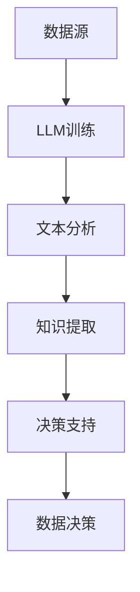
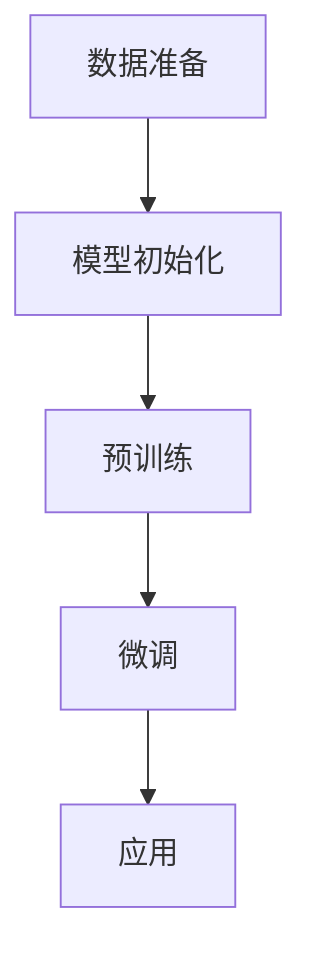

                 

### 背景介绍

商业世界中的数据决策是一个复杂且至关重要的过程。随着大数据和人工智能技术的迅猛发展，如何高效、准确地利用数据来指导决策成为企业成功的关键。在众多技术中，大型语言模型（LLM，Large Language Model）的出现为数据决策带来了新的可能性。

#### 数据决策的重要性

在商业活动中，数据决策是战略制定和运营管理的重要环节。它可以帮助企业理解市场趋势、客户需求、竞争对手策略等关键信息，从而做出更为明智的决策。传统的数据决策依赖于统计分析和业务经验，虽然在一定程度上有效，但往往受限于数据质量和分析能力。

#### 大数据和人工智能的发展

大数据时代，数据量、数据类型和数据来源迅速增长，这为商业决策带来了巨大的挑战。同时，人工智能技术的进步，特别是深度学习和自然语言处理技术的发展，使得我们能够从海量数据中提取有价值的信息，为数据决策提供更加有力的支持。

#### LLM的出现

LLM是一种基于神经网络的语言模型，通过学习大量文本数据，可以生成流畅、连贯的文本，并且具备一定的语义理解能力。LLM在自然语言处理领域取得了显著的成果，如机器翻译、文本生成、情感分析等。

#### LLM驱动数据决策的意义

LLM的出现，使得我们能够更加高效地从大量非结构化数据中提取信息，从而为数据决策提供更全面、准确的支撑。LLM不仅可以处理结构化数据，还可以处理文本、语音等多种形式的数据，这使得它在商业决策中的应用变得更加广泛。

#### 文章结构

本文将首先介绍LLM的基本概念和原理，然后探讨LLM在数据决策中的应用，包括具体算法原理、数学模型和实际案例。最后，我们将讨论LLM驱动数据决策的实际应用场景，以及相关的工具和资源推荐。通过本文的阅读，读者将深入了解LLM驱动数据决策的机制和优势，为实际业务应用提供指导。

### 核心概念与联系

#### 大型语言模型（LLM）

大型语言模型（LLM）是一种基于神经网络的语言处理模型，它通过深度学习算法从海量文本数据中学习语言模式，生成文本、回答问题、进行语言翻译等。LLM的核心思想是通过学习大量的文本数据，使模型具备对自然语言的理解和生成能力。

#### 数据决策

数据决策是指利用数据分析和模型预测来辅助业务决策的过程。数据决策涉及数据的收集、处理、分析和应用，旨在从数据中提取有价值的信息，指导业务战略和运营决策。

#### 关联关系

LLM与数据决策之间存在密切的联系。LLM通过学习大量文本数据，可以提取出与业务相关的知识，为数据决策提供支持。具体来说，LLM可以通过以下方式驱动数据决策：

1. **文本数据分析**：LLM可以处理大量的文本数据，提取关键词、主题和情感等信息，帮助企业了解市场趋势和客户需求。
2. **语言生成**：LLM可以生成文本，帮助撰写报告、邮件、广告等，提高沟通效率和质量。
3. **问答系统**：LLM可以构建问答系统，回答业务问题，提供实时决策支持。
4. **预测分析**：LLM可以结合其他数据源和模型，进行预测分析，为企业提供未来发展趋势的预测。

#### Mermaid流程图

以下是一个简化的Mermaid流程图，展示了LLM与数据决策的关联关系：



**图1. LLM与数据决策的关联关系**

- **数据源**：包括结构化和非结构化数据，如文本、图像、音频等。
- **LLM训练**：使用大量文本数据进行训练，学习语言模式和知识。
- **文本分析**：对文本数据进行处理，提取关键词、主题和情感等信息。
- **知识提取**：从文本数据中提取有价值的信息，为业务决策提供支持。
- **决策支持**：利用提取的知识和预测模型，提供实时决策支持。
- **数据决策**：根据决策支持的结果，制定和调整业务策略和运营计划。

通过上述流程，LLM可以有效地驱动数据决策，提高企业的决策质量和效率。接下来，我们将深入探讨LLM的核心算法原理和应用步骤。

### 核心算法原理 & 具体操作步骤

#### 语言模型基础

语言模型（Language Model，LM）是自然语言处理（Natural Language Processing，NLP）中的核心组成部分，旨在预测一个词或词组出现的概率。语言模型可以分为基于规则模型和统计模型，而现代主流语言模型主要是基于统计模型，尤其是基于神经网络的深度学习模型。

#### 语言模型的演变

早期的语言模型如N-gram模型通过统计词频序列来预测下一个词。然而，N-gram模型存在明显的局限性，如无法捕捉长距离依赖关系和上下文信息。随着深度学习技术的发展，基于神经网络的语言模型如循环神经网络（RNN）和长短期记忆网络（LSTM）开始广泛应用于NLP领域。

#### Transformer模型

近年来，Transformer模型的出现彻底改变了语言模型的架构。Transformer模型基于自注意力（Self-Attention）机制，可以捕捉长距离依赖关系，从而在多个NLP任务中取得了显著的性能提升。Transformer模型的变体如BERT、GPT等，进一步推动了语言模型的发展。

#### LLM的工作原理

大型语言模型（LLM）是Transformer模型的扩展和改进，通过预训练和微调，可以生成高质量的文本、回答问题、进行翻译等。LLM的工作原理可以概括为以下几个步骤：

1. **预训练**：在无监督的情况下，LLM通过大量的文本数据进行预训练，学习语言模式和知识。预训练通常包括以下任务：
   - **Masked Language Model（MLM）**：随机遮盖部分文本，模型需要预测被遮盖的词。
   - **Next Sentence Prediction（NSP）**：预测两个句子是否属于同一篇章。
   - **Classification Task（CL）**：对文本进行分类，例如情感分析、命名实体识别等。

2. **微调**：在预训练的基础上，LLM通过有监督的任务进行微调，使其适应特定领域的应用。微调任务通常包括：
   - **Sequence Classification**：对输入的序列进行分类，如文本分类、情感分析等。
   - **Question-Answering**：回答与输入文本相关的问题。
   - **Text Generation**：生成与输入文本相关的新文本。

#### LLM的操作步骤

以下是LLM的基本操作步骤：

1. **数据准备**：收集并预处理大量文本数据，包括文本清洗、分词、词嵌入等。
2. **模型初始化**：选择合适的LLM模型并进行初始化，如BERT、GPT等。
3. **预训练**：使用无监督任务对LLM进行预训练，学习语言模式和知识。
4. **微调**：使用有监督任务对LLM进行微调，使其适应特定应用场景。
5. **应用**：使用训练好的LLM进行文本生成、问答、翻译等任务。

#### Mermaid流程图

以下是一个简化的Mermaid流程图，展示了LLM的操作步骤：



**图2. LLM的操作步骤**

- **数据准备**：收集并预处理文本数据。
- **模型初始化**：选择并初始化LLM模型。
- **预训练**：使用无监督任务进行预训练。
- **微调**：使用有监督任务进行微调。
- **应用**：使用训练好的LLM进行各种任务。

通过上述步骤，LLM可以从海量文本数据中提取有价值的信息，为数据决策提供支持。接下来，我们将探讨LLM驱动的数据决策中的数学模型和公式。

### 数学模型和公式 & 详细讲解 & 举例说明

在LLM驱动的数据决策过程中，数学模型和公式起着至关重要的作用。以下将详细讲解LLM中的核心数学模型和公式，并通过具体示例进行说明。

#### 自注意力（Self-Attention）

自注意力是Transformer模型的核心机制，它通过计算输入序列中每个词与其他词之间的权重，实现多词之间的交互。自注意力的计算公式如下：

$$
Attention(Q, K, V) = \text{softmax}\left(\frac{QK^T}{\sqrt{d_k}}\right)V
$$

其中，$Q$、$K$和$V$分别是查询（Query）、键（Key）和值（Value）向量，$d_k$是键向量的维度。$\text{softmax}$函数用于归一化，使权重和为1。

举例来说，假设输入序列为["我", "是", "人工智能"],维度为$d_k=3$，那么自注意力计算过程如下：

1. **计算键-查询（Key-Query）相似度**：

$$
\text{相似度} = \frac{\text{我} \cdot \text{我}}{\sqrt{3}} = \frac{1}{\sqrt{3}}
$$

2. **计算值-查询（Value-Query）相似度**：

$$
\text{相似度} = \frac{\text{是} \cdot \text{我}}{\sqrt{3}} = \frac{2}{\sqrt{3}}
$$

3. **计算softmax归一化权重**：

$$
\text{权重} = \text{softmax}(\text{相似度}) = \frac{1}{\sum_{i=1}^{3} \text{相似度}_i} = \frac{1}{\frac{1}{\sqrt{3}} + \frac{2}{\sqrt{3}}} = \frac{\sqrt{3}}{3}
$$

4. **计算输出**：

$$
\text{输出} = \text{权重} \cdot \text{值向量} = \frac{\sqrt{3}}{3} \cdot [\text{是}, \text{人工智能}]
$$

通过自注意力机制，模型可以更好地捕捉输入序列中的依赖关系，提高生成文本的质量。

#### 位置编码（Positional Encoding）

由于Transformer模型没有循环结构，无法直接处理序列的位置信息。为此，引入了位置编码（Positional Encoding）来嵌入序列的位置信息。位置编码通常使用正弦和余弦函数生成，公式如下：

$$
PE_{(pos, 2i)} = \sin\left(\frac{pos}{10000^{2i/d}}\right) \\
PE_{(pos, 2i+1)} = \cos\left(\frac{pos}{10000^{2i/d}}\right)
$$

其中，$pos$是位置索引，$i$是维度索引，$d$是位置编码的总维度。

举例来说，假设序列长度为5，维度为$d=4$，那么位置编码如下：

1. **计算第一个位置（pos=1）的编码**：

$$
PE_{(1, 0)} = \sin\left(\frac{1}{10000^{2 \times 0/4}}\right) \\
PE_{(1, 1)} = \cos\left(\frac{1}{10000^{2 \times 0/4}}\right)
$$

2. **计算第二个位置（pos=2）的编码**：

$$
PE_{(2, 0)} = \sin\left(\frac{2}{10000^{2 \times 0/4}}\right) \\
PE_{(2, 1)} = \cos\left(\frac{2}{10000^{2 \times 0/4}}\right)
$$

3. **计算第三个位置（pos=3）的编码**：

$$
PE_{(3, 0)} = \sin\left(\frac{3}{10000^{2 \times 1/4}}\right) \\
PE_{(3, 1)} = \cos\left(\frac{3}{10000^{2 \times 1/4}}\right)
$$

4. **计算第四个位置（pos=4）的编码**：

$$
PE_{(4, 0)} = \sin\left(\frac{4}{10000^{2 \times 2/4}}\right) \\
PE_{(4, 1)} = \cos\left(\frac{4}{10000^{2 \times 2/4}}\right)
$$

5. **计算第五个位置（pos=5）的编码**：

$$
PE_{(5, 0)} = \sin\left(\frac{5}{10000^{2 \times 3/4}}\right) \\
PE_{(5, 1)} = \cos\left(\frac{5}{10000^{2 \times 3/4}}\right)
$$

通过位置编码，模型可以理解序列中的位置信息，从而更好地处理序列数据。

#### Softmax函数

Softmax函数用于将一组数值转换为概率分布。其公式如下：

$$
\text{softmax}(x)_i = \frac{e^{x_i}}{\sum_{j=1}^{N} e^{x_j}}
$$

其中，$x$是输入向量，$N$是向量的维度，$i$是第$i$个元素。

举例来说，假设输入向量为[2, 3, 5]，那么softmax函数计算如下：

$$
\text{softmax}([2, 3, 5])_1 = \frac{e^2}{e^2 + e^3 + e^5} \\
\text{softmax}([2, 3, 5])_2 = \frac{e^3}{e^2 + e^3 + e^5} \\
\text{softmax}([2, 3, 5])_3 = \frac{e^5}{e^2 + e^3 + e^5}
$$

通过softmax函数，模型可以输出概率分布，从而进行分类、预测等任务。

通过上述数学模型和公式的讲解，我们可以更好地理解LLM的工作原理和机制。在接下来的部分，我们将通过实际案例来展示LLM在数据决策中的应用。

### 项目实战：代码实际案例和详细解释说明

为了更好地展示LLM在数据决策中的应用，我们选择了一个实际的案例——文本分类。文本分类是一种常见的数据决策任务，旨在将文本数据归类到预定义的类别中。在本案例中，我们将使用一个基于GPT-2的文本分类模型，并对关键步骤进行详细解释说明。

#### 开发环境搭建

1. **安装依赖**

首先，我们需要安装所需的依赖库。在本案例中，我们使用Python和Transformers库。

```bash
pip install transformers
```

2. **获取预训练模型**

GPT-2模型通常非常大，我们在这里使用一个预训练的GPT-2模型。可以通过以下命令下载：

```python
import transformers
model = transformers.AutoModel.from_pretrained("gpt2")
```

#### 源代码详细实现和代码解读

以下是一个简单的文本分类示例：

```python
import torch
from transformers import AutoTokenizer, AutoModelForSequenceClassification

# 1. 准备数据集
# 假设我们有两个类别：新闻和评论
data = [
    ("这是一个新闻摘要", "新闻"),
    ("这是一个用户评论", "评论"),
]

# 将数据转换为Tensor
inputs = tokenizer([text for text, _ in data], padding=True, truncation=True, return_tensors="pt")
labels = torch.tensor([label for _, label in data])

# 2. 加载预训练模型
model = AutoModelForSequenceClassification.from_pretrained("gpt2", num_labels=2)

# 3. 训练模型
device = torch.device("cuda" if torch.cuda.is_available() else "cpu")
model.to(device)
model.train()

optimizer = torch.optim.AdamW(model.parameters(), lr=1e-5)

for epoch in range(3):  # 训练3个epoch
    optimizer.zero_grad()
    outputs = model(**inputs.to(device), labels=labels.to(device))
    loss = outputs.loss
    loss.backward()
    optimizer.step()

    print(f"Epoch {epoch+1}, Loss: {loss.item()}")

# 4. 评估模型
model.eval()
with torch.no_grad():
    logits = model(**inputs.to(device)).logits
    predictions = logits.argmax(-1)

print(predictions)  # 输出预测结果
```

**代码解读：**

1. **数据准备**：我们将文本数据分为两个类别，并将它们转换为Tensor。

2. **加载模型**：我们使用预训练的GPT-2模型，并将其转换为序列分类模型。这里我们设置了两个类别。

3. **训练模型**：我们将模型放到GPU上（如果有可用GPU），并使用AdamW优化器进行训练。每个epoch后，我们计算损失并打印。

4. **评估模型**：我们将模型设置为评估模式，并计算预测结果。

#### 代码解读与分析

1. **数据准备**：

   ```python
   inputs = tokenizer([text for text, _ in data], padding=True, truncation=True, return_tensors="pt")
   labels = torch.tensor([label for _, label in data])
   ```

   这段代码将文本数据转换为模型可接受的格式。`tokenizer`对象对文本进行分词、编码等预处理，`padding`和`truncation`确保所有输入序列具有相同长度。

2. **加载模型**：

   ```python
   model = AutoModelForSequenceClassification.from_pretrained("gpt2", num_labels=2)
   ```

   这里我们加载预训练的GPT-2模型，并设置模型输出两个类别。

3. **训练模型**：

   ```python
   optimizer = torch.optim.AdamW(model.parameters(), lr=1e-5)
   for epoch in range(3):
       optimizer.zero_grad()
       outputs = model(**inputs.to(device), labels=labels.to(device))
       loss = outputs.loss
       loss.backward()
       optimizer.step()
   ```

   我们使用AdamW优化器训练模型，每个epoch后更新模型参数。

4. **评估模型**：

   ```python
   model.eval()
   with torch.no_grad():
       logits = model(**inputs.to(device)).logits
       predictions = logits.argmax(-1)
   ```

   我们将模型设置为评估模式，并计算预测结果。

通过这个案例，我们可以看到LLM在文本分类任务中的强大能力。接下来，我们将讨论LLM在数据决策中的实际应用场景。

### 实际应用场景

#### 商业策略制定

LLM在商业策略制定中具有广泛的应用。企业可以利用LLM对大量市场数据进行分析，提取关键信息，如客户需求、竞争对手策略、市场趋势等，从而制定更为精准和高效的商业策略。

**案例1：客户需求分析**

某电子商务公司希望了解客户的购物偏好，以便更好地调整产品线和营销策略。通过使用LLM，公司可以分析大量的客户评论和反馈，提取关键词和情感，了解客户对产品满意度和不满意度。例如，LLM可以识别出客户对某个产品的正面评价集中在“质量好”、“价格实惠”等关键词，从而帮助公司优化产品设计和定价策略。

**案例2：竞争对手分析**

在竞争激烈的行业，了解竞争对手的策略是制定有效商业策略的关键。LLM可以帮助企业分析竞争对手的网站、产品评论、营销活动等，提取竞争对手的关键策略和优劣势。通过这些信息，企业可以调整自身策略，避免直接竞争，寻找差异化竞争优势。

#### 运营优化

LLM在运营优化中也发挥着重要作用，帮助企业提高运营效率，降低成本。

**案例1：供应链管理**

在供应链管理中，LLM可以帮助企业优化库存管理和物流规划。通过对历史销售数据、库存数据、市场需求等进行分析，LLM可以预测未来需求趋势，帮助企业合理安排库存和物流资源，降低库存成本和物流成本。

**案例2：人力资源优化**

人力资源是企业的重要资产。LLM可以帮助企业分析员工绩效、技能水平、离职率等数据，发现潜在问题和优化点。例如，LLM可以识别出员工绩效较低的原因，如培训不足、工作负荷过重等，从而帮助企业制定针对性的改进措施。

#### 客户服务与支持

在客户服务与支持方面，LLM可以提供智能化的解决方案，提高客户满意度和服务质量。

**案例1：智能客服系统**

通过LLM，企业可以构建智能客服系统，实现自动化、智能化的客户服务。智能客服系统可以理解客户的提问，提供准确的答案和建议，提高客户问题解决效率。例如，一个电商平台的智能客服系统可以识别客户询问的商品规格、价格等，自动提供相关产品信息，帮助客户快速做出购买决策。

**案例2：个性化推荐**

个性化推荐是提高客户满意度和转化率的重要手段。LLM可以帮助企业分析客户的历史购买记录、浏览行为等数据，提取客户偏好和兴趣点，从而实现个性化推荐。例如，一个电商平台可以根据客户的购买记录和浏览记录，推荐类似的商品，提高客户购买概率。

通过上述案例，我们可以看到LLM在商业策略制定、运营优化、客户服务与支持等方面的实际应用场景。LLM不仅提高了数据决策的效率和质量，还为企业在激烈的市场竞争中提供了有力支持。

### 工具和资源推荐

#### 学习资源推荐

1. **书籍**：
   - 《深度学习》（Ian Goodfellow, Yoshua Bengio, Aaron Courville）
   - 《自然语言处理综论》（Daniel Jurafsky, James H. Martin）
   - 《统计学习方法》（李航）

2. **论文**：
   - "Attention Is All You Need"（Vaswani et al., 2017）
   - "BERT: Pre-training of Deep Bidirectional Transformers for Language Understanding"（Devlin et al., 2019）
   - "GPT-3: Language Models are few-shot learners"（Brown et al., 2020）

3. **博客**：
   - fast.ai：提供丰富的深度学习和NLP教程
   - Medium：许多知名公司和研究者的技术博客
   - AI技术应用：涵盖AI在各个领域的应用案例

4. **网站**：
   - Hugging Face：提供丰富的预训练模型和工具
   - ArXiv：最新科研成果的预印本

#### 开发工具框架推荐

1. **编程语言**：
   - Python：广泛用于数据科学和机器学习
   - R：专门用于统计分析和数据可视化

2. **深度学习框架**：
   - TensorFlow：谷歌开发的开源深度学习框架
   - PyTorch：广泛应用于研究和小型项目

3. **NLP工具**：
   - NLTK：自然语言处理的基础工具包
   - spaCy：高效和易于使用的NLP库
   - Transformers：由Hugging Face提供的预训练模型和工具

4. **数据管理**：
   - Pandas：数据处理和分析库
   - SQL：结构化查询语言，用于数据存储和查询

5. **版本控制**：
   - Git：版本控制和代码协作工具
   - GitHub：代码托管和协作平台

通过上述学习和开发工具的推荐，读者可以更好地掌握LLM和NLP技术，为实际项目应用奠定坚实基础。

### 总结：未来发展趋势与挑战

LLM在数据决策中的应用已经展现出巨大的潜力，随着技术的不断进步，未来LLM的发展趋势和面临的挑战也将更加多样和复杂。

#### 发展趋势

1. **模型规模和计算能力**：随着计算资源的提升和算法的优化，LLM的规模将越来越大，计算能力将越来越强。这将为LLM在数据决策中的应用提供更丰富的信息和更高的准确性。

2. **多模态融合**：未来LLM可能会结合图像、声音、视频等多种数据类型，实现多模态融合，从而提供更加全面的数据分析能力。

3. **个性化与自动化**：LLM将在个性化推荐、自动化决策等领域发挥更大作用，通过不断学习和适应，提高决策的自动化程度和个性化水平。

4. **行业定制化**：LLM的应用将更加专业化，针对不同行业和业务场景，开发定制化的LLM模型，提高决策的针对性和效果。

#### 挑战

1. **数据隐私和安全**：随着LLM对数据的依赖性增加，数据隐私和安全问题将更加突出。如何在保证数据隐私的同时，充分利用数据的价值，是一个重要的挑战。

2. **模型解释性和透明度**：目前，LLM的决策过程具有一定的黑箱性，如何提高模型的解释性和透明度，使决策过程更加可解释，是一个亟待解决的问题。

3. **模型公平性和多样性**：在数据决策中，模型可能会受到数据偏差的影响，导致不公平的决策结果。如何确保模型的公平性和多样性，避免歧视和偏见，是一个重要挑战。

4. **计算资源消耗**：大型LLM模型的训练和推理需要大量的计算资源，如何优化计算资源的使用，提高模型效率，是一个关键问题。

#### 结论

LLM在数据决策中的应用前景广阔，但同时也面临诸多挑战。通过不断的技术创新和优化，我们有理由相信，LLM将在未来发挥更加重要的作用，为商业决策提供更加精准和高效的支撑。

### 附录：常见问题与解答

1. **Q：LLM与传统的机器学习模型相比，有哪些优势？**
   - **优势**：
     - **强大的文本生成能力**：LLM能够生成高质量、连贯的文本，这对于文本生成和自然语言处理任务非常有用。
     - **处理长距离依赖**：LLM通过自注意力机制，可以处理长距离依赖关系，从而捕捉复杂的语义信息。
     - **多语言支持**：LLM通常具备多语言处理能力，可以处理多种语言的数据。

2. **Q：如何确保LLM驱动的数据决策的公平性？**
   - **措施**：
     - **数据清洗和预处理**：在训练LLM之前，对数据进行清洗和预处理，消除数据中的偏见和错误。
     - **多样性增强**：在训练过程中，增加数据的多样性，确保模型不会受到特定群体或数据的过度影响。
     - **模型解释性**：提高模型的解释性，使决策过程更加透明，便于发现和纠正偏见。

3. **Q：如何评估LLM的性能？**
   - **方法**：
     - **准确率**：评估模型在分类任务中的正确预测比例。
     - **F1分数**：综合考虑精确率和召回率，是评估二分类任务的重要指标。
     - **BLEU评分**：用于评估文本生成任务的性能，通过比较模型生成的文本和参考文本的相似度进行评分。
     - **人类评估**：通过人类评估者对模型生成的文本或决策结果进行主观评价。

4. **Q：如何优化LLM的训练过程？**
   - **措施**：
     - **调整超参数**：通过调整学习率、批量大小、训练步数等超参数，优化模型性能。
     - **数据增强**：通过数据增强技术，如数据扩充、数据变换等，提高模型的泛化能力。
     - **迁移学习**：利用预训练模型，在特定任务上微调，减少训练所需的数据量和计算资源。
     - **分布式训练**：利用多GPU或分布式计算资源，提高训练速度和模型规模。

通过以上问题的解答，我们可以更好地理解LLM在数据决策中的应用和优化方法。

### 扩展阅读 & 参考资料

为了深入了解LLM在数据决策中的应用和技术细节，以下是推荐的一些建议阅读材料和参考资源：

1. **书籍**：
   - 《深度学习》（Ian Goodfellow, Yoshua Bengio, Aaron Courville）：深入介绍了深度学习和神经网络的基本原理。
   - 《自然语言处理综论》（Daniel Jurafsky, James H. Martin）：全面讲解了自然语言处理的基础知识。
   - 《语言模型的本质》（Jurafsky, Christopher D.）：探讨了语言模型的理论基础和实现方法。

2. **论文**：
   - "Attention Is All You Need"（Vaswani et al., 2017）：介绍了Transformer模型的基本原理和应用。
   - "BERT: Pre-training of Deep Bidirectional Transformers for Language Understanding"（Devlin et al., 2019）：详细介绍了BERT模型的预训练方法和应用。
   - "GPT-3: Language Models are few-shot learners"（Brown et al., 2020）：展示了GPT-3模型在少样本学习任务中的卓越性能。

3. **博客和网站**：
   - fast.ai：提供了丰富的深度学习和NLP教程，适合初学者和进阶者。
   - Hugging Face：提供了丰富的预训练模型和工具，方便用户进行研究和应用。
   - AI技术应用：分享了AI在不同领域的应用案例和最佳实践。

4. **在线课程**：
   - Coursera：提供了多门深度学习和NLP相关的在线课程，适合系统学习。
   - edX：提供了由知名大学和机构开设的AI和NLP课程，覆盖理论到实践。

通过阅读和参考上述材料，读者可以更深入地了解LLM在数据决策中的技术细节和应用场景，为实际项目提供更有力的支持。

