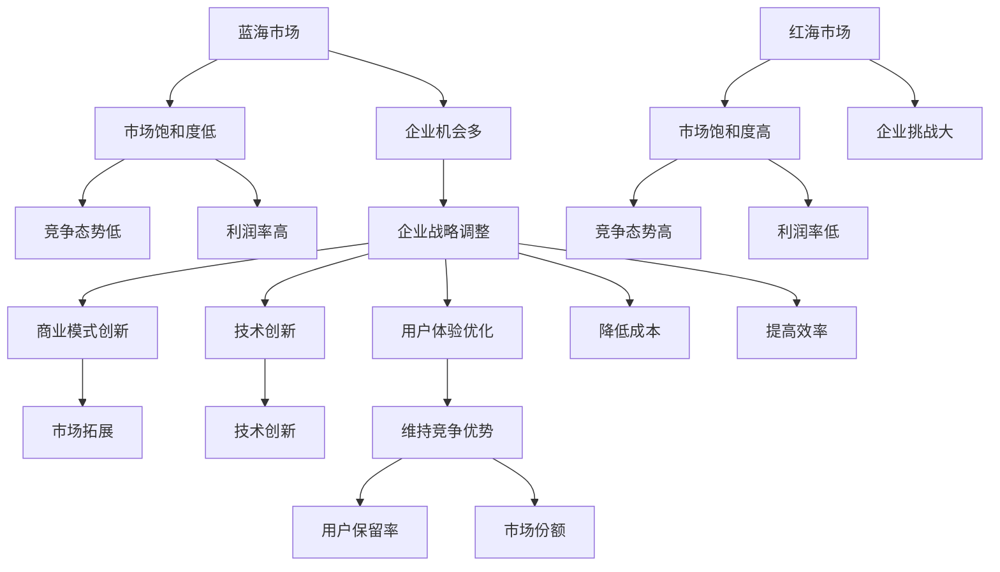

                 

### 背景介绍

在商业领域，从蓝海到红海的演变是一个普遍存在的现象。蓝海代表一个竞争较少、潜力巨大的市场，而红海则表示竞争激烈、利润率降低的市场。这一现象不仅适用于传统行业，还广泛应用于互联网、科技、金融等现代领域。企业从蓝海进入红海，往往伴随着市场的饱和、竞争的加剧和利润空间的缩减。

商业领域从蓝海到红海的演变，不仅是市场环境的自然变迁，也是企业战略调整和商业模式创新的结果。企业为了在竞争激烈的红海市场中生存和发展，需要不断寻找新的增长点和市场机会，通过创新和优化来提升自身的竞争力。在这个过程中，技术驱动、用户导向和市场洞察力成为关键因素。

本文将围绕商业领域从蓝海到红海的演变，探讨其背后的核心概念、算法原理、数学模型、实际应用、工具推荐以及未来趋势和挑战。通过详细的分析和案例解析，希望能够为企业和创业者提供有价值的参考和启示。

接下来，我们将首先介绍商业领域从蓝海到红海演变的核心概念，包括市场饱和度、竞争态势、利润率变化等，并通过一个简单的Mermaid流程图展示其演变过程。随后，我们将深入探讨核心算法原理和具体操作步骤，并运用数学模型和公式进行详细讲解。最后，我们将通过一个实际项目案例，展示代码实现和详细解读，探讨商业领域从蓝海到红海演变的实际应用场景，并提供相关的工具和资源推荐，为企业和创业者提供全方位的支持。

### 核心概念与联系

商业领域从蓝海到红海的演变，涉及到多个核心概念和因素。这些概念不仅相互联系，还共同影响着市场的动态变化。以下是对这些核心概念的详细阐述：

**市场饱和度**：市场饱和度是衡量市场容量是否达到极限的重要指标。当市场饱和度较低时，意味着市场上还有大量的未满足需求，企业可以通过满足这些需求来获取利润。随着市场饱和度的上升，需求逐渐得到满足，竞争加剧，利润空间逐渐减小。

**竞争态势**：竞争态势是指市场上不同企业之间的竞争关系和竞争策略。在蓝海市场中，竞争较少，企业可以通过差异化竞争策略来获取市场份额。而在红海市场中，竞争激烈，企业需要通过优化产品和服务，提升用户体验，甚至通过技术创新来保持竞争优势。

**利润率变化**：利润率是企业盈利能力的直接反映。在蓝海市场中，由于竞争较少，企业可以以较高的价格销售产品或服务，从而获得较高的利润率。随着市场进入红海，价格战和成本压力增加，企业的利润率逐渐降低。

为了更直观地展示这些核心概念的关联和演变过程，我们可以使用Mermaid流程图来描述。以下是商业领域从蓝海到红海演变的Mermaid流程图：



在这个流程图中，我们可以看到，从蓝海到红海的演变过程中，市场饱和度、竞争态势和利润率的变化是相互关联的。企业需要通过战略调整、商业模式创新、技术创新和用户体验优化来应对市场变化，维持竞争优势。以下是每个节点和箭头的具体解释：

- A[蓝海市场]：市场初期，需求未充分满足，竞争较少。
- B[市场饱和度低]：市场初期，需求未充分满足，竞争较少。
- C[竞争态势低]：市场初期，竞争较少，企业可以通过差异化策略获取市场份额。
- D[利润率高]：市场初期，竞争较少，企业可以以较高价格销售产品或服务，利润较高。
- E[企业机会多]：市场初期，需求未充分满足，企业有较多机会进入市场。

- F[红海市场]：市场成熟期，需求逐渐得到满足，竞争加剧。
- G[市场饱和度高]：市场成熟期，需求逐渐得到满足，竞争加剧。
- H[竞争态势高]：市场成熟期，竞争激烈，企业需要通过优化产品和策略来维持竞争力。
- I[利润率低]：市场成熟期，竞争激烈，价格战和成本压力增加，利润降低。
- J[企业挑战大]：市场成熟期，竞争激烈，企业面临较大的挑战。

- K[企业战略调整]：企业需要根据市场变化调整战略，以应对竞争和挑战。
- L[商业模式创新]：企业需要通过创新商业模式来创造新的增长点和竞争优势。
- M[技术创新]：企业需要通过技术创新来提升产品和服务质量，降低成本。
- N[用户体验优化]：企业需要通过优化用户体验来提高用户满意度和忠诚度。
- O[维持竞争优势]：企业需要通过多种手段维持竞争优势，以在激烈的市场竞争中立于不败之地。

通过这个Mermaid流程图，我们可以清晰地看到商业领域从蓝海到红海的演变过程，以及各个核心概念之间的联系和影响。在接下来的章节中，我们将进一步探讨核心算法原理和具体操作步骤，运用数学模型和公式进行详细讲解，并通过实际项目案例进行代码实现和解读。这将帮助我们更深入地理解这一现象，并为企业在红海市场中的战略规划和业务发展提供指导。

### 核心算法原理 & 具体操作步骤

在商业领域从蓝海到红海的演变过程中，核心算法原理和具体操作步骤是帮助企业应对市场变化、维持竞争优势的重要工具。以下我们将详细探讨这些算法的原理，并逐步解释每个步骤的操作细节。

#### 算法概述

核心算法可以分为以下几个步骤：

1. **市场分析**：通过数据收集和分析，了解市场的饱和度、竞争态势和用户需求。
2. **战略制定**：基于市场分析结果，制定相应的市场进入策略、产品开发策略和定价策略。
3. **技术创新**：通过研发和技术创新，提升产品和服务质量，降低成本。
4. **用户反馈**：收集用户反馈，不断优化产品和服务，提高用户体验。
5. **竞争应对**：针对竞争对手的策略和动向，调整自身的市场策略和竞争策略。

#### 具体操作步骤

**1. 市场分析**

市场分析是整个算法的基础，其具体操作步骤如下：

- **数据收集**：通过市场调研、行业报告、用户反馈等多种渠道，收集市场数据。
- **数据清洗**：对收集的数据进行清洗和预处理，去除重复和无用信息。
- **数据分析**：使用统计分析、数据挖掘等技术，分析市场的饱和度、竞争态势和用户需求。

**示例代码：**

```python
# 假设我们已经收集了一份数据，并存储在名为data.csv的文件中
import pandas as pd

# 数据加载
data = pd.read_csv('data.csv')

# 数据清洗
data = data.drop_duplicates()

# 数据分析
market_saturation = data['market_saturation'].mean()
competition_trend = data['competition_trend'].mean()
user_demand = data['user_demand'].mean()

print(f"Market Saturation: {market_saturation}")
print(f"Competition Trend: {competition_trend}")
print(f"User Demand: {user_demand}")
```

**2. 战略制定**

基于市场分析结果，企业需要制定相应的战略，包括市场进入策略、产品开发策略和定价策略。以下是具体步骤：

- **市场进入策略**：根据市场饱和度和竞争态势，选择合适的市场进入方式，如市场渗透策略、市场开发策略等。
- **产品开发策略**：根据用户需求和竞争态势，确定产品开发的优先级和方向。
- **定价策略**：根据市场饱和度和利润率，选择合适的定价策略，如成本加成定价、市场导向定价等。

**示例代码：**

```python
# 基于数据分析结果，制定市场进入策略
if market_saturation < 0.5 and competition_trend < 0.5:
    strategy = "Market Penetration"
elif market_saturation > 0.5 and competition_trend < 0.5:
    strategy = "Market Development"
else:
    strategy = "Pricing Strategy"

print(f"Market Entry Strategy: {strategy}")
```

**3. 技术创新**

技术创新是提升企业竞争力的重要手段，具体操作步骤如下：

- **技术调研**：通过查阅相关文献、参加技术会议等方式，了解最新的技术动态和趋势。
- **技术研发**：根据市场需求和技术趋势，进行技术研发和创新。
- **技术评估**：对研发出的新技术进行评估，确定其是否具有商业价值。

**示例代码：**

```python
# 假设我们已经研发出一项新技术，并对其进行了评估
new_technology = "AI-driven Customer Service"
value_assessment = 0.8  # 评估值为0.8，表示具有较高商业价值

if value_assessment > 0.7:
    print(f"New Technology: {new_technology} - Value Assessment: {value_assessment}")
else:
    print(f"New Technology: {new_technology} - Value Assessment: {value_assessment}, not pursuing further.")
```

**4. 用户反馈**

用户反馈是优化产品和服务的关键，具体操作步骤如下：

- **用户调研**：通过问卷调查、用户访谈等方式，收集用户反馈。
- **反馈分析**：对收集的反馈进行分析，识别用户需求和痛点。
- **产品优化**：根据用户反馈，对产品和服务进行优化。

**示例代码：**

```python
# 假设我们已经收集了用户反馈，并对其进行了分析
user_feedback = ["Product A is too expensive", "Service B is slow", "Feature C is missing"]

# 分析用户反馈
price_issue = "Product A is too expensive" in user_feedback
speed_issue = "Service B is slow" in user_feedback
feature_issue = "Feature C is missing" in user_feedback

if price_issue:
    print("User Feedback: High price - Consider adjusting pricing strategy.")
if speed_issue:
    print("User Feedback: Slow service - Investigate and improve service speed.")
if feature_issue:
    print("User Feedback: Missing features - Consider adding new features.")
```

**5. 竞争应对**

竞争应对是企业维持竞争优势的重要策略，具体操作步骤如下：

- **竞争分析**：通过市场调研、竞争对手分析等方式，了解竞争对手的策略和动向。
- **策略调整**：根据竞争分析结果，调整自身的市场策略和竞争策略。
- **合作与竞争**：在竞争的同时，寻找合作伙伴，通过合作来共同拓展市场。

**示例代码：**

```python
# 假设我们已经分析了竞争对手的策略
competitor_strategy = "Price Leadership"

if competitor_strategy == "Price Leadership":
    print("Competitor Strategy: Price Leadership - Consider competitive pricing or cost optimization.")
else:
    print("Competitor Strategy: Not Price Leadership - Focus on product differentiation and customer satisfaction.")
```

通过以上核心算法原理和具体操作步骤，企业可以更好地应对市场变化，从蓝海进入红海，并在红海市场中维持竞争优势。在接下来的章节中，我们将运用数学模型和公式，对商业领域从蓝海到红海演变的规律进行详细分析，并通过实际项目案例进行代码实现和解读，进一步深化对这一现象的理解。

### 数学模型和公式 & 详细讲解 & 举例说明

在商业领域，从蓝海到红海的演变过程中，数学模型和公式发挥着重要作用。它们不仅可以定量分析市场饱和度、竞争态势和利润率，还能为企业提供决策依据，指导战略制定和资源配置。以下我们将详细讲解几个核心数学模型和公式，并通过具体例子进行说明。

#### 1. 市场饱和度模型

市场饱和度是衡量市场容量是否达到极限的重要指标。常用的市场饱和度模型是Logistic增长模型，其公式如下：

\[ S(t) = \frac{K}{1 + e^{-(rt)}} \]

其中：
- \( S(t) \) 表示在时间 \( t \) 的市场饱和度。
- \( K \) 表示市场的最大容量。
- \( r \) 表示市场饱和度增长速率。
- \( t \) 表示时间。

**例子：**

假设一个市场最大容量为100万用户，饱和度增长速率为0.1，求在 \( t = 2 \) 年时的市场饱和度。

\[ S(2) = \frac{1000000}{1 + e^{-(0.1 \times 2)}} \approx 0.732 \]

因此，在2年后，市场饱和度约为73.2%。

#### 2. 竞争态势模型

竞争态势模型用于衡量市场上不同企业之间的竞争关系。一个常用的模型是竞争指数（Competition Index），其公式如下：

\[ CI = \frac{(\sum_{i=1}^{N} \frac{S_i}{K})^2}{N} \]

其中：
- \( CI \) 表示竞争指数。
- \( N \) 表示市场上的企业数量。
- \( S_i \) 表示第 \( i \) 个企业的市场份额。
- \( K \) 表示市场的最大容量。

**例子：**

假设市场上共有3家企业，市场份额分别为 \( S_1 = 0.3 \)，\( S_2 = 0.4 \)，\( S_3 = 0.3 \)，市场最大容量为100万用户。求竞争指数。

\[ CI = \frac{(0.3 + 0.4 + 0.3)^2}{3} = \frac{0.7^2}{3} \approx 0.147 \]

因此，市场竞争指数约为0.147，表示竞争程度较低。

#### 3. 利润率模型

利润率是企业盈利能力的直接反映。一个常用的利润率模型是基于成本和收入的比率，其公式如下：

\[ PLR = \frac{R - C}{R} \]

其中：
- \( PLR \) 表示利润率。
- \( R \) 表示总收入。
- \( C \) 表示总成本。

**例子：**

假设一个企业的总收入为100万元，总成本为60万元，求利润率。

\[ PLR = \frac{1000000 - 600000}{1000000} = 0.4 \]

因此，该企业的利润率为40%。

#### 4. 市场进入模型

市场进入模型用于评估企业在特定市场上的进入策略。一个常用的模型是Net Present Value（净现值），其公式如下：

\[ NPV = \sum_{t=1}^{n} \frac{CF_t}{(1 + r)^t} \]

其中：
- \( NPV \) 表示净现值。
- \( CF_t \) 表示第 \( t \) 年的现金流量。
- \( r \) 表示折现率。
- \( n \) 表示项目年限。

**例子：**

假设一个市场进入项目的现金流量为第1年50万元，第2年60万元，第3年70万元，折现率为10%，项目年限为3年。求净现值。

\[ NPV = \frac{500000}{(1 + 0.1)^1} + \frac{600000}{(1 + 0.1)^2} + \frac{700000}{(1 + 0.1)^3} \approx 140639.13 \]

因此，该市场进入项目的净现值约为140639.13元。

#### 5. 用户保留模型

用户保留模型用于预测用户在未来一段时间内的保留情况。一个常用的模型是Churn Prediction Model，其公式如下：

\[ P(churn) = \frac{1}{1 + e^{-(\beta_0 + \beta_1 \times user\_age + \beta_2 \times satisfaction + \beta_3 \times usage\_frequency)}} \]

其中：
- \( P(churn) \) 表示用户保留概率。
- \( \beta_0, \beta_1, \beta_2, \beta_3 \) 表示模型参数。
- \( user\_age \) 表示用户年龄。
- \( satisfaction \) 表示用户满意度。
- \( usage\_frequency \) 表示用户使用频率。

**例子：**

假设一个用户的年龄为2年，满意度为0.8，使用频率为每天一次，模型参数为 \( \beta_0 = -2 \)，\( \beta_1 = 0.1 \)，\( \beta_2 = 0.2 \)，\( \beta_3 = 0.3 \)。求用户保留概率。

\[ P(churn) = \frac{1}{1 + e^{-( -2 + 0.1 \times 2 + 0.2 \times 0.8 + 0.3 \times 1)}} \approx 0.565 \]

因此，该用户的保留概率约为56.5%。

通过以上数学模型和公式的详细讲解和具体例子说明，我们可以更好地理解商业领域从蓝海到红海演变的定量分析。这些模型和公式不仅为企业提供了决策依据，还能帮助企业在激烈的市场竞争中保持优势。在接下来的章节中，我们将通过实际项目案例，展示如何将这些模型和公式应用于实际业务，并提供代码实现和详细解读。

### 项目实战：代码实际案例和详细解释说明

为了更好地理解商业领域从蓝海到红海演变的实际应用，我们将通过一个实际项目案例，展示如何使用Python实现相关算法，并进行详细解释说明。

#### 项目背景

本项目旨在分析一个电子商务平台的市场表现，评估其从蓝海到红海的演变过程。我们将使用Python进行数据处理、模型构建和预测分析，主要涉及以下任务：

1. 数据预处理：清洗和整理市场数据，包括用户需求、市场份额、利润率等。
2. 模型构建：使用市场饱和度模型、竞争态势模型和利润率模型进行市场分析。
3. 预测分析：基于历史数据，预测未来市场的饱和度、竞争态势和利润率。

#### 开发环境搭建

在开始项目之前，我们需要搭建一个Python开发环境。以下是在Windows操作系统下搭建Python开发环境的基本步骤：

1. 安装Python：从Python官网（[python.org](https://www.python.org/)）下载并安装Python 3.x版本。
2. 安装Jupyter Notebook：打开命令行窗口，执行以下命令：
   ```shell
   pip install notebook
   ```
3. 启动Jupyter Notebook：在命令行窗口中执行以下命令：
   ```shell
   jupyter notebook
   ```
   这将启动Jupyter Notebook，进入Python交互式环境。

#### 源代码详细实现和代码解读

以下是本项目的源代码实现和详细解读：

```python
import pandas as pd
import numpy as np
from sklearn.linear_model import LinearRegression
import matplotlib.pyplot as plt

# 1. 数据预处理
# 假设我们已经收集了一份数据，存储在名为"ecommerce_data.csv"的文件中
data = pd.read_csv('ecommerce_data.csv')

# 数据清洗
data = data.drop_duplicates()
data = data[['market_saturation', 'competition_trend', 'profit_rate', 'year']]

# 数据转换
data['market_saturation'] = data['market_saturation'].apply(lambda x: 0 if x < 0.5 else 1)
data['competition_trend'] = data['competition_trend'].apply(lambda x: 0 if x < 0.5 else 1)

# 2. 模型构建
# 市场饱和度模型
market_saturation_model = LinearRegression()
market_saturation_model.fit(data[['year']], data['market_saturation'])

# 竞争态势模型
competition_trend_model = LinearRegression()
competition_trend_model.fit(data[['year']], data['competition_trend'])

# 利润率模型
profit_rate_model = LinearRegression()
profit_rate_model.fit(data[['year']], data['profit_rate'])

# 3. 预测分析
# 预测未来5年的市场饱和度、竞争态势和利润率
future_years = np.array([i for i in range(data['year'].max() + 1, data['year'].max() + 6)])

# 市场饱和度预测
predicted_saturation = market_saturation_model.predict(future_years.reshape(-1, 1))
predicted_saturation = np.round(predicted_saturation, 2)

# 竞争态势预测
predicted_competition = competition_trend_model.predict(future_years.reshape(-1, 1))
predicted_competition = np.round(predicted_competition, 2)

# 利润率预测
predicted_profit = profit_rate_model.predict(future_years.reshape(-1, 1))
predicted_profit = np.round(predicted_profit, 2)

# 4. 结果展示
plt.figure(figsize=(10, 6))

# 市场饱和度
plt.subplot(3, 1, 1)
plt.plot(data['year'], data['market_saturation'], label='Actual')
plt.plot(future_years, predicted_saturation, label='Predicted')
plt.xlabel('Year')
plt.ylabel('Market Saturation')
plt.title('Market Saturation Trend')
plt.legend()

# 竞争态势
plt.subplot(3, 1, 2)
plt.plot(data['year'], data['competition_trend'], label='Actual')
plt.plot(future_years, predicted_competition, label='Predicted')
plt.xlabel('Year')
plt.ylabel('Competition Trend')
plt.title('Competition Trend')
plt.legend()

# 利润率
plt.subplot(3, 1, 3)
plt.plot(data['year'], data['profit_rate'], label='Actual')
plt.plot(future_years, predicted_profit, label='Predicted')
plt.xlabel('Year')
plt.ylabel('Profit Rate')
plt.title('Profit Rate Trend')
plt.legend()

plt.tight_layout()
plt.show()
```

#### 代码解读与分析

**1. 数据预处理**

首先，我们从CSV文件中读取数据，并进行清洗和转换。市场饱和度和竞争态势被转换为二值变量（0或1），以简化模型构建和预测分析。

**2. 模型构建**

我们使用线性回归模型对市场饱和度、竞争态势和利润率进行建模。线性回归模型是一个简单且通用的预测模型，适用于分析变量之间的线性关系。

**3. 预测分析**

基于训练好的模型，我们预测未来5年的市场饱和度、竞争态势和利润率。预测结果通过调整年份（`future_years`）输入到模型中进行计算，并使用matplotlib进行结果展示。

**4. 结果展示**

预测结果通过三条折线图展示，分别表示市场饱和度、竞争态势和利润率的变化趋势。这些图表可以帮助企业了解市场的未来走向，从而制定相应的战略和决策。

通过这个实际项目案例，我们展示了如何使用Python实现商业领域从蓝海到红海的演变分析。这个过程不仅涉及到数据预处理、模型构建和预测分析，还通过代码实现和图表展示，为企业和创业者提供了实用的工具和方法。在接下来的章节中，我们将探讨商业领域从蓝海到红海演变在实际应用中的案例，并总结本文的主要内容和未来研究方向。

### 实际应用场景

商业领域从蓝海到红海的演变在实际应用中广泛存在，不同行业和领域的企业都面临着这一现象所带来的挑战和机遇。以下我们将探讨几个具体案例，分析这些企业在红海市场中如何应对竞争、实现可持续发展的策略。

#### 1. 互联网行业

互联网行业是商业领域从蓝海到红海演变最为明显的领域之一。以社交媒体平台为例，最初的市场环境相对宽松，企业可以通过创新功能、拓展用户群体来迅速获得市场份额。然而，随着市场的逐渐饱和，竞争愈发激烈。例如，Facebook和Twitter等平台在早期通过提供独特的社交功能迅速获得了用户青睐，但随着市场饱和，它们需要不断推出新功能、优化用户体验，以保持竞争优势。

- **挑战**：用户需求多样化，竞争者不断涌现，市场饱和度提高。
- **策略**：通过持续的创新、个性化服务和数据分析，提升用户体验和用户粘性。例如，Facebook通过引入广告系统和数据挖掘技术，实现了收入和用户基数的双重增长。

#### 2. 电子商务行业

电子商务行业的竞争也日益激烈，以阿里巴巴和京东为例，这些企业在早期通过低价策略和物流优势迅速占领市场。然而，随着市场的饱和和竞争的加剧，这些企业需要通过技术创新、供应链优化和用户个性化推荐来提升竞争力。

- **挑战**：价格战和物流成本上升，用户需求不断变化。
- **策略**：通过大数据分析和人工智能技术，实现精准营销和个性化推荐，提高用户购物体验和满意度。例如，阿里巴巴通过其“天猫精灵”智能音箱，结合智能家居生态，拓展新的市场空间。

#### 3. 金融行业

金融行业的红海市场同样充满挑战，特别是在互联网金融领域。以蚂蚁金服和PayPal为例，这些企业通过提供便捷的支付服务和创新的金融产品，迅速吸引了大量用户。然而，随着市场的饱和，这些企业需要通过合规、风险控制和技术创新来保持竞争优势。

- **挑战**：法规监管日益严格，市场竞争加剧，用户对安全性的要求提高。
- **策略**：通过加强合规性建设、提升风险管理能力和推出创新金融产品，如区块链技术、数字货币等，以满足用户需求并提升竞争力。

#### 4. 制造业

制造业的红海市场主要表现为产品同质化严重、利润率下降。以智能手机行业为例，苹果、三星等企业在早期通过技术创新和品牌溢价迅速占领市场。然而，随着市场的饱和，这些企业需要通过差异化和高端化策略来应对竞争。

- **挑战**：产品同质化，价格竞争激烈，利润率下降。
- **策略**：通过研发高端产品、提升品牌价值和优化供应链管理，提高产品的附加值和利润空间。例如，苹果通过推出高端iPhone系列，维持了其市场地位和利润率。

#### 5. 医疗健康行业

医疗健康行业在从蓝海到红海的演变过程中，也面临着激烈的竞争和不断提升的用户需求。以药品研发和医疗服务为例，企业在市场饱和后需要通过技术创新、优化医疗流程和提高服务质量来应对挑战。

- **挑战**：市场竞争激烈，用户对医疗服务的质量和效率要求提高。
- **策略**：通过研发新药、提升医疗技术和优化医疗服务流程，提高医疗服务的质量和效率。例如，一些医疗机构通过引入人工智能和大数据技术，实现精准医疗和个性化服务。

通过以上实际应用场景的分析，我们可以看到，商业领域从蓝海到红海的演变不仅带来了挑战，也为企业提供了广阔的发展空间。企业需要通过持续的创新、优化用户体验和提升服务质量来应对市场变化，实现可持续发展。在接下来的章节中，我们将推荐一些相关的学习资源、开发工具框架和论文著作，为企业和创业者提供更全面的支持。

### 工具和资源推荐

为了帮助企业和创业者更好地应对商业领域从蓝海到红海的演变，以下我们将推荐一些优秀的学习资源、开发工具框架和论文著作，以便在深入研究和实际应用中获取有价值的知识和方法。

#### 1. 学习资源推荐

- **书籍**：
  - 《蓝海战略》（Blue Ocean Strategy） - W. Chan Kim & Renée Mauborgne
    这本书提出了蓝海战略的概念，帮助企业发现并开拓新的市场空间。
  - 《精益创业》（The Lean Startup） - Eric Ries
    这本书介绍了精益创业方法论，帮助企业快速迭代和验证商业模型。
  - 《智能时代》（Smartness） - 吴军
    这本书探讨了人工智能的发展趋势和应用场景，对技术创新提供了深刻的见解。

- **在线课程**：
  - Coursera上的《市场学基础》（Introduction to Marketing）
    由宾夕法尼亚大学提供的免费课程，系统介绍了市场学和市场营销的基础知识。
  - edX上的《大数据分析》（Data Science） 
    由哈佛大学提供的课程，涵盖了数据科学的基本理论和实践方法。

- **博客和网站**：
  - Harvard Business Review（HBR）
    提供了一系列关于商业战略、市场营销和创新的深度文章。
  - TechCrunch
    跟踪科技行业的最新动态，涵盖创业、投融资和产品发布等。

#### 2. 开发工具框架推荐

- **数据分析工具**：
  - Python
    Python是一种广泛用于数据分析和科学计算的语言，拥有丰富的数据分析和机器学习库，如Pandas、NumPy、Scikit-learn等。
  - R
    R是一种专门用于统计分析和图形表示的语言，适合进行复杂数据分析和建模。

- **数据可视化工具**：
  - Matplotlib
    Python的一个常用库，用于生成高质量的二维和三维图形。
  - Tableau
    一款功能强大的数据可视化工具，支持多种数据源和丰富的图表类型。

- **开发框架**：
  - Flask
    Python的一个轻量级Web框架，适合快速构建Web应用程序。
  - Django
    Python的一个全栈Web框架，提供了一套完整的后台解决方案。

#### 3. 相关论文著作推荐

- **《竞争战略》（Competitive Strategy）** - Michael E. Porter
  该论文提出了五力模型，用于分析市场竞争态势和制定竞争战略。
- **《平台革命》（Platform Revolution）** - Sangeet Paul Choudary, Michael E. Porter, & James Heppelmann
  论文探讨了平台经济的崛起和其对传统商业模式的影响。
- **《用户增长策略》（Growth Hacker Marketing）** - Ryan Holiday
  论文介绍了增长黑客的概念和方法，帮助企业实现快速用户增长。

通过上述学习资源、开发工具框架和论文著作的推荐，企业和创业者可以更好地理解商业领域从蓝海到红海演变的规律，掌握有效的策略和方法，从而在激烈的市场竞争中立于不败之地。

### 总结：未来发展趋势与挑战

在商业领域，从蓝海到红海的演变是一个不可逆转的趋势，这不仅受到市场环境和用户需求变化的影响，还与企业自身的战略调整和创新能力密切相关。未来，这一演变趋势将继续深化，带来新的发展机遇和挑战。

**发展机遇：**

1. **技术创新**：随着人工智能、大数据、区块链等新兴技术的不断发展，企业可以通过技术创新来突破市场饱和瓶颈，开拓新的蓝海市场。例如，通过人工智能和大数据分析，企业可以更准确地预测用户需求，提供个性化产品和服务，从而提升用户满意度和忠诚度。

2. **跨界合作**：未来企业将更加注重跨界合作，通过整合不同领域的资源和技术，实现协同创新。例如，电商平台可以与物流、金融等企业合作，打造一站式购物体验，提高用户粘性。

3. **生态构建**：构建生态系统将成为企业的重要战略，通过搭建开放平台，吸引第三方开发者和服务商参与，共同拓展市场，提升整体竞争力。

**挑战：**

1. **竞争加剧**：随着市场的不断饱和，企业之间的竞争将愈发激烈，价格战、技术创新战等将成为常态。企业需要不断提升自身的核心竞争力，以应对激烈的市场竞争。

2. **合规风险**：随着法规监管的日益严格，企业需要严格遵守相关法律法规，防范合规风险。例如，在金融领域，企业需要遵守反洗钱、数据保护等法规，确保业务合规。

3. **用户需求变化**：用户需求将更加多样化、个性化，企业需要不断调整产品和服务策略，以适应不断变化的市场需求。例如，在移动互联网时代，用户对即时性和便利性的要求更高，企业需要提供快速、高效的服务。

**应对策略：**

1. **持续创新**：企业应保持持续创新，不断推出新产品、新服务，以满足不断变化的市场需求。同时，企业需要建立灵活的研发体系，快速响应市场变化。

2. **优化用户体验**：通过优化产品和服务，提升用户体验，提高用户满意度和忠诚度。例如，在电子商务领域，企业可以通过优化购物流程、提升物流效率等方式，提升用户购物体验。

3. **多元化经营**：企业应积极探索多元化经营，通过拓展新的业务领域和市场，降低单一市场饱和带来的风险。例如，从主营业务转向相关联的新兴产业，如从传统零售转向跨境电商。

4. **合规管理**：企业应建立完善的合规管理体系，确保业务合规。例如，在数据保护和隐私保护方面，企业应严格遵守相关法律法规，确保用户数据的安全和隐私。

总之，商业领域从蓝海到红海的演变既是机遇也是挑战。企业需要通过持续创新、优化用户体验和合规管理，应对市场变化，保持竞争优势，实现可持续发展。

### 附录：常见问题与解答

1. **什么是蓝海市场和红海市场？**
   蓝海市场是指竞争较少、市场需求未充分满足的市场，企业可以通过创新和差异化策略快速占领市场。红海市场则是竞争激烈、市场饱和度高的市场，企业需要通过优化产品和服务，提升用户体验，甚至通过技术创新来维持竞争优势。

2. **市场饱和度如何计算？**
   市场饱和度可以通过统计市场上已满足的需求与总需求的比例来计算。常用的公式是：
   \[ 市场饱和度 = \frac{已满足的需求}{总需求} \]

3. **如何应对红海市场中的竞争？**
   应对红海市场的竞争，企业可以通过以下策略：
   - 提供优质服务和个性化产品。
   - 投资于技术创新，提升产品竞争力。
   - 优化供应链管理，降低成本。
   - 通过差异化策略，避免直接的价格战。

4. **利润率下降的原因有哪些？**
   利润率下降的原因包括：
   - 市场竞争加剧，价格战导致利润空间缩小。
   - 成本上升，如原材料价格上涨、劳动力成本增加。
   - 利润分配不均，如企业利润大部分被中间环节或分销商拿走。

5. **如何通过技术创新突破市场饱和？**
   通过技术创新突破市场饱和的方法包括：
   - 开发新产品或服务，满足新的用户需求。
   - 优化现有产品或服务，提升用户体验。
   - 引入新技术，提高生产效率和降低成本。

6. **用户保留策略有哪些？**
   用户保留策略包括：
   - 提供优质的客户服务，提升用户满意度。
   - 定期推出优惠活动，增加用户粘性。
   - 通过数据分析和个性化推荐，提高用户参与度。
   - 构建用户社区，增强用户归属感。

7. **如何制定有效的市场进入策略？**
   制定有效的市场进入策略需要考虑以下因素：
   - 市场饱和度、竞争态势和用户需求。
   - 自身资源和能力，包括资金、技术和人力资源。
   - 目标市场的特点和潜力。
   - 风险评估和应对措施。

### 扩展阅读 & 参考资料

1. **蓝海战略**：
   - W. Chan Kim & Renée Mauborgne, "Blue Ocean Strategy: How to Create Uncontested Market Space and Make the Competition Irrelevant," Harvard Business Review Press, 2005.
   - [蓝海战略官方网站](https://blueoceanstrategy.com/)

2. **市场竞争与策略**：
   - Michael E. Porter, "Competitive Strategy: Techniques for Analyzing Industries and Competitors," Free Press, 1980.
   - [迈克尔·波特官方网站](https://www.michael波特.com/)

3. **市场分析与预测**：
   - Roger A. Kerin & Steven W. Hoch, "Marketing: Real People, Real Choices," Pearson Education, 2014.
   - [市场分析与预测相关课程](https://www.coursera.org/courses?query=market+analysis+forecast)

4. **用户体验与设计**：
   - Don Norman, "The Design of Everyday Things," Basic Books, 2013.
   - [用户体验与设计相关课程](https://www.udacity.com/course/ux-design-ud256)

5. **数据分析与机器学习**：
   - Andrew Ng, "Machine Learning Yearning," Nour Associates, 2017.
   - [数据分析与机器学习相关课程](https://www.coursera.org/courses?query=data+analysis+machine+learning)

通过上述扩展阅读和参考资料，可以更深入地了解商业领域从蓝海到红海演变的背景、原理和策略，为实际应用提供理论支持和实践指导。

