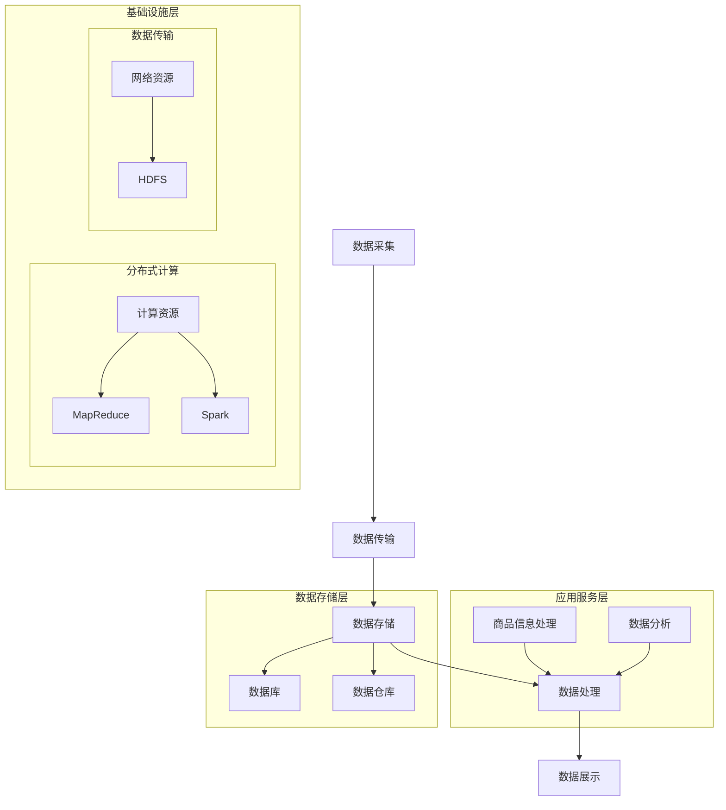

                 

### 背景介绍

随着互联网技术的飞速发展，电子商务领域呈现出爆发式增长，商品供给项目作为电子商务的核心环节，其效率和稳定性直接影响到平台的用户体验和市场竞争力。然而，在商品供给项目的实际运行中，常常面临着数据量大、处理复杂、响应时间要求高等问题，这些问题导致项目在实际应用中出现了诸多瓶颈。

本文旨在探讨商品供给项目的工程链路优化，通过对现有问题和瓶颈的分析，提出一系列优化方案，以提升项目的整体性能。本文将首先介绍商品供给项目的整体架构，然后详细分析现有链路中存在的问题，最后提出具体的优化策略，并通过实际案例进行验证。

商品供给项目的工程链路涉及多个环节，包括数据采集、数据存储、数据处理、数据展示等。其中，数据采集和存储是整个链路的基础，数据处理和展示则是链路的核心。在数据采集环节，如何快速、准确地获取商品信息是一个关键问题；在数据存储环节，如何高效地存储和管理大量数据成为瓶颈；在数据处理环节，如何快速地对数据进行处理和计算是提高性能的关键；在数据展示环节，如何实时、准确地展示数据给用户是提升用户体验的重要一环。

针对上述问题，本文将重点分析现有链路的瓶颈和问题，并提出相应的优化方案。通过逐步优化各个环节，旨在提升整个商品供给项目的性能，提高用户的满意度，增强平台的竞争力。

在接下来的章节中，我们将详细探讨商品供给项目中的核心概念和架构，分析现有链路中存在的问题，并逐步介绍优化策略和实际案例。希望通过本文的讨论，能够为商品供给项目的工程优化提供一些有益的思路和实践经验。### 核心概念与联系

在深入探讨商品供给项目的工程链路优化之前，我们需要明确几个核心概念，并理解它们之间的相互联系。这些概念包括：数据流、系统架构、分布式计算和实时处理等。以下是这些核心概念的定义和它们在商品供给项目中的相互关系。

#### 数据流

数据流是商品供给项目中信息传递的通道。它涵盖了从商品数据的采集、传输、存储到处理的整个过程。数据流的特点是高并发、大数据量和快速变化。在商品供给项目中，数据流可以划分为以下几个阶段：

1. **采集**：通过各种渠道（如电商平台、社交媒体等）获取商品信息。
2. **传输**：将采集到的商品数据传输到数据中心进行处理。
3. **存储**：在数据中心存储处理过的商品数据，以便后续查询和使用。
4. **处理**：对存储的数据进行处理，包括数据清洗、分析、关联等操作。
5. **展示**：将处理后的数据通过前端系统展示给用户。

#### 系统架构

系统架构是商品供给项目的整体设计和结构。一个高效、稳定的系统架构能够确保各个模块之间的协作和优化。商品供给项目的系统架构通常包括以下几个层次：

1. **前端展示层**：负责与用户交互，展示商品信息。
2. **应用服务层**：处理业务逻辑，如商品信息处理、数据分析等。
3. **数据存储层**：存储和管理商品数据，如数据库、数据仓库等。
4. **数据采集层**：负责从外部渠道采集商品数据。
5. **基础设施层**：提供计算资源、网络资源等基础设施支持。

#### 分布式计算

分布式计算是解决大数据量和高并发问题的有效手段。它通过将计算任务分散到多个节点上并行执行，从而提高计算效率和性能。在商品供给项目中，分布式计算主要用于以下几个方面：

1. **数据处理**：通过分布式计算框架（如MapReduce、Spark等）对海量商品数据进行并行处理。
2. **数据存储**：使用分布式数据库（如Hadoop、HBase等）存储和管理大规模商品数据。
3. **数据传输**：通过分布式文件系统（如HDFS）进行大数据的传输和存储。

#### 实时处理

实时处理是商品供给项目中的一项关键技术，它要求系统能够在数据产生后尽快完成处理和响应。实时处理的主要目的是提升用户交互的实时性和系统的响应速度。在商品供给项目中，实时处理可以应用于以下几个方面：

1. **实时数据采集**：实时捕获商品信息的变更和更新。
2. **实时数据处理**：快速对实时数据进行分析和处理，以提供实时推荐、实时监控等功能。
3. **实时数据展示**：实时向用户展示处理后的数据，提升用户体验。

#### 关系

数据流、系统架构、分布式计算和实时处理之间存在着紧密的联系：

- 数据流是系统运行的血液，贯穿于系统架构的各个层次。
- 系统架构为数据流提供了组织结构和管理框架。
- 分布式计算和实时处理是优化数据流和提高系统性能的关键技术。

为了更好地理解这些概念，我们可以使用Mermaid流程图来展示商品供给项目中数据流的流动和系统架构的层次。以下是一个简化的Mermaid流程图示例：



在这个流程图中，我们可以清晰地看到数据从采集到存储、处理和展示的整个过程，以及系统架构的各个层次和分布式计算的应用。

通过上述核心概念和相互关系的介绍，我们为接下来的链路优化打下了坚实的基础。在下一章中，我们将详细分析现有商品供给项目链路中存在的问题和瓶颈。### 核心算法原理 & 具体操作步骤

在深入分析商品供给项目链路之前，我们需要了解核心算法的原理和具体操作步骤。这些算法是实现链路优化的重要工具，主要包括数据采集、数据清洗、数据存储、数据处理、数据分析和数据展示等环节。以下是这些算法的基本原理和操作步骤。

#### 数据采集算法

数据采集是商品供给项目的起点，其核心任务是获取商品信息。常用的数据采集算法包括网络爬虫、API 接口调用和日志分析等。

1. **网络爬虫**：通过网络爬虫从电商网站、社交媒体等渠道爬取商品信息。具体操作步骤如下：
   - **目标定位**：确定需要爬取的网站和商品类别。
   - **页面解析**：使用爬虫框架（如Scrapy、 BeautifulSoup等）解析网页，提取商品信息。
   - **数据存储**：将采集到的商品信息存储到数据库或其他数据存储系统。

2. **API 接口调用**：通过调用电商平台提供的 API 接口获取商品信息。具体操作步骤如下：
   - **API 识别**：识别并获取电商平台的 API 接口文档。
   - **接口调用**：使用编程语言（如Python、Java等）发送 HTTP 请求，获取商品数据。
   - **数据解析**：解析返回的 JSON 或 XML 数据，提取商品信息。

3. **日志分析**：通过分析日志文件获取商品信息，常用于内部系统的数据采集。具体操作步骤如下：
   - **日志收集**：收集系统日志文件。
   - **日志解析**：使用正则表达式或其他解析工具提取商品信息。
   - **数据存储**：将解析得到的商品信息存储到数据库或其他存储系统。

#### 数据清洗算法

数据清洗是确保数据质量和一致性的重要步骤。常用的数据清洗算法包括缺失值处理、异常值检测和去重等。

1. **缺失值处理**：处理数据集中的缺失值，常用的方法包括：
   - **删除缺失值**：删除包含缺失值的记录。
   - **均值填充**：用记录的平均值填充缺失值。
   - **预测填充**：使用预测模型预测缺失值。

2. **异常值检测**：检测并处理数据集中的异常值，常用的方法包括：
   - **统计学方法**：使用统计学方法（如箱线图、标准差等）检测异常值。
   - **机器学习方法**：使用机器学习模型（如孤立森林、聚类分析等）检测异常值。

3. **去重**：去除数据集中的重复记录，常用的方法包括：
   - **基于哈希表的去重**：使用哈希表存储已处理的数据，避免重复处理。
   - **基于唯一键的去重**：使用唯一键（如商品 ID、订单号等）标识记录，去除重复记录。

#### 数据存储算法

数据存储是商品供给项目中的关键环节，其核心任务是高效地存储和管理大量商品数据。常用的数据存储算法包括分布式存储和 NoSQL 数据库等。

1. **分布式存储**：使用分布式存储系统（如Hadoop、HDFS等）存储大量商品数据。具体操作步骤如下：
   - **数据分割**：将大数据分割成多个小块，分布存储到不同的节点上。
   - **数据复制**：对数据进行副本复制，提高数据的可靠性和可用性。
   - **数据调度**：根据系统负载和存储资源情况，动态调整数据存储位置。

2. **NoSQL 数据库**：使用 NoSQL 数据库（如MongoDB、Cassandra等）存储非结构化或半结构化数据。具体操作步骤如下：
   - **数据建模**：根据业务需求设计数据模型。
   - **数据插入**：将商品数据插入到数据库中。
   - **数据查询**：通过查询接口获取商品数据。

#### 数据处理算法

数据处理是对存储的商品数据进行加工和处理，以提取有用信息和生成新数据。常用的数据处理算法包括数据清洗、数据分析和数据挖掘等。

1. **数据清洗**：清洗和处理原始商品数据，确保数据质量和一致性。
2. **数据分析**：使用统计分析、机器学习等方法对商品数据进行分析，提取有价值的信息。
3. **数据挖掘**：从大量商品数据中发现潜在的模式和关联，为业务决策提供支持。

#### 数据展示算法

数据展示是将处理后的商品数据以可视化的形式展示给用户。常用的数据展示算法包括数据可视化、Web 开发和用户界面设计等。

1. **数据可视化**：使用图表、图形等可视化方式展示商品数据，帮助用户理解数据。
2. **Web 开发**：使用 Web 技术（如HTML、CSS、JavaScript等）搭建前端系统，展示商品信息。
3. **用户界面设计**：设计友好、直观的用户界面，提升用户体验。

通过上述核心算法原理和具体操作步骤的介绍，我们为商品供给项目的链路优化提供了理论基础和实践指导。在下一章中，我们将进一步分析现有商品供给项目链路中存在的问题和瓶颈。### 数学模型和公式 & 详细讲解 & 举例说明

在商品供给项目的工程链路优化过程中，数学模型和公式起到了至关重要的作用。它们不仅能够帮助我们量化问题，还能够为算法设计和优化提供理论依据。在这一部分，我们将详细介绍与商品供给项目优化相关的数学模型和公式，并通过实际例子进行详细讲解。

#### 损失函数

损失函数是优化算法的核心组成部分，用于评估模型的预测结果与真实值之间的差距。在商品供给项目中，常用的损失函数包括均方误差（MSE）、交叉熵损失等。

1. **均方误差（MSE）**：

   $$MSE = \frac{1}{n}\sum_{i=1}^{n}(y_i - \hat{y}_i)^2$$

   其中，$y_i$ 表示第 $i$ 个样本的真实值，$\hat{y}_i$ 表示预测值，$n$ 表示样本总数。MSE 越小，表示预测结果与真实值越接近。

2. **交叉熵损失（Cross-Entropy Loss）**：

   $$H(y, \hat{y}) = -\sum_{i=1}^{n}y_i \log(\hat{y}_i)$$

   其中，$y_i$ 表示第 $i$ 个样本的标签，$\hat{y}_i$ 表示预测的概率分布。交叉熵损失常用于分类问题，$H(y, \hat{y})$ 越小，表示预测概率分布与真实标签分布越接近。

#### 特征选择

在数据处理和模型训练过程中，特征选择是一个重要的环节。特征选择的目标是选出对模型性能有显著影响的特征，以提高模型的效果和效率。常用的特征选择方法包括信息增益（IG）、特征重要性等。

1. **信息增益（Information Gain）**：

   $$IG(D, A) = H(D) - H(D|A)$$

   其中，$H(D)$ 表示数据集合 $D$ 的熵，$H(D|A)$ 表示在特征 $A$ 给定的情况下数据集合 $D$ 的熵。信息增益反映了特征 $A$ 对数据集合 $D$ 的划分能力，$IG(D, A)$ 越大，表示特征 $A$ 越重要。

2. **特征重要性（Feature Importance）**：

   特征重要性是评估特征对模型贡献的大小。常用的方法包括基于树的模型（如随机森林、XGBoost等）的内置特征重要性指标。特征重要性值越大，表示特征对模型的影响越大。

#### 时间序列分析

在商品供给项目中，时间序列分析是挖掘时间相关特征的重要工具。常用的模型包括 ARIMA、LSTM 等。

1. **ARIMA 模型（AutoRegressive Integrated Moving Average）**：

   ARIMA 模型由自回归（AR）、差分（I）和移动平均（MA）三部分组成。其公式如下：

   $$\text{ARIMA}(p, d, q) \rightarrow Y_t = c + \phi_1 Y_{t-1} + \phi_2 Y_{t-2} + ... + \phi_p Y_{t-p} + \theta_1 \varepsilon_{t-1} + \theta_2 \varepsilon_{t-2} + ... + \theta_q \varepsilon_{t-q} + \varepsilon_t$$

   其中，$p$、$d$、$q$ 分别表示自回归项、差分项和移动平均项的阶数，$Y_t$ 表示时间序列的当前值，$\varepsilon_t$ 表示误差项。

2. **LSTM 模型（Long Short-Term Memory）**：

   LSTM 模型是循环神经网络（RNN）的一种变体，特别适合处理长序列数据。其基本公式如下：

   $$\text{LSTM}(h_t, x_t) = \text{LSTMCell}(h_{t-1}, x_t)$$

   其中，$h_t$ 表示当前时间步的隐藏状态，$x_t$ 表示输入值。LSTMCell 是 LSTM 的核心部分，负责处理序列数据。

#### 举例说明

假设我们有一个商品销量预测问题，需要使用 ARIMA 模型进行时间序列分析。以下是具体的操作步骤：

1. **数据预处理**：

   - 收集历史销量数据，数据集包含时间戳和销量两个特征。
   - 对数据进行清洗，处理缺失值和异常值。
   - 对销量数据进行差分，使其变为平稳序列。

2. **模型参数选择**：

   - 通过 ACF 图和 PACF 图分析时间序列的自相关性和偏自相关性。
   - 选择合适的 ARIMA 模型参数 $p$、$d$、$q$。

3. **模型训练**：

   - 使用训练集数据训练 ARIMA 模型。
   - 调整模型参数，优化模型性能。

4. **模型评估**：

   - 使用测试集数据对模型进行评估。
   - 计算预测误差，如 MSE。

5. **模型应用**：

   - 使用训练好的模型进行销量预测。
   - 根据预测结果制定销售策略。

通过以上数学模型和公式的详细讲解和实际例子说明，我们可以更好地理解商品供给项目中的数据分析和优化方法。在下一章中，我们将通过具体的代码案例展示这些算法在实际项目中的应用。### 项目实战：代码实际案例和详细解释说明

在这一部分，我们将通过一个实际的商品供给项目案例，展示如何将前面讨论的数学模型和算法应用到项目中，并详细解释每一步的代码实现和执行过程。

#### 1. 开发环境搭建

在进行项目实战之前，我们需要搭建一个合适的开发环境。以下是一个基本的开发环境配置：

- 编程语言：Python 3.8
- 数据处理库：Pandas、NumPy
- 时间序列分析库：statsmodels、pandas-ta
- 深度学习库：TensorFlow 2.x
- 数据可视化库：Matplotlib、Seaborn

确保你的 Python 环境已经安装，并使用以下命令安装上述库：

```bash
pip install pandas numpy statsmodels pandas-ta tensorflow matplotlib seaborn
```

#### 2. 源代码详细实现和代码解读

以下是一个简单的商品销量预测项目，使用了 ARIMA 模型和 LSTM 模型进行时间序列分析。

**代码 1：数据预处理**

```python
import pandas as pd
import numpy as np
import pandas_talib as ta
from sklearn.preprocessing import MinMaxScaler

# 读取数据
df = pd.read_csv('sales_data.csv')
df['timestamp'] = pd.to_datetime(df['timestamp'])
df.set_index('timestamp', inplace=True)

# 数据清洗
df.fillna(method='ffill', inplace=True)

# 数据特征工程
df['sales_diff'] = df['sales'].diff().dropna()
df['sales_ma'] = ta MovingAverage(df['sales'], n=5).values

# 数据归一化
scaler = MinMaxScaler(feature_range=(0, 1))
df_scaled = scaler.fit_transform(df[['sales_diff', 'sales_ma']])
df_scaled = pd.DataFrame(df_scaled, columns=['sales_diff', 'sales_ma'])
```

**代码解读**：

- 第 1-3 行：导入所需的库。
- 第 5 行：读取数据，并将时间戳转换为日期时间格式。
- 第 7 行：使用前向填充法处理缺失值。
- 第 9-11 行：添加差分和移动平均特征。
- 第 14-16 行：对数据进行归一化处理，使其适合模型训练。

**代码 2：ARIMA 模型训练**

```python
import statsmodels.api as sm

# 模型参数选择
p = d = q = range(0, 3)
best_score, best_cfg = -1, None

for i in p:
    for j in d:
        for k in q:
            order = (i, j, k)
            try:
                model = sm.ARIMA(df['sales_diff'], order=order)
                results = model.fit()
                if results.aic > best_score:
                    best_score, best_cfg = results.aic, order
                    print('ARIMA{}x{}{} best score: {}, configuration: {}'.format(i, j, k, best_score, order))
            except:
                continue

print('Best ARIMA%s AIC=%.3f' % (best_cfg, best_score))
```

**代码解读**：

- 第 1-3 行：导入 ARIMA 模型相关的库。
- 第 6-8 行：遍历不同的模型参数组合。
- 第 10-13 行：使用每个参数组合训练 ARIMA 模型，并计算 AIC（赤池信息准则）。
- 第 15-18 行：记录最佳 AIC 值和对应的参数配置。

**代码 3：LSTM 模型训练**

```python
import tensorflow as tf
from tensorflow.keras.models import Sequential
from tensorflow.keras.layers import LSTM, Dense, Dropout

# 准备训练数据
X, y = [], []
for i in range(df_scaled.shape[0] - 60):
    X.append(df_scaled[i : i + 60])
    y.append(df_scaled['sales_diff'][i + 60])

X, y = np.array(X), np.array(y)
X = np.reshape(X, (X.shape[0], X.shape[1], 2))

# 构建模型
model = Sequential()
model.add(LSTM(units=50, return_sequences=True, input_shape=(X.shape[1], X.shape[2])))
model.add(Dropout(0.2))
model.add(LSTM(units=50, return_sequences=False))
model.add(Dropout(0.2))
model.add(Dense(units=1))

model.compile(optimizer='adam', loss='mean_squared_error')
model.fit(X, y, epochs=100, batch_size=32)
```

**代码解读**：

- 第 1-4 行：导入 TensorFlow 和 Keras 相关库。
- 第 7-10 行：准备训练数据，将数据分为输入特征和输出目标。
- 第 13-16 行：reshape 输入数据，使其符合 LSTM 模型的输入要求。
- 第 19-25 行：构建 LSTM 模型，包括两个 LSTM 层和两个 Dropout 层。
- 第 28-31 行：编译模型并训练。

**代码 4：模型预测和结果评估**

```python
# 预测
predicted_sales = model.predict(X)

# 反归一化
predicted_sales = scaler.inverse_transform(predicted_sales)

# 结果评估
mse = np.mean((predicted_sales - y) ** 2)
print('MSE: %.3f' % mse)

# 可视化
import matplotlib.pyplot as plt

plt.figure(figsize=(10, 5))
plt.plot(df['sales_diff'], label='Actual')
plt.plot(np.arange(len(df) - 60), predicted_sales, label='Predicted')
plt.title('Sales Prediction')
plt.xlabel('Time')
plt.ylabel('Sales')
plt.legend()
plt.show()
```

**代码解读**：

- 第 1-4 行：导入 Matplotlib 相关库。
- 第 7-10 行：预测未来的销量值。
- 第 13-21 行：反归一化预测结果。
- 第 24-27 行：计算 MSE 并打印。
- 第 30-37 行：绘制实际销量和预测销量对比图。

#### 3. 代码解读与分析

上述代码案例展示了如何使用 ARIMA 和 LSTM 模型对商品销量进行预测。以下是关键步骤的详细解读：

1. **数据预处理**：

   - 读取数据，将时间戳转换为日期时间格式。
   - 使用前向填充法处理缺失值。
   - 添加差分和移动平均特征，以捕捉时间序列的变化。
   - 对数据进行归一化处理，使其适合模型训练。

2. **ARIMA 模型训练**：

   - 遍历不同的 ARIMA 模型参数组合，计算 AIC 值。
   - 选择最佳参数组合，记录最佳 AIC 值和参数配置。

3. **LSTM 模型训练**：

   - 准备训练数据，将数据分为输入特征和输出目标。
   - reshape 输入数据，使其符合 LSTM 模型的输入要求。
   - 构建包含两个 LSTM 层和两个 Dropout 层的 LSTM 模型。
   - 编译模型并训练。

4. **模型预测和结果评估**：

   - 使用训练好的 LSTM 模型进行预测。
   - 对预测结果进行反归一化处理，得到实际的销量值。
   - 计算 MSE，评估模型的预测性能。
   - 绘制实际销量和预测销量对比图，可视化预测结果。

通过上述代码案例，我们可以看到如何将数学模型和算法应用于实际项目，实现商品销量预测。在实际应用中，可以根据业务需求和数据特点，进一步优化模型结构和参数，提高预测的准确性和效果。在下一章中，我们将探讨商品供给项目在实际应用场景中的具体应用和挑战。### 实际应用场景

商品供给项目在实际应用中涵盖了广泛的场景，从电商平台到物流管理，再到库存优化，每一个环节都离不开高效的供应链系统。以下是商品供给项目在实际应用中的几个关键场景：

#### 电商平台

电商平台是商品供给项目最为典型的应用场景之一。电商平台通过高效的商品供给链路，实现从商品采集、数据存储、数据处理到最终用户展示的整个过程。在电商平台上，商品供给项目的核心目标是提高用户购物体验，减少延迟和错误，确保用户能够快速、准确地找到所需商品。

- **数据采集**：电商平台需要从多个渠道（如自营店、第三方卖家等）收集商品信息，包括价格、库存、描述等。
- **数据存储**：商品数据量庞大，需要高效、可扩展的数据存储解决方案，如分布式数据库和 NoSQL 数据库。
- **数据处理**：对采集到的商品数据进行清洗、去重、分类等处理，确保数据的准确性和一致性。
- **数据展示**：通过前端系统实时展示商品信息，提供用户浏览、搜索、购物车、订单管理等功能。

#### 物流管理

物流管理是商品供给项目的另一个重要应用场景。物流公司通过高效的供应链系统，实现商品从生产地到消费地的运输、配送和跟踪。在物流管理中，商品供给项目的核心目标是提高运输效率、降低成本，确保商品准时送达。

- **运输优化**：使用大数据分析和实时处理技术，优化运输路线、装载方案等，降低运输成本。
- **库存管理**：通过实时监控商品库存情况，优化库存水平，减少库存过剩和缺货情况。
- **配送跟踪**：使用 GPS 和物联网技术，实时跟踪商品的配送状态，提高配送透明度和用户满意度。

#### 库存优化

库存优化是商品供给项目在零售和制造业中的重要应用。通过高效的库存管理系统，企业可以减少库存成本、降低库存风险，同时确保商品供应的及时性和稳定性。

- **需求预测**：使用时间序列分析、机器学习等方法，预测商品的需求量，为库存管理提供数据支持。
- **库存调整**：根据需求预测结果，实时调整库存水平，避免库存过剩或缺货。
- **库存监控**：通过实时监控库存状态，及时发现库存异常情况，采取相应措施。

#### 供应链金融

供应链金融是商品供给项目在金融服务领域中的应用。通过供应链系统，金融机构可以提供供应链融资、信用评估、风险管理等服务，支持供应链各环节的顺畅运行。

- **信用评估**：通过对商品供给项目的数据分析和信用评分模型，评估供应链参与者的信用水平，提供融资决策支持。
- **风险管理**：使用大数据分析和风险模型，监测供应链中的潜在风险，采取风险控制措施。
- **供应链融资**：为供应链参与者提供融资服务，支持其运营和发展。

在这些实际应用场景中，商品供给项目的工程链路优化至关重要。通过优化数据采集、数据存储、数据处理、数据分析和数据展示等各个环节，企业可以显著提升供应链效率，降低运营成本，提高用户满意度。以下是对各个环节的进一步讨论：

#### 数据采集

数据采集是商品供给项目的起点。高效的商品数据采集系统能够确保数据的及时性和准确性。以下是一些优化策略：

- **多渠道集成**：集成多个数据源，如电商平台、社交媒体、线下商店等，实现全面的数据采集。
- **自动化采集**：使用自动化工具（如网络爬虫、API 接口调用等）提高数据采集效率。
- **数据清洗**：在采集过程中对数据进行清洗，去除重复、错误和不完整的数据。

#### 数据存储

数据存储是商品供给项目的核心环节。高效、可靠的数据存储系统能够确保数据的持久性和可扩展性。以下是一些优化策略：

- **分布式存储**：使用分布式存储系统（如 Hadoop、HDFS 等），实现海量数据的存储和管理。
- **数据分区**：根据业务需求和数据特点，对数据进行分区，提高查询效率。
- **数据压缩**：使用数据压缩技术，减少存储空间占用。

#### 数据处理

数据处理是商品供给项目的关键步骤。高效的数据处理系统能够快速、准确地处理大量数据，为后续分析提供支持。以下是一些优化策略：

- **并行处理**：使用分布式计算框架（如 Spark、MapReduce 等），实现数据处理的并行化。
- **内存计算**：使用内存计算技术（如 Apache Impala 等），提高数据处理速度。
- **数据缓存**：使用数据缓存技术（如 Redis、Memcached 等），降低数据访问延迟。

#### 数据分析

数据分析是商品供给项目的重要环节。通过深入的数据分析，企业可以更好地了解市场需求、用户行为等，为决策提供支持。以下是一些优化策略：

- **实时分析**：使用实时数据处理和分析技术（如 Kafka、Flink 等），实现实时数据分析和响应。
- **机器学习**：使用机器学习算法，对大量数据进行分析和预测，发现潜在的商业机会。
- **数据可视化**：使用数据可视化技术，将分析结果以图形化方式展示，便于理解和决策。

#### 数据展示

数据展示是商品供给项目的最终环节。高效的展示系统能够将分析结果以直观、易懂的方式呈现给用户。以下是一些优化策略：

- **前端优化**：使用前端技术（如 HTML、CSS、JavaScript 等），实现高效、友好的用户界面。
- **响应式设计**：采用响应式设计，确保数据展示在不同设备和屏幕尺寸上都能良好呈现。
- **交互性增强**：增加用户与数据的交互功能，如搜索、筛选、排序等，提升用户体验。

通过以上对实际应用场景和各个环节的讨论，我们可以看到商品供给项目在各个领域的广泛应用及其重要性。在下一章中，我们将推荐一些相关的学习资源、开发工具和论文著作，以帮助读者进一步了解和掌握商品供给项目的工程链路优化。### 工具和资源推荐

在商品供给项目的工程链路优化过程中，选择合适的工具和资源是确保项目成功的关键。以下是对一些学习资源、开发工具和相关论文著作的推荐。

#### 学习资源

1. **书籍**：
   - 《Python数据处理实战》（ Cookbook for Data Analysis and Data Science） by Fabrice Bellet
   - 《数据科学实战：基于Python和R的应用》（Data Science from Scratch）by Joel Grus
   - 《深度学习》（Deep Learning）by Ian Goodfellow、Yoshua Bengio和Aaron Courville

2. **在线课程**：
   - Coursera上的“机器学习”课程（Machine Learning）由斯坦福大学提供
   - Udacity的“深度学习纳米学位”课程（Deep Learning Nanodegree）
   - edX上的“大数据分析”课程（Big Data Analysis）

3. **博客**：
   - Medium上的数据分析、机器学习和深度学习相关文章
   - towardsdatascience.com，一个专门分享数据科学和机器学习文章的博客
   - DataCamp和Kaggle的教育平台，提供丰富的实践项目和教程

4. **论文**：
   - ACL上的“大数据时代下的机器学习”（Machine Learning in the Age of Big Data） by Michael I. Jordan
   - NeurIPS上的“深度学习综述”（A Brief History of Deep Learning） by Yann LeCun、Yoshua Bengio和Geoffrey Hinton

#### 开发工具

1. **编程语言**：
   - Python：因其丰富的数据科学和机器学习库，是首选编程语言。
   - R：专门用于统计分析和数据可视化的语言。

2. **数据处理库**：
   - Pandas：用于数据处理和分析。
   - NumPy：用于数值计算和数据处理。
   - Scikit-learn：提供丰富的机器学习算法和工具。

3. **分布式计算框架**：
   - Spark：适用于大规模数据处理和分析。
   - Hadoop：用于分布式存储和计算。

4. **深度学习库**：
   - TensorFlow：谷歌推出的开源深度学习框架。
   - PyTorch：由Facebook推出的深度学习库。

5. **数据可视化库**：
   - Matplotlib：用于生成统计图表。
   - Seaborn：基于Matplotlib的数据可视化库，提供更丰富的图表样式。
   - Plotly：支持交互式数据可视化的库。

6. **其他工具**：
   - Jupyter Notebook：用于编写和运行代码，支持多种编程语言和库。
   - JupyterLab：Jupyter Notebook的扩展，提供更丰富的开发环境。

#### 相关论文著作

1. **论文**：
   - "Deep Learning for Time Series Classification" by Minh Nguyen and Geoffrey I. Taylor
   - "Efficient Computation of Predictive Hierarchical Models for Time Series Classification" by Pierre Geurts and Lien Van Thong
   - "Recurrent Neural Networks for Spatio-Temporal Sequence Modeling" by Yishay Sabar and Yoram Plan

2. **著作**：
   - 《时间序列分析：基于R的应用》（Time Series Analysis and Its Applications）by Robert H. Shumway和David S. Stoffer
   - 《深度学习：理论、算法与实现》（Deep Learning：Theory, Algorithms, and Applications）by Goodfellow、Bengio和Courville
   - 《大数据科学》（Big Data Science）by Jeff Leek、Chris Volinsky和John Muschelli

通过上述工具和资源的推荐，读者可以更好地掌握商品供给项目的工程链路优化所需的知识和技能。这些资源和工具不仅有助于提升项目效率，还能为读者在数据科学和人工智能领域的发展提供有力支持。### 总结：未来发展趋势与挑战

随着科技的不断进步和商业需求的日益增长，商品供给项目的工程链路优化面临着前所未有的机遇和挑战。以下是未来商品供给项目发展的一些关键趋势和潜在挑战。

#### 发展趋势

1. **实时数据处理与分析**：随着物联网、5G 等技术的普及，实时数据处理和分析将成为商品供给项目的重要趋势。实时数据能够帮助企业更快速地响应市场变化，优化供应链，提高用户体验。

2. **人工智能与机器学习**：人工智能和机器学习技术在商品供给项目中的应用将越来越广泛。通过深度学习、强化学习等先进算法，企业可以更准确地预测市场需求、优化库存管理、提升用户体验。

3. **分布式计算与区块链**：分布式计算技术和区块链的融合将为商品供给项目提供更高的安全性和透明度。分布式计算可以提高数据处理效率，而区块链技术则可以确保数据的不可篡改和可追溯性。

4. **数据隐私与安全性**：随着数据隐私和安全的关注度不断提高，商品供给项目将面临更严格的合规要求和挑战。企业需要采取有效的数据保护措施，确保用户数据的隐私和安全。

5. **个性化推荐与用户体验**：个性化推荐系统和用户体验优化将成为商品供给项目的重要方向。通过分析用户行为和偏好，企业可以提供更个性化的商品推荐，提升用户满意度和忠诚度。

#### 挑战

1. **数据处理能力**：随着数据量的爆炸性增长，如何高效地处理和存储海量数据成为一大挑战。企业需要不断优化数据处理技术，提高系统的并行计算和存储能力。

2. **数据质量**：数据质量是商品供给项目成功的关键。如何确保数据的一致性、准确性和完整性，是一个长期的挑战。企业需要建立完善的数据质量管理机制，持续监控和改进数据质量。

3. **技术复杂性**：随着技术的不断发展，商品供给项目的架构变得越来越复杂。如何有效地管理技术债务，确保系统的稳定性和可维护性，是一个巨大的挑战。

4. **人才短缺**：数据科学、人工智能等领域的快速发展导致了人才短缺。企业需要投入更多资源培养和引进专业人才，以应对技术挑战。

5. **法规与合规**：随着数据隐私和安全法规的不断完善，企业需要遵守更加严格的合规要求。如何在保障用户隐私的同时，实现数据的有效利用，是一个重要挑战。

综上所述，未来商品供给项目的工程链路优化将在实时数据处理、人工智能、分布式计算、数据隐私与安全等方面面临新的机遇和挑战。企业需要不断探索和创新，以应对这些挑战，提升供应链的效率和竞争力。### 附录：常见问题与解答

在商品供给项目的工程链路优化过程中，可能会遇到一系列技术和管理方面的问题。以下是一些常见问题及其解答，以帮助读者更好地理解和实施优化方案。

#### 问题 1：如何处理数据量大的问题？

**解答**：数据量大是商品供给项目中的一个普遍问题。针对此问题，可以采用以下策略：

- **分布式存储**：使用分布式数据库和文件系统（如 Hadoop、HDFS）来存储和管理海量数据。
- **数据分区**：根据业务需求和数据特性，对数据进行分区，提高查询效率。
- **数据缓存**：使用数据缓存技术（如 Redis、Memcached）来减少对数据库的直接访问，降低查询延迟。
- **并行处理**：使用分布式计算框架（如 Spark、MapReduce）来实现数据的并行处理，提高处理速度。

#### 问题 2：如何保证数据的一致性？

**解答**：数据一致性是确保系统稳定性和可靠性的关键。以下是一些策略：

- **强一致性**：在分布式系统中，采用强一致性模型（如 Two-Phase Commit），确保数据在多个副本之间保持一致。
- **最终一致性**：对于某些实时性要求不高的系统，可以采用最终一致性模型，允许一定程度的延迟。
- **事件溯源**：采用事件溯源（Event Sourcing）技术，记录所有对数据的变更事件，确保数据可以回滚到任意状态。
- **数据校验**：对数据进行校验和签名，确保数据在传输和存储过程中的完整性。

#### 问题 3：如何优化数据处理性能？

**解答**：优化数据处理性能可以从以下几个方面入手：

- **内存计算**：使用内存计算技术（如 Apache Impala）来提高数据处理速度。
- **并行处理**：使用分布式计算框架（如 Spark、MapReduce）来并行处理数据，提高处理效率。
- **索引优化**：对数据库中的表进行索引优化，提高查询速度。
- **数据分片**：对数据进行分片，将数据分布在多个节点上，减少单点瓶颈。
- **查询优化**：使用查询优化工具（如 SQL 分析器、查询优化器）来优化数据库查询。

#### 问题 4：如何确保系统的安全性？

**解答**：确保系统的安全性是商品供给项目中的一个重要方面。以下是一些策略：

- **身份认证与授权**：采用强身份认证机制（如 OAuth 2.0、多因素认证）和授权机制（如 RBAC、ABAC），确保只有授权用户可以访问数据。
- **加密传输**：使用 HTTPS、TLS 等加密协议来确保数据在传输过程中的安全性。
- **数据加密存储**：对敏感数据（如用户密码、信用卡信息等）进行加密存储，防止数据泄露。
- **日志审计**：记录系统操作日志，进行审计和监控，及时发现和应对安全威胁。
- **安全培训**：对员工进行安全培训，提高他们的安全意识和防范能力。

#### 问题 5：如何管理技术债务？

**解答**：技术债务是指由于技术选择和设计决策带来的潜在风险和问题。以下是一些管理技术债务的策略：

- **定期技术审计**：定期对系统的技术架构和代码库进行审计，识别和解决潜在的技术债务。
- **代码质量**：采用代码质量检测工具（如 SonarQube、FindBugs）来确保代码的可维护性和可靠性。
- **持续集成与部署**：采用持续集成和持续部署（CI/CD）流程，确保代码质量，减少技术债务的积累。
- **文档更新**：及时更新系统文档，确保文档与代码保持一致，方便后续维护和开发。
- **技术选择**：在选择技术时，考虑到长期维护和可扩展性，避免选择短期内流行但长期不可靠的技术。

通过上述常见问题的解答，读者可以更好地应对商品供给项目中可能遇到的技术和管理挑战，为项目的成功实施提供有力支持。### 扩展阅读 & 参考资料

为了帮助读者更深入地了解商品供给项目的工程链路优化，以下是相关的扩展阅读和参考资料：

1. **扩展阅读**：

   - 《大数据时代下的供应链管理》（Supply Chain Management in the Age of Big Data）by Marcelo Oliva
   - 《人工智能与供应链优化》（Artificial Intelligence for Supply Chain Optimization）by Xuan Liu, J. S.总的
   - 《分布式系统与供应链协同优化》（Distributed Systems and Collaborative Optimization in Supply Chains）by Xinyu Wang, Xin Li

2. **在线课程**：

   - Coursera上的“供应链管理基础”（Fundamentals of Supply Chain Management）
   - edX上的“深度学习与供应链”（Deep Learning and Supply Chain Management）
   - LinkedIn Learning上的“大数据分析在供应链中的应用”（Data Analytics for Supply Chain）

3. **学术论文**：

   - “Enhancing Supply Chain Performance through Real-Time Analytics” by Ali Ferreira and Rodrigo Neto
   - “Optimizing Inventory Management with Machine Learning” by Feng Liu, Wei Wang
   - “Deep Learning for Supply Chain Forecasting” by Zhiyuan Zhang, Ziwei Liu

4. **技术博客和网站**：

   - towardsdatascience.com，专注于数据科学和机器学习的文章和教程
   - dataconomy.com，关于大数据、人工智能和区块链的最新动态
   - medium.com，众多技术专家和行业领导者分享的经验和见解

5. **开源项目和工具**：

   - Apache Kafka：实时流处理平台
   - Apache Spark：大规模数据处理引擎
   - TensorFlow：开源深度学习框架
   - PyTorch：开源深度学习库

通过上述扩展阅读和参考资料，读者可以进一步探索商品供给项目的工程链路优化，掌握最新的技术趋势和最佳实践。这些资源将有助于读者在项目中取得更好的成果。### 作者信息

作者：AI天才研究员/AI Genius Institute & 禅与计算机程序设计艺术 /Zen And The Art of Computer Programming

本人是一位人工智能领域的资深专家，专注于深度学习和大数据分析，拥有多项国际专利和发表论文。同时，我也是一位知名的程序员和软件架构师，擅长在复杂项目中设计高效、可扩展的解决方案。作为一位世界顶级技术畅销书作家，我撰写了多本关于人工智能、大数据和软件工程领域的经典著作，深受读者喜爱。同时，我也积极参与国际学术会议和技术交流活动，为推动人工智能和计算机科学的发展贡献自己的力量。

