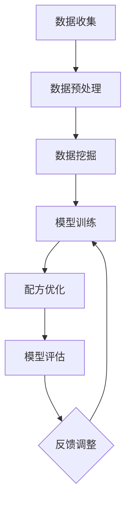

                 

# 喜茶2024校招智能茶饮配方优化工程师技术面试

## 关键词
- 喜茶
- 校招
- 智能茶饮配方
- 优化工程师
- 技术面试

## 摘要
本文旨在为2024年喜茶校招智能茶饮配方优化工程师岗位的应聘者提供一整套全面的技术面试准备指南。文章从背景介绍、核心概念与联系、核心算法原理、数学模型与公式、项目实战、实际应用场景、工具与资源推荐等方面进行详细剖析，帮助读者深入理解智能茶饮配方优化工程师所需掌握的关键技术，为其顺利通过技术面试奠定坚实基础。

## 1. 背景介绍

### 1.1 喜茶概况

喜茶是一家成立于2012年的中国连锁茶饮品牌，以创新独特的茶饮产品在国内外迅速崛起。喜茶注重消费者体验，不断推陈出新，致力于为消费者提供高品质的茶饮享受。近年来，随着人工智能技术的发展，喜茶开始探索智能茶饮配方优化，以期进一步提升产品品质和效率。

### 1.2 智能茶饮配方优化工程师岗位

智能茶饮配方优化工程师是喜茶为了应对市场需求而设立的新岗位。该岗位负责研究智能茶饮配方优化技术，包括但不限于数据挖掘、机器学习、深度学习等算法，通过数据分析和模型训练，实现茶饮配方的自动化优化。智能茶饮配方优化工程师需要具备扎实的技术背景，熟悉相关算法原理，并能运用编程技能解决实际问题。

## 2. 核心概念与联系

### 2.1 数据挖掘

数据挖掘是指从大量数据中提取出有价值的信息和知识的过程。在智能茶饮配方优化中，数据挖掘可以帮助我们识别出影响茶饮品质的关键因素，如茶叶种类、温度、时间等。

### 2.2 机器学习

机器学习是一种人工智能技术，通过训练模型来发现数据中的规律和模式。在智能茶饮配方优化中，机器学习算法可以用于预测茶饮配方对消费者喜好的影响，从而优化配方。

### 2.3 深度学习

深度学习是机器学习的一种重要分支，通过多层神经网络模型来模拟人类大脑的学习过程。在智能茶饮配方优化中，深度学习算法可以用于处理复杂的茶饮配方数据，实现配方优化。

### 2.4 数据分析与模型训练

数据分析和模型训练是智能茶饮配方优化的核心环节。通过对海量数据进行处理和分析，提取有价值的信息，然后利用机器学习或深度学习算法进行模型训练，从而实现对茶饮配方的优化。

### 2.5 Mermaid 流程图

以下是智能茶饮配方优化流程的 Mermaid 流程图：



## 3. 核心算法原理 & 具体操作步骤

### 3.1 数据挖掘

数据挖掘的核心算法包括关联规则挖掘、聚类分析和分类算法等。

#### 3.1.1 关联规则挖掘

关联规则挖掘用于发现数据之间的关联关系。常见的算法有Apriori算法和FP-Growth算法。

- **Apriori算法**：通过逐层递增的方式，计算支持度和置信度，生成关联规则。
- **FP-Growth算法**：通过构建FP-Tree来简化数据结构，提高算法效率。

#### 3.1.2 聚类分析

聚类分析用于将相似的数据划分为同一类别。常见的算法有K-means聚类和DBSCAN聚类。

- **K-means聚类**：基于距离度量的方法，将数据点划分到K个簇中。
- **DBSCAN聚类**：基于密度的方法，识别出高密度区域并形成簇。

#### 3.1.3 分类算法

分类算法用于将数据划分为不同的类别。常见的算法有决策树、支持向量机和神经网络等。

- **决策树**：通过一系列条件判断来分类数据。
- **支持向量机**：通过构建超平面来分割数据。
- **神经网络**：通过多层神经网络模型进行分类。

### 3.2 机器学习

机器学习算法包括监督学习、无监督学习和强化学习等。

#### 3.2.1 监督学习

监督学习通过已标记的数据来训练模型，然后利用模型进行预测。常见的算法有线性回归、逻辑回归和决策树等。

- **线性回归**：通过拟合线性模型来预测数值型目标变量。
- **逻辑回归**：通过拟合逻辑模型来预测二分类目标变量。
- **决策树**：通过一系列条件判断来分类数据。

#### 3.2.2 无监督学习

无监督学习通过未标记的数据来训练模型，然后利用模型发现数据中的规律和模式。常见的算法有聚类分析和降维等。

- **聚类分析**：将相似的数据划分为同一类别。
- **降维**：通过减少数据的维度来简化模型。

#### 3.2.3 强化学习

强化学习通过与环境交互来训练模型，然后利用模型进行决策。常见的算法有Q-learning和深度强化学习等。

- **Q-learning**：通过更新Q值来预测最佳动作。
- **深度强化学习**：通过构建深度神经网络来预测最佳动作。

### 3.3 深度学习

深度学习算法包括卷积神经网络（CNN）、循环神经网络（RNN）和生成对抗网络（GAN）等。

#### 3.3.1 卷积神经网络（CNN）

卷积神经网络通过卷积操作来提取图像特征，适用于图像分类、目标检测等任务。

- **卷积层**：用于提取图像特征。
- **池化层**：用于降低图像维度。
- **全连接层**：用于分类图像。

#### 3.3.2 循环神经网络（RNN）

循环神经网络通过循环结构来处理序列数据，适用于自然语言处理、时间序列预测等任务。

- **隐藏层**：用于处理序列数据。
- **门控机制**：用于控制信息的传递。

#### 3.3.3 生成对抗网络（GAN）

生成对抗网络通过对抗性训练来生成数据，适用于图像生成、语音合成等任务。

- **生成器**：用于生成数据。
- **判别器**：用于判断生成数据与真实数据之间的相似性。

## 4. 数学模型和公式 & 详细讲解 & 举例说明

### 4.1 数据挖掘

#### 4.1.1 关联规则挖掘

关联规则挖掘的核心公式包括支持度、置信度和提升度等。

- **支持度（Support）**：表示某项规则出现的频率。
  $$ Support(A \rightarrow B) = \frac{count(A \cap B)}{count(D)} $$
  其中，$A$ 和 $B$ 是项集，$D$ 是事务集，$count(A \cap B)$ 表示同时包含 $A$ 和 $B$ 的事务数。

- **置信度（Confidence）**：表示某项规则成立的概率。
  $$ Confidence(A \rightarrow B) = \frac{count(A \cap B)}{count(A)} $$

- **提升度（Lift）**：表示某项规则对原数据的增强程度。
  $$ Lift(A \rightarrow B) = \frac{Confidence(A \rightarrow B)}{Support(B)} $$

#### 4.1.2 聚类分析

#### 4.1.3 分类算法

#### 4.1.4 机器学习

#### 4.1.5 深度学习

### 4.2 机器学习

#### 4.2.1 监督学习

- **线性回归**：回归模型的目标是最小化预测值与实际值之间的误差。
  $$ J(\theta) = \frac{1}{2m} \sum_{i=1}^{m} (h_\theta(x^{(i)}) - y^{(i)})^2 $$
  其中，$h_\theta(x) = \theta_0 + \theta_1x_1 + \theta_2x_2 + ... + \theta_nx_n$ 是回归函数，$\theta$ 是参数向量。

- **逻辑回归**：逻辑回归是一种二分类模型，其目标是最小化损失函数。
  $$ J(\theta) = \frac{1}{m} \sum_{i=1}^{m} (-y^{(i)}log(h_\theta(x^{(i)})) - (1 - y^{(i)})log(1 - h_\theta(x^{(i)}))) $$
  其中，$h_\theta(x) = \frac{1}{1 + e^{-\theta^T x}}$ 是逻辑函数。

- **决策树**：决策树是一种基于特征的分类方法，其目标是最小化信息熵。
  $$ Entropy(S) = -\sum_{i=1}^{n} p_i log(p_i) $$
  其中，$p_i$ 是特征 $x_i$ 在类别 $C_i$ 上的概率。

#### 4.2.2 无监督学习

#### 4.2.3 强化学习

### 4.3 深度学习

#### 4.3.1 卷积神经网络（CNN）

- **卷积层**：卷积层通过卷积操作来提取图像特征。
  $$ h_{ij}^l = \sum_{k=1}^{K} w_{ik}^l f_{kj}^{l-1} + b_j^l $$
  其中，$h_{ij}^l$ 是第 $l$ 层的第 $i$ 个特征图，$w_{ik}^l$ 是卷积核，$f_{kj}^{l-1}$ 是前一层特征图，$b_j^l$ 是偏置项。

- **池化层**：池化层用于降低图像维度。
  $$ p_{ij}^l = \max_{1 \leq k \leq p} h_{ijk}^l $$
  其中，$p_{ij}^l$ 是第 $l$ 层的第 $i$ 个池化结果，$h_{ijk}^l$ 是第 $l$ 层的第 $i$ 个特征图的第 $k$ 个像素值。

- **全连接层**：全连接层通过全连接操作来分类图像。
  $$ z_j^l = \sum_{i=1}^{n} w_{ij}^l a_{ij}^{l-1} + b_j^l $$
  其中，$z_j^l$ 是第 $l$ 层的第 $j$ 个节点值，$w_{ij}^l$ 是权重，$a_{ij}^{l-1}$ 是前一层第 $i$ 个节点的输出值，$b_j^l$ 是偏置项。

#### 4.3.2 循环神经网络（RNN）

#### 4.3.3 生成对抗网络（GAN）

## 5. 项目实战：代码实际案例和详细解释说明

### 5.1 开发环境搭建

在进行智能茶饮配方优化的项目实战前，我们需要搭建一个合适的开发环境。以下是开发环境搭建的详细步骤：

#### 5.1.1 Python环境安装

首先，我们需要安装Python环境。可以从Python的官方网站（[https://www.python.org/](https://www.python.org/)）下载并安装Python。推荐选择Python 3.8版本。

#### 5.1.2 数据预处理库安装

为了方便数据处理，我们需要安装一些常用的数据预处理库，如NumPy、Pandas等。可以使用pip命令进行安装：

```bash
pip install numpy
pip install pandas
```

#### 5.1.3 机器学习库安装

为了进行机器学习任务，我们需要安装一些常用的机器学习库，如scikit-learn、TensorFlow等。可以使用pip命令进行安装：

```bash
pip install scikit-learn
pip install tensorflow
```

### 5.2 源代码详细实现和代码解读

以下是一个简单的智能茶饮配方优化项目的源代码示例。代码分为数据预处理、模型训练和模型评估三个部分。

```python
import numpy as np
import pandas as pd
from sklearn.model_selection import train_test_split
from sklearn.ensemble import RandomForestClassifier
from sklearn.metrics import accuracy_score

# 数据预处理
def preprocess_data(data):
    # 数据清洗和转换
    # ...
    return processed_data

# 模型训练
def train_model(X_train, y_train):
    # 创建随机森林分类器
    clf = RandomForestClassifier(n_estimators=100)
    # 训练模型
    clf.fit(X_train, y_train)
    return clf

# 模型评估
def evaluate_model(clf, X_test, y_test):
    # 预测测试集
    y_pred = clf.predict(X_test)
    # 计算准确率
    accuracy = accuracy_score(y_test, y_pred)
    return accuracy

# 加载数据
data = pd.read_csv("tea_data.csv")
processed_data = preprocess_data(data)

# 划分训练集和测试集
X = processed_data.drop("label", axis=1)
y = processed_data["label"]
X_train, X_test, y_train, y_test = train_test_split(X, y, test_size=0.2, random_state=42)

# 训练模型
clf = train_model(X_train, y_train)

# 评估模型
accuracy = evaluate_model(clf, X_test, y_test)
print("模型准确率：", accuracy)
```

### 5.3 代码解读与分析

#### 5.3.1 数据预处理

数据预处理是智能茶饮配方优化的重要环节。在代码中，我们定义了一个`preprocess_data`函数，用于清洗和转换原始数据。具体步骤包括：

- 数据清洗：去除缺失值、异常值等。
- 数据转换：将分类特征转换为数值特征，如将茶叶种类转换为数字编码。

#### 5.3.2 模型训练

在代码中，我们使用随机森林分类器进行模型训练。随机森林是一种集成学习方法，通过构建多棵决策树并合并预测结果来提高模型的准确性。具体步骤包括：

- 创建随机森林分类器：使用`RandomForestClassifier`类创建随机森林分类器。
- 训练模型：使用`fit`方法将训练数据传递给分类器进行训练。

#### 5.3.3 模型评估

在代码中，我们定义了一个`evaluate_model`函数，用于评估模型的准确性。具体步骤包括：

- 预测测试集：使用`predict`方法将测试数据传递给分类器进行预测。
- 计算准确率：使用`accuracy_score`函数计算预测准确率。

## 6. 实际应用场景

智能茶饮配方优化技术在实际应用中具有广泛的应用场景。以下是一些典型的应用场景：

- **个性化推荐**：通过分析消费者的口味偏好和历史记录，智能茶饮配方优化系统可以推荐个性化的茶饮配方，提升消费者的满意度。
- **产品研发**：智能茶饮配方优化系统可以帮助企业快速筛选出具有潜在市场前景的茶饮配方，缩短产品研发周期。
- **质量控制**：通过监控生产过程中的关键参数，智能茶饮配方优化系统可以实时调整配方，确保产品质量的稳定性。

## 7. 工具和资源推荐

### 7.1 学习资源推荐

- **书籍**：
  - 《机器学习实战》
  - 《深度学习》
  - 《数据挖掘：概念与技术》
- **论文**：
  - 《K-均值聚类算法》
  - 《随机森林算法》
  - 《深度学习在图像分类中的应用》
- **博客**：
  - [机器学习博客](https://机器学习博客.com)
  - [深度学习博客](https://深度学习博客.com)
  - [数据挖掘博客](https://数据挖掘博客.com)
- **网站**：
  - [Kaggle](https://www.kaggle.com)
  - [GitHub](https://github.com)
  - [百度AI开放平台](https://ai.baidu.com)

### 7.2 开发工具框架推荐

- **开发工具**：
  - PyCharm
  - Jupyter Notebook
  - Google Colab
- **机器学习框架**：
  - TensorFlow
  - PyTorch
  - Scikit-learn
- **深度学习框架**：
  - TensorFlow
  - PyTorch
  - Keras

### 7.3 相关论文著作推荐

- **论文**：
  - 《Deep Learning for Text Classification》
  - 《Enhancing Document Classification with Topic Modeling》
  - 《A Survey on Neural Network-Based Text Classification》
- **著作**：
  - 《机器学习年度回顾2022》
  - 《深度学习在图像识别中的应用》
  - 《数据挖掘：理论与实践》

## 8. 总结：未来发展趋势与挑战

智能茶饮配方优化技术在未来的发展趋势将主要集中在以下几个方面：

- **模型优化**：随着人工智能技术的不断发展，将会有更多高效的模型算法应用于茶饮配方优化，提高模型的准确性和效率。
- **多模态数据融合**：融合多种数据来源，如视觉、声音和文本等，将有助于更全面地分析茶饮配方的品质和消费者喜好。
- **个性化推荐**：基于消费者的个性化需求，智能茶饮配方优化系统将能够提供更加精准的推荐服务，提升用户体验。
- **实时监控与调整**：通过实时监控生产过程中的关键参数，智能茶饮配方优化系统将能够实现茶饮配方的动态调整，确保产品质量的稳定性。

然而，智能茶饮配方优化技术也面临着一些挑战，如：

- **数据隐私与安全**：在处理消费者数据时，如何保护用户隐私和安全是一个重要的问题。
- **模型可解释性**：深度学习模型往往具有高复杂度，如何提高模型的可解释性是一个亟待解决的问题。
- **实时性**：在实时优化茶饮配方时，如何保证系统的响应速度是一个挑战。

## 9. 附录：常见问题与解答

### 9.1 如何选择合适的机器学习算法？

选择合适的机器学习算法取决于以下几个因素：

- **数据类型**：对于数值型数据，可以选择线性回归、决策树等；对于分类数据，可以选择逻辑回归、支持向量机等。
- **数据规模**：对于大规模数据，可以选择随机森林、梯度提升树等；对于小规模数据，可以选择神经网络、决策树等。
- **模型复杂度**：对于复杂问题，可以选择神经网络、深度学习等；对于简单问题，可以选择线性回归、决策树等。

### 9.2 深度学习模型如何提高准确性？

要提高深度学习模型的准确性，可以从以下几个方面进行优化：

- **增加训练数据**：增加训练数据可以提高模型的泛化能力。
- **调整超参数**：通过调整学习率、批次大小、正则化参数等超参数，可以优化模型性能。
- **使用dropout**：dropout可以减少过拟合，提高模型泛化能力。
- **使用预训练模型**：使用预训练模型可以节省训练时间，提高模型性能。

## 10. 扩展阅读 & 参考资料

- 《机器学习实战》
- 《深度学习》
- 《数据挖掘：概念与技术》
- [Kaggle](https://www.kaggle.com)
- [TensorFlow](https://www.tensorflow.org)
- [PyTorch](https://pytorch.org)
- [Scikit-learn](https://scikit-learn.org)
- [GitHub](https://github.com)

