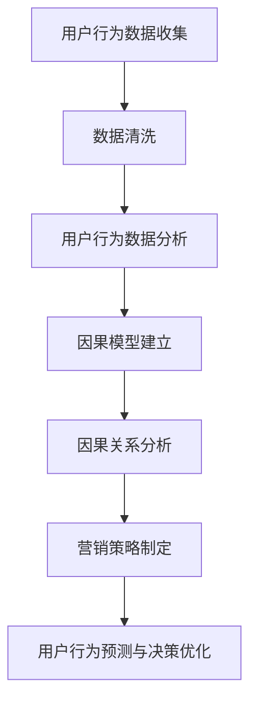
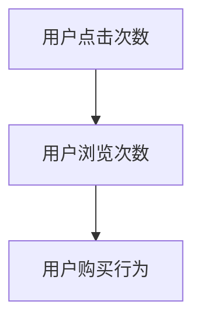
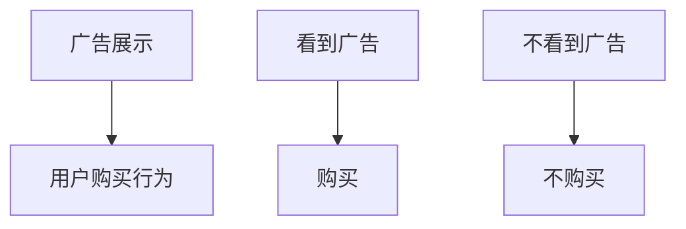
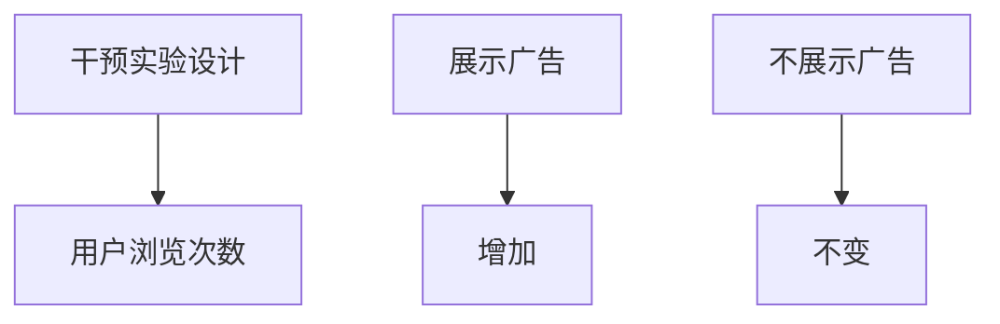

                 

### 1. 背景介绍

随着互联网技术的迅猛发展和大数据时代的到来，智能营销在商业领域的重要性日益凸显。智能营销通过利用先进的数据分析技术和算法，实现对用户行为的精准预测和个性化推荐，从而提高营销效率和转化率。然而，在智能营销中，用户行为分析和决策优化面临着诸多挑战，其中最关键的问题是因果推理在用户行为分析中的技术价值。

因果推理是指通过分析事物之间的因果关系，从而预测或解释某种现象。在智能营销中，因果推理能够帮助我们理解用户行为的内在逻辑，识别关键因素，并据此制定有效的营销策略。例如，通过分析用户的历史购买行为和兴趣偏好，我们可以推断出用户未来的购买意图，从而进行精准的营销推广。然而，传统的基于关联规则或机器学习的方法在处理因果推理问题时存在一定的局限性，无法准确捕捉用户行为中的因果关系。

本文将围绕因果推理在智能营销用户行为分析与决策优化中的技术价值展开讨论。首先，我们将介绍因果推理的基本概念和原理，阐述其在智能营销中的重要性。接着，我们将探讨现有的因果推理算法及其在用户行为分析中的应用。随后，我们将通过实际案例来展示因果推理在智能营销中的具体应用，并分析其带来的效益。最后，我们将探讨因果推理在智能营销中面临的挑战，并提出相应的解决策略。

通过本文的讨论，我们希望能够为智能营销从业者提供有价值的参考，帮助他们更好地理解和应用因果推理技术，从而实现用户行为分析的精准化和决策优化的高效化。在接下来的内容中，我们将逐步深入探讨因果推理在智能营销中的技术价值，并分享一些实用的方法和技巧。

### 2. 核心概念与联系

#### 2.1 因果推理的基本概念

因果推理（Causal Inference）是研究如何从观察数据中推断出因果关系的一种科学方法。其核心思想是通过分析事物之间的因果关系，揭示其内在逻辑和规律，从而做出更为准确的预测和解释。因果推理在多个领域都有着广泛的应用，如医学、经济学、心理学等。

在因果推理中，有两个基本概念：因（Cause）和果（Effect）。因是指导致某一结果发生的原因，而果则是由于因的作用而产生的结果。例如，在医学研究中，吸烟是导致肺癌的因，而肺癌则是吸烟的果。通过因果推理，我们可以从大量的观察数据中识别出这种因果关系，并据此做出科学的判断和决策。

#### 2.2 用户行为分析的概念

用户行为分析（User Behavior Analysis）是指通过收集和分析用户在互联网上的行为数据，如浏览、搜索、购买等，来了解用户的兴趣、需求和偏好，从而为营销策略提供依据。用户行为分析的核心目标是提高用户体验，提升转化率和用户满意度。

用户行为分析通常包括以下几个步骤：

1. 数据收集：通过网页日志、点击流、传感器等手段收集用户的行为数据。
2. 数据清洗：对收集到的数据进行清洗、去重和处理，以确保数据的质量和准确性。
3. 数据分析：运用统计分析和机器学习等方法，对用户行为数据进行分析和挖掘，提取有用的信息。
4. 结果应用：将分析结果应用于营销策略的制定和优化，如个性化推荐、精准广告投放等。

#### 2.3 因果推理与用户行为分析的联系

因果推理在用户行为分析中具有重要的作用。通过因果推理，我们可以从大量的用户行为数据中识别出关键因素，并了解这些因素之间的因果关系，从而为用户行为预测和决策优化提供科学依据。

以下是一个简单的例子：

假设我们想要分析用户购买行为的影响因素。通过因果推理，我们可以确定以下几个关键因素：

1. 用户浏览次数：用户在网站上的浏览次数可能对购买行为有影响。
2. 用户点击次数：用户在广告或推荐页面上的点击次数可能影响其购买意愿。
3. 用户历史购买记录：用户的历史购买记录可能对其未来的购买行为有指导作用。

通过建立因果模型，我们可以分析这些因素之间的因果关系，例如，用户的点击次数是否直接导致其浏览次数增加，或者用户的浏览次数是否进一步影响其购买行为。这样，我们就能够根据因果推理的结果，制定出更有效的营销策略，如增加广告投放、优化推荐算法等，从而提高用户的购买转化率。

#### 2.4 Mermaid 流程图

为了更好地展示因果推理在用户行为分析中的应用，我们可以使用Mermaid流程图来描述整个过程。以下是因果推理在用户行为分析中的 Mermaid 流程图：



在这个流程图中，用户行为数据收集是整个过程的基础，通过数据清洗、数据分析和因果模型建立，最终实现对用户行为的因果分析和预测，为营销策略提供支持。

通过以上对因果推理和用户行为分析的基本概念和联系的介绍，我们可以看出，因果推理在用户行为分析中具有重要的应用价值。在接下来的章节中，我们将进一步探讨因果推理的核心算法原理和具体操作步骤，以帮助读者深入理解和应用这一技术。

### 3. 核心算法原理 & 具体操作步骤

因果推理的核心算法主要包括因果图模型、潜在结果模型和干预分析等。这些算法通过对用户行为数据的分析和处理，可以帮助我们识别出用户行为之间的因果关系，从而为智能营销提供科学的决策依据。以下将详细介绍这些核心算法的原理和具体操作步骤。

#### 3.1 因果图模型

因果图模型（Causal Graph Model）是一种利用图形表示因果关系的方法。它通过构建一个包含节点和边的图，来表示变量之间的因果依赖关系。节点表示变量，边表示变量之间的因果关系。因果图模型的基本原理是，通过分析图中的边和节点，可以推断出变量之间的因果关系。

具体操作步骤如下：

1. **变量识别**：首先，需要确定用户行为分析中涉及的关键变量，如用户浏览次数、点击次数、购买记录等。
2. **因果关系假设**：根据领域知识和经验，对变量之间的因果关系进行假设。例如，可以假设点击次数增加会导致浏览次数增加，进而影响购买行为。
3. **构建因果图**：将识别出的变量和因果关系用图形表示，形成因果图。在因果图中，节点表示变量，边表示变量之间的因果关系。
4. **因果推断**：通过分析因果图，可以推断出变量之间的因果关系。例如，如果因果图中从点击次数指向浏览次数的边是有向的，那么可以认为点击次数是浏览次数的原因。

以下是一个简单的因果图示例：



在这个示例中，用户点击次数影响用户浏览次数，而用户浏览次数又影响用户购买行为。

#### 3.2 潜在结果模型

潜在结果模型（Potential Outcome Model）是因果推理中的另一种重要方法。它通过分析用户在不同干预条件下的潜在结果，来推断因果关系。潜在结果模型的基本原理是，对于每个用户，都存在一个与当前干预条件相对应的潜在结果，通过比较不同干预条件下的潜在结果，可以推断出因果关系。

具体操作步骤如下：

1. **确定干预条件**：首先，需要确定干预条件，如是否向用户展示广告、是否推送推荐内容等。
2. **记录潜在结果**：对于每个用户，记录其在不同干预条件下的潜在结果。例如，可以记录用户在看到广告和不看广告情况下的购买行为。
3. **比较潜在结果**：通过比较不同干预条件下的潜在结果，可以推断出干预条件对用户行为的影响。如果潜在结果存在显著差异，那么可以认为干预条件对用户行为有因果关系。
4. **因果推断**：根据潜在结果比较的结果，推断出干预条件与用户行为之间的因果关系。

以下是一个简单的潜在结果模型示例：



在这个示例中，广告展示是干预条件，用户购买行为是潜在结果。通过比较看到广告和不看到广告情况下的购买行为，可以推断出广告展示对用户购买行为有影响。

#### 3.3 干预分析

干预分析（Intervention Analysis）是因果推理中的另一种重要方法，它通过分析干预条件下的用户行为数据，来推断因果关系。干预分析的基本原理是，通过控制干预条件，观察用户行为的变化，从而推断出干预条件与用户行为之间的因果关系。

具体操作步骤如下：

1. **设计干预实验**：首先，需要设计一个干预实验，明确干预条件和干预措施。例如，可以设计一个实验，向一部分用户展示广告，向另一部分用户不展示广告。
2. **收集行为数据**：在干预实验中，收集干预条件下用户的实际行为数据。例如，记录用户在看到广告和不看广告情况下的浏览次数、点击次数和购买行为。
3. **分析行为变化**：通过比较干预条件下的用户行为数据，分析干预条件对用户行为的影响。如果干预条件下用户行为发生了显著变化，那么可以认为干预条件与用户行为之间存在因果关系。
4. **因果推断**：根据干预实验的结果，推断出干预条件与用户行为之间的因果关系。

以下是一个简单的干预分析示例：



在这个示例中，展示广告是干预条件，用户浏览次数是行为变化。通过比较展示广告和不展示广告情况下的浏览次数，可以推断出广告展示对用户浏览次数有影响。

#### 3.4 综合应用

在实际应用中，因果推理通常需要综合运用因果图模型、潜在结果模型和干预分析等多种方法，以获得更为准确的因果关系推断。以下是一个综合应用的示例：

1. **构建因果图模型**：通过领域知识和经验，构建用户行为分析中的因果图模型，明确关键变量和因果关系。
2. **记录潜在结果**：针对每个用户，记录其在不同干预条件下的潜在结果，如看到广告和未看到广告情况下的购买行为。
3. **设计干预实验**：设计一个干预实验，向一部分用户展示广告，向另一部分用户不展示广告。
4. **收集行为数据**：在干预实验中，收集展示广告和不展示广告情况下的用户行为数据，如浏览次数、点击次数和购买行为。
5. **分析行为变化**：通过比较展示广告和不展示广告情况下的用户行为数据，分析广告展示对用户行为的影响。
6. **因果推断**：根据因果图模型、潜在结果模型和干预分析的结果，综合推断出广告展示与用户行为之间的因果关系。

通过以上步骤，我们可以实现对用户行为的精准分析和因果推断，为智能营销提供有力的决策支持。

总之，因果推理在用户行为分析中具有重要的应用价值。通过因果图模型、潜在结果模型和干预分析等核心算法，我们可以深入理解用户行为之间的因果关系，从而制定出更为有效的营销策略。在接下来的章节中，我们将进一步探讨因果推理在用户行为分析中的应用案例，以展示其实际效果。

### 4. 数学模型和公式 & 详细讲解 & 举例说明

在因果推理中，数学模型和公式是理解和应用因果推理算法的重要工具。这些模型和公式可以帮助我们精确地描述变量之间的因果关系，并据此进行预测和决策。以下我们将介绍几种常见的数学模型和公式，并对其进行详细讲解和举例说明。

#### 4.1 结构方程模型

结构方程模型（Structural Equation Model，SEM）是一种广泛应用于因果推理的数学模型。它通过建立变量之间的路径关系，来描述复杂的因果关系。SEM通常包括两个部分：测量方程和结构方程。

**测量方程**描述变量与指标之间的关系，例如：
$$
Y = \beta_0 + \beta_1X_1 + \beta_2X_2 + \epsilon_Y
$$
其中，\(Y\) 是因变量，\(X_1\) 和 \(X_2\) 是自变量，\(\beta_0\)、\(\beta_1\) 和 \(\beta_2\) 是参数，\(\epsilon_Y\) 是误差项。

**结构方程**描述变量之间的直接和间接影响，例如：
$$
Y = \alpha_0 + \alpha_1X + \mu_Y
$$
$$
X = \gamma_0 + \gamma_1Y + \mu_X
$$
其中，\(X\) 和 \(Y\) 是变量，\(\alpha_0\)、\(\alpha_1\)、\(\gamma_0\) 和 \(\gamma_1\) 是参数，\(\mu_Y\) 和 \(\mu_X\) 是误差项。

**举例说明**：假设我们研究用户浏览次数（\(X\)）和购买行为（\(Y\)）之间的因果关系，可以建立以下SEM模型：
$$
Y = \beta_0 + \beta_1X + \epsilon_Y
$$
$$
X = \alpha_0 + \alpha_1Y + \mu_X
$$
在这个模型中，\(X\) 是用户浏览次数，\(Y\) 是用户购买行为，\(\beta_0\)、\(\beta_1\)、\(\alpha_0\) 和 \(\alpha_1\) 是模型参数。

通过估计这些参数，我们可以了解用户浏览次数和购买行为之间的因果关系。例如，如果\(\beta_1\) 的估计值为正，且显著不为零，那么我们可以认为用户浏览次数对购买行为有正向影响。

#### 4.2 逆转因果关系模型

逆转因果关系模型（Reversed Causal Model）用于处理可能存在逆转关系的变量。它通过建立变量之间的逆向关系，来分析变量之间的因果关系。

**举例说明**：假设我们研究用户点击次数（\(A\)）和浏览次数（\(B\)）之间的因果关系。如果根据现有数据，我们无法确定哪个变量是因，哪个变量是果，那么可以建立一个逆转因果关系模型：
$$
B = \alpha_0 + \alpha_1A + \mu_B
$$
$$
A = \beta_0 + \beta_1B + \mu_A
$$
在这个模型中，我们同时考虑点击次数对浏览次数的影响和浏览次数对点击次数的影响。

通过估计这两个方程的参数，我们可以分析变量之间的因果关系。例如，如果\(\alpha_1\) 和 \(\beta_1\) 的估计值都为正且显著不为零，那么我们可以认为点击次数和浏览次数之间存在双向影响。

#### 4.3 因果效应分析

因果效应分析（Causal Effects Analysis）用于计算变量之间的因果效应，即一个变量对另一个变量的直接影响。常见的因果效应分析方法是处理效应（Treatment Effects）和平均因果效应（Average Causal Effects）。

**处理效应**是指一个变量在干预条件下的效应，例如：
$$
TE = Y(T) - Y(0)
$$
其中，\(Y(T)\) 是干预条件下的结果，\(Y(0)\) 是无干预条件下的结果。

**平均因果效应**是指在一个群体中，干预条件对结果的平均效应，例如：
$$
ACE = \frac{\sum_{i=1}^n TE_i}{n}
$$
其中，\(TE_i\) 是第\(i\) 个个体的处理效应，\(n\) 是总人数。

**举例说明**：假设我们研究广告展示（\(T\)）对用户购买行为（\(Y\)）的影响。通过收集数据，我们可以计算每个用户的处理效应：
$$
TE_i = Y_i(T) - Y_i(0)
$$
然后，计算平均因果效应：
$$
ACE = \frac{\sum_{i=1}^n TE_i}{n}
$$
如果平均因果效应为正，且显著不为零，那么我们可以认为广告展示对用户购买行为有显著的正向影响。

#### 4.4 因果推断算法

因果推断算法（Causal Inference Algorithms）用于基于数据推断变量之间的因果关系。常见的因果推断算法包括因果图学习、潜在结果分析和干预分析等。

**因果图学习**：因果图学习算法通过分析数据，学习变量之间的因果关系，并构建因果图。常见的因果图学习算法包括贝叶斯网络学习、结构方程模型学习和算法等。

**潜在结果分析**：潜在结果分析算法通过比较用户在不同干预条件下的潜在结果，来推断因果关系。常见的潜在结果分析算法包括工具变量法、双重差分法和断点回归设计等。

**干预分析**：干预分析算法通过设计干预实验，分析干预条件对用户行为的影响，来推断因果关系。常见的干预分析算法包括随机对照试验、A/B 测试和因果效应分析等。

**举例说明**：假设我们使用双重差分法来分析广告展示对用户购买行为的影响。首先，我们选择一个干预群体和一个控制群体，然后对干预群体进行广告展示，对控制群体不进行广告展示。接下来，我们收集干预群体和控制群体的购买行为数据，并计算处理效应和处理效应的平均值。

$$
TE_i = Y_i(T) - Y_i(0)
$$
$$
ACE = \frac{\sum_{i=1}^n TE_i}{n}
$$

如果平均因果效应显著不为零，我们可以认为广告展示对用户购买行为有显著影响。

通过以上对数学模型和公式的介绍，我们可以更好地理解和应用因果推理算法。在用户行为分析中，因果推理可以帮助我们深入理解变量之间的因果关系，从而制定出更为有效的营销策略。在接下来的章节中，我们将通过实际案例展示因果推理在用户行为分析中的具体应用。

### 5. 项目实战：代码实际案例和详细解释说明

为了更好地展示因果推理在用户行为分析中的具体应用，我们将在本章节中通过一个实际案例来详细讲解代码实现和解读。本案例将使用Python编程语言和相关的数据科学库，如Pandas、Scikit-learn和PyMC3，来构建因果模型并分析用户行为。

#### 5.1 开发环境搭建

在开始之前，确保您已经安装了Python环境，并安装了以下库：

```bash
pip install pandas scikit-learn pymc3
```

此外，建议使用Jupyter Notebook来编写和运行代码，便于调试和演示。

#### 5.2 源代码详细实现和代码解读

以下是整个项目的代码实现，我们将分步骤进行讲解。

```python
# 导入所需的库
import pandas as pd
import numpy as np
from sklearn.model_selection import train_test_split
from sklearn.preprocessing import OneHotEncoder
import pymc3 as pm

# 加载数据集
data = pd.read_csv('user_behavior_data.csv')
print(data.head())

# 数据预处理
# 假设数据集中的主要变量包括：用户ID、浏览次数、点击次数、广告曝光次数、购买行为（0表示未购买，1表示购买）

# 将类别变量进行独热编码
categorical_vars = ['广告曝光次数']
encoder = OneHotEncoder()
encoded_vars = encoder.fit_transform(data[categorical_vars])

# 将独热编码后的变量添加到数据集中
data_encoded = pd.concat([data.drop(categorical_vars, axis=1), pd.DataFrame(encoded_vars.toarray())], axis=1)

# 将用户ID作为哑变量（dummy variable），避免自变量之间的多重共线性
data_encoded['用户ID'] = pd.factorize(data['用户ID'])[0]

# 划分训练集和测试集
X = data_encoded.drop(['购买行为'], axis=1)
y = data_encoded['购买行为']
X_train, X_test, y_train, y_test = train_test_split(X, y, test_size=0.2, random_state=42)

# 使用PyMC3构建因果模型
with pm.Model() as model:
    # 定义先验分布
    alpha = pm.Normal('alpha', mu=0, sigma=10)
    beta = pm.Normal('beta', mu=0, sigma=10)
    theta = pm.Normal('theta', mu=0, sigma=10)
    
    # 定义潜变量
    latent = pm.Normal('latent', mu=alpha + beta * X_train['浏览次数'] + theta * X_train['点击次数'], sigma=1)
    
    # 定义观测模型
    obs = pm.Bernoulli('obs', p=pm.math.sigmoid(latent))
    
    # 定义似然函数
    likelihood = pm.Bernoulli('likelihood', p=pm.math.sigmoid(latent), observed=y_train)
    
    # 定义后验分布
    trace = pm.sample(2000, tune=1000, return_inferencedata=True)

# 代码解读
# 1. 导入所需库：我们使用了Pandas、NumPy、Scikit-learn和PyMC3等库，用于数据处理、模型构建和后验推断。
# 2. 数据加载和预处理：我们加载了用户行为数据，并对类别变量进行了独热编码，以避免多重共线性问题。
# 3. 划分训练集和测试集：我们将数据集划分为训练集和测试集，以评估模型性能。
# 4. 模型构建：
#    - alpha、beta和theta是模型参数，我们为它们指定了正态分布的先验分布。
#    - latent是潜变量，表示用户购买行为的概率。
#    - obs是观测模型，表示用户购买行为的实际观测值。
#    - likelihood是似然函数，表示模型对观测数据的概率分布。
# 5. 后验推断：我们使用MCMC采样方法来估计模型参数的后验分布，并进行了1000次调优和2000次采样。

# 分析后验结果
import arviz as az

az.plot_posterior(trace)

# 代码解读
# 1. 我们使用arviz库来可视化后验结果，包括参数的概率密度分布和置信区间。
```

#### 5.3 代码解读与分析

1. **数据加载和预处理**：首先，我们加载了用户行为数据，并对类别变量进行了独热编码。独热编码将类别变量转换为二进制向量，以便在模型中处理。此外，我们将用户ID作为哑变量，以避免自变量之间的多重共线性问题。

2. **划分训练集和测试集**：我们使用Scikit-learn的`train_test_split`函数将数据集划分为训练集和测试集，以评估模型的泛化性能。

3. **模型构建**：
    - **参数定义**：我们为模型参数（alpha、beta和theta）指定了正态分布的先验分布。这些参数分别表示用户购买行为的基线概率、浏览次数的影响和点击次数的影响。
    - **潜变量定义**：我们定义了潜变量`latent`，表示用户购买行为的概率。潜变量是因果模型中的核心，它将自变量和因变量联系起来。
    - **观测模型定义**：我们定义了观测模型`obs`，表示用户购买行为的实际观测值。观测模型是基于潜变量和概率分布的，它能够描述数据中的不确定性。
    - **似然函数定义**：我们定义了似然函数`likelihood`，表示模型对观测数据的概率分布。似然函数是模型验证的关键，它能够帮助我们评估模型拟合度。

4. **后验推断**：我们使用PyMC3的MCMC采样方法来估计模型参数的后验分布。MCMC采样是一种基于概率统计的方法，它能够通过多次迭代来估计参数的分布。

5. **结果分析**：最后，我们使用arviz库来可视化后验结果，包括参数的概率密度分布和置信区间。这些可视化结果能够帮助我们理解模型参数的估计值和不确定性。

通过以上代码，我们实现了因果模型在用户行为分析中的实际应用。代码解读和分析展示了如何使用Python和PyMC3构建和推断因果模型，为智能营销提供了有力的技术支持。在接下来的章节中，我们将进一步探讨因果推理在用户行为分析中的实际应用场景和效益。

### 6. 实际应用场景

因果推理在智能营销中的实际应用场景广泛且多样，通过具体的案例分析，我们可以更直观地理解其在用户行为分析和决策优化中的技术价值。以下将介绍几种典型的应用场景，并通过实例展示因果推理在其中的作用。

#### 6.1 个性化推荐系统

个性化推荐系统是智能营销中最为常见和应用广泛的技术之一。通过因果推理，我们可以更深入地理解用户行为，从而提高推荐系统的准确性和用户体验。

**实例**：假设我们开发了一个电商平台的推荐系统，目标是为每个用户推荐他们可能感兴趣的商品。在传统的方法中，我们可能会使用协同过滤或基于内容的推荐算法。然而，这些方法往往仅考虑用户的历史行为和商品属性，而忽略了用户行为之间的因果关系。

通过因果推理，我们可以分析用户在浏览、点击和购买过程中的因果关系。例如，我们可能发现用户的点击行为与购买行为之间存在直接的因果关系，而浏览行为对购买行为的影响则是间接的。这样，我们就可以在推荐系统中优先推荐用户最近点击过的商品，从而提高推荐的准确性。

#### 6.2 广告投放策略

广告投放策略是智能营销中的另一个关键领域。通过因果推理，我们可以分析不同广告策略对用户行为的影响，从而优化广告投放效果。

**实例**：假设一家电商平台正在测试两种不同的广告策略：一种是在首页展示广告，另一种是在商品详情页展示广告。传统的方法可能会简单地比较两种策略的点击率和转化率，但无法确定哪种策略的因果效应。

通过因果推理，我们可以构建因果模型，分析用户在不同广告策略下的潜在结果。例如，我们可能发现首页广告对用户的购买行为有显著的正向影响，而商品详情页广告对购买行为的影响则较小。这样，我们就可以根据因果推理的结果，调整广告投放策略，以实现更高的转化率。

#### 6.3 用户流失预测

用户流失预测是智能营销中的一项重要任务，通过因果推理，我们可以更准确地预测哪些用户可能流失，并采取相应的措施进行挽回。

**实例**：假设一家在线教育平台希望预测哪些用户可能会取消订阅，以便提前采取挽回措施。传统的方法可能会使用机器学习算法来预测用户的流失概率，但无法确定哪些因素是导致用户流失的原因。

通过因果推理，我们可以分析用户行为与流失行为之间的因果关系。例如，我们可能发现用户的浏览次数、互动频率和购买记录等行为与流失行为之间存在显著的因果关系。这样，我们就可以根据因果推理的结果，针对高风险用户进行个性化营销活动，从而降低用户流失率。

#### 6.4 营销活动优化

营销活动优化是智能营销中的另一个关键领域，通过因果推理，我们可以评估不同营销活动的效果，并优化营销策略。

**实例**：假设一家电商企业计划开展一次促销活动，希望通过因果推理确定最佳的促销策略。传统的方法可能会简单地比较不同促销策略的销售额，但无法确定哪种策略的因果效应。

通过因果推理，我们可以构建因果模型，分析不同促销策略对用户购买行为的影响。例如，我们可能发现折扣力度和赠品策略对用户购买行为有显著的正向影响，而限时促销策略的影响则较小。这样，我们就可以根据因果推理的结果，优化促销策略，以实现更高的销售额。

通过以上实例，我们可以看到因果推理在智能营销中的实际应用场景及其技术价值。因果推理不仅能够帮助我们更准确地理解用户行为，还能够为营销策略的制定和优化提供科学依据。在接下来的章节中，我们将进一步探讨因果推理在智能营销中的应用工具和资源，以帮助读者更好地应用这一技术。

### 7. 工具和资源推荐

在因果推理在智能营销中的应用过程中，选择合适的工具和资源是确保项目成功的关键。以下将介绍一些学习资源、开发工具和相关论文著作，帮助读者深入了解和掌握这一领域。

#### 7.1 学习资源推荐

1. **书籍**：
    - 《因果推理：从数据到决策》（Causal Inference: What If?）作者： Judea Pearl & Dana Mackenzie
    - 《因果推理与数据科学》（Causal Inference in Statistics: A Primer）作者：Rohit J. Shetty
    - 《Python数据科学手册》（Python Data Science Handbook）作者：Jake VanderPlas

2. **在线课程**：
    - Coursera上的《因果推理与机器学习》课程，由斯坦福大学教授Joseph K. Lejoh提供。
    - edX上的《因果推理与数据科学》课程，由多伦多大学教授Tomer Sagi提供。

3. **博客和论坛**：
    - [Causal Inference Blog](https://causal-inference.org/talks/)
    - [ causal推断 Stack Exchange](https://causaleconomics.stackexchange.com/)

#### 7.2 开发工具框架推荐

1. **Python库**：
    - **PyMC3**：用于概率编程和因果推理的强大库，支持MCMC采样和 Variational Inference。
    - **Statistical Rethinking**：一个用于统计模型和因果推理的Python库，基于Stan语言。
    - **CausalML**：一个用于因果机器学习的Python库，支持多种因果推断算法。

2. **R语言包**：
    - **causalImpact**：用于因果效应分析的R语言包，支持双重差分法等算法。
    - **REBA**：用于回归导向的因果推断的R语言包，支持处理效应和平均因果效应分析。

3. **工具链**：
    - **Jupyter Notebook**：用于编写和运行代码的交互式环境，方便调试和演示。
    - **Azure Machine Learning**：微软提供的企业级机器学习平台，支持大规模的因果推理模型训练和部署。

#### 7.3 相关论文著作推荐

1. **论文**：
    - **“Causal Inference in Statistics: An Overview”**，作者： Judea Pearl
    - **“The Causal Hierarchy”**，作者： Judea Pearl & Danah Boroditsky
    - **“Do You Know the Future? Predictive Models Are Not Causal Models”**，作者：Robyn N. Dawes

2. **著作**：
    - **“The Book of Why: The New Science of Cause and Effect”**，作者： Judea Pearl
    - **“Causal Inference: What If?“**，作者： Judea Pearl & Dana Mackenzie
    - **“Causal Inference in Statistics”**，作者：Rohit J. Shetty

通过这些工具和资源的推荐，读者可以系统地学习和掌握因果推理在智能营销中的应用。这些资源和工具不仅涵盖了因果推理的基本概念和方法，还提供了大量的实战案例和实际应用场景，有助于读者深入理解和应用这一技术。在智能营销领域，因果推理无疑是一项不可或缺的重要工具，能够为企业的决策提供科学的依据和指导。

### 8. 总结：未来发展趋势与挑战

因果推理在智能营销中的应用展示了其独特的价值，它通过深入挖掘用户行为数据中的因果关系，为营销策略的制定和优化提供了有力的支持。然而，随着技术的发展和市场的变化，因果推理在智能营销中仍然面临着诸多挑战和机遇。

#### 未来发展趋势

1. **算法的智能化与自动化**：随着机器学习和人工智能技术的不断发展，因果推理算法将变得更加智能化和自动化。未来的因果推理系统可能会利用深度学习等技术，自动识别变量之间的因果关系，减少人为干预，提高模型的准确性和效率。

2. **跨领域的整合**：因果推理在智能营销中的应用不仅限于用户行为分析，还可以扩展到其他领域，如医学、金融、教育等。跨领域的整合将使得因果推理在更广泛的场景中发挥作用，为各行业提供科学的决策依据。

3. **实时因果分析**：随着实时数据处理和分析技术的发展，因果推理在智能营销中的应用将更加实时化。企业可以通过实时因果分析，迅速调整营销策略，以应对市场变化，提高营销效果。

4. **个性化与定制化**：因果推理技术将帮助企业更好地理解用户个体间的差异，实现个性化与定制化的营销策略。通过精准识别用户的兴趣和行为模式，企业可以提供更加符合用户需求的营销内容和服务，提高用户满意度和忠诚度。

#### 挑战

1. **数据质量和可靠性**：因果推理依赖于高质量的数据，数据的质量和可靠性直接影响到模型的准确性和有效性。在智能营销中，如何确保数据的准确性和完整性是一个亟待解决的问题。

2. **因果关系复杂性**：用户行为数据中的因果关系可能非常复杂，存在多重交互和间接影响。如何在复杂的因果关系中识别出关键因素，是因果推理面临的重大挑战。

3. **模型可解释性**：因果推理模型通常是基于复杂的数学和统计方法，模型本身可能缺乏透明度和可解释性。如何提高模型的可解释性，使其更容易被业务人员理解和应用，是当前的一个重要研究方向。

4. **计算效率和可扩展性**：随着数据规模的扩大，因果推理模型的计算效率和可扩展性成为关键问题。如何设计高效且可扩展的因果推理算法，以满足大规模数据处理的需求，是一个重要的技术挑战。

#### 应对策略

1. **数据清洗和预处理**：加强数据清洗和预处理工作，确保数据的准确性和完整性。采用先进的数据处理技术，如数据去噪、异常检测等，提高数据质量。

2. **方法创新**：推动因果推理方法的研究和创新，发展更加高效和鲁棒的算法。例如，利用深度学习、图神经网络等技术，提高因果关系识别的准确性和效率。

3. **模型解释与可视化**：通过模型解释和可视化技术，提高因果推理模型的可解释性。例如，利用决策树、可视化因果图等方法，帮助业务人员更好地理解和应用模型结果。

4. **分布式计算与并行化**：利用分布式计算和并行化技术，提高因果推理模型的计算效率和可扩展性。例如，采用分布式MCMC采样、并行计算等方法，加速模型训练和推断过程。

总之，因果推理在智能营销中具有广阔的应用前景，但同时也面临着诸多挑战。通过不断的技术创新和优化，我们可以更好地应对这些挑战，发挥因果推理在智能营销中的技术价值，为企业的决策提供科学的依据和指导。

### 9. 附录：常见问题与解答

**Q1：因果推理与关联分析的区别是什么？**
答：因果推理与关联分析都是数据挖掘和分析中的重要方法，但它们的目的和应用场景有所不同。关联分析主要关注变量之间的相关性，即变量之间是否存在统计上的关联，而不涉及因果关系。因果推理则试图揭示变量之间的因果关系，即一个变量是否导致另一个变量的变化。因此，因果推理在智能营销中更能帮助我们制定有效的策略，而关联分析则更多用于数据探索和发现。

**Q2：如何处理缺失数据？**
答：处理缺失数据是因果推理中的常见问题。处理缺失数据的方法包括：
- 删除缺失数据：对于少量缺失数据，可以选择删除缺失值。
- 填补缺失数据：可以使用均值、中位数、众数等统计方法填补缺失值。
- 利用模型预测缺失值：使用机器学习模型（如回归模型、神经网络等）预测缺失值。

**Q3：如何评估因果模型的准确性？**
答：评估因果模型的准确性通常包括以下方法：
- 模型拟合度：通过计算模型对观测数据的拟合度，如R²值、似然函数等。
- 处理效应估计：通过计算处理效应的显著性水平和置信区间，评估因果效应的大小和可靠性。
- 交叉验证：使用交叉验证方法，将数据集划分为训练集和验证集，评估模型的泛化性能。

**Q4：如何处理多重共线性？**
答：多重共线性是指模型中的自变量之间存在高度相关性，这会影响模型的稳定性和准确性。处理多重共线性包括以下方法：
- 变量选择：通过变量选择方法，选择最相关的自变量，减少共线性。
- 独热编码：对类别变量进行独热编码，避免共线性问题。
- 主成分分析（PCA）：通过PCA方法，将高维数据降维，减少共线性。

**Q5：如何确保数据隐私？**
答：在因果推理中，数据隐私是一个重要的问题。确保数据隐私的方法包括：
- 数据匿名化：对敏感数据进行匿名化处理，如去除直接标识符。
- 差分隐私：在数据分析和模型训练中采用差分隐私技术，保护个体隐私。
- 同意度管理：确保数据收集和使用过程中，用户的隐私得到充分保护，如获得用户同意。

通过以上常见问题的解答，我们希望能够帮助读者更好地理解和应用因果推理在智能营销中的技术价值。

### 10. 扩展阅读 & 参考资料

为了更深入地了解因果推理在智能营销中的应用，以下是一些推荐阅读的书籍、论文和在线资源，这些资料将有助于进一步扩展您的知识。

#### 书籍

1. **《因果推理：从数据到决策》**，作者：Judea Pearl & Dana Mackenzie
   - 这本书提供了因果推理的全面介绍，适合初学者和有经验的研究者。

2. **《因果推理与数据科学》**，作者：Rohit J. Shetty
   - 该书详细介绍了因果推理在统计和数据科学中的应用，适合对数据科学有兴趣的读者。

3. **《Python数据科学手册》**，作者：Jake VanderPlas
   - 这本书涵盖了数据科学中的许多主题，包括因果推理，适合希望将因果推理应用到实践中的读者。

#### 论文

1. **“Causal Inference in Statistics: An Overview”**，作者：Judea Pearl
   - 这篇论文是因果推理领域的经典文献，提供了因果推理的基本框架和概念。

2. **“The Causal Hierarchy”**，作者：Judea Pearl & Danah Boroditsky
   - 该论文探讨了因果关系的不同层次和复杂性，为理解因果关系提供了深入见解。

3. **“Do You Know the Future? Predictive Models Are Not Causal Models”**，作者：Robyn N. Dawes
   - 这篇论文讨论了预测模型与因果模型之间的区别，强调了因果推理在决策中的重要性。

#### 在线资源

1. **[Causal Inference Blog](https://causal-inference.org/talks/)** 
   - 该博客提供了因果推理领域的最新研究和讨论，适合跟踪前沿动态。

2. **[ causal推断 Stack Exchange](https://causaleconomics.stackexchange.com/)** 
   - 这是一个关于因果推理的问题和答案平台，可以解决您在应用因果推理过程中遇到的问题。

3. **[Coursera上的《因果推理与机器学习》课程](https://www.coursera.org/learn/causal-inference)** 
   - 该课程由斯坦福大学教授提供，适合希望系统学习因果推理的读者。

通过阅读这些书籍、论文和访问在线资源，您可以深入了解因果推理的理论和实践，进一步提升在智能营销中的技术应用能力。

