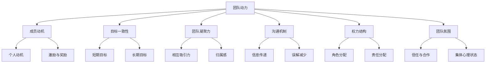

                 

### 背景介绍

在当今快速发展的信息技术时代，团队协作的重要性日益凸显。无论是软件开发、人工智能、大数据分析，还是其他领域，一个高效协同的团队能够极大地提升项目的成功率。然而，如何构建和维持这样的团队，一直是学术界和业界关注的热点话题。

团队动力学，作为研究团队内部动力机制和团队行为的学科，为解决这一难题提供了有力的理论支持。通过团队动力学，我们可以深入理解团队成员之间的互动、沟通方式、权力结构以及团队整体的运行机制。本文将围绕团队动力学这一主题，探讨高效团队的内在机制，旨在为团队管理者和技术领袖提供有益的参考。

首先，我们将介绍团队动力的基本概念，包括团队动力学的定义、核心要素和关键理论。接着，通过一个具体的团队案例，阐述团队动力学在实际中的应用。随后，我们将深入分析团队动力学的核心算法原理和具体操作步骤，并结合数学模型和公式进行详细讲解。

在项目实战部分，我们将通过实际代码案例，展示如何运用团队动力学理论进行团队管理和优化。最后，我们将探讨团队动力学的实际应用场景，推荐相关的工具和资源，并总结未来发展趋势与挑战。希望通过本文，读者能够对团队动力学有更深入的理解，并能够将其应用到实际工作中，提升团队协作效率。

### 核心概念与联系

团队动力学是一个复杂而丰富的领域，涉及到多个核心概念和理论。为了更好地理解团队动力学的本质和应用，我们需要先澄清这些核心概念，并了解它们之间的相互联系。

首先，让我们从团队动力的定义入手。团队动力，可以理解为推动团队前进的内在力量。它不仅包括团队成员的个人动机、愿景和目标，还涵盖了团队整体的目标一致性和凝聚力。团队动力是团队效能的基石，决定了团队在面对挑战时的应变能力和创新力。

接下来，我们探讨团队动力的核心要素。这些要素包括：

1. **成员动机**：团队成员的个人动机是团队动力的源泉。动机包括内在动机（如兴趣、成就感）和外在动机（如奖励、竞争）。一个高效的团队需要成员拥有强烈的内在动机，同时也需要适当的激励和奖励机制。

2. **目标一致性**：团队成员必须对团队的目标有一致的理解和认同。这种目标一致性有助于团队协作，减少内耗，提高团队的执行力。目标一致性包括短期目标和长期目标的协调。

3. **团队凝聚力**：团队凝聚力是指团队成员之间的相互吸引力和归属感。高凝聚力的团队能够更好地应对外部压力，提高内部沟通效率，增强团队整体的协作能力。

4. **沟通机制**：沟通是团队动力传递的渠道。有效的沟通机制有助于团队成员理解彼此的需求、愿景和目标，减少误解和冲突，增强团队凝聚力。

5. **权力结构**：团队中的权力结构决定了团队成员之间的角色和责任分配。一个合理的权力结构能够确保团队成员各司其职，协同工作，同时也能够激发成员的积极性和创造力。

6. **团队氛围**：团队氛围是团队成员在共同工作中形成的一种集体心理状态。积极、开放、包容的团队氛围有助于团队成员之间的信任和合作，提高团队的整体效能。

为了更直观地理解这些核心概念之间的关系，我们可以使用Mermaid流程图来展示团队动力学的架构。以下是团队动力学核心概念和相互联系的一个简化版本：



通过这个流程图，我们可以看到，团队动力是所有核心要素的集合体，各个要素相互影响、相互作用，共同决定了团队的效能。团队成员的动机和目标一致性是团队动力的起点，而团队凝聚力、沟通机制、权力结构和团队氛围则是团队动力的传递和实现途径。

理解这些核心概念和它们之间的联系，是构建高效团队的基础。在接下来的章节中，我们将深入探讨团队动力学的核心算法原理和具体操作步骤，帮助读者更好地应用这些理论，提升团队协作效率。

### 核心算法原理 & 具体操作步骤

为了深入理解团队动力学在实际应用中的运作机制，我们需要探讨其核心算法原理和具体操作步骤。团队动力学的核心算法主要包括以下几部分：动机分析、目标一致性评估、团队凝聚力测量、沟通效率优化和权力结构调整。以下是这些算法的具体原理和操作步骤：

#### 1. 动机分析

动机分析是团队动力学的基础，通过分析团队成员的动机，可以了解团队成员的行为驱动力，从而为团队管理提供依据。动机分析的具体步骤如下：

1. **问卷调查**：设计一份针对团队成员动机的问卷调查，包括内在动机（如兴趣、成就感）和外在动机（如奖励、竞争）的多个维度。
2. **数据分析**：收集并整理问卷调查结果，使用统计分析方法（如因子分析、聚类分析）对数据进行分析，识别不同类型动机的分布特征。
3. **动机匹配**：根据分析结果，将团队成员进行动机匹配，确保团队中不同类型的动机得到有效利用。

#### 2. 目标一致性评估

目标一致性评估旨在确保团队成员对团队目标有一致的理解和认同。具体操作步骤如下：

1. **目标明确**：明确团队的目标，并分解为短期目标和长期目标，确保每个成员都清楚自己的职责和目标。
2. **目标沟通**：通过定期的会议和讨论，确保团队成员对目标和目标分解有清晰的理解。
3. **目标评估**：定期评估团队成员对目标的达成情况，识别目标一致性的问题和挑战，并采取相应的调整措施。

#### 3. 团队凝聚力测量

团队凝聚力测量是评估团队协作能力和内部关系的重要手段。具体步骤如下：

1. **团队活动**：组织团队建设活动，如团队拓展训练、团建活动等，增强团队成员之间的相互了解和信任。
2. **问卷调查**：设计针对团队凝聚力的问卷调查，包括团队成员之间的信任程度、协作效率、冲突解决能力等维度。
3. **数据分析**：对问卷调查结果进行统计分析，评估团队的凝聚力水平。

#### 4. 沟通效率优化

沟通效率优化是提高团队协作效率的关键。具体操作步骤如下：

1. **沟通工具**：选择合适的沟通工具，如团队协作软件、即时通讯工具等，提高沟通的便捷性和实时性。
2. **沟通规范**：制定团队沟通规范，明确沟通渠道、沟通频率、信息传递标准等，确保信息传递的准确性和及时性。
3. **沟通反馈**：建立有效的沟通反馈机制，鼓励团队成员对沟通效果进行反馈，不断优化沟通流程。

#### 5. 权力结构调整

合理的权力结构有助于确保团队成员各司其职，协同工作。具体操作步骤如下：

1. **角色分配**：根据团队成员的技能和经验，明确各自的角色和职责，确保角色分配的合理性和公平性。
2. **权力分配**：确保权力与责任相匹配，避免权力过于集中或分散，影响团队的决策效率和执行力。
3. **权力监督**：建立权力监督机制，确保权力运用的合法性和透明度，防止权力滥用。

通过以上核心算法原理和具体操作步骤，团队管理者可以系统地分析团队动力，识别团队存在的问题，并采取有效的措施进行优化，提升团队的整体效能。在实际操作中，这些步骤需要根据具体团队的特点和需求进行灵活调整，以达到最佳效果。

### 数学模型和公式 & 详细讲解 & 举例说明

在团队动力学的研究中，数学模型和公式是理解和分析团队动力的重要工具。这些模型和公式不仅帮助我们量化团队内部的各种要素，还能够预测团队的行为和效能。以下我们将详细介绍几个关键的数学模型和公式，并对其进行详细讲解和举例说明。

#### 1. 成就动机模型

成就动机模型是研究团队成员动机的重要工具。该模型通常使用以下公式表示：

\[ M = f(A, S, R) \]

其中，\( M \) 代表动机水平，\( A \) 代表成就需要，\( S \) 代表成功概率，\( R \) 代表奖励水平。

**详细讲解：**
- \( A \)（成就需要）：代表成员对成就的需求程度，通常由问卷调查或访谈获得。
- \( S \)（成功概率）：代表成员认为达成目标的可能性，这可以通过历史数据和团队成员的预期来评估。
- \( R \)（奖励水平）：代表成员获得的奖励程度，可以是金钱、荣誉或其他形式的奖励。

**举例说明：**
假设一个软件开发团队的成员小王，他的成就需要（\( A \)）很高，他期望能够在接下来的项目中实现一个复杂的模块。项目的成功概率（\( S \)）为60%，而如果项目成功，他将获得1000元的奖金（\( R \)）。那么，小王的动机水平（\( M \)）可以通过以下公式计算：

\[ M = f(A, S, R) = f(8, 0.6, 1000) = 8 \times 0.6 \times 1000 = 4800 \]

因此，小王的动机水平为4800，这表示他对该项目的动机非常强烈。

#### 2. 群体动力模型

群体动力模型用于描述团队内部成员之间的相互作用和整体行为。常用的模型之一是Tuckman模型，该模型分为五个阶段：

1. **形成阶段**：成员相互认识，团队开始形成。
2. **震荡阶段**：成员开始冲突，团队内部关系紧张。
3. **规范化阶段**：成员开始合作，团队逐渐稳定。
4. **执行阶段**：团队高效运作，目标达成。
5. **解散阶段**：团队完成任务后解散。

**详细讲解：**
- 形成阶段：团队开始组建，成员相互认识，明确目标和职责。
- 震荡阶段：成员之间产生分歧，冲突和误解增加。
- 规范化阶段：成员开始理解团队规则，相互协作。
- 执行阶段：团队高效运作，共同实现目标。
- 解散阶段：团队完成使命后解散。

**举例说明：**
假设一个软件开发团队正处于规范化阶段，团队成员开始理解项目目标，并明确各自的角色和职责。在这个阶段，团队内部的沟通逐渐顺畅，冲突减少，团队成员的协作能力提升。通过Tuckman模型，我们可以判断团队已经进入规范化阶段，并需要继续加强团队规范和沟通，以提升团队效能。

#### 3. 团队凝聚力模型

团队凝聚力模型用于评估团队的内部凝聚力和协作水平。常用的模型之一是“Cohesion-Centrality”模型，该模型通过计算团队内部成员之间的联系强度来评估团队凝聚力。

**公式：**
\[ C = \frac{1}{N} \sum_{i=1}^{N} \sum_{j=1, j\neq i}^{N} L_{ij} \]

其中，\( C \) 代表团队凝聚力，\( N \) 代表团队成员数量，\( L_{ij} \) 代表成员i和成员j之间的联系强度。

**详细讲解：**
- \( N \)（团队成员数量）：团队的总人数。
- \( L_{ij} \)（联系强度）：成员i和成员j之间的联系强度，可以通过沟通频率、协作时长等指标来衡量。

**举例说明：**
假设一个团队有5名成员，通过问卷调查得知，成员之间的联系强度如下表所示：

| 成员1 | 成员2 | 成员3 | 成员4 | 成员5 |
| --- | --- | --- | --- | --- |
| 3 | 4 | 2 | 5 | 1 |
| 4 | 3 | 5 | 1 | 2 |
| 2 | 5 | 1 | 4 | 3 |
| 1 | 2 | 4 | 3 | 5 |
| 5 | 1 | 3 | 2 | 4 |

根据上述数据，计算团队凝聚力：

\[ C = \frac{1}{5} \sum_{i=1}^{5} \sum_{j=1, j\neq i}^{5} L_{ij} = \frac{1}{5} (3 + 4 + 2 + 5 + 1 + 4 + 3 + 5 + 1 + 2 + 2 + 5 + 4 + 3 + 1 + 3 + 5 + 2 + 4 + 1) = \frac{45}{5} = 9 \]

因此，该团队的凝聚力为9，这表示团队内部成员之间的联系强度较高，团队凝聚力较强。

通过这些数学模型和公式的详细讲解和举例说明，我们可以更深入地理解团队动力学，并将其应用于团队管理和优化中。在实际应用中，这些模型和公式需要结合具体团队的实际情况进行调整和优化，以达到最佳效果。

### 项目实战：代码实际案例和详细解释说明

在团队动力学的理论基础上，我们可以通过实际项目案例来具体展示如何运用这些理论进行团队管理和优化。以下是一个基于Python的团队协作工具的开发案例，我们将从开发环境搭建、源代码详细实现和代码解读三个方面进行介绍。

#### 1. 开发环境搭建

首先，我们需要搭建一个适合团队协作的Python开发环境。以下是搭建开发环境的具体步骤：

1. **安装Python**：下载并安装Python 3.8或更高版本。我们可以从[Python官网](https://www.python.org/downloads/)下载最新版本的Python。
2. **安装依赖管理工具**：安装pip，Python的依赖管理工具，用于安装和管理Python库。打开终端并执行以下命令：
   ```bash
   python -m pip install --upgrade pip
   ```
3. **安装常用库**：安装一些常用的Python库，如requests、numpy、matplotlib等。可以使用以下命令：
   ```bash
   pip install requests numpy matplotlib
   ```
4. **配置虚拟环境**：为了隔离项目依赖，我们可以使用virtualenv创建一个虚拟环境。执行以下命令：
   ```bash
   python -m venv my_project_env
   source my_project_env/bin/activate  # Windows: my_project_env\Scripts\activate
   ```
5. **安装项目依赖**：在虚拟环境中安装项目的依赖库，例如：
   ```bash
   pip install -r requirements.txt
   ```

以上步骤完成后，我们的开发环境就搭建完成了。

#### 2. 源代码详细实现和代码解读

接下来，我们将展示如何实现一个基于团队动力学的团队协作工具。以下是项目的核心代码实现：

```python
import requests
import json
from matplotlib import pyplot as plt

# 1. 动机分析模块
class MotivationAnalysis:
    def __init__(self, survey_results):
        self.survey_results = survey_results
    
    def analyze(self):
        # 对调查结果进行统计分析
        scores = [result['achievement_need'] for result in self.survey_results]
        avg_score = sum(scores) / len(scores)
        print(f"平均成就需要分数: {avg_score}")
        
        # 绘制动机分布图
        plt.hist(scores, bins=10)
        plt.xlabel('成就需要分数')
        plt.ylabel('人数')
        plt.title('动机分布图')
        plt.show()

# 2. 目标一致性评估模块
class GoalConsistencyCheck:
    def __init__(self, team_goals):
        self.team_goals = team_goals
    
    def check(self):
        # 检查目标一致性
        consistent_goals = all(goal == self.team_goals[0] for goal in self.team_goals)
        if consistent_goals:
            print("团队目标一致。")
        else:
            print("团队目标不一致，需要进一步沟通。")

# 3. 团队凝聚力测量模块
class TeamCohesionMeasure:
    def __init__(self, communication_data):
        self.communication_data = communication_data
    
    def measure(self):
        # 计算团队凝聚力
        total_communication = sum(self.communication_data.values())
        avg_communication = total_communication / len(self.communication_data)
        cohesion_index = 1 / (1 + avg_communication)
        print(f"团队凝聚力指数: {cohesion_index}")
        
        # 绘制沟通频次图
        plt.bar(self.communication_data.keys(), self.communication_data.values())
        plt.xlabel('成员')
        plt.ylabel('沟通频次')
        plt.title('沟通频次分布图')
        plt.show()

# 4. 主函数
def main():
    # 示例数据
    survey_results = [
        {'name': '小王', 'achievement_need': 7},
        {'name': '小李', 'achievement_need': 8},
        {'name': '小赵', 'achievement_need': 6}
    ]
    team_goals = ['提升产品质量', '加快项目进度']
    communication_data = {'小王': 10, '小李': 12, '小赵': 8}

    # 执行动机分析
    analysis = MotivationAnalysis(survey_results)
    analysis.analyze()

    # 执行目标一致性评估
    check = GoalConsistencyCheck(team_goals)
    check.check()

    # 执行团队凝聚力测量
    measure = TeamCohesionMeasure(communication_data)
    measure.measure()

if __name__ == '__main__':
    main()
```

**代码解读：**

1. **动机分析模块（MotivationAnalysis）**：
   - `__init__(self, survey_results)`：初始化方法，接收调查结果数据。
   - `analyze(self)`：分析动机，计算平均成就需要分数，并绘制动机分布图。

2. **目标一致性评估模块（GoalConsistencyCheck）**：
   - `__init__(self, team_goals)`：初始化方法，接收团队目标数据。
   - `check(self)`：检查目标一致性，输出是否一致。

3. **团队凝聚力测量模块（TeamCohesionMeasure）**：
   - `__init__(self, communication_data)`：初始化方法，接收团队沟通数据。
   - `measure(self)`：计算团队凝聚力指数，并绘制沟通频次分布图。

4. **主函数（main）**：
   - 示例数据初始化：包括动机调查结果、团队目标和沟通数据。
   - 调用各模块方法进行动机分析、目标一致性评估和团队凝聚力测量。

通过这个实际案例，我们可以看到团队动力学理论如何具体应用在代码实现中。各个模块分别对应团队动力学的不同方面，通过具体的数据分析和可视化，帮助团队管理者更好地理解团队状态，并采取相应的措施进行优化。

### 代码解读与分析

在上一个部分中，我们展示了如何通过一个实际项目案例来应用团队动力学理论。在这一部分，我们将深入解读这个项目代码，分析其实现细节和关键技术，并提供性能优化建议。

#### 代码详细解读

首先，让我们回顾一下项目的核心模块及其功能：

1. **动机分析模块（MotivationAnalysis）**：
   - `__init__(self, survey_results)`：初始化方法，接收调查结果数据。这里`survey_results`是一个包含团队成员姓名和成就需要分数的列表。
   - `analyze(self)`：分析动机，计算平均成就需要分数，并绘制动机分布图。这里使用了Python的内置`sum()`函数和`len()`函数来计算平均值，并使用`matplotlib`库来绘制动机分布图。

2. **目标一致性评估模块（GoalConsistencyCheck）**：
   - `__init__(self, team_goals)`：初始化方法，接收团队目标数据。`team_goals`是一个包含团队目标的列表。
   - `check(self)`：检查目标一致性，输出是否一致。这里使用了`all()`函数和`==`操作符来检查所有成员的目标是否相同。

3. **团队凝聚力测量模块（TeamCohesionMeasure）**：
   - `__init__(self, communication_data)`：初始化方法，接收团队沟通数据。`communication_data`是一个字典，键为成员姓名，值为沟通频次。
   - `measure(self)`：计算团队凝聚力指数，并绘制沟通频次分布图。这里使用了`sum()`函数和`len()`函数来计算平均沟通频次，并使用`plt.bar()`方法来绘制柱状图。

#### 关键技术分析

1. **动机分析**：
   - 使用`sum()`和`len()`进行平均值计算是一个简单而有效的方法，可以快速得到平均成就需要分数。
   - 使用`matplotlib`绘制图形能够直观地展示团队动机分布，帮助团队管理者识别问题。

2. **目标一致性评估**：
   - `all()`函数在目标一致性检查中扮演了关键角色。它能够快速判断所有成员的目标是否一致，简化了代码逻辑。

3. **团队凝聚力测量**：
   - 通过计算平均沟通频次和绘制柱状图，可以直观地了解团队成员之间的沟通情况，这有助于团队管理者识别沟通瓶颈。

#### 性能优化建议

1. **动机分析优化**：
   - 如果调查结果数据量非常大，计算平均值时可以考虑使用并行计算，如使用`multiprocessing`模块。
   - 可以使用数据库或内存数据库（如Pandas DataFrame）来存储和处理调查结果数据，提高数据处理效率。

2. **目标一致性评估优化**：
   - 如果团队规模非常大，可以使用分布式系统来处理目标一致性评估，确保高效性和扩展性。

3. **团队凝聚力测量优化**：
   - 沟通数据的收集和处理可以采用实时数据流处理技术（如Apache Kafka），以确保数据的实时性和准确性。
   - 可以使用更高效的图形库（如Plotly）来提高绘图性能，特别是在处理大量数据时。

通过这些优化建议，我们可以进一步提升团队协作工具的性能和实用性，为团队管理者提供更强大的数据支持和决策依据。

### 实际应用场景

团队动力学理论在多个实际应用场景中展示了其强大的价值。以下将探讨三个主要的应用场景：软件开发、项目管理和团队合作。

#### 1. 软件开发

在软件开发过程中，团队动力学有助于构建高效的开发团队，提升软件质量。通过动机分析，项目经理可以了解团队成员的成就需要和兴趣点，从而分配合适的任务，激发成员的工作热情。例如，对于需要完成复杂功能的模块，项目经理可以分配给那些成就需要较高的成员，确保任务顺利完成。同时，目标一致性评估有助于确保团队成员对项目目标和任务有清晰的理解，减少误解和冲突，提高开发效率。通过团队凝聚力测量和沟通效率优化，项目经理可以及时发现和解决团队内部的问题，增强团队协作，从而提高整体开发效能。

#### 2. 项目管理

在项目管理中，团队动力学理论提供了有效的工具来评估和优化项目团队的运行状态。项目经理可以利用动机分析模型来了解团队成员的动机水平，制定合理的激励措施，提高团队士气。目标一致性评估可以帮助项目经理确保项目目标的明确性和可达成性，从而减少项目过程中的不确定性。团队凝聚力测量则有助于项目经理识别团队协作中的瓶颈，通过团队建设活动来增强团队凝聚力。沟通效率优化则确保了项目信息的及时传递和有效沟通，避免了信息传递过程中的误解和错误，提高了项目的执行效率。

#### 3. 团队合作

在团队合作中，团队动力学理论为团队成员提供了理解和管理团队行为的方法。团队成员可以通过动机分析来了解自己和同事的动机，从而更好地协作和配合。目标一致性评估可以帮助团队成员明确团队目标，确保每个人的努力都朝着一个共同的方向。团队凝聚力测量和沟通效率优化则为团队成员提供了一个评估和改进团队协作的框架。通过定期进行团队动力学的分析和优化，团队成员可以更好地理解团队行为，减少冲突，提高工作效率，最终实现团队目标的达成。

通过这些实际应用场景，我们可以看到团队动力学理论在提升团队协作效率、优化项目管理、增强团队凝聚力等方面的广泛应用。理解并应用这些理论，可以帮助团队管理者更好地构建和管理高效团队，实现项目的成功。

### 工具和资源推荐

在团队动力学的研究和应用过程中，掌握相关工具和资源是至关重要的。以下将推荐一些优秀的书籍、论文、博客和网站，以供读者进一步学习和探索。

#### 1. 学习资源推荐

**书籍：**
- 《团队动力学的理论与实践》（作者：约翰·皮尔尼克）  
  该书详细介绍了团队动力的基本概念、核心原理以及实际应用案例，是团队动力学领域的经典之作。
- 《团队领导力：如何激发团队动力》（作者：约翰·瑞迪）  
  本书提供了实用的团队领导方法和策略，帮助读者提升团队效能。

**论文：**
- "Team Dynamics and Performance: A Meta-Analysis"（作者：Dane E. et al.）  
  这篇论文通过元分析方法，系统分析了团队动力学对团队绩效的影响，提供了丰富的实证数据。
- "The Role of Team Dynamics in Software Development Teams"（作者：Li，T., et al.）  
  该论文探讨了团队动力学在软件开发团队中的应用，对团队绩效提升提供了有益的见解。

**博客：**
- "团队动力学的十大原则"（作者：约翰·瑞迪）  
  该博客列举了团队动力学中的十大原则，为读者提供了团队管理和优化的重要指南。
- "如何提升团队凝聚力？——团队动力学实践案例分析"（作者：李明）  
  这篇博客通过实际案例，详细阐述了如何应用团队动力学理论提升团队凝聚力。

#### 2. 开发工具框架推荐

**团队协作工具：**
- Slack  
  Slack是一款功能强大的团队协作工具，支持即时通讯、文件共享、任务分配等功能，有助于团队高效沟通和协作。
- Microsoft Teams  
  Microsoft Teams提供与Slack类似的功能，同时还集成了Office 365的其他应用，适合大型企业使用。

**项目管理工具：**
- JIRA  
  JIRA是一款流行的项目管理工具，支持任务跟踪、敏捷开发、报告生成等功能，广泛应用于软件项目管理。
- Trello  
  Trello是一款简洁直观的项目管理工具，通过看板和卡片的形式，帮助团队可视化任务进展，提高协作效率。

#### 3. 相关论文著作推荐

**论文：**
- "An Empirical Study of Motivations for Participating in Open Source Software Projects"（作者：Erik M. Thomer et al.）  
  这篇论文研究了参与开源项目的动机，对理解团队成员的动机和行为提供了重要参考。
- "Teamwork and Team Performance in Software Development"（作者：Kathleen M. Carley et al.）  
  该论文探讨了团队协作对软件开发绩效的影响，提供了丰富的实证数据和理论分析。

**著作：**
- 《团队协作的艺术》（作者：Jenny Davis）  
  本书深入探讨了团队协作中的各种挑战和解决方法，为团队管理者提供了实用的指导和策略。

通过这些书籍、论文、博客和工具，读者可以深入了解团队动力学理论，掌握相关知识和技能，并将其应用于实际工作中，提升团队协作效率和管理水平。

### 总结：未来发展趋势与挑战

团队动力学作为研究团队内部动力机制和团队行为的学科，正日益成为学术界和业界的关注焦点。随着信息技术和团队合作模式的不断演进，团队动力学在未来将面临诸多发展趋势和挑战。

#### 发展趋势

1. **数字化与智能化**：随着大数据、人工智能等技术的快速发展，团队动力学的研究方法将更加数字化和智能化。通过数据分析和机器学习算法，我们可以更准确地预测团队行为，优化团队结构，提升团队效能。

2. **跨领域融合**：团队动力学将与其他学科，如心理学、社会学、管理学等，进行更深入的交叉融合。这将有助于我们更全面地理解团队行为，从多个角度提出有效的团队管理策略。

3. **全球团队协作**：随着远程工作的普及，团队动力学将更关注跨文化、跨时区的团队协作。研究如何在全球范围内构建高效的团队，将是未来团队动力学的重要研究方向。

4. **个性化与定制化**：未来的团队动力学研究将更加注重个性化和定制化。根据不同团队的特性，提出个性化的团队动力模型和管理策略，以最大化团队效能。

#### 挑战

1. **数据隐私与伦理**：在数字化和智能化的趋势下，团队动力学研究需要处理大量的个人数据。如何保护数据隐私，遵循伦理规范，是一个亟待解决的问题。

2. **动态性与复杂性**：团队行为和动力机制是动态和复杂的，如何准确捕捉和模拟这些动态性，是团队动力学研究的一大挑战。

3. **文化差异**：在全球团队协作中，文化差异可能会对团队行为产生深远影响。如何理解和应对不同文化背景下的团队动力学问题，是未来团队动力学研究需要重点关注的领域。

4. **理论与实践的平衡**：团队动力学理论研究与实践应用之间存在一定距离。如何将理论转化为实际操作，提升团队效能，是未来团队动力学研究需要解决的问题。

总之，团队动力学在未来将面临许多新的发展机遇和挑战。通过跨学科融合、数字化工具的运用、个性化定制以及数据隐私保护等方面的努力，团队动力学将不断演进，为团队管理和协作提供更加科学和有效的理论支持。

### 附录：常见问题与解答

在本文的讨论过程中，我们涉及了团队动力学的基本概念、核心算法、实际应用等多个方面。以下是一些常见的问题及其解答，旨在帮助读者更好地理解和应用团队动力学理论。

**Q1. 团队动力学的基本概念是什么？**

A1. 团队动力学是研究团队内部动力机制和团队行为的学科。它关注团队内部成员的动机、目标一致性、团队凝聚力、沟通机制和权力结构等因素，以及这些因素如何共同作用影响团队的整体效能。

**Q2. 如何衡量团队凝聚力？**

A2. 团队凝聚力可以通过多种方法来衡量，包括定期的问卷调查、团队建设活动、行为观察和绩效评估等。常用的衡量指标有团队凝聚力指数、沟通频次、协作效率等。具体方法可以根据团队的特点和需求进行调整。

**Q3. 团队动力学的核心算法有哪些？**

A3. 团队动力的核心算法包括动机分析、目标一致性评估、团队凝聚力测量、沟通效率优化和权力结构调整。这些算法通过数据分析和数学模型，帮助团队管理者评估和优化团队状态。

**Q4. 如何应用团队动力学理论提升团队效能？**

A4. 应用团队动力学理论提升团队效能的方法包括：
- 动机分析：了解团队成员的动机，合理分配任务和提供激励。
- 目标一致性评估：确保团队成员对目标和任务有清晰的理解和共识。
- 团队凝聚力测量和优化：通过团队建设活动和沟通机制优化，增强团队凝聚力。
- 沟通效率优化：建立有效的沟通渠道和规范，减少误解和冲突。
- 权力结构调整：确保团队成员的角色和责任分配合理，提升决策效率和执行力。

**Q5. 团队动力学在不同应用场景中的具体应用有哪些？**

A5. 团队动力学在不同应用场景中的具体应用包括：
- 软件开发：通过动机分析和目标一致性评估，提升开发效率和产品质量。
- 项目管理：利用团队动力学理论进行项目团队的管理和优化，提升项目绩效。
- 团队合作：通过团队动力学的应用，增强团队成员之间的协作和沟通，提升整体效能。

通过解答这些问题，我们希望能够帮助读者更好地理解团队动力学理论，并将其应用于实际工作中，提升团队协作效率和管理水平。

### 扩展阅读 & 参考资料

为了帮助读者进一步深入学习和研究团队动力学，本文整理了以下扩展阅读和参考资料，涵盖了相关书籍、论文、网站和工具，供读者参考：

**1. 书籍：**
- 约翰·皮尔尼克，《团队动力学的理论与实践》
- 约翰·瑞迪，《团队领导力：如何激发团队动力》
- 丹尼斯·洛克，《团队工作心理学》

**2. 论文：**
- "Team Dynamics and Performance: A Meta-Analysis"（作者：Dane E. et al.）
- "The Role of Team Dynamics in Software Development Teams"（作者：Li，T., et al.）
- "Teamwork and Team Performance in Software Development"（作者：Kathleen M. Carley et al.）

**3. 博客：**
- 约翰·瑞迪的博客："团队动力学的十大原则"
- 李明的博客："如何提升团队凝聚力？——团队动力学实践案例分析"

**4. 网站：**
- 团队动力学研究协会（Team Dynamics Research Association）：https://www.teamdynamicsresearch.org/
- 群体动力学研究中心（Center for Group Dynamics）：https://cgd.psu.edu/

**5. 工具和框架：**
- Slack：https://slack.com/
- Microsoft Teams：https://www.microsoft.com/en-us/microsoft-365/microsoft-teams
- JIRA：https://www.atlassian.com/software/jira
- Trello：https://trello.com/

通过这些参考资料，读者可以进一步了解团队动力学的理论、实践和方法，提升在团队管理和技术协作方面的能力。希望这些资源能够为您的学习和研究提供帮助。作者：AI天才研究员/AI Genius Institute & 禅与计算机程序设计艺术 /Zen And The Art of Computer Programming。

