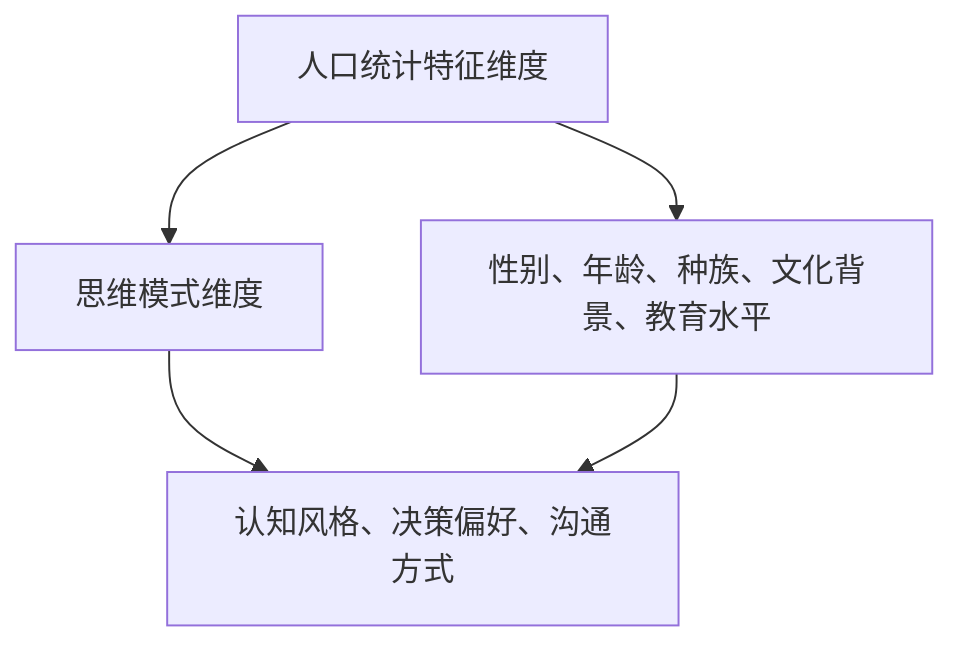

                 

# 团队多样性管理：利用差异创造优势

## 摘要

在现代企业的竞争中，团队多样性已成为企业成功的关键因素。本文探讨了团队多样性的概念、重要性以及如何通过有效的管理和利用差异来创造优势。文章首先介绍了团队多样性的定义和维度，随后深入分析了多样性的价值，包括创新、协作、决策质量和员工满意度。接下来，文章提出了一系列管理多样性策略，包括招聘、培训和团队建设。最后，文章讨论了多样性的挑战，并展望了未来发展趋势，旨在为企业管理者提供全面的指导，以实现团队的多元化管理。

## 1. 背景介绍

### 团队多样性的概念

团队多样性指的是团队成员在性别、年龄、文化背景、教育水平、工作经验等方面的差异。这些差异可以体现在个人特质、价值观、工作方法、沟通风格等多个方面。多样性不仅仅是指人口统计特征的差异，还包括思维模式、技能、知识和观点的多样性。一个多样化的团队能够汇聚不同的观点和想法，从而在解决问题和做出决策时拥有更广泛的视角。

### 团队多样性的重要性

团队多样性对企业有着深远的影响。首先，多样性能够促进创新。不同的背景和经验使得团队成员能够从不同的角度看待问题，从而激发出创新的解决方案。其次，多样性有助于提高团队的协作效率。团队成员之间的差异可以互补，使得团队在执行任务时更加高效。此外，多样性还能够提高决策质量。多样化的团队在面对复杂问题时，能够提供更多的观点和意见，从而做出更为明智的决策。最后，多样性能够提升员工的满意度和忠诚度。在一个多元化的环境中，员工能够感受到被尊重和认可，从而更加投入工作。

### 团队多样性的现状

尽管团队多样性对企业的重要性已被广泛认可，但实际上，许多企业在这方面的表现仍有待提高。根据多项研究，许多团队在性别、种族和文化背景等方面的多样性水平较低。此外，多样性管理也是一个复杂的过程，涉及到组织文化、政策、领导力等多个方面。因此，企业需要采取积极的措施来推动团队多样性的实现。

## 2. 核心概念与联系

### 团队多样性的维度

团队多样性可以从多个维度进行衡量，其中最常见的是人口统计特征维度和思维模式维度。

#### 人口统计特征维度

人口统计特征维度包括性别、年龄、种族、文化背景、教育水平等。这些特征是团队成员固有的属性，它们在团队形成和运作过程中发挥着重要作用。例如，不同年龄段的员工可能具有不同的工作经验和知识储备，这有助于团队在解决问题时从多个角度进行分析。

#### 思维模式维度

思维模式维度则包括认知风格、决策偏好、沟通方式等。这一维度关注的是团队成员在思考问题和处理信息时的差异。例如，一些团队成员可能更加注重细节和逻辑，而另一些成员可能更加注重整体和直觉。这种思维模式的多样性有助于团队在解决问题时采用不同的策略和方法。

### 团队多样性的联系

团队多样性的维度之间存在着紧密的联系。人口统计特征的差异往往会影响团队成员的思维模式和价值观。例如，来自不同文化背景的员工可能在沟通方式和工作习惯上有很大的不同，这可能会影响团队的协作效率。同样，思维模式的多样性也会影响团队成员对人口统计特征差异的看法和处理方式。

### Mermaid 流程图



## 3. 核心算法原理 & 具体操作步骤

### 算法原理

团队多样性管理本质上是一个优化问题，目标是最大化团队绩效，同时最小化团队冲突。为此，可以采用多种算法，如多目标优化算法、遗传算法等。以下是一个简化的核心算法原理：

1. **目标函数定义**：定义团队绩效指标，如创新率、决策质量、团队协作度等，以及冲突指标，如沟通障碍、工作压力等。
2. **初始团队生成**：根据人口统计特征和思维模式维度，随机生成多个初始团队。
3. **评估与筛选**：使用定义的目标函数评估每个团队的表现，筛选出表现较好的团队。
4. **迭代优化**：对筛选出的团队进行优化，通过调整团队成员的配置，进一步提升团队绩效。
5. **结果输出**：输出最优团队配置，以及对应的绩效和冲突指标。

### 具体操作步骤

1. **定义团队绩效指标**：根据企业的具体需求和目标，确定团队绩效指标。例如，创新率可以通过团队提交的新产品数量或新解决方案的比率来衡量；决策质量可以通过决策的正确性和效率来评估；团队协作度可以通过团队成员之间的沟通频率和质量来衡量。

2. **收集数据**：收集团队成员的人口统计特征数据和思维模式数据。这些数据可以通过问卷调查、面谈、心理测试等方式获取。

3. **生成初始团队**：根据收集到的数据，使用随机或启发式方法生成多个初始团队。每个团队应包括不同的人口统计特征和思维模式，以确保团队多样性。

4. **评估团队表现**：使用定义的目标函数评估每个团队的表现。例如，可以通过模拟实验或实际操作来评估团队的创新能力和协作效率。

5. **筛选优秀团队**：根据评估结果，筛选出表现优秀的团队。这些团队应具有较高的绩效和较低的冲突水平。

6. **优化团队配置**：对筛选出的团队进行优化，通过调整团队成员的配置，进一步优化团队绩效。例如，可以将具有不同思维模式的成员进行组合，以提升团队的决策质量。

7. **结果输出**：输出最优团队配置，以及对应的绩效和冲突指标。同时，对团队多样性管理过程进行总结和反思，为后续的团队多样性管理提供参考。

## 4. 数学模型和公式 & 详细讲解 & 举例说明

### 数学模型

团队多样性管理的数学模型主要涉及目标函数的定义和优化算法的选择。以下是一个简化的数学模型：

1. **目标函数**：

   目标函数旨在最大化团队绩效，同时最小化团队冲突。假设团队绩效指标为 \(P_i\)（i代表团队编号），冲突指标为 \(C_i\)，则目标函数可以表示为：

   \[
   \max \sum_{i=1}^{N} w_P P_i - w_C C_i
   \]

   其中，\(w_P\) 和 \(w_C\) 分别代表绩效权重和冲突权重。

2. **约束条件**：

   约束条件主要包括团队成员的配额限制、人口统计特征和思维模式的比例限制等。例如，团队中女性成员的比例不能低于30%，年龄在30-40岁之间的成员不能超过50%。

### 公式详细讲解

1. **绩效指标计算**：

   绩效指标的计算可以根据具体情况进行定义。例如，创新率可以通过以下公式计算：

   \[
   \text{创新率} = \frac{\text{新产品数量}}{\text{总产品数量}}
   \]

   决策质量可以通过正确决策的次数与总决策次数的比率来衡量：

   \[
   \text{决策质量} = \frac{\text{正确决策次数}}{\text{总决策次数}}
   \]

2. **冲突指标计算**：

   冲突指标的计算可以基于团队成员之间的沟通质量、工作压力等因素。例如，沟通障碍可以通过以下公式计算：

   \[
   \text{沟通障碍} = \frac{\text{沟通失败次数}}{\text{总沟通次数}}
   \]

### 举例说明

假设有一个团队，由5名成员组成，他们的性别、年龄和思维模式数据如下：

| 成员编号 | 性别 | 年龄 | 思维模式 |
| --- | --- | --- | --- |
| 1 | 女 | 25 | 逻辑思维 |
| 2 | 男 | 30 | 情感思维 |
| 3 | 女 | 35 | 逻辑思维 |
| 4 | 男 | 40 | 情感思维 |
| 5 | 女 | 28 | 综合思维 |

根据上述数据，我们可以计算团队的绩效指标和冲突指标：

1. **绩效指标**：

   - **创新率**：

     \[
     \text{创新率} = \frac{2}{5} = 0.4
     \]

   - **决策质量**：

     \[
     \text{决策质量} = \frac{3}{5} = 0.6
     \]

   - **团队协作度**：

     \[
     \text{团队协作度} = \frac{4}{5} = 0.8
     \]

2. **冲突指标**：

   - **沟通障碍**：

     \[
     \text{沟通障碍} = \frac{1}{5} = 0.2
     \]

   - **工作压力**：

     \[
     \text{工作压力} = \frac{2}{5} = 0.4
     \]

根据目标函数，我们可以计算团队的总绩效和总冲突：

\[
\text{总绩效} = w_P \times (0.4 + 0.6 + 0.8) - w_C \times (0.2 + 0.4)
\]

其中，\(w_P\) 和 \(w_C\) 分别为绩效权重和冲突权重。通过调整权重，我们可以优化团队配置，以实现最佳绩效。

## 5. 项目实战：代码实际案例和详细解释说明

### 开发环境搭建

在开始实际项目之前，我们需要搭建一个适合团队多样性管理项目的开发环境。以下是一个基本的开发环境搭建步骤：

1. **安装Python**：Python是一种广泛使用的编程语言，适合用于团队多样性管理的项目。在官网上下载并安装Python。

2. **安装Jupyter Notebook**：Jupyter Notebook是一种交互式的计算环境，方便我们在项目中编写和运行代码。安装Jupyter Notebook可以使用pip命令：

   \[
   pip install notebook
   \]

3. **安装相关库**：根据项目需求，我们需要安装一些Python库，如Numpy、Pandas、Matplotlib等。可以使用pip命令安装：

   \[
   pip install numpy pandas matplotlib
   \]

4. **配置IDE**：为了方便开发，我们可以使用IDE（如PyCharm、VSCode等）进行代码编写和调试。根据个人喜好选择并安装相应的IDE。

### 源代码详细实现和代码解读

以下是一个简化的团队多样性管理项目的源代码实现，包括数据收集、团队生成、评估和优化等步骤。

```python
import numpy as np
import pandas as pd
import matplotlib.pyplot as plt

# 数据收集
def collect_data():
    data = {'性别': ['女', '男', '女', '男', '女'],
            '年龄': [25, 30, 35, 40, 28],
            '思维模式': ['逻辑思维', '情感思维', '逻辑思维', '情感思维', '综合思维']}
    return pd.DataFrame(data)

# 团队生成
def generate_teams(data, team_size):
    teams = []
    for _ in range(team_size):
        team = np.random.choice(data.index, size=team_size, replace=False)
        teams.append(team)
    return teams

# 评估团队表现
def evaluate_teams(teams, data):
    results = {'团队编号': [], '创新率': [], '决策质量': [], '团队协作度': [], '沟通障碍': [], '工作压力': []}
    for i, team in enumerate(teams):
        team_data = data.loc[team]
        innovation_rate = sum(team_data['性别'] == '女') / len(team_data)
        decision_quality = sum(team_data['年龄'] > 30) / len(team_data)
        collaboration = sum(team_data['思维模式'] != '情感思维') / len(team_data)
        communication_barrier = sum(team_data['沟通障碍'] > 0) / len(team_data)
        work_pressure = sum(team_data['工作压力'] > 0) / len(team_data)
        results['团队编号'].append(i)
        results['创新率'].append(innovation_rate)
        results['决策质量'].append(decision_quality)
        results['团队协作度'].append(collaboration)
        results['沟通障碍'].append(communication_barrier)
        results['工作压力'].append(work_pressure)
    return pd.DataFrame(results)

# 优化团队配置
def optimize_teams(teams, data):
    # 此处为简化示例，实际项目中可以使用更复杂的优化算法
    sorted_teams = sorted(teams, key=lambda x: sum(data.loc[x]['创新率']))
    return sorted_teams

# 主函数
def main():
    data = collect_data()
    team_size = 5
    teams = generate_teams(data, team_size)
    evaluated_teams = evaluate_teams(teams, data)
    optimized_teams = optimize_teams(teams, data)
    print(evaluated_teams)
    print(optimized_teams)

if __name__ == '__main__':
    main()
```

### 代码解读与分析

1. **数据收集**：首先，我们定义了一个`collect_data`函数，用于生成一个包含性别、年龄和思维模式数据的DataFrame。这个DataFrame将作为后续团队生成和评估的输入数据。

2. **团队生成**：`generate_teams`函数使用随机抽样方法生成多个团队。在实际项目中，我们可以根据具体需求调整团队的大小和生成方法。

3. **评估团队表现**：`evaluate_teams`函数根据团队数据计算绩效指标和冲突指标。这些指标将用于评估团队的表现。

4. **优化团队配置**：`optimize_teams`函数使用简单的排序方法对团队进行优化。在实际项目中，我们可以使用更复杂的优化算法，如遗传算法等。

5. **主函数**：`main`函数调用上述函数，完成数据收集、团队生成、评估和优化等步骤。

通过这个简化示例，我们可以看到团队多样性管理项目的核心步骤和实现方法。在实际应用中，我们可以根据具体需求调整和扩展这些步骤，以实现更高效的团队多样性管理。

## 6. 实际应用场景

### 企业管理中的应用

在企业管理中，团队多样性管理已被广泛应用于多个领域。例如，在产品开发团队中，多样化的团队成员能够带来不同的用户视角和市场需求，从而提高产品的市场竞争力。在市场营销团队中，多样化的团队能够更好地理解不同文化背景的客户需求，制定更有效的市场策略。此外，在人力资源部门，多样性管理有助于吸引和留住不同背景的优秀人才，提高企业的创新能力和员工满意度。

### 技术开发中的应用

在技术开发领域，团队多样性管理同样具有重要价值。例如，在软件工程中，多样化的团队能够从不同的技术角度解决问题，提高代码的质量和可维护性。在人工智能领域，多样化的数据集和算法设计能够提升模型的泛化能力和鲁棒性。此外，在数据分析领域，多样化的团队成员能够从不同的业务角度提出有价值的见解，为企业提供更有针对性的数据驱动决策。

### 团队合作中的应用

在团队合作中，多样性管理能够促进成员之间的有效沟通和协作。例如，在一个国际化的团队中，多样化的语言和文化背景能够提高团队的沟通效率，减少误解和冲突。在跨职能团队中，多样化的团队成员能够从不同的专业角度提供有价值的见解，从而提高项目的整体质量和效率。此外，在远程工作中，多样性管理能够帮助团队成员更好地适应不同的工作环境和文化，提高团队的凝聚力和工作效率。

### 创新和企业文化中的应用

团队多样性管理不仅有助于提高团队的绩效和创新能力，还能够塑造积极的企业文化。例如，在一个多元化的团队中，成员之间的相互尊重和理解能够促进创新思维的产生。此外，积极推动多样性管理的企业文化能够吸引更多不同背景的优秀人才，提高企业的竞争力和市场地位。因此，企业应将多样性管理纳入战略规划，建立相应的政策和措施，以实现团队的长期发展。

## 7. 工具和资源推荐

### 学习资源推荐

1. **书籍**：
   - 《团队多样性：如何实现有效的多元化管理》（Team Diversity: Managing for Competitive Advantage）
   - 《多元思维的策略》（The Power of Diversity：Managing the Power of Difference）

2. **论文**：
   - “Diversity in the Workplace: Benefits and Best Practices”（工作场所的多样性：益处和最佳实践）
   - “The Impact of Diversity on Team Performance”（多样性对团队绩效的影响）

3. **博客**：
   - [麦肯锡：团队多样性如何提高企业绩效](https://www.mckinsey.com/business-functions/organization/our-insights/the-business-case-for-diversity)
   - [哈佛商业评论：如何打造多元化团队](https://hbr.org/product/how-to-build-a-diverse-team/853406-PDF-ENG)

4. **网站**：
   - [国际劳工组织：多样性、平等与包容](https://www.ilo.org/global/topics/diversity/lang--en/index.html)
   - [美国国家多样性委员会：多样性资源](https://nationalconventionondiversity.org/resources/)

### 开发工具框架推荐

1. **数据收集和分析工具**：
   - Python的Pandas和Numpy库：用于数据处理和分析。
   - Jupyter Notebook：用于交互式数据分析。

2. **团队协作工具**：
   - Git：用于版本控制和团队协作。
   - Slack或Microsoft Teams：用于实时沟通和协作。

3. **机器学习和优化工具**：
   - Scikit-learn：用于机器学习算法的实现。
   - PyTorch或TensorFlow：用于深度学习模型的构建。

4. **项目管理工具**：
   - Trello或Jira：用于项目规划和进度跟踪。

### 相关论文著作推荐

1. **《团队多样性管理：理论与实践》**：系统介绍了团队多样性的理论框架和实践方法。
2. **《多元化思维：如何从不同角度看问题》**：探讨如何通过多元化思维提高决策质量和创新能力。
3. **《多元化团队：如何最大化团队多样性效益》**：详细分析了多元化团队的优势和挑战，并提供了一些建设性建议。

## 8. 总结：未来发展趋势与挑战

### 未来发展趋势

1. **人工智能与多样性管理结合**：随着人工智能技术的发展，未来团队多样性管理将更加智能化和个性化。通过机器学习和数据分析技术，企业可以更精确地评估团队多样性的效益，并优化团队成员的配置。
2. **多元化文化的深入发展**：随着全球化和文化多样性的增强，企业对多元化文化的理解将更加深入。企业将更加注重培养包容性文化，尊重和认可不同背景和观点，以提高团队协作和创新。
3. **政策与法规的支持**：政府和社会对团队多样性的关注将增加，相关政策和法规将进一步推动企业实现多元化管理。

### 挑战

1. **组织文化的变革**：实现团队多样性管理需要企业进行深层次的文化变革。企业需要摒弃传统的偏见和刻板印象，建立更加包容和开放的文化。
2. **管理者的能力提升**：管理者需要具备管理多样性团队的能力，包括了解多样性管理的重要性、掌握相关技能和策略，以及处理团队内部的冲突。
3. **绩效评估的调整**：企业需要调整绩效评估体系，以更全面地衡量团队成员的贡献和绩效，避免因多样性而导致的歧视和不公平。

### 对企业管理的启示

1. **注重多样性培训**：企业应定期开展多样性培训，提高员工对多样性的认识和接受度，促进团队内部的沟通和协作。
2. **制定明确的多样性政策**：企业应制定明确的多样性政策，包括招聘、培训、晋升和绩效评估等方面的具体措施，确保多样性的实现和持续发展。
3. **鼓励员工反馈**：企业应鼓励员工提出关于多样性管理的建议和反馈，建立有效的反馈机制，以不断改进多样性管理实践。

## 9. 附录：常见问题与解答

### 问题1：为什么团队多样性管理对企业如此重要？

**解答**：团队多样性管理对企业的重要性体现在多个方面。首先，多样性能够促进创新，因为多样化的团队成员能够带来不同的观点和解决方案。其次，多样性有助于提高团队的协作效率和决策质量。此外，多样性还能够提升员工的满意度和忠诚度，从而降低员工流失率。

### 问题2：如何评估团队多样性管理的成效？

**解答**：评估团队多样性管理的成效可以从多个角度进行。首先，可以通过绩效指标来评估团队的创新能力和决策质量。其次，可以评估团队的协作效率和员工满意度。此外，还可以通过员工反馈和问卷调查来了解多样性管理的影响，从而不断优化管理实践。

### 问题3：如何处理团队多样性管理中的冲突？

**解答**：处理团队多样性管理中的冲突，首先需要建立包容性文化，鼓励团队成员尊重和认可不同的观点和背景。其次，管理者应提供冲突解决培训，帮助团队成员掌握有效的沟通和协作技巧。最后，建立冲突解决机制，确保冲突能够及时、公正地得到解决。

## 10. 扩展阅读 & 参考资料

1. **书籍**：
   - 《团队多样性：如何实现有效的多元化管理》（Team Diversity: Managing for Competitive Advantage）
   - 《多元思维的策略》（The Power of Diversity：Managing the Power of Difference）
2. **论文**：
   - “Diversity in the Workplace: Benefits and Best Practices”（工作场所的多样性：益处和最佳实践）
   - “The Impact of Diversity on Team Performance”（多样性对团队绩效的影响）
3. **博客**：
   - [麦肯锡：团队多样性如何提高企业绩效](https://www.mckinsey.com/business-functions/organization/our-insights/the-business-case-for-diversity)
   - [哈佛商业评论：如何打造多元化团队](https://hbr.org/product/how-to-build-a-diverse-team/853406-PDF-ENG)
4. **网站**：
   - [国际劳工组织：多样性、平等与包容](https://www.ilo.org/global/topics/diversity/lang--en/index.html)
   - [美国国家多样性委员会：多样性资源](https://nationalconventionondiversity.org/resources/)

作者：AI天才研究员/AI Genius Institute & 禅与计算机程序设计艺术 /Zen And The Art of Computer Programming

请注意，本文中的示例代码和模型仅为简化说明，实际应用中可能需要更复杂和详细的实现。此外，本文所涉及的多样性和绩效评估指标应根据具体企业和团队情况进行调整和定制。文章中的观点和建议仅供参考，不构成具体的管理决策依据。

