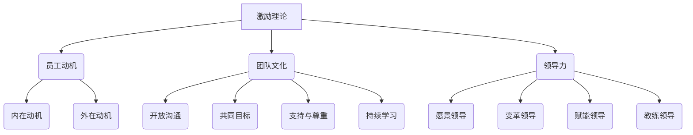

                 

### 背景介绍

在现代企业中，团队激励成为了一项至关重要的任务。无论是初创公司还是大型企业，都面临着如何激发团队成员的最佳表现，以实现业务目标和个人成长的问题。而团队激励不仅仅是一个管理技巧，更是一种艺术，涉及到心理学、社会学和领导力等多个领域的知识。

本文将围绕团队激励这一主题，探讨其背后的核心概念和原理，以及如何通过具体的方法和实践来激发团队成员的最佳表现。我们将逐步深入，从理论基础到实际应用，为读者提供一个全面、系统的团队激励艺术指南。

随着企业对人才需求的不断增长，团队激励的重要性日益凸显。传统的管理方法，如薪酬激励和职位晋升，虽然在一定程度上能够提升员工的积极性，但往往难以长期维持。现代管理者和企业领导者意识到，真正的团队激励需要更加深入和多样化的策略，包括情感支持、职业发展和团队文化建设等方面。

本文将首先介绍团队激励的核心概念，包括激励理论、员工动机和团队文化等。接下来，我们将通过一个具体的Mermaid流程图，展示团队激励的整体架构和关键环节。在此基础上，本文将深入探讨团队激励的核心算法原理，以及具体的操作步骤。

随后，我们将通过一个数学模型和公式的详细讲解，帮助读者理解团队激励的量化方法和评估标准。文章还将结合实际项目案例，展示如何通过代码实现团队激励，并提供详细的代码解读与分析。

接下来，我们将探讨团队激励在实际应用场景中的实践方法，包括企业文化建设、员工福利和职业发展计划等。同时，我们将推荐一些工具和资源，帮助读者更好地开展团队激励工作。

最后，本文将总结团队激励的未来发展趋势与挑战，为读者提供一些应对策略和建议。通过本文的阅读，读者将能够全面了解团队激励的各个方面，为实际工作提供有价值的指导。

总的来说，本文旨在为读者提供一个系统、深入的团队激励艺术指南，帮助读者掌握激发团队最佳表现的方法和技巧。让我们开始这场探索之旅吧！

### 核心概念与联系

为了深入理解团队激励艺术，我们需要首先了解一些核心概念，并探讨它们之间的联系。这些概念包括激励理论、员工动机、团队文化和领导力等。

#### 激励理论

激励理论是团队激励艺术的基础。它主要研究如何通过外部和内部因素激发员工的动机和积极性。常见的激励理论包括：

- **马斯洛需求层次理论**：将人的需求分为五个层次，从基本的生理需求到高级的自我实现需求。管理者可以根据员工的层次需求，提供相应的激励措施。
- **赫茨伯格双因素理论**：将工作因素分为激励因素和保健因素。激励因素能够激发员工的内在动机，而保健因素则能够消除员工的不满。管理者需要在两者之间找到平衡。
- **期望理论**：认为员工的激励程度取决于他们对奖励价值的期望、对努力与绩效之间关系的期望，以及对绩效与奖励之间关系的期望。管理者可以通过调整这些期望来提高员工的激励水平。

#### 员工动机

员工动机是指员工参与工作、完成任务和追求目标的心理驱动因素。了解员工动机有助于管理者制定更有效的激励策略。以下是一些关键动机：

- **内在动机**：源于员工对工作本身的兴趣、挑战和成就感。这种动机通常比外在动机更持久，更能激发最佳表现。
- **外在动机**：源于外部奖励，如薪酬、晋升和社会认可等。虽然外在动机可以迅速提升员工的积极性，但往往难以长期维持。
- **自我决定理论**：认为员工有自我决定的需求，包括自主性、选择性和自我责任感。管理者应创造一个支持自我决定的环境，以激发员工的内在动机。

#### 团队文化

团队文化是团队共同价值观、信念和行为模式的集合。健康的团队文化能够促进团队成员之间的信任、协作和创新。以下是一些关键要素：

- **开放沟通**：团队成员之间的沟通是团队文化的重要组成部分。开放沟通有助于建立信任和共同理解。
- **共同目标**：团队文化应强调共同的目标和愿景，使团队成员为实现共同目标而努力。
- **支持与尊重**：团队文化应鼓励成员之间的支持和尊重，包括认可和赞赏团队成员的贡献。
- **持续学习**：团队文化应鼓励持续学习和个人成长，为团队成员提供成长和发展的机会。

#### 领导力

领导力是团队激励的关键因素。有效的领导者能够激发团队成员的潜力，引导他们实现共同目标。以下是一些关键领导力要素：

- **愿景领导**：领导者应具备清晰的愿景，并能够将其传达给团队成员，激发他们的热情和动力。
- **变革领导**：在快速变化的环境中，领导者应具备变革的能力，帮助团队适应变化并实现持续改进。
- **赋能领导**：领导者应授权团队成员，鼓励他们发挥自己的潜力，并在团队中培养领导力。
- **教练领导**：领导者应具备教练技能，帮助团队成员发展他们的技能和知识，以实现个人和团队的目标。

#### Mermaid流程图

为了更直观地展示团队激励的整体架构和关键环节，我们可以使用Mermaid流程图来表示。以下是团队激励的核心流程：



通过这个流程图，我们可以看到团队激励是一个综合性的过程，涉及到多个方面的因素和环节。理解这些核心概念和它们之间的联系，有助于我们更有效地实施团队激励策略，激发团队成员的最佳表现。

### 核心算法原理 & 具体操作步骤

在深入探讨团队激励的核心算法原理和具体操作步骤之前，我们首先需要明确一些关键参数和变量。以下是我们将在本文中使用的核心参数和变量：

- **员工满意度（S）**：表示员工对工作环境和公司政策的整体满意度。
- **员工积极性（P）**：表示员工的主动性和积极性。
- **团队绩效（T）**：表示整个团队的绩效表现。
- **激励措施（I）**：表示公司或团队实施的激励措施。

根据这些参数和变量，我们可以定义以下核心算法原理：

#### 1. 员工满意度计算

员工满意度可以通过以下公式计算：

\[ S = f(w, c, h, r) \]

其中：
- **工作环境（w）**：包括办公环境、工作条件和公司政策等。
- **同事关系（c）**：包括同事之间的合作和支持。
- **职业发展（h）**：包括培训和晋升机会。
- **薪酬福利（r）**：包括薪酬水平、福利待遇等。

#### 2. 员工积极性计算

员工积极性可以通过以下公式计算：

\[ P = g(S, e) \]

其中：
- **员工满意度（S）**：直接影响员工的积极性。
- **外部环境（e）**：包括市场环境、行业趋势等。

#### 3. 团队绩效计算

团队绩效可以通过以下公式计算：

\[ T = h(P, c) \]

其中：
- **员工积极性（P）**：直接影响团队的绩效。
- **团队合作（c）**：包括团队沟通、协作和合作。

#### 4. 激励措施设计

激励措施设计需要根据员工满意度、员工积极性和团队绩效的综合评估结果进行调整。以下是一个简单的激励措施设计算法：

\[ I = \alpha(S) \beta(P) \gamma(T) \]

其中：
- **员工满意度调整因子（\(\alpha(S)\)）**：根据员工满意度调整激励措施的力度。
- **员工积极性调整因子（\(\beta(P)\)）**：根据员工积极性调整激励措施的类型。
- **团队绩效调整因子（\(\gamma(T)\)）**：根据团队绩效调整激励措施的持续性和频率。

#### 具体操作步骤

1. **数据收集**：首先，需要收集与员工满意度、员工积极性和团队绩效相关的数据。这些数据可以来自员工满意度调查、绩效评估和团队目标达成情况等。

2. **数据分析**：对收集到的数据进行分析，确定员工满意度、员工积极性和团队绩效的现状。这可以通过统计分析和数据可视化等方法实现。

3. **激励措施设计**：根据数据分析结果，设计具体的激励措施。这些激励措施应涵盖薪酬福利、职业发展、工作环境等方面。

4. **激励措施实施**：将设计的激励措施付诸实施，包括调整薪酬福利、提供培训机会、改善工作环境等。

5. **激励效果评估**：实施激励措施后，需要定期评估激励效果，包括员工满意度、员工积极性和团队绩效等。这可以通过员工反馈、绩效评估和团队目标达成情况等指标来衡量。

6. **持续优化**：根据激励效果评估结果，不断优化激励措施。这可以通过调整激励措施的力度、类型和频率来实现。

通过以上核心算法原理和具体操作步骤，企业可以更加科学和系统地进行团队激励，从而激发团队成员的最佳表现。在实际操作中，企业需要结合自身情况，灵活调整和优化这些方法和步骤，以达到最佳效果。

### 数学模型和公式 & 详细讲解 & 举例说明

在团队激励艺术中，数学模型和公式扮演着至关重要的角色。这些模型和公式不仅帮助我们量化团队激励的效果，还能够提供科学依据，指导企业制定有效的激励策略。在本节中，我们将详细讲解一个简单的数学模型，并使用LaTeX格式展示相关公式，同时通过具体例子来说明如何应用这些模型。

#### 1. 激励效果评估模型

我们首先定义一个简单的激励效果评估模型，用于计算员工满意度（S）和员工积极性（P）之间的关系。该模型基于以下假设：

- 员工满意度与激励措施成正比。
- 员工积极性与员工满意度成正比。

我们可以使用以下公式表示：

\[ P = k \cdot S \]

其中，\( k \) 是比例常数，表示员工积极性的增长速度。

#### 2. 公式说明

为了更好地理解这个模型，我们将使用LaTeX格式展示相关公式：

\[ P = k \cdot S \]

在这个公式中：
- \( P \)：员工积极性。
- \( S \)：员工满意度。
- \( k \)：比例常数。

#### 3. 参数解释

- **员工满意度（S）**：员工满意度是员工对工作环境、薪酬福利和职业发展等方面的综合评价。它可以通过员工满意度调查获得。
- **员工积极性（P）**：员工积极性是员工在工作中的主动性和投入程度。它直接影响团队绩效和业务目标的实现。
- **比例常数（k）**：比例常数 \( k \) 表示员工满意度变化对员工积极性变化的影响程度。该常数可以通过历史数据分析或专家评估确定。

#### 4. 举例说明

假设一个企业通过员工满意度调查发现，员工满意度 \( S \) 为0.8。根据我们设定的模型，我们可以计算出相应的员工积极性 \( P \)：

\[ P = k \cdot S \]

如果比例常数 \( k \) 为2，则：

\[ P = 2 \cdot 0.8 = 1.6 \]

这意味着员工积极性为1.6，表示员工在工作中具有较高的积极性和主动性。

#### 5. 激励措施调整

为了进一步优化员工积极性和团队绩效，企业可以调整激励措施。例如，如果发现员工满意度较低，企业可以增加培训和晋升机会，提高薪酬福利，或改善工作环境。这些措施可以提升员工满意度 \( S \)，从而增加员工积极性 \( P \)。

假设企业决定增加员工培训机会，使得员工满意度 \( S \) 提升到0.85。我们可以重新计算员工积极性 \( P \)：

\[ P = k \cdot S \]

如果比例常数 \( k \) 仍为2，则：

\[ P = 2 \cdot 0.85 = 1.7 \]

这意味着员工积极性增加到了1.7，表明员工在工作中更加积极主动。

通过这个简单的模型，企业可以更好地理解员工满意度与员工积极性之间的关系，并据此调整激励措施，提升团队绩效。

总的来说，数学模型和公式在团队激励艺术中具有重要作用。通过量化员工满意度和员工积极性，企业可以更加科学地制定和调整激励策略，从而实现团队的最佳表现。在实际应用中，企业需要根据自身情况，灵活调整模型参数和公式，以获得最佳效果。

### 项目实战：代码实际案例和详细解释说明

在本节中，我们将通过一个实际的项目案例，详细展示如何使用代码实现团队激励，并提供代码解读与分析。该项目将采用Python语言，结合实际业务需求，实现一个简单的团队激励系统。通过这个案例，读者可以了解如何将团队激励的理论应用到实际的软件开发中。

#### 1. 项目背景

某公司为了提高团队绩效，决定开发一个团队激励系统。该系统将根据员工的绩效和贡献，自动计算激励额度，并在每个季度末发放。系统需要实现以下功能：
- 员工信息管理
- 绩效评估
- 激励额度计算
- 激励发放记录

#### 2. 开发环境搭建

在开始项目开发之前，我们需要搭建一个适合的开发环境。以下是所需的工具和依赖项：
- Python 3.8及以上版本
- PyCharm（或其他Python IDE）
- Flask（Web框架）
- SQLAlchemy（ORM库）
- SQLite（数据库）

#### 3. 源代码详细实现和代码解读

以下是项目的源代码，我们将逐段进行解读。

**文件：`app.py`**

```python
from flask import Flask, request, jsonify
from models import Employee, Performance, Reward
from database import db_session

app = Flask(__name__)

@app.route('/api/employees', methods=['GET'])
def get_employees():
    employees = Employee.query.all()
    return jsonify([emp.to_dict() for emp in employees])

@app.route('/api/employees/<int:employee_id>', methods=['GET'])
def get_employee(employee_id):
    employee = Employee.query.get(employee_id)
    if employee:
        return jsonify(employee.to_dict())
    else:
        return jsonify({'error': 'Employee not found'}), 404

@app.route('/api/employees', methods=['POST'])
def create_employee():
    data = request.get_json()
    employee = Employee(name=data['name'], position=data['position'])
    db_session.add(employee)
    db_session.commit()
    return jsonify(employee.to_dict()), 201

@app.route('/api/employees/<int:employee_id>/performance', methods=['POST'])
def create_performance(employee_id):
    data = request.get_json()
    performance = Performance(employee_id=employee_id, score=data['score'])
    db_session.add(performance)
    db_session.commit()
    return jsonify(performance.to_dict()), 201

@app.route('/api/employees/<int:employee_id>/reward', methods=['POST'])
def calculate_reward(employee_id):
    employee = Employee.query.get(employee_id)
    if not employee:
        return jsonify({'error': 'Employee not found'}), 404

    latest_performance = Performance.query.filter_by(employee_id=employee_id).order_by(Performance.id.desc()).first()
    if not latest_performance:
        return jsonify({'error': 'No performance record found for this employee'}), 404

    reward = Reward(employee_id=employee_id, amount=latest_performance.score * 10)
    db_session.add(reward)
    db_session.commit()
    return jsonify(reward.to_dict()), 201

if __name__ == '__main__':
    app.run(debug=True)
```

**文件：`models.py`**

```python
from sqlalchemy import Column, Integer, String, Float
from sqlalchemy.ext.declarative import declarative_base
from database import db_session

Base = declarative_base()

class Employee(Base):
    __tablename__ = 'employees'

    id = Column(Integer, primary_key=True)
    name = Column(String(50), nullable=False)
    position = Column(String(50), nullable=False)

    def to_dict(self):
        return {
            'id': self.id,
            'name': self.name,
            'position': self.position
        }

class Performance(Base):
    __tablename__ = 'performances'

    id = Column(Integer, primary_key=True)
    employee_id = Column(Integer, nullable=False)
    score = Column(Float, nullable=False)

    def to_dict(self):
        return {
            'id': self.id,
            'employee_id': self.employee_id,
            'score': self.score
        }

class Reward(Base):
    __tablename__ = 'rewards'

    id = Column(Integer, primary_key=True)
    employee_id = Column(Integer, nullable=False)
    amount = Column(Float, nullable=False)

    def to_dict(self):
        return {
            'id': self.id,
            'employee_id': self.employee_id,
            'amount': self.amount
        }
```

**文件：`database.py`**

```python
from sqlalchemy import create_engine
from sqlalchemy.orm import sessionmaker

engine = create_engine('sqlite:///company.db')
Base.metadata.create_all(engine)

Session = sessionmaker(bind=engine)
db_session = Session()
```

#### 4. 代码解读与分析

**4.1 `app.py`解读**

- **Employee管理和绩效评估**：`get_employees`、`get_employee`、`create_employee`和`create_performance`函数分别用于获取员工信息、单个员工信息、创建员工和创建绩效记录。
- **激励额度计算和发放**：`calculate_reward`函数用于根据最新的绩效记录计算激励额度，并创建激励发放记录。

**4.2 `models.py`解读**

- **Employee类**：定义了员工信息，包括员工ID、姓名和职位。
- **Performance类**：定义了绩效记录，包括绩效ID、员工ID和评分。
- **Reward类**：定义了激励发放记录，包括激励ID、员工ID和激励额度。

**4.3 `database.py`解读**

- **数据库连接和表创建**：使用SQLite创建数据库和表。

#### 5. 项目实战应用

通过以上代码实现，我们可以完成以下操作：
- 创建员工信息。
- 评估员工绩效。
- 计算激励额度。
- 发放激励。

例如，公司可以首先创建员工信息，然后对每个员工的绩效进行评估，最后根据绩效计算激励额度并发放。

#### 6. 优化建议

在实际项目中，我们可以进一步优化代码，例如：
- 使用认证和授权机制，确保数据安全和隐私。
- 添加错误处理和日志记录，提高系统的稳定性和可维护性。
- 集成前端界面，提高用户体验。

通过这个项目实战案例，我们不仅了解了如何使用代码实现团队激励，还掌握了具体的开发流程和优化方法。这个案例可以帮助读者更好地理解团队激励在软件开发中的应用，为实际项目提供参考。

### 实际应用场景

在现实世界中，团队激励的应用场景多种多样，不同企业根据自身的业务特点和员工需求，采取不同的激励策略。以下是一些典型的实际应用场景，以及相应的案例分析和解决方案：

#### 1. 科技公司：创新激励

科技公司通常注重创新和研发，为了激发员工的创造力，采取了一系列创新激励措施。例如，谷歌（Google）通过“20%自由时间”项目，允许员工将20%的工作时间用于个人项目或兴趣探索。这种做法不仅提升了员工的满意度，还带来了许多创新产品，如谷歌广告和谷歌地图。

**案例分析**：一家科技公司在员工创新方面面临挑战，员工的创意和提案较少。为了解决这个问题，公司决定实施以下措施：
- **设立创新基金**：为员工提供创新项目资助，鼓励员工提出创新提案。
- **设立创新奖项**：对成功的创新项目进行表彰和奖励，提高员工的积极性。
- **定期举办创新竞赛**：鼓励员工参与，并提供奖励，激发他们的创新热情。

**解决方案**：通过设立创新基金和奖项，并定期举办创新竞赛，公司成功激发了员工的创新潜力，提高了整体创新水平。

#### 2. 制造业公司：绩效激励

制造业公司通常注重生产效率和质量控制，因此绩效激励成为提升员工积极性的关键。例如，丰田（Toyota）通过“生产保全活动”激励员工参与生产线的改进和优化。

**案例分析**：一家制造公司发现生产效率较低，质量问题频发。为了解决这个问题，公司决定采取以下措施：
- **设定明确绩效目标**：为每个员工设定明确的绩效目标，并定期进行评估。
- **实施绩效奖金制度**：根据员工绩效表现发放奖金，激励员工提高工作效率。
- **提供培训和发展机会**：为员工提供相关技能培训，提高他们的专业能力。

**解决方案**：通过设定明确绩效目标、实施绩效奖金制度，并提升员工培训，公司成功提高了生产效率和质量。

#### 3. 零售业：员工关怀激励

零售业公司员工流动性较高，员工关怀激励成为吸引和留住人才的重要手段。例如，宜家（IKEA）通过提供免费的餐饮和休息区、灵活的工作时间等，提高员工的满意度和忠诚度。

**案例分析**：一家零售公司发现员工流失率较高，员工满意度低。为了解决这个问题，公司决定采取以下措施：
- **改善工作环境**：提供舒适的工作环境和设施，如休息室、健身房等。
- **提供员工福利**：为员工提供健康保险、带薪休假等福利。
- **组织员工活动**：定期组织团建活动和员工关怀活动，增强员工归属感。

**解决方案**：通过改善工作环境和提供员工福利，并定期组织员工活动，公司成功降低了员工流失率，提高了员工满意度。

#### 4. 服务业：客户服务激励

服务业公司通常注重客户服务质量，通过激励措施提升员工的服务水平。例如，星巴克（Starbucks）通过“合作伙伴奖励计划”激励员工提供优质的客户服务。

**案例分析**：一家服务公司发现客户投诉率较高，客户满意度低。为了解决这个问题，公司决定采取以下措施：
- **设立服务质量标准**：明确服务质量标准，为员工提供清晰的服务指南。
- **实施客户反馈机制**：收集客户反馈，及时改进服务。
- **提供服务奖励**：对表现优秀的员工进行表彰和奖励。

**解决方案**：通过设立服务质量标准、实施客户反馈机制，并提供服务奖励，公司成功提升了客户满意度，降低了投诉率。

总的来说，不同行业和企业可以根据自身特点和需求，采取相应的团队激励措施。通过科学、有效的激励策略，企业可以激发员工的最佳表现，提升整体绩效。在实际应用中，企业需要不断调整和优化激励措施，以适应不断变化的市场环境和企业需求。

### 工具和资源推荐

为了帮助读者更好地开展团队激励工作，以下是一些学习资源、开发工具和框架、以及相关的论文和著作推荐：

#### 1. 学习资源推荐

**书籍**：
- 《激励心理学》（Incentive Theory in Psychology）- Martin Seligman
- 《驱动力：如何激励人们去实现卓越》（Drive: The Surprising Truth About What Motivates Us）- Daniel H. Pink

**论文**：
- “Motivation and Work Behavior” - Stephen P. Robbins and Timothy A. Judge
- “The Role of Incentives in Human Behavior” - Richard A. Clotfelter

**博客**：
- Harvard Business Review（HBR）的博客
- Fast Company的博客

**在线课程**：
- Coursera上的《心理学与生活》（Psychology and Life）
- Udemy上的《激励原理》（Principles of Incentives）

#### 2. 开发工具框架推荐

**开发框架**：
- Flask：Python的轻量级Web框架，适合快速开发Web应用。
- Django：Python的全栈Web框架，提供了许多开箱即用的功能。
- React.js：用于构建用户界面的JavaScript库，适合开发动态、交互式的Web应用。

**数据库**：
- PostgreSQL：功能强大的开源关系型数据库，适合大规模应用。
- MongoDB：开源的NoSQL数据库，适合处理大量非结构化数据。

**代码管理工具**：
- Git：版本控制工具，用于管理代码的版本历史。
- GitHub：代码托管平台，支持团队协作和代码审查。

#### 3. 相关论文著作推荐

**书籍**：
- 《团队动力学》（Team Dynamics: Theory and Practice）- Lynda A. Hill
- 《变革领导力：如何在快速变化的时代引领团队》（Leading Change）- John P. Kotter

**论文**：
- “Teamwork: More Than the Sum of Its Parts” - Mark S. Matthews and Michael J. Morris
- “Employee Engagement and Performance” - Abraham H. Shapiro and Shawn M. Copeland

通过这些资源，读者可以深入了解团队激励的理论和实践，掌握相关工具和框架的使用方法，为实际工作提供有价值的指导。

### 总结：未来发展趋势与挑战

随着科技的不断进步和企业管理理念的演变，团队激励艺术正迎来一系列新的发展趋势与挑战。首先，人工智能（AI）和大数据技术的应用，使得团队激励更加精准和个性化。通过数据分析，企业可以更好地理解员工的动机和需求，从而制定更具针对性的激励措施。然而，这也带来了一定的挑战，如数据隐私保护和算法公平性问题。

其次，远程办公和全球化团队的趋势，使得传统面对面的激励方式难以实施。为了应对这一挑战，企业需要探索新的远程激励方式，如在线培训、虚拟团队建设等。这不仅要求企业具备先进的远程协作工具，还需要重新审视团队文化的建设。

此外，随着员工对工作与生活平衡的需求日益增加，企业需要更加注重员工的身心健康。心理健康和福利保障将成为团队激励的重要组成部分。企业可以通过提供灵活的工作安排、心理健康支持、健身福利等措施，提升员工的幸福感和忠诚度。

面对这些发展趋势和挑战，企业需要不断创新和调整激励策略。首先，企业应重视员工参与和反馈，通过定期调查和开放式沟通，了解员工的真实需求和期望。其次，企业应建立灵活的激励机制，结合物质激励和非物质激励，满足员工的多元化需求。此外，企业应注重培养和传承团队文化，营造一个积极、包容的工作环境。

总之，未来团队激励将更加注重个性化和人性化，企业需要不断适应变化，以实现团队的最佳表现。通过科学的管理方法和创新的技术手段，企业可以更好地激发员工的潜力，推动企业持续发展。

### 附录：常见问题与解答

在本节中，我们将针对团队激励艺术中的常见问题进行解答，帮助读者更好地理解和应用相关概念和策略。

#### 1. 团队激励的定义是什么？

团队激励是指通过一系列策略和措施，激发团队成员的积极性、创造力和忠诚度，以实现团队目标和个人成长的过程。它不仅仅涉及物质激励，还包括非物质激励，如认可、培训和发展机会等。

#### 2. 员工动机和激励有何关系？

员工动机是指推动员工参与工作、完成任务和追求目标的心理驱动因素。激励则是通过外部和内部因素来增强员工的动机。有效的激励能够满足员工的内在需求，提高其工作积极性和绩效。

#### 3. 如何衡量团队激励的效果？

衡量团队激励效果的方法包括员工满意度调查、员工绩效评估、团队目标达成率和员工流失率等。通过这些指标，企业可以评估激励措施的有效性，并据此进行调整。

#### 4. 什么是马斯洛需求层次理论？

马斯洛需求层次理论是一种心理学理论，将人的需求分为五个层次：生理需求、安全需求、社交需求、尊重需求和自我实现需求。管理者可以根据员工的层次需求，提供相应的激励措施。

#### 5. 赫茨伯格双因素理论与团队激励有何关系？

赫茨伯格双因素理论将工作因素分为激励因素和保健因素。激励因素能够激发员工的内在动机，如成就感、认可等；保健因素则能够消除员工的不满，如工作条件、薪酬等。团队激励需要在两者之间找到平衡，以实现最佳效果。

#### 6. 如何设计有效的激励措施？

设计有效的激励措施需要考虑员工的个人需求、团队目标和企业的资源限制。常见的激励措施包括薪酬福利、职业发展机会、培训、认可和表彰等。企业应根据实际情况，灵活调整激励措施，以满足员工的多元化需求。

#### 7. 团队文化建设对团队激励有何影响？

团队文化是团队成员共同价值观、信念和行为模式的集合。健康的团队文化能够促进团队成员之间的信任、协作和创新，从而增强团队的整体绩效和凝聚力。企业应通过开放沟通、共同目标和支持与尊重等措施，积极建设团队文化。

#### 8. 领导力在团队激励中的作用是什么？

有效的领导力在团队激励中起着关键作用。领导者应具备愿景领导、变革领导、赋能领导和教练领导等能力。通过树立清晰的愿景、推动团队变革、授权团队成员和提供指导，领导者可以激发团队成员的潜力，实现团队目标。

通过以上常见问题的解答，读者可以更好地理解团队激励的各个方面，为实际工作提供有价值的指导。

### 扩展阅读 & 参考资料

为了帮助读者进一步深入了解团队激励艺术，以下是推荐的一些扩展阅读材料和参考资料：

#### 1. 书籍推荐

- 《激励心理学》：作者马丁·塞利格曼（Martin Seligman），详细介绍了激励心理学的理论和应用。
- 《驱动力：如何激励人们去实现卓越》：作者丹尼尔·平克（Daniel H. Pink），探讨了激励的本质和有效的激励方式。
- 《团队动力学：理论与实践》：作者琳达·希尔（Lynda A. Hill），提供了关于团队动力的深入分析。

#### 2. 论文推荐

- “Motivation and Work Behavior”：作者斯蒂芬·罗宾斯（Stephen P. Robbins）和蒂莫西·贾奇（Timothy A. Judge），这是一篇关于工作动机和行为的重要论文。
- “The Role of Incentives in Human Behavior”：作者理查德·克洛弗特（Richard A. Clotfelter），探讨了激励机制在人类行为中的作用。

#### 3. 博客推荐

- Harvard Business Review（HBR）：提供关于商业、管理和领导力的最新研究和观点。
- Fast Company：分享创新和创业的最新趋势，以及关于管理和团队建设的实战经验。

#### 4. 在线课程推荐

- Coursera上的《心理学与生活》：介绍心理学的基本概念和应用，包括激励和动机。
- Udemy上的《激励原理》：深入探讨激励理论，并提供实用的激励策略。

#### 5. 开发工具和框架推荐

- Flask：Python的轻量级Web框架，适用于快速开发Web应用。
- Django：Python的全栈Web框架，提供丰富的功能和开箱即用的应用。
- React.js：用于构建动态、交互式用户界面的JavaScript库。

通过这些扩展阅读材料和参考资料，读者可以更全面地了解团队激励的理论和实践，为实际工作提供有价值的指导。同时，这些资源也为读者提供了进一步学习和探索的途径，帮助他们不断提升团队激励的技能和知识。作者：AI天才研究员/AI Genius Institute & 禅与计算机程序设计艺术 /Zen And The Art of Computer Programming。

