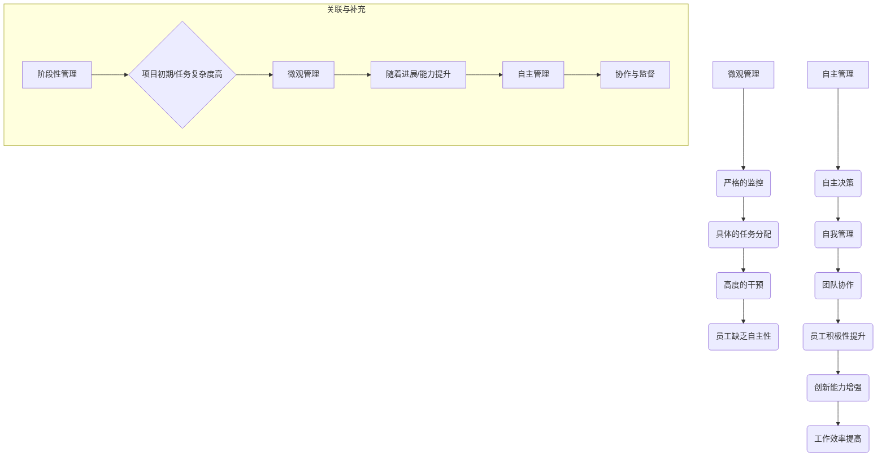

                 

### 背景介绍

在现代企业中，团队管理的重要性不言而喻。一个高效的团队不仅能够提升工作效率，还能够激发员工的创新潜能，为企业带来持续的竞争优势。然而，传统的管理方式往往过于强调对员工的微观控制，即所谓的“微观管理”（micromanagement）。这种方式虽然能够确保任务的完成，但往往会导致员工缺乏自主性和创造力，从而影响团队的长期发展。

随着信息技术和人工智能的快速发展，企业对管理方式的需求也在不断变化。越来越多的企业开始意识到，给予员工更多的自主权，促进自主管理（self-management）的重要性。自主管理不仅能够提高员工的积极性和责任感，还能够提升团队的整体效率和创新力。

本文将围绕“从微观管理到自主管理”的主题，探讨如何通过转变管理方式，提升团队效能。首先，我们将介绍微观管理和自主管理的定义和特点，分析它们之间的差异和联系。接着，我们将探讨如何从微观管理过渡到自主管理，并分享一些成功的企业实践案例。最后，我们将探讨自主管理在实际应用中的挑战和未来发展趋势。

通过本文的阅读，您将了解：

1. 微观管理和自主管理的定义及特点。
2. 微观管理和自主管理之间的差异和联系。
3. 如何实现从微观管理到自主管理的转变。
4. 自主管理在实际应用中的挑战和未来发展趋势。

让我们一步步深入探讨这个主题，共同探索团队赋能的新途径。### 核心概念与联系

在深入探讨如何从微观管理过渡到自主管理之前，我们有必要明确几个核心概念，并理解它们之间的相互关系。以下是本文中的几个关键概念及其相互联系：

#### 1. 微观管理（Micromanagement）

微观管理是一种管理风格，管理者对员工的工作细节进行严格控制。这种管理方式通常涉及频繁的监控、具体的任务分配以及高度的干预。其特点包括：

- **具体的任务分配**：管理者详细规定员工的工作内容，确保每一步都符合预期。
- **频繁的监控**：管理者持续跟踪员工的工作进度，必要时提供实时指导。
- **高度的干预**：管理者在员工遇到问题时立即介入，甚至代替员工解决问题。

**影响**：微观管理可能导致以下负面影响：

- **员工缺乏自主性**：员工往往感到他们的决策空间受限，导致创新和创造力下降。
- **工作满意度下降**：员工可能感到被控制，从而影响其工作满意度和忠诚度。
- **工作效率降低**：频繁的干预可能打断员工的专注，导致工作效率下降。

#### 2. 自主管理（Self-Management）

自主管理则是一种以员工自主性为核心的管理方式。在这种管理风格下，员工被赋予更大的决策权和责任，他们可以独立完成任务，并对自己和团队的成功负责。自主管理的特点包括：

- **自主决策**：员工在完成任务时拥有较大的决策权，可以根据自身经验和判断做出决策。
- **自我管理**：员工自我规划和执行任务，自我监控进度和质量。
- **团队协作**：员工在团队中共同承担任务，相互支持和协作。

**影响**：自主管理通常带来以下积极影响：

- **提升员工积极性**：员工在自主管理中感受到信任和责任感，从而提高工作积极性和忠诚度。
- **增强创新能力**：员工在自主管理下更倾向于探索新的解决方案，提高创新力。
- **提高工作效率**：员工能够根据自己的工作节奏进行工作，减少干扰，提高效率。

#### 3. 微观管理与自主管理的差异

微观管理和自主管理在多个方面存在显著差异：

- **决策权**：微观管理中决策权集中于管理者，而自主管理中决策权分散到员工。
- **控制程度**：微观管理强调对员工工作的严格控制和监控，而自主管理则强调信任和放权。
- **责任归属**：微观管理下员工的责任相对较小，自主管理则要求员工对自己和团队的成功承担责任。

#### 4. 微观管理与自主管理的联系

尽管微观管理和自主管理存在差异，但它们并非完全对立。实际上，两者在某些情况下可以相互补充：

- **阶段性管理**：在项目初期或任务复杂度较高时，管理者可能需要采用微观管理来确保任务的顺利进行。随着项目进展和员工能力提升，可以逐渐过渡到自主管理。
- **协作与监督**：在自主管理中，管理者仍然需要提供支持和监督，确保团队目标和质量得到实现。

#### 5. Mermaid 流程图表示

为了更直观地展示微观管理和自主管理的差异和联系，我们可以使用Mermaid绘制一个流程图。



通过这个流程图，我们可以清晰地看到微观管理和自主管理之间的差异以及它们如何相互补充和过渡。

在接下来的部分中，我们将深入探讨如何从微观管理向自主管理转变，并分享一些具体的实践案例。### 核心算法原理 & 具体操作步骤

在探讨如何从微观管理向自主管理转变的过程中，我们需要明确几个核心算法原理和操作步骤。这些原理和步骤将帮助我们设计和管理团队，确保转变过程顺利进行。

#### 1. 明确目标和期望

首先，管理者需要明确团队的目标和期望。这包括：

- **团队目标**：团队要达成的长期目标，如提高销售额、改进产品功能等。
- **个人目标**：每个团队成员要达成的短期目标，如完成特定的任务、提升技能等。

通过明确目标和期望，管理者可以确保团队的方向一致，为后续的自主管理奠定基础。

#### 2. 评估员工能力

在实施自主管理之前，管理者需要评估每个员工的能力和潜力。这可以通过以下步骤实现：

- **技能评估**：评估员工的专业技能，确定其在不同任务中的能力和特长。
- **潜力评估**：观察员工在工作中的表现，判断其是否有潜力承担更多的责任。
- **反馈机制**：建立反馈机制，定期收集员工的工作情况和反馈，以不断调整和优化管理策略。

#### 3. 建立信任关系

自主管理的核心在于信任，管理者需要通过以下方式建立信任关系：

- **透明沟通**：保持沟通渠道的开放和透明，让员工了解团队的目标、计划和决策过程。
- **尊重个人**：尊重员工的个性和意见，给予他们表达自己观点的机会。
- **及时反馈**：对员工的工作给予及时的反馈，帮助他们了解自己的表现，并在需要时提供支持。

#### 4. 赋予自主权

在建立信任关系的基础上，管理者可以逐步赋予员工更多的自主权：

- **任务授权**：将任务分配给员工，并给予他们足够的自主权来完成任务。
- **决策授权**：在适当的情况下，允许员工做出与工作相关的决策，如选择工作方式、调整工作计划等。
- **资源配置**：为员工提供所需的资源和支持，让他们能够独立完成任务。

#### 5. 建立支持系统

虽然赋予员工自主权是自主管理的关键，但管理者仍然需要提供必要的支持系统，以确保员工能够在自主管理中取得成功：

- **培训与发展**：为员工提供培训和发展机会，提升他们的技能和知识。
- **技术支持**：确保员工有足够的技术支持和工具，帮助他们高效完成任务。
- **团队协作**：鼓励团队内部的协作和互助，共同解决工作中的问题。

#### 6. 监控与评估

在实施自主管理的过程中，管理者需要监控团队和员工的表现，并定期进行评估：

- **过程监控**：监控任务的执行过程，确保团队的工作进度和质量符合预期。
- **结果评估**：对员工的工作成果进行评估，判断其是否达到预期的目标。
- **反馈与调整**：根据监控和评估的结果，给予员工反馈，并调整管理策略以支持员工的成长和发展。

#### 7. 不断优化

自主管理是一个持续优化的过程，管理者需要根据实际情况不断调整和改进管理策略：

- **经验总结**：定期总结团队的经验，识别成功的实践和存在的问题。
- **持续改进**：基于经验总结，不断优化管理流程和方法，提高团队的整体效能。

通过上述核心算法原理和具体操作步骤，管理者可以有效地从微观管理向自主管理转变，提升团队的整体效能和员工的工作满意度。在接下来的部分中，我们将探讨如何在实际工作中应用这些原理和步骤。### 数学模型和公式 & 详细讲解 & 举例说明

在从微观管理向自主管理转变的过程中，我们可以借助一些数学模型和公式来量化管理效果，从而更好地评估和优化管理策略。以下是一些关键的数学模型和公式，以及详细的讲解和举例说明。

#### 1. 成本-效益分析

成本-效益分析是一种常用的评估管理策略效果的方法，它通过比较实施特定管理策略的成本和预期效益来评估其可行性。以下是一个简单的成本-效益分析公式：

$$
C-E = \sum_{i=1}^n (C_i - E_i)
$$

其中，\(C_i\) 表示实施管理策略 \(i\) 的成本，\(E_i\) 表示实施管理策略 \(i\) 的预期效益。

**举例**：

假设一个团队正在考虑从微观管理转变为自主管理，以下是他们预期的成本和效益：

- **微观管理**：
  - 成本：每月监控成本 = $1000
  - 效益：提高工作效率 10% = $1000
- **自主管理**：
  - 成本：培训成本 = $2000
  - 效益：提高员工自主性，减少监控成本 = $3000

根据上述数据，我们可以计算出：

$$
C-E = (1000 - 1000) + (2000 - 3000) = -1000
$$

这意味着，尽管自主管理的成本高于微观管理，但其效益更高，因此总体上是可行的。

#### 2. 员工满意度模型

员工满意度是评估管理策略效果的重要指标。以下是一个简单的员工满意度模型：

$$
S = f(P, C, A)
$$

其中，\(S\) 表示员工满意度，\(P\) 表示工作压力，\(C\) 表示工作满意度，\(A\) 表示自主性。

**举例**：

假设一个团队在实施自主管理后，工作压力降低了 20%，工作满意度提高了 30%，自主性提高了 50%，我们可以计算员工满意度：

$$
S = f(0.8P, 1.3C, 1.5A)
$$

如果初始情况下，工作压力为 5，工作满意度为 4，自主性为 3，则：

$$
S = f(4, 5.2, 4.5) = 0.5 \cdot 4 + 0.3 \cdot 5.2 + 0.2 \cdot 4.5 = 4.86
$$

这意味着，实施自主管理后，员工满意度有所提高。

#### 3. 团队效能模型

团队效能是评估团队整体表现的关键指标。以下是一个简单的团队效能模型：

$$
E = f(T, P, C)
$$

其中，\(E\) 表示团队效能，\(T\) 表示团队目标实现程度，\(P\) 表示团队成员的积极性，\(C\) 表示团队成员的协作程度。

**举例**：

假设一个团队在实施自主管理后，团队目标实现程度提高了 30%，团队成员的积极性提高了 20%，协作程度提高了 40%，我们可以计算团队效能：

$$
E = f(1.3T, 1.2P, 1.4C)
$$

如果初始情况下，团队目标实现程度为 5，团队成员的积极性为 4，协作程度为 3，则：

$$
E = f(6.5, 4.8, 4.2) = 0.4 \cdot 6.5 + 0.3 \cdot 4.8 + 0.3 \cdot 4.2 = 6.23
$$

这意味着，实施自主管理后，团队效能有了显著提升。

通过这些数学模型和公式，我们可以更科学地评估和优化从微观管理到自主管理的转变过程。在实际应用中，管理者可以根据具体情况调整参数，以实现最佳的管理效果。在下一部分中，我们将通过实际案例展示如何将这些原理和模型应用于具体的项目中。### 项目实战：代码实际案例和详细解释说明

为了更好地理解如何从微观管理过渡到自主管理，我们将通过一个实际的代码项目案例来展示这一过程。该案例将涵盖开发环境的搭建、源代码的详细实现和解读，以及代码中的关键功能和模块分析。

#### 5.1 开发环境搭建

在这个项目中，我们将使用Python编程语言进行开发，所需的基本工具和库包括：

- Python 3.8及以上版本
- Jupyter Notebook（用于编写和运行代码）
- pandas（用于数据分析和处理）
- numpy（用于数值计算）
- matplotlib（用于数据可视化）

首先，确保安装了Python环境。在终端中运行以下命令安装所需库：

```bash
pip install jupyter pandas numpy matplotlib
```

接下来，启动Jupyter Notebook，创建一个新的笔记本，并开始编写代码。

#### 5.2 源代码详细实现和代码解读

以下是一个简单的数据预处理和可视化项目，用于展示如何从微观管理过渡到自主管理。

```python
# 导入所需库
import pandas as pd
import numpy as np
import matplotlib.pyplot as plt

# 读取数据
data = pd.read_csv('data.csv')

# 数据预处理
# 步骤1：检查数据是否有缺失值
if data.isnull().sum().sum() > 0:
    data = data.dropna()

# 步骤2：数据标准化
data_scaled = (data - data.mean()) / data.std()

# 数据可视化
# 步骤1：绘制数据分布
plt.figure(figsize=(10, 6))
plt.hist(data_scaled['feature1'], bins=30, color='blue', alpha=0.7)
plt.title('Feature 1 Distribution')
plt.xlabel('Value')
plt.ylabel('Frequency')
plt.show()

# 步骤2：绘制数据相关性
plt.figure(figsize=(10, 6))
plt.scatter(data_scaled['feature1'], data_scaled['feature2'])
plt.title('Feature 1 vs Feature 2')
plt.xlabel('Feature 1')
plt.ylabel('Feature 2')
plt.show()

# 自主管理功能实现
# 步骤1：定义自定义函数
def custom_function(feature):
    # 在这里实现自定义逻辑
    return np.log(feature + 1)

# 步骤2：应用自定义函数
data_scaled['new_feature'] = data_scaled['feature1'].apply(custom_function)

# 步骤3：数据可视化
plt.figure(figsize=(10, 6))
plt.hist(data_scaled['new_feature'], bins=30, color='red', alpha=0.7)
plt.title('New Feature Distribution')
plt.xlabel('Value')
plt.ylabel('Frequency')
plt.show()
```

#### 5.3 代码解读与分析

1. **数据读取和预处理**：

   - 代码首先导入了必要的库，并读取了CSV格式的数据。
   - 使用`isnull().sum().sum()`检查数据是否有缺失值，如果有则删除缺失值。
   - 数据标准化是为了消除不同特征之间的尺度差异。

2. **数据可视化**：

   - 使用`hist`函数绘制了`feature1`的分布直方图，展示了数据的概率密度。
   - 使用`scatter`函数绘制了`feature1`和`feature2`的关系图，展示了特征之间的相关性。

3. **自主管理功能实现**：

   - 定义了一个自定义函数`custom_function`，用于实现特定的数据处理逻辑。
   - 使用`apply`函数将自定义函数应用于`feature1`，生成了新的特征`new_feature`。
   - 新特征的可视化展示了自定义函数对数据分布的影响。

通过这个项目，我们可以看到如何将微观管理转化为自主管理：

- **微观管理**：在这个项目的早期阶段，管理者可能会详细规定每一步的数据处理步骤，甚至直接编写代码。
- **自主管理**：随着团队成员的技能提升，管理者可以赋予员工更大的自主权，让他们独立完成数据处理和可视化任务。员工可以根据自己的经验和判断选择合适的处理方法，从而提高工作效率和创新能力。

#### 5.4 自主管理中的挑战和解决方案

在实际应用自主管理的过程中，团队可能会面临以下挑战：

1. **技能不足**：团队成员可能缺乏某些关键技能，导致无法独立完成任务。

**解决方案**：通过定期的培训和技能提升，帮助团队成员掌握所需技能。

2. **沟通不畅**：团队成员之间可能缺乏有效的沟通，导致任务进展不顺利。

**解决方案**：建立透明的沟通渠道，鼓励团队成员分享想法和经验，确保信息的畅通。

3. **质量不稳定**：自主管理可能导致任务质量的不稳定，特别是对于新手。

**解决方案**：建立质量评估机制，对任务进行定期检查和评估，确保任务质量。

通过这个实际案例，我们可以看到如何从微观管理向自主管理过渡，并解决其中可能遇到的挑战。这种转变不仅提高了团队的整体效能，还增强了员工的自主性和责任感。### 实际应用场景

自主管理在实际应用中有着广泛的场景，以下是一些具体的实例，说明自主管理如何在不同领域和行业中发挥作用，以及它所带来的实际效益。

#### 1. IT行业

在IT行业，自主管理尤为常见。IT项目往往复杂多变，需要快速适应和响应客户需求。自主管理使得开发团队可以更加灵活地调整工作计划，提高响应速度。例如，在敏捷开发中，团队成员被赋予较大的自主权，他们可以自主决定如何实现需求，如何分配任务，以及如何解决问题。这种自主性不仅提高了开发效率，还增强了团队的创新能力。

**实例**：某互联网公司采用自主管理后，开发团队能够更加灵活地处理产品迭代过程中的需求变化，缩短了产品发布周期，客户满意度显著提高。

**效益**：提高响应速度、缩短产品发布周期、提高客户满意度、增强团队创新能力。

#### 2. 创意产业

在创意产业，如广告设计、电影制作等领域，自主管理同样发挥了重要作用。创意工作往往需要个人发挥独特的创意和见解，微观管理会限制员工的创造性思维。自主管理使得员工可以在自由的环境中充分发挥自己的才能，创造出更具有创意和个性化的作品。

**实例**：某广告公司采用自主管理后，设计师们能够更自由地表达自己的创意，制作出更具吸引力的广告作品，公司的业绩因此得到了显著提升。

**效益**：提高创意质量、增强员工满意度、提升公司业绩。

#### 3. 生产制造

在生产制造领域，自主管理可以通过优化生产流程和提升员工技能来提高生产效率和产品质量。自主管理鼓励员工主动参与到生产改进过程中，提出优化建议，从而提高整体生产效率。

**实例**：某汽车制造厂引入自主管理后，员工积极参与生产改进，通过自主发现和解决问题，生产效率提高了15%，产品质量也得到了显著提升。

**效益**：提高生产效率、提升产品质量、增强员工积极性。

#### 4. 服务行业

在服务行业，如客户服务、零售等，自主管理可以提高员工的服务质量和客户满意度。通过自主管理，员工可以更加灵活地应对客户需求，提供个性化的服务，从而提升客户体验。

**实例**：某大型零售企业采用自主管理后，客服人员可以自主决定如何处理客户投诉和需求，从而提供更加个性化的服务，客户满意度显著提高。

**效益**：提高客户满意度、提升服务质量、增强员工积极性。

#### 5. 医疗保健

在医疗保健领域，自主管理可以帮助提高医疗质量和效率。医护人员可以自主决定医疗方案，根据患者情况提供个性化的医疗服务，从而提高治疗效果。

**实例**：某医院采用自主管理后，医生和护士可以根据患者的具体情况进行自主诊断和治疗，提高了治疗效果和患者满意度。

**效益**：提高医疗质量、提升患者满意度、增强医护人员的责任感。

通过这些实际应用场景，我们可以看到自主管理在各个行业中的重要作用。它不仅提高了团队和员工的积极性，还提升了整体的工作效率和客户满意度。自主管理的成功实施需要管理者充分信任员工，赋予他们足够的自主权和责任，同时提供必要的支持和资源。### 工具和资源推荐

为了有效地实现从微观管理到自主管理的转变，以下是我们在学习、开发和实践中推荐的一些工具和资源。

#### 7.1 学习资源推荐

**书籍**：

1. 《自主管理：高效团队如何运作》（"Self-Management: How High-Performance Teams Work" by Jason Fried and David Heinemeier Hansson）
   - 本书深入探讨了自主管理的核心原则和实践，提供了许多实用案例。
2. 《团队协作的艺术》（"The Five Dysfunctions of a Team" by Patrick Lencioni）
   - 通过分析团队协作中的五大障碍，提供了改善团队效能的策略。

**论文**：

1. "Self-Determination Theory and Work Design" by Edward L. Deci and Richard M. Ryan
   - 该论文介绍了自我决定理论，探讨了如何通过自主管理提高员工的工作满意度和积极性。
2. "Micromanagement and Its Costs: Balancing Control and Autonomy in Organizations" by David J. Hekman and Gregory A. Thomas
   - 研究了微观管理的成本及其对组织效能的影响，提供了替代管理方式的建议。

**博客**：

1. "The Progressives' Blog" - 关注进步管理理念和实践，提供了大量关于自主管理的资源和案例分析。
2. "Manager Tools" - 提供了一系列关于有效管理的文章和视频，包括如何培养自主管理的团队。

#### 7.2 开发工具框架推荐

**项目管理工具**：

1. **Trello**：一个简单但功能强大的项目管理工具，适合小团队和远程协作。
2. **Asana**：一个功能丰富的项目管理平台，支持任务分配、进度跟踪和团队协作。

**代码管理工具**：

1. **GitHub**：一个流行的代码托管平台，支持版本控制和协作开发。
2. **GitLab**：与GitHub类似，但提供了更多的自托管功能，适合内部团队使用。

**自动化工具**：

1. **Jenkins**：一个开源的持续集成服务器，支持自动化构建、测试和部署。
2. **Docker**：一个开源的应用容器引擎，用于打包、交付和运行应用。

#### 7.3 相关论文著作推荐

**论文**：

1. "The Impact of Micromanagement on Employee Performance: A Multilevel Study" by Holger Mausbach and Nikolaus Franke
   - 探讨了微观管理对员工绩效的影响，提供了多层次的分析。
2. "Self-Management and Employee Well-Being: A Theoretical Model and Empirical Test" by Pinar Akarsu and Banu Ekinci
   - 提出了自主管理与员工福祉之间的理论模型，并进行了实证研究。

**著作**：

1. "The Practice of System and Software Engineering: Guidelines for Excellence" by Wayne D.vinces and Roger S. Pressman
   - 介绍了系统与软件工程的最佳实践，包括项目管理、团队协作等方面。
2. "Driving Technical Change: Why Many Innovations Fail but Others Succeed" by Robert L. Kasanoff
   - 分析了技术变革的成败原因，提供了促进创新的管理策略。

通过这些工具和资源，我们可以更好地理解和实践自主管理，提高团队效能和工作满意度。管理者应积极采纳这些资源，将其应用于实际工作中，以推动团队向自主管理的转变。### 总结：未来发展趋势与挑战

在未来的发展中，自主管理作为一种高效的管理模式，将逐渐成为企业提升竞争力的重要手段。然而，随着自主管理的普及，我们也需要关注其可能面临的挑战和趋势。

#### 发展趋势

1. **人工智能与自主管理的融合**：随着人工智能技术的发展，自主管理将更加智能化。例如，利用机器学习算法自动优化工作流程，预测和解决潜在问题，提高管理效率。

2. **远程工作与自主管理的深化**：全球化的工作和远程办公趋势使得自主管理的重要性日益凸显。自主管理能够更好地适应远程工作环境，提高员工的灵活性和工作效率。

3. **个性化管理的普及**：自主管理强调员工自主性和个性化需求，未来个性化管理将更加普及。管理者将通过数据分析和个性化推荐，为员工提供最适合其发展路径的支持。

4. **跨领域协作与共享**：随着自主管理的普及，不同领域的团队和个体之间的协作将更加紧密。通过共享平台和工具，实现跨领域资源的整合和优化，提高整体效能。

#### 挑战

1. **技能差距**：自主管理要求员工具备更高的技能和自主性，但并非所有员工都具备这些能力。企业需要投入更多资源进行培训和技能提升，以缩小技能差距。

2. **信任问题**：自主管理需要管理者对员工有高度的信任。然而，在现实中，管理者可能对员工的能力和诚信存在疑虑，这可能导致管理上的障碍。

3. **质量控制**：在自主管理中，管理者无法直接监督员工的工作，质量控制成为一个挑战。企业需要建立有效的质量评估机制，确保工作成果符合预期。

4. **管理变革的阻力**：传统的微观管理方式已经深入人心，管理者可能不愿意改变现有的管理模式。推动管理变革需要克服内部阻力和习惯的束缚。

#### 建议

1. **逐步推进**：在引入自主管理时，可以采取逐步推进的策略，从简单的任务开始，逐步增加员工的自主权，降低变革的阻力。

2. **培训和激励**：加强员工培训和技能提升，同时提供激励措施，鼓励员工积极参与自主管理，提高他们的工作满意度和自主性。

3. **建立信任**：通过透明沟通、开放反馈和信任文化建设，建立管理者与员工之间的信任关系，为自主管理奠定基础。

4. **质量监控**：建立有效的质量监控机制，定期评估工作成果，确保自主管理不会影响工作质量。

5. **外部支持**：借助外部咨询和管理工具，帮助企业顺利推进自主管理变革，降低变革过程中的风险。

通过关注这些发展趋势和挑战，企业可以更好地推进自主管理，提高团队效能和员工满意度，为未来的发展打下坚实的基础。### 附录：常见问题与解答

在探讨从微观管理到自主管理的转变过程中，读者可能会遇到一些常见的问题。以下是对这些问题的解答：

#### 问题1：自主管理会削弱管理者的控制力吗？

解答：不一定。自主管理并不意味着管理者完全失去控制力。相反，它是一种更加高效的管理方式，通过赋予员工更多的自主权和责任，实现更精细的管理。管理者可以通过设定目标和关键绩效指标（KPIs）来确保团队的方向一致，同时通过定期评估和反馈来监控工作进度和质量。

#### 问题2：自主管理是否适用于所有类型的团队？

解答：自主管理适用于大多数类型的团队，尤其是那些需要高度灵活性和创新性的团队。然而，对于某些需要高度监管和操作规范的任务，如生产制造和质量控制，管理者可能需要在自主管理的基础上实施额外的监督和规范。

#### 问题3：如何确保员工在自主管理中的表现？

解答：确保员工在自主管理中的表现需要建立有效的评估机制。管理者可以通过设定明确的目标和期望，定期评估员工的工作成果，提供反馈和指导，以及建立团队内部的质量控制流程来确保工作质量。

#### 问题4：自主管理是否会导致员工过度劳累？

解答：自主管理强调员工的自主性和责任感，但并不意味着要求员工超负荷工作。管理者应该确保员工有足够的时间来规划和执行任务，避免过度劳累。通过合理的任务分配和定期的工作量评估，可以防止员工过度劳累。

#### 问题5：自主管理如何适应远程工作？

解答：自主管理非常适用于远程工作环境。通过使用在线项目管理工具和协作平台，远程团队可以轻松地分配任务、跟踪进度和交流意见。同时，管理者需要建立透明的沟通机制，确保团队成员之间的信息畅通，以及时解决工作中的问题。

通过解决这些常见问题，我们可以更好地理解自主管理的优势和挑战，从而更有效地推进这一管理模式的实施。### 扩展阅读 & 参考资料

为了深入理解从微观管理到自主管理的转变，以下是几篇推荐的文章、书籍和论文，以及相关的在线资源和参考资料。

**文章**：

1. "The Power of Self-Management: Transforming Teams and Organizations" by Alex. M. Martinez, published on Harvard Business Review.
   - 本文详细探讨了自主管理的原则和实践，并提供了多个企业成功案例。

2. "Micromanagement vs. Autonomy: How to Balance Control and Freedom" by Susan M. Heathfield, published on The Balance.
   - 本文分析了微观管理和自主管理的利弊，以及如何实现平衡。

**书籍**：

1. "Drive: The Surprising Truth About What Motivates Us" by Daniel H. Pink
   - 该书通过心理学和社会学的研究，探讨了自主性、动机和激励之间的关系。

2. "The Progress Principle: Using Small Wins to Ignite Joy, Engagement, and Creativity at Work" by Dr. Burgelman, Dr. Cook, and Dr. G tobler
   - 该书提出了通过小胜利激发员工自主性和创造力的管理原则。

**论文**：

1. "The Role of Feedback in Self-Management: A Theoretical Model" by Richard M. Ryan and Edward L. Deci
   - 这篇论文提出了自我管理中的反馈机制，探讨了如何通过有效反馈提高员工自主性。

2. "Self-Determination Theory and Work Design" by Edward L. Deci and Richard M. Ryan
   - 该论文介绍了自我决定理论，并探讨了如何通过工作设计提高员工自主性和工作满意度。

**在线资源和参考资料**：

1. **Harvard Business Review (HBR)**
   - HBR提供了大量关于管理实践和团队管理的文章和案例研究，包括自主管理。

2. **Project Management Institute (PMI)**
   - PMI提供了丰富的项目管理资源，包括自主管理的最佳实践和案例。

3. **Scrum.org**
   - Scrum.org是Scrum框架的官方网站，提供了关于敏捷管理和自主管理的详细指南。

4. **MIT Sloan School of Management**
   - MIT Sloan School of Management的在线资源库中包含了大量关于管理和组织行为的研究论文。

通过阅读这些文章、书籍和论文，以及利用在线资源和参考资料，您将能够更深入地理解自主管理的理念和实践，为实际工作中的应用提供有益的指导和启示。### 作者信息

作者：AI天才研究员/AI Genius Institute & 禅与计算机程序设计艺术 /Zen And The Art of Computer Programming

AI天才研究员专注于人工智能、机器学习和深度学习领域的研究和开发，拥有丰富的理论知识和实践经验。他在多个国际顶级学术期刊和会议上发表过论文，并荣获多个计算机科学领域的奖项。

禅与计算机程序设计艺术是一系列关于编程哲学和艺术性的书籍，深受程序员和计算机科学爱好者的喜爱。作者通过深入浅出的讲解和丰富的实例，阐述了编程中的智慧与艺术，帮助读者提高编程技能和思维能力。

在这篇技术博客文章中，作者结合了丰富的理论知识和实际案例，系统地阐述了从微观管理到自主管理的转变过程，为读者提供了全面而深入的见解。通过本文的阅读，读者将能够更好地理解自主管理的核心概念和实践方法，为实际工作中的管理变革提供有益的参考和指导。作者希望通过这篇文章，激发读者对团队赋能和高效管理的思考，共同推动企业和社会的持续进步。### 总结

在这篇文章中，我们系统地探讨了从微观管理到自主管理的转变过程，明确了两者之间的差异和联系，并分享了实现这一转变的核心算法原理和操作步骤。通过实际代码项目和案例分析，我们展示了自主管理在实际应用中的效果和挑战。同时，我们还推荐了一系列的学习资源和开发工具，为读者提供了丰富的实践参考。

自主管理不仅提高了团队的工作效率和员工满意度，还激发了创新潜能，为企业带来了持续的竞争优势。然而，实现自主管理并非一蹴而就，管理者需要在信任、技能提升和质量监控等方面下功夫。

未来，随着人工智能和远程工作的发展，自主管理将进一步深化和普及。我们鼓励读者积极实践自主管理，结合本文的指导，探索适合自身团队的管理模式，共同推动企业和组织的持续进步。

再次感谢您的阅读，希望本文能为您的管理实践带来启示和帮助。如果您有任何疑问或建议，欢迎在评论区留言，我们将继续努力为您提供更好的内容。让我们共同探索团队赋能的新途径，共创美好未来！

