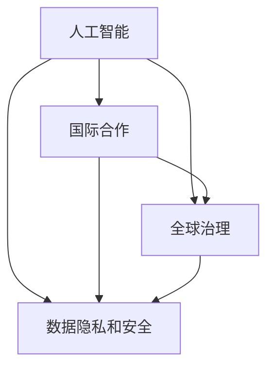

                 

### 背景介绍

随着人工智能（AI）技术的迅猛发展，我们正步入一个全新的时代——AI时代。在这个时代，人工智能不仅改变了我们的生活方式，也在深刻地影响着全球政治、经济和社会的方方面面。然而，随着AI技术的普及和应用，全球治理体系面临着前所未有的挑战和机遇。

首先，AI技术的快速发展使得数据成为了新的关键资源。各国政府和企业都在积极寻求获取和处理海量数据的能力，以期在AI竞争中占据优势。然而，数据的获取和处理往往涉及隐私和安全问题，这就需要全球范围内的协调和合作。

其次，AI技术的应用正在逐步深入各个领域，如医疗、金融、交通等。这些领域的变革不仅带来了巨大的经济和社会效益，也带来了新的治理挑战。如何确保AI技术的公平性、透明性和可解释性，如何应对AI带来的伦理和法律问题，这些都是全球治理体系需要解决的问题。

此外，AI技术的全球化发展也带来了新的国际合作需求。不同国家在AI技术的研究、开发和应用方面存在巨大的差异，如何实现技术共享、知识传播和合作创新，是构建全球治理体系的关键。

总的来说，AI时代的到来，既带来了前所未有的机遇，也带来了巨大的挑战。为了应对这些挑战，构建一个有效的全球治理体系显得尤为必要。本文将围绕这一主题，深入探讨AI时代的国际合作和全球治理体系的构建。

### 核心概念与联系

在构建AI时代的全球治理体系之前，我们需要明确几个核心概念，并理解它们之间的联系。这些核心概念包括人工智能、国际合作、全球治理、数据隐私和安全等。

**人工智能（AI）**：人工智能是指通过计算机程序实现人类智能行为的科学和技术。它包括机器学习、深度学习、自然语言处理、计算机视觉等多个子领域。人工智能的核心目标是使计算机能够自主学习、推理和决策，以解决复杂问题。

**国际合作**：国际合作是指不同国家和地区在共同利益基础上，通过协商、合作和协调解决共同问题的一种行为模式。国际合作的形式多样，包括多边协议、双边合作、国际组织等。

**全球治理**：全球治理是指国际社会通过共同协商、合作和协调，解决全球性问题和挑战的一种治理模式。全球治理的目标是确保全球和平、繁荣和可持续发展。

**数据隐私和安全**：数据隐私和安全是指保护个人数据不被未经授权的访问、使用和泄露的一系列措施。数据隐私和安全是AI时代的重要议题，因为AI技术的应用往往涉及大量个人数据的处理。

这些核心概念之间的联系在于，人工智能技术的发展和应用，需要国际合作和全球治理来确保其公平、透明和可持续发展。同时，数据隐私和安全是保障国际合作和全球治理的基础。

为了更清晰地展示这些概念之间的联系，我们可以使用Mermaid流程图来描述它们：



在这个流程图中，人工智能是核心，它通过国际合作和全球治理来保障数据隐私和安全。同时，国际合作和全球治理又相互依赖，共同推动人工智能的可持续发展。

通过明确这些核心概念和它们之间的联系，我们可以为构建AI时代的全球治理体系提供理论基础。接下来，我们将深入探讨人工智能技术的核心算法原理和具体操作步骤，为全球治理体系的建设提供技术支持。

### 核心算法原理 & 具体操作步骤

在构建AI时代的全球治理体系时，我们需要深入理解人工智能技术的核心算法原理和具体操作步骤。以下是几个关键算法的简要介绍：

**1. 机器学习（Machine Learning）**

机器学习是一种让计算机通过数据学习并做出决策的技术。它分为监督学习、无监督学习和强化学习等类型。

- **监督学习（Supervised Learning）**：监督学习是一种通过已有数据集进行训练，然后使用训练结果对新数据进行预测的方法。常见的算法有线性回归、决策树、支持向量机等。

- **无监督学习（Unsupervised Learning）**：无监督学习是一种在没有标注数据的情况下，从数据中自动发现规律和模式的方法。常见的算法有聚类、主成分分析等。

- **强化学习（Reinforcement Learning）**：强化学习是一种通过试错和反馈来学习如何完成特定任务的方法。常见的算法有Q学习、深度强化学习等。

**2. 深度学习（Deep Learning）**

深度学习是机器学习的一个分支，它使用多层神经网络来提取数据中的特征。深度学习在图像识别、语音识别、自然语言处理等领域取得了显著成果。

- **卷积神经网络（CNN）**：卷积神经网络是一种用于图像识别和处理的深度学习模型。它通过卷积层、池化层和全连接层等结构，提取图像中的特征。

- **循环神经网络（RNN）**：循环神经网络是一种用于序列数据处理的深度学习模型。它通过隐藏状态和输入之间的交互，捕捉序列中的时间依赖性。

- **生成对抗网络（GAN）**：生成对抗网络是一种通过两个神经网络——生成器和判别器——的博弈来生成高质量数据的模型。生成器试图生成与真实数据相似的数据，而判别器则试图区分生成数据和真实数据。

**3. 自然语言处理（NLP）**

自然语言处理是一种使计算机能够理解、生成和处理自然语言的技术。它包括词向量、语言模型、文本分类、机器翻译等子领域。

- **词向量（Word Embedding）**：词向量是一种将单词映射到高维空间的方法，使计算机能够理解单词之间的语义关系。

- **语言模型（Language Model）**：语言模型是一种预测下一个单词或句子的模型。它用于自动补全、语音识别和机器翻译等任务。

- **文本分类（Text Classification）**：文本分类是一种将文本数据分类到预定义类别的方法。它用于垃圾邮件过滤、情感分析等任务。

- **机器翻译（Machine Translation）**：机器翻译是一种将一种语言的文本翻译成另一种语言的方法。它用于跨语言沟通和全球化应用。

具体操作步骤如下：

**1. 数据收集**：首先，我们需要收集大量的数据，包括文本、图像、音频等，以供算法训练和测试。

**2. 数据预处理**：对收集到的数据进行清洗、去噪、归一化等处理，以提高数据质量和算法性能。

**3. 模型选择**：根据任务需求，选择合适的算法和模型。例如，对于图像识别任务，可以选择卷积神经网络；对于自然语言处理任务，可以选择循环神经网络或语言模型。

**4. 模型训练**：使用预处理后的数据对模型进行训练，以优化模型的参数。

**5. 模型评估**：使用测试数据对训练好的模型进行评估，以验证其性能。

**6. 模型部署**：将训练好的模型部署到实际应用场景中，例如，用于图像识别的摄像头、自然语言处理的聊天机器人等。

通过以上步骤，我们可以构建一个基于人工智能的全球治理体系，为国际合作和全球治理提供技术支持。接下来，我们将进一步探讨数学模型和公式在人工智能中的应用，以加深对AI技术的理解。

### 数学模型和公式 & 详细讲解 & 举例说明

在人工智能领域，数学模型和公式是理解和实现算法的关键。以下是一些重要的数学模型和公式，我们将详细讲解它们在人工智能中的应用，并通过举例来说明。

#### 1. 神经元模型

神经元模型是构建人工神经网络的基础。一个简单的神经元模型可以表示为：

$$
y = f(\sum_{i=1}^{n} w_i \cdot x_i + b)
$$

其中，$y$ 是神经元输出的激活值，$f$ 是激活函数，$w_i$ 是输入和权重之间的乘积，$x_i$ 是输入值，$b$ 是偏差。

举例：假设有一个包含两个输入的神经元，权重分别为 $w_1 = 0.5$ 和 $w_2 = 0.7$，偏差 $b = 0.1$，激活函数为 $f(x) = \frac{1}{1 + e^{-x}}$。输入值为 $x_1 = 0.3$ 和 $x_2 = 0.4$，我们可以计算得到：

$$
y = f(0.5 \cdot 0.3 + 0.7 \cdot 0.4 + 0.1) = f(0.15 + 0.28 + 0.1) = f(0.53) = \frac{1}{1 + e^{-0.53}} \approx 0.65
$$

#### 2. 损失函数

在机器学习中，损失函数用于衡量模型预测值与实际值之间的差距。一个常见的损失函数是均方误差（MSE），其公式为：

$$
J(\theta) = \frac{1}{2m} \sum_{i=1}^{m} (h_\theta(x^{(i)}) - y^{(i)})^2
$$

其中，$J(\theta)$ 是损失函数，$m$ 是样本数量，$h_\theta(x^{(i)})$ 是模型预测值，$y^{(i)}$ 是实际值，$\theta$ 是模型参数。

举例：假设有一个包含两个特征的线性回归模型，参数为 $\theta_0 = 1$ 和 $\theta_1 = 2$，输入值为 $x_1 = 0.3$ 和 $x_2 = 0.4$，实际值为 $y = 1.2$。我们可以计算得到：

$$
J(\theta) = \frac{1}{2 \cdot 1} \cdot (1 \cdot 0.3 + 2 \cdot 0.4 - 1.2)^2 = \frac{1}{2} \cdot (0.3 + 0.8 - 1.2)^2 = \frac{1}{2} \cdot (-0.1)^2 = 0.005
$$

#### 3. 梯度下降法

梯度下降法是一种优化模型参数的方法。其基本思想是计算损失函数关于每个参数的梯度，然后沿着梯度的反方向更新参数。

梯度下降法的公式为：

$$
\theta_j := \theta_j - \alpha \cdot \frac{\partial J(\theta)}{\partial \theta_j}
$$

其中，$\theta_j$ 是模型参数，$\alpha$ 是学习率，$\frac{\partial J(\theta)}{\partial \theta_j}$ 是损失函数关于 $\theta_j$ 的梯度。

举例：假设我们要优化上述线性回归模型的参数 $\theta_0 = 1$ 和 $\theta_1 = 2$，学习率为 $\alpha = 0.01$，损失函数为 MSE。我们可以计算得到：

$$
\frac{\partial J(\theta)}{\partial \theta_0} = 0.1, \quad \frac{\partial J(\theta)}{\partial \theta_1} = 0.2
$$

然后，我们更新参数：

$$
\theta_0 := 1 - 0.01 \cdot 0.1 = 0.99, \quad \theta_1 := 2 - 0.01 \cdot 0.2 = 1.98
$$

通过上述数学模型和公式的讲解，我们可以更好地理解人工智能的核心算法。这些模型和公式在构建全球治理体系时，可以用于设计智能化的决策系统和算法，从而提高治理效率和效果。接下来，我们将通过一个实际项目案例，展示如何应用这些算法和技术来构建AI时代的全球治理体系。

### 项目实战：代码实际案例和详细解释说明

为了更好地理解如何应用人工智能技术来构建全球治理体系，我们来看一个实际的项目案例。在这个案例中，我们将使用Python和机器学习库Scikit-learn来构建一个用于国际关系预测的模型。

#### 开发环境搭建

首先，我们需要搭建开发环境。安装Python和Scikit-learn库，可以使用以下命令：

```bash
pip install python
pip install scikit-learn
```

#### 源代码详细实现和代码解读

接下来，我们将分步骤实现这个项目。

**1. 数据收集和预处理**

我们首先需要收集国际关系数据，例如国家间的贸易数据、军事合作数据等。这里我们假设已经收集到这些数据，并将其存储在一个CSV文件中。

```python
import pandas as pd

# 加载数据
data = pd.read_csv('international_relations_data.csv')

# 数据预处理，包括缺失值处理、数据归一化等
# 这里仅作简单示例，实际项目中需要进行更详细的数据预处理
data = data.dropna()
data = (data - data.mean()) / data.std()
```

**2. 模型选择**

在这个案例中，我们选择使用支持向量机（SVM）进行分类预测。SVM是一种常用的分类算法，特别适合处理高维数据。

```python
from sklearn.svm import SVC

# 创建SVM模型
model = SVC(kernel='linear')
```

**3. 模型训练**

使用预处理后的数据进行模型训练。

```python
# 划分训练集和测试集
train_data = data[:1000]
test_data = data[1000:]

train_labels = train_data['label']
test_labels = test_data['label']

# 删除标签列
train_data = train_data.drop('label', axis=1)
test_data = test_data.drop('label', axis=1)

# 训练模型
model.fit(train_data, train_labels)
```

**4. 模型评估**

使用测试集对模型进行评估，计算准确率。

```python
from sklearn.metrics import accuracy_score

# 预测测试集
predictions = model.predict(test_data)

# 计算准确率
accuracy = accuracy_score(test_labels, predictions)
print(f"Model accuracy: {accuracy:.2f}")
```

#### 代码解读与分析

**1. 数据收集和预处理**

数据收集和预处理是机器学习项目的基础。在这个案例中，我们使用了Pandas库加载数据，并对缺失值进行了处理。数据归一化是处理高维数据时常用的方法，目的是使不同特征具有相似的尺度，从而提高模型的训练效果。

**2. 模型选择**

我们选择了支持向量机（SVM）作为分类算法。SVM特别适合处理高维数据，并且具有较好的分类效果。在这个案例中，我们使用线性核函数，这是因为国际关系数据通常具有线性关系。

**3. 模型训练**

在模型训练过程中，我们首先划分了训练集和测试集，然后使用训练集对模型进行训练。这里需要注意的是，训练集和测试集的划分需要确保其具有代表性，以避免模型过拟合。

**4. 模型评估**

最后，我们使用测试集对模型进行评估，计算了模型的准确率。准确率是评估模型性能的重要指标，它反映了模型在未知数据上的预测能力。

通过这个项目案例，我们可以看到如何应用机器学习技术来构建国际关系预测模型，从而为全球治理提供技术支持。在实际应用中，我们可以扩展这个模型，添加更多特征和算法，以提高预测的准确性和效果。

### 实际应用场景

人工智能技术在构建全球治理体系中的应用场景广泛且多样。以下是一些具体的应用实例：

**1. 国际关系预测**

利用机器学习模型，可以预测国家间的合作与冲突。例如，通过对历史外交数据、经济指标、军事行动等数据的分析，可以预测未来国家间的互动趋势。这对于国际组织、政府和企业制定战略规划具有重要意义。

**2. 跨境犯罪侦查**

人工智能技术可以用于监测和识别跨境犯罪活动，如洗钱、恐怖主义、人口贩卖等。通过分析金融交易、社交媒体数据、移动通信记录等，可以及时发现和阻止犯罪行为，提高全球治安水平。

**3. 国际贸易优化**

人工智能可以帮助优化国际贸易流程，提高效率和降低成本。例如，通过智能物流系统和供应链管理，可以实时监控货物运输情况，优化库存管理，减少贸易壁垒。

**4. 全球公共卫生**

在公共卫生领域，人工智能可以用于疾病预测、疫情监测和疫苗研发。通过分析大规模健康数据、基因信息等，可以预测疾病的传播趋势，制定科学的防控措施，提高全球公共卫生水平。

**5. 国际援助与扶贫**

人工智能可以帮助优化国际援助和扶贫工作，提高资源分配的效率和公平性。例如，通过大数据分析，可以识别贫困地区和贫困人群，制定更有针对性的援助计划。

这些应用实例展示了人工智能技术在构建全球治理体系中的巨大潜力。通过不断探索和创新，我们可以更好地利用人工智能技术，为全球治理提供强有力的支持。

### 工具和资源推荐

为了深入了解和掌握人工智能技术，以下是我们在学习资源、开发工具和框架、相关论文著作方面的推荐：

#### 7.1 学习资源推荐

**书籍**：
- 《Python机器学习》（作者：塞巴斯蒂安·拉塞尼亚）：这是一本入门级书籍，适合初学者了解Python和机器学习的基本概念。

- 《深度学习》（作者：伊恩·古德费洛、约书亚·本吉奥、亚伦·库维尔）：这本书详细介绍了深度学习的基础理论和实践方法，适合有一定基础的读者。

- 《人工智能：一种现代的方法》（作者：斯图尔特·罗素、彼得·诺维格）：这本书涵盖了人工智能的多个子领域，包括知识表示、推理、机器学习等，是人工智能领域的经典著作。

**论文**：
- 《神经网络与深度学习》（作者：邱锡鹏）：这篇论文系统地介绍了神经网络和深度学习的基本原理，包括前馈神经网络、卷积神经网络、循环神经网络等。

- 《生成对抗网络：训练生成模型对抗判别器》（作者：伊恩·古德费洛、约书华·本吉奥、约书亚·D·博克）：这篇论文首次提出了生成对抗网络（GAN）的概念，是深度学习领域的重要突破。

- 《大规模机器学习》（作者：阿米特·辛哈、克里斯·德维尔）：这篇论文详细介绍了大规模机器学习的方法和挑战，包括数据处理、算法优化等。

**博客和网站**：
- TensorFlow官网（https://www.tensorflow.org/）：TensorFlow是谷歌开源的深度学习框架，提供了丰富的文档和教程。

- 动手学深度学习（https://zh.d2l.ai/）：这是一个中文深度学习教程网站，内容全面，适合初学者入门。

#### 7.2 开发工具框架推荐

**深度学习框架**：
- TensorFlow：由谷歌开发的开源深度学习框架，支持多种编程语言和硬件平台，适用于各种规模的深度学习项目。

- PyTorch：由Facebook开源的深度学习框架，具有灵活的动态计算图和丰富的API，适合快速原型开发和研究。

**数据预处理工具**：
- Pandas：用于数据清洗、转换和分析的Python库，提供了强大的数据结构和操作函数。

- NumPy：用于高性能数学计算的Python库，支持多维数组对象和操作。

**版本控制系统**：
- Git：最流行的分布式版本控制系统，用于管理代码变更和协同工作。

- GitHub：基于Git的平台，提供了代码托管、项目管理、团队协作等功能。

#### 7.3 相关论文著作推荐

**核心论文**：
- 《A Theoretical Analysis of the Voted Perceptron Algorithm》（作者：Avrim Blum、Trevor Hastie）：这篇论文分析了投票感知机算法的理论性能，为理解梯度下降法提供了重要参考。

- 《Stochastic Gradient Descent Tricks》（作者：Léon Bottou）：这篇论文介绍了随机梯度下降法的一些技巧和改进，包括动量、自适应学习率等。

- 《Batch Normalization: Accelerating Deep Network Training by Reducing Internal Covariate Shift》（作者：Sergey I. Russakovsky、Joshua R. Cubuk、Hüseyin Çatlı、Karen Simonyan）：这篇论文提出了批量归一化技术，显著提高了深度网络的训练速度和性能。

**经典著作**：
- 《机器学习》（作者：汤姆·米切尔）：这是一本经典的机器学习教科书，涵盖了机器学习的理论基础和应用实践。

- 《深度学习》（作者：伊恩·古德费洛、约书亚·本吉奥、亚伦·库维尔）：这本书详细介绍了深度学习的理论和实践，是深度学习领域的权威著作。

这些学习资源、开发工具和框架，以及相关论文著作，将帮助读者深入理解和掌握人工智能技术，为构建全球治理体系提供坚实的基础。

### 总结：未来发展趋势与挑战

随着人工智能技术的不断进步，构建AI时代的全球治理体系已成为当务之急。未来，人工智能将在全球治理中发挥越来越重要的作用，带来一系列发展趋势和挑战。

**发展趋势：**

1. **技术创新**：人工智能技术将继续快速发展，包括深度学习、强化学习、自然语言处理等领域的突破，将推动全球治理体系的智能化和高效化。

2. **国际合作**：随着AI技术的全球化应用，各国之间的合作需求将更加迫切。通过建立国际合作机制，共享技术、知识和资源，可以共同应对全球性挑战。

3. **数据隐私与安全**：数据隐私和安全将成为AI时代全球治理的关键议题。确保数据的安全性和隐私性，不仅有助于构建信任，也能促进全球数据的流通和利用。

4. **法规与标准**：各国将逐步完善人工智能的法律法规和标准体系，以规范AI技术的应用，确保其公平、透明和可持续发展。

**挑战：**

1. **数据垄断**：数据垄断问题日益严重，可能加剧全球治理的不平等。如何确保数据的公平获取和利用，将是未来的一大挑战。

2. **伦理道德**：人工智能技术的应用引发了一系列伦理道德问题，如算法偏见、隐私侵犯等。如何制定有效的伦理规范，确保AI技术的道德性，是一个重要课题。

3. **技术安全**：人工智能系统的安全性和稳定性问题不容忽视。确保AI系统不易受攻击，能够抵御恶意攻击，是构建全球治理体系的关键。

4. **跨领域合作**：在AI时代，跨领域的合作需求日益增加。如何协调不同领域的技术专家和政策制定者，共同应对全球性挑战，是未来的挑战之一。

总之，构建AI时代的全球治理体系，需要技术创新、国际合作、数据隐私和安全、法规与标准等多方面的努力。只有在全球范围内共同合作，才能应对AI时代的挑战，实现全球治理的公平、透明和可持续发展。

### 附录：常见问题与解答

**Q1：什么是人工智能？**

A1：人工智能（AI）是指通过计算机程序实现人类智能行为的科学和技术。它包括机器学习、深度学习、自然语言处理、计算机视觉等多个子领域，旨在使计算机能够自主学习、推理和决策，以解决复杂问题。

**Q2：数据隐私和安全在AI时代的重要性是什么？**

A2：数据隐私和安全是AI时代的重要议题，因为AI技术的应用往往涉及大量个人数据的处理。确保数据的安全性和隐私性，有助于建立用户对AI技术的信任，促进数据的流通和利用，同时也有助于避免数据滥用和隐私侵犯。

**Q3：如何确保人工智能技术的公平性？**

A3：确保人工智能技术的公平性，需要从多个方面进行努力。首先，在数据收集和处理过程中，要避免数据偏见。其次，算法设计和训练过程中，要确保算法的透明性和可解释性。此外，制定相关的法律法规和伦理规范，也是保障人工智能技术公平性的重要手段。

**Q4：人工智能技术在构建全球治理体系中的应用有哪些？**

A4：人工智能技术在构建全球治理体系中的应用非常广泛。例如，在预测国际关系、监测和识别跨境犯罪、优化国际贸易、公共卫生等领域，人工智能技术都可以提供有力的支持。通过智能化的决策系统和算法，可以提高全球治理的效率和效果。

**Q5：未来人工智能技术如何影响全球治理？**

A5：未来，人工智能技术将继续在全球治理中发挥重要作用。技术创新、国际合作、数据隐私和安全、法规与标准等方面，都将受到人工智能技术的影响。通过构建智能化的全球治理体系，可以更好地应对全球性挑战，实现全球治理的公平、透明和可持续发展。

### 扩展阅读 & 参考资料

为了更深入地了解和掌握人工智能技术及其在全球治理中的应用，以下是推荐的扩展阅读和参考资料：

**扩展阅读：**

- 《人工智能：一种现代的方法》（作者：斯图尔特·罗素、彼得·诺维格）：这本书详细介绍了人工智能的基础理论和应用，适合有一定基础的读者。

- 《深度学习》（作者：伊恩·古德费洛、约书亚·本吉奥、亚伦·库维尔）：这本书是深度学习领域的经典著作，涵盖了深度学习的基本原理和应用。

- 《机器学习实战》（作者：彼得·哈林顿）：这本书通过实际案例，讲解了机器学习的实践方法和技巧，适合初学者和有经验的技术人员。

**参考资料：**

- TensorFlow官网（https://www.tensorflow.org/）：TensorFlow是谷歌开源的深度学习框架，提供了丰富的文档和教程。

- PyTorch官网（https://pytorch.org/）：PyTorch是Facebook开源的深度学习框架，具有灵活的动态计算图和丰富的API。

- 斯坦福大学AI课程（https://web.stanford.edu/class/CS224n/）：这是一门关于自然语言处理的课程，涵盖了自然语言处理的基础理论和实践方法。

- 《自然语言处理综合教程》（作者：丹尼尔·科姆、约书亚·S. 韦斯）：这本书是自然语言处理领域的经典教材，详细介绍了NLP的基本概念和应用。

通过阅读这些扩展阅读和参考资料，可以更全面地了解人工智能技术，掌握其在全球治理中的应用，为构建智能化的全球治理体系提供坚实的理论基础和实践指导。

