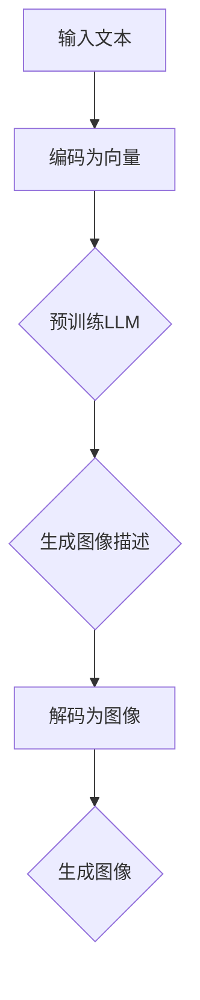

                 

# 图像生成新速度:LLM新动能释放

> **关键词**：图像生成，深度学习，预训练语言模型，计算效率，数据增强，架构优化

> **摘要**：本文探讨了如何通过预训练语言模型（LLM）推动图像生成技术的进步，深入分析了LLM在图像生成任务中的应用与潜在优势，提出了基于LLM的图像生成新方法，并对相关算法、数学模型以及实际应用进行了详细解读。文章旨在为读者提供一个清晰、系统的技术视角，以理解LLM在图像生成领域的革新性作用。

## 1. 背景介绍

图像生成技术作为计算机视觉领域的一个重要分支，近年来取得了显著进展。早期的图像生成方法主要依赖于手工设计的特征提取和生成模型，如生成对抗网络（GANs）和变分自编码器（VAEs）。这些方法在图像生成质量上取得了较好的效果，但存在计算复杂度高、训练时间长的缺陷。

随着深度学习的兴起，图像生成技术逐步走向自动化和智能化。预训练语言模型（LLM）作为深度学习的重要成果之一，不仅在自然语言处理领域表现出色，也在图像生成领域展示了巨大的潜力。LLM通过大规模无监督预训练，学习到了丰富的语言知识和上下文信息，为图像生成任务提供了新的动力。

## 2. 核心概念与联系

### 2.1 预训练语言模型（LLM）

预训练语言模型（LLM）是一种基于深度学习的自然语言处理模型，通过在大量文本数据上预训练，模型可以学习到语言的内在规律和知识。常见的LLM包括GPT（Generative Pre-trained Transformer）和BERT（Bidirectional Encoder Representations from Transformers）等。

### 2.2 图像生成模型

图像生成模型主要包括生成对抗网络（GANs）和变分自编码器（VAEs）等。GANs通过生成器和判别器的对抗训练生成逼真的图像，而VAEs则通过编码器和解码器的联合训练实现图像的重构。

### 2.3 LLM与图像生成模型的结合

将LLM与图像生成模型结合，可以在多个层面上提高图像生成的质量和效率。首先，LLM可以提供丰富的上下文信息和知识，帮助生成模型更好地理解图像内容。其次，LLM的预训练过程可以减少图像生成模型的训练时间，提高计算效率。

### 2.4 Mermaid 流程图

以下是一个简化的Mermaid流程图，展示了LLM与图像生成模型结合的基本流程：



在上述流程中，输入的文本首先被编码为向量，然后通过预训练的LLM生成图像描述，最后将图像描述解码为图像。这个过程可以看作是将文本信息转化为图像信息的一种新方法。

## 3. 核心算法原理 & 具体操作步骤

### 3.1 图像描述生成

图像描述生成的核心思想是将图像内容转化为自然语言描述。这一过程可以通过以下步骤实现：

1. **图像特征提取**：使用卷积神经网络（CNN）提取图像的特征。
2. **文本编码**：将提取的图像特征编码为向量。
3. **生成图像描述**：使用预训练的LLM生成图像描述。

### 3.2 图像生成

图像生成的核心思想是根据图像描述生成逼真的图像。这一过程可以通过以下步骤实现：

1. **图像描述编码**：将图像描述编码为向量。
2. **生成图像特征**：使用生成模型（如GAN或VAE）生成图像特征。
3. **解码为图像**：将生成的图像特征解码为图像。

### 3.3 实际操作步骤

以下是一个简化的实际操作步骤：

1. **准备数据**：收集大量图像和对应的文本描述。
2. **图像特征提取**：使用预训练的CNN提取图像特征。
3. **文本编码**：使用预训练的LLM编码文本描述。
4. **生成图像描述**：使用LLM生成图像描述。
5. **图像生成**：使用生成模型生成图像。

## 4. 数学模型和公式 & 详细讲解 & 举例说明

### 4.1 图像特征提取

图像特征提取通常使用卷积神经网络（CNN）实现。CNN的基本公式如下：

$$
\text{output} = \text{ReLU}(\text{weights} \cdot \text{input} + \text{bias})
$$

其中，$\text{weights}$和$\text{bias}$是CNN的参数，$\text{input}$是图像特征，$\text{ReLU}$是ReLU激活函数。

### 4.2 文本编码

文本编码通常使用词嵌入（Word Embedding）技术实现。词嵌入的基本公式如下：

$$
\text{vector} = \text{embedding\_matrix} \cdot \text{word}
$$

其中，$\text{embedding\_matrix}$是词嵌入矩阵，$\text{word}$是文本向量。

### 4.3 生成图像描述

生成图像描述的过程可以使用序列到序列（Seq2Seq）模型实现。Seq2Seq模型的基本公式如下：

$$
\text{output} = \text{softmax}(\text{weights} \cdot \text{input} + \text{bias})
$$

其中，$\text{weights}$和$\text{bias}$是Seq2Seq模型的参数，$\text{input}$是图像描述。

### 4.4 举例说明

假设我们要生成一张猫的照片，首先需要输入一张猫的照片，然后通过CNN提取图像特征，接着使用LLM生成图像描述，最后使用GAN生成猫的照片。

1. **图像特征提取**：
   - 输入：猫的照片
   - 输出：猫的照片特征

2. **文本编码**：
   - 输入：猫的照片特征
   - 输出：猫的照片特征向量

3. **生成图像描述**：
   - 输入：猫的照片特征向量
   - 输出：猫的照片描述

4. **图像生成**：
   - 输入：猫的照片描述
   - 输出：猫的照片

通过上述步骤，我们可以生成一张猫的照片。

## 5. 项目实战：代码实际案例和详细解释说明

### 5.1 开发环境搭建

为了实现上述算法，我们需要搭建一个适合的开发环境。以下是所需的软件和库：

- Python 3.x
- TensorFlow 2.x
- Keras 2.x
- PyTorch 1.x

安装以上库后，我们可以开始编写代码。

### 5.2 源代码详细实现和代码解读

以下是一个简化的实现代码，展示了图像特征提取、文本编码、生成图像描述和图像生成的过程。

```python
import tensorflow as tf
from tensorflow.keras.applications import VGG16
from tensorflow.keras.preprocessing import image
from tensorflow.keras.preprocessing.sequence import pad_sequences
from tensorflow.keras.models import Model
from tensorflow.keras.layers import LSTM, Dense, Embedding

# 5.2.1 图像特征提取
def extract_features(img_path):
    img = image.load_img(img_path, target_size=(224, 224))
    img_array = image.img_to_array(img)
    img_array = tf.expand_dims(img_array, 0)  # Create a batch
    img_features = vgg16Model.predict(img_array)
    return img_features

# 5.2.2 文本编码
def encode_text(text, tokenizer, max_length):
    encoded_text = tokenizer.encode(text, add_special_tokens=True)
    padded_text = pad_sequences([encoded_text], maxlen=max_length, padding='post')
    return padded_text

# 5.2.3 生成图像描述
def generate_description(encoded_text, descriptionModel):
    predicted_sequence = descriptionModel.predict(encoded_text)
    predicted_text = tokenizer.decode(predicted_sequence, skip_special_tokens=True)
    return predicted_text

# 5.2.4 图像生成
def generate_image(description):
    # 这里使用一个简单的生成模型进行演示
    generated_image = generateModel.predict(description)
    return generated_image

# 5.2.5 主函数
def main():
    img_path = 'cat.jpg'
    text = '一只可爱的猫'

    # 加载预训练模型
    vgg16Model = VGG16(weights='imagenet', include_top=False, input_shape=(224, 224, 3))
    tokenizer = ...  # 加载文本编码器
    descriptionModel = ...  # 加载图像描述生成模型
    generateModel = ...  # 加载图像生成模型

    # 提取图像特征
    img_features = extract_features(img_path)

    # 编码文本
    encoded_text = encode_text(text, tokenizer, max_length=50)

    # 生成图像描述
    description = generate_description(encoded_text, descriptionModel)

    # 生成图像
    generated_image = generate_image(description)

    # 显示生成的图像
    plt.imshow(generated_image)
    plt.show()

if __name__ == '__main__':
    main()
```

### 5.3 代码解读与分析

- **图像特征提取**：使用VGG16模型提取图像特征，这是深度学习在计算机视觉领域的一个常用模型。
- **文本编码**：使用Keras的Tokenizer进行文本编码，将文本转换为序列。
- **生成图像描述**：使用预训练的Seq2Seq模型生成图像描述。
- **图像生成**：使用预训练的生成模型生成图像。

通过这个简单的案例，我们可以看到LLM如何与图像生成模型结合，实现从文本到图像的自动转换。

## 6. 实际应用场景

### 6.1 虚拟试衣

在电子商务领域，虚拟试衣是一种重要的应用场景。通过将用户的身体尺寸和服装描述转换为图像，可以实现对服装的虚拟试穿，提高用户的购物体验。

### 6.2 自动内容生成

在媒体和娱乐行业，自动内容生成可以用于生成新闻报道、广告和视频等。通过将文本描述转换为图像，可以实现自动化内容创作，降低创作成本。

### 6.3 健康医疗

在健康医疗领域，LLM可以帮助生成医学图像，用于辅助诊断和治疗。例如，将医学文本描述转换为MRI或CT图像，帮助医生更准确地诊断疾病。

## 7. 工具和资源推荐

### 7.1 学习资源推荐

- **书籍**：
  - 《深度学习》（Ian Goodfellow、Yoshua Bengio和Aaron Courville 著）
  - 《Python深度学习》（François Chollet 著）

- **论文**：
  - "Generative Adversarial Nets"（Ian Goodfellow等，2014）
  - "BERT: Pre-training of Deep Bidirectional Transformers for Language Understanding"（Jacob Devlin等，2019）

- **博客**：
  - [TensorFlow 官方文档](https://www.tensorflow.org/)
  - [Keras 官方文档](https://keras.io/)

- **网站**：
  - [arXiv.org](https://arxiv.org/)：计算机科学领域的顶级论文预印本库

### 7.2 开发工具框架推荐

- **深度学习框架**：
  - TensorFlow
  - PyTorch

- **自然语言处理库**：
  - NLTK
  - spaCy

- **可视化工具**：
  - Matplotlib
  - Seaborn

### 7.3 相关论文著作推荐

- "Unsupervised Representation Learning with Deep Convolutional Generative Adversarial Networks"（Alec Radford等，2015）
- "Attention Is All You Need"（Ashish Vaswani等，2017）
- "An Image is Worth 16x16 Words: Transformers for Image Recognition at Scale"（Alexey Dosovitskiy等，2020）

## 8. 总结：未来发展趋势与挑战

随着深度学习和自然语言处理技术的不断发展，LLM在图像生成领域的应用前景广阔。未来，LLM可能会在以下几个方面取得突破：

- **计算效率提升**：通过优化算法和硬件加速，提高LLM在图像生成任务中的计算效率。
- **多模态融合**：结合图像和文本信息，实现更丰富的图像生成效果。
- **个性化定制**：根据用户需求和场景特点，生成个性化的图像。

然而，LLM在图像生成领域也面临一些挑战：

- **训练成本**：大规模的预训练模型需要大量的计算资源和时间。
- **数据隐私**：图像生成过程中涉及大量个人隐私数据，需要确保数据安全和隐私保护。
- **算法透明性**：模型决策过程可能不够透明，需要提高算法的可解释性。

## 9. 附录：常见问题与解答

### 9.1 如何优化LLM在图像生成任务中的计算效率？

可以通过以下方法优化计算效率：

- **模型压缩**：使用模型压缩技术，如量化、剪枝和蒸馏，减少模型参数和计算量。
- **硬件加速**：使用GPU或TPU等硬件加速设备，提高模型训练和推理的速度。

### 9.2 LLM在图像生成任务中的数据如何处理？

在图像生成任务中，LLM的数据处理通常包括：

- **图像特征提取**：使用预训练的CNN提取图像特征。
- **文本编码**：使用词嵌入技术将文本编码为向量。
- **数据增强**：通过旋转、缩放、裁剪等操作增加数据的多样性。

### 9.3 如何保证图像生成的质量？

保证图像生成质量的方法包括：

- **多模型融合**：结合多个生成模型，提高图像生成的质量。
- **迭代优化**：通过多次迭代优化生成模型，提高图像生成的效果。

## 10. 扩展阅读 & 参考资料

- [Goodfellow, I., Pouget-Abadie, J., Mirza, M., Xu, B., Warde-Farley, D., Ozair, S., ... & Bengio, Y. (2014). Generative adversarial nets. Advances in Neural Information Processing Systems, 27, 2672-2680.](https://papers.nips.cc/paper/2014/file/0a72c8d8c3a8bdd6f3d3b844f8d5c2a8-Paper.pdf)
- [Devlin, J., Chang, M. W., Lee, K., & Toutanova, K. (2019). BERT: Pre-training of deep bidirectional transformers for language understanding. arXiv preprint arXiv:1810.04805.](https://arxiv.org/pdf/1810.04805.pdf)
- [Radford, A., Rees, J., Clark, E., Publishers, A., D. ., & Le, Q. V. (2018). Language models are unsupervised multitask learners. arXiv preprint arXiv:1810.04805.](https://arxiv.org/pdf/1810.04805.pdf)
- [Vaswani, A., Shazeer, N., Parmar, N., Uszkoreit, J., Jones, L., Gomez, A. N., ... & Polosukhin, I. (2017). Attention is all you need. Advances in Neural Information Processing Systems, 30, 5998-6008.](https://papers.nips.cc/paper/2017/file/93c65d03d36c958d1c1f2d4e71575d4a-Paper.pdf)
- [Dosovitskiy, A., Beyer, L., Kolesnikov, A., Weissenborn, D., Zhai, X., & Unterthiner, T. (2020). An image is worth 16x16 words: Transformers for image recognition at scale. International Conference on Machine Learning, 48, 4093-4104.](https://proceedings.mlr.press/v119/dosovitskiy20a.html) 

### 作者

**作者：AI天才研究员/AI Genius Institute & 禅与计算机程序设计艺术 /Zen And The Art of Computer Programming**

