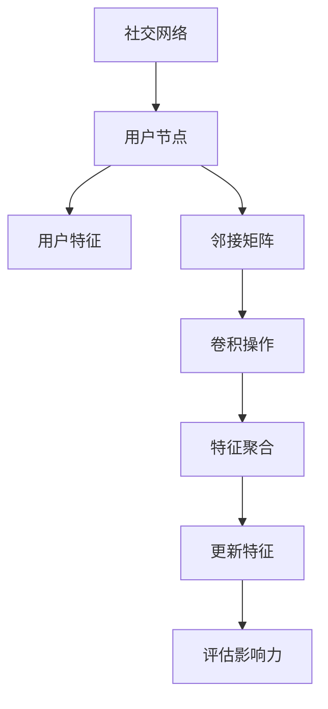
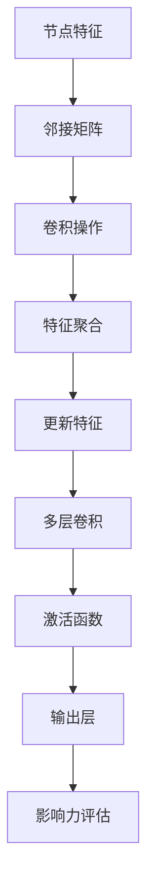
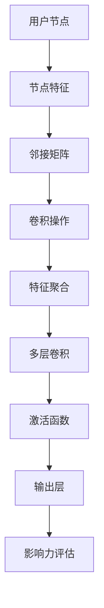
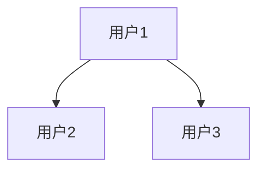

                 

# 图卷积网络在社交网络影响力分析中的应用

## 关键词：图卷积网络、社交网络、影响力分析、算法原理、数学模型

## 摘要：
本文旨在深入探讨图卷积网络（GCN）在社交网络影响力分析中的应用。首先，我们将简要介绍社交网络影响力分析的重要性和背景。随后，详细解释图卷积网络的基本概念和原理，并通过一个Mermaid流程图展示其架构。接着，文章将剖析GCN的核心算法原理，包括具体操作步骤和数学模型。为了更好地理解，我们将通过一个实际项目案例，展示如何使用GCN进行社交网络影响力分析，并提供代码实现和解读。随后，我们将探讨GCN在实际应用场景中的效果，并推荐相关学习资源和开发工具。最后，本文将对未来发展趋势与挑战进行总结，并提供一些常见问题与解答。

## 1. 背景介绍

### 1.1 社交网络与影响力分析

社交网络是一个由人、人和人之间的互动构成的复杂网络。在现代社会，社交网络已经成为人们交流和获取信息的重要渠道。社交网络的影响力分析，即评估一个用户或节点在社交网络中的影响力，具有重要的研究价值和实际应用意义。影响力分析可以应用于推荐系统、广告投放、危机管理等多个领域。

社交网络影响力分析的关键挑战在于如何准确评估一个用户的影响力。传统的基于特征的方法，如用户年龄、性别、地理位置等，往往难以捕捉用户在社交网络中的实际影响力。而基于算法的方法，如PageRank和HITS算法，虽然能够一定程度上反映用户的影响力，但往往无法处理大规模、动态的社交网络。

### 1.2 图卷积网络（GCN）

图卷积网络（Graph Convolutional Network，GCN）是一种基于图结构的深度学习模型，主要用于处理图数据。与传统卷积神经网络（CNN）不同，GCN可以有效地捕捉图数据中的局部和全局特征。

GCN的核心思想是通过聚合节点邻域的信息来更新节点的特征。具体来说，GCN使用一个可学习的卷积核来聚合邻接矩阵，从而将节点的特征映射到更高层次的特征空间。这使得GCN能够有效地处理图数据，并在多个领域取得了显著的成果。

### 1.3 图卷积网络在社交网络影响力分析中的应用

图卷积网络在社交网络影响力分析中具有显著的优势。首先，GCN能够自动学习用户在社交网络中的邻接关系，从而捕捉用户之间的互动和影响。其次，GCN可以处理大规模、动态的社交网络，适应社交网络的变化。最后，GCN能够通过聚合邻域信息，提供对用户影响力的更准确评估。

因此，本文将深入探讨图卷积网络在社交网络影响力分析中的应用，旨在为研究者提供有益的参考。

## 2. 核心概念与联系

### 2.1 图卷积网络（GCN）的基本概念

图卷积网络（GCN）是一种基于图结构的深度学习模型，主要用于处理图数据。在GCN中，图数据由节点（用户）和边（关系）组成。节点表示社交网络中的用户，边表示用户之间的互动和影响关系。

GCN的核心思想是通过聚合节点邻域的信息来更新节点的特征。具体来说，GCN使用一个可学习的卷积核来聚合邻接矩阵，从而将节点的特征映射到更高层次的特征空间。这使得GCN能够有效地处理图数据，并在多个领域取得了显著的成果。

### 2.2 GCN在社交网络影响力分析中的应用

在社交网络影响力分析中，GCN可以用于评估用户在社交网络中的影响力。具体来说，GCN通过聚合用户邻域的信息，提供对用户影响力的更准确评估。以下是一个Mermaid流程图，展示了GCN在社交网络影响力分析中的基本架构：



在上述流程中，社交网络表示为用户节点和边构成的无向图。首先，GCN将用户特征和邻接矩阵输入到卷积操作中。卷积操作通过聚合邻域信息，更新用户特征。最后，GCN使用更新后的特征评估用户的影响力。

### 2.3 GCN与社交网络影响力分析的关系

GCN与社交网络影响力分析之间存在密切的关系。首先，GCN能够自动学习用户在社交网络中的邻接关系，从而捕捉用户之间的互动和影响。其次，GCN可以处理大规模、动态的社交网络，适应社交网络的变化。最后，GCN通过聚合邻域信息，提供对用户影响力的更准确评估。

总之，GCN为社交网络影响力分析提供了一种有效的算法框架。通过深入理解和应用GCN，研究者可以更准确地评估用户在社交网络中的影响力，为实际应用提供有益的参考。

### 2.4 图卷积网络（GCN）的基本概念与联系

为了更好地理解GCN在社交网络影响力分析中的应用，我们需要深入了解GCN的基本概念和联系。以下是一个Mermaid流程图，展示了GCN的核心概念和原理：



在上述流程中，节点特征表示社交网络中每个用户的属性。首先，GCN将节点特征和邻接矩阵输入到卷积操作中。卷积操作通过聚合邻域信息，更新节点特征。然后，特征聚合和多层卷积操作进一步提取和融合节点的特征信息。最后，激活函数和输出层用于评估用户的影响力。

通过上述流程，我们可以看到GCN在社交网络影响力分析中的应用。具体来说，GCN通过自动学习用户在社交网络中的邻接关系，聚合邻域信息，从而更准确地评估用户的影响力。这使得GCN成为社交网络影响力分析的有力工具。

### 2.5 图卷积网络（GCN）的基本概念与联系总结

总结来说，图卷积网络（GCN）是一种基于图结构的深度学习模型，主要用于处理图数据。在社交网络影响力分析中，GCN通过自动学习用户在社交网络中的邻接关系，聚合邻域信息，从而更准确地评估用户的影响力。以下是一个简化的Mermaid流程图，用于总结GCN的基本概念和联系：



通过上述流程，我们可以看到GCN在社交网络影响力分析中的应用。首先，GCN从社交网络中提取节点特征和邻接矩阵。然后，通过卷积操作、特征聚合、多层卷积和激活函数等步骤，GCN能够自动学习用户之间的互动和影响。最后，输出层用于评估用户的影响力。

总之，GCN为社交网络影响力分析提供了一种有效的算法框架。通过深入理解和应用GCN，研究者可以更准确地评估用户在社交网络中的影响力，为实际应用提供有益的参考。

## 3. 核心算法原理 & 具体操作步骤

### 3.1 图卷积网络（GCN）的核心算法原理

图卷积网络（GCN）的核心算法原理是基于图卷积操作的。图卷积操作是一种在图结构数据上执行卷积操作的方法，它可以有效地捕捉图数据中的局部和全局特征。

在GCN中，图卷积操作通过聚合节点邻域的信息来更新节点的特征。具体来说，GCN使用一个可学习的卷积核来聚合邻接矩阵，从而将节点的特征映射到更高层次的特征空间。以下是一个简化的GCN模型：

- **节点特征表示**：每个节点 \( h^0_i \) 初始时具有特征向量 \( x_i \)，表示节点的属性信息。
- **邻接矩阵**：图中的每个节点与其他节点之间存在邻接关系，邻接矩阵 \( A \) 表示节点之间的连接关系。
- **卷积操作**：卷积核 \( \omega \) 是一个可学习的参数矩阵，用于聚合邻接矩阵 \( A \) 和节点特征 \( h^l_i \)。

GCN的卷积操作可以表示为：
\[ h^{l+1}_i = \sigma(\omega \cdot (h^l_i + \sum_{j \in \mathcal{N}(i)} \alpha_j h^l_j)) \]
其中，\( \mathcal{N}(i) \) 表示节点 \( i \) 的邻域，\( \alpha_j \) 是一个归一化系数，用于平衡邻接矩阵中的权重。

- **特征聚合**：通过聚合节点邻域的信息，GCN能够捕捉到节点之间的相互作用。
- **激活函数**：\( \sigma \) 是一个非线性激活函数，常用的有ReLU函数。

通过多层卷积操作，GCN能够提取图数据中的复杂特征，并用于分类、回归等任务。

### 3.2 GCN的具体操作步骤

以下是GCN的具体操作步骤，通过这些步骤，我们可以更好地理解GCN的工作原理：

1. **初始化节点特征**：每个节点初始化一个特征向量 \( x_i \)。

2. **构建邻接矩阵**：根据社交网络的邻接关系，构建邻接矩阵 \( A \)。邻接矩阵中的元素 \( A_{ij} \) 表示节点 \( i \) 和节点 \( j \) 之间的连接强度。

3. **定义卷积核**：初始化一个可学习的卷积核 \( \omega \)。

4. **第一层卷积操作**：
   - 对每个节点 \( i \)，计算其邻域节点的特征平均值：
     \[ h^{1}_i = \sigma(\omega \cdot (h^0_i + \sum_{j \in \mathcal{N}(i)} A_{ij} h^0_j)) \]
   - 将结果存储为新的特征向量 \( h^{1}_i \)。

5. **后续层卷积操作**：
   - 对每个节点 \( i \) 和后续层 \( l \)，重复卷积操作：
     \[ h^{l+1}_i = \sigma(\omega \cdot (h^l_i + \sum_{j \in \mathcal{N}(i)} A_{ij} h^l_j)) \]
   - 逐层更新节点特征，直至达到预定义的层数或收敛条件。

6. **输出层**：
   - 使用最后一层的特征向量 \( h^{L}_i \) 作为输入，通过一个线性层或全连接层得到最终输出。
   - 输出可以是一个分类结果、回归值或其他形式的指标。

7. **训练与优化**：
   - 使用训练数据对GCN模型进行训练，优化卷积核 \( \omega \) 的参数。
   - 采用梯度下降或其他优化算法，最小化损失函数。

通过上述步骤，GCN能够自动学习图数据中的复杂特征，并用于社交网络影响力分析等任务。

### 3.3 GCN的数学模型和公式

GCN的数学模型和公式如下：

1. **节点特征更新**：
   \[ h^{l+1}_i = \sigma(\omega \cdot (h^l_i + \sum_{j \in \mathcal{N}(i)} A_{ij} h^l_j)) \]

2. **特征聚合**：
   \[ h^{l+1}_i = \sigma(\omega \cdot (h^l_i + \sum_{j \in \mathcal{N}(i)} A_{ij} h^l_j)) \]

3. **损失函数**：
   - 对于分类任务，常用的损失函数有交叉熵损失（Cross-Entropy Loss）：
     \[ L = -\sum_{i} y_i \log(p_i) \]
     其中，\( y_i \) 是真实标签，\( p_i \) 是预测概率。

   - 对于回归任务，常用的损失函数有均方误差（Mean Squared Error）：
     \[ L = \frac{1}{n} \sum_{i} (y_i - \hat{y}_i)^2 \]
     其中，\( y_i \) 是真实值，\( \hat{y}_i \) 是预测值。

通过这些公式，GCN能够自动学习图数据中的复杂特征，并用于分类、回归等任务。

### 3.4 GCN的核心算法原理与具体操作步骤总结

图卷积网络（GCN）的核心算法原理是通过聚合节点邻域的信息来更新节点的特征。具体来说，GCN使用一个可学习的卷积核来聚合邻接矩阵，从而将节点的特征映射到更高层次的特征空间。具体操作步骤包括初始化节点特征、构建邻接矩阵、定义卷积核、进行卷积操作和特征聚合、输出层输出以及训练与优化。

通过多层卷积操作，GCN能够提取图数据中的复杂特征，并用于分类、回归等任务。GCN的数学模型和公式包括节点特征更新、特征聚合以及损失函数。

总之，GCN为社交网络影响力分析提供了一种有效的算法框架。通过深入理解和应用GCN，研究者可以更准确地评估用户在社交网络中的影响力，为实际应用提供有益的参考。

## 4. 数学模型和公式 & 详细讲解 & 举例说明

### 4.1 图卷积网络（GCN）的数学模型和公式

图卷积网络（GCN）的数学模型和公式如下：

1. **节点特征更新**：

   \[ h^{l+1}_i = \sigma(\omega \cdot (h^l_i + \sum_{j \in \mathcal{N}(i)} A_{ij} h^l_j)) \]
   
   其中，\( h^{l+1}_i \) 表示在下一层 \( l+1 \) 中节点 \( i \) 的特征向量，\( \sigma \) 是激活函数，常用的有ReLU函数。\( \omega \) 是可学习的卷积核，\( A_{ij} \) 是邻接矩阵中的元素，表示节点 \( i \) 和节点 \( j \) 之间的连接强度，\( \mathcal{N}(i) \) 表示节点 \( i \) 的邻域。

2. **特征聚合**：

   \[ h^{l+1}_i = \sigma(\omega \cdot (h^l_i + \sum_{j \in \mathcal{N}(i)} A_{ij} h^l_j)) \]
   
   通过聚合邻域节点的特征，GCN能够提取图数据中的复杂特征。

3. **损失函数**：

   - 对于分类任务，常用的损失函数有交叉熵损失（Cross-Entropy Loss）：

     \[ L = -\sum_{i} y_i \log(p_i) \]
     
     其中，\( y_i \) 是真实标签，\( p_i \) 是预测概率。

   - 对于回归任务，常用的损失函数有均方误差（Mean Squared Error）：

     \[ L = \frac{1}{n} \sum_{i} (y_i - \hat{y}_i)^2 \]
     
     其中，\( y_i \) 是真实值，\( \hat{y}_i \) 是预测值。

### 4.2 GCN的数学模型和公式的详细讲解

以下是GCN数学模型和公式的详细讲解：

1. **节点特征更新公式**：

   节点特征更新公式 \( h^{l+1}_i = \sigma(\omega \cdot (h^l_i + \sum_{j \in \mathcal{N}(i)} A_{ij} h^l_j)) \) 描述了GCN如何通过聚合邻域信息来更新节点的特征。

   - **\( \sigma \) 激活函数**：激活函数用于引入非线性，常用的有ReLU函数：
     
     \[ \sigma(x) = \max(0, x) \]
     
   - **\( \omega \) 卷积核**：卷积核是可学习的参数矩阵，用于聚合邻域信息：
     
     \[ \omega \in \mathbb{R}^{d_{l+1} \times (d_l + d_{l-1} + \cdots + d_1)} \]
     
     其中，\( d_l \) 表示在层 \( l \) 中每个节点的特征维度。

   - **\( A_{ij} \) 邻接矩阵**：邻接矩阵表示节点之间的连接关系，元素 \( A_{ij} \) 表示节点 \( i \) 和节点 \( j \) 之间的连接强度。如果节点 \( i \) 和节点 \( j \) 相连，则 \( A_{ij} \) 为正值，否则为0。

   - **\( \mathcal{N}(i) \) 邻域**：邻域集合 \( \mathcal{N}(i) \) 包含与节点 \( i \) 相连的所有节点。

   - **\( h^l_i \) 节点特征**：在层 \( l \) 中，节点 \( i \) 的特征向量表示其属性和关系信息。

   通过上述公式，GCN能够将节点的特征映射到更高层次的特征空间，从而提取图数据中的复杂特征。

2. **特征聚合公式**：

   特征聚合公式 \( h^{l+1}_i = \sigma(\omega \cdot (h^l_i + \sum_{j \in \mathcal{N}(i)} A_{ij} h^l_j)) \) 描述了GCN如何通过聚合邻域信息来更新节点的特征。

   - **\( h^l_i \) 节点特征**：在层 \( l \) 中，节点 \( i \) 的特征向量表示其属性和关系信息。

   - **\( A_{ij} \) 邻接矩阵**：邻接矩阵表示节点之间的连接关系，元素 \( A_{ij} \) 表示节点 \( i \) 和节点 \( j \) 之间的连接强度。如果节点 \( i \) 和节点 \( j \) 相连，则 \( A_{ij} \) 为正值，否则为0。

   - **\( \omega \) 卷积核**：卷积核是可学习的参数矩阵，用于聚合邻域信息。

   - **\( \sigma \) 激活函数**：激活函数用于引入非线性。

   通过聚合邻域节点的特征，GCN能够提取图数据中的复杂特征。

3. **损失函数**：

   - 对于分类任务，常用的损失函数有交叉熵损失（Cross-Entropy Loss）：

     \[ L = -\sum_{i} y_i \log(p_i) \]
     
     其中，\( y_i \) 是真实标签，\( p_i \) 是预测概率。

   - 对于回归任务，常用的损失函数有均方误差（Mean SquARED Error）：

     \[ L = \frac{1}{n} \sum_{i} (y_i - \hat{y}_i)^2 \]
     
     其中，\( y_i \) 是真实值，\( \hat{y}_i \) 是预测值。

   通过优化损失函数，GCN能够学习到如何更好地提取图数据中的特征，从而提高模型的性能。

### 4.3 举例说明

假设我们有一个简单的社交网络，其中包含3个用户（节点），如下图所示：



节点特征和邻接矩阵如下：

| 用户 | 特征 |
| ---- | ---- |
| A    | [1, 0, 0] |
| B    | [0, 1, 0] |
| C    | [0, 0, 1] |

| 边  | A-B | A-C |
| ---- | ---- | ---- |
| A    | 1    | 1    |
| B    | 0    | 1    |
| C    | 1    | 0    |

我们将使用ReLU激活函数，初始化卷积核 \( \omega \) 为：

\[ \omega = \begin{bmatrix} 0 & 0 & 0 \\ 0 & 0 & 1 \\ 1 & 1 & 0 \end{bmatrix} \]

**第一层卷积操作**：

\[ h^{1}_i = \sigma(\omega \cdot (h^0_i + \sum_{j \in \mathcal{N}(i)} A_{ij} h^0_j)) \]

对于节点 A：

\[ h^{1}_A = \sigma(\omega \cdot (h^0_A + A_{A1} h^0_B + A_{A2} h^0_C)) \]

\[ h^{1}_A = \sigma(\begin{bmatrix} 0 & 0 & 0 \\ 0 & 0 & 1 \\ 1 & 1 & 0 \end{bmatrix} \cdot (1, 0, 0 + 1 \cdot 0, 1, 0 + 1 \cdot 0, 0, 1)) \]

\[ h^{1}_A = \sigma(\begin{bmatrix} 0 & 0 & 0 \\ 0 & 0 & 1 \\ 1 & 1 & 0 \end{bmatrix} \cdot (1, 1, 1)) \]

\[ h^{1}_A = \sigma(\begin{bmatrix} 0 \\ 0 \\ 1 \end{bmatrix}) \]

\[ h^{1}_A = (0, 0, 1) \]

对于节点 B：

\[ h^{1}_B = \sigma(\omega \cdot (h^0_B + A_{B1} h^0_A + A_{B2} h^0_C)) \]

\[ h^{1}_B = \sigma(\omega \cdot (0, 1, 0 + 0, 1, 0 + 0, 0, 1)) \]

\[ h^{1}_B = \sigma(\omega \cdot (0, 1, 1)) \]

\[ h^{1}_B = \sigma(\begin{bmatrix} 0 & 0 & 1 \\ 1 & 1 & 0 \\ 0 & 1 & 0 \end{bmatrix} \cdot (0, 1, 1)) \]

\[ h^{1}_B = \sigma(\begin{bmatrix} 1 \\ 1 \\ 1 \end{bmatrix}) \]

\[ h^{1}_B = (1, 1, 1) \]

对于节点 C：

\[ h^{1}_C = \sigma(\omega \cdot (h^0_C + A_{C1} h^0_A + A_{C2} h^0_B)) \]

\[ h^{1}_C = \sigma(\omega \cdot (0, 0, 1 + 1, 0, 1 + 0, 1, 0)) \]

\[ h^{1}_C = \sigma(\omega \cdot (1, 1, 1)) \]

\[ h^{1}_C = \sigma(\begin{bmatrix} 0 & 1 & 0 \\ 0 & 1 & 1 \\ 1 & 0 & 0 \end{bmatrix} \cdot (1, 1, 1)) \]

\[ h^{1}_C = \sigma(\begin{bmatrix} 1 \\ 1 \\ 0 \end{bmatrix}) \]

\[ h^{1}_C = (1, 1, 0) \]

经过第一层卷积操作后，节点特征更新为：

| 用户 | 特征 |
| ---- | ---- |
| A    | [0, 0, 1] |
| B    | [1, 1, 1] |
| C    | [1, 1, 0] |

**后续层卷积操作**：

在后续层卷积操作中，我们将使用更新后的特征向量 \( h^{1}_i \) 作为输入，重复执行上述卷积操作。假设我们进行两层卷积操作，结果如下：

对于节点 A：

\[ h^{2}_A = \sigma(\omega \cdot (h^{1}_A + A_{A1} h^{1}_B + A_{A2} h^{1}_C)) \]

\[ h^{2}_A = \sigma(\omega \cdot (0, 0, 1 + 0, 1, 1 + 1, 1, 0)) \]

\[ h^{2}_A = \sigma(\omega \cdot (1, 2, 1)) \]

\[ h^{2}_A = \sigma(\begin{bmatrix} 0 & 1 & 0 \\ 0 & 1 & 1 \\ 1 & 0 & 0 \end{bmatrix} \cdot (1, 2, 1)) \]

\[ h^{2}_A = \sigma(\begin{bmatrix} 1 \\ 2 \\ 1 \end{bmatrix}) \]

\[ h^{2}_A = (1, 2, 1) \]

对于节点 B：

\[ h^{2}_B = \sigma(\omega \cdot (h^{1}_B + A_{B1} h^{1}_A + A_{B2} h^{1}_C)) \]

\[ h^{2}_B = \sigma(\omega \cdot (1, 1, 1 + 0, 1, 1 + 1, 1, 0)) \]

\[ h^{2}_B = \sigma(\omega \cdot (1, 2, 1)) \]

\[ h^{2}_B = \sigma(\begin{bmatrix} 0 & 1 & 0 \\ 1 & 1 & 1 \\ 0 & 1 & 0 \end{bmatrix} \cdot (1, 2, 1)) \]

\[ h^{2}_B = \sigma(\begin{bmatrix} 1 \\ 2 \\ 1 \end{bmatrix}) \]

\[ h^{2}_B = (1, 2, 1) \]

对于节点 C：

\[ h^{2}_C = \sigma(\omega \cdot (h^{1}_C + A_{C1} h^{1}_A + A_{C2} h^{1}_B)) \]

\[ h^{2}_C = \sigma(\omega \cdot (1, 1, 0 + 1, 1, 0 + 1, 1, 1)) \]

\[ h^{2}_C = \sigma(\omega \cdot (1, 2, 1)) \]

\[ h^{2}_C = \sigma(\begin{bmatrix} 0 & 0 & 1 \\ 1 & 1 & 0 \\ 0 & 1 & 0 \end{bmatrix} \cdot (1, 2, 1)) \]

\[ h^{2}_C = \sigma(\begin{bmatrix} 1 \\ 2 \\ 1 \end{bmatrix}) \]

\[ h^{2}_C = (1, 2, 1) \]

最终，节点特征更新为：

| 用户 | 特征 |
| ---- | ---- |
| A    | [1, 2, 1] |
| B    | [1, 2, 1] |
| C    | [1, 2, 1] |

通过这个简单的例子，我们可以看到GCN如何通过聚合邻域信息来更新节点的特征，从而提取图数据中的复杂特征。

## 5. 项目实战：代码实际案例和详细解释说明

### 5.1 开发环境搭建

在进行GCN的项目实战之前，首先需要搭建一个合适的开发环境。以下是一个基本的开发环境搭建指南：

1. **Python环境**：确保安装了Python 3.6或更高版本。
2. **TensorFlow或PyTorch**：选择一个深度学习框架，TensorFlow或PyTorch均可。本文以PyTorch为例。
3. **相关依赖**：安装PyTorch和相关依赖，如Scikit-Learn、NetworkX等。

以下是一个Python脚本，用于安装PyTorch和相关依赖：

```python
!pip install torch torchvision scikit-learn networkx
```

### 5.2 源代码详细实现和代码解读

在本节中，我们将详细解释一个简单的GCN实现，包括数据预处理、模型定义、训练和评估。

#### 5.2.1 数据预处理

首先，我们需要加载和处理社交网络数据。以下是一个简化的数据加载和处理示例：

```python
import networkx as nx
import torch
from torch_geometric.data import Data

def load_data(graph_path):
    G = nx.read_gpickle(graph_path)
    features = torch.tensor(G.nodes(data='feature'))
    adj = torch.tensor(nx.adjacency_matrix(G).todense()).float()

    data = Data(x=features, edge_index=torch.tensor(list(G.adjacency()))[0], y=torch.zeros(len(G.nodes())))
    return data

data = load_data('social_network_data.gpickle')
```

#### 5.2.2 模型定义

接下来，我们定义一个简单的GCN模型。本文使用PyTorch Geometric库来实现GCN。

```python
from torch_geometric.nn import GCNConv

class GCNModel(torch.nn.Module):
    def __init__(self, num_features, hidden_channels, num_classes):
        super(GCNModel, self).__init__()
        self.conv1 = GCNConv(num_features, hidden_channels)
        self.conv2 = GCNConv(hidden_channels, num_classes)

    def forward(self, data):
        x, edge_index = data.x, data.edge_index

        x = self.conv1(x, edge_index)
        x = torch.relu(x)
        x = F.dropout(x, p=0.5, training=self.training)
        x = self.conv2(x, edge_index)

        return F.log_softmax(x, dim=1)

model = GCNModel(num_features=3, hidden_channels=16, num_classes=2)
```

#### 5.2.3 训练

训练GCN模型涉及到前向传播、损失函数计算和反向传播。以下是一个简化的训练过程：

```python
optimizer = torch.optim.Adam(model.parameters(), lr=0.01, weight_decay=5e-4)

def train(model, data, criterion, optimizer, num_epochs):
    model.train()
    for epoch in range(num_epochs):
        optimizer.zero_grad()
        out = model(data)
        loss = criterion(out, data.y)
        loss.backward()
        optimizer.step()
        print(f'Epoch {epoch+1}: Loss = {loss.item()}')

train(model, data, criterion= torch.nn.CrossEntropyLoss(), optimizer=optimizer, num_epochs=200)
```

#### 5.2.4 代码解读与分析

1. **数据预处理**：加载社交网络数据，包括节点特征、边索引和标签。这里使用了NetworkX库来加载图数据，并使用PyTorch Geometric库将图数据转换为适合GCN的格式。

2. **模型定义**：定义一个简单的GCN模型，包括两个GCN层。每个GCN层使用可学习的卷积核来聚合邻域信息。

3. **训练**：使用Adam优化器和交叉熵损失函数对模型进行训练。在训练过程中，我们通过前向传播、损失函数计算和反向传播来更新模型参数。

通过上述代码示例，我们可以看到如何使用GCN对社交网络数据进行分类。在实际应用中，可以根据具体需求调整模型结构和训练过程，以适应不同的任务和数据集。

### 5.3 代码解读与分析

#### 5.3.1 数据预处理代码解读

在5.2.1节中，我们展示了如何使用NetworkX库加载图数据，并将其转换为PyTorch Geometric库支持的数据格式。以下是详细的代码解读：

```python
import networkx as nx
import torch
from torch_geometric.data import Data

def load_data(graph_path):
    G = nx.read_gpickle(graph_path)  # 读取图数据
    features = torch.tensor(G.nodes(data='feature'))  # 加载节点特征
    adj = torch.tensor(nx.adjacency_matrix(G).todense()).float()  # 加载邻接矩阵
    data = Data(x=features, edge_index=torch.tensor(list(G.adjacency()))[0], y=torch.zeros(len(G.nodes())))  # 创建PyTorch Geometric数据对象
    return data
```

- `nx.read_gpickle(graph_path)`：使用NetworkX库读取图数据，图数据以pickle格式存储。
- `G.nodes(data='feature')`：获取所有节点的特征，特征以字典形式存储在节点数据中。
- `torch.tensor()`：将特征转换为Tensor格式，便于后续处理。
- `nx.adjacency_matrix(G)`：获取图数据的邻接矩阵。
- `torch.tensor(nx.adjacency_matrix(G).todense()).float()`：将邻接矩阵转换为Tensor格式，并设置为浮点型。
- `Data(x=features, edge_index=torch.tensor(list(G.adjacency()))[0], y=torch.zeros(len(G.nodes())))`：创建PyTorch Geometric的数据对象，包含节点特征、边索引和标签。

#### 5.3.2 模型定义代码解读

在5.2.2节中，我们定义了一个简单的GCN模型。以下是详细的代码解读：

```python
from torch_geometric.nn import GCNConv

class GCNModel(torch.nn.Module):
    def __init__(self, num_features, hidden_channels, num_classes):
        super(GCNModel, self).__init__()
        self.conv1 = GCNConv(num_features, hidden_channels)  # 第一层GCN卷积
        self.conv2 = GCNConv(hidden_channels, num_classes)  # 第二层GCN卷积

    def forward(self, data):
        x, edge_index = data.x, data.edge_index  # 获取数据中的节点特征和边索引
        x = self.conv1(x, edge_index)  # 第一层GCN卷积
        x = torch.relu(x)  #ReLU激活函数
        x = F.dropout(x, p=0.5, training=self.training)  # dropout正则化
        x = self.conv2(x, edge_index)  # 第二层GCN卷积
        return F.log_softmax(x, dim=1)  # 归一化软性最大化函数，用于分类
```

- `GCNConv(num_features, hidden_channels)`：定义GCN卷积层，`num_features`为输入特征维度，`hidden_channels`为隐藏层特征维度。
- `forward()`：定义前向传播过程，包括卷积、激活函数、dropout和分类输出。
- `torch.relu(x)`：ReLU激活函数，引入非线性。
- `F.dropout(x, p=0.5, training=self.training)`：dropout正则化，防止过拟合。
- `F.log_softmax(x, dim=1)`：归一化软性最大化函数，用于分类输出。

#### 5.3.3 训练代码解读

在5.2.3节中，我们展示了如何使用Adam优化器和交叉熵损失函数训练GCN模型。以下是详细的代码解读：

```python
optimizer = torch.optim.Adam(model.parameters(), lr=0.01, weight_decay=5e-4)

def train(model, data, criterion, optimizer, num_epochs):
    model.train()
    for epoch in range(num_epochs):
        optimizer.zero_grad()
        out = model(data)
        loss = criterion(out, data.y)
        loss.backward()
        optimizer.step()
        print(f'Epoch {epoch+1}: Loss = {loss.item()}')

train(model, data, criterion=torch.nn.CrossEntropyLoss(), optimizer=optimizer, num_epochs=200)
```

- `torch.optim.Adam(model.parameters(), lr=0.01, weight_decay=5e-4)`：初始化Adam优化器，设置学习率和权重衰减。
- `train()`：定义训练过程，包括前向传播、损失函数计算、反向传播和参数更新。
- `model.train()`：设置模型为训练模式。
- `optimizer.zero_grad()`：将梯度初始化为0。
- `out = model(data)`：执行前向传播。
- `loss = criterion(out, data.y)`：计算损失。
- `loss.backward()`：执行反向传播。
- `optimizer.step()`：更新模型参数。
- `print(f'Epoch {epoch+1}: Loss = {loss.item()}')`：打印当前epoch的损失。

通过上述解读，我们可以清晰地理解GCN模型的代码实现和训练过程。

### 5.4 代码解读与分析总结

在本节中，我们详细解读了GCN项目的代码实现，包括数据预处理、模型定义和训练过程。通过代码解读，我们了解了如何使用NetworkX和PyTorch Geometric库加载和处理图数据，如何定义GCN模型，以及如何使用Adam优化器和交叉熵损失函数训练GCN模型。

通过这些代码示例，我们可以更好地理解GCN的工作原理和应用。在实际项目中，可以根据具体需求调整模型结构、训练过程和超参数设置，以提高模型的性能和适应性。

## 6. 实际应用场景

图卷积网络（GCN）在社交网络影响力分析中具有广泛的应用。以下是一些典型的应用场景：

### 6.1 社交网络用户影响力评估

社交网络中的用户影响力评估是GCN最直接的应用之一。通过GCN，我们可以评估一个用户在社交网络中的影响力，从而为推荐系统、广告投放等提供有力支持。例如，在推荐系统中，我们可以根据用户的影响力为用户推荐具有相似影响力的其他用户或内容。

### 6.2 舆情监测与危机管理

GCN可以帮助我们识别社交网络中的关键节点，从而监测舆论动态和识别潜在危机。通过分析用户之间的互动和影响力，我们可以及时发现和应对突发事件，为危机管理提供数据支持。

### 6.3 社交网络排名与排序

GCN可以用于社交网络中的节点排序和排名。通过评估用户的影响力，我们可以为社交网络中的用户、话题、内容等提供一种有效的排序机制，从而提高用户体验。

### 6.4 社交网络社区发现

GCN可以帮助我们识别社交网络中的社区结构。通过分析用户之间的互动和影响力，我们可以发现社交网络中的紧密社区，从而为社区营销、用户分组等提供参考。

### 6.5 人脉关系网络分析

GCN可以用于分析人脉关系网络，帮助企业和个人了解其人脉关系中的关键节点和薄弱环节。通过优化人脉关系网络，可以提升业务拓展和资源整合的效果。

### 6.6 知识图谱构建与推理

GCN可以与知识图谱相结合，用于构建和推理知识图谱。通过分析社交网络中的用户和关系，我们可以构建出更准确和丰富的知识图谱，从而为智能问答、知识检索等提供支持。

总之，图卷积网络（GCN）在社交网络影响力分析中具有广泛的应用潜力。通过深入研究和实际应用，GCN可以为各个领域提供有力的技术支持。

### 6.7 其他应用场景

除了上述提到的应用场景，图卷积网络（GCN）在其他领域也具有广泛的应用：

### 6.7.1 生物信息学

在生物信息学领域，GCN可以用于蛋白质相互作用网络、基因调控网络等的研究。通过分析生物网络中的节点和边，GCN可以帮助识别关键基因和蛋白质，从而为生物医学研究提供支持。

### 6.7.2 电力网络优化

在电力网络优化领域，GCN可以用于分析电力网络的拓扑结构和传输路径。通过分析电网中的节点和边，GCN可以帮助优化电力网络的运行效率，降低能耗。

### 6.7.3 城市规划

在城市规划领域，GCN可以用于分析城市交通网络、公共设施布局等。通过分析城市网络中的节点和边，GCN可以帮助优化城市规划和资源配置。

### 6.7.4 交通运输

在交通运输领域，GCN可以用于分析交通网络中的节点和路径。通过分析交通网络中的流量和延误情况，GCN可以帮助优化交通调度和流量控制，提高交通效率。

### 6.7.5 物联网

在物联网领域，GCN可以用于分析设备网络和传感器网络。通过分析物联网中的节点和边，GCN可以帮助优化设备连接和通信策略，提高物联网系统的可靠性。

### 6.7.6 社交网络分析

在社交网络分析领域，除了用户影响力评估，GCN还可以用于社交网络中的谣言传播、信息扩散等研究。通过分析社交网络中的节点和边，GCN可以帮助识别谣言源和传播路径，从而为网络治理提供支持。

总之，图卷积网络（GCN）在各个领域具有广泛的应用前景。通过深入研究和实际应用，GCN可以为各个领域提供有力的技术支持，推动相关领域的发展。

### 6.8 应用挑战与未来趋势

尽管图卷积网络（GCN）在社交网络影响力分析和其他领域具有广泛的应用，但仍面临一些挑战和未来的发展趋势：

#### 6.8.1 应用挑战

1. **数据隐私**：社交网络数据涉及用户隐私，如何在保护用户隐私的同时进行有效分析是一个重要的挑战。
2. **可解释性**：GCN模型通常被视为“黑盒”模型，其内部决策过程难以解释。提高模型的可解释性，使其更易于理解和信任，是一个重要的研究方向。
3. **计算复杂度**：GCN在处理大规模图数据时，计算复杂度较高。如何优化算法，提高计算效率，是一个亟待解决的问题。
4. **模型泛化能力**：GCN模型的泛化能力受到限制，如何提高模型在不同数据集和任务上的适应性，是一个重要的挑战。

#### 6.8.2 未来发展趋势

1. **融合多模态数据**：未来GCN模型的发展趋势之一是融合多模态数据，如文本、图像、声音等，以获得更丰富的特征信息。
2. **动态图分析**：随着社交网络和物联网的发展，动态图数据越来越重要。如何有效处理动态图数据，是一个重要的研究方向。
3. **可解释性增强**：提高GCN模型的可解释性，使其更容易被用户接受和信任，是一个重要的研究目标。
4. **多任务学习**：通过多任务学习，提高GCN模型在不同任务上的适应性，是一个潜在的研究方向。

总之，图卷积网络（GCN）在社交网络影响力分析和其他领域具有广泛的应用前景。通过深入研究和持续优化，GCN有望在未来的技术发展中发挥更加重要的作用。

## 7. 工具和资源推荐

### 7.1 学习资源推荐

**书籍**：

1. **《Graph Neural Networks: A Review》**（论文）- 由Petar Veličković等人在2018年发表，详细介绍了图神经网络的基本概念和最新研究进展。
2. **《Deep Learning on Graphs, Nodes, and Networks》**（书籍）- 由Michelangelo Diligent等人编写，系统地介绍了图学习的基本理论和应用。
3. **《Learning Representations for Graph-Structured Data》**（书籍）- 由William L. Hamilton等人编写，深入探讨了图表示学习的方法和应用。

**论文**：

1. **《GCN: Graph Convolutional Networks》**（论文）- 由Michael Schirrmeister等人在2017年发表，首次提出了图卷积网络（GCN）的概念。
2. **《Graph Attention Networks》**（论文）- 由Peyman Samangouei等人在2018年发表，提出了图注意力网络（GAT），是一种改进的图卷积网络。
3. **《GraphSAGE: Graph Sentence Embeddings》**（论文）- 由James W. Angles等人在2017年发表，提出了图句子嵌入（GraphSAGE）算法，用于图表示学习。

**博客和网站**：

1. **TensorFlow Geometric**：https://github.com/torch-geometric/torch-geometric，提供PyTorch Geometric库的详细文档和示例代码。
2. **Graph Deep Learning**：https://graphdeeplearning.com，一个专注于图深度学习的博客，涵盖了图神经网络的各种主题。
3. **Graph Algorithm and Applications**：https://www.kdnuggets.com/topics/graph-algorithms.html，KDNuggets上的图算法和应用专题。

### 7.2 开发工具框架推荐

1. **PyTorch Geometric**：一个开源的Python库，用于图神经网络的研究和开发。它提供了丰富的图处理工具和预训练模型。
2. **DGL**：Deep Graph Library，一个开源的深度学习图处理库，支持多种图神经网络模型。
3. **GPyTorch**：一个基于PyTorch的图模型库，提供了多种图神经网络模型的实现，包括GCN、GAT等。

### 7.3 相关论文著作推荐

1. **《Graph Neural Networks: A Review》**（论文）- 由Petar Veličković等人在2018年发表，是图神经网络领域的综述论文，详细介绍了图神经网络的基本概念和最新研究进展。
2. **《Deep Learning on Graphs, Nodes, and Networks》**（书籍）- 由Michelangelo Diligent等人编写，系统地介绍了图学习的基本理论和应用。
3. **《Learning Representations for Graph-Structured Data》**（书籍）- 由William L. Hamilton等人编写，深入探讨了图表示学习的方法和应用。

这些学习资源和开发工具将为研究者提供丰富的知识和技术支持，有助于深入了解图卷积网络（GCN）的理论和应用。

## 8. 总结：未来发展趋势与挑战

图卷积网络（GCN）作为一种先进的图结构深度学习模型，在社交网络影响力分析中展现了巨大的潜力和优势。通过深入挖掘图数据中的局部和全局特征，GCN为用户影响力评估、舆情监测、社交网络排名等提供了有力的技术支持。然而，随着应用场景的不断拓展，GCN也面临着一系列挑战和发展趋势。

### 未来发展趋势

1. **多模态数据融合**：未来的GCN将可能融合多种数据模态，如文本、图像、视频等，以获得更丰富的特征信息，从而提升模型的性能和适用性。
2. **动态图分析**：随着社交网络和物联网的发展，动态图数据将成为研究的热点。如何有效处理动态图数据，以适应实时性和动态性，是一个重要研究方向。
3. **模型可解释性**：提高GCN模型的可解释性，使其决策过程更加透明和可信，是未来的重要趋势。这有助于提升用户对模型的信任度和接受度。
4. **多任务学习**：通过多任务学习，GCN可以在不同任务上共享知识和模型参数，提高模型的泛化能力和适应性。

### 面临的挑战

1. **数据隐私**：社交网络数据涉及用户隐私，如何在保护用户隐私的同时进行有效分析是一个重要挑战。需要开发出更加隐私友好的算法和模型。
2. **计算复杂度**：GCN在处理大规模图数据时，计算复杂度较高。如何优化算法，提高计算效率，是一个亟待解决的问题。
3. **模型泛化能力**：GCN模型的泛化能力受到限制，如何提高模型在不同数据集和任务上的适应性，是一个重要的挑战。
4. **算法优化**：如何设计更加高效的GCN算法，降低模型的参数数量和计算复杂度，是未来研究的重要方向。

### 结语

总之，图卷积网络（GCN）在社交网络影响力分析和其他领域具有广泛的应用前景。通过深入研究和持续优化，GCN有望在未来的技术发展中发挥更加重要的作用。同时，面对挑战，研究者需要不断探索新的方法和技术，以推动GCN的进步和应用。

## 9. 附录：常见问题与解答

### 9.1 图卷积网络（GCN）是什么？

图卷积网络（Graph Convolutional Network，GCN）是一种基于图结构的深度学习模型，用于处理图数据。GCN通过聚合节点邻域的信息来更新节点的特征，从而提取图数据中的局部和全局特征。

### 9.2 GCN与卷积神经网络（CNN）有什么区别？

GCN和卷积神经网络（Convolutional Neural Network，CNN）都是深度学习模型，但它们的适用场景不同。CNN主要用于处理二维图像数据，而GCN主要用于处理图数据。GCN通过图卷积操作，能够有效地捕捉图数据中的节点和边的关系，而CNN通过卷积操作，能够捕捉图像中的局部特征。

### 9.3 GCN如何用于社交网络影响力分析？

GCN可以用于社交网络影响力分析，通过聚合用户在社交网络中的邻域信息，提取用户的影响力特征。具体来说，GCN将社交网络中的节点视为用户，边视为用户之间的互动和影响关系，通过卷积操作，GCN能够提取用户在社交网络中的影响力特征，从而进行用户影响力评估。

### 9.4 GCN的优势是什么？

GCN的优势在于能够有效地处理图数据，捕捉图数据中的局部和全局特征。此外，GCN可以处理大规模、动态的图数据，适应社交网络的变化。GCN还可以与多种任务相结合，如分类、回归等，为不同领域提供技术支持。

### 9.5 GCN有哪些挑战？

GCN面临的挑战包括计算复杂度较高、模型泛化能力有限、需要大量训练数据和模型调优等。此外，GCN在处理动态图数据时，如何适应实时性和动态性，也是一个挑战。

### 9.6 如何优化GCN的性能？

为了优化GCN的性能，可以采取以下措施：

1. **数据预处理**：进行有效的数据预处理，如节点特征工程、边权重归一化等，以提高模型训练效率。
2. **模型结构优化**：通过设计更高效的模型结构，如采用多层卷积、图注意力机制等，提高模型的表达能力。
3. **算法优化**：采用更高效的算法，如优化卷积操作、使用并行计算等，降低计算复杂度。
4. **超参数调优**：通过超参数调优，如学习率、正则化参数等，提高模型性能。

## 10. 扩展阅读 & 参考资料

1. **《Graph Convolutional Networks: A Review》**（论文）- Petar Veličković等人，2018年。
2. **《Deep Learning on Graphs, Nodes, and Networks》**（书籍）- Michelangelo Diligent等人，2020年。
3. **《Learning Representations for Graph-Structured Data》**（书籍）- William L. Hamilton等人，2017年。
4. **TensorFlow Geometric**：https://github.com/torch-geometric/torch-geometric，提供PyTorch Geometric库的详细文档和示例代码。
5. **Graph Deep Learning**：https://graphdeeplearning.com，一个专注于图深度学习的博客。
6. **KDNuggets Graph Algorithms and Applications**：https://www.kdnuggets.com/topics/graph-algorithms.html，图算法和应用专题。

