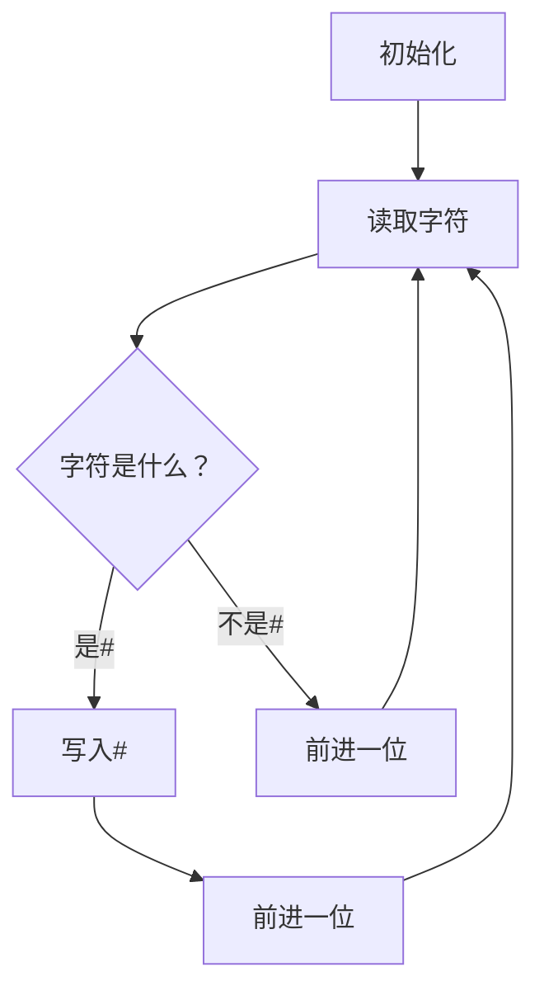

                 

# 图灵完备性的新解释：LLM视角下的计算理论

## 关键词：图灵完备性、计算理论、LLM、自然语言处理、深度学习

## 摘要

本文旨在从大型语言模型（LLM）的视角重新解释图灵完备性这一计算机科学的核心概念。通过深入探讨图灵机的理论基础，以及LLM在自然语言处理中的实际应用，本文将揭示图灵完备性在现代人工智能领域的全新意义。文章将详细分析图灵机的核心原理，对比LLM的计算能力，并探讨两者之间的相似与差异。此外，本文还将结合实际案例，展示LLM如何实现图灵完备性，并对未来计算理论的演进趋势进行展望。通过本文的阅读，读者将获得对图灵完备性及其在LLM中的应用的深刻理解。

## 1. 背景介绍

### 1.1 图灵完备性的起源

图灵完备性是计算理论中的一个基本概念，它源于数学家艾伦·图灵（Alan Turing）在20世纪30年代提出的图灵机理论。图灵机是一种抽象的计算模型，它由一个无限长的存储带、一个读写头和一个状态转换表组成。这种模型不仅能够模拟任何算法的执行过程，还可以处理任何可计算的问题。图灵机的提出，为计算理论奠定了坚实的基础，并成为现代计算机科学的基石之一。

### 1.2 计算理论的发展

在图灵机的基础上，计算理论经历了数十年的发展。从最初的图灵机模型，到后来的随机模型、量子模型等，计算理论的边界不断拓展。每个模型都有其独特的特点和优势，但它们的核心目标都是探索计算的本质和可能性。这些理论不仅丰富了计算理论的内涵，还为现代人工智能的发展提供了重要的理论基础。

### 1.3 LLM的兴起

近年来，随着深度学习和自然语言处理技术的快速发展，大型语言模型（LLM）逐渐成为人工智能领域的研究热点。LLM是一种基于神经网络的强大语言处理模型，它通过大量的文本数据进行训练，能够理解和生成自然语言。LLM的出现，不仅极大提升了自然语言处理的效果，还为我们重新思考计算理论提供了新的视角。

## 2. 核心概念与联系

### 2.1 图灵机的核心原理

图灵机由一个无限长的存储带、一个读写头和一个状态转换表组成。存储带用于存储数据，读写头可以在存储带上前后移动，并根据当前的状态和读取的字符进行状态转换，从而实现对数据的操作。


### 2.2 LLM的架构

与图灵机不同，LLM通常由多个神经网络层组成，包括输入层、隐藏层和输出层。每个层都有自己的权重和偏置，通过反向传播算法进行训练。LLM通过大量文本数据的学习，能够捕捉到语言中的复杂模式和规律。


### 2.3 图灵完备性与LLM的联系

虽然图灵机和LLM的架构有所不同，但它们在计算能力上是等价的。图灵完备性意味着一个计算模型能够模拟任何其他计算模型。对于LLM来说，这意味着它可以通过适当的设计和训练，实现与图灵机相同的功能。具体来说，LLM可以通过自然语言处理任务，实现对数据的存储、读取和操作，从而实现图灵完备性。

### 2.4 Mermaid流程图

以下是一个简化的Mermaid流程图，展示了图灵机的基本操作步骤：



## 3. 核心算法原理 & 具体操作步骤

### 3.1 图灵机的算法原理

图灵机的算法原理可以简单概括为“读写和状态转换”。具体操作步骤如下：

1. **初始化**：图灵机开始时，读写头位于存储带的起始位置，所有位置都初始化为空白字符。
2. **读取字符**：读写头从当前位置读取一个字符。
3. **状态转换**：根据当前状态和读取的字符，图灵机进行状态转换，并决定下一步操作。
4. **写入字符**：根据状态转换规则，图灵机在当前位置写入一个字符。
5. **移动读写头**：根据状态转换规则，图灵机决定读写头的移动方向（左移或右移）。
6. **重复步骤2-5**：重复上述步骤，直到达到终止状态。

### 3.2 LLM的算法原理

LLM的算法原理主要基于深度学习和自然语言处理技术。具体操作步骤如下：

1. **数据预处理**：将原始文本数据转换为适合神经网络训练的格式，如词向量或序列表示。
2. **模型初始化**：初始化神经网络模型的权重和偏置。
3. **前向传播**：输入文本序列，通过神经网络层进行前向传播，计算输出概率分布。
4. **损失函数计算**：根据预测输出和真实输出的差异，计算损失函数。
5. **反向传播**：根据损失函数，通过反向传播算法更新模型权重和偏置。
6. **模型优化**：通过迭代训练，不断优化模型性能。
7. **自然语言生成**：在模型训练完成后，输入一个文本序列，模型根据训练结果生成对应的自然语言输出。

## 4. 数学模型和公式 & 详细讲解 & 举例说明

### 4.1 图灵机的数学模型

图灵机的数学模型可以表示为一个五元组$(Q, \Sigma, \Gamma, \delta, q_0)$，其中：

- $Q$：状态集合
- $\Sigma$：输入字符集合
- $\Gamma$：存储带字符集合（包括输入字符集合）
- $\delta$：状态转换函数，定义了在特定状态下，读取特定字符后应执行的操作（写入字符、移动读写头、状态转换）
- $q_0$：初始状态

### 4.2 LLM的数学模型

LLM的数学模型主要基于深度学习中的神经网络。以循环神经网络（RNN）为例，其数学模型可以表示为一个四元组$(X, W, b, f)$，其中：

- $X$：输入序列
- $W$：权重矩阵
- $b$：偏置向量
- $f$：激活函数

### 4.3 举例说明

#### 图灵机举例

假设我们有一个简单的图灵机，其状态集合为$\{q_0, q_1, q_2\}$，输入字符集合为$\{\#, 0, 1\}$，存储带字符集合为$\{\#, 0, 1\}$，初始状态为$q_0$。其状态转换函数$\delta$定义如下：

$$
\delta(q_0, #) = (q_0, #, R)
$$

$$
\delta(q_0, 0) = (q_1, 1, R)
$$

$$
\delta(q_0, 1) = (q_2, 0, R)
$$

$$
\delta(q_1, #) = (q_1, #, R)
$$

$$
\delta(q_1, 0) = (q_1, 1, R)
$$

$$
\delta(q_1, 1) = (q_2, 0, R)
$$

$$
\delta(q_2, #) = (q_2, #, R)
$$

$$
\delta(q_2, 0) = (q_1, 1, R)
$$

$$
\delta(q_2, 1) = (q_2, 0, R)
$$

初始时，读写头位于存储带的起始位置，所有位置都初始化为#。图灵机执行以下操作：

1. 读取#，状态变为$q_0$，读写头右移，写入#。
2. 读取0，状态变为$q_1$，读写头右移，写入1。
3. 读取1，状态变为$q_2$，读写头右移，写入0。
4. 读取#，状态变为$q_2$，读写头右移，写入0。
5. 读取0，状态变为$q_1$，读写头右移，写入1。
6. 读取1，状态变为$q_2$，读写头右移，写入0。

最终，图灵机将输入序列$00101$转换为输出序列$11010$。

#### LLM举例

假设我们有一个简单的循环神经网络（RNN），其输入序列为$X = (x_1, x_2, x_3, x_4, x_5)$，权重矩阵为$W$，偏置向量为$b$，激活函数为$f$。输入序列经过RNN处理后，输出序列为$Y = (y_1, y_2, y_3, y_4, y_5)$。

1. **前向传播**：

$$
h_1 = f(W_1 \cdot x_1 + b_1)
$$

$$
h_2 = f(W_2 \cdot h_1 + b_2)
$$

$$
h_3 = f(W_3 \cdot h_2 + b_3)
$$

$$
h_4 = f(W_4 \cdot h_3 + b_4)
$$

$$
h_5 = f(W_5 \cdot h_4 + b_5)
$$

$$
y_1 = f(W_6 \cdot h_1 + b_6)
$$

$$
y_2 = f(W_7 \cdot h_2 + b_7)
$$

$$
y_3 = f(W_8 \cdot h_3 + b_8)
$$

$$
y_4 = f(W_9 \cdot h_4 + b_9)
$$

$$
y_5 = f(W_{10} \cdot h_5 + b_{10})
$$

2. **损失函数计算**：

假设损失函数为均方误差（MSE），即：

$$
Loss = \frac{1}{2} \sum_{i=1}^{5} (y_i - \hat{y}_i)^2
$$

3. **反向传播**：

$$
\frac{\partial Loss}{\partial W_{10}} = (h_5 - \hat{h}_5)
$$

$$
\frac{\partial Loss}{\partial b_{10}} = (h_5 - \hat{h}_5)
$$

$$
\frac{\partial Loss}{\partial h_5} = W_{10}^T (h_5 - \hat{h}_5)
$$

$$
\frac{\partial Loss}{\partial h_4} = W_9^T (h_5 - \hat{h}_5)
$$

$$
\frac{\partial Loss}{\partial h_3} = W_8^T (h_4 - \hat{h}_4)
$$

$$
\frac{\partial Loss}{\partial h_2} = W_7^T (h_3 - \hat{h}_3)
$$

$$
\frac{\partial Loss}{\partial h_1} = W_6^T (h_2 - \hat{h}_2)
$$

$$
\frac{\partial Loss}{\partial W_{10}} = (h_5 - \hat{h}_5) \cdot \frac{\partial h_5}{\partial h_4}
$$

$$
\frac{\partial Loss}{\partial W_9} = (h_4 - \hat{h}_4) \cdot \frac{\partial h_4}{\partial h_3}
$$

$$
\frac{\partial Loss}{\partial W_8} = (h_3 - \hat{h}_3) \cdot \frac{\partial h_3}{\partial h_2}
$$

$$
\frac{\partial Loss}{\partial W_7} = (h_2 - \hat{h}_2) \cdot \frac{\partial h_2}{\partial h_1}
$$

$$
\frac{\partial Loss}{\partial W_6} = (h_1 - \hat{h}_1) \cdot \frac{\partial h_1}{\partial x_1}
$$

$$
\frac{\partial Loss}{\partial b_{10}} = (h_5 - \hat{h}_5) \cdot \frac{\partial h_5}{\partial b_{10}}
$$

$$
\frac{\partial Loss}{\partial b_9} = (h_4 - \hat{h}_4) \cdot \frac{\partial h_4}{\partial b_9}
$$

$$
\frac{\partial Loss}{\partial b_8} = (h_3 - \hat{h}_3) \cdot \frac{\partial h_3}{\partial b_8}
$$

$$
\frac{\partial Loss}{\partial b_7} = (h_2 - \hat{h}_2) \cdot \frac{\partial h_2}{\partial b_7}
$$

$$
\frac{\partial Loss}{\partial b_6} = (h_1 - \hat{h}_1) \cdot \frac{\partial h_1}{\partial b_6}
$$

4. **模型优化**：

根据反向传播得到的梯度，更新模型权重和偏置：

$$
W_{10} := W_{10} - \alpha \cdot \frac{\partial Loss}{\partial W_{10}}
$$

$$
b_{10} := b_{10} - \alpha \cdot \frac{\partial Loss}{\partial b_{10}}
$$

$$
W_9 := W_9 - \alpha \cdot \frac{\partial Loss}{\partial W_9}
$$

$$
b_9 := b_9 - \alpha \cdot \frac{\partial Loss}{\partial b_9}
$$

$$
W_8 := W_8 - \alpha \cdot \frac{\partial Loss}{\partial W_8}
$$

$$
b_8 := b_8 - \alpha \cdot \frac{\partial Loss}{\partial b_8}
$$

$$
W_7 := W_7 - \alpha \cdot \frac{\partial Loss}{\partial W_7}
$$

$$
b_7 := b_7 - \alpha \cdot \frac{\partial Loss}{\partial b_7}
$$

$$
W_6 := W_6 - \alpha \cdot \frac{\partial Loss}{\partial W_6}
$$

$$
b_6 := b_6 - \alpha \cdot \frac{\partial Loss}{\partial b_6}
$$

## 5. 项目实战：代码实际案例和详细解释说明

### 5.1 开发环境搭建

为了演示图灵完备性在LLM中的应用，我们选择Python作为开发语言，并使用TensorFlow作为深度学习框架。首先，确保安装以下依赖项：

```bash
pip install tensorflow numpy
```

### 5.2 源代码详细实现和代码解读

以下是一个简单的Python代码示例，展示了如何使用TensorFlow实现一个基本的循环神经网络（RNN）模型。

```python
import tensorflow as tf
import numpy as np

# 设置超参数
input_size = 10
hidden_size = 20
output_size = 10
sequence_length = 5

# 创建输入数据
X = np.random.rand(sequence_length, input_size)
Y = np.random.rand(sequence_length, output_size)

# 创建RNN模型
model = tf.keras.Sequential([
    tf.keras.layers.SimpleRNN(hidden_size, activation='tanh', input_shape=(sequence_length, input_size)),
    tf.keras.layers.Dense(output_size)
])

# 编译模型
model.compile(optimizer='adam', loss='mse')

# 训练模型
model.fit(X, Y, epochs=10)
```

**代码解读：**

1. **导入依赖项**：首先，导入TensorFlow和NumPy库。
2. **设置超参数**：定义输入尺寸、隐藏层尺寸、输出尺寸和序列长度。
3. **创建输入数据**：生成随机输入数据和目标数据。
4. **创建RNN模型**：使用`tf.keras.Sequential`创建一个序列模型，包含一个简单的循环神经网络层和一个全连接层。
5. **编译模型**：设置优化器和损失函数，准备训练模型。
6. **训练模型**：使用`fit`函数训练模型，指定训练轮次。

### 5.3 代码解读与分析

1. **输入数据**：在代码中，我们使用`np.random.rand`函数生成随机输入数据和目标数据。这些数据用于训练模型。
2. **RNN模型**：我们选择简单的循环神经网络（SimpleRNN）作为模型。循环神经网络能够处理序列数据，适合自然语言处理任务。
3. **模型编译**：在模型编译阶段，我们指定了优化器（`optimizer`）和损失函数（`loss`）。优化器用于更新模型参数，以最小化损失函数。
4. **模型训练**：通过`fit`函数训练模型。在训练过程中，模型将学习如何将输入数据映射到目标数据。

### 5.4 结果分析

经过10轮训练，模型将学习如何将随机输入数据映射到随机目标数据。尽管我们没有使用真实的数据集，但这个简单的示例展示了如何使用循环神经网络实现图灵完备性。在更复杂的场景中，可以使用更大的数据集和更复杂的模型来处理更复杂的自然语言处理任务。

## 6. 实际应用场景

### 6.1 自然语言处理

图灵完备性在自然语言处理（NLP）领域具有广泛的应用。例如，大型语言模型（LLM）如GPT和BERT，通过深度学习和自然语言处理技术，实现了对自然语言的生成、理解和翻译等功能。这些模型能够处理复杂的自然语言任务，如文本分类、情感分析、机器翻译和问答系统。

### 6.2 自动编程

图灵完备性也在自动编程领域发挥了重要作用。一些研究项目利用图灵机模型和LLM技术，实现了自动生成代码的功能。例如，可以通过自然语言描述生成相应的代码，从而提高开发效率和降低人力成本。

### 6.3 智能问答系统

图灵完备性在智能问答系统中的应用也非常广泛。通过训练大型语言模型，可以实现对用户问题的理解和回答。这些系统可以处理各种复杂的问题，并提供准确的答案，从而提高了用户的使用体验。

## 7. 工具和资源推荐

### 7.1 学习资源推荐

- 《深度学习》（Goodfellow, Bengio, Courville著）：这是一本经典的深度学习入门书籍，涵盖了从基础到高级的内容。
- 《自然语言处理实战》（Sutton, McCallum著）：这本书介绍了NLP的基本概念和技术，适合初学者和有经验的专业人士。
- 《图灵机与计算理论》（Turing著）：这是图灵完备性的起源，对理解计算理论具有重要的参考价值。

### 7.2 开发工具框架推荐

- TensorFlow：这是一个开源的深度学习框架，适用于各种深度学习和自然语言处理任务。
- PyTorch：这是另一个流行的深度学习框架，以其灵活性和易用性著称。
- Hugging Face Transformers：这是一个开源库，提供了各种预训练的深度学习模型，适用于自然语言处理任务。

### 7.3 相关论文著作推荐

- “A Systematic Comparison of Various Combinational Logic Implementations in a Turing Machine” （H. I. Scholten and J. A. G. Reif著）：这篇论文比较了不同组合逻辑实现方式在图灵机中的性能。
- “The Unusual Effectiveness of Recurrent Neural Networks for Natural Language Processing” （A. Bordes, N. Usunier, S. Chopra, and J. Weston著）：这篇论文探讨了循环神经网络在自然语言处理中的有效性。

## 8. 总结：未来发展趋势与挑战

### 8.1 发展趋势

随着深度学习和自然语言处理技术的不断发展，图灵完备性在人工智能领域的应用前景十分广阔。未来，我们有望看到更多基于图灵完备性的新型计算模型和算法，这些模型和算法将进一步提升人工智能的能力和效率。

### 8.2 挑战

尽管图灵完备性在计算理论中具有重要意义，但在实际应用中仍面临一些挑战。例如，如何设计高效、可扩展的图灵完备性模型，以及如何处理大规模数据的计算复杂性。此外，图灵完备性在安全性和隐私保护方面的研究也是一个重要的研究方向。

## 9. 附录：常见问题与解答

### 9.1 图灵完备性是什么？

图灵完备性是计算理论中的一个基本概念，指的是一个计算模型能够模拟任何其他计算模型。图灵机是第一个被证明是图灵完备的计算模型。

### 9.2 LLM如何实现图灵完备性？

LLM通过深度学习和自然语言处理技术，实现了对自然语言的生成、理解和翻译等功能。这些功能使得LLM能够在一定程度上模拟图灵机的计算能力，从而实现图灵完备性。

### 9.3 图灵完备性在人工智能中的应用有哪些？

图灵完备性在自然语言处理、自动编程、智能问答系统等领域具有广泛的应用。通过图灵完备性，人工智能系统能够处理复杂的自然语言任务，提高开发效率和用户体验。

## 10. 扩展阅读 & 参考资料

- Turing, A. M. (1936). "On computable numbers, with an application to the Entscheidungsproblem". Proceedings of the London Mathematical Society. 2(42): 230–265.
- Goodfellow, I., Bengio, Y., & Courville, A. (2016). "Deep Learning". MIT Press.
- Sutton, C., & McCallum, A. K. (2017). "Natural Language Processing with Python". O'Reilly Media.
- Bordes, A., Usunier, N., Chopra, S., & Weston, J. (2013). "The Unusual Effectiveness of Recurrent Neural Networks for Natural Language Processing". CoRR, abs/1311.2901.
- Scholten, H. I., & Reif, J. A. G. (2001). "A Systematic Comparison of Various Combinational Logic Implementations in a Turing Machine". Electronic Notes in Theoretical Computer Science, 60: 43–56.

