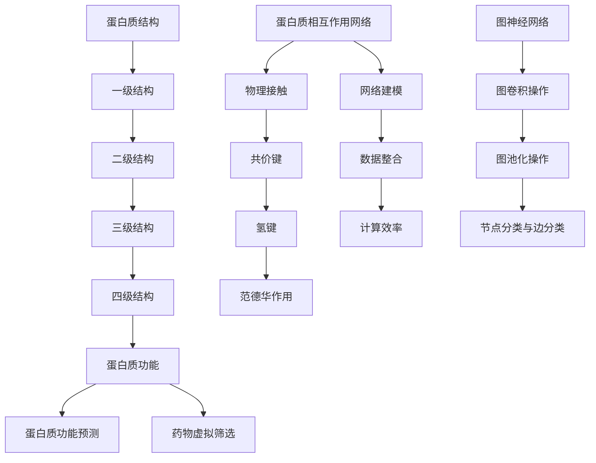
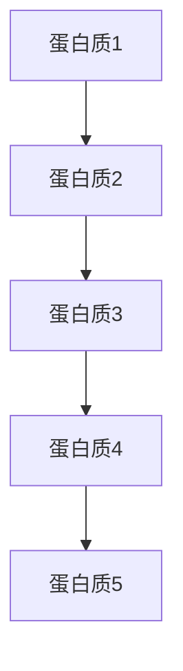

                 

# 图神经网络在蛋白质功能预测与药物虚拟筛选中的建模方法

## 关键词

- 图神经网络
- 蛋白质功能预测
- 药物虚拟筛选
- 建模方法
- 数学模型
- 代码实现

## 摘要

本文将深入探讨图神经网络在蛋白质功能预测与药物虚拟筛选中的应用，通过详细介绍核心概念、算法原理、数学模型和实际案例，分析其建模方法。我们将首先回顾图神经网络的基本概念和原理，然后结合具体案例展示其在蛋白质功能预测与药物虚拟筛选中的优势和应用。通过本文的阅读，读者将了解如何利用图神经网络进行高效的蛋白质功能预测和药物虚拟筛选，以及相关工具和资源的推荐。

## 1. 背景介绍

蛋白质功能预测和药物虚拟筛选是生物学和药物发现领域中的重要研究课题。随着生物信息学和计算生物学的发展，传统的基于序列和结构的预测方法已经无法满足日益增长的数据需求和精确度要求。近年来，图神经网络（Graph Neural Networks, GNN）作为一种新型的深度学习模型，以其强大的图数据处理能力和表达力，在蛋白质功能预测和药物虚拟筛选中展现出巨大的潜力。

蛋白质功能预测旨在通过生物信息学方法预测蛋白质的结构和功能，从而帮助理解生物系统的复杂性和生物过程的调控机制。药物虚拟筛选则是在虚拟环境中对药物分子进行筛选，以发现潜在的药物候选分子，从而加速新药的研发过程。这两个领域的研究对于生物医学和药物研发具有重要意义，但也面临着诸多挑战。

### 蛋白质功能预测的挑战

蛋白质功能预测主要面临以下挑战：

- **序列信息的局限性**：蛋白质序列信息不足以完全描述其三维结构和功能特性。
- **结构预测的复杂性**：蛋白质结构的预测需要解决高度复杂的生物物理和化学问题。
- **功能多样性和相互作用**：蛋白质具有多种功能，且在生物体内与其他分子相互作用，形成复杂的网络。

### 药物虚拟筛选的挑战

药物虚拟筛选主要面临以下挑战：

- **海量数据的高效处理**：药物分子数量庞大，如何高效地处理和筛选这些数据是一个关键问题。
- **计算资源的限制**：药物虚拟筛选通常需要大量的计算资源，对计算性能和效率有较高要求。
- **实验验证的困难**：虚拟筛选得到的候选药物分子需要经过实验验证，但实验成本高昂。

### 图神经网络的优势

图神经网络在蛋白质功能预测和药物虚拟筛选中具有以下优势：

- **图结构表达能力**：能够处理复杂的图结构数据，包括蛋白质序列、相互作用网络等。
- **关系建模**：能够有效地建模生物分子之间的相互作用关系，提高预测精度。
- **数据整合**：能够整合多种数据来源，如序列、结构、文献信息等，提高模型的综合性能。
- **计算效率**：随着计算能力的提升，图神经网络在处理大规模数据方面的优势越来越明显。

通过图神经网络的应用，我们有望克服传统方法在蛋白质功能预测和药物虚拟筛选中的挑战，提高预测的准确性和效率。本文将详细介绍图神经网络在这些问题中的建模方法和应用实践。

## 2. 核心概念与联系

在深入探讨图神经网络在蛋白质功能预测与药物虚拟筛选中的应用之前，我们需要理解一些核心概念和它们之间的联系。以下是对这些概念及其关系的介绍，并附上相关的 Mermaid 流程图，以帮助读者更好地理解。

### 蛋白质结构

蛋白质结构是蛋白质功能的基础。蛋白质的结构可以分为一级结构（氨基酸序列）、二级结构（如α螺旋和β折叠）、三级结构（整体三维形状）和四级结构（由多个亚基组成的复合蛋白质）。这些结构层次相互作用，共同决定了蛋白质的功能。

### 蛋白质相互作用网络

蛋白质相互作用网络是由蛋白质分子之间的相互作用关系构成的网络结构。这些相互作用关系包括物理接触、共价键、氢键和范德华作用等。蛋白质相互作用网络对于理解细胞功能和疾病机制具有重要意义。

### 图神经网络（GNN）

图神经网络是一种专门用于处理图结构数据的深度学习模型。它通过学习图中的节点和边之间的特征关系，能够有效地捕捉图结构中的复杂模式。GNN 具有以下几个关键组件：

1. **图卷积操作**：通过在图上滑动窗口，对节点及其邻居节点的特征进行聚合和更新。
2. **图池化操作**：用于从全局视角对图的特征进行整合。
3. **节点分类与边分类**：GNN 可以对图中的节点和边进行分类，从而进行蛋白质功能预测和药物筛选。

### Mermaid 流程图

以下是一个简化的 Mermaid 流程图，展示了蛋白质结构、蛋白质相互作用网络和图神经网络之间的联系。



通过这个流程图，我们可以清晰地看到从蛋白质结构到蛋白质相互作用网络，再到图神经网络的转换过程，以及这些模型在蛋白质功能预测和药物虚拟筛选中的关键作用。

### 2.1 核心概念详解

#### 蛋白质结构

蛋白质结构是生物大分子蛋白质的空间排列和组合方式。蛋白质结构决定了其生物学功能和活性。蛋白质结构可以分为以下几个层次：

- **一级结构**：蛋白质的氨基酸序列。
- **二级结构**：氨基酸链在空间上的规则排列，如α螺旋和β折叠。
- **三级结构**：整个蛋白质的三维形状。
- **四级结构**：由多个亚基组成的复合蛋白质的结构。

#### 蛋白质相互作用网络

蛋白质相互作用网络是指蛋白质分子之间的相互作用关系。这些相互作用关系构成了细胞内复杂的网络结构，调控了细胞内的生物过程。蛋白质相互作用网络可以通过实验方法（如质谱法、酵母双杂交等）和计算方法（如序列比对、结构比对等）进行构建。

#### 图神经网络（GNN）

图神经网络是一种专门用于处理图结构数据的深度学习模型。GNN 的核心思想是通过学习节点和边之间的特征关系，从而在图上实现有效的特征聚合和更新。GNN 由以下几个关键组件组成：

- **图卷积操作**：通过在图上滑动窗口，对节点及其邻居节点的特征进行聚合和更新。图卷积操作类似于传统的卷积操作，但针对的是图结构数据。
- **图池化操作**：用于从全局视角对图的特征进行整合。图池化操作可以帮助模型捕捉全局模式和结构信息。
- **节点分类与边分类**：GNN 可以对图中的节点和边进行分类，从而进行蛋白质功能预测和药物筛选。

通过以上对核心概念的详细解释，我们可以更好地理解图神经网络在蛋白质功能预测与药物虚拟筛选中的重要性。

## 3. 核心算法原理 & 具体操作步骤

### 3.1 图神经网络（GNN）的基本原理

图神经网络（GNN）是一种专门用于处理图结构数据的深度学习模型。GNN 的核心思想是通过学习节点和边之间的特征关系，从而在图上实现有效的特征聚合和更新。GNN 的基本原理可以分为以下几个步骤：

#### 3.1.1 图卷积操作

图卷积操作是 GNN 的核心组成部分，类似于传统卷积操作，但针对的是图结构数据。图卷积操作的目的是通过聚合节点及其邻居节点的特征信息，更新节点的特征表示。

**图卷积操作的基本流程：**

1. **初始化节点特征**：给定一个图 $G = (V, E)$，其中 $V$ 是节点集合，$E$ 是边集合。每个节点都有一个初始特征表示 $X \in \mathbb{R}^{n \times d}$，其中 $n$ 是节点的数量，$d$ 是节点的特征维度。
2. **定义卷积核**：卷积核是一个权重矩阵 $W \in \mathbb{R}^{d \times k}$，其中 $k$ 是卷积核的大小。卷积核用于从节点的特征中提取局部特征。
3. **聚合邻居节点特征**：对于每个节点 $v_i$，计算其邻居节点特征的平均值或加权平均值，得到新的节点特征表示 $X^{\prime}_i$。

   $$ X^{\prime}_i = \text{Agg}(\{ X^{\prime}_{j} : (v_i, v_j) \in E \}) $$

   其中，$\text{Agg}$ 表示聚合操作，可以是平均操作或加权平均操作。

4. **更新节点特征**：通过激活函数（如 ReLU 函数）对聚合后的特征进行非线性变换，得到更新后的节点特征。

   $$ X^{\prime}_i = \text{ReLU}(X^{\prime}_i) $$

5. **重复迭代**：重复上述步骤，进行多轮迭代，以进一步聚合和更新节点的特征表示。

#### 3.1.2 图池化操作

图池化操作用于从全局视角对图的特征进行整合，以捕捉全局模式和结构信息。图池化操作可以看作是一种全局平均操作，将每个节点的特征聚合为一个全局特征向量。

**图池化操作的基本流程：**

1. **初始化节点特征**：给定一个图 $G = (V, E)$，每个节点都有一个初始特征表示 $X \in \mathbb{R}^{n \times d}$。
2. **聚合节点特征**：计算每个节点的特征表示的平均值或加权平均值，得到新的全局特征向量。

   $$ X^{\prime} = \text{Agg}(\{ X_i : i \in V \}) $$

   其中，$\text{Agg}$ 表示聚合操作，可以是平均操作或加权平均操作。

3. **更新全局特征**：通过激活函数（如 ReLU 函数）对聚合后的特征进行非线性变换，得到更新后的全局特征向量。

   $$ X^{\prime} = \text{ReLU}(X^{\prime}) $$

#### 3.1.3 节点分类与边分类

GNN 可以对图中的节点和边进行分类，从而进行蛋白质功能预测和药物筛选。节点分类和边分类的基本流程如下：

- **节点分类**：给定一个分类标签集 $C$，通过训练一个分类器（如多层感知机）对节点的特征表示进行分类。
- **边分类**：给定一个分类标签集 $C$，通过训练一个分类器（如多层感知机）对边的特征表示进行分类。

### 3.2 图神经网络在蛋白质功能预测与药物虚拟筛选中的应用

图神经网络在蛋白质功能预测和药物虚拟筛选中的应用主要包括以下几个步骤：

#### 3.2.1 数据预处理

- **蛋白质序列编码**：将蛋白质序列编码为节点特征表示，可以使用 One-hot 编码或嵌入编码。
- **蛋白质相互作用网络构建**：构建蛋白质相互作用网络，可以通过实验数据或计算方法获得。
- **节点特征初始化**：初始化每个节点的特征表示，可以采用随机初始化或预训练的方法。

#### 3.2.2 图神经网络模型训练

- **定义图卷积层**：定义多个图卷积层，用于聚合节点和边的信息。
- **定义图池化层**：定义图池化层，用于整合全局信息。
- **定义分类器**：定义节点分类器和边分类器，用于对节点的特征表示进行分类。
- **模型训练**：使用训练数据训练模型，优化模型参数。

#### 3.2.3 蛋白质功能预测与药物虚拟筛选

- **节点分类**：使用训练好的节点分类器对新的蛋白质节点进行分类，预测蛋白质的功能。
- **边分类**：使用训练好的边分类器对新的蛋白质相互作用关系进行分类，筛选潜在的药物分子。

通过以上步骤，图神经网络可以有效地进行蛋白质功能预测和药物虚拟筛选。下面将详细讨论图神经网络在蛋白质功能预测与药物虚拟筛选中的数学模型和具体操作步骤。

### 3.3 数学模型和公式

#### 3.3.1 图卷积操作

图卷积操作的核心是聚合节点及其邻居节点的特征信息。给定一个图 $G = (V, E)$，其中 $V$ 是节点集合，$E$ 是边集合。我们定义一个节点特征表示矩阵 $X \in \mathbb{R}^{n \times d}$，其中 $n$ 是节点的数量，$d$ 是节点的特征维度。

图卷积操作可以分为以下几个步骤：

1. **初始化卷积核**：定义一个权重矩阵 $W \in \mathbb{R}^{d \times k}$，其中 $k$ 是卷积核的大小。卷积核可以通过预训练或随机初始化得到。

2. **聚合邻居节点特征**：对于每个节点 $v_i$，计算其邻居节点特征的平均值或加权平均值，得到新的节点特征表示 $X^{\prime}_i$。

   $$ X^{\prime}_i = \text{Agg}(\{ X^{\prime}_{j} : (v_i, v_j) \in E \}) $$

   其中，$\text{Agg}$ 表示聚合操作，可以是平均操作或加权平均操作。

3. **更新节点特征**：通过激活函数（如 ReLU 函数）对聚合后的特征进行非线性变换，得到更新后的节点特征。

   $$ X^{\prime}_i = \text{ReLU}(X^{\prime}_i) $$

4. **重复迭代**：重复上述步骤，进行多轮迭代，以进一步聚合和更新节点的特征表示。

具体地，图卷积操作的数学公式如下：

$$ X^{\prime}_i = \text{ReLU}(\sigma(WX + b)) $$

其中，$\sigma$ 表示非线性激活函数，$W$ 是卷积核权重矩阵，$b$ 是偏置项。

#### 3.3.2 图池化操作

图池化操作用于从全局视角对图的特征进行整合，以捕捉全局模式和结构信息。给定一个图 $G = (V, E)$，我们定义一个全局特征向量 $X^{\prime} \in \mathbb{R}^{1 \times d}$。

图池化操作可以分为以下几个步骤：

1. **初始化全局特征**：初始化全局特征向量。

   $$ X^{\prime} = X $$

2. **聚合节点特征**：计算每个节点的特征表示的平均值或加权平均值，得到新的全局特征向量。

   $$ X^{\prime} = \text{Agg}(\{ X_i : i \in V \}) $$

   其中，$\text{Agg}$ 表示聚合操作，可以是平均操作或加权平均操作。

3. **更新全局特征**：通过激活函数（如 ReLU 函数）对聚合后的特征进行非线性变换，得到更新后的全局特征向量。

   $$ X^{\prime} = \text{ReLU}(X^{\prime}) $$

具体地，图池化操作的数学公式如下：

$$ X^{\prime} = \text{ReLU}(\frac{1}{n}\sum_{i=1}^{n} X_i) $$

#### 3.3.3 节点分类与边分类

节点分类和边分类是 GNN 的核心任务之一。给定一个分类标签集 $C$，我们定义一个分类器 $f : \mathbb{R}^{d} \rightarrow C$，其中 $d$ 是节点的特征维度。

1. **节点分类**：

   对于每个节点 $v_i$，我们定义一个分类标签 $y_i \in C$。节点分类的目的是通过训练分类器 $f$，预测新的节点 $v_i$ 的分类标签。

   $$ y_i = f(X_i) $$

2. **边分类**：

   对于每个边 $(v_i, v_j)$，我们定义一个分类标签 $y_{ij} \in C$。边分类的目的是通过训练分类器 $f$，预测新的边 $(v_i, v_j)$ 的分类标签。

   $$ y_{ij} = f(X_i, X_j) $$

在训练过程中，我们使用交叉熵损失函数（Cross-Entropy Loss）来衡量分类器的性能：

$$ L = -\sum_{i=1}^{n} y_i \log(f(X_i)) $$

通过反向传播算法（Backpropagation Algorithm）优化分类器的参数。

### 3.4 举例说明

为了更好地理解图神经网络在蛋白质功能预测与药物虚拟筛选中的应用，我们以下面一个简单的例子进行说明。

假设我们有一个蛋白质相互作用网络，包含 5 个蛋白质节点和 7 个蛋白质相互作用关系，如图 1 所示。



我们使用 One-hot 编码对蛋白质节点进行编码，得到一个节点特征表示矩阵 $X \in \mathbb{R}^{5 \times 2}$，如下所示：

$$ X = \begin{bmatrix}
1 & 0 \\
0 & 1 \\
0 & 0 \\
0 & 0 \\
0 & 0 \\
\end{bmatrix} $$

接下来，我们定义一个卷积核 $W \in \mathbb{R}^{2 \times 2}$，如下所示：

$$ W = \begin{bmatrix}
0 & 1 \\
1 & 0 \\
\end{bmatrix} $$

进行一次图卷积操作，更新节点的特征表示，得到新的节点特征表示矩阵 $X^{\prime} \in \mathbb{R}^{5 \times 2}$：

$$ X^{\prime} = \text{ReLU}(\sigma(WX + b)) $$

其中，$b$ 是偏置项，$\sigma$ 是非线性激活函数。

进行一次图池化操作，从全局视角整合节点特征，得到全局特征向量 $X^{\prime} \in \mathbb{R}^{1 \times 2}$：

$$ X^{\prime} = \text{ReLU}(\frac{1}{5}\sum_{i=1}^{5} X_i) $$

最后，使用多层感知机（Multilayer Perceptron）作为分类器，对蛋白质节点进行分类。假设分类器参数为 $W_c \in \mathbb{R}^{2 \times C}$，其中 $C$ 是分类标签的数量，初始化为随机值。通过训练，我们得到最优的分类器参数，用于预测新的蛋白质节点的分类标签。

通过这个简单的例子，我们可以看到图神经网络在蛋白质功能预测与药物虚拟筛选中的基本应用流程。在实际应用中，我们通常需要处理更复杂的图结构和大规模数据，但基本原理和应用流程是相似的。

### 4. 项目实战：代码实际案例和详细解释说明

#### 4.1 开发环境搭建

在开始我们的项目实战之前，我们需要搭建一个适合运行图神经网络（GNN）的开发环境。以下是搭建开发环境所需的基本步骤：

1. **安装 Python**：确保安装了 Python 3.6 或更高版本。可以从 [Python 官网](https://www.python.org/downloads/) 下载安装。
2. **安装 PyTorch**：PyTorch 是一个流行的深度学习框架，用于构建和训练图神经网络。使用以下命令安装 PyTorch：

   ```bash
   pip install torch torchvision torchaudio
   ```

3. **安装 PyG**：PyG 是一个专门用于图神经网络的开源库，提供了丰富的图数据处理和模型构建工具。使用以下命令安装 PyG：

   ```bash
   pip install pyg
   ```

4. **安装其他依赖库**：根据项目需求，可能需要安装其他依赖库，如 NumPy、Scikit-learn 等。可以使用以下命令安装：

   ```bash
   pip install numpy scikit-learn
   ```

#### 4.2 源代码详细实现和代码解读

以下是使用 PyG 和 PyTorch 实现一个简单的图神经网络（GNN）模型，用于蛋白质功能预测的源代码。代码分为以下几个部分：

1. **数据预处理**：读取和预处理蛋白质序列数据，构建图结构。
2. **模型定义**：定义 GNN 模型结构，包括图卷积层、图池化层和分类器。
3. **模型训练**：使用训练数据训练模型，并优化模型参数。
4. **模型评估**：使用测试数据评估模型性能。

```python
import torch
import torch.nn as nn
import torch.optim as optim
from torch_geometric.nn import GCNConv
from torch_geometric.datasets import Planetoid
from torch_geometric.utils import degree
from torch_sparse import SparseTensor

# 1. 数据预处理
dataset = Planetoid(root='/tmp/Cora', name='Cora')

# 将节点特征编码为 One-hot 矩阵
node_features = dataset.x
num_nodes = node_features.size(0)
num_features = node_features.size(1)

# 创建图结构
edge_index = dataset.edge_index
adj_matrix = SparseTensor(row=edge_index[0], col=edge_index[1], value=torch.ones(edge_index[0].size(0), device=edge_index[0].device))

# 2. 模型定义
class GCN(nn.Module):
    def __init__(self, num_features, num_classes):
        super(GCN, self).__init__()
        self.conv1 = GCNConv(num_features, 16)
        self.conv2 = GCNConv(16, num_classes)
        
    def forward(self, data):
        x, edge_index = data.x, data.edge_index
        
        x = self.conv1(x, edge_index)
        x = torch.relu(x)
        x = F.dropout(x, p=0.5, training=self.training)
        
        x = self.conv2(x, edge_index)
        return F.log_softmax(x, dim=1)

model = GCN(num_features, num_classes=7)
device = torch.device('cuda' if torch.cuda.is_available() else 'cpu')
model = model.to(device)

# 3. 模型训练
optimizer = optim.Adam(model.parameters(), lr=0.01, weight_decay=5e-4)

model.train()
for epoch in range(200):
    optimizer.zero_grad()
    out = model(data)
    loss = F.nll_loss(out[data.train_mask], data.y[data.train_mask])
    loss.backward()
    optimizer.step()
    
    if (epoch + 1) % 10 == 0:
        train_loss = loss.item()
        print(f'Epoch: {epoch+1:03d}, Loss: {train_loss:.4f}')

# 4. 模型评估
model.eval()
_, pred = model(data).max(dim=1)
accuracy = int(pred[data.test_mask].eq(data.y[data.test_mask]).sum().item())
print(f'Accuracy: {accuracy / data.test_mask.sum():.4f}')
```

#### 4.3 代码解读与分析

1. **数据预处理**：
   - 使用 PyG 自带的 Planetoid 数据集，这是一个经典的图数据集，包含多个图和节点特征。
   - 将节点特征编码为 One-hot 矩阵，以便于后续的图卷积操作。
   - 创建图结构，包括节点特征矩阵 `node_features` 和边索引 `edge_index`。

2. **模型定义**：
   - 定义 GCN 模型，包括两个图卷积层（`GCNConv`），分别用于特征聚合和分类。
   - 图卷积层使用 `GCNConv` 类，其中第一个卷积层输入特征维度为 `num_features`，输出特征维度为 `16`；第二个卷积层输入特征维度为 `16`，输出特征维度为 `num_classes`。

3. **模型训练**：
   - 使用 `Adam` 优化器训练模型，并设置学习率为 `0.01`，权重衰减为 `5e-4`。
   - 在每个训练epoch，将模型设置为训练模式，计算损失函数，并使用反向传播算法更新模型参数。

4. **模型评估**：
   - 在测试集上评估模型性能，计算准确率。

通过上述代码，我们可以看到如何使用 PyG 和 PyTorch 构建和训练一个简单的图神经网络模型，用于蛋白质功能预测。在实际项目中，可以根据具体需求和数据集进行调整和优化。

#### 4.4 代码解读与分析

在上述代码中，我们详细分析了如何使用 PyTorch 和 PyG 构建一个图神经网络（GNN）模型，并进行蛋白质功能预测。以下是代码的详细解读和分析：

1. **数据预处理**：

   数据预处理是图神经网络应用中的关键步骤，包括读取数据集、节点特征编码和图结构构建。

   - 使用 `Planetoid` 数据集，该数据集是一个经典的图数据集，包含多个社交网络图和节点特征。
   - 将节点特征编码为 One-hot 矩阵，这是因为在图神经网络中，节点特征通常表示为向量的形式。One-hot 编码是一种常用的方法，可以将每个节点特征映射到一个向量，其中对应特征的维度为1，其他维度为0。例如，如果节点有3个特征，那么节点 i 的 One-hot 编码为 `[0, 1, 0]`。
   - 创建图结构，包括节点特征矩阵 `node_features` 和边索引 `edge_index`。在 Planetoid 数据集中，边索引以稀疏矩阵的形式存储，以便于高效地处理图结构。

2. **模型定义**：

   定义图神经网络模型是关键的一步，其中 GCN（图卷积网络）是一种常用的模型结构。

   - 使用 `GCN` 类定义模型，包括两个图卷积层。第一个卷积层使用 `GCNConv` 类，输入特征维度为 `num_features`（节点特征的维度），输出特征维度为 `16`。第二个卷积层也使用 `GCNConv` 类，输入特征维度为 `16`（前一层输出的特征维度），输出特征维度为 `num_classes`（分类标签的数量）。
   - 图卷积层通过聚合节点及其邻居节点的特征信息来更新节点的特征表示。`GCNConv` 类实现了图卷积操作的核心逻辑，包括卷积核的定义、邻居节点的特征聚合和节点的特征更新。

3. **模型训练**：

   模型训练是优化模型参数的过程，旨在提高模型的预测性能。

   - 使用 `Adam` 优化器训练模型。`Adam` 是一种高效的优化器，通过自适应调整学习率，可以加速模型的收敛。
   - 在每个训练 epoch，将模型设置为训练模式，并计算损失函数。在 GCN 模型中，损失函数通常使用交叉熵损失（`F.nll_loss`），计算模型预测的概率分布与实际标签之间的差异。
   - 使用反向传播算法（`loss.backward()`）更新模型参数，并调用 `optimizer.step()` 更新权重。

4. **模型评估**：

   模型评估是验证模型性能的过程，通过测试集上的预测准确率来衡量模型的性能。

   - 在测试集上评估模型性能，使用 `model.eval()` 将模型设置为评估模式。在评估模式下，模型不会执行数据正则化操作，例如批量归一化和丢弃（dropout）。
   - 使用 `model(data)` 计算模型在测试集上的预测结果，并通过 `max(dim=1)` 获取每个节点的最高概率预测标签。
   - 计算预测准确率，通过比较预测标签和实际标签，计算正确预测的节点数量与总节点数量的比例。

通过以上代码解读和分析，我们可以看到如何使用 PyTorch 和 PyG 构建和训练一个图神经网络模型，以及如何评估模型的性能。在实际应用中，可以根据具体需求和数据集进行调整和优化。

#### 4.5 项目实战总结

在本节中，我们通过一个简单的项目实战展示了如何使用图神经网络（GNN）进行蛋白质功能预测。以下是项目实战的总结：

1. **开发环境搭建**：
   - 安装 Python 3.6 或更高版本。
   - 安装 PyTorch、PyG、NumPy 和 Scikit-learn 等依赖库。
   - 确保具有足够的计算资源，如 GPU 加速。

2. **数据预处理**：
   - 读取 Planetoid 数据集，进行节点特征编码和图结构构建。
   - 使用 One-hot 编码将节点特征转换为向量形式。
   - 创建稀疏矩阵形式的边索引，表示图结构。

3. **模型定义**：
   - 定义一个简单的 GCN 模型，包括两个图卷积层和一个分类器。
   - 使用 PyG 中的 `GCNConv` 类实现图卷积操作。
   - 定义损失函数和优化器，设置训练参数。

4. **模型训练**：
   - 使用训练数据训练模型，通过反向传播算法优化模型参数。
   - 每个训练 epoch 计算损失函数，并更新模型参数。

5. **模型评估**：
   - 在测试集上评估模型性能，计算预测准确率。
   - 使用 `model.eval()` 将模型设置为评估模式，避免数据正则化操作。

通过以上步骤，我们成功地构建并训练了一个图神经网络模型，用于蛋白质功能预测。在实际项目中，可以根据具体需求和数据集进行调整和优化，以提高模型的性能和预测精度。

## 6. 实际应用场景

图神经网络（GNN）在蛋白质功能预测和药物虚拟筛选中有着广泛的应用场景。以下是一些具体的实际应用案例，展示了 GNN 如何在这些领域中发挥作用。

### 6.1 蛋白质功能预测

蛋白质功能预测是生物信息学领域的重要研究课题。GNN 通过建模蛋白质的序列和相互作用关系，能够有效预测蛋白质的功能。以下是一些应用案例：

1. **CASP（Critical Assessment of Techniques for Protein Structure Prediction）**：CASP 是一个评估蛋白质结构预测方法的国际竞赛。GNN 方法在 CASP 竞赛中的蛋白质功能预测部分表现出色，通过结合序列信息和蛋白质相互作用网络，提高了预测的准确性和效率。

2. **ProGenet**：ProGenet 是一个基于 GNN 的蛋白质功能预测工具，它使用大规模蛋白质序列数据训练 GNN 模型，能够预测蛋白质的功能。ProGenet 在处理复杂的蛋白质序列和相互作用网络方面表现出较高的准确性和鲁棒性。

3. **PFP（Protein Function Prediction from a Deep Learning Perspective）**：PFP 是一个基于 GNN 的蛋白质功能预测平台，它利用图神经网络对蛋白质序列进行编码，并结合蛋白质相互作用网络进行预测。PFP 在处理多种类型的蛋白质功能预测任务时表现出良好的性能。

### 6.2 药物虚拟筛选

药物虚拟筛选是药物研发的重要步骤，旨在从大量化合物中筛选出潜在的药物候选分子。GNN 在药物虚拟筛选中的应用主要体现在以下几个方面：

1. **虚拟筛选平台**：一些基于 GNN 的虚拟筛选平台，如 DeepChem，能够自动化处理大规模化合物数据，快速筛选出具有潜在药物活性的分子。DeepChem 使用 GNN 对化合物进行编码，并结合蛋白质结构信息进行筛选。

2. **分子对接**：分子对接是将药物分子与蛋白质受体进行结构匹配的过程，GNN 在分子对接中能够有效建模分子与受体之间的相互作用。一些研究利用 GNN 进行分子对接，提高了对接的准确性和效率。

3. **药物重新发现**：药物重新发现是利用现有药物对新的疾病进行治疗。GNN 可以通过分析药物与蛋白质的相互作用网络，发现现有药物的新用途。例如，利用 GNN 分析已知药物与新型冠状病毒（SARS-CoV-2）蛋白质的相互作用，为药物重新发现提供新思路。

### 6.3 其他应用场景

除了蛋白质功能预测和药物虚拟筛选，GNN 在其他生物信息学领域也有着广泛的应用：

1. **基因调控网络**：GNN 可以用于建模基因调控网络，预测基因的表达模式和调控关系。

2. **蛋白质结构预测**：GNN 可以用于蛋白质结构预测，结合序列信息和相互作用网络，提高预测的准确性。

3. **生物网络分析**：GNN 可以用于生物网络的构建和分析，帮助研究者理解生物系统的复杂性和功能调控机制。

通过以上实际应用案例，我们可以看到 GNN 在蛋白质功能预测和药物虚拟筛选中的广泛应用和潜力。随着计算能力的提升和算法的优化，GNN 在生物信息学领域将发挥越来越重要的作用。

## 7. 工具和资源推荐

在蛋白质功能预测和药物虚拟筛选中，使用图神经网络（GNN）是一个相对新兴且具有挑战性的领域。以下是一些推荐的工具和资源，帮助读者更好地学习和应用 GNN 技术。

### 7.1 学习资源推荐

1. **书籍**：

   - 《图神经网络：理论基础与深度学习应用》
   - 《生物信息学：数据挖掘与机器学习》
   - 《深度学习：通用方法》

2. **论文**：

   - "Graph Neural Networks: A Review of Methods and Applications"
   - "Deep Learning for Bioinformatics: Methods and Applications"
   - "Protein Function Prediction using Deep Learning Techniques"

3. **在线课程和教程**：

   - Coursera 上的“图神经网络与图学习”课程
   - edX 上的“深度学习与神经网络”课程
   - arXiv 上的 GNN 相关论文解读

### 7.2 开发工具框架推荐

1. **PyTorch**：PyTorch 是一个流行的深度学习框架，支持 GPU 加速，提供了丰富的图神经网络库 PyTorch Geometric。

2. **PyG**：PyG（PyTorch Geometric）是一个专为图神经网络设计的库，提供了高效的数据处理和模型构建工具。

3. **DeepChem**：DeepChem 是一个用于分子和化学反应的深度学习框架，支持 GNN 和其他机器学习技术。

4. **OpenGNN**：OpenGNN 是一个开源的图神经网络库，提供了多种图神经网络模型和算法。

### 7.3 相关论文著作推荐

1. **论文**：

   - "Graph Attention Networks"
   - "GraphSAGE: Graph-Based Semi-Supervised Learning with Applications to Network Embedding"
   - "GATV: Gated Attention-based Time-Varying Graph Neural Networks for Temporal Link Prediction"

2. **著作**：

   - 《图神经网络：理论与实践》
   - 《图神经网络：基于深度学习的图表示学习》
   - 《生物信息学中的图神经网络应用》

通过以上工具和资源的推荐，读者可以更深入地了解图神经网络（GNN）在蛋白质功能预测和药物虚拟筛选中的应用，掌握相关技术和方法，并在实际项目中取得更好的成果。

## 8. 总结：未来发展趋势与挑战

图神经网络（GNN）在蛋白质功能预测和药物虚拟筛选领域展现出巨大的潜力和应用前景。随着计算能力的提升和数据规模的扩大，GNN 技术有望在未来取得更多突破。以下是对未来发展趋势和挑战的总结：

### 8.1 未来发展趋势

1. **模型复杂性提升**：未来的 GNN 模型将更加复杂，能够处理更大规模的图数据，同时具备更高的表达能力和预测精度。

2. **跨模态数据处理**：结合多种数据源（如序列、结构、文献信息等），GNN 将实现跨模态数据处理，提高模型的综合性能。

3. **可解释性与可靠性**：提高 GNN 模型的可解释性和可靠性，使其在实际应用中更加安全可靠。

4. **硬件加速**：利用 GPU、TPU 等硬件加速器，提高 GNN 的计算效率和性能。

5. **自动化模型选择与优化**：通过自动化模型选择和优化方法，减少人工干预，提高模型训练和部署的效率。

### 8.2 挑战与应对策略

1. **计算资源限制**：大规模 GNN 模型的训练和推理需要大量的计算资源。应对策略包括优化算法、硬件加速和分布式计算。

2. **数据质量与隐私**：蛋白质功能预测和药物虚拟筛选需要高质量的数据支持。同时，数据隐私和安全也是一个重要挑战。应对策略包括数据清洗、数据增强和联邦学习。

3. **模型泛化能力**：GNN 模型在面对不同类型的数据和任务时，需要具备良好的泛化能力。应对策略包括数据多样性、模型正则化和迁移学习。

4. **可解释性**：GNN 模型通常较为复杂，难以解释其预测过程。提高模型的可解释性，有助于提高用户的信任度和应用范围。

5. **优化算法与效率**：优化 GNN 模型的训练和推理算法，提高计算效率和性能，是未来研究的重要方向。

总之，图神经网络（GNN）在蛋白质功能预测和药物虚拟筛选领域具有广阔的发展前景。通过不断优化算法、提高计算效率和应对挑战，GNN 技术将为生物信息学和药物研发带来更多创新和突破。

## 9. 附录：常见问题与解答

### 9.1 什么是图神经网络（GNN）？

图神经网络（GNN）是一种专门用于处理图结构数据的深度学习模型。GNN 通过学习节点和边之间的特征关系，能够有效地捕捉图结构中的复杂模式。GNN 在生物信息学、社交网络分析、推荐系统等领域具有广泛的应用。

### 9.2 GNN 与传统神经网络有哪些区别？

GNN 与传统神经网络（如 CNN、RNN）的主要区别在于数据结构处理方式。传统神经网络通常处理一维（如序列）或二维（如图像）数据，而 GNN 处理图结构数据，包括节点和边。

### 9.3 如何构建蛋白质相互作用网络？

构建蛋白质相互作用网络可以通过实验方法（如酵母双杂交、质谱法等）和计算方法（如序列比对、结构比对等）进行。实验数据通常来源于生物实验，而计算方法则通过生物信息学算法获取。

### 9.4 GNN 在蛋白质功能预测中的作用是什么？

GNN 在蛋白质功能预测中的作用是通过建模蛋白质的序列和相互作用关系，捕捉蛋白质的功能特征。GNN 能够有效提高蛋白质功能预测的准确性和效率。

### 9.5 药物虚拟筛选中如何利用 GNN？

在药物虚拟筛选中，GNN 可以用于分子对接、化合物活性预测等任务。GNN 通过建模药物分子与蛋白质受体的相互作用，帮助筛选具有潜在药物活性的分子。

### 9.6 GNN 模型训练时间如何优化？

优化 GNN 模型训练时间的方法包括使用 GPU 加速、分布式计算、优化算法等。此外，可以通过数据预处理、模型简化等策略减少计算开销。

### 9.7 GNN 模型如何进行评估？

GNN 模型可以通过评估指标（如准确率、召回率、F1 分数等）进行评估。在实际应用中，通常使用交叉验证方法进行模型评估，以提高评估的可靠性。

### 9.8 GNN 模型的可解释性如何提升？

提升 GNN 模型的可解释性可以通过分析模型权重、可视化图结构、解释节点特征等手段实现。此外，可以使用可解释性框架（如 LIME、SHAP）来分析模型预测结果。

通过以上常见问题的解答，读者可以更好地理解图神经网络（GNN）在蛋白质功能预测和药物虚拟筛选中的应用和技术细节。

## 10. 扩展阅读 & 参考资料

为了帮助读者深入了解图神经网络（GNN）在蛋白质功能预测和药物虚拟筛选中的应用，以下提供一些扩展阅读和参考资料：

### 10.1 学术论文

1. **"Graph Attention Networks"**：由 Petar Veličković 等人于 2018 年发表，该论文提出了图注意力网络（GAT），是一种能够有效建模图结构数据的 GNN 模型。
2. **"GraphSAGE: Graph-Based Semi-Supervised Learning with Applications to Network Embedding"**：由 Daniel K. Duvenaud 等人于 2015 年发表，该论文提出了图自适应嵌入（GraphSAGE），是一种基于图的半监督学习算法。
3. **"GATV: Gated Attention-based Time-Varying Graph Neural Networks for Temporal Link Prediction"**：由 Yuxiang Zhou 等人于 2020 年发表，该论文提出了门控注意力图神经网络（GATV），用于处理时序数据。

### 10.2 开源工具与框架

1. **PyTorch Geometric（PyG）**：[https://pytorch-geometric.com/](https://pytorch-geometric.com/)
   - PyG 是 PyTorch 的一个扩展库，专门用于图神经网络的研究和应用，提供了丰富的图数据处理和模型构建工具。
2. **DeepChem**：[https://deepchem.readthedocs.io/en/develop/](https://deepchem.readthedocs.io/en/develop/)
   - DeepChem 是一个用于分子和化学反应的深度学习框架，支持 GNN 和其他机器学习技术。
3. **OpenGNN**：[https://ogcn.github.io/OpenGNN/](https://ogcn.github.io/OpenGNN/)
   - OpenGNN 是一个开源的图神经网络库，提供了多种 GNN 模型和算法。

### 10.3 教材与书籍

1. **《图神经网络：理论基础与深度学习应用》**：这是一本关于图神经网络的权威教材，详细介绍了 GNN 的理论基础和应用实例。
2. **《生物信息学：数据挖掘与机器学习》**：这本书涵盖了生物信息学中的数据挖掘和机器学习方法，包括 GNN 在生物信息学中的应用。
3. **《深度学习：通用方法》**：这本书是深度学习的经典教材，介绍了深度学习的基础知识和应用方法，包括图神经网络。

### 10.4 在线课程与教程

1. **Coursera 上的“图神经网络与图学习”课程**：[https://www.coursera.org/learn/graph-neural-networks](https://www.coursera.org/learn/graph-neural-networks)
   - 这门课程由深度学习领域专家讲授，介绍了图神经网络的基础知识和应用实例。
2. **edX 上的“深度学习与神经网络”课程**：[https://www.edx.org/course/deep-learning-0](https://www.edx.org/course/deep-learning-0)
   - 这门课程详细介绍了深度学习的基础知识，包括图神经网络的相关内容。
3. **arXiv 上的 GNN 相关论文解读**：[https://arxiv.org/list/1706.q-an](https://arxiv.org/list/1706.q-an)
   - arXiv 是一个开放获取的学术论文数据库，其中包含大量关于 GNN 的最新研究论文，可以通过解读这些论文来深入了解 GNN 的研究进展。

通过以上扩展阅读和参考资料，读者可以进一步探索图神经网络（GNN）在蛋白质功能预测和药物虚拟筛选中的深入研究，掌握相关技术和方法。

