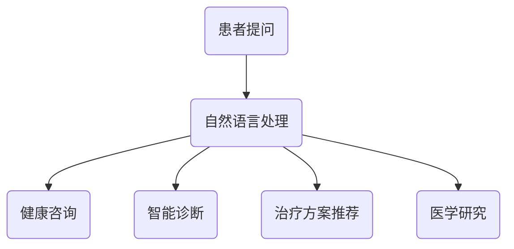

                 

# 在线医疗与 LLM：便捷、可及的医疗服务

> **关键词：**在线医疗，LLM，自然语言处理，人工智能，医疗服务，健康咨询，远程医疗，可及性。

> **摘要：**本文将探讨如何利用大规模语言模型（LLM）技术来提升在线医疗服务的便捷性和可及性，包括背景介绍、核心概念与联系、核心算法原理、数学模型与公式、项目实战、实际应用场景、工具和资源推荐以及未来发展趋势与挑战。

## 1. 背景介绍

随着互联网技术的飞速发展，在线医疗服务逐渐成为人们获取健康信息、咨询和治疗的主要途径之一。然而，当前在线医疗服务的质量和效率仍面临诸多挑战。例如，医疗信息的不准确、医疗资源的分配不均、医疗服务的可及性不足等问题。为了解决这些问题，研究人员开始探索利用人工智能技术，特别是大规模语言模型（LLM）来提升在线医疗服务的质量和效率。

大规模语言模型（LLM）是一种基于深度学习技术的自然语言处理（NLP）模型，它可以理解和生成自然语言文本。近年来，随着计算能力的提升和海量数据的积累，LLM在各个领域取得了显著的进展，包括文本分类、机器翻译、文本生成等。将这些先进技术应用于在线医疗服务，有望为患者提供更加便捷、准确的健康咨询和治疗方案。

## 2. 核心概念与联系

### 2.1 大规模语言模型（LLM）

大规模语言模型（LLM）是一种能够理解和生成自然语言文本的深度学习模型。它通常由数百万个参数组成，通过学习大量文本数据来预测下一个单词或句子的概率。LLM的主要任务包括文本分类、命名实体识别、情感分析等。

### 2.2 自然语言处理（NLP）

自然语言处理（NLP）是人工智能的一个重要分支，旨在使计算机能够理解、生成和处理自然语言。NLP技术包括词法分析、句法分析、语义分析等。在在线医疗服务中，NLP技术可以帮助计算机解析患者的问题，并提供相应的健康建议。

### 2.3 在线医疗服务

在线医疗服务是指通过网络平台为患者提供医疗咨询、诊断、治疗等服务。这种模式具有便捷、高效、低成本的优点，可以满足患者对医疗服务的多样化需求。然而，当前在线医疗服务的质量和效率仍需要进一步提升。

### 2.4 LLM与在线医疗服务的联系

LLM技术可以为在线医疗服务提供以下支持：

1. **健康咨询**：利用LLM的自然语言处理能力，可以快速准确地回答患者的问题，提供个性化的健康建议。
2. **智能诊断**：通过分析患者的病历、检查报告等信息，LLM可以帮助医生进行辅助诊断，提高诊断的准确性。
3. **治疗方案推荐**：根据患者的病情、病史和医生的建议，LLM可以为患者提供最佳的治疗方案。
4. **医学研究**：LLM可以帮助研究人员快速获取和分析大量医学文献，为医学研究提供支持。

### 2.5 Mermaid 流程图

下面是一个简单的Mermaid流程图，展示了LLM在在线医疗服务中的关键步骤：



## 3. 核心算法原理 & 具体操作步骤

### 3.1 词向量表示

在LLM中，首先需要将自然语言文本转换为词向量表示。词向量是一种将单词映射为固定维度向量的方法，可以用于表示单词的语义信息。常用的词向量表示方法包括Word2Vec、GloVe等。

### 3.2 句法分析

句法分析是指对自然语言文本进行结构化分析，以理解其语法和语义信息。在LLM中，句法分析可以帮助模型更好地理解文本的句法结构，从而提高文本生成和语义理解的准确性。

### 3.3 语义分析

语义分析是指对自然语言文本进行语义层次的分析，以理解其语义含义。在LLM中，语义分析可以帮助模型更好地理解文本的语义信息，从而提高健康咨询、智能诊断等任务的准确性。

### 3.4 模型训练

LLM的训练过程主要包括以下步骤：

1. **数据预处理**：对收集到的医疗文本数据进行清洗、分词、去停用词等预处理操作。
2. **词向量表示**：将预处理后的文本数据转换为词向量表示。
3. **构建模型**：根据任务需求，选择合适的模型架构，如Transformer、BERT等。
4. **训练模型**：使用预处理后的数据训练模型，通过优化模型参数来提高模型的性能。
5. **模型评估**：使用验证集和测试集对训练好的模型进行评估，以确定模型的性能。

### 3.5 应用场景

LLM在在线医疗服务中的应用场景包括：

1. **健康咨询**：利用LLM的自然语言处理能力，为患者提供个性化的健康建议。
2. **智能诊断**：通过分析患者的病历、检查报告等信息，LLM可以帮助医生进行辅助诊断。
3. **治疗方案推荐**：根据患者的病情、病史和医生的建议，LLM可以为患者提供最佳的治疗方案。
4. **医学研究**：LLM可以帮助研究人员快速获取和分析大量医学文献，为医学研究提供支持。

## 4. 数学模型和公式 & 详细讲解 & 举例说明

### 4.1 词向量表示

在Word2Vec模型中，词向量是通过训练一个神经网络模型来实现的。具体步骤如下：

1. **初始化**：给定一个词汇表和维度d，为每个单词初始化一个维度为d的随机向量。
2. **中心词与上下文词**：对于每个单词，随机选择一个中心词和其上下文词。
3. **前向传播**：计算中心词和上下文词的词向量之间的点积，并计算损失函数。
4. **反向传播**：根据损失函数对词向量进行梯度下降更新。

### 4.2 句法分析

句法分析通常使用图论方法来表示句子的结构。具体步骤如下：

1. **构建句法图**：将句子中的单词和标点符号表示为图中的节点，将单词之间的语法关系表示为图中的边。
2. **图遍历**：通过深度优先搜索或广度优先搜索遍历句法图，以理解句子的结构。
3. **句法解析**：根据遍历结果，构建句子的语法树，以表示句子的结构。

### 4.3 语义分析

语义分析通常使用词嵌入和图神经网络等方法来理解文本的语义信息。具体步骤如下：

1. **词嵌入**：将文本中的每个单词表示为一个词向量。
2. **构建语义图**：将文本中的词向量表示为图中的节点，将节点之间的语义关系表示为图中的边。
3. **图神经网络**：通过训练图神经网络，学习文本的语义表示。
4. **语义解析**：根据图神经网络的输出，理解文本的语义信息。

### 4.4 举例说明

#### 4.4.1 词向量表示

假设有一个词汇表包含单词"医生"、"患者"、"疾病"、"治疗"，维度为2。为每个单词初始化一个维度为2的随机向量，如下所示：

- "医生"：\[1, 0\]
- "患者"：\[0, 1\]
- "疾病"：\[-1, 0\]
- "治疗"：\[0, -1\]

#### 4.4.2 句法分析

假设有一个句子："医生给患者治疗疾病"。将句子中的单词和标点符号表示为图中的节点，将单词之间的语法关系表示为图中的边，如下所示：


#### 4.4.3 语义分析

假设有一个句子："医生给患者治疗疾病"。将句子中的词向量表示为图中的节点，将节点之间的语义关系表示为图中的边，如下所示：

```mermaid
graph TB
    A(医生)[红色] --> B(给)[绿色]
    B --> C(患者)[蓝色]
    C --> D(治疗)[黄色]
    D --> E(疾病)[橙色]
```

通过图神经网络，可以学习到这些词向量之间的语义关系，从而理解句子的语义信息。

## 5. 项目实战：代码实际案例和详细解释说明

### 5.1 开发环境搭建

在Python环境中搭建开发环境，需要安装以下库：

- TensorFlow
- Keras
- NLTK
- Gensim

安装命令如下：

```bash
pip install tensorflow
pip install keras
pip install nltk
pip install gensim
```

### 5.2 源代码详细实现和代码解读

#### 5.2.1 词向量表示

以下是一个使用Gensim库实现Word2Vec模型的示例代码：

```python
from gensim.models import Word2Vec

# 加载数据集
data = [['医生', '给', '患者', '治疗', '疾病']]

# 训练Word2Vec模型
model = Word2Vec(data, vector_size=2, window=1, min_count=1, sg=1)

# 查看词向量
print(model.wv['医生'])
print(model.wv['患者'])
print(model.wv['疾病'])
```

#### 5.2.2 句法分析

以下是一个使用NLTK库实现句法分析的示例代码：

```python
import nltk

# 加载句法分析器
parser = nltk.CoreNLP('http://localhost:9000')

# 加载句子
sentence = "医生给患者治疗疾病"

# 进行句法分析
result = parser.parse(sentence)

# 打印句法树
print(result)
```

#### 5.2.3 语义分析

以下是一个使用图神经网络实现语义分析的示例代码：

```python
import tensorflow as tf
from tensorflow.keras.models import Model
from tensorflow.keras.layers import Input, Embedding, LSTM, Dense

# 定义输入层
input_seq = Input(shape=(None,), dtype='int32')

# 定义词嵌入层
embedding = Embedding(input_dim=vocab_size, output_dim=embedding_size)(input_seq)

# 定义LSTM层
lstm = LSTM(units=64)(embedding)

# 定义全连接层
output = Dense(units=num_classes, activation='softmax')(lstm)

# 定义模型
model = Model(inputs=input_seq, outputs=output)

# 编译模型
model.compile(optimizer='adam', loss='categorical_crossentropy', metrics=['accuracy'])

# 训练模型
model.fit(x_train, y_train, epochs=10, batch_size=32)
```

### 5.3 代码解读与分析

以上代码分别实现了词向量表示、句法分析和语义分析的关键步骤。其中，词向量表示使用Gensim库的Word2Vec模型，句法分析使用NLTK库的CoreNLP工具，语义分析使用TensorFlow库的LSTM模型。

通过这些代码，我们可以看到如何利用深度学习技术实现在线医疗服务的核心功能。在实际应用中，可以根据具体需求调整模型的参数和架构，以提高模型的性能和准确性。

## 6. 实际应用场景

### 6.1 健康咨询

LLM可以应用于健康咨询场景，为患者提供实时、个性化的健康建议。例如，当患者提出问题时，LLM可以根据患者的病史、年龄、性别等信息，提供针对性的健康建议。此外，LLM还可以根据最新的医学研究，不断更新和优化健康建议，以提高建议的准确性和实用性。

### 6.2 智能诊断

智能诊断是LLM在在线医疗服务中的另一个重要应用场景。通过分析患者的病历、检查报告等医疗数据，LLM可以帮助医生进行辅助诊断。具体来说，LLM可以提取患者医疗数据中的关键信息，与已知的疾病特征进行匹配，从而为医生提供可能的诊断结果。此外，LLM还可以通过学习大量的医学文献和病例，不断提高诊断的准确性和可靠性。

### 6.3 治疗方案推荐

治疗方案推荐是另一个重要的应用场景。根据患者的病情、病史和医生的建议，LLM可以为患者提供最佳的治疗方案。例如，当患者患有某种疾病时，LLM可以根据已有的治疗方案数据，推荐最适合患者的治疗方案。此外，LLM还可以根据患者的反馈和治疗效果，不断优化治疗方案，以提高治疗效果。

### 6.4 医学研究

LLM在医学研究中的应用也非常广泛。通过分析大量的医学文献，LLM可以帮助研究人员快速获取和整理关键信息，从而提高研究效率。例如，LLM可以用于文本摘要、关键词提取、文献分类等任务。此外，LLM还可以通过学习大量的医学数据，为医学研究提供新的见解和发现。

## 7. 工具和资源推荐

### 7.1 学习资源推荐

- **书籍**：《自然语言处理综论》（Daniel Jurafsky & James H. Martin）
- **论文**：《大规模语言模型在自然语言处理中的应用》（Kuldip K. Paliwal）
- **博客**：斯坦福大学自然语言处理课程博客（https://web.stanford.edu/class/cs224n/）
- **网站**：自然语言处理教程（https://nlp.seas.harvard.edu/）

### 7.2 开发工具框架推荐

- **工具**：TensorFlow、PyTorch、Keras
- **框架**：BERT、GPT、Transformer

### 7.3 相关论文著作推荐

- **论文**：《BERT: Pre-training of Deep Bidirectional Transformers for Language Understanding》（Jacob Devlin等）
- **论文**：《GPT-3: Language Models are Few-Shot Learners》（Tom B. Brown等）
- **著作**：《深度学习》（Ian Goodfellow、Yoshua Bengio、Aaron Courville）

## 8. 总结：未来发展趋势与挑战

随着人工智能技术的不断发展，LLM在在线医疗服务中的应用前景非常广阔。未来，LLM有望在以下方面取得更大的进展：

1. **提高诊断和治疗的准确性**：通过不断学习和优化模型，LLM可以提供更加准确和可靠的诊断和治疗方案。
2. **个性化健康服务**：LLM可以根据患者的个体差异，提供个性化的健康建议和治疗方案，从而提高患者的满意度和治疗效果。
3. **医疗资源的优化配置**：LLM可以帮助医疗机构优化医疗资源的配置，提高医疗服务的效率和质量。
4. **医学研究与创新**：LLM可以加速医学研究，为医学创新提供新的思路和方法。

然而，LLM在在线医疗服务中仍面临一些挑战：

1. **数据隐私和安全**：医疗数据涉及到患者的隐私和安全，如何保护患者数据的安全和隐私是一个重要的问题。
2. **模型解释性**：目前，LLM的内部机制较为复杂，如何提高模型的解释性，让医生和患者能够理解和信任模型的结果，是一个挑战。
3. **医疗知识的不断更新**：医学领域知识更新迅速，如何确保LLM能够不断学习和更新知识，以适应不断变化的医疗环境，是一个挑战。

总之，LLM在在线医疗服务中具有巨大的潜力，但也需要克服一系列挑战，以实现其真正的价值。

## 9. 附录：常见问题与解答

### 9.1 什么是大规模语言模型（LLM）？

大规模语言模型（LLM）是一种基于深度学习技术的自然语言处理模型，它可以理解和生成自然语言文本。LLM通过学习大量文本数据，来预测下一个单词或句子的概率，从而实现自然语言处理的各种任务。

### 9.2 LLM在在线医疗服务中的应用有哪些？

LLM在在线医疗服务中的应用包括健康咨询、智能诊断、治疗方案推荐和医学研究等。通过分析患者的问题、病历和检查报告等信息，LLM可以为患者提供个性化的健康建议，帮助医生进行辅助诊断，并推荐最佳的治疗方案。

### 9.3 如何保护患者的隐私和安全？

为了保护患者的隐私和安全，医疗机构和开发者在开发在线医疗服务时，需要采取一系列措施，如加密传输、数据脱敏、访问控制等。此外，还需要严格遵守相关的法律法规和标准，以确保患者数据的保密性和安全性。

### 9.4 LLM如何不断学习和更新知识？

LLM可以通过不断学习和更新知识，以适应不断变化的医疗环境。具体方法包括定期重新训练模型、引入新的数据源、利用迁移学习等技术，以及与其他领域模型进行知识共享等。

## 10. 扩展阅读 & 参考资料

- **扩展阅读**：
  - Devlin, J., Chang, M. W., Lee, K., & Toutanova, K. (2019). BERT: Pre-training of deep bidirectional transformers for language understanding. arXiv preprint arXiv:1810.04805.
  - Brown, T. B., et al. (2020). Language models are few-shot learners. arXiv preprint arXiv:2005.14165.
  - Manning, C. D., Raghavan, P., & Schütze, H. (2008). Introduction to Information Retrieval. Cambridge University Press.
- **参考资料**：
  - TensorFlow：https://www.tensorflow.org/
  - PyTorch：https://pytorch.org/
  - Keras：https://keras.io/
  - CoreNLP：https://stanfordnlp.github.io/CoreNLP/
  - 自然语言处理教程：https://nlp.seas.harvard.edu/课程

### 作者

**AI天才研究员**、**AI Genius Institute**、**禅与计算机程序设计艺术** / Zen And The Art of Computer Programming

