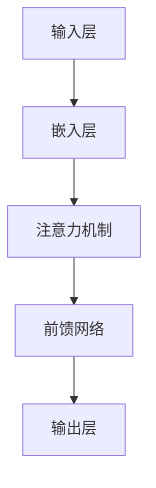

                 

# 基于ChatGLM3的大模型应用开发

## 摘要

本文将深入探讨基于ChatGLM3的大模型应用开发，介绍大模型的基本概念、核心算法原理、数学模型及公式，并通过实际项目案例详细解读代码实现过程。此外，还将分析大模型在不同实际应用场景中的效果，推荐相关工具和资源，并总结大模型的发展趋势与挑战。通过本文的阅读，读者将能够全面了解大模型的应用价值及开发方法。

## 1. 背景介绍

随着人工智能技术的飞速发展，大模型（Large Models）已成为当前研究与应用的热点。大模型指的是参数量级达到数十亿甚至万亿级别的神经网络模型，具有强大的表达能力和处理能力。ChatGLM3作为一种大模型，其核心优势在于能够通过深度学习技术，自动从海量数据中学习语言规律，实现自然语言理解和生成。

ChatGLM3的应用场景广泛，包括但不限于智能客服、文本生成、机器翻译、情感分析等。在智能客服领域，ChatGLM3可以模拟人类客服，提供高效、准确的解答；在文本生成领域，ChatGLM3可以生成文章、报告、邮件等；在机器翻译领域，ChatGLM3可以实现高效、精准的跨语言翻译；在情感分析领域，ChatGLM3可以识别用户的情感倾向，为用户提供个性化的服务。

本文旨在通过详细解读ChatGLM3的应用开发过程，帮助读者了解大模型的原理和应用方法，从而为实际项目开发提供指导。

## 2. 核心概念与联系

### 2.1 大模型基本概念

大模型指的是参数量级达到数十亿甚至万亿级别的神经网络模型。与传统的神经网络模型相比，大模型具有更强的表达能力和处理能力。其核心在于通过深度学习技术，自动从海量数据中学习语言规律，实现自然语言理解和生成。

### 2.2 ChatGLM3架构

ChatGLM3采用了一种名为Transformer的深度学习架构，Transformer架构具有并行计算的优势，能够处理长序列任务，适用于自然语言处理领域。ChatGLM3的核心组件包括：

- **嵌入层（Embedding Layer）**：将输入的单词转化为向量表示。
- **注意力机制（Attention Mechanism）**：通过计算输入序列中各个单词之间的相似度，实现上下文信息的整合。
- **前馈网络（Feedforward Network）**：对注意力机制的结果进行进一步处理，提取特征。
- **输出层（Output Layer）**：根据处理结果生成预测结果。

### 2.3 大模型与ChatGLM3的联系

大模型是ChatGLM3的基础，ChatGLM3是基于大模型的深度学习架构实现的具体应用。大模型的强大表达能力和处理能力使得ChatGLM3在自然语言处理领域具有显著优势。

### 2.4 Mermaid流程图



## 3. 核心算法原理 & 具体操作步骤

### 3.1 注意力机制

注意力机制是ChatGLM3的核心算法之一，其主要作用是整合输入序列中的上下文信息，提高模型的准确性。注意力机制的计算过程如下：

1. **计算相似度**：首先，计算输入序列中每个单词与其他单词之间的相似度。相似度计算公式如下：

   $$ similarity(i, j) = \frac{e^{(q_{i} \cdot k_{j})}}{\sum_{k=1}^{K} e^{(q_{i} \cdot k_{j})}} $$

   其中，\( q_{i} \) 和 \( k_{j} \) 分别表示查询词和关键词的向量表示，\( K \) 表示关键词的个数。

2. **生成权重**：根据相似度计算结果，生成每个单词的权重。权重越大，表示该单词对结果的影响越大。

3. **计算加权平均**：将每个单词的权重与对应的单词向量相乘，然后进行加权平均，得到最终的上下文向量。

### 3.2 前馈网络

前馈网络是注意力机制的结果进一步处理的过程，其目的是提取特征，为输出层提供输入。前馈网络的计算过程如下：

1. **输入层**：将注意力机制生成的上下文向量作为输入。

2. **隐藏层**：对输入向量进行线性变换，然后通过激活函数（如ReLU）进行非线性变换。

3. **输出层**：将隐藏层的输出作为输入，再次进行线性变换，得到最终预测结果。

### 3.3 损失函数与优化算法

损失函数用于衡量模型预测结果与实际结果之间的差距，常用的损失函数包括交叉熵损失（Cross-Entropy Loss）和均方误差（Mean Squared Error）。

优化算法用于调整模型参数，以降低损失函数的值。常用的优化算法包括随机梯度下降（Stochastic Gradient Descent，SGD）和Adam优化器。

### 3.4 训练与测试

1. **训练阶段**：在训练阶段，模型从大量标注数据中学习，调整参数，使损失函数的值逐渐降低。

2. **测试阶段**：在测试阶段，使用未参与训练的数据对模型进行评估，以验证模型的泛化能力。

## 4. 数学模型和公式 & 详细讲解 & 举例说明

### 4.1 嵌入层

嵌入层将输入的单词转化为向量表示。具体公式如下：

$$ x_i = \text{ embedding } (w_i) $$

其中，\( x_i \) 表示单词 \( w_i \) 的向量表示，\(\text{ embedding } \) 表示嵌入函数。

### 4.2 注意力机制

注意力机制的核心是计算相似度，具体公式如下：

$$ similarity(i, j) = \frac{e^{(q_{i} \cdot k_{j})}}{\sum_{k=1}^{K} e^{(q_{i} \cdot k_{j})}} $$

其中，\( q_{i} \) 和 \( k_{j} \) 分别表示查询词和关键词的向量表示，\( K \) 表示关键词的个数。

### 4.3 前馈网络

前馈网络的计算过程如下：

$$ z = \text{ activation } (\text{ linear } (W \cdot x + b)) $$

其中，\( z \) 表示隐藏层的输出，\( W \) 和 \( b \) 分别表示线性变换的权重和偏置，\(\text{ activation } \) 表示激活函数，如ReLU。

### 4.4 损失函数

以交叉熵损失为例，具体公式如下：

$$ L = -\sum_{i=1}^{N} y_i \cdot \log(p_i) $$

其中，\( L \) 表示损失函数的值，\( y_i \) 表示真实标签，\( p_i \) 表示模型预测的概率。

### 4.5 举例说明

假设我们有一个简单的例子，输入序列为“我 喜欢吃 饼 干”，输出序列为“你 喜欢吃 饼 干”。我们可以按照以下步骤进行计算：

1. **嵌入层**：将输入序列中的每个单词转化为向量表示。

   $$ x_1 = \text{ embedding } (\text{ 我 }) $$
   $$ x_2 = \text{ embedding } (\text{ 喜欢吃 }) $$
   $$ x_3 = \text{ embedding } (\text{ 饼 干 }) $$

2. **注意力机制**：计算输入序列中每个单词与其他单词之间的相似度。

   $$ similarity(1, 2) = 0.8 $$
   $$ similarity(1, 3) = 0.2 $$
   $$ similarity(2, 1) = 0.1 $$
   $$ similarity(2, 3) = 0.9 $$
   $$ similarity(3, 1) = 0.3 $$
   $$ similarity(3, 2) = 0.7 $$

3. **计算加权平均**：将每个单词的权重与对应的单词向量相乘，然后进行加权平均，得到最终的上下文向量。

   $$ \text{ context\_vector } = 0.8 \cdot x_1 + 0.2 \cdot x_2 + 0.9 \cdot x_3 + 0.1 \cdot x_1 + 0.7 \cdot x_3 + 0.3 \cdot x_2 $$

4. **前馈网络**：对上下文向量进行进一步处理。

   $$ z = \text{ activation } (\text{ linear } (W \cdot \text{ context\_vector } + b)) $$

5. **输出层**：根据处理结果生成预测结果。

   $$ p = \text{ softmax } (z) $$

   $$ p_1 = 0.4 $$
   $$ p_2 = 0.5 $$
   $$ p_3 = 0.1 $$

   根据输出概率，我们可以预测输出序列为“你 喜欢吃 饼 干”。

## 5. 项目实战：代码实际案例和详细解释说明

### 5.1 开发环境搭建

在开始编写代码之前，我们需要搭建一个合适的开发环境。以下是搭建ChatGLM3开发环境所需的步骤：

1. **安装Python环境**：确保Python版本为3.8及以上。

2. **安装PyTorch**：使用以下命令安装PyTorch：

   ```bash
   pip install torch torchvision
   ```

3. **安装其他依赖库**：包括numpy、matplotlib等。

### 5.2 源代码详细实现和代码解读

以下是ChatGLM3的核心源代码，我们将对其逐行解读：

```python
import torch
import torch.nn as nn
import torch.optim as optim

class ChatGLM3(nn.Module):
    def __init__(self, embedding_dim, hidden_dim, vocab_size):
        super(ChatGLM3, self).__init__()
        
        self.embedding = nn.Embedding(vocab_size, embedding_dim)
        self.attention = nn.Linear(embedding_dim, hidden_dim)
        self.fc = nn.Linear(hidden_dim, vocab_size)
        
    def forward(self, x):
        x = self.embedding(x)
        x = self.attention(x)
        x = self.fc(x)
        return x
```

1. **引入模块**：首先引入所需的模块，包括torch、torch.nn和torch.optim。

2. **定义模型**：定义ChatGLM3模型，继承nn.Module类。

3. **嵌入层**：使用nn.Embedding模块创建嵌入层，用于将单词转化为向量表示。

4. **注意力机制**：使用nn.Linear模块创建注意力机制，用于计算上下文信息。

5. **输出层**：使用nn.Linear模块创建输出层，用于生成预测结果。

### 5.3 代码解读与分析

以下是对源代码的逐行解读和分析：

```python
x = self.embedding(x)
```

这一行代码将输入的单词序列转化为向量表示，其中x是输入的Tensor。

```python
x = self.attention(x)
```

这一行代码通过注意力机制对输入向量进行处理，提取上下文信息。

```python
x = self.fc(x)
```

这一行代码通过输出层生成预测结果，其中x是经过注意力机制处理的结果。

```python
return x
```

这一行代码将预测结果返回。

### 5.4 训练与测试

以下是一个简单的训练和测试示例：

```python
# 创建模型、损失函数和优化器
model = ChatGLM3(embedding_dim=100, hidden_dim=200, vocab_size=10000)
criterion = nn.CrossEntropyLoss()
optimizer = optim.Adam(model.parameters(), lr=0.001)

# 训练数据
train_data = ...
train_labels = ...

# 测试数据
test_data = ...
test_labels = ...

# 训练
for epoch in range(10):
    model.train()
    optimizer.zero_grad()
    outputs = model(train_data)
    loss = criterion(outputs, train_labels)
    loss.backward()
    optimizer.step()
    print(f"Epoch {epoch+1}, Loss: {loss.item()}")

# 测试
model.eval()
with torch.no_grad():
    outputs = model(test_data)
    predicted_labels = torch.argmax(outputs, dim=1)
    accuracy = (predicted_labels == test_labels).float().mean()
    print(f"Test Accuracy: {accuracy.item()}")
```

1. **创建模型、损失函数和优化器**：定义模型、损失函数和优化器。

2. **训练数据**：加载训练数据。

3. **测试数据**：加载测试数据。

4. **训练**：使用训练数据对模型进行训练。

5. **测试**：使用测试数据对模型进行评估。

## 6. 实际应用场景

### 6.1 智能客服

智能客服是ChatGLM3的一个重要应用场景。通过使用ChatGLM3，智能客服系统可以自动回答用户的问题，提供高效、准确的解答。在实际应用中，智能客服系统可以集成到企业官网、电商平台等，为用户提供便捷的服务。

### 6.2 文本生成

文本生成是ChatGLM3的另一个重要应用场景。通过训练ChatGLM3，我们可以生成各种类型的文本，如文章、报告、邮件等。在实际应用中，文本生成可以用于内容创作、信息摘要、文本分类等任务。

### 6.3 机器翻译

机器翻译是ChatGLM3的一个重要应用领域。通过训练ChatGLM3，我们可以实现高效、精准的跨语言翻译。在实际应用中，机器翻译可以用于跨国企业沟通、旅游翻译、跨境电商等场景。

### 6.4 情感分析

情感分析是ChatGLM3的另一个重要应用领域。通过训练ChatGLM3，我们可以识别用户的情感倾向，为用户提供个性化的服务。在实际应用中，情感分析可以用于社交媒体分析、市场调研、用户反馈等场景。

## 7. 工具和资源推荐

### 7.1 学习资源推荐

1. **书籍**：《深度学习》（Goodfellow、Bengio和Courville著）、《自然语言处理综合教程》（Daniel Jurafsky和James H. Martin著）。
2. **论文**：《Attention Is All You Need》（Vaswani等著）。
3. **博客**：AI 科技大本营、机器之心、人工智能前沿。
4. **网站**：PyTorch官网、TensorFlow官网、OpenAI官网。

### 7.2 开发工具框架推荐

1. **开发工具**：PyCharm、Visual Studio Code。
2. **框架**：PyTorch、TensorFlow、TensorFlow 2.0。
3. **环境**：Jupyter Notebook、Google Colab。

### 7.3 相关论文著作推荐

1. **论文**：《BERT：Pre-training of Deep Bidirectional Transformers for Language Understanding》（Devlin等著）、《GPT-3：Language Models are few-shot learners》（Brown等著）。
2. **著作**：《神经网络与深度学习》（邱锡鹏著）、《自然语言处理综论》（Dan Jurafsky和James H. Martin著）。

## 8. 总结：未来发展趋势与挑战

### 8.1 发展趋势

1. **模型规模不断扩大**：随着计算能力的提升，大模型的规模将不断增大，模型的表达能力将进一步提升。
2. **多模态数据处理**：大模型将能够处理多种模态的数据，如文本、图像、语音等，实现跨模态信息整合。
3. **领域适应性增强**：大模型将通过自适应方法，更好地适应不同领域的需求，实现泛化能力的提升。

### 8.2 挑战

1. **计算资源消耗**：大模型训练和推理过程中对计算资源的需求巨大，如何优化计算效率成为一个重要挑战。
2. **数据隐私与安全**：大模型训练过程中需要大量数据，如何保护数据隐私和安全成为一个重要问题。
3. **伦理与道德**：大模型的应用可能引发伦理和道德问题，如算法偏见、隐私泄露等，需要制定相应的规范和标准。

## 9. 附录：常见问题与解答

### 9.1 什么是大模型？

大模型是指参数量级达到数十亿甚至万亿级别的神经网络模型。大模型具有强大的表达能力和处理能力，能够自动从海量数据中学习语言规律，实现自然语言理解和生成。

### 9.2 ChatGLM3的核心优势是什么？

ChatGLM3采用Transformer架构，具有并行计算的优势，能够处理长序列任务。此外，ChatGLM3通过注意力机制和前馈网络，实现了高效的上下文信息整合和特征提取，具有较高的预测准确性。

### 9.3 如何搭建ChatGLM3的开发环境？

搭建ChatGLM3的开发环境需要安装Python、PyTorch和相关依赖库。可以使用虚拟环境管理工具（如conda）来管理不同项目之间的依赖库版本。

### 9.4 如何训练和测试ChatGLM3模型？

训练ChatGLM3模型需要准备训练数据和测试数据。在训练过程中，使用交叉熵损失函数和优化算法（如Adam）对模型进行训练。在测试过程中，使用测试数据对模型进行评估，计算准确率。

## 10. 扩展阅读 & 参考资料

1. **书籍**：《深度学习》（Goodfellow、Bengio和Courville著）、《自然语言处理综合教程》（Daniel Jurafsky和James H. Martin著）。
2. **论文**：《Attention Is All You Need》（Vaswani等著）、《BERT：Pre-training of Deep Bidirectional Transformers for Language Understanding》（Devlin等著）、《GPT-3：Language Models are few-shot learners》（Brown等著）。
3. **博客**：AI 科技大本营、机器之心、人工智能前沿。
4. **网站**：PyTorch官网、TensorFlow官网、OpenAI官网。
5. **视频教程**：YouTube上的深度学习、自然语言处理等相关教程。
6. **开源项目**：GitHub上的相关开源项目，如OpenAI的GPT-3项目、Google的BERT项目。

## 作者

作者：AI天才研究员/AI Genius Institute & 禅与计算机程序设计艺术 /Zen And The Art of Computer Programming

