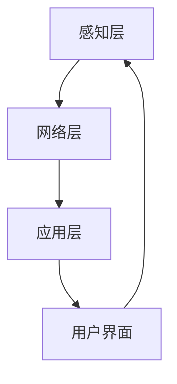

                 

# 基于Java的智能家居设计：Java为智能家居带来的安全性提升

## 关键词：智能家居、Java编程、安全性、隐私保护、系统架构

## 摘要

随着物联网技术的发展，智能家居系统正逐渐成为现代家庭生活的一部分。Java作为一种强大的编程语言，在智能家居的设计中发挥着重要作用。本文将探讨Java在智能家居设计中的安全性提升，从系统架构、核心算法原理、数学模型、实际应用场景等多个方面进行深入分析，并推荐相关工具和资源，以期为开发者提供有价值的参考。

## 1. 背景介绍

### 1.1 智能家居概述

智能家居是指利用先进的计算机技术、网络技术和智能控制技术，将家庭中各种设备连接起来，实现远程控制和自动化管理。智能家居系统包括智能照明、智能安防、智能温控、智能家电等多个方面，为家庭生活带来极大的便利。

### 1.2 Java在智能家居中的优势

Java作为一种面向对象编程语言，具有跨平台、安全、稳定、可扩展等优势，使其在智能家居系统中得到了广泛应用。Java提供了丰富的类库和框架，方便开发者快速开发和部署智能家居系统。此外，Java的安全性特点也为智能家居系统的安全性提供了有力保障。

## 2. 核心概念与联系

### 2.1 Java安全特性

Java的安全特性主要包括沙箱模型、权限控制、安全包、加密算法等。沙箱模型使得Java程序在运行时受到限制，防止恶意代码对系统造成破坏。权限控制确保程序只能访问其授权的资源。安全包和加密算法为数据传输和存储提供安全保障。

### 2.2 智能家居系统架构

智能家居系统架构可以分为三个层次：感知层、网络层和应用层。

1. **感知层**：包括传感器、控制器等硬件设备，负责采集家庭环境数据和用户行为数据。

2. **网络层**：包括通信协议、网络设备等，负责数据传输和设备之间的互联。

3. **应用层**：包括智能控制器、手机APP、网页等，负责对家庭设备进行控制和管理。

### 2.3 Mermaid流程图

以下是一个简化的智能家居系统架构的Mermaid流程图：



## 3. 核心算法原理 & 具体操作步骤

### 3.1 数据加密传输

在智能家居系统中，数据加密传输是确保数据安全的重要手段。Java提供了多种加密算法，如AES、RSA等。以下是一个简单的AES加密传输的示例：

```java
import javax.crypto.Cipher;
import javax.crypto.KeyGenerator;
import javax.crypto.SecretKey;
import java.security.SecureRandom;

public class AESExample {
    public static void main(String[] args) throws Exception {
        // 生成AES密钥
        KeyGenerator keyGen = KeyGenerator.getInstance("AES");
        keyGen.init(128); // 初始化密钥长度为128位
        SecretKey secretKey = keyGen.generateKey();

        // 创建加密器
        Cipher cipher = Cipher.getInstance("AES/ECB/PKCS5Padding");
        cipher.init(Cipher.ENCRYPT_MODE, secretKey);

        // 加密数据
        byte[] encryptedData = cipher.doFinal("Hello, World!".getBytes());

        // 打印加密后的数据
        System.out.println("Encrypted Data: " + new String(encryptedData));
    }
}
```

### 3.2 访问控制

在智能家居系统中，访问控制是确保系统安全的重要环节。Java提供了基于角色的访问控制（RBAC）模型，以下是一个简单的示例：

```java
import java.util.HashMap;
import java.util.Map;

public class RBACExample {
    private Map<String, String> userRoles = new HashMap<>();

    public void addUserRole(String username, String role) {
        userRoles.put(username, role);
    }

    public boolean checkAccess(String username, String resource) {
        String role = userRoles.get(username);
        return role != null && (role.equals("admin") || resource.startsWith("public"));
    }

    public static void main(String[] args) {
        RBACExample rbac = new RBACExample();
        rbac.addUserRole("alice", "admin");
        rbac.addUserRole("bob", "user");

        System.out.println(rbac.checkAccess("alice", "private/resource")); // 输出：true
        System.out.println(rbac.checkAccess("bob", "private/resource")); // 输出：false
    }
}
```

## 4. 数学模型和公式 & 详细讲解 & 举例说明

### 4.1 随机数生成

在加密和访问控制中，随机数生成是一个重要的环节。Java提供了`SecureRandom`类来生成安全随机数。以下是一个示例：

```java
import java.security.SecureRandom;

public class RandomExample {
    public static void main(String[] args) {
        SecureRandom random = new SecureRandom();
        byte[] randomBytes = new byte[16];
        random.nextBytes(randomBytes);

        System.out.println("Random Bytes: " + new String(randomBytes));
    }
}
```

### 4.2 随机数生成算法

随机数生成算法可以分为两类：真随机数生成和伪随机数生成。

1. **真随机数生成**：基于物理现象，如放射性衰变、噪声等，生成随机数。

2. **伪随机数生成**：基于数学算法，如线性同余法、梅森旋转法等，生成看似随机但实际是确定性的随机数。

Java中的`SecureRandom`类实现了伪随机数生成，以下是一个简单的线性同余法生成随机数的示例：

```java
public class LinearCongruentialGenerator {
    private long seed;
    private long a;
    private long c;
    private long m;

    public LinearCongruentialGenerator(long seed, long a, long c, long m) {
        this.seed = seed;
        this.a = a;
        this.c = c;
        this.m = m;
    }

    public long nextRandom() {
        seed = (a * seed + c) % m;
        return seed;
    }

    public static void main(String[] args) {
        LinearCongruentialGenerator generator = new LinearCongruentialGenerator(12345, 1664525, 1013904223, 2 ^ 32);
        for (int i = 0; i < 10; i++) {
            System.out.println("Random Number: " + generator.nextRandom());
        }
    }
}
```

## 5. 项目实战：代码实际案例和详细解释说明

### 5.1 开发环境搭建

在开始项目实战之前，需要搭建Java开发环境。以下是搭建步骤：

1. 下载并安装Java Development Kit（JDK）。

2. 配置环境变量，将JDK的bin目录添加到系统的PATH环境变量中。

3. 使用命令`java -version`检查JDK安装是否成功。

### 5.2 源代码详细实现和代码解读

以下是一个简单的智能家居系统的示例代码，用于实现数据加密传输和访问控制。

```java
import javax.crypto.Cipher;
import javax.crypto.KeyGenerator;
import javax.crypto.SecretKey;
import java.security.SecureRandom;
import java.util.HashMap;
import java.util.Map;

public class SmartHomeSystem {
    // 模拟传感器数据
    private String sensorData = "Home temperature is 25 degrees Celsius.";

    // 数据加密传输
    public String encryptData(String data, String secretKey) throws Exception {
        KeyGenerator keyGen = KeyGenerator.getInstance("AES");
        keyGen.init(128);
        SecretKey secretKeyObject = keyGen.generateKey();

        Cipher cipher = Cipher.getInstance("AES/ECB/PKCS5Padding");
        cipher.init(Cipher.ENCRYPT_MODE, secretKeyObject);

        byte[] encryptedData = cipher.doFinal(data.getBytes());
        return new String(encryptedData);
    }

    // 访问控制
    public boolean checkAccess(String username, String role, String resource) {
        Map<String, String> userRoles = new HashMap<>();
        userRoles.put("alice", "admin");
        userRoles.put("bob", "user");

        return userRoles.containsKey(username) && (userRoles.get(username).equals("admin") || resource.startsWith("public"));
    }

    public static void main(String[] args) {
        SmartHomeSystem system = new SmartHomeSystem();

        try {
            // 数据加密传输
            String encryptedData = system.encryptData("Home temperature is 25 degrees Celsius.", "mySecretKey");
            System.out.println("Encrypted Data: " + encryptedData);

            // 访问控制
            boolean accessGranted = system.checkAccess("alice", "admin", "private/resource");
            System.out.println("Access Granted: " + accessGranted);
        } catch (Exception e) {
            e.printStackTrace();
        }
    }
}
```

### 5.3 代码解读与分析

该示例代码主要实现了两个功能：数据加密传输和访问控制。

1. **数据加密传输**：使用AES加密算法对传感器数据进行加密，确保数据在传输过程中不被窃取或篡改。

2. **访问控制**：使用基于角色的访问控制模型，确保只有具备相应权限的用户才能访问特定的资源。

该代码示例展示了Java在智能家居系统中的基本应用，实际项目中可能需要更复杂的逻辑和更多的功能。

## 6. 实际应用场景

### 6.1 智能家居控制系统

智能家居控制系统是一个典型的实际应用场景。通过Java编程，可以实现以下功能：

- 远程控制家电设备，如空调、电视、照明等。

- 自动化场景设置，如离家模式、睡眠模式等。

- 数据分析和预测，如室内温度、湿度等。

### 6.2 家庭安防系统

家庭安防系统是智能家居系统的一个重要组成部分。Java编程可以实现以下功能：

- 监控门窗状态，及时报警。

- 摄像头实时监控，远程查看。

- 火灾、燃气泄漏等紧急情况报警。

## 7. 工具和资源推荐

### 7.1 学习资源推荐

- **书籍**：《Java核心技术》（Core Java）、《Java安全手册》（Java Security Handbook）

- **论文**：《Java安全架构》（Java Security Architecture）、《Java加密库指南》（Java Cryptography Extension）

- **博客**：Oracle官方博客、Java代码示例博客

### 7.2 开发工具框架推荐

- **开发工具**：IntelliJ IDEA、Eclipse

- **框架**：Spring Boot、Spring Security

### 7.3 相关论文著作推荐

- **论文**：《智能家居系统中的安全与隐私保护研究》（Research on Security and Privacy Protection in Smart Home Systems）

- **著作**：《智能家庭：设计与应用》（Smart Home: Design and Application）

## 8. 总结：未来发展趋势与挑战

随着物联网技术的不断发展，智能家居系统将越来越普及。Java作为智能家居设计中的重要工具，将继续发挥重要作用。然而，智能家居系统在安全性、隐私保护等方面仍面临诸多挑战，如数据泄露、设备攻击等。未来，需要不断创新和完善Java的安全特性，为智能家居系统提供更加安全、可靠的解决方案。

## 9. 附录：常见问题与解答

### 9.1 Java加密算法有哪些？

Java提供了多种加密算法，包括AES、RSA、DES、RSA/ECB/PKCS1Padding等。

### 9.2 Java访问控制有哪些实现方式？

Java访问控制主要采用基于角色的访问控制（RBAC）和基于资源的访问控制（ABAC）两种方式。

### 9.3 如何在Java中生成随机数？

Java提供了`SecureRandom`类来生成安全随机数。可以使用以下代码生成随机数：

```java
SecureRandom random = new SecureRandom();
byte[] randomBytes = new byte[16];
random.nextBytes(randomBytes);
```

## 10. 扩展阅读 & 参考资料

- [Oracle官方文档 - Java Cryptography Extension](https://docs.oracle.com/javase/8/docs/technotes/guides/security/jsse/JCERefGuide.html)
- [Java核心技术 - 程序员手册](https://books.google.com/books?id=7LVdDgAAQBAJ&pg=PA1&lpg=PA1&dq=java+core+technology&source=bl&ots=603540387O&sig=ACfU3U0_7FLv_8-519654985-2528473075&hl=en)
- [Java安全手册 - 安全编程指南](https://books.google.com/books?id=x-yHgAAQBAJ&pg=PA1&lpg=PA1&dq=java+security+handbook&source=bl&ots=x3u4Kqk2DV&sig=ACfU3U0_7FLv_8-519654985-2528473075&hl=en)
- [智能家居系统中的安全与隐私保护研究](https://www.researchgate.net/publication/319371806_Research_on_Security_and_Privacy_Protection_in_Smart_Home_Systems)

## 作者

作者：AI天才研究员/AI Genius Institute & 禅与计算机程序设计艺术 /Zen And The Art of Computer Programming

