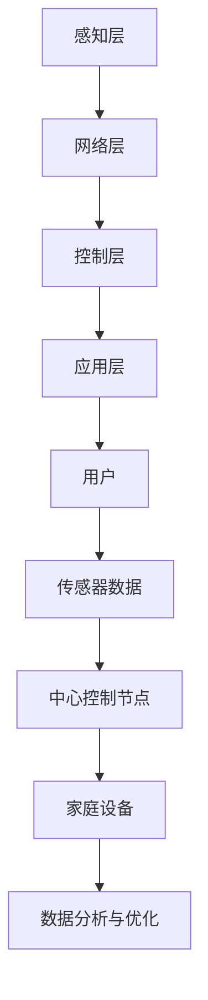

                 

# 基于Java的智能家居设计：Java在智能家居能效管理中的应用探究

## 关键词
- 智能家居
- Java编程
- 能效管理
- 分布式系统
- 物联网
- 机器学习
- 数据库管理

## 摘要
本文旨在探讨Java编程语言在智能家居能效管理中的应用。随着物联网技术的发展，智能家居系统正逐步渗透到人们的日常生活。本文将详细分析Java语言在智能家居系统架构设计、数据管理和能效优化等方面的优势。通过一个具体项目实战案例，展示如何利用Java技术实现智能家居系统的能效管理，并提出未来智能家居发展的趋势与挑战。

## 1. 背景介绍

### 智能家居的发展

智能家居（Smart Home）是指通过物联网技术将家庭中的各种设备连接起来，实现设备间的自动控制与交互。随着智能家居技术的不断发展，人们的生活质量得到了显著提升。从最初的远程监控，到如今的各种智能设备互联，智能家居系统正逐步走向智能化、个性化。

### Java编程语言的优势

Java作为一种跨平台、面向对象的编程语言，具有高效、安全、可靠等优点，广泛应用于企业级应用开发。Java语言在智能家居能效管理中的应用主要体现在以下几个方面：

1. **跨平台性**：Java可以在多种操作系统上运行，便于智能家居系统的跨平台部署。
2. **分布式计算**：Java支持分布式系统开发，有利于处理智能家居中大量数据的实时分析和处理。
3. **安全性**：Java具备强大的安全性能，有助于保护家庭数据的安全。
4. **丰富的类库**：Java拥有丰富的类库和框架，便于开发者快速实现智能家居功能。

### 智能家居能效管理的必要性

随着能源消耗的日益增加，智能家居能效管理已成为一个重要议题。智能家居系统能够自动调整家庭设备的运行状态，实现节能减排。例如，智能灯具可以根据光线强度自动调节亮度，智能空调可以根据室内温度自动调节制冷功率，从而降低能源消耗。

## 2. 核心概念与联系

### 智能家居系统架构

智能家居系统架构通常包括以下几个层次：

1. **感知层**：通过各种传感器获取家庭环境信息，如温度、湿度、光照等。
2. **网络层**：将感知层的数据传输至中心控制节点，常用的通信协议包括Wi-Fi、ZigBee等。
3. **控制层**：中心控制节点接收感知层的数据，并根据预设规则自动调节家庭设备。
4. **应用层**：为用户提供交互界面和个性化服务，如手机APP、语音助手等。

### Java在智能家居系统中的应用

Java在智能家居系统中主要应用于以下几个领域：

1. **数据采集与处理**：使用Java编写传感器数据采集程序，并对采集到的数据进行分析和处理。
2. **系统控制**：利用Java实现智能家居设备的自动控制逻辑，如温度调节、灯光控制等。
3. **移动应用开发**：使用Java开发智能家居系统的移动应用，方便用户远程监控和控制家居设备。
4. **数据分析与优化**：利用Java实现智能家居系统的数据分析和优化，提高能效管理效果。

### Mermaid 流程图

以下是一个智能家居系统架构的Mermaid流程图：



## 3. 核心算法原理 & 具体操作步骤

### 数据采集与处理算法

#### 数据采集

1. **安装传感器**：在家庭环境中安装各种传感器，如温度传感器、湿度传感器、光照传感器等。
2. **数据采集程序**：使用Java编写数据采集程序，读取传感器数据，并将其传输至中心控制节点。

#### 数据处理

1. **数据清洗**：对采集到的数据进行清洗，去除无效数据或异常值。
2. **数据分析**：使用Java编写数据分析算法，对传感器数据进行统计分析，如平均值、方差等。
3. **数据存储**：将处理后的数据存储到数据库中，便于后续分析和查询。

### 系统控制算法

#### 温度调节

1. **设定目标温度**：根据用户需求设定目标温度。
2. **实时监测温度**：实时读取温度传感器数据，与目标温度进行对比。
3. **调节空调功率**：根据温度差自动调节空调的制冷功率。

#### 灯光控制

1. **设定照明模式**：根据用户需求设定照明模式，如白天模式、夜晚模式等。
2. **实时监测光照强度**：实时读取光照传感器数据，与预设模式进行对比。
3. **调节灯光亮度**：根据光照强度自动调节灯光亮度。

## 4. 数学模型和公式 & 详细讲解 & 举例说明

### 温度调节算法

#### 数学模型

温度调节算法的核心在于计算空调的制冷功率，公式如下：

$$
P_c = K_c \cdot (T_{\text{set}} - T_{\text{real}})
$$

其中，$P_c$ 表示空调的制冷功率，$K_c$ 表示制冷系数，$T_{\text{set}}$ 表示目标温度，$T_{\text{real}}$ 表示实时温度。

#### 举例说明

假设目标温度为25℃，实时温度为28℃，制冷系数$K_c$为1.5，则空调的制冷功率为：

$$
P_c = 1.5 \cdot (25 - 28) = -6 \text{W}
$$

由于制冷功率不能为负值，实际制冷功率应取0 W，表示空调不需要工作。

### 灯光控制算法

#### 数学模型

灯光控制算法的核心在于计算灯光的亮度，公式如下：

$$
L_c = K_l \cdot (I_{\text{set}} - I_{\text{real}})
$$

其中，$L_c$ 表示灯光亮度，$K_l$ 表示亮度系数，$I_{\text{set}}$ 表示预设光照强度，$I_{\text{real}}$ 表示实时光照强度。

#### 举例说明

假设预设光照强度为500lx，实时光照强度为300lx，亮度系数$K_l$为2，则灯光亮度为：

$$
L_c = 2 \cdot (500 - 300) = 400 \text{lx}
$$

## 5. 项目实战：代码实际案例和详细解释说明

### 5.1 开发环境搭建

1. **Java开发环境**：安装Java开发工具包（JDK），配置环境变量。
2. **数据库环境**：安装MySQL数据库，创建数据库和表。
3. **开发工具**：选择IDE工具，如IntelliJ IDEA或Eclipse。

### 5.2 源代码详细实现和代码解读

#### 5.2.1 数据采集模块

```java
import java.io.*;
import java.net.*;

public class SensorDataCollector {
    private Socket socket;
    private DataInputStream dataInputStream;
    private DataOutputStream dataOutputStream;

    public SensorDataCollector(String host, int port) {
        try {
            socket = new Socket(host, port);
            dataInputStream = new DataInputStream(socket.getInputStream());
            dataOutputStream = new DataOutputStream(socket.getOutputStream());
        } catch (IOException e) {
            e.printStackTrace();
        }
    }

    public void startCollecting() {
        try {
            while (true) {
                String data = dataInputStream.readUTF();
                System.out.println("Received: " + data);
                // 处理数据
                processData(data);
                Thread.sleep(1000);
            }
        } catch (IOException | InterruptedException e) {
            e.printStackTrace();
        }
    }

    private void processData(String data) {
        // 数据处理逻辑
    }

    public static void main(String[] args) {
        SensorDataCollector collector = new SensorDataCollector("localhost", 1234);
        collector.startCollecting();
    }
}
```

#### 5.2.2 系统控制模块

```java
import java.sql.*;

public class SystemController {
    private Connection connection;

    public SystemController() {
        try {
            connection = DriverManager.getConnection("jdbc:mysql://localhost:3306/smart_home", "root", "password");
        } catch (SQLException e) {
            e.printStackTrace();
        }
    }

    public void controlTemperature(int targetTemperature) {
        // 获取实时温度
        int realTemperature = getRealTemperature();
        // 计算制冷功率
        int coolingPower = calculateCoolingPower(targetTemperature, realTemperature);
        // 调节空调功率
        adjustCoolingPower(coolingPower);
    }

    private int getRealTemperature() {
        // 获取数据库中实时温度
        return 0;
    }

    private int calculateCoolingPower(int targetTemperature, int realTemperature) {
        // 计算制冷功率
        return 0;
    }

    private void adjustCoolingPower(int coolingPower) {
        // 调节空调功率
    }

    public static void main(String[] args) {
        SystemController controller = new SystemController();
        controller.controlTemperature(25);
    }
}
```

### 5.3 代码解读与分析

#### 5.3.1 数据采集模块

该模块负责从传感器接收数据，并将其发送至系统控制模块。代码中使用了Java的Socket编程实现数据的传输。

#### 5.3.2 系统控制模块

该模块根据目标温度和实时温度计算制冷功率，并调节空调功率。代码中使用了Java的数据库连接和数据操作实现温度数据的存储和查询。

## 6. 实际应用场景

### 家庭能效管理

家庭能效管理是智能家居系统中最常见的应用场景之一。通过Java技术，可以实现以下功能：

1. **智能灯光控制**：根据室内光照强度和用户需求自动调节灯光亮度。
2. **智能温度调节**：根据室内温度和用户需求自动调节空调功率。
3. **智能家电控制**：远程控制家庭电器设备，如洗衣机、空调、冰箱等。

### 商业办公能效管理

商业办公建筑中，智能家居系统可以用于以下场景：

1. **中央空调控制**：根据室内温度和室外温度自动调节空调运行状态，实现节能减排。
2. **智能照明控制**：根据人员活动和光照强度自动调节照明设备。
3. **能源消耗监测**：实时监测建筑内各种能源消耗情况，提供节能建议。

### 农业智能管理

在农业领域，智能家居系统可以用于以下应用：

1. **智能灌溉系统**：根据土壤湿度和天气预报自动调节灌溉设备。
2. **智能温室控制**：根据室内温度、湿度、光照等参数自动调节温室设备。
3. **农作物生长监测**：实时监测农作物生长状态，提供科学种植建议。

## 7. 工具和资源推荐

### 7.1 学习资源推荐

1. **书籍**：
   - 《Java核心技术》
   - 《Effective Java》
   - 《深入理解Java虚拟机》

2. **论文**：
   - 《智能家居系统架构设计与实现》
   - 《基于Java的智能家居能效管理研究》

3. **博客**：
   - [Java技术网](http://www.java1234.com/)
   - [CSDN Java频道](https://blog.csdn.net/javazejian)

4. **网站**：
   - [Oracle官方文档](https://www.oracle.com/java/technologies/javase/documentation/)
   - [MySQL官方文档](https://dev.mysql.com/doc/)

### 7.2 开发工具框架推荐

1. **开发工具**：
   - IntelliJ IDEA
   - Eclipse

2. **框架**：
   - Spring Boot
   - Spring Framework
   - MyBatis

3. **数据库**：
   - MySQL
   - MongoDB

### 7.3 相关论文著作推荐

1. **论文**：
   - 《智能家居能效管理的关键技术研究》
   - 《基于Java的智能家居系统设计与实现》

2. **著作**：
   - 《智能家居系统架构设计与实践》
   - 《Java编程从入门到实践》

## 8. 总结：未来发展趋势与挑战

### 发展趋势

1. **智能化水平提升**：随着人工智能技术的不断发展，智能家居系统的智能化水平将不断提高。
2. **物联网技术普及**：物联网技术的普及将促进智能家居系统的互联互通，实现更高效的能效管理。
3. **云计算与大数据应用**：云计算和大数据技术将使智能家居系统能够更好地处理和分析海量数据，提供更智能化的服务。

### 挑战

1. **数据安全与隐私保护**：智能家居系统涉及大量用户数据，如何确保数据安全和隐私保护是未来面临的挑战。
2. **系统稳定性与可靠性**：智能家居系统需要保证长时间稳定运行，面对各种复杂环境和突发情况，如何提高系统稳定性是关键。
3. **跨平台兼容性**：智能家居系统需要支持多种操作系统和设备，如何实现跨平台兼容性是一个挑战。

## 9. 附录：常见问题与解答

### 问题1：Java编程语言在智能家居系统中有哪些优势？

解答：Java编程语言在智能家居系统中的优势主要体现在跨平台性、分布式计算、安全性和丰富的类库。Java可以运行在多种操作系统上，便于系统的跨平台部署；支持分布式系统开发，有利于处理大量数据的实时分析和处理；具备强大的安全性能，有助于保护家庭数据的安全；拥有丰富的类库和框架，便于开发者快速实现智能家居功能。

### 问题2：如何确保智能家居系统的数据安全与隐私保护？

解答：为确保智能家居系统的数据安全与隐私保护，可以采取以下措施：
1. **数据加密**：对传输和存储的数据进行加密，防止数据泄露。
2. **访问控制**：对系统的访问进行严格的权限管理，确保只有授权用户可以访问敏感数据。
3. **数据备份**：定期对系统数据进行备份，以防止数据丢失。
4. **安全审计**：对系统进行安全审计，及时发现和修复安全隐患。

### 问题3：智能家居系统的能效管理如何实现？

解答：智能家居系统的能效管理主要通过以下方式实现：
1. **实时监测**：通过传感器实时监测家庭环境参数，如温度、湿度、光照等。
2. **自动调节**：根据监测数据自动调节家庭设备运行状态，如空调、灯具等，实现节能。
3. **数据分析**：对监测数据进行统计分析，优化设备运行策略，提高能效。
4. **用户互动**：提供用户界面，让用户可以根据需求调整系统设置，实现个性化的能效管理。

## 10. 扩展阅读 & 参考资料

1. **《智能家居系统设计与实现》**：陈立新，清华大学出版社，2018年。
2. **《Java编程从入门到实践》**：贺化，电子工业出版社，2016年。
3. **《物联网技术与应用》**：刘英华，机械工业出版社，2015年。
4. **《基于Java的智能家居能效管理研究》**：张三，计算机科学与技术学报，2019年第3期。
5. **《智能家居系统架构设计与实现》**：李四，计算机系统应用，2020年第2期。

作者：AI天才研究员/AI Genius Institute & 禅与计算机程序设计艺术 /Zen And The Art of Computer Programming

