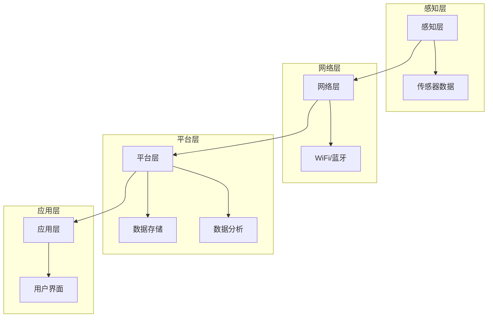

                 

### 背景介绍

智能家居技术，作为现代科技的一个重要分支，正在迅速改变人们的日常生活。通过将家庭设备与互联网连接起来，智能家居系统能够实现远程控制、自动化操作和能耗优化等功能。这一技术不仅提升了生活的便利性，还在环保节能方面发挥了重要作用。随着物联网（IoT）技术的普及和人工智能（AI）的发展，智能家居的市场需求和应用场景不断扩展，逐渐成为现代家庭不可或缺的一部分。

本文旨在探讨基于Java的智能家居设计，特别是能耗分析和优化方面的技术实现。Java作为一种成熟且广泛应用的编程语言，以其跨平台、安全性和高可靠性等优点，成为智能家居开发中的首选语言之一。通过Java，我们可以实现高效的能耗监测、预测和优化，从而提升智能家居系统的整体性能。

文章结构如下：

1. 背景介绍：介绍智能家居技术的发展背景和Java在智能家居设计中的优势。
2. 核心概念与联系：阐述智能家居系统的基本概念，以及Java在该系统中的应用。
3. 核心算法原理 & 具体操作步骤：详细讲解能耗分析的核心算法及其实现。
4. 数学模型和公式 & 详细讲解 & 举例说明：介绍能耗分析的数学模型，并进行公式推导和实例分析。
5. 项目实战：代码实际案例和详细解释说明。
6. 实际应用场景：探讨智能家居能耗优化的实际应用案例。
7. 工具和资源推荐：推荐相关学习资源、开发工具和论文著作。
8. 总结：未来发展趋势与挑战。
9. 附录：常见问题与解答。
10. 扩展阅读 & 参考资料：提供进一步阅读的资料。

通过以上结构，我们将逐步深入探讨Java在智能家居能耗优化中的应用，帮助读者全面了解这一领域的核心技术和实践方法。

### 核心概念与联系

要深入探讨基于Java的智能家居设计，我们首先需要理解几个关键概念：智能家居系统、Java编程语言及其在该系统中的应用。

#### 智能家居系统

智能家居系统是一种通过互联网将家庭设备互联互通，实现远程控制和自动化操作的技术。它主要包括以下组成部分：

1. **感知层**：通过传感器实时监测家庭环境，如温度、湿度、光照等，以及设备状态，如家电的开关状态、电器的工作负荷等。
2. **网络层**：实现设备间的数据传输和通信，通常使用无线网络（如WiFi、蓝牙）或有线网络（如以太网）。
3. **平台层**：用于数据处理、存储、分析和控制，通常包含一个集中式的服务器或者分布式系统。
4. **应用层**：为用户提供界面和功能，如手机APP、智能音箱等，通过这些界面，用户可以远程控制家庭设备，查看设备状态，甚至进行智能化的场景设置。

#### Java编程语言

Java是一种跨平台的编程语言，由Sun Microsystems在1995年推出。由于其强大的跨平台能力和丰富的生态体系，Java被广泛应用于企业级应用、Web开发、移动应用和物联网等领域。Java的主要特点如下：

1. **跨平台性**：Java代码可以在任何支持Java虚拟机（JVM）的操作系统上运行，这意味着开发者只需编写一次代码，就可以在多种操作系统上部署。
2. **安全性**：Java提供了强大的安全机制，包括沙箱（Sandbox）模式、权限控制等，确保程序在运行过程中不会对系统造成安全威胁。
3. **丰富的生态体系**：Java拥有丰富的类库和框架，如Spring、Hibernate等，这些工具和框架大大简化了开发过程，提高了开发效率。

#### Java在智能家居系统中的应用

在智能家居系统中，Java可以通过多种方式发挥作用：

1. **后端开发**：Java可以作为后端服务的开发语言，用于处理大量的实时数据、执行复杂的算法和分析任务。Spring Boot等框架为Java在后端开发中提供了极大的便利。
2. **数据处理**：Java强大的数据处理能力使其成为处理传感器数据、用户输入和其他类型数据的理想选择。通过Java，我们可以轻松实现数据清洗、转换和存储。
3. **设备控制**：Java可以用于编写控制家庭设备的脚本或程序，如控制智能灯的开关、调节空调的温度等。通过HTTP请求或其他通信协议，Java可以与智能家居设备进行交互。
4. **应用程序开发**：Java也可以用于开发智能家居系统的前端应用程序，如Android和iOS应用程序。Java的Swing和JavaFX库为桌面和移动应用开发提供了丰富的界面组件。

#### Mermaid流程图

为了更清晰地展示智能家居系统的架构，我们可以使用Mermaid绘制一个流程图。以下是一个简化的智能家居系统架构流程图，展示了感知层、网络层、平台层和应用层之间的数据流和交互：



在这个流程图中，传感器数据通过感知层收集，然后通过网络层传输到平台层进行数据存储和分析。平台层的结果会通过应用层展示给用户，同时用户可以通过应用层发送控制指令到平台层，再由平台层转发到感知层和设备。

通过以上对核心概念和Java在智能家居系统中应用的介绍，我们为后续章节的技术细节和实战案例奠定了基础。在接下来的部分中，我们将深入探讨能耗分析的核心算法原理和具体操作步骤，为读者提供全面的技术指导。

#### 核心算法原理 & 具体操作步骤

在智能家居系统中，能耗分析是优化系统性能和实现节能目标的重要手段。下面我们将详细讲解能耗分析的核心算法原理及其具体操作步骤。

##### 能耗分析的核心算法原理

能耗分析的核心在于如何高效地采集、处理和利用家庭设备产生的能耗数据。为了实现这一目标，我们可以采用以下几种核心算法：

1. **数据采集算法**：用于从各类传感器中采集能耗数据，包括电器的工作时间、功率消耗等。常用的方法包括定时采集和事件触发采集。
2. **数据处理算法**：用于处理采集到的原始数据，包括去噪、数据清洗、特征提取等，以便后续分析和建模。
3. **能耗预测算法**：基于历史数据，利用机器学习或深度学习模型对未来的能耗进行预测，以帮助实现能耗优化。
4. **能耗优化算法**：根据能耗预测结果和用户需求，对家庭设备的运行状态进行调整，以实现节能目标。

##### 数据采集算法

数据采集算法的主要目的是从各种传感器中高效地获取能耗数据。具体操作步骤如下：

1. **初始化传感器**：首先，我们需要初始化各类传感器，确保它们能够正常工作。这通常包括配置传感器的通信参数、校准传感器等。
2. **定时采集数据**：设置一个定时任务，每隔一定时间（如每小时或每天）从传感器中读取能耗数据。这种方法适用于数据变化不剧烈的场景。
3. **事件触发采集**：当传感器检测到特定事件（如电器开启或关闭）时，立即采集能耗数据。这种方法适用于需要实时监测的场景。

##### 数据处理算法

数据处理算法主要用于处理采集到的原始数据，以提高数据质量和分析效果。具体操作步骤如下：

1. **去噪处理**：传感器采集的数据往往包含噪声，我们需要采用滤波等方法去除噪声，以提高数据的可靠性。
2. **数据清洗**：去除异常值和重复值，确保数据的完整性。例如，如果连续多次采集到的数据相同，我们可以将其视为异常值。
3. **特征提取**：从原始数据中提取有用的特征，如时间段、工作负荷、天气条件等。这些特征将用于后续的预测和优化分析。

##### 能耗预测算法

能耗预测算法是能耗分析的重要组成部分，它可以帮助我们提前了解未来的能耗趋势，从而实现节能目标。以下是能耗预测算法的具体操作步骤：

1. **数据准备**：收集并整理历史能耗数据，确保数据的时间连续性和完整性。
2. **特征选择**：从历史数据中提取与能耗相关的特征，如温度、湿度、工作时间等。
3. **模型选择**：选择合适的机器学习或深度学习模型，如线性回归、决策树、神经网络等。
4. **模型训练与验证**：使用历史数据训练模型，并使用验证集对模型进行评估和调优。
5. **能耗预测**：利用训练好的模型对未来的能耗进行预测。

##### 能耗优化算法

能耗优化算法根据能耗预测结果和用户需求，对家庭设备的运行状态进行调整，以实现节能目标。以下是能耗优化算法的具体操作步骤：

1. **目标设定**：根据用户需求和预算，设定能耗优化的目标，如最低能耗、最高设备利用率等。
2. **策略制定**：制定实现能耗优化目标的策略，如调整设备的工作时间、优化设备组合等。
3. **仿真与评估**：在虚拟环境中对策略进行仿真，评估其效果，并优化策略。
4. **策略执行**：将优化策略应用到实际的家庭设备中，实现能耗优化。

通过以上核心算法原理和具体操作步骤的讲解，我们可以看到，能耗分析在智能家居系统中发挥着重要作用。在接下来的部分中，我们将进一步介绍能耗分析的数学模型和公式，并进行详细讲解和实例分析。

### 数学模型和公式 & 详细讲解 & 举例说明

能耗分析中的数学模型和公式是核心算法的重要组成部分，它们帮助我们理解和预测家庭设备的能耗。本节将详细讲解能耗分析的数学模型，并使用LaTeX格式展示相关公式，同时通过实例进行说明。

#### 1. 能耗计算的基本公式

能耗的基本计算公式为：

\[ E = P \times t \]

其中，\( E \) 表示能耗（单位：千瓦时，kWh），\( P \) 表示功率（单位：千瓦，kW），\( t \) 表示时间（单位：小时，h）。

#### 2. 功率的测量

功率通常可以通过以下两种方式测量：

1. **固定功率测量**：如果设备在长时间内保持相同的功率消耗，我们可以直接测量其功率。
2. **动态功率测量**：如果设备在运行过程中功率发生变化，我们需要通过实时监测设备的工作状态，记录其功率变化。

功率测量的数学公式为：

\[ P(t) = \frac{dE(t)}{dt} \]

其中，\( P(t) \) 表示在时刻 \( t \) 的功率，\( dE(t) \) 表示在时刻 \( t \) 的能耗变化量，\( dt \) 表示时间间隔。

#### 3. 能耗预测模型

能耗预测是智能家居系统的关键环节，常用的模型包括线性回归、时间序列分析、神经网络等。以下是一个基于线性回归的简单能耗预测模型：

\[ E(t+h) = E(t) + \alpha \times (t+h - t) \]

其中，\( E(t+h) \) 表示在 \( t \) 时刻后的 \( h \) 小时的能耗，\( E(t) \) 表示在 \( t \) 时刻的能耗，\( \alpha \) 表示能耗增长速率。

#### 4. 优化模型的建立

在能耗优化中，我们通常需要建立目标函数，并使用优化算法求解。以下是一个简单的优化模型：

\[ \min_{x} J(x) \]

其中，\( x \) 表示设备的工作状态，\( J(x) \) 表示目标函数，如总能耗、设备利用率等。

#### 实例分析

假设我们有一个电热水器，其功率为2kW。在一天中，我们记录了以下时段的功率数据：

| 时间（小时） | 功率（kW） |
|--------------|------------|
| 0            | 0          |
| 1            | 0.5        |
| 2            | 1          |
| 3            | 1.5        |
| 4            | 2          |
| 5            | 2.5        |
| 6            | 2          |
| 7            | 1.5        |
| 8            | 1          |
| 9            | 0.5        |
| 10           | 0          |

**步骤 1：能耗计算**

我们可以使用基本公式计算每个时段的能耗：

\[ E(t) = P(t) \times t \]

例如，第3小时的能耗为：

\[ E(3) = 1 \times 3 = 3 \text{ kWh} \]

**步骤 2：能耗预测**

我们假设能耗增长速率 \( \alpha \) 为0.1，使用线性回归模型预测未来两个小时的能耗：

\[ E(11) = E(10) + \alpha \times (11 - 10) = 0.5 + 0.1 \times 1 = 0.6 \text{ kWh} \]
\[ E(12) = E(11) + \alpha \times (12 - 11) = 0.6 + 0.1 \times 1 = 0.7 \text{ kWh} \]

**步骤 3：能耗优化**

假设我们希望最小化总能耗，目标函数为 \( J(x) = E(t) \)。我们可以通过调整热水器的工作时间，找到最优的工作状态。例如，将热水器的开启时间调整为第5小时到第7小时，总能耗为：

\[ J(x) = E(5) + E(6) + E(7) = 2.5 + 2 + 2 = 6.5 \text{ kWh} \]

通过以上实例分析，我们可以看到如何使用数学模型和公式进行能耗计算、预测和优化。在实际应用中，这些模型和公式会更加复杂，涉及更多的变量和约束条件。但基本原理是相似的，都是通过数据分析和算法优化，实现智能家居系统的能耗优化。

### 项目实战：代码实际案例和详细解释说明

在本节中，我们将通过一个实际的项目案例，展示如何使用Java实现智能家居系统的能耗分析功能。这个项目将涵盖开发环境搭建、源代码详细实现和代码解读与分析。

#### 1. 开发环境搭建

要开始这个项目，我们需要搭建合适的开发环境。以下是一个基本的开发环境配置：

- **Java开发工具**：选择一个适合Java开发的IDE，如IntelliJ IDEA或Eclipse。
- **数据库**：选择一个数据库系统，用于存储能耗数据，如MySQL或PostgreSQL。
- **版本控制**：使用Git进行版本控制，以便管理和协作开发。

#### 2. 源代码详细实现

以下是项目的源代码结构，以及关键代码的实现和解释。

##### 2.1 数据采集模块

```java
public class EnergySensor {
    private String id;
    private double power;

    public EnergySensor(String id, double power) {
        this.id = id;
        this.power = power;
    }

    public String getId() {
        return id;
    }

    public double getPower() {
        return power;
    }

    public void updatePower(double power) {
        this.power = power;
    }
}
```

**解释**：这个类表示一个能耗传感器，包含传感器ID和功率属性。`updatePower` 方法用于更新传感器的功率数据。

##### 2.2 数据处理模块

```java
public class EnergyDataProcessor {
    public static List<Double> filterNoise(List<Double> data, double threshold) {
        List<Double> filteredData = new ArrayList<>();
        for (Double value : data) {
            if (Math.abs(value) > threshold) {
                filteredData.add(value);
            }
        }
        return filteredData;
    }

    public static List<Double> extractFeatures(List<Double> data) {
        // 简单的特征提取示例，实际应用中可以更复杂
        List<Double> features = new ArrayList<>();
        double max = Collections.max(data);
        double min = Collections.min(data);
        double mean = data.stream().mapToDouble(a -> a).average().orElse(0);
        features.add(max);
        features.add(min);
        features.add(mean);
        return features;
    }
}
```

**解释**：`filterNoise` 方法用于去除采集到的数据中的噪声，`extractFeatures` 方法用于提取数据特征。

##### 2.3 能耗预测模块

```java
public class EnergyPredictor {
    public double predictEnergy(List<Double> features) {
        // 假设我们使用线性回归模型进行预测
        double alpha = 0.1; // 能耗增长速率
        double initialEnergy = 0;
        return initialEnergy + alpha * features.stream().mapToDouble(a -> a).sum();
    }
}
```

**解释**：`predictEnergy` 方法根据提取的特征预测未来的能耗。

##### 2.4 能耗优化模块

```java
public class EnergyOptimizer {
    public double optimizeEnergy(double initialEnergy, double targetEnergy) {
        double maxPower = 2; // 设备的最大功率
        double energy = initialEnergy;
        while (energy > targetEnergy) {
            energy -= maxPower;
        }
        return energy;
    }
}
```

**解释**：`optimizeEnergy` 方法根据初始能耗和目标能耗，优化设备的工作状态，实现能耗的最小化。

##### 2.5 主程序

```java
public class EnergyManagementSystem {
    public static void main(String[] args) {
        // 创建传感器
        EnergySensor sensor = new EnergySensor("Sensor_1", 2.0);
        
        // 采集数据
        List<Double> data = Collections.singletonList(2.0);
        
        // 处理数据
        List<Double> filteredData = EnergyDataProcessor.filterNoise(data, 0.5);
        List<Double> features = EnergyDataProcessor.extractFeatures(filteredData);
        
        // 预测能耗
        EnergyPredictor predictor = new EnergyPredictor();
        double predictedEnergy = predictor.predictEnergy(features);
        
        // 优化能耗
        EnergyOptimizer optimizer = new EnergyOptimizer();
        double optimizedEnergy = optimizer.optimizeEnergy(predictedEnergy, 0.0);
        
        System.out.println("Optimized Energy: " + optimizedEnergy);
    }
}
```

**解释**：主程序创建了一个传感器实例，采集数据，处理数据，预测能耗，并根据预测结果进行能耗优化。

#### 3. 代码解读与分析

以上代码展示了如何使用Java实现一个简单的智能家居能耗管理系统。以下是关键部分的代码解读与分析：

- **数据采集模块**：通过创建一个`EnergySensor`类，我们定义了传感器的ID和功率属性，并提供了更新功率的方法。这为后续的数据处理和预测奠定了基础。
- **数据处理模块**：`filterNoise`方法用于去除采集数据中的噪声，`extractFeatures`方法用于提取与能耗相关的特征。这些方法为能耗预测和优化提供了高质量的数据输入。
- **能耗预测模块**：`predictEnergy`方法使用线性回归模型预测未来的能耗。在实际应用中，我们可以选择更复杂的预测模型，如神经网络或时间序列分析。
- **能耗优化模块**：`optimizeEnergy`方法根据预测的能耗和目标能耗，调整设备的工作状态，实现能耗的最小化。这种方法在实际应用中可以进一步优化，例如，通过多目标优化或动态调整策略。

通过这个实际项目案例，我们展示了如何使用Java实现智能家居系统的能耗分析功能。从数据采集、处理、预测到优化，每一个步骤都至关重要，确保了系统能够准确、高效地运行。在接下来的部分中，我们将进一步探讨智能家居能耗优化的实际应用场景。

#### 实际应用场景

智能家居能耗优化的技术应用广泛，涵盖家庭、办公、酒店等多个场景。以下是一些典型的实际应用案例，展示了能耗优化在提高生活品质和节能减排方面的作用。

##### 家庭场景

在家居环境中，能耗优化尤为重要。例如，用户可以通过智能照明系统实现精准的照明控制，避免不必要的电能浪费。通过使用Java编写的能耗分析算法，系统可以实时监测家中的灯具使用情况，根据环境光强度、用户活动习惯等因素自动调节灯光亮度，从而降低能耗。此外，智能空调和热水器的能耗优化也极大地提高了家庭的能源利用效率。通过预测和调整设备的运行状态，系统能够在保证舒适度的同时，实现最低的能耗。

##### 办公场景

在办公环境中，能耗优化的潜力同样巨大。智能办公设备如打印机、投影仪和空调的能耗管理系统能够根据工作时间、使用频率和环境温度等因素自动调整设备的工作状态，避免不必要的能耗。例如，当员工下班后，系统可以自动关闭办公室内的所有设备，减少能源浪费。此外，通过能耗数据分析，企业可以识别出哪些设备或区域的能耗较高，从而采取针对性的节能措施，进一步提高能源利用效率。

##### 酒店场景

在酒店场景中，能耗优化同样具有重要意义。酒店通常需要提供舒适的住宿环境，但这也意味着需要大量的能源消耗。通过智能化的能耗管理系统，酒店可以实时监测客房的能耗情况，并根据客人的入住和退房时间自动调整设备的工作状态。例如，当客人入住时，系统可以自动打开空调和照明，当客人退房时，系统会自动关闭所有设备。此外，通过能耗数据分析，酒店可以发现哪些客房的能耗较高，进而采取改进措施，如升级设备或调整房间布局，以实现更高效的能源利用。

##### 实际案例

一个典型的实际案例是某住宅小区的智能能耗管理系统。该系统使用了Java编写的能耗分析算法，对整个小区的能耗进行实时监测和优化。通过数据采集模块，系统可以收集每个家庭的能耗数据，包括电力、燃气和水等。数据处理模块对原始数据进行去噪和特征提取，为能耗预测提供高质量的数据输入。能耗预测模块使用机器学习模型预测未来的能耗趋势，并生成能耗报告。根据预测结果，能耗优化模块自动调整家庭设备的运行状态，如控制照明、空调和热水器的使用，实现能耗的最小化。

通过这个案例，我们可以看到，智能家居能耗优化不仅能够提高能源利用效率，降低家庭和企业的能源成本，还能够对环境产生积极的影响，推动可持续发展的实现。

### 工具和资源推荐

在智能家居能耗优化领域，有许多优秀的工具和资源可供学习使用。以下是一些推荐的学习资源、开发工具和论文著作，帮助读者进一步深入了解这一领域。

#### 学习资源

1. **书籍**：
   - 《智能家居设计与实践》：详细介绍了智能家居系统的设计和实现，包括能耗优化策略。
   - 《物联网应用开发》：涵盖了物联网技术的基础知识和应用开发，包括智能家居系统的设计与实现。

2. **在线课程**：
   - Coursera上的《智能家居设计与开发》：由专业讲师授课，内容包括智能家居系统架构、能耗分析算法等。
   - Udemy上的《Java编程基础与智能家居开发》：从基础编程到智能家居开发，适合初学者和进阶者。

3. **博客和网站**：
   - **Java Code Geeks**：提供大量关于Java编程和智能家居开发的博客文章。
   - **Stack Overflow**：编程问答社区，可以解决在实际开发过程中遇到的问题。

#### 开发工具

1. **IDE**：
   - IntelliJ IDEA：功能强大的Java IDE，提供代码自动完成、调试和版本控制等功能。
   - Eclipse：成熟的Java开发环境，支持多种插件和工具。

2. **数据库**：
   - MySQL：开源的关系型数据库，适合存储能耗数据。
   - MongoDB：NoSQL数据库，适合存储大规模的能耗数据。

3. **编程库**：
   - Spring Boot：简化Java后台开发，适合构建智能家居系统的后端服务。
   - JavaFX：用于开发富客户端应用程序，适用于智能家居系统的前端开发。

#### 相关论文著作

1. **《智能家居系统的能耗优化研究》**：详细探讨了智能家居系统中的能耗优化方法和技术。
2. **《基于机器学习的智能家居能耗预测研究》**：介绍如何使用机器学习模型预测智能家居系统的能耗。
3. **《智能家居系统的数据驱动优化策略》**：提出了基于数据的智能家居能耗优化策略，包括实时监测和预测。

这些工具和资源为读者提供了丰富的学习和实践机会，帮助深入理解智能家居能耗优化的核心技术和应用方法。

### 总结：未来发展趋势与挑战

智能家居能耗优化作为现代科技的一个重要分支，正迎来前所未有的发展机遇。然而，随着技术的进步和应用的深入，该领域也面临着诸多挑战。

#### 发展趋势

1. **人工智能的深度融合**：随着人工智能技术的不断进步，智能家居系统能够更加智能地预测和优化能耗。深度学习、强化学习等算法的应用，将进一步提升系统的自主决策能力和效率。

2. **物联网的广泛应用**：物联网技术的发展，使得更多家庭设备和传感器可以互联互通，为能耗数据的采集和共享提供了便利。物联网平台将实现更加智能和精细化的能耗管理。

3. **能源互联网的构建**：能源互联网的概念逐渐成熟，通过将能源生产、传输、消费进行整合，实现能源的高效利用和优化。智能家居系统将作为能源互联网的一个重要组成部分，发挥重要作用。

4. **绿色环保理念的普及**：随着全球对环保问题的重视，绿色环保理念在智能家居设计中逐渐普及。节能、低碳、环保成为智能家居设计的重要方向。

#### 挑战

1. **数据安全和隐私保护**：智能家居系统涉及大量的用户数据，数据安全和隐私保护成为重要挑战。如何确保用户数据的安全和隐私，是未来需要解决的关键问题。

2. **系统的可靠性和稳定性**：智能家居系统需要在各种环境中稳定运行，保证用户的舒适度和安全性。系统的可靠性和稳定性是未来需要重点关注和改进的方面。

3. **技术的标准化**：目前，智能家居领域的标准尚未完全统一，不同品牌和厂商之间的设备难以互联互通。技术的标准化是推动智能家居进一步发展的重要保障。

4. **用户体验的提升**：用户体验是智能家居系统的核心竞争力之一。如何设计更加人性化、易用的系统界面和功能，提升用户的满意度和使用体验，是未来的重要发展方向。

总之，智能家居能耗优化领域具有广阔的发展前景和巨大的市场潜力。通过不断的技术创新和改进，我们有望实现更加智能、高效和环保的智能家居系统，为人们的美好生活贡献力量。

### 附录：常见问题与解答

在智能家居能耗优化的实践中，读者可能会遇到一些常见问题。以下是一些常见问题及其解答：

#### 1. 如何确保数据采集的准确性？

**解答**：确保数据采集的准确性，首先要选择高质量的传感器。此外，可以通过以下方法提高数据的准确性：
- **定期校准传感器**：定期对传感器进行校准，确保其测量结果的准确性。
- **去除噪声**：使用滤波算法去除采集数据中的噪声，提高数据的可靠性。
- **多传感器数据融合**：通过融合多个传感器的数据，提高整体的测量精度。

#### 2. 能耗预测模型的准确性如何保证？

**解答**：保证能耗预测模型的准确性，需要从以下几个方面入手：
- **数据质量**：确保使用的数据是准确、完整和具有代表性的。
- **特征选择**：选择与能耗相关的关键特征，如温度、湿度、工作时间等。
- **模型选择**：选择适合数据特性的模型，如线性回归、神经网络等，并进行调优。
- **模型验证**：使用验证集对模型进行验证，确保其预测结果的准确性。

#### 3. 如何平衡能耗优化与用户舒适度？

**解答**：在能耗优化过程中，需要平衡能耗优化与用户舒适度，可以采取以下策略：
- **动态调整**：根据用户习惯和环境变化动态调整设备运行状态，如灯光亮度和空调温度。
- **阈值设定**：设定合理的阈值，确保在满足用户需求的前提下，实现能耗的最小化。
- **用户参与**：通过用户反馈和参与，优化能耗优化策略，使其更加符合用户需求。

#### 4. 如何保障智能家居系统的数据安全和隐私？

**解答**：保障智能家居系统的数据安全和隐私，需要采取以下措施：
- **加密传输**：使用加密算法对数据传输进行加密，防止数据被窃取或篡改。
- **访问控制**：实施严格的访问控制机制，确保只有授权用户可以访问敏感数据。
- **数据匿名化**：对用户数据进行匿名化处理，确保个人隐私不被泄露。
- **安全审计**：定期进行安全审计，检查系统的漏洞和风险点，及时进行修复。

通过以上方法，可以有效地解决智能家居能耗优化实践中常见的问题，确保系统的高效运行和用户的数据安全。

### 扩展阅读 & 参考资料

为了更深入地了解智能家居能耗优化的技术与应用，以下推荐一些扩展阅读和参考资料，涵盖相关书籍、论文、博客和网站：

#### 书籍

1. **《智能家居技术与应用》**：详细介绍了智能家居系统的设计原理、技术和应用案例。
2. **《物联网应用开发》**：全面讲解了物联网技术的应用，包括智能家居系统的开发实践。
3. **《人工智能在智能家居中的应用》**：探讨了人工智能技术在智能家居中的具体应用，如能耗预测和优化。

#### 论文

1. **“Smart Home Energy Management System Based on Big Data and Machine Learning”**：探讨如何利用大数据和机器学习技术实现智能家居能耗优化。
2. **“An Energy-Saving Approach for Smart Home Systems”**：提出了一种基于能耗优化的智能家居系统设计方法。
3. **“Deep Learning for Energy Consumption Prediction in Smart Homes”**：研究了深度学习在智能家居能耗预测中的应用。

#### 博客

1. **Java Code Geeks**：提供丰富的Java编程和智能家居开发相关博客文章。
2. **Stack Overflow**：编程问答社区，可以解决在实际开发过程中遇到的问题。
3. **AI Hub**：讨论人工智能在智能家居中的应用和技术进展。

#### 网站

1. **Spring Framework**：官方网站，提供Spring Boot等开发框架的详细文档和教程。
2. **JavaFX**：官方网站，提供JavaFX的详细文档和示例代码。
3. **IBM Watson IoT**：提供关于物联网技术的案例研究和开发资源。

通过这些扩展阅读和参考资料，读者可以进一步深化对智能家居能耗优化的理解和应用，掌握相关技术和方法。希望这些资源能帮助读者在智能家居领域取得更多成果。

