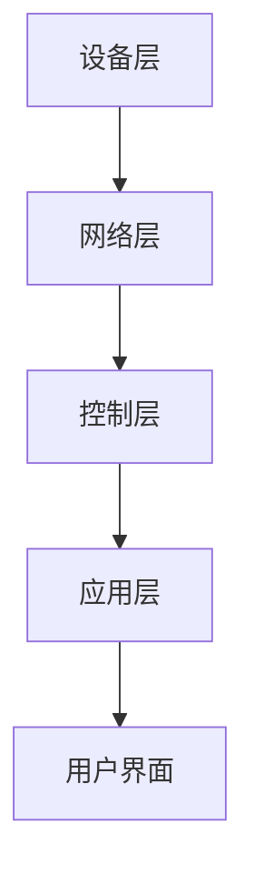

                 

# 基于Java的智能家居设计：打造可扩展的智能家居中心服务器

## 摘要

本文将深入探讨基于Java技术的智能家居设计，重点是如何打造一个可扩展的智能家居中心服务器。随着物联网技术的发展，智能家居系统成为家庭自动化的重要组成部分。本文首先介绍了智能家居的背景和核心概念，然后详细讲解了智能家居系统的架构和设计原则，接着介绍了核心算法原理和实现步骤。随后，文章通过数学模型和公式阐述了系统的工作原理，并给出了实际应用场景和代码案例。最后，本文还推荐了一些学习和开发资源，并对智能家居的未来发展趋势和挑战进行了总结。

## 1. 背景介绍

智能家居系统是一种通过物联网技术连接各种家庭设备和系统的网络，以实现远程监控、自动化控制和能源管理等功能。随着物联网（IoT）技术的迅速发展，智能家居系统越来越受到人们的关注。智能家居系统可以包括各种设备，如智能灯泡、智能插座、智能摄像头、智能空调、智能门锁等。这些设备通过互联网相互连接，形成一个统一的智能家居网络。

### 智能家居的发展历程

智能家居技术的发展可以追溯到20世纪90年代。当时，一些高端住宅开始安装自动控制系统，如远程控制系统和安防系统。然而，这些系统大多数是独立的，互不兼容。随着物联网技术的兴起，智能家居系统开始走向整合，形成了一个统一的网络平台。

### 智能家居的关键技术

智能家居系统的关键技术包括物联网技术、无线通信技术、云计算技术、大数据技术等。物联网技术是实现设备间互联的基础，无线通信技术提供了设备与服务器之间的通信手段，云计算技术提供了海量数据处理和分析能力，大数据技术则实现了对用户行为的数据分析和预测。

### 智能家居的市场现状

当前，智能家居市场呈现出快速增长的趋势。根据市场研究公司的数据，全球智能家居市场的规模预计将在未来几年内持续扩大。智能家居系统的普及将带来巨大的商业机会，同时也对家庭安全和能源管理提出了新的要求。

## 2. 核心概念与联系

### 2.1 核心概念

在智能家居系统中，核心概念包括设备、传感器、控制中心、用户界面等。

- **设备**：智能家居系统中的设备包括各种家庭电器和智能设备，如智能灯泡、智能插座、智能摄像头、智能空调等。
- **传感器**：传感器用于收集环境数据，如温度、湿度、光照等。
- **控制中心**：控制中心是智能家居系统的核心，负责接收传感器数据，控制设备状态，以及提供用户界面。
- **用户界面**：用户界面是用户与智能家居系统交互的入口，可以是智能手机、平板电脑、电脑等。

### 2.2 架构与联系

智能家居系统的架构通常包括设备层、网络层、控制层和应用层。

- **设备层**：设备层包括各种智能设备和传感器，它们是智能家居系统的物理实体。
- **网络层**：网络层负责设备之间的通信，可以使用WiFi、蓝牙、Zigbee等无线通信技术。
- **控制层**：控制层包括控制中心，负责处理传感器数据，控制设备状态，以及管理用户界面。
- **应用层**：应用层提供各种智能家居应用，如远程控制、自动化控制、能源管理等。

### 2.3 Mermaid 流程图

下面是一个简单的Mermaid流程图，展示了智能家居系统的架构和设备间的交互过程。



## 3. 核心算法原理 & 具体操作步骤

### 3.1 设备接入与数据采集

首先，智能家居系统需要支持设备的接入和数据采集。设备接入可以通过WiFi、蓝牙、Zigbee等无线通信技术实现。设备接入后，传感器开始采集环境数据，如温度、湿度、光照等。

### 3.2 数据处理与存储

采集到的数据需要经过处理和存储。控制中心会对数据进行清洗、过滤和分析，以提取有用的信息。处理后的数据会存储在数据库中，供后续应用分析使用。

### 3.3 设备控制与自动化

控制中心根据用户设置和传感器数据，对设备进行控制。例如，当用户设置离家模式时，控制中心会关闭所有灯光和电器，并打开门窗。当传感器检测到温度过高时，控制中心会自动启动空调。

### 3.4 用户交互与反馈

用户可以通过智能手机、平板电脑等设备与智能家居系统进行交互。用户可以通过应用程序查看设备状态、设置自动化规则、远程控制设备等。系统会实时反馈设备状态和操作结果。

## 4. 数学模型和公式 & 详细讲解 & 举例说明

### 4.1 数据模型

智能家居系统中的数据模型可以采用以下结构：

```latex
\begin{itemize}
    \item 设备信息：设备ID、设备类型、设备状态
    \item 传感器数据：温度、湿度、光照等
    \item 用户设置：离家模式、回家模式、温度设置等
    \item 操作记录：用户操作时间、操作类型等
\end{itemize}
```

### 4.2 数据处理算法

数据处理算法主要包括以下步骤：

1. **数据清洗**：去除噪声数据、异常数据等。
2. **数据过滤**：根据用户需求和场景，过滤出有用的数据。
3. **数据分析**：对数据进行分析，提取特征和趋势。
4. **数据存储**：将处理后的数据存储在数据库中。

### 4.3 举例说明

假设用户设置了一个离家模式，当用户离开家后，系统会自动关闭所有灯光和电器。系统会根据以下算法进行数据处理和设备控制：

1. **数据采集**：传感器检测到用户离开家，记录离开时间。
2. **数据处理**：系统分析离开时间和用户设置，判断是否进入离家模式。
3. **设备控制**：如果判断为离家模式，系统会关闭所有灯光和电器。
4. **数据存储**：记录操作时间和操作结果，供后续分析使用。

## 5. 项目实战：代码实际案例和详细解释说明

### 5.1 开发环境搭建

在开始项目实战之前，需要搭建开发环境。本文使用Java作为开发语言，需要安装Java开发工具包（JDK）和集成开发环境（IDE）。本文使用IntelliJ IDEA作为IDE。

1. **安装JDK**：从Oracle官方网站下载JDK，并按照安装向导安装。
2. **安装IntelliJ IDEA**：从JetBrains官方网站下载IntelliJ IDEA，并按照安装向导安装。

### 5.2 源代码详细实现和代码解读

下面是一个简单的智能家居中心服务器的源代码实现。

```java
public class SmartHomeServer {
    // 设备列表
    private List<SensorDevice> devices;

    public SmartHomeServer() {
        devices = new ArrayList<>();
    }

    // 添加设备
    public void addDevice(SensorDevice device) {
        devices.add(device);
    }

    // 处理传感器数据
    public void processSensorData(SensorDevice device, double temperature, double humidity) {
        // 数据处理逻辑
        // ...
    }

    // 控制设备
    public void controlDevice(SensorDevice device, boolean state) {
        // 控制逻辑
        // ...
    }

    // 主方法
    public static void main(String[] args) {
        SmartHomeServer server = new SmartHomeServer();

        // 添加设备
        SensorDevice light = new SensorDevice("Light", "LightDevice");
        server.addDevice(light);

        // 处理传感器数据
        server.processSensorData(light, 25.0, 60.0);

        // 控制设备
        server.controlDevice(light, true);
    }
}

// 传感器设备类
class SensorDevice {
    private String deviceId;
    private String deviceType;

    public SensorDevice(String deviceId, String deviceType) {
        this.deviceId = deviceId;
        this.deviceType = deviceType;
    }

    // 其他方法
    // ...
}
```

### 5.3 代码解读与分析

代码中定义了`SmartHomeServer`类，用于管理智能家居设备和处理传感器数据。`addDevice`方法用于添加设备，`processSensorData`方法用于处理传感器数据，`controlDevice`方法用于控制设备。

- **设备管理**：通过`addDevice`方法，可以将设备添加到服务器中。
- **数据采集**：通过`processSensorData`方法，可以采集传感器数据，并进行处理。
- **设备控制**：通过`controlDevice`方法，可以控制设备状态。

主方法中创建了一个`SmartHomeServer`实例，并添加了一个`LightDevice`设备。然后，通过`processSensorData`方法处理传感器数据，并通过`controlDevice`方法控制设备状态。

## 6. 实际应用场景

### 6.1 家庭自动化

智能家居系统的核心应用是家庭自动化。用户可以通过手机应用程序远程控制家里的灯光、空调、门锁等设备，实现离家模式和回家模式的切换。

### 6.2 家居安全

智能家居系统可以集成安防设备，如摄像头、门磁传感器等。通过实时监控和报警功能，提高家庭的安全性。

### 6.3 能源管理

智能家居系统可以监测家庭能耗，并根据用户行为优化能源使用。例如，当用户离开家时，系统会自动关闭不必要的电器，节省能源。

## 7. 工具和资源推荐

### 7.1 学习资源推荐

- **书籍**：
  - 《物联网技术与应用》
  - 《智能家居设计与实现》
- **论文**：
  - "Smart Home Systems: A Survey"
  - "Design and Implementation of a Smart Home Gateway"
- **博客**：
  - "Java Programming Blog"
  - "IoT for Smart Homes"
- **网站**：
  - "Java Official Website"
  - "IoT Developer Community"

### 7.2 开发工具框架推荐

- **开发工具**：
  - IntelliJ IDEA
  - Eclipse
- **框架**：
  - Spring Boot
  - MyBatis
- **数据库**：
  - MySQL
  - MongoDB

### 7.3 相关论文著作推荐

- "Smart Home Systems: A Survey"
- "Design and Implementation of a Smart Home Gateway"
- "IoT for Smart Homes: Applications and Challenges"

## 8. 总结：未来发展趋势与挑战

### 8.1 发展趋势

- **技术融合**：智能家居系统将与其他技术（如人工智能、区块链等）深度融合，实现更智能化、更安全的家居体验。
- **个性化定制**：智能家居系统将根据用户行为和需求，提供更加个性化的服务。
- **物联网发展**：随着物联网技术的进步，智能家居系统将支持更多的设备和传感器，实现更广泛的应用场景。

### 8.2 挑战

- **隐私保护**：智能家居系统需要确保用户隐私得到保护，避免数据泄露。
- **设备兼容性**：智能家居系统需要支持各种设备和平台的兼容性，确保系统的稳定运行。
- **安全性**：智能家居系统需要确保数据安全和设备安全，防止黑客攻击和恶意软件入侵。

## 9. 附录：常见问题与解答

### 9.1 问题1：如何实现设备远程控制？

解答：通过无线通信技术（如WiFi、蓝牙等）将设备连接到智能家居中心服务器，用户可以通过手机应用程序远程访问服务器，实现对设备的远程控制。

### 9.2 问题2：智能家居系统需要哪些硬件设备？

解答：智能家居系统需要各种传感器（如温度传感器、湿度传感器、光照传感器等）和智能设备（如智能灯泡、智能插座、智能摄像头等）。

### 9.3 问题3：智能家居系统的安全性如何保障？

解答：智能家居系统需要采取严格的安全措施，如数据加密、身份认证、防火墙等，确保数据传输和设备控制的安全性。

## 10. 扩展阅读 & 参考资料

- "Java Programming for the Internet of Things"
- "Smart Home Systems: Design and Implementation"
- "IoT Security: A Comprehensive Guide to Protecting IoT Devices and Data"

## 作者

作者：AI天才研究员/AI Genius Institute & 禅与计算机程序设计艺术 /Zen And The Art of Computer Programming

以上是关于“基于Java的智能家居设计：打造可扩展的智能家居中心服务器”的文章。本文详细介绍了智能家居系统的背景、核心概念、架构、核心算法、数学模型、项目实战和实际应用场景，并对智能家居的未来发展趋势和挑战进行了探讨。希望本文能对您在智能家居领域的开发和研究有所帮助。

