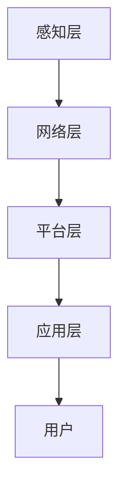
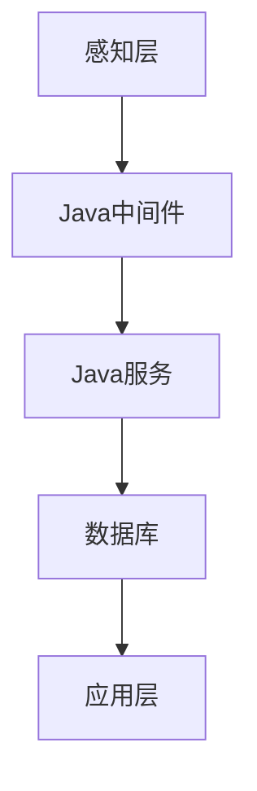
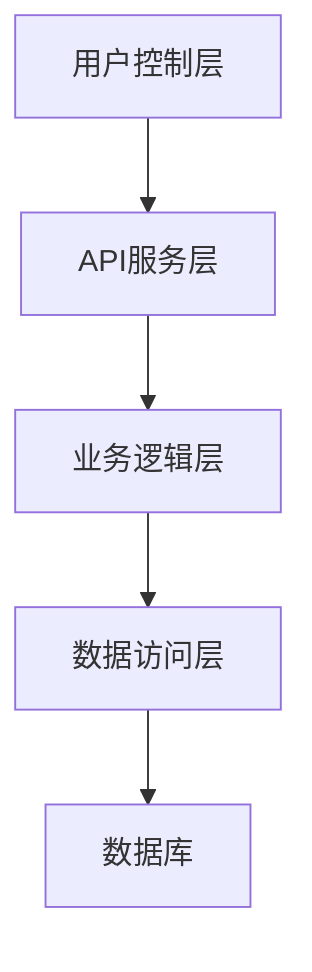

                 

# 基于Java的智能家居设计：浅析Java在智能家居系统中的故障排查技巧

> **关键词：** Java、智能家居、故障排查、系统设计

> **摘要：** 本文将深入探讨基于Java的智能家居设计及其在故障排查中的应用，通过对Java编程语言特点的剖析，以及实际案例的分享，帮助开发者了解如何在智能家居系统中高效地排查和处理故障，提升系统的稳定性和用户体验。

## 1. 背景介绍

随着物联网技术的快速发展，智能家居系统逐渐渗透到我们的日常生活中。从智能门锁、智能照明到智能安防，这些设备的互联互通为我们的生活带来了极大的便利。然而，智能家居系统也面临着诸多挑战，尤其是故障排查和系统稳定性问题。在这些挑战中，选择合适的编程语言和工具成为了关键。

Java作为一门历史悠久且功能强大的编程语言，因其跨平台、安全性和稳定性等优点，在智能家居系统的开发中得到了广泛应用。本文将聚焦于Java在智能家居系统故障排查中的作用，通过详细的分析和实例讲解，帮助开发者掌握故障排查的技巧和方法。

## 2. 核心概念与联系

在探讨Java在智能家居系统中的故障排查之前，我们需要了解一些核心概念和架构，以便更好地理解Java在系统中的作用。

### 2.1 Java编程语言特点

- **跨平台性**：Java代码可以在任何支持Java虚拟机（JVM）的操作系统上运行，无需修改源代码。
- **安全性**：Java提供了丰富的安全机制，如沙箱模型、加密算法和权限控制，保障系统安全。
- **稳定性**：Java的垃圾回收机制和稳定的运行时环境，使得系统运行更加稳定。
- **丰富生态系统**：Java拥有庞大的开发者社区和丰富的开源库，支持开发者快速开发。

### 2.2 智能家居系统架构

智能家居系统通常由多个子系统组成，如智能照明、智能安防、智能家电等。这些子系统通过物联网协议（如Zigbee、WiFi等）进行通信，实现设备的互联互通。典型的智能家居系统架构包括以下部分：

- **感知层**：通过传感器收集环境数据，如温度、湿度、光照等。
- **网络层**：负责将感知层的数据传输到中心控制节点。
- **平台层**：提供数据处理、存储和规则引擎等功能。
- **应用层**：面向用户提供各种智能家居应用，如APP控制、语音控制等。

### 2.3 Mermaid流程图

为了更直观地展示智能家居系统的架构，我们使用Mermaid绘制一个简单的流程图：



在智能家居系统中，Java的作用主要体现在平台层和应用层。通过Java编写的中间件和服务，实现数据的处理、分析和应用。以下是一个简化的Mermaid流程节点，展示了Java在系统中的节点和连接：



在上述流程中，Java中间件负责数据的采集、转换和传输，Java服务负责数据处理和业务逻辑，数据库用于数据的存储和查询。通过这些节点和连接，我们可以看到Java在智能家居系统中的核心作用。

## 3. 核心算法原理 & 具体操作步骤

在故障排查过程中，算法的选择和实现至关重要。Java提供了丰富的库和工具，可以帮助开发者快速定位和解决故障。以下介绍几种常用的算法原理和操作步骤：

### 3.1 日志分析

**原理**：日志分析是故障排查的重要手段。通过分析系统日志，可以定位故障发生的时间、位置和原因。

**操作步骤**：

1. 收集日志文件：使用Java的`java.util.logging`或`log4j`等日志库，收集系统运行过程中的日志。
2. 过滤关键信息：根据故障现象，使用正则表达式或其他过滤条件，提取与故障相关的日志信息。
3. 分析日志内容：分析日志中的时间、位置、异常信息等，定位故障原因。

### 3.2 性能监控

**原理**：性能监控可以帮助开发者实时了解系统的运行状态，发现性能瓶颈。

**操作步骤**：

1. 添加监控代码：在Java代码中添加监控代码，如使用`System.nanoTime()`记录关键方法的执行时间。
2. 数据收集：将监控数据收集到内存或数据库中。
3. 数据分析：使用Java的`Math`库或其他工具，对监控数据进行统计分析，发现性能瓶颈。

### 3.3 异常处理

**原理**：异常处理是Java编程中的核心概念。通过捕获和处理异常，可以确保系统在异常情况下仍然能够正常运行。

**操作步骤**：

1. 捕获异常：使用`try-catch`语句捕获异常。
2. 处理异常：根据异常类型，进行相应的错误处理，如记录日志、发送告警、恢复系统等。

### 3.4 日志分析工具

**原理**：日志分析工具可以帮助开发者自动化地收集、过滤和分析日志。

**操作步骤**：

1. 选择日志分析工具：如ELK（Elasticsearch、Logstash、Kibana）等。
2. 配置日志收集：将系统日志发送到日志分析工具的收集端。
3. 构建分析报告：使用日志分析工具提供的可视化界面，构建分析报告，定位故障原因。

## 4. 数学模型和公式 & 详细讲解 & 举例说明

在故障排查中，数学模型和公式可以帮助开发者量化故障现象，从而更精确地定位问题。以下介绍几种常用的数学模型和公式：

### 4.1 故障发生概率模型

**原理**：故障发生概率模型用于估算系统在特定时间内发生故障的概率。

**公式**：

\[ P(F) = 1 - e^{-\lambda t} \]

其中，\( P(F) \) 是故障发生概率，\( \lambda \) 是故障率，\( t \) 是时间。

**举例说明**：

假设一个智能家居系统的故障率为 \( \lambda = 0.001 \) 次/小时，我们需要计算系统在 1000 小时内发生故障的概率。

\[ P(F) = 1 - e^{-0.001 \times 1000} \approx 0.3935 \]

这意味着在 1000 小时内，系统发生故障的概率约为 39.35%。

### 4.2 性能瓶颈模型

**原理**：性能瓶颈模型用于分析系统性能瓶颈，如CPU使用率、内存使用率等。

**公式**：

\[ CPU_{使用率} = \frac{CPU_{占用时间}}{CPU_{总时间}} \]

**举例说明**：

假设一个智能家居系统在 1 分钟内的 CPU 占用时间为 60 秒，总时间为 120 秒，我们需要计算系统的 CPU 使用率。

\[ CPU_{使用率} = \frac{60}{120} = 0.5 \]

这意味着在 1 分钟内，系统的 CPU 使用率达到了 50%。

### 4.3 故障树分析模型

**原理**：故障树分析模型用于分析故障原因和故障模式。

**公式**：

\[ FT = \top \to R1 \lor R2 \lor R3 \]

其中，\( FT \) 是故障树，\( R1, R2, R3 \) 是故障原因。

**举例说明**：

假设一个智能家居系统的故障树如下：

\[ FT = \top \to (电源故障) \lor (网络故障) \lor (设备故障) \]

这意味着系统的故障可能由电源故障、网络故障或设备故障引起。

## 5. 项目实战：代码实际案例和详细解释说明

在本节中，我们将通过一个实际案例，展示如何使用Java进行智能家居系统的故障排查。该案例包括以下部分：

### 5.1 开发环境搭建

为了便于演示，我们使用以下开发环境：

- 操作系统：Windows 10
- 开发工具：IntelliJ IDEA
- JDK版本：11
- 依赖库：Spring Boot、MyBatis、log4j2

### 5.2 源代码详细实现和代码解读

#### 5.2.1 系统架构

我们的系统架构如下：



#### 5.2.2 用户控制层

用户控制层负责接收用户的操作请求，并通过API服务层进行处理。以下是一个简单的用户控制层实现：

```java
@RestController
@RequestMapping("/api")
public class UserController {

    @Autowired
    private ApiService apiService;

    @GetMapping("/device/{deviceId}/status")
    public ResponseEntity<DeviceStatus> getDeviceStatus(@PathVariable String deviceId) {
        DeviceStatus status = apiService.getDeviceStatus(deviceId);
        return ResponseEntity.ok(status);
    }

    @PostMapping("/device/{deviceId}/control")
    public ResponseEntity<Void> controlDevice(@PathVariable String deviceId,
                                             @RequestParam String command) {
        apiService.controlDevice(deviceId, command);
        return ResponseEntity.ok().build();
    }
}
```

在这个实现中，我们定义了两个API接口：`/device/{deviceId}/status` 和 `/device/{deviceId}/control`。前者用于获取设备状态，后者用于控制设备。

#### 5.2.3 API服务层

API服务层负责处理用户控制层的请求，并调用业务逻辑层进行操作。以下是一个简单的API服务层实现：

```java
@Service
public class ApiService {

    @Autowired
    private BusinessService businessService;

    public DeviceStatus getDeviceStatus(String deviceId) {
        return businessService.getDeviceStatus(deviceId);
    }

    public void controlDevice(String deviceId, String command) {
        businessService.controlDevice(deviceId, command);
    }
}
```

在这个实现中，我们定义了两个方法：`getDeviceStatus` 和 `controlDevice`。前者用于获取设备状态，后者用于控制设备。

#### 5.2.4 业务逻辑层

业务逻辑层负责实现具体的业务逻辑，如设备状态查询、设备控制等。以下是一个简单的业务逻辑层实现：

```java
@Service
public class BusinessService {

    @Autowired
    private DeviceRepository deviceRepository;

    public DeviceStatus getDeviceStatus(String deviceId) {
        Device device = deviceRepository.findById(deviceId).orElseThrow(() -> new ResourceNotFoundException("Device not found: " + deviceId));
        return device.getStatus();
    }

    public void controlDevice(String deviceId, String command) {
        Device device = deviceRepository.findById(deviceId).orElseThrow(() -> new ResourceNotFoundException("Device not found: " + deviceId));
        device.setCommand(command);
        deviceRepository.save(device);
    }
}
```

在这个实现中，我们定义了两个方法：`getDeviceStatus` 和 `controlDevice`。前者用于查询设备状态，后者用于控制设备。

#### 5.2.5 数据访问层

数据访问层负责实现数据库操作，如设备状态的查询和更新。以下是一个简单的数据访问层实现：

```java
@Repository
public interface DeviceRepository extends JpaRepository<Device, String> {

    Device findByDeviceId(String deviceId);
}
```

在这个实现中，我们定义了一个接口：`DeviceRepository`。它继承自`JpaRepository`，提供了基本的数据库操作方法，如查询和更新。

#### 5.2.6 代码解读与分析

在这个案例中，我们通过分层架构实现了智能家居系统的故障排查功能。以下是对各层的解读与分析：

- **用户控制层**：负责接收用户的操作请求，并通过API服务层进行处理。这个层的主要任务是提供简洁易用的API接口，方便用户进行操作。
- **API服务层**：负责处理用户控制层的请求，并调用业务逻辑层进行操作。这个层的主要任务是实现业务逻辑的抽象，将具体的业务操作封装成统一的方法。
- **业务逻辑层**：负责实现具体的业务逻辑，如设备状态查询、设备控制等。这个层的主要任务是处理业务逻辑，保证系统的正常运行。
- **数据访问层**：负责实现数据库操作，如设备状态的查询和更新。这个层的主要任务是提供高效的数据库操作接口，保证数据的准确性和一致性。

通过分层架构，我们可以实现系统的模块化和可维护性。当系统出现故障时，我们可以快速定位到故障发生的层次，并进行相应的排查和处理。

### 5.3 故障排查实例

假设在我们的智能家居系统中，用户反馈某个智能灯泡无法正常控制。我们可以按照以下步骤进行故障排查：

1. **收集日志**：收集系统运行过程中的日志，重点关注与智能灯泡控制相关的日志。
2. **分析日志**：通过分析日志，定位故障发生的时间、位置和异常信息。例如，我们发现日志中记录了一个`500 Internal Server Error`的错误。
3. **检查代码**：检查与智能灯泡控制相关的代码，查找可能的错误。例如，我们发现业务逻辑层中的`controlDevice`方法存在一个空指针异常。
4. **修复代码**：修复代码中的错误，例如将空指针检查添加到`controlDevice`方法中。
5. **重新部署**：重新部署系统，确保修复后的代码能够正常运行。

通过上述步骤，我们成功排查并解决了智能灯泡控制故障。

## 6. 实际应用场景

智能家居系统在实际应用中面临着诸多故障排查场景。以下介绍几种常见的应用场景：

### 6.1 网络故障

网络故障是智能家居系统中最常见的故障之一。用户可能会遇到智能设备无法连接到互联网、设备之间无法通信等问题。通过Java的日志分析和性能监控，我们可以快速定位网络故障的原因，如网络配置错误、DNS故障等。

### 6.2 设备故障

智能设备故障可能导致系统无法正常工作。例如，智能灯泡损坏、智能门锁失效等。通过Java的异常处理和日志分析，我们可以及时发现设备故障，并进行相应的维修或更换。

### 6.3 应用层故障

应用层故障通常表现为用户无法正常使用智能家居应用，如APP闪退、页面加载缓慢等。通过Java的性能监控和日志分析，我们可以定位应用层的故障原因，如内存泄漏、线程死锁等。

### 6.4 安全故障

智能家居系统涉及到用户隐私和数据安全。安全故障可能导致用户数据泄露、系统被恶意攻击等。通过Java的安全机制和日志分析，我们可以及时发现安全故障，并采取相应的安全措施。

## 7. 工具和资源推荐

在智能家居系统的故障排查过程中，选择合适的工具和资源至关重要。以下推荐一些常用的工具和资源：

### 7.1 学习资源推荐

- **书籍**：
  - 《Java核心技术》
  - 《深入理解Java虚拟机》
  - 《Effective Java》
- **论文**：
  - 《Java虚拟机规范》
  - 《Java并发编程实战》
  - 《Java性能优化权威指南》
- **博客**：
  - [Java技术栈](https://www.javalang.org/)
  - [Java性能优化](https://www.oracle.com/java/technologies/javase-tuning.html)
  - [Java并发编程](https://www.oracle.com/java/technologies/javase-concurrency.html)
- **网站**：
  - [Java官方文档](https://docs.oracle.com/javase/)
  - [Apache Maven](https://maven.apache.org/)
  - [Spring Boot](https://spring.io/projects/spring-boot)

### 7.2 开发工具框架推荐

- **集成开发环境（IDE）**：
  - IntelliJ IDEA
  - Eclipse
  - NetBeans
- **日志库**：
  - Log4j
  - SLF4J
  - Logback
- **性能监控工具**：
  - Java Mission Control
  - VisualVM
  - JProfiler
- **安全库**：
  - Spring Security
  - Apache Shiro
  - Java Cryptography Extension (JCE)

### 7.3 相关论文著作推荐

- **《Java虚拟机规范》**：提供了Java虚拟机的详细规范和实现细节，是Java开发者必备的参考书。
- **《Java并发编程实战》**：详细介绍了Java并发编程的核心技术和实战方法，有助于开发者编写高效、安全的并发程序。
- **《Java性能优化权威指南》**：深入分析了Java性能优化的各种方法和技术，为开发者提供了全面的性能优化策略。

## 8. 总结：未来发展趋势与挑战

随着智能家居技术的不断发展，故障排查在智能家居系统中的作用将越来越重要。未来，以下几个方面将成为故障排查的重要趋势和挑战：

### 8.1 AI与故障排查

人工智能（AI）在故障排查中的应用将越来越广泛。通过机器学习算法，可以自动化地分析大量日志数据，发现潜在的故障模式，提高故障排查的效率和准确性。

### 8.2 实时监控与预警

实时监控和预警系统将成为智能家居系统的标配。通过实时监控系统的运行状态，可以及时发现故障，并采取相应的预警措施，降低故障对用户体验的影响。

### 8.3 分布式与云计算

随着分布式系统和云计算的普及，智能家居系统将越来越复杂。分布式故障排查和云计算平台将成为未来故障排查的重要方向。

### 8.4 安全性与隐私保护

智能家居系统涉及到用户隐私和数据安全。在故障排查过程中，我们需要关注系统安全性，确保用户数据的安全和隐私。

## 9. 附录：常见问题与解答

### 9.1 如何收集系统日志？

在Java应用程序中，可以使用内置的`java.util.logging`库或第三方日志库（如`log4j`、`logback`）收集系统日志。以下是一个简单的示例：

```java
import org.apache.logging.log4j.LogManager;
import org.apache.logging.log4j.Logger;

public class Example {
    private static final Logger logger = LogManager.getLogger(Example.class);

    public void doSomething() {
        logger.info("Doing something...");
        // ...
        logger.error("An error occurred: {}", e.getMessage());
    }
}
```

### 9.2 如何监控系统性能？

可以使用Java内置的`java.lang.management`包监控系统性能，如CPU使用率、内存使用率等。以下是一个简单的示例：

```java
import java.lang.management.ManagementFactory;
import java.lang.management.RuntimeMXBean;

public class PerformanceMonitor {
    public static void main(String[] args) {
        RuntimeMXBean runtimeMBean = ManagementFactory.getRuntimeMXBean();
        long startTime = runtimeMBean.getTotalStartUsage();
        long currentTime = runtimeMBean.getTotalTimeUsage();
        double cpuUsage = (double) currentTime / (currentTime + startTime);
        System.out.println("CPU usage: " + cpuUsage * 100 + "%");
    }
}
```

### 9.3 如何处理异常？

在Java中，可以使用`try-catch`语句处理异常。以下是一个简单的示例：

```java
public void doSomething() {
    try {
        // 可能抛出异常的代码
    } catch (IOException e) {
        // 处理IO异常
    } catch (SQLException e) {
        // 处理SQL异常
    } finally {
        // 清理资源
    }
}
```

## 10. 扩展阅读 & 参考资料

- **《Java核心技术》**：详细介绍了Java编程语言的基础知识和核心技术，适合Java开发者阅读。
- **《深入理解Java虚拟机》**：深入剖析了Java虚拟机的工作原理和实现细节，是Java开发者必备的参考书。
- **《Java并发编程实战》**：介绍了Java并发编程的核心技术和实战方法，有助于开发者编写高效、安全的并发程序。
- **《Java性能优化权威指南》**：提供了全面的Java性能优化策略和实战技巧，适合对Java性能优化有深入需求的开发者阅读。

### 作者

- **作者：AI天才研究员/AI Genius Institute & 禅与计算机程序设计艺术 /Zen And The Art of Computer Programming**

