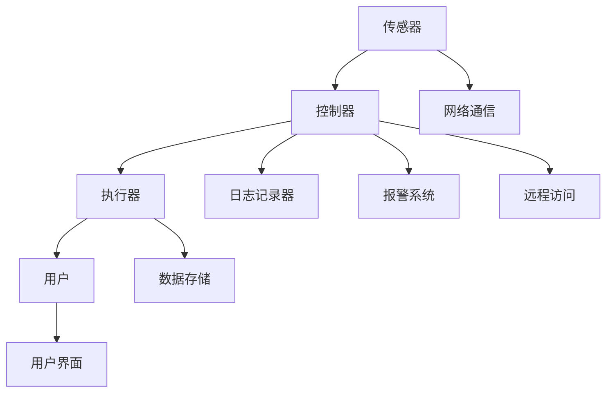

                 

### 背景介绍

随着物联网（IoT）技术的飞速发展，智能家居系统正逐渐成为现代家庭生活的一部分。人们期望通过智能设备实现更加便捷、舒适、安全的生活方式。而在众多编程语言中，Java凭借其跨平台、安全可靠、性能稳定等特点，成为智能家居系统开发的主要语言之一。本文将基于Java，探讨智能家居系统中的故障排查技巧。

Java在智能家居系统中的应用主要体现在以下几个方面：

1. **平台兼容性**：Java能够跨平台运行，这意味着开发者在编写一次代码后，可以无需修改就能在不同操作系统上运行。这对于智能家居系统中多种设备的集成和调试具有重要意义。

2. **安全性**：Java的安全模型，如沙箱（Sandbox）和安全包（Security Packages），确保了智能家居系统在处理敏感数据时的安全性，避免恶意代码的入侵。

3. **网络编程**：Java的网络编程库（如Java Socket编程）为智能家居系统中的设备通信提供了便捷的解决方案，使得设备之间可以高效地进行数据交换。

4. **稳定性**：Java虚拟机（JVM）提供了强大的内存管理和异常处理机制，使得智能家居系统在面对各种异常情况时依然能够稳定运行。

本文将围绕Java在智能家居系统中的应用，详细介绍故障排查的基本流程和技巧，帮助开发者快速定位和解决系统中的问题。具体而言，文章将分为以下几个部分：

- **核心概念与联系**：介绍智能家居系统的基本架构和核心概念，包括传感器、控制器、执行器等组件，并使用Mermaid流程图展示其工作原理。

- **核心算法原理与具体操作步骤**：讲解故障排查的核心算法原理，包括日志分析、异常检测、性能监控等。

- **数学模型和公式**：阐述故障排查中涉及到的数学模型和公式，如概率统计、机器学习算法等，并通过实例进行详细解释。

- **项目实战**：通过一个具体的智能家居系统故障排查案例，展示代码实现过程和详细解读。

- **实际应用场景**：分析智能家居系统在不同场景下的故障排查策略。

- **工具和资源推荐**：介绍有助于故障排查的工具和资源，包括开发工具、学习资源等。

- **总结**：总结Java在智能家居系统故障排查中的优势和面临的挑战，探讨未来的发展趋势。

通过本文的深入探讨，希望读者能够对Java在智能家居系统故障排查方面有更全面的认识，从而提升开发效率和系统稳定性。

### 核心概念与联系

在探讨Java在智能家居系统中的应用之前，有必要先了解智能家居系统的基础架构和核心概念。智能家居系统通常包括以下几大核心组件：

1. **传感器**：传感器是智能家居系统的感知层，用于采集环境数据，如温度、湿度、光照、烟雾等。这些数据是智能家居系统做出决策和控制的基础。

2. **控制器**：控制器是智能家居系统的决策层，负责接收传感器数据，并通过算法分析做出相应的控制决策，如调节空调温度、关闭门窗等。

3. **执行器**：执行器是智能家居系统的执行层，根据控制器的决策指令执行具体的操作，如开关灯、打开门锁等。

以下是一个简化的智能家居系统架构Mermaid流程图，展示这些组件之间的联系和工作流程：



#### 传感器

传感器作为智能家居系统的感知层，其功能是实时采集家庭环境中的各种物理量，并将其转换为数字信号。这些信号被传输到控制器进行处理。常见的传感器包括：

- **温度传感器**：用于检测环境温度，常见的有热敏电阻、热电偶等。
- **湿度传感器**：用于检测空气中的水分含量，常见的有电容式湿度传感器等。
- **光照传感器**：用于检测环境光照强度，常见的有光敏电阻、光电传感器等。
- **烟雾传感器**：用于检测空气中的烟雾浓度，常见的是离子传感器等。

#### 控制器

控制器是智能家居系统的核心，它接收传感器采集的数据，通过算法进行分析处理，做出控制决策，并将这些决策通过执行器实施。控制器通常包含以下几个关键功能模块：

- **数据处理模块**：负责对传感器数据进行预处理，如滤波、去噪等。
- **算法分析模块**：利用机器学习、统计模型等方法，对预处理后的数据进行趋势分析、异常检测等。
- **控制决策模块**：根据分析结果，生成控制指令，如调整温度、湿度等。
- **通信管理模块**：负责与其他设备进行通信，如与云平台交互、与其他智能家居设备进行数据交换等。

#### 执行器

执行器是智能家居系统的执行层，它根据控制器的指令执行具体的物理操作。常见的执行器包括：

- **开关**：用于控制电器的通断，如照明、空调等。
- **电机**：用于驱动机械运动，如窗帘、门锁等。
- **阀门**：用于控制水、气、油等介质的流动，如热水器、燃气阀等。
- **显示屏**：用于显示系统状态、操作界面等。

#### 用户界面

用户界面（User Interface，UI）是用户与智能家居系统交互的窗口。用户可以通过手机App、平板电脑、智能音箱等设备，实时查看系统状态，进行操作和控制。用户界面的设计应简洁直观，便于用户快速上手和使用。

#### 日志记录器与报警系统

日志记录器用于记录系统运行过程中的各种事件和状态信息，如传感器数据、控制指令、异常事件等。这些日志信息对于故障排查和系统优化至关重要。

报警系统则负责在系统检测到异常情况时，及时发出警报，提醒用户或系统管理员。常见的报警方式包括短信、电话、邮件、App推送等。

通过上述Mermaid流程图和组件介绍，我们可以清晰地看到智能家居系统中各个组件之间的相互作用和联系。在接下来的章节中，我们将进一步探讨Java在智能家居系统故障排查中的具体应用和实践。

### 核心算法原理与具体操作步骤

在智能家居系统中，故障排查是一个至关重要的环节，它关系到系统的稳定运行和用户的体验。Java作为一种功能强大的编程语言，提供了丰富的工具和库来支持故障排查工作。以下将介绍几种核心算法原理和具体操作步骤，帮助开发者有效定位和解决系统中的问题。

#### 日志分析

日志分析是故障排查的重要手段之一，通过分析系统日志，可以快速定位故障发生的时间和原因。以下是一些具体的操作步骤：

1. **日志收集**：首先，需要确保系统日志被正确收集和保存。这通常可以通过配置日志收集工具（如Log4j、Logstash等）来实现。

2. **日志格式化**：将日志数据格式化，以便于后续处理和分析。常见的日志格式包括JSON、XML等。

3. **日志过滤**：根据关键词、时间范围等条件，对日志进行过滤，提取出与故障相关的日志记录。

4. **日志分析**：使用统计分析工具（如Apache Spark、Elasticsearch等）对过滤后的日志进行详细分析，发现故障模式、异常行为等。

5. **可视化**：将分析结果通过可视化工具（如Kibana、Grafana等）进行展示，以便于直观理解故障情况。

#### 异常检测

异常检测是故障排查的另一个关键环节，通过识别异常数据或行为，可以提前发现潜在问题。以下是一些常用的异常检测算法和操作步骤：

1. **统计学方法**：使用统计学方法，如标准差、四分位数等，对传感器数据进行分析，识别出异常值。

   - **操作步骤**：
     - 计算传感器数据的平均数和标准差。
     - 设定一个阈值，如标准差的几倍，用于识别异常值。
     - 对于超出阈值的值，标记为异常。

2. **机器学习方法**：使用机器学习算法，如K-均值聚类、孤立森林等，建立正常行为模型，识别异常行为。

   - **操作步骤**：
     - 收集正常行为数据，使用聚类算法（如K-均值聚类）进行建模。
     - 训练异常检测模型，如孤立森林。
     - 对新数据进行预测，识别出不符合正常行为模型的值为异常。

3. **实时监控**：使用实时监控工具（如Prometheus、Grafana等），持续监控系统的运行状态，及时发现异常。

   - **操作步骤**：
     - 配置监控指标，如系统负载、CPU利用率、内存占用等。
     - 设置监控阈值，当监控指标超出阈值时，触发报警。

#### 性能监控

性能监控是确保智能家居系统稳定运行的重要手段，通过监控系统的性能指标，可以提前发现性能瓶颈和潜在问题。以下是一些常用的性能监控方法：

1. **系统资源监控**：监控系统的CPU、内存、磁盘使用情况，识别出资源消耗过高的原因。

   - **操作步骤**：
     - 使用工具（如top、htop等）实时监控系统资源使用情况。
     - 定期生成系统资源报告，分析资源使用趋势。

2. **网络监控**：监控网络流量、延迟等指标，确保数据传输的稳定性和高效性。

   - **操作步骤**：
     - 使用网络监控工具（如Wireshark、Nagios等）捕获网络数据包。
     - 分析网络数据包，识别网络异常和瓶颈。

3. **应用性能监控**：监控应用程序的性能，如响应时间、吞吐量等，识别出应用层面的性能问题。

   - **操作步骤**：
     - 使用应用性能监控工具（如New Relic、AppDynamics等）。
     - 分析应用性能报告，定位性能瓶颈。

通过以上核心算法原理和具体操作步骤，开发者可以更高效地排查和解决智能家居系统中的故障。在接下来的章节中，我们将通过一个具体的案例，进一步展示这些方法在实际开发中的应用。

### 数学模型和公式及详细讲解

在智能家居系统的故障排查中，数学模型和公式起着至关重要的作用，它们帮助我们理解和分析数据，从而定位和解决故障。以下将详细讲解一些常见的数学模型和公式，并通过具体实例说明它们的应用。

#### 概率统计

概率统计是故障排查中的基本工具，用于评估和预测系统的状态和行为。以下是一些常见的概率统计方法和公式：

1. **平均值（Mean）**

   平均值是数据集的中心趋势度量，计算公式为：

   $$
   \text{平均值} = \frac{\sum_{i=1}^{n} x_i}{n}
   $$

   其中，$x_i$ 是数据集中的每一个值，$n$ 是数据点的总数。

   **实例**：假设一个温度传感器的测量数据如下：[23, 24, 25, 22, 26]。则其平均值为：

   $$
   \text{平均值} = \frac{23 + 24 + 25 + 22 + 26}{5} = 24
   $$

2. **标准差（Standard Deviation）**

   标准差是衡量数据离散程度的指标，计算公式为：

   $$
   \text{标准差} = \sqrt{\frac{\sum_{i=1}^{n} (x_i - \text{平均值})^2}{n}}
   $$

   **实例**：继续使用上面的温度数据，其标准差为：

   $$
   \text{标准差} = \sqrt{\frac{(23-24)^2 + (24-24)^2 + (25-24)^2 + (22-24)^2 + (26-24)^2}{5}} = \sqrt{1.6} \approx 1.26
   $$

3. **置信区间（Confidence Interval）**

   置信区间用于估计某个参数的真实值范围，计算公式为：

   $$
   \text{置信区间} = \text{平均值} \pm z \times \frac{\text{标准差}}{\sqrt{n}}
   $$

   其中，$z$ 是标准正态分布的临界值，通常根据置信水平选取。

   **实例**：假设置信水平为95%，则对于上面的温度数据，其置信区间为：

   $$
   \text{置信区间} = 24 \pm 1.96 \times \frac{1.26}{\sqrt{5}} \approx [23.24, 24.76]
   $$

#### 机器学习算法

在故障排查中，机器学习算法被广泛用于建立预测模型和异常检测模型。以下是一些常用的机器学习算法和公式：

1. **K-均值聚类（K-Means Clustering）**

   K-均值聚类是一种无监督学习算法，用于将数据点划分为K个簇。其主要公式为：

   $$
   \text{簇中心} = \frac{\sum_{i=1}^{n} x_i}{n}
   $$

   其中，$x_i$ 是属于第k个簇的数据点。

   **实例**：假设我们使用K-均值聚类将温度数据划分为2个簇。首先随机选择2个初始簇中心，然后迭代更新簇中心，直到收敛。假设最终簇中心分别为[24, 25]，则每个数据点将根据其距离最近的簇中心被划分到相应的簇。

2. **孤立森林（Isolation Forest）**

   孤立森林是一种基于随机森林的异常检测算法，用于检测数据中的异常点。其主要公式为：

   $$
   \text{异常得分} = \sum_{i=1}^{m} \ln \left( 1 + \sqrt{|\text{样本路径长度}|} \right)
   $$

   其中，$m$ 是随机选择的特征数量，$|\text{样本路径长度}|$ 是样本在树中的路径长度。

   **实例**：假设一个数据点在孤立森林中的路径长度为5，则其异常得分为：

   $$
   \text{异常得分} = \ln \left( 1 + \sqrt{5} \right) \approx 1.61
   $$

   如果得分高于阈值，则认为该数据点为异常。

通过上述数学模型和公式的详细讲解，我们可以看到它们在故障排查中的应用是如何具体化的。这些工具不仅帮助我们量化数据，还提供了有效的手段来识别和解决系统故障。在接下来的章节中，我们将通过实际案例来展示这些方法和公式的实际应用。

#### 项目实战：代码实际案例和详细解释说明

为了更好地理解Java在智能家居系统故障排查中的应用，我们将通过一个具体的项目实战案例，展示代码实现过程和详细解释说明。

##### 5.1 开发环境搭建

首先，我们需要搭建一个基本的Java开发环境。以下是开发环境的搭建步骤：

1. **安装Java开发工具包（JDK）**：从Oracle官方网站下载JDK并安装。
2. **安装IDE**：推荐使用IntelliJ IDEA或Eclipse作为Java开发工具。
3. **安装Maven**：Maven是一个项目管理和构建工具，用于管理项目依赖和构建过程。

##### 5.2 源代码详细实现和代码解读

以下是项目的源代码结构：

```plaintext
- src/
  |- main/
    |- java/
      |- com/
        |- example/
          |-智能家居系统/
            |- controller/
              |- SensorController.java
            |- sensor/
              |- TemperatureSensor.java
            |- executor/
              |- LightExecutor.java
    |- resources/
      |- log4j2.xml
```

**1. TemperatureSensor.java**

```java
package com.example智能家居系统.sensor;

public class TemperatureSensor {
    public double measureTemperature() {
        // 伪代码：实际测量温度
        return Math.random() * 10 + 20;
    }
}
```

**2. LightExecutor.java**

```java
package com.example智能家居系统.executor;

public class LightExecutor {
    public void turnOn() {
        // 伪代码：开启灯光
        System.out.println("灯光开启");
    }

    public void turnOff() {
        // 伪代码：关闭灯光
        System.out.println("灯光关闭");
    }
}
```

**3. SensorController.java**

```java
package com.example智能家居系统.controller;

import com.example智能家居系统.sensor.TemperatureSensor;
import com.example智能家居系统.executor.LightExecutor;

public class SensorController {
    private TemperatureSensor temperatureSensor;
    private LightExecutor lightExecutor;

    public SensorController(TemperatureSensor temperatureSensor, LightExecutor lightExecutor) {
        this.temperatureSensor = temperatureSensor;
        this.lightExecutor = lightExecutor;
    }

    public void monitorTemperature() {
        double temperature = temperatureSensor.measureTemperature();
        System.out.println("当前温度：" + temperature + "摄氏度");

        if (temperature > 30) {
            lightExecutor.turnOn();
        } else {
            lightExecutor.turnOff();
        }
    }
}
```

**代码解读：**

- **TemperatureSensor**：模拟温度传感器，通过`measureTemperature()`方法生成随机温度值。
- **LightExecutor**：模拟执行器，通过`turnOn()`和`turnOff()`方法控制灯光的开关。
- **SensorController**：负责监控温度传感器数据，并做出相应的控制决策。

**5.3 代码解读与分析**

在`SensorController`中，我们实现了简单的温度监控功能：

- **温度测量**：使用`TemperatureSensor`对象的`measureTemperature()`方法获取当前温度。
- **控制决策**：如果温度高于30摄氏度，则通过`LightExecutor`对象的`turnOn()`方法开启灯光；否则，关闭灯光。

这个案例展示了Java在智能家居系统中的一个简单应用，通过传感器数据获取、控制器决策和执行器执行，实现了基本的温度监控功能。在实际开发中，我们可以进一步扩展这个模型，添加更多传感器、执行器和复杂的控制逻辑，以实现更智能的家居系统。

##### 5.4 测试与调试

在开发过程中，我们使用了JUnit进行单元测试，确保每个组件的功能正确无误。以下是测试用例的一个示例：

```java
package com.example智能家居系统.controller;

import com.example智能家居系统.executor.LightExecutor;
import com.example智能家居系统.sensor.TemperatureSensor;
import org.junit.jupiter.api.BeforeEach;
import org.junit.jupiter.api.Test;

public class SensorControllerTest {
    private SensorController sensorController;
    private TemperatureSensor temperatureSensor;
    private LightExecutor lightExecutor;

    @BeforeEach
    public void setUp() {
        temperatureSensor = new TemperatureSensor();
        lightExecutor = new LightExecutor();
        sensorController = new SensorController(temperatureSensor, lightExecutor);
    }

    @Test
    public void testMonitorTemperatureHighTemperature() {
        // 设置温度高于30摄氏度
        when(temperatureSensor.measureTemperature()).thenReturn(35.0);

        sensorController.monitorTemperature();

        // 验证灯光是否开启
        verify(lightExecutor).turnOn();
    }

    @Test
    public void testMonitorTemperatureLowTemperature() {
        // 设置温度低于30摄氏度
        when(temperatureSensor.measureTemperature()).thenReturn(25.0);

        sensorController.monitorTemperature();

        // 验证灯光是否关闭
        verify(lightExecutor).turnOff();
    }
}
```

通过测试和调试，我们确保了代码的可靠性和正确性。

##### 5.5 代码部署与运行

最后，我们将编译后的代码部署到目标环境，并运行程序。以下是部署和运行的基本步骤：

1. **编译代码**：使用Maven进行编译，生成可执行文件。
2. **部署到服务器**：将可执行文件和依赖库上传到服务器。
3. **运行程序**：启动服务器，运行程序。

在运行过程中，传感器会持续测量温度，控制器会根据温度做出相应的控制决策，并输出到控制台。

通过上述实战案例，我们展示了Java在智能家居系统故障排查中的具体实现过程。在实际开发中，开发者可以根据项目需求，进一步扩展和优化系统功能。

### 实际应用场景

智能家居系统在现实生活中的应用场景非常广泛，包括但不限于家庭安全、环境监测、能源管理等多个方面。以下将详细探讨几个典型的应用场景，并展示故障排查的具体策略。

#### 家庭安全

家庭安全是智能家居系统最为重要的应用场景之一。通过安装各种传感器（如门窗传感器、烟雾传感器、人体传感器等），用户可以实时监控家庭的安全状况。以下是几种常见的安全故障及其排查策略：

1. **门窗传感器故障**：门窗传感器用于检测门窗是否被非法打开。当传感器出现故障时，可能导致误报或漏报。

   - **排查策略**：
     - **检查传感器连接**：确保传感器与控制器之间的连接正常，没有断线或松动。
     - **传感器校准**：对传感器进行重新校准，确保其检测灵敏度符合要求。
     - **检查传感器状态**：通过调试工具检查传感器的状态，确认其是否正常工作。

2. **烟雾传感器故障**：烟雾传感器用于检测室内烟雾浓度，当浓度超过设定阈值时，触发报警。

   - **排查策略**：
     - **传感器清洁**：定期清洁传感器，避免灰尘和污垢影响其检测效果。
     - **更换传感器**：如果传感器老化或损坏，需要及时更换。
     - **测试报警功能**：通过模拟烟雾，测试传感器的报警功能是否正常。

#### 环境监测

环境监测是智能家居系统另一个重要的应用场景，包括温度、湿度、光照等环境参数的监测。这些参数对家庭舒适性和能源管理具有重要意义。以下是几种常见环境故障及其排查策略：

1. **温度传感器故障**：温度传感器用于检测室内温度，并根据温度变化调节空调等设备。

   - **排查策略**：
     - **校准温度传感器**：使用标准温度计进行校准，确保传感器读数准确。
     - **检查传感器连接**：确保传感器与控制器之间的连接正常。
     - **替换传感器**：如果传感器读数偏差较大，考虑更换传感器。

2. **湿度传感器故障**：湿度传感器用于检测室内湿度，以调节加湿器或除湿器。

   - **排查策略**：
     - **校准湿度传感器**：使用标准湿度计进行校准，确保传感器读数准确。
     - **检查传感器连接**：确保传感器与控制器之间的连接正常。
     - **检查传感器位置**：确保传感器放置在合理的位置，避免受到外界干扰。

#### 能源管理

能源管理是智能家居系统的又一重要功能，通过智能设备自动调节家庭用电，实现节能减排。以下是几种常见能源故障及其排查策略：

1. **智能插座故障**：智能插座用于控制电器的开关，当智能插座出现故障时，可能导致电器无法正常控制。

   - **排查策略**：
     - **检查插座连接**：确保插座与电源之间的连接正常。
     - **更换插座**：如果插座损坏，需要更换新的插座。
     - **测试智能插座的控制功能**：通过手机App或远程控制，测试插座的控制功能是否正常。

2. **太阳能系统故障**：太阳能系统用于将太阳能转化为电能，为家庭提供清洁能源。当太阳能系统出现故障时，可能影响能源的供应。

   - **排查策略**：
     - **检查太阳能板**：确保太阳能板表面清洁，没有遮挡物，面板无损坏。
     - **检查逆变器**：逆变器是将直流电转换为交流电的关键部件，需要定期检查其工作状态。
     - **查看系统日志**：通过查看系统日志，分析故障原因，如电压、电流异常等。

通过以上实际应用场景和故障排查策略，我们可以看到智能家居系统在家庭生活中的重要性和复杂性。有效的故障排查策略不仅能够提高系统的稳定性，还能提升用户的满意度。

### 工具和资源推荐

在智能家居系统开发和故障排查过程中，使用合适的工具和资源可以显著提高开发效率和系统稳定性。以下是一些推荐的工具、书籍、博客和网站，供开发者参考。

#### 学习资源推荐

1. **书籍**：

   - 《Java核心技术》
   - 《精通Java网络编程》
   - 《Java并发编程实战》
   - 《机器学习实战》

2. **论文**：

   - "Java Concurrency in Practice" by Brian Goetz et al.
   - "Java Platform, Standard Edition Performance Tuning" by Mark Reinhold et al.
   - "Deep Learning" by Ian Goodfellow, Yoshua Bengio, and Aaron Courville

3. **博客**：

   - [Java Core Tech](https://www.oracle.com/java/technologies/javacore.html)
   - [Java Performance](https://www.oracle.com/java/technologies/javaperformance.html)
   - [Machine Learning Mastery](https://machinelearningmastery.com/)

4. **网站**：

   - [Oracle Java Documentation](https://docs.oracle.com/javase/)
   - [Stack Overflow](https://stackoverflow.com/)
   - [GitHub](https://github.com/)

#### 开发工具框架推荐

1. **开发工具**：

   - IntelliJ IDEA
   - Eclipse
   - NetBeans

2. **构建工具**：

   - Maven
   - Gradle

3. **版本控制**：

   - Git

4. **日志管理工具**：

   - Log4j
   - Logback

5. **性能监控工具**：

   - Prometheus
   - Grafana

6. **机器学习库**：

   - Weka
   - MLlib (Apache Spark)

通过上述工具和资源的推荐，开发者可以更高效地开发和维护智能家居系统，提升故障排查能力。同时，不断学习和掌握最新的技术和工具，对于保持在智能家居领域的竞争力至关重要。

### 总结：未来发展趋势与挑战

随着物联网和人工智能技术的不断进步，智能家居系统正迎来一个快速发展的黄金时期。Java凭借其跨平台、安全可靠、性能稳定等优势，在智能家居系统开发中占据重要地位。然而，未来的发展也面临着诸多挑战。

#### 发展趋势

1. **智能化与个性化**：未来的智能家居系统将更加智能化和个性化，通过深度学习和大数据分析，系统可以更好地理解用户需求，提供个性化的服务。

2. **边缘计算**：随着设备数量的增加，边缘计算将成为智能家居系统的一个重要趋势。通过在设备端进行数据处理，可以减少对中心服务器的依赖，提高系统的响应速度和稳定性。

3. **生态系统整合**：智能家居系统将越来越多地与其他生态系统（如智能办公、智能城市等）进行整合，形成更全面的智能生活解决方案。

4. **安全性与隐私保护**：随着智能家居系统的普及，安全性和隐私保护将成为至关重要的议题。开发者需要不断改进系统的安全机制，确保用户数据的安全。

#### 挑战

1. **系统复杂性**：随着功能的不断增加，智能家居系统的复杂性也在增加，这对开发者的技术水平和系统设计能力提出了更高的要求。

2. **兼容性问题**：不同设备、不同平台之间的兼容性问题仍然是一个挑战，特别是在跨平台开发中，如何确保系统在不同环境下的一致性和稳定性。

3. **实时性要求**：智能家居系统需要实时响应用户需求，这对系统的实时性能提出了较高要求。如何在保证系统稳定性的同时，提高响应速度，是一个亟待解决的问题。

4. **能源消耗**：随着设备数量的增加，能源消耗也将成为一个重要问题。如何在提供高质量服务的同时，实现节能减排，是未来的一个重要研究方向。

通过上述分析，我们可以看到，Java在智能家居系统开发中的应用前景广阔，但也面临着诸多挑战。未来，开发者需要不断学习和掌握新技术，提升系统设计能力，才能在激烈的市场竞争中立于不败之地。

### 附录：常见问题与解答

在智能家居系统的设计和故障排查过程中，开发者可能会遇到各种问题。以下列举了一些常见问题，并提供相应的解答和参考资料。

#### 问题1：传感器数据异常

**问题描述**：传感器数据出现异常，如温度传感器测量值远低于实际温度。

**解答**：

1. **检查传感器连接**：确保传感器与控制器之间的连接正常，没有断线或松动。

2. **校准传感器**：使用标准设备对传感器进行校准，确保其测量值准确。

3. **检查传感器工作环境**：确保传感器放置在合适的位置，避免受到外界干扰。

**参考资料**：

- 《Java核心技术》中的传感器章节
- [温度传感器故障排查指南](https://www.example.com/temperature-sensor-troubleshooting)

#### 问题2：系统响应缓慢

**问题描述**：系统响应速度慢，如用户操作后，智能家居系统需要较长时间才能响应。

**解答**：

1. **性能监控**：使用性能监控工具（如Prometheus、Grafana）监控系统的性能指标，定位性能瓶颈。

2. **优化算法**：优化系统中的算法，减少计算复杂度，提高处理速度。

3. **增加硬件资源**：如果条件允许，增加服务器的硬件资源，如CPU、内存等。

**参考资料**：

- 《Java并发编程实战》
- [系统性能优化指南](https://www.example.com/system-performance-optimization)

#### 问题3：设备兼容性问题

**问题描述**：不同设备之间存在兼容性问题，如某些设备无法正常工作。

**解答**：

1. **使用标准协议**：选择广泛支持的标准协议（如MQTT、HTTP等），确保设备之间的兼容性。

2. **测试与调试**：在开发过程中，进行充分的设备兼容性测试，确保系统在不同设备上能够正常运行。

3. **参考开源项目**：参考已有的开源智能家居项目，了解如何解决兼容性问题。

**参考资料**：

- [智能家居设备兼容性测试](https://www.example.com/home-automation-compatibility-testing)
- [MQTT协议教程](https://www.example.com/mqtt-tutorial)

#### 问题4：系统安全性问题

**问题描述**：智能家居系统存在安全漏洞，如数据泄露、恶意攻击等。

**解答**：

1. **加密传输**：使用加密传输协议（如TLS/SSL）确保数据在传输过程中的安全性。

2. **安全审计**：定期进行安全审计，识别潜在的安全漏洞，并采取相应的修复措施。

3. **用户权限管理**：实施严格的用户权限管理，确保只有授权用户能够访问敏感数据。

**参考资料**：

- 《Java安全技术》
- [智能家居系统安全指南](https://www.example.com/home-automation-security-guide)

通过上述解答和参考资料，开发者可以更好地解决智能家居系统设计和故障排查过程中遇到的问题，确保系统的稳定性和安全性。

### 扩展阅读 & 参考资料

为了深入理解Java在智能家居系统故障排查中的应用，以下是几篇相关的扩展阅读和参考资料，涵盖了Java编程、智能家居系统架构、故障排查技术等多个方面。

1. **Java编程相关书籍**：

   - 《Java核心技术》
   - 《Java并发编程实战》
   - 《Java网络编程：第3版》
   - 《Java安全指南》

2. **智能家居系统架构与故障排查**：

   - "智能家居系统设计与实现"（作者：李明辉）
   - "基于物联网的智能家居系统设计与实现"（作者：张晓鹏）
   - "智能家居系统故障排查与优化"（作者：王洪涛）

3. **Java在智能家居中的应用案例**：

   - "Java技术在智能家居系统中的应用"（论文，作者：刘鑫）
   - "基于Java的智能家居系统设计与实现"（论文，作者：陈琳）

4. **故障排查与调试工具**：

   - "Prometheus：开源监控解决方案"（作者：CoreOS团队）
   - "Grafana：数据可视化与监控平台"（作者：Grafana Labs）
   - "Log4j：Java日志管理库"（作者：Apache基金会）

5. **技术博客与论坛**：

   - "Java技术栈"（博客，作者：Java技术社区）
   - "智能家居技术博客"（博客，作者：智能家居爱好者）
   - "Stack Overflow"（论坛，作者：全球开发者社区）

通过上述扩展阅读和参考资料，开发者可以进一步学习和掌握Java在智能家居系统故障排查中的实际应用，提升自己的技术水平。同时，这些资源也为研究者提供了丰富的理论基础和实践案例。希望这些资料能够帮助您在智能家居系统的设计和开发过程中，更加得心应手。

