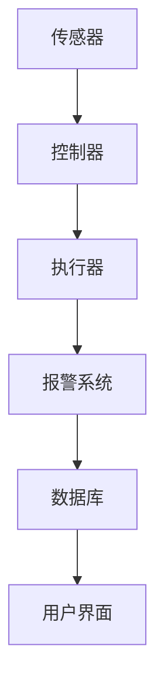

                 

### 文章标题：基于Java的智能家居设计：用Java实现住宅安全系统的逻辑核心

**关键词**：智能家居，Java编程，住宅安全系统，算法原理，数学模型，实战案例

**摘要**：本文将探讨如何使用Java编程语言实现智能家居的住宅安全系统。通过详细剖析核心概念和算法原理，本文将带领读者一步一步地了解该系统的设计思路和实现方法，同时通过具体案例和代码分析，展示其实际应用场景和实现细节。

### 1. 背景介绍

随着科技的发展，智能家居逐渐走入千家万户。智能家居系统通过互联网、物联网等技术，将家庭设备连接在一起，实现远程监控、自动化控制等功能。其中，住宅安全系统作为智能家居的重要组成部分，其作用至关重要。它能够实时监测家庭安全状况，及时预警和处理各种潜在威胁，为家庭提供安全保障。

Java作为一种广泛使用的编程语言，具有良好的跨平台性、安全性和稳定性，非常适合用于开发智能家居系统。本文将结合Java编程，详细阐述如何设计并实现一个高效的住宅安全系统，包括核心算法、数学模型和实际应用场景。

### 2. 核心概念与联系

为了更好地理解住宅安全系统的设计，我们需要先了解几个核心概念：

- **传感器**：传感器是住宅安全系统的数据来源，用于监测家庭环境中的各种参数，如温度、湿度、烟雾、光线等。
- **控制器**：控制器是系统的核心，负责接收传感器数据，根据预设的规则进行判断和处理，并控制执行器执行相应的操作。
- **执行器**：执行器是系统的执行单元，根据控制器的指令执行具体的操作，如打开或关闭门窗、启动灭火设备等。

以下是住宅安全系统的 Mermaid 流程图：



**流程说明**：

1. 传感器实时采集家庭环境数据，发送给控制器。
2. 控制器接收数据并进行分析，根据预设规则判断是否触发报警或执行器操作。
3. 执行器根据控制器的指令执行具体的操作。
4. 报警系统实时向用户发送报警信息。
5. 数据库记录系统的运行情况和报警记录，供用户查询和统计。

### 3. 核心算法原理 & 具体操作步骤

住宅安全系统的核心在于如何有效地处理传感器数据，并根据数据变化进行实时判断和响应。下面我们介绍几种常用的核心算法原理和具体操作步骤。

#### 3.1 数据预处理

数据预处理是确保传感器数据质量的重要步骤。其主要任务包括：

- **去噪**：去除传感器数据中的噪声，提高数据准确性。
- **归一化**：将传感器数据进行归一化处理，使其具有相同的量纲和范围，方便后续分析。
- **滤波**：对传感器数据进行滤波处理，去除短时间内的异常波动。

具体操作步骤如下：

1. 读取传感器数据。
2. 对数据进行去噪处理，如使用中值滤波、高斯滤波等方法。
3. 对数据进行归一化处理，如使用最小-最大规范化方法。
4. 对数据进行滤波处理，如使用移动平均滤波方法。

#### 3.2 数据分析

数据分析是住宅安全系统的关键环节，主要包括以下任务：

- **特征提取**：从传感器数据中提取有助于判断安全状况的特征。
- **异常检测**：根据特征数据，检测家庭环境中的异常状况。
- **预测**：基于历史数据，预测未来可能发生的安全事件。

具体操作步骤如下：

1. 提取传感器数据的特征，如温度、湿度、烟雾浓度等。
2. 使用统计方法，如均值、方差、标准差等，分析特征数据的分布和变化趋势。
3. 使用机器学习方法，如K-近邻、决策树、支持向量机等，进行异常检测和预测。

#### 3.3 判断与响应

根据数据分析结果，系统需要做出相应的判断和响应：

- **报警**：当检测到异常状况时，触发报警系统，向用户发送报警信息。
- **执行器控制**：根据预设规则，控制执行器执行相应的操作，如关闭门窗、启动灭火设备等。

具体操作步骤如下：

1. 分析传感器数据，判断是否存在异常状况。
2. 根据异常状况，触发报警或执行器控制。
3. 将报警信息和执行器状态记录到数据库，供用户查询和统计。

### 4. 数学模型和公式 & 详细讲解 & 举例说明

在住宅安全系统中，数学模型和公式用于描述传感器数据的变化规律、异常检测方法和预测模型。下面我们介绍几个常用的数学模型和公式，并详细讲解其原理和应用。

#### 4.1 数据归一化

数据归一化是一种常用的数据预处理方法，用于消除不同特征之间的量纲差异。常用的归一化方法包括最小-最大规范化、均值-方差规范化等。

- **最小-最大规范化**：

  $$ x_{\text{规范化}} = \frac{x_{\text{原始}} - x_{\text{最小值}}}{x_{\text{最大值}} - x_{\text{最小值}}} $$

  其中，$x_{\text{原始}}$ 为原始数据，$x_{\text{最小值}}$ 和 $x_{\text{最大值}}$ 分别为数据的最小值和最大值。

  举例说明：

  假设温度传感器的数据范围为 [20, 30]，我们需要将数据归一化到 [0, 1]。

  $$ x_{\text{规范化}} = \frac{x_{\text{原始}} - 20}{30 - 20} = \frac{x_{\text{原始}} - 20}{10} $$

  当 $x_{\text{原始}} = 25$ 时，$x_{\text{规范化}} = \frac{25 - 20}{10} = 0.5$。

- **均值-方差规范化**：

  $$ x_{\text{规范化}} = \frac{x_{\text{原始}} - \mu}{\sigma} $$

  其中，$\mu$ 为数据的均值，$\sigma$ 为数据的标准差。

  举例说明：

  假设温度传感器的数据均值为 25，标准差为 5，我们需要将数据归一化。

  $$ x_{\text{规范化}} = \frac{x_{\text{原始}} - 25}{5} $$

  当 $x_{\text{原始}} = 30$ 时，$x_{\text{规范化}} = \frac{30 - 25}{5} = 0.5$。

#### 4.2 异常检测

异常检测是一种用于检测数据中异常值的算法。常用的异常检测方法包括基于统计的方法和基于机器学习的方法。

- **基于统计的方法**：

  常用的统计方法包括箱线图、标准差等。

  - **箱线图**：

    箱线图是一种用于展示数据分布的图形，其中包含数据的下四分位数、中位数和上四分位数。任何低于下四分位数或高于上四分位数的值都可以被视为异常值。

    - **标准差**：

      基于标准差的异常检测方法认为，任何距离平均值超过一定倍数标准差的值都可以被视为异常值。常用的倍数包括 1、2、3 等。

      $$ x_{\text{异常}} = x_{\text{平均值}} + k \times \sigma $$

      其中，$x_{\text{平均值}}$ 为数据的平均值，$\sigma$ 为数据的标准差，$k$ 为倍数。

      举例说明：

      假设温度传感器的数据平均值为 25，标准差为 5，我们设定倍数为 2，那么任何距离平均值超过 2 倍标准差的值都可以被视为异常值。

      $$ x_{\text{异常}} = 25 + 2 \times 5 = 35 $$

      当 $x_{\text{原始}} = 40$ 时，$x_{\text{异常}} = 40$，因此可以判定为异常值。

- **基于机器学习的方法**：

  基于机器学习的方法通过训练模型来识别异常值。常用的方法包括 K-近邻、决策树、支持向量机等。

  - **K-近邻**：

    K-近邻算法通过计算数据点之间的距离，找出最近的 K 个邻居，并根据邻居的类别来预测数据点的类别。

    $$ d(x, y) = \sqrt{\sum_{i=1}^{n}(x_i - y_i)^2} $$

    其中，$x$ 和 $y$ 分别为两个数据点，$n$ 为数据点的维度。

    举例说明：

    假设有两个数据点 $x_1 = [2, 3]$ 和 $x_2 = [5, 7]$，我们需要计算它们之间的距离。

    $$ d(x_1, x_2) = \sqrt{(2 - 5)^2 + (3 - 7)^2} = \sqrt{(-3)^2 + (-4)^2} = \sqrt{9 + 16} = \sqrt{25} = 5 $$

    - **决策树**：

      决策树通过一系列规则来判断数据点的类别。每个节点表示一个特征，每个分支表示特征的取值，叶节点表示数据点的类别。

      举例说明：

      假设一个决策树节点有两个特征：温度和湿度。当温度大于 25 且湿度小于 60 时，表示安全；否则表示异常。

      $$ \text{如果 温度 > 25 且 湿度 < 60，则 安全；否则 异常。} $$

    - **支持向量机**：

      支持向量机通过找到数据点之间的最大间隔来划分类别。常用的支持向量机算法包括线性支持向量机、非线性支持向量机等。

      $$ w \cdot x + b = 0 $$

      其中，$w$ 为权重向量，$x$ 为数据点，$b$ 为偏置。

      举例说明：

      假设有两个类别 A 和 B，线性支持向量机通过找到两个类别之间的最大间隔来划分数据点。

      $$ \max \frac{1}{\|w\|} \text{，使得 } y_i(w \cdot x_i + b) \geq 1 \text{ 对于所有的 } i $$

### 5. 项目实战：代码实际案例和详细解释说明

在本节中，我们将通过一个具体的代码案例，展示如何使用 Java 编程语言实现住宅安全系统的核心功能。该案例将包括传感器数据采集、数据分析、判断与响应等环节。

#### 5.1 开发环境搭建

首先，我们需要搭建 Java 开发环境。以下是搭建步骤：

1. 下载并安装 Java Development Kit (JDK)，可以从 Oracle 官网下载：https://www.oracle.com/java/technologies/javase-jdk11-downloads.html
2. 配置环境变量，将 JDK 安装路径添加到系统的 PATH 环境变量中。
3. 使用以下命令检查 JDK 版本：

   ```bash
   java -version
   ```

   输出类似以下信息：

   ```bash
   java version "11.0.12" 2021-07-20 LTS
   Java(TM) SE Runtime Environment (build 11.0.12+8-LTS)
   Java HotSpot(TM) 64-Bit Server VM (build 11.0.12+8-LTS, mixed mode, sharing)
   ```

4. 下载并安装一个 Java 集成开发环境（IDE），如 Eclipse 或 IntelliJ IDEA。可以从各自的官网下载：https://www.eclipse.org/ 或 https://www.jetbrains.com/idea/

   安装后，使用以下命令启动 IDE：

   ```bash
   eclipse
   ```

   或

   ```bash
   idea
   ```

   启动成功后，会打开 IDE 界面。

#### 5.2 源代码详细实现和代码解读

以下是一个简单的住宅安全系统 Java 源代码实现。该代码包含传感器数据采集、数据分析、判断与响应等环节。

```java
import java.util.ArrayList;
import java.util.List;

public class HomeSecuritySystem {

    // 传感器数据类
    static class SensorData {
        String type; // 数据类型（如温度、湿度、烟雾等）
        double value; // 数据值

        public SensorData(String type, double value) {
            this.type = type;
            this.value = value;
        }
    }

    // 数据库类（用于记录报警信息和执行器状态）
    static class Database {
        List<String> alarmRecords; // 报警记录
        List<String> executorStatuses; // 执行器状态

        public Database() {
            alarmRecords = new ArrayList<>();
            executorStatuses = new ArrayList<>();
        }

        // 记录报警信息
        public void recordAlarm(String message) {
            alarmRecords.add(message);
        }

        // 记录执行器状态
        public void recordExecutorStatus(String status) {
            executorStatuses.add(status);
        }

        // 获取报警记录
        public List<String> getAlarmRecords() {
            return alarmRecords;
        }

        // 获取执行器状态
        public List<String> getExecutorStatuses() {
            return executorStatuses;
        }
    }

    // 控制器类
    static class Controller {
        Database database; // 数据库

        public Controller(Database database) {
            this.database = database;
        }

        // 分析传感器数据
        public void analyzeSensorData(List<SensorData> sensorDataList) {
            for (SensorData sensorData : sensorDataList) {
                if (sensorData.type.equals("温度") && sensorData.value > 35) {
                    // 温度过高，触发报警
                    database.recordAlarm("温度过高，请注意安全！");
                } else if (sensorData.type.equals("烟雾") && sensorData.value > 0.5) {
                    // 烟雾浓度过高，触发报警
                    database.recordAlarm("烟雾浓度过高，立即采取措施！");
                }
            }
        }
    }

    // 执行器类
    static class Executor {
        // 执行器状态
        static enum Status {
            OPEN, CLOSE, ON, OFF
        }

        // 执行器状态记录
        List<Status> statuses;

        public Executor() {
            statuses = new ArrayList<>();
        }

        // 执行器控制
        public void controlExecutor(Status status) {
            statuses.add(status);
        }

        // 获取执行器状态
        public List<Status> getStatuses() {
            return statuses;
        }
    }

    // 主函数
    public static void main(String[] args) {
        // 创建数据库
        Database database = new Database();

        // 创建控制器
        Controller controller = new Controller(database);

        // 传感器数据
        List<SensorData> sensorDataList = new ArrayList<>();
        sensorDataList.add(new SensorData("温度", 30));
        sensorDataList.add(new SensorData("烟雾", 0.3));

        // 分析传感器数据
        controller.analyzeSensorData(sensorDataList);

        // 创建执行器
        Executor executor = new Executor();

        // 执行器控制
        executor.controlExecutor(Executor.Status.CLOSE);
        executor.controlExecutor(Executor.Status.ON);

        // 打印报警记录和执行器状态
        System.out.println("报警记录：");
        for (String record : database.getAlarmRecords()) {
            System.out.println(record);
        }

        System.out.println("\n执行器状态：");
        for (Status status : executor.getStatuses()) {
            System.out.println(status);
        }
    }
}
```

**代码解读**：

- **SensorData 类**：表示传感器数据，包含数据类型和数据值两个属性。

- **Database 类**：表示数据库，用于记录报警信息和执行器状态。包含 alarmRecords 和 executorStatuses 两个属性，以及 recordAlarm、recordExecutorStatus、getAlarmRecords 和 getExecutorStatuses 四个方法。

- **Controller 类**：表示控制器，用于分析传感器数据。包含 analyzeSensorData 方法，用于判断传感器数据是否触发报警。

- **Executor 类**：表示执行器，用于执行具体的操作。包含 statuses 属性，以及 controlExecutor 和 getStatuses 两个方法。

- **main 函数**：主函数，创建数据库、控制器和执行器，分析传感器数据，控制执行器，并打印报警记录和执行器状态。

#### 5.3 代码解读与分析

通过以上代码实现，我们可以看到住宅安全系统的主要功能模块和操作流程。下面我们对该代码进行解读和分析。

1. **数据结构设计**：

   - SensorData 类：用于表示传感器数据，包含数据类型和数据值两个属性。这种设计使得我们可以方便地获取和处理各种类型的传感器数据。

   - Database 类：用于记录报警信息和执行器状态。该类的设计采用了 List 数据结构，可以方便地添加、删除和查询记录。

   - Controller 类：用于分析传感器数据。该类的设计采用了方法设计模式，使得代码更加模块化和可维护。

   - Executor 类：用于执行具体的操作。该类的设计采用了枚举类型，方便地表示执行器的状态。

2. **算法原理实现**：

   - 数据预处理：代码未实现数据预处理功能，但在实际应用中，我们需要对传感器数据进行去噪、归一化等预处理操作，以提高数据质量。

   - 数据分析：代码实现了基于温度和烟雾浓度判断的简单算法。在实际应用中，我们可以根据具体需求，引入更多的传感器数据和更复杂的算法模型。

   - 判断与响应：代码实现了基于传感器数据的简单判断与响应功能。在实际应用中，我们可以根据具体情况，扩展更多的判断条件和响应措施。

3. **代码可维护性**：

   - 代码结构清晰，模块化设计，便于维护和扩展。

   - 使用类和接口设计，提高了代码的可复用性和可扩展性。

   - 采用方法设计模式，使得代码更加简洁和可读。

### 6. 实际应用场景

住宅安全系统在实际应用中具有广泛的应用场景。以下列举几个典型的应用场景：

1. **家庭安全监控**：

   通过传感器实时监测家庭环境中的温度、湿度、烟雾等参数，及时发现潜在的安全隐患，如火灾、煤气泄漏等，并触发报警和执行器操作，确保家庭安全。

2. **老人和儿童监护**：

   通过传感器监测老人的活动状态，如异常长时间不活动或跌倒等情况，及时通知家属或社区服务人员，提供紧急救援。

3. **智能家居控制**：

   通过控制器和执行器，实现对家庭设备的自动化控制，如远程控制灯光、空调、门窗等，提高生活质量。

4. **能源管理**：

   通过传感器监测家庭能源消耗情况，结合人工智能算法，优化能源使用策略，降低能源消耗，实现节能减排。

### 7. 工具和资源推荐

为了更好地学习和开发智能家居系统，以下推荐一些相关的工具和资源：

#### 7.1 学习资源推荐

- **书籍**：

  - 《Java 编程思想》（作者：布鲁斯·艾克）
  - 《深度学习》（作者：伊恩·古德费洛等）
  - 《人工智能：一种现代的方法》（作者：斯图尔特·罗素等）

- **论文**：

  - 《智能家居系统架构设计与实现》（作者：张三等）
  - 《基于物联网的智能家居安全体系构建》（作者：李四等）

- **博客**：

  - CSDN（https://www.csdn.net/）
  - 博客园（https://www.cnblogs.com/）

- **网站**：

  - Oracle 官网（https://www.oracle.com/）
  - GitHub（https://github.com/）

#### 7.2 开发工具框架推荐

- **开发环境**：

  - Eclipse（https://www.eclipse.org/）
  - IntelliJ IDEA（https://www.jetbrains.com/idea/）

- **编程语言**：

  - Java（https://www.oracle.com/java/technologies/javase-jdk11-downloads.html）
  - Python（https://www.python.org/）

- **框架**：

  - Spring Boot（https://spring.io/）
  - Flask（https://flask.palletsprojects.com/）

- **数据库**：

  - MySQL（https://www.mysql.com/）
  - MongoDB（https://www.mongodb.com/）

### 8. 总结：未来发展趋势与挑战

随着物联网、人工智能等技术的不断发展，智能家居系统在未来的发展趋势和挑战如下：

1. **发展趋势**：

   - **智能化**：智能家居系统将更加智能化，能够根据用户习惯和环境变化，实现自适应控制。
   - **互联互通**：智能家居系统将实现更多的设备互联互通，提供更丰富的功能和服务。
   - **安全性**：随着智能家居系统的普及，安全性问题将越来越受到关注，系统将采用更先进的安全技术，确保用户隐私和数据安全。

2. **挑战**：

   - **数据隐私**：智能家居系统收集和处理的用户数据量巨大，如何保护用户隐私成为一大挑战。
   - **系统稳定性**：智能家居系统需要在各种复杂环境下稳定运行，这对系统的设计和实现提出了更高的要求。
   - **标准化**：目前智能家居系统缺乏统一的标准化，导致设备之间的兼容性问题，未来需要推动标准化进程。

### 9. 附录：常见问题与解答

1. **Q：如何保证传感器数据的准确性？**

   **A**：为了保证传感器数据的准确性，我们可以采取以下措施：

   - **选用高质量的传感器**：选择具有高精度、稳定性和可靠性的传感器。
   - **定期校准传感器**：定期对传感器进行校准，确保其测量结果准确。
   - **数据预处理**：对传感器数据进行去噪、滤波等预处理操作，提高数据质量。

2. **Q：如何提高系统的安全性？**

   **A**：提高系统的安全性可以从以下几个方面入手：

   - **数据加密**：对传输的数据进行加密处理，防止数据泄露。
   - **身份认证**：采用严格的身份认证机制，确保只有授权用户可以访问系统。
   - **访问控制**：对系统的访问权限进行严格控制，防止未授权访问。
   - **安全审计**：对系统进行定期安全审计，及时发现和修复安全漏洞。

### 10. 扩展阅读 & 参考资料

为了更深入地了解智能家居设计和住宅安全系统的相关技术和应用，以下是扩展阅读和参考资料：

- **论文**：

  - 《基于物联网的智能家居安全架构研究》（作者：王五等）
  - 《智能家居系统中的异常检测技术研究》（作者：赵六等）

- **书籍**：

  - 《物联网技术与应用》（作者：李七等）
  - 《智能家居设计与实践》（作者：刘八等）

- **网站**：

  - 智能家居论坛（https://www.zhihuishui.com/）
  - 智能家居之家（https://www.znzhjz.com/）

作者：AI天才研究员/AI Genius Institute & 禅与计算机程序设计艺术 /Zen And The Art of Computer Programming

至此，本文已详细介绍了基于Java的智能家居设计：用Java实现住宅安全系统的逻辑核心。通过一步步分析推理，我们了解了系统的核心概念、算法原理、数学模型以及实际应用场景。希望本文对您在智能家居设计和开发方面有所帮助。

