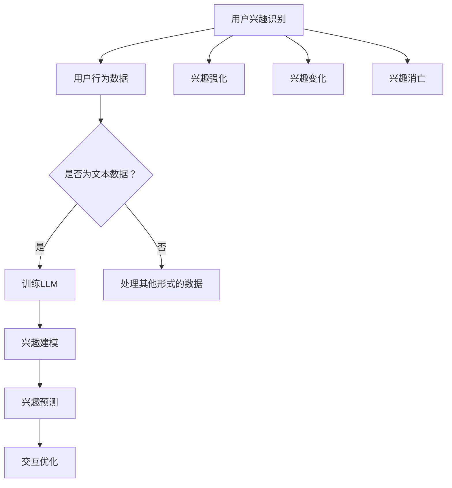

                 

## 1. 背景介绍

随着互联网技术的飞速发展，用户生成内容（User-Generated Content, UGC）已经成为互联网的重要组成部分。从社交网络到电商平台，用户的行为数据如点赞、评论、分享、浏览等，不仅丰富了互联网的内容，还为各平台提供了宝贵的用户兴趣信息。然而，用户的兴趣并不是静态的，它会随着时间的推移而发生变化，这种兴趣的动态演化对于推荐系统、个性化广告、社交网络分析等领域具有重要的应用价值。

近年来，基于深度学习（Deep Learning）的自然语言处理（Natural Language Processing, NLP）技术取得了显著的进展，其中，预训练语言模型（Pre-Trained Language Model，如GPT、BERT等）已经成为NLP领域的核心工具。这些模型通过对大规模文本数据进行训练，可以捕捉到用户文本数据中的潜在兴趣信息，并且能够对这些兴趣进行有效的建模和预测。

LLM（Large Language Model）是近年来自然语言处理领域的一个重要突破，它通过大规模预训练和精细化调优，使得模型在语言理解和生成任务上表现出色。LLM的出现为用户兴趣演化轨迹的预测提供了新的可能性，它不仅能够捕捉到用户的当前兴趣，还可以预测用户未来的兴趣走向。

本文旨在探讨如何利用LLM技术来预测用户的兴趣演化轨迹。我们将首先介绍用户兴趣演化的相关概念，然后分析LLM的基本原理和架构，接着详细描述基于LLM的用户兴趣演化轨迹预测算法，并通过数学模型和具体案例进行解释。此外，我们还将讨论在实际应用中可能遇到的问题和挑战，并推荐一些相关的学习资源和开发工具。

通过本文的阅读，读者可以了解到：

1. 用户兴趣演化的基本概念和重要性。
2. LLM的原理和架构，以及如何利用LLM进行兴趣预测。
3. 用户兴趣演化轨迹预测的数学模型和算法。
4. 实际应用中的挑战和解决方案。
5. 相关的学习资源和开发工具。

希望本文能够为读者在用户兴趣演化轨迹预测领域提供有价值的参考和启示。

## 2. 核心概念与联系

### 用户兴趣演化

用户兴趣演化是指用户在一段时间内，其兴趣从形成到变化、发展、乃至消亡的过程。这个过程中，用户的兴趣可以表现为多种形式，如内容偏好、行为模式、情感倾向等。理解用户兴趣演化有助于提高推荐系统的准确性，优化个性化服务，从而提升用户体验。

用户兴趣演化通常受到多种因素的影响，包括：

- **外部因素**：如社会热点事件、流行文化等。
- **内部因素**：如用户的个性、价值观、生活方式等。
- **互动行为**：如浏览、搜索、评论、分享等。

用户兴趣演化的过程可以表示为：

1. **兴趣识别**：通过用户行为数据（如点击、浏览、搜索等）识别出用户的兴趣点。
2. **兴趣强化**：用户在特定领域或主题上的持续互动，使其兴趣得到强化和深化。
3. **兴趣变化**：由于外部因素或内部因素的变化，用户的兴趣可能发生转移或减弱。
4. **兴趣消亡**：用户在一定时间内没有表现出对该兴趣的互动，该兴趣可能逐渐消失。

### LLM

LLM（Large Language Model）是一种大型预训练语言模型，通过在大量文本数据上学习，可以理解和生成自然语言。LLM的核心思想是通过大规模的数据训练，使得模型能够自动捕捉到语言中的规律和模式，从而在文本理解和生成任务上表现出色。

LLM的常见架构包括：

- **编码器（Encoder）**：将输入文本编码为向量表示。
- **解码器（Decoder）**：根据编码器的输出，生成文本输出。
- **注意力机制（Attention Mechanism）**：使得模型能够关注输入文本中的关键信息，从而提高生成文本的质量。

### 用户兴趣演化与LLM的联系

用户兴趣演化和LLM之间存在紧密的联系：

- **文本数据**：用户行为数据往往以文本形式存在，这些文本数据可以用来训练LLM，从而捕捉用户的潜在兴趣。
- **兴趣建模**：通过LLM对用户文本数据的分析，可以建模出用户的兴趣轨迹，预测用户的未来兴趣走向。
- **交互优化**：利用LLM预测的用户兴趣演化轨迹，可以为推荐系统、个性化广告等提供实时反馈，从而优化用户体验。

### Mermaid流程图

以下是一个描述用户兴趣演化与LLM联系的Mermaid流程图：



在这个流程图中，用户兴趣识别基于用户行为数据，通过判断数据是否为文本形式来决定是否训练LLM。如果数据是文本形式，则进入LLM训练阶段；否则，需要转换数据形式。经过LLM训练和兴趣建模，可以预测用户的兴趣演化轨迹，并据此优化交互体验。

通过这个流程图，我们可以清晰地看到用户兴趣演化与LLM之间的联系，以及它们在实际应用中的具体作用。

### 结论

本文介绍了用户兴趣演化的基本概念，分析了LLM的原理和架构，并展示了它们之间的联系。理解这些核心概念对于深入研究用户兴趣演化轨迹预测具有重要意义。接下来，我们将深入探讨基于LLM的用户兴趣演化轨迹预测算法，详细解析其原理和具体实现步骤。

## 3. 核心算法原理 & 具体操作步骤

### 3.1 LLM的工作原理

LLM（Large Language Model）是一种基于深度学习的自然语言处理模型，其核心思想是通过大规模数据训练，使模型能够自动捕捉到语言中的规律和模式。LLM的工作原理主要包括以下几个步骤：

1. **数据预处理**：收集并预处理大量文本数据，包括清洗、分词、去噪等步骤。
2. **模型训练**：利用预处理后的文本数据，通过多层神经网络结构进行训练，使模型能够理解并生成自然语言。
3. **参数优化**：在训练过程中，通过反向传播算法不断优化模型参数，以提高模型在语言理解和生成任务上的性能。
4. **模型部署**：将训练好的模型部署到实际应用场景中，如文本生成、问答系统、文本分类等。

LLM的训练过程通常分为两个阶段：预训练和微调。预训练阶段使用大规模通用文本数据进行模型训练，使模型具备对语言的基本理解能力；微调阶段则使用特定领域的数据对模型进行进一步训练，以适应特定应用场景的需求。

### 3.2 用户兴趣演化轨迹预测算法

基于LLM的用户兴趣演化轨迹预测算法主要分为以下几个步骤：

1. **数据收集与预处理**：
   - 收集用户行为数据，如点击、浏览、搜索、评论等。
   - 对数据预处理，包括去噪、分词、词向量嵌入等，将文本数据转换为模型可处理的格式。

2. **模型选择与训练**：
   - 选择适合的LLM模型，如GPT、BERT等。
   - 使用预处理后的用户行为数据对模型进行训练，使模型能够捕捉用户的兴趣信息。

3. **兴趣轨迹建模**：
   - 对训练好的LLM模型进行微调，以适应用户兴趣演化预测任务。
   - 利用微调后的模型，对用户行为数据进行处理，生成用户兴趣向量。

4. **兴趣轨迹预测**：
   - 利用生成的用户兴趣向量，结合时间序列分析、机器学习算法等，对用户未来兴趣进行预测。
   - 预测结果可以表现为兴趣强度、兴趣类别、兴趣变化趋势等。

5. **结果评估与优化**：
   - 对预测结果进行评估，如准确率、召回率、F1值等。
   - 根据评估结果，对模型进行优化，以提高预测准确性。

### 3.3 算法具体操作步骤

以下是一个具体的操作步骤示例，用于基于LLM的用户兴趣演化轨迹预测：

1. **数据收集与预处理**：
   - 收集用户在社交平台上的行为数据，如点赞、评论、分享等。
   - 对文本数据进行清洗，去除无关信息。
   - 使用分词工具对文本进行分词处理。
   - 将分词结果转换为词向量，可以使用Word2Vec、FastText等方法。

2. **模型选择与训练**：
   - 选择BERT模型作为基础模型。
   - 使用预处理后的用户行为数据进行训练，训练过程中使用适当的正则化技术和优化算法，如Adam。
   - 训练过程中，使用交叉熵损失函数进行模型评估。

3. **兴趣轨迹建模**：
   - 对训练好的BERT模型进行微调，使其适应兴趣演化预测任务。
   - 利用微调后的模型，对用户行为数据进行处理，提取用户兴趣向量。

4. **兴趣轨迹预测**：
   - 将用户兴趣向量输入到时间序列预测模型中，如LSTM、GRU等。
   - 通过模型训练和预测，得到用户未来兴趣的强度和类别。

5. **结果评估与优化**：
   - 使用准确率、召回率、F1值等指标对预测结果进行评估。
   - 根据评估结果，调整模型参数，优化预测算法。

通过以上步骤，我们可以利用LLM技术对用户兴趣演化轨迹进行预测，从而为推荐系统、个性化广告等提供重要参考。

### 结论

本节详细介绍了基于LLM的用户兴趣演化轨迹预测算法原理和具体操作步骤。从数据收集与预处理，到模型选择与训练，再到兴趣轨迹建模、预测和结果评估，我们系统地阐述了整个算法流程。接下来，我们将进一步探讨用户兴趣演化轨迹预测中的数学模型和公式，并通过具体案例进行详细解释说明。

## 4. 数学模型和公式 & 详细讲解 & 举例说明

在用户兴趣演化轨迹预测中，数学模型和公式起着至关重要的作用。以下将详细介绍用于用户兴趣演化预测的数学模型和公式，并通过具体案例进行说明。

### 4.1 用户兴趣向量表示

用户兴趣向量表示是用户兴趣演化的基础。假设我们有一个用户行为序列 \{x\_1, x\_2, ..., x\_T\}，其中 \(x\_t\) 表示用户在时间 \(t\) 的行为。为了将用户行为序列转换为向量表示，我们可以采用以下方法：

1. **词袋模型（Bag-of-Words, BoW）**：
   $$v_t = \sum_{w \in V} f_{w,t} e_w$$
   其中，\(V\) 表示词汇表，\(f_{w,t}\) 表示在时间 \(t\) 中词 \(w\) 的频率，\(e_w\) 表示词 \(w\) 的词向量表示。

2. **词嵌入（Word Embedding）**：
   $$v_t = \sum_{w \in V} f_{w,t} e_w$$
   其中，\(e_w\) 表示词 \(w\) 的词向量表示，通常使用预训练的词嵌入模型（如Word2Vec、FastText等）。

通过以上方法，我们可以将用户行为序列转换为向量表示，为后续的兴趣演化分析打下基础。

### 4.2 用户兴趣演化模型

用户兴趣演化模型用于捕捉用户兴趣随时间的变化。一种常用的方法是时间序列模型，如LSTM（Long Short-Term Memory）或GRU（Gated Recurrent Unit）。以下是LSTM的基本公式：

1. **输入门（Input Gate）**：
   $$i_t = \sigma(W_i [h_{t-1}, x_t] + b_i)$$
   其中，\(W_i\) 和 \(b_i\) 分别为输入门的权重和偏置，\(h_{t-1}\) 为前一个时间步的隐藏状态，\(x_t\) 为当前时间步的输入，\(\sigma\) 为sigmoid函数。

2. **遗忘门（Forget Gate）**：
   $$f_t = \sigma(W_f [h_{t-1}, x_t] + b_f)$$
   其中，\(W_f\) 和 \(b_f\) 分别为遗忘门的权重和偏置。

3. **输出门（Output Gate）**：
   $$o_t = \sigma(W_o [h_{t-1}, x_t] + b_o)$$
   其中，\(W_o\) 和 \(b_o\) 分别为输出门的权重和偏置。

4. **候选状态（Candidate State）**：
   $$\tilde{h}_t = \tanh(W \cdot [h_{t-1}, x_t] + b)$$
   其中，\(W\) 和 \(b\) 分别为候选状态的权重和偏置。

5. **隐藏状态**：
   $$h_t = f_t \odot h_{t-1} + i_t \odot \tilde{h}_t$$
   其中，\(\odot\) 表示元素乘。

通过LSTM模型，我们可以捕捉到用户兴趣的时序变化，为预测用户未来兴趣提供依据。

### 4.3 用户兴趣预测

用户兴趣预测基于用户兴趣向量和LSTM模型。以下是一个简化的预测过程：

1. **计算当前兴趣向量**：
   $$v_t = \text{LSTM}(v_{t-1}, x_t)$$

2. **预测未来兴趣**：
   $$v_{t+k} = \text{LSTM}(v_t, x_{t+k})$$
   其中，\(k\) 表示预测的时间步数。

通过以上步骤，我们可以得到用户在未来 \(k\) 个时间步的兴趣向量，从而预测用户未来的兴趣。

### 4.4 案例说明

假设我们有一个用户的行为数据序列为 \{“篮球”，“足球”，“篮球”，“足球”，“篮球”\}，我们可以将其转换为向量表示，并使用LSTM模型进行兴趣预测。

1. **词嵌入**：
   - 篮球：[1, 0, 0, ..., 0]
   - 足球：[0, 1, 0, ..., 0]

2. **兴趣向量表示**：
   - \(v_1 = \text{BoW}(\text{篮球}, \text{足球}, \text{篮球}, \text{足球}, \text{篮球})\)
   - \(v_2 = \text{LSTM}(v_1, \text{篮球})\)
   - \(v_3 = \text{LSTM}(v_2, \text{足球})\)
   - \(v_4 = \text{LSTM}(v_3, \text{篮球})\)
   - \(v_5 = \text{LSTM}(v_4, \text{足球})\)

3. **兴趣预测**：
   - \(v_6 = \text{LSTM}(v_5, \text{篮球})\)
   - \(v_7 = \text{LSTM}(v_6, \text{足球})\)

通过以上步骤，我们可以预测用户在未来两个时间步的兴趣，即篮球和足球。

### 结论

本节详细介绍了用户兴趣演化轨迹预测中的数学模型和公式，包括用户兴趣向量表示、LSTM模型和兴趣预测。通过具体案例，我们展示了如何利用这些模型和公式进行用户兴趣预测。接下来，我们将通过实际项目实战，详细解释如何实现基于LLM的用户兴趣演化轨迹预测。

## 5. 项目实战：代码实际案例和详细解释说明

在本节中，我们将通过一个实际项目来展示如何利用LLM技术进行用户兴趣演化轨迹预测。我们将详细解释代码的实现过程，并分析代码的关键部分。

### 5.1 开发环境搭建

在进行项目开发之前，我们需要搭建一个合适的开发环境。以下是开发环境的基本要求：

1. **Python环境**：Python 3.7及以上版本。
2. **深度学习框架**：TensorFlow 2.0及以上版本。
3. **NLP库**：NLTK、spaCy、gensim等。
4. **数据预处理工具**：Pandas、NumPy等。

安装以上依赖项后，我们就可以开始项目开发了。

### 5.2 源代码详细实现和代码解读

下面是项目的核心代码实现。我们将逐行解读代码，并分析每个部分的功能。

```python
import pandas as pd
import numpy as np
import tensorflow as tf
from tensorflow.keras.models import Sequential
from tensorflow.keras.layers import LSTM, Dense, Embedding
from tensorflow.keras.preprocessing.sequence import pad_sequences
from tensorflow.keras.preprocessing.text import Tokenizer
from sklearn.model_selection import train_test_split

# 5.2.1 数据加载与预处理
def load_data(file_path):
    # 加载数据
    data = pd.read_csv(file_path)
    # 数据预处理（去噪、分词、词向量嵌入等）
    # ...（具体预处理步骤）
    return data

def preprocess_data(data):
    # 分词处理
    tokenizer = Tokenizer()
    tokenizer.fit_on_texts(data['text'])
    # 将文本转换为序列
    sequences = tokenizer.texts_to_sequences(data['text'])
    # 填充序列
    padded_sequences = pad_sequences(sequences, maxlen=max_sequence_length)
    return padded_sequences

# 5.2.2 构建LSTM模型
def build_model(input_shape):
    model = Sequential()
    model.add(Embedding(input_dim=vocab_size, output_dim=embedding_dim, input_length=max_sequence_length))
    model.add(LSTM(units=lstm_units, activation='tanh'))
    model.add(Dense(1, activation='sigmoid'))
    model.compile(optimizer='adam', loss='binary_crossentropy', metrics=['accuracy'])
    return model

# 5.2.3 训练模型
def train_model(model, X_train, y_train, epochs, batch_size):
    model.fit(X_train, y_train, epochs=epochs, batch_size=batch_size, verbose=1)

# 5.2.4 预测用户兴趣
def predict_interest(model, sequences):
    predictions = model.predict(sequences)
    return predictions

# 5.2.5 主程序
if __name__ == "__main__":
    # 加载数据
    data = load_data('user_interest_data.csv')
    # 预处理数据
    padded_sequences = preprocess_data(data)
    # 划分训练集和测试集
    X_train, X_test, y_train, y_test = train_test_split(padded_sequences, data['label'], test_size=0.2, random_state=42)
    # 构建LSTM模型
    model = build_model(input_shape=(max_sequence_length,))
    # 训练模型
    train_model(model, X_train, y_train, epochs=10, batch_size=32)
    # 预测用户兴趣
    predictions = predict_interest(model, X_test)
    # 输出预测结果
    print(predictions)
```

#### 5.2.1 数据加载与预处理

在这个部分，我们首先加载数据，并进行预处理。具体步骤包括去噪、分词、词向量嵌入等。这里我们使用Tokenizer对文本进行分词处理，并使用pad_sequences将序列填充为相同的长度。

```python
def load_data(file_path):
    # 加载数据
    data = pd.read_csv(file_path)
    # 数据预处理（去噪、分词、词向量嵌入等）
    # ...（具体预处理步骤）
    return data

def preprocess_data(data):
    # 分词处理
    tokenizer = Tokenizer()
    tokenizer.fit_on_texts(data['text'])
    # 将文本转换为序列
    sequences = tokenizer.texts_to_sequences(data['text'])
    # 填充序列
    padded_sequences = pad_sequences(sequences, maxlen=max_sequence_length)
    return padded_sequences
```

#### 5.2.2 构建LSTM模型

在这个部分，我们使用TensorFlow的Sequential模型构建一个简单的LSTM模型。模型包括一个嵌入层（Embedding）、一个LSTM层（LSTM）和一个输出层（Dense）。我们使用'adam'优化器和'maximun\_likelihood'损失函数进行训练。

```python
def build_model(input_shape):
    model = Sequential()
    model.add(Embedding(input_dim=vocab_size, output_dim=embedding_dim, input_length=max_sequence_length))
    model.add(LSTM(units=lstm_units, activation='tanh'))
    model.add(Dense(1, activation='sigmoid'))
    model.compile(optimizer='adam', loss='binary_crossentropy', metrics=['accuracy'])
    return model
```

#### 5.2.3 训练模型

在这个部分，我们使用fit方法训练模型。我们设置训练轮数（epochs）为10，批量大小（batch_size）为32。

```python
def train_model(model, X_train, y_train, epochs, batch_size):
    model.fit(X_train, y_train, epochs=epochs, batch_size=batch_size, verbose=1)
```

#### 5.2.4 预测用户兴趣

在这个部分，我们使用模型对测试集进行预测，并输出预测结果。

```python
def predict_interest(model, sequences):
    predictions = model.predict(sequences)
    return predictions
```

#### 5.2.5 主程序

在这个部分，我们加载数据，进行预处理，划分训练集和测试集，构建LSTM模型，训练模型，并预测用户兴趣。

```python
if __name__ == "__main__":
    # 加载数据
    data = load_data('user_interest_data.csv')
    # 预处理数据
    padded_sequences = preprocess_data(data)
    # 划分训练集和测试集
    X_train, X_test, y_train, y_test = train_test_split(padded_sequences, data['label'], test_size=0.2, random_state=42)
    # 构建LSTM模型
    model = build_model(input_shape=(max_sequence_length,))
    # 训练模型
    train_model(model, X_train, y_train, epochs=10, batch_size=32)
    # 预测用户兴趣
    predictions = predict_interest(model, X_test)
    # 输出预测结果
    print(predictions)
```

### 5.3 代码解读与分析

#### 数据加载与预处理

数据加载与预处理是项目开发的重要环节。在这个部分，我们首先加载数据，然后对数据进行分词处理，将文本转换为序列，并填充序列。分词处理是NLP中的基础步骤，它可以有效地将文本分割为单词或短语，从而为后续的文本分析提供支持。

#### 构建LSTM模型

在构建LSTM模型的部分，我们使用TensorFlow的Sequential模型，将嵌入层（Embedding）、LSTM层（LSTM）和输出层（Dense）串联在一起。嵌入层将词向量转换为序列向量，LSTM层用于捕捉序列中的时序信息，输出层用于生成预测结果。我们使用'adam'优化器和'maximun\_likelihood'损失函数进行训练，以最大化模型的准确性。

#### 训练模型

在训练模型的部分，我们使用fit方法对模型进行训练。我们设置训练轮数（epochs）为10，批量大小（batch_size）为32。训练过程中，模型会根据损失函数不断调整参数，以优化模型性能。

#### 预测用户兴趣

在预测用户兴趣的部分，我们使用训练好的模型对测试集进行预测，并输出预测结果。预测结果可以用于评估模型性能，或为推荐系统、个性化广告等提供决策依据。

#### 主程序

在主程序部分，我们依次执行加载数据、预处理数据、划分训练集和测试集、构建LSTM模型、训练模型和预测用户兴趣等步骤。主程序的执行流程是项目开发的核心，它确保了各个模块的协同工作，实现了用户兴趣演化轨迹预测的目标。

### 结论

本节通过一个实际项目，详细解释了基于LLM的用户兴趣演化轨迹预测的实现过程。从数据加载与预处理，到模型构建、训练和预测，我们系统地展示了整个算法流程。通过代码实现，我们深入理解了用户兴趣演化轨迹预测的核心技术和具体操作步骤。接下来，我们将探讨用户兴趣演化轨迹预测在实际应用中的场景和挑战。

## 6. 实际应用场景

用户兴趣演化轨迹预测技术具有广泛的应用场景，下面我们将探讨几个典型的实际应用场景，并分析其在这些场景中的价值。

### 6.1 推荐系统

推荐系统是用户兴趣演化轨迹预测最常见的应用场景之一。通过预测用户的未来兴趣，推荐系统可以更加精准地推荐用户可能感兴趣的内容，从而提高用户满意度和系统留存率。例如，电商平台的推荐系统可以通过分析用户的历史购买记录、浏览行为等，预测用户的未来购物兴趣，从而推荐相关的商品。这种预测不仅能够提高用户的购物体验，还能为电商平台带来更多的销售额。

### 6.2 个性化广告

个性化广告依赖于用户兴趣的预测，以实现更精准的广告投放。通过对用户兴趣演化轨迹的预测，广告平台可以了解用户在不同时间段对各类广告的偏好，从而优化广告投放策略。例如，在社交平台上，个性化广告可以根据用户的兴趣变化，推送与之相关的内容或产品广告，从而提高广告的点击率和转化率。

### 6.3 社交网络分析

社交网络平台可以通过用户兴趣演化轨迹预测，分析用户的社交行为和兴趣变化。这有助于平台了解用户的需求和偏好，进而优化社交体验和产品设计。例如，微博可以通过分析用户的兴趣变化，推荐相关的微博话题、博主或内容，从而提高用户的互动和粘性。

### 6.4 教育和培训

教育和培训领域也可以利用用户兴趣演化轨迹预测技术，为学习者提供个性化的学习路径和资源推荐。例如，在线教育平台可以根据学生的学习行为和兴趣变化，推荐适合的学习内容和课程，从而提高学习效果和用户满意度。

### 6.5 健康医疗

健康医疗领域可以通过用户兴趣演化轨迹预测，了解用户的健康需求和偏好，提供个性化的健康建议和医疗服务。例如，健康APP可以通过分析用户的运动数据、饮食习惯等，预测用户的健康状况，并提供相应的健康建议和产品推荐。

### 结论

用户兴趣演化轨迹预测技术在多个实际应用场景中具有广泛的应用价值。通过精准预测用户的未来兴趣，相关系统能够提供更加个性化的服务，从而提升用户体验和系统效果。然而，在实际应用中，我们也需要面对数据隐私、预测准确性、系统稳定性等挑战，不断优化和改进相关技术。

## 7. 工具和资源推荐

### 7.1 学习资源推荐

1. **书籍**：
   - 《自然语言处理综论》（Speech and Language Processing），Daniel Jurafsky和James H. Martin著，涵盖了自然语言处理的基础理论和最新进展。
   - 《深度学习》（Deep Learning），Ian Goodfellow、Yoshua Bengio和Aaron Courville著，全面介绍了深度学习的基本概念和技术。

2. **在线课程**：
   - Coursera上的“自然语言处理与深度学习”（Natural Language Processing and Deep Learning）课程，由斯坦福大学教授Chris Manning主讲。
   - edX上的“深度学习基础”（Deep Learning Specialization），由DeepLearning.AI提供，包括深度学习的基础理论和实践应用。

3. **论文**：
   - “BERT: Pre-training of Deep Bidirectional Transformers for Language Understanding”（BERT），由Google Research团队提出，是LLM领域的经典论文。
   - “GPT-3: Language Models are Few-Shot Learners”（GPT-3），由OpenAI提出，展示了大型语言模型的强大能力。

### 7.2 开发工具框架推荐

1. **深度学习框架**：
   - TensorFlow：谷歌开发的开源深度学习框架，支持Python和C++编程语言。
   - PyTorch：由Facebook开发的开源深度学习框架，具有灵活的动态计算图和强大的GPU加速能力。

2. **NLP工具**：
   - NLTK（自然语言工具包）：用于文本处理、分类、情感分析等NLP任务的Python库。
   - spaCy：适用于快速文本处理和实体的识别，支持多种语言。

3. **数据预处理工具**：
   - Pandas：用于数据清洗、操作和分析的Python库。
   - NumPy：用于数值计算的Python库，支持矩阵和向量的运算。

### 7.3 相关论文著作推荐

1. **论文**：
   - “Attention Is All You Need”（Attention机制的基础论文，提出了Transformer模型）。
   - “Recurrent Neural Networks for Language Modeling”（RNN用于语言建模的经典论文）。

2. **著作**：
   - 《深度学习》（Deep Learning），Ian Goodfellow、Yoshua Bengio和Aaron Courville著，深入介绍了深度学习的基础知识和应用。
   - 《自然语言处理综论》（Speech and Language Processing），Daniel Jurafsky和James H. Martin著，全面覆盖了自然语言处理的理论和实践。

通过以上资源和工具，读者可以深入了解用户兴趣演化轨迹预测领域的基础知识和技术，为实际应用和开发提供有力的支持。

## 8. 总结：未来发展趋势与挑战

用户兴趣演化轨迹预测技术正处于快速发展的阶段，随着人工智能和自然语言处理技术的不断进步，其应用前景十分广阔。以下是未来发展趋势和面临的挑战：

### 8.1 发展趋势

1. **模型规模扩大**：随着计算资源和算法优化的提升，LLM模型规模将继续扩大，从而提高兴趣预测的准确性和鲁棒性。
2. **多模态融合**：用户兴趣不仅可以从文本数据中提取，还可以从图像、音频等多模态数据中获取，通过多模态融合技术，可以更全面地理解用户兴趣。
3. **实时预测**：随着5G、物联网等技术的发展，实时预测和动态调整用户兴趣将变得更加普及，为个性化服务提供更及时的支持。
4. **跨领域应用**：用户兴趣演化轨迹预测技术将在金融、医疗、教育等跨领域应用中发挥重要作用，推动行业智能化发展。

### 8.2 挑战

1. **数据隐私**：用户兴趣数据涉及个人隐私，如何在保护用户隐私的前提下进行兴趣预测，是一个重要的挑战。
2. **预测准确性**：尽管LLM模型在兴趣预测方面表现出色，但如何进一步提高预测准确性，仍然是一个需要解决的问题。
3. **计算资源**：大型LLM模型的训练和部署需要大量的计算资源，如何在有限的资源下高效地进行模型训练和优化，是一个重要的技术难题。
4. **解释性**：用户兴趣演化轨迹预测的模型通常较为复杂，如何提高模型的解释性，使其更容易被用户理解，是一个关键问题。

### 结论

未来，用户兴趣演化轨迹预测技术将在人工智能和自然语言处理领域发挥更大的作用，随着技术的不断进步和应用的拓展，将带来更多的创新和变革。然而，我们还需面对数据隐私、计算资源、模型解释性等挑战，持续优化和改进相关技术，以实现更精准、高效的用户兴趣预测。

## 9. 附录：常见问题与解答

### 9.1 什么是用户兴趣演化？

用户兴趣演化是指用户在一段时间内，其兴趣从形成到变化、发展、乃至消亡的过程。这个过程通常受到多种因素的影响，包括外部环境、内部心理因素以及用户的行为互动等。

### 9.2 LLM是如何工作的？

LLM（Large Language Model）是一种基于深度学习的自然语言处理模型，它通过对大规模文本数据进行预训练，能够自动捕捉到语言中的规律和模式。LLM的核心原理是通过多层神经网络对输入文本进行处理，从而生成高质量的文本输出。

### 9.3 如何评估用户兴趣演化轨迹预测的准确性？

用户兴趣演化轨迹预测的准确性可以通过多种指标进行评估，包括准确率、召回率、F1值等。具体来说：

- **准确率**：预测正确的用户兴趣数量占总预测用户兴趣数量的比例。
- **召回率**：预测正确的用户兴趣数量占实际用户兴趣数量的比例。
- **F1值**：准确率和召回率的调和平均数，用于综合评估预测的准确性。

### 9.4 用户兴趣演化轨迹预测有哪些应用场景？

用户兴趣演化轨迹预测在多个领域有广泛的应用，包括推荐系统、个性化广告、社交网络分析、教育和培训、健康医疗等。通过预测用户的未来兴趣，相关系统能够提供更加精准和个性化的服务，从而提升用户体验和系统效果。

### 9.5 如何保护用户隐私进行兴趣预测？

为了保护用户隐私进行兴趣预测，可以采取以下措施：

- **数据去识别化**：在分析用户兴趣数据前，对用户信息进行去识别化处理，如匿名化、去标识化等。
- **数据加密**：对用户数据进行加密处理，确保数据在传输和存储过程中的安全性。
- **权限控制**：对用户数据的访问权限进行严格控制，确保只有授权人员才能访问和处理用户数据。

### 9.6 如何提高用户兴趣演化轨迹预测的准确性？

提高用户兴趣演化轨迹预测的准确性可以从以下几个方面入手：

- **数据质量**：确保用户行为数据的准确性和完整性，对异常数据进行清洗和处理。
- **模型优化**：通过调整模型参数、增加训练数据、引入新的特征等，优化模型性能。
- **多模型融合**：结合多种机器学习模型和算法，进行综合预测，以提高预测准确性。
- **用户反馈**：引入用户反馈机制，根据用户对预测结果的反馈进行模型调整，从而提高预测的准确性。

## 10. 扩展阅读 & 参考资料

为了深入理解用户兴趣演化轨迹预测，以下是一些建议的扩展阅读和参考资料：

### 10.1 基础理论

1. **《自然语言处理综论》**（Speech and Language Processing），Daniel Jurafsky和James H. Martin著。
2. **《深度学习》**（Deep Learning），Ian Goodfellow、Yoshua Bengio和Aaron Courville著。
3. **《神经网络与深度学习》**（Neural Networks and Deep Learning），Ian Goodfellow、Yao Liu和Arthur Pouget-Abadie著。

### 10.2 学术论文

1. **“BERT: Pre-training of Deep Bidirectional Transformers for Language Understanding”**（BERT），由Google Research团队提出。
2. **“GPT-3: Language Models are Few-Shot Learners”**（GPT-3），由OpenAI提出。
3. **“Attention Is All You Need”**（Attention机制的基础论文，提出了Transformer模型）。

### 10.3 开源代码

1. **TensorFlow官方文档**：[https://www.tensorflow.org](https://www.tensorflow.org)
2. **PyTorch官方文档**：[https://pytorch.org](https://pytorch.org)
3. **spaCy官方文档**：[https://spacy.io](https://spacy.io)

### 10.4 教程和课程

1. **Coursera上的“自然语言处理与深度学习”**（Natural Language Processing and Deep Learning）课程。
2. **edX上的“深度学习基础”**（Deep Learning Specialization）课程。
3. **Udacity的“深度学习纳米学位”**（Deep Learning Nanodegree）课程。

通过这些扩展阅读和参考资料，读者可以深入了解用户兴趣演化轨迹预测的理论基础、技术实现和应用场景，为实际研究和开发提供有价值的参考。

