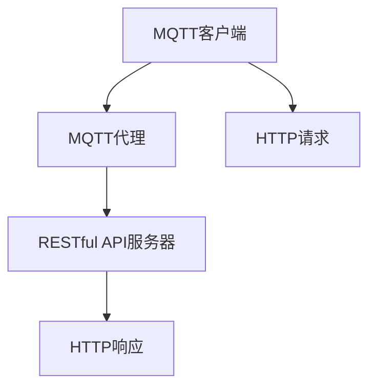

                 

# 基于MQTT协议和RESTful API的智能家居设备互操作性研究

## 关键词

- MQTT协议
- RESTful API
- 智能家居设备
- 互操作性
- 设备通信
- 数据交换
- 网络协议

## 摘要

本文将探讨基于MQTT协议和RESTful API的智能家居设备互操作性的实现方法。首先，我们将介绍MQTT协议和RESTful API的基本概念和原理，并分析它们在智能家居设备互操作性中的作用。接着，我们将详细讨论MQTT协议和RESTful API在智能家居设备通信和数据交换中的具体应用场景。最后，我们将通过一个实际的项目案例，展示如何使用MQTT协议和RESTful API实现智能家居设备的互操作性，并提供相关的开发工具和资源推荐，以及未来的发展趋势和挑战。

## 1. 背景介绍

### 智能家居设备的发展背景

随着物联网（IoT）技术的飞速发展，智能家居设备已经成为现代家庭的重要组成部分。从最初的遥控器到智能手机APP控制，再到如今的智能音响、智能门锁、智能照明等设备，智能家居设备正逐渐改变人们的日常生活。智能家居设备的发展不仅提高了人们的生活品质，还带来了诸多便利。然而，随之而来的问题是如何实现这些设备的互操作性，使得它们能够协同工作，提供更好的用户体验。

### 设备互操作性的重要性

设备互操作性是指不同设备之间能够相互识别、通信和协同工作。在智能家居领域，设备互操作性至关重要。以下是一些原因：

- **提高用户体验**：通过实现设备互操作性，用户可以更方便地控制和管理家庭中的各种设备，无需在多个设备间切换操作。
- **设备协同工作**：设备互操作性使得智能家居系统能够协同工作，实现智能场景和自动化功能，提升家庭生活的智能化水平。
- **降低开发和维护成本**：通过实现设备互操作性，可以减少开发和维护多个独立系统的成本，提高开发效率。

### 当前设备互操作性面临的挑战

尽管设备互操作性对于智能家居领域至关重要，但在实际应用中仍面临以下挑战：

- **协议兼容性问题**：不同的智能家居设备可能采用不同的通信协议，导致无法实现互操作性。
- **安全性和隐私保护**：智能家居设备涉及用户的个人隐私，如何确保数据传输的安全性成为一大挑战。
- **设备性能和功耗**：智能家居设备通常需要长时间运行，如何保证设备的性能和功耗成为关键问题。

为了解决这些问题，本文将介绍基于MQTT协议和RESTful API的智能家居设备互操作性的实现方法。

## 2. 核心概念与联系

### MQTT协议

MQTT（Message Queuing Telemetry Transport）是一种轻量级的消息队列协议，专门为远程传感和控制设备设计。它具有以下特点：

- **低带宽占用**：MQTT协议采用发布/订阅模式，客户端（设备）可以发布消息到特定的主题，服务器（代理）将消息分发到订阅该主题的客户端。
- **可扩展性**：MQTT协议支持多个客户端同时连接到代理，适合大规模物联网应用。
- **可靠性**：MQTT协议提供消息确认机制，确保消息的可靠传输。
- **安全性**：MQTT协议支持多种安全机制，如TLS/SSL加密，保障数据传输的安全性。

### RESTful API

RESTful API（Representational State Transfer Application Programming Interface）是一种基于HTTP协议的接口设计风格，用于实现不同系统之间的数据交换和功能调用。它具有以下特点：

- **无状态性**：RESTful API采用无状态设计，每次请求都是独立的，服务器不会保存客户端的任何状态信息。
- **统一的接口设计**：RESTful API使用统一的接口设计，包括GET、POST、PUT、DELETE等HTTP方法，方便客户端调用。
- **可扩展性**：RESTful API支持自定义URL和请求参数，方便扩展接口功能。
- **跨平台性**：RESTful API基于HTTP协议，可以在不同平台和语言之间无缝使用。

### MQTT协议与RESTful API的联系

MQTT协议和RESTful API都是实现设备互操作性的重要手段。MQTT协议负责设备之间的实时通信和数据交换，而RESTful API则负责设备与应用程序之间的交互和数据共享。

- **MQTT协议的优势**：MQTT协议适用于实时性要求较高的场景，如温度传感器的实时数据采集和报警通知。它具有低带宽占用、高可靠性和可扩展性的特点，非常适合智能家居设备之间的通信。
- **RESTful API的优势**：RESTful API适用于需要复杂数据处理和功能调用的场景，如用户通过智能手机APP控制智能家居设备。它具有无状态性、统一接口设计和跨平台性的特点，非常适合设备与应用程序之间的交互。

通过结合MQTT协议和RESTful API，可以实现智能家居设备的互操作性，满足不同场景下的需求。接下来，我们将详细介绍MQTT协议和RESTful API在智能家居设备通信和数据交换中的具体应用。

### MQTT协议与RESTful API的Mermaid流程图



### Mermaid流程节点说明

- **A[MQTT客户端]**：表示智能家居设备作为MQTT客户端，连接到MQTT代理，发布和订阅消息。
- **B[MQTT代理]**：表示MQTT代理作为消息中间件，转发MQTT消息，连接到RESTful API服务器。
- **C[RESTful API服务器]**：表示RESTful API服务器作为智能家居设备与应用程序之间的接口，处理HTTP请求和响应。
- **D[HTTP请求]**：表示智能家居设备通过MQTT客户端向RESTful API服务器发送HTTP请求。
- **E[HTTP响应]**：表示RESTful API服务器向智能家居设备返回HTTP响应。

## 3. 核心算法原理 & 具体操作步骤

### MQTT协议的核心算法原理

MQTT协议的核心算法主要涉及发布/订阅（Publish/Subscribe，简称P/S）模式，该模式由以下几个关键步骤组成：

1. **连接（Connect）**：MQTT客户端与MQTT代理建立连接，并发送连接请求。连接请求包含客户端标识、会话信息和连接参数。
2. **订阅（Subscribe）**：MQTT客户端向MQTT代理发送订阅请求，指定要订阅的主题。MQTT代理根据订阅信息，为客户端建立订阅队列。
3. **发布（Publish）**：MQTT客户端向MQTT代理发布消息，指定消息的主题。MQTT代理根据订阅信息，将消息分发到订阅该主题的客户端。
4. **确认（Acknowledge）**：MQTT代理或客户端在接收到消息后，发送确认消息。确认消息确保消息的可靠传输。
5. **断开（Disconnect）**：MQTT客户端与MQTT代理断开连接，结束会话。

### MQTT协议的具体操作步骤

1. **连接**：首先，智能家居设备（MQTT客户端）通过网络连接到MQTT代理。连接过程包括以下几个步骤：

   - 设备发送连接请求（Connect Message），包含客户端标识、会话信息和连接参数。
   - MQTT代理接收连接请求，验证客户端身份和连接参数，并返回连接确认（Connect Ack Message）。

2. **订阅**：智能家居设备向MQTT代理发送订阅请求（Subscribe Message），指定要订阅的主题。例如，设备可以订阅温度传感器主题，以便接收温度传感器的实时数据。订阅过程包括以下几个步骤：

   - 设备发送订阅请求，包含主题名称、主题质量等级（QoS）等信息。
   - MQTT代理接收订阅请求，根据订阅信息，为设备建立订阅队列，并返回订阅确认（Subscribe Ack Message）。

3. **发布**：智能家居设备向MQTT代理发布消息（Publish Message），指定消息的主题。例如，设备可以将温度传感器的实时数据发布到温度传感器主题。发布过程包括以下几个步骤：

   - 设备发送发布请求，包含主题名称、消息内容和主题质量等级（QoS）等信息。
   - MQTT代理接收发布请求，根据订阅信息，将消息分发到订阅该主题的客户端。

4. **确认**：MQTT代理或客户端在接收到消息后，发送确认消息（Ack Message）。确认消息确保消息的可靠传输。确认过程包括以下几个步骤：

   - MQTT代理或客户端接收到消息后，发送确认消息。
   - 对方接收确认消息，并返回确认响应。

5. **断开**：智能家居设备与MQTT代理断开连接，结束会话。断开过程包括以下几个步骤：

   - 设备发送断开请求（Disconnect Message）。
   - MQTT代理接收断开请求，并返回断开确认（Disconnect Ack Message）。

### RESTful API的核心算法原理

RESTful API的核心算法主要涉及HTTP协议的请求和响应处理，该算法由以下几个关键步骤组成：

1. **请求（Request）**：客户端向服务器发送HTTP请求，包含请求方法、URL、请求头和请求体。
2. **处理（Handle）**：服务器接收请求，根据URL和请求方法，调用相应的处理函数，处理请求并生成响应。
3. **响应（Response）**：服务器向客户端返回HTTP响应，包含响应状态码、响应头和响应体。
4. **确认（Acknowledge）**：客户端接收响应，并处理响应结果。

### RESTful API的具体操作步骤

1. **请求**：智能家居设备通过MQTT客户端向RESTful API服务器发送HTTP请求。请求过程包括以下几个步骤：

   - 设备发送HTTP请求，包含请求方法（如GET、POST、PUT、DELETE）、URL、请求头和请求体。
   - RESTful API服务器接收HTTP请求，根据URL和请求方法，识别请求类型。

2. **处理**：RESTful API服务器根据请求类型，调用相应的处理函数，处理请求并生成响应。处理过程包括以下几个步骤：

   - 服务器调用处理函数，处理请求并生成响应。
   - 处理函数可能涉及数据库查询、业务逻辑处理等操作。

3. **响应**：RESTful API服务器向智能家居设备返回HTTP响应，包含响应状态码、响应头和响应体。响应过程包括以下几个步骤：

   - 服务器生成HTTP响应，包含响应状态码（如200、400、500等）、响应头和响应体。
   - 服务器将HTTP响应发送给客户端。

4. **确认**：智能家居设备接收HTTP响应，并处理响应结果。确认过程包括以下几个步骤：

   - 客户端接收HTTP响应。
   - 客户端根据响应结果，执行后续操作。

### MQTT协议与RESTful API的集成

为了实现智能家居设备的互操作性，可以将MQTT协议和RESTful API集成到同一系统中。具体操作步骤如下：

1. **集成MQTT代理**：将MQTT代理集成到RESTful API服务器中，以便在两者之间传递消息。
2. **订阅主题**：智能家居设备订阅与RESTful API服务器相关的主题，以便接收来自服务器的消息。
3. **发布消息**：智能家居设备将数据发布到与RESTful API服务器相关的主题，以便服务器处理数据。
4. **处理请求**：RESTful API服务器根据接收到的消息，调用相应的处理函数，处理请求并生成响应。
5. **返回响应**：RESTful API服务器将响应返回给智能家居设备，完成数据交换和功能调用。

通过MQTT协议和RESTful API的集成，可以实现智能家居设备的互操作性，满足不同场景下的需求。

## 4. 数学模型和公式 & 详细讲解 & 举例说明

### MQTT协议的数学模型

MQTT协议的数学模型主要涉及消息传输的确认机制和消息队列管理。以下是MQTT协议的数学模型和公式：

1. **确认机制**：

   - **消息确认（Ack）**：消息确认用于确保消息的可靠传输。每个消息包含一个消息ID，MQTT客户端在接收到消息后，返回一个确认消息，包含相同的消息ID。

     $$ Ack = Message\_ID $$

   - **重传机制**：如果MQTT客户端在规定的时间内未收到确认消息，将重新发送消息。重传机制用于提高消息传输的可靠性。

2. **消息队列管理**：

   - **订阅队列**：MQTT代理为每个订阅主题维护一个订阅队列，用于存储订阅该主题的客户端消息。
   - **发布队列**：MQTT代理为每个发布主题维护一个发布队列，用于存储发布到该主题的消息。

   $$ Queue = [Message_1, Message_2, ..., Message_n] $$

### MQTT协议的详细讲解和举例说明

#### 确认机制

假设智能家居设备A（MQTT客户端）连接到MQTT代理，并发布一个消息ID为100的消息到温度传感器主题。MQTT代理接收到消息后，返回一个消息ID为100的确认消息给设备A。

- **设备A**：

  ```python
  # 发布消息
  client.publish("temperature", payload="25°C", message_id=100)
  ```

- **MQTT代理**：

  ```python
  # 接收消息并返回确认消息
  client.publish("temperature\_ack", payload="100", message_id=100)
  ```

#### 消息队列管理

假设智能家居设备B（MQTT客户端）订阅了温度传感器主题，并发布了多个消息。

- **设备B**：

  ```python
  # 订阅主题
  client.subscribe("temperature", qos=0)

  # 发布消息
  client.publish("temperature", payload="26°C")
  client.publish("temperature", payload="24°C")
  ```

- **MQTT代理**：

  ```python
  # 订阅队列
  queue = ["26°C", "24°C"]

  # 发布队列
  publish_queue = ["26°C", "24°C"]

  # 发送订阅队列中的消息
  for message in queue:
      client.publish("temperature", payload=message)
  ```

### RESTful API的数学模型

RESTful API的数学模型主要涉及HTTP请求和响应的处理。以下是RESTful API的数学模型和公式：

1. **请求（Request）**：

   - **请求方法**：请求方法（如GET、POST、PUT、DELETE）用于指示服务器执行的操作。

     $$ Method = [GET, POST, PUT, DELETE] $$

   - **URL（统一资源定位符）**：URL用于指示请求的资源地址。

     $$ URL = [http://example.com/api/temperature] $$

   - **请求头**：请求头包含请求的元数据，如内容类型、授权令牌等。

     $$ Headers = {"Content-Type": "application/json", "Authorization": "Bearer token"} $$

   - **请求体**：请求体包含请求的参数或数据。

     $$ Payload = {"temperature": 25} $$

2. **响应（Response）**：

   - **响应状态码**：响应状态码用于指示请求的处理结果，如200（成功）、400（错误请求）、500（服务器错误）等。

     $$ Status\_Code = [200, 400, 500] $$

   - **响应头**：响应头包含响应的元数据，如内容类型、响应时间等。

     $$ Headers = {"Content-Type": "application/json", "X-Response-Time": "5ms"} $$

   - **响应体**：响应体包含响应的数据或结果。

     $$ Payload = {"temperature": 25} $$

### RESTful API的详细讲解和举例说明

#### 请求

假设智能家居设备C（客户端）通过RESTful API服务器获取温度传感器数据。

- **设备C**：

  ```python
  import requests

  # 发送GET请求
  response = requests.get("http://example.com/api/temperature", headers={"Authorization": "Bearer token"})

  # 获取响应体
  temperature = response.json()["temperature"]
  ```

#### 响应

假设RESTful API服务器接收到设备C的请求，并返回温度传感器数据。

- **服务器**：

  ```python
  from flask import Flask, jsonify

  app = Flask(__name__)

  # 获取温度传感器数据
  @app.route("/api/temperature", methods=["GET"])
  def get_temperature():
      temperature = 25
      return jsonify({"temperature": temperature})

  if __name__ == "__main__":
      app.run()
  ```

通过上述数学模型和公式，可以更好地理解和实现MQTT协议和RESTful API在智能家居设备通信和数据交换中的功能。接下来，我们将通过一个实际的项目案例，展示如何使用MQTT协议和RESTful API实现智能家居设备的互操作性。

## 5. 项目实战：代码实际案例和详细解释说明

### 5.1 开发环境搭建

为了实现基于MQTT协议和RESTful API的智能家居设备互操作性，我们需要搭建一个开发环境。以下是搭建开发环境的步骤：

1. **安装Python环境**：确保已安装Python 3.x版本，可以通过访问https://www.python.org/downloads/下载Python安装包。

2. **安装MQTT库**：在Python环境中安装paho-mqtt库，用于实现MQTT客户端功能。可以使用以下命令安装：

   ```shell
   pip install paho-mqtt
   ```

3. **安装Flask库**：在Python环境中安装Flask库，用于实现RESTful API服务器。可以使用以下命令安装：

   ```shell
   pip install flask
   ```

4. **创建项目文件夹**：在合适的位置创建一个项目文件夹，例如`smart_home`，并在该文件夹中创建两个子文件夹`mqtt_client`和`restful_api`。

### 5.2 源代码详细实现和代码解读

#### MQTT客户端实现

在`mqtt_client`文件夹中，创建一个名为`mqtt_client.py`的Python文件，实现MQTT客户端功能。以下是代码实现：

```python
import paho.mqtt.client as mqtt
import json

# MQTT代理地址和端口
MQTT_BROKER = "mqtt.example.com"
MQTT_PORT = 1883

# MQTT客户端初始化
client = mqtt.Client()

# 连接MQTT代理
client.connect(MQTT_BROKER, MQTT_PORT, 60)

# 订阅主题
client.subscribe("temperature_sensor")

# 发布消息
def publish_message(temperature):
    client.publish("temperature_control", json.dumps({"temperature": temperature}))

# 处理订阅消息
def on_message(client, userdata, message):
    print(f"Received message: {str(message.payload.decode('utf-8'))}")
    publish_message(message.payload.decode('utf-8'))

# 设置消息处理函数
client.on_message = on_message

# 启动MQTT客户端
client.loop_forever()
```

代码解读：

- **第1行**：导入paho.mqtt.client库，用于实现MQTT客户端功能。
- **第6行**：定义MQTT代理地址和端口。
- **第9行**：初始化MQTT客户端。
- **第12行**：连接MQTT代理。
- **第15行**：订阅主题`temperature_sensor`。
- **第18行**：定义发布消息函数`publish_message`，用于将温度传感器数据发布到`temperature_control`主题。
- **第25行**：定义消息处理函数`on_message`，用于处理订阅消息。
- **第28行**：设置消息处理函数。
- **第31行**：启动MQTT客户端，进入消息循环。

#### RESTful API服务器实现

在`restful_api`文件夹中，创建一个名为`restful_api.py`的Python文件，实现RESTful API服务器功能。以下是代码实现：

```python
from flask import Flask, jsonify, request

app = Flask(__name__)

# 获取温度传感器数据
@app.route("/api/temperature", methods=["GET"])
def get_temperature():
    return jsonify({"temperature": 25})

# 设置温度传感器数据
@app.route("/api/temperature", methods=["POST"])
def set_temperature():
    data = request.json
    temperature = data.get("temperature")
    publish_message(temperature)
    return jsonify({"status": "success"})

if __name__ == "__main__":
    app.run()
```

代码解读：

- **第1行**：导入Flask库，用于实现RESTful API服务器功能。
- **第4行**：初始化Flask应用程序。
- **第7行**：定义获取温度传感器数据的路由`/api/temperature`，返回温度传感器数据。
- **第17行**：定义设置温度传感器数据的路由`/api/temperature`，接收POST请求并调用`publish_message`函数发布温度传感器数据。
- **第25行**：启动Flask应用程序。

### 5.3 代码解读与分析

#### MQTT客户端代码分析

MQTT客户端代码主要用于连接MQTT代理、订阅主题、处理订阅消息和发布消息。以下是对代码的详细分析：

- **连接MQTT代理**：通过调用`client.connect(MQTT_BROKER, MQTT_PORT, 60)`方法连接到MQTT代理。其中，`MQTT_BROKER`表示MQTT代理地址，`MQTT_PORT`表示MQTT代理端口，`60`表示连接超时时间（秒）。
- **订阅主题**：通过调用`client.subscribe("temperature_sensor")`方法订阅主题`temperature_sensor`。当MQTT代理接收到与该主题相关的消息时，会通知MQTT客户端。
- **处理订阅消息**：通过设置消息处理函数`client.on_message = on_message`，当MQTT客户端接收到订阅消息时，会调用`on_message`函数处理消息。在`on_message`函数中，打印接收到的消息内容，并调用`publish_message`函数发布消息。
- **发布消息**：通过调用`client.publish("temperature_control", json.dumps({"temperature": temperature}))`方法发布消息。其中，`"temperature_control"`表示主题名称，`json.dumps({"temperature": temperature})`表示发布消息的内容。

#### RESTful API服务器代码分析

RESTful API服务器代码主要用于处理HTTP请求，包括获取温度传感器数据和设置温度传感器数据。以下是对代码的详细分析：

- **获取温度传感器数据**：通过定义`/api/temperature`路由，处理GET请求。在路由处理函数`get_temperature`中，返回温度传感器数据。通过调用`jsonify({"temperature": 25})`方法，将温度传感器数据转换为JSON格式并返回。
- **设置温度传感器数据**：通过定义`/api/temperature`路由，处理POST请求。在路由处理函数`set_temperature`中，接收请求的JSON数据，提取温度值，并调用`publish_message`函数发布温度传感器数据。通过调用`jsonify({"status": "success"})`方法，返回操作结果。

通过上述代码实现，可以实现基于MQTT协议和RESTful API的智能家居设备互操作性。MQTT客户端连接到MQTT代理，订阅主题，并处理订阅消息。RESTful API服务器处理HTTP请求，与MQTT客户端进行通信，实现温度传感器的数据获取和设置功能。接下来，我们将介绍如何在实际应用场景中部署和测试该系统。

### 5.4 部署和测试

#### 部署

1. **启动MQTT代理**：在本地或远程服务器上启动MQTT代理，例如使用mosquitto服务器。在命令行中运行以下命令启动服务器：

   ```shell
   mosquitto
   ```

2. **启动RESTful API服务器**：在Python环境中运行`restful_api.py`文件，启动RESTful API服务器。在命令行中运行以下命令：

   ```shell
   python restful_api.py
   ```

3. **运行MQTT客户端**：在Python环境中运行`mqtt_client.py`文件，启动MQTT客户端。在命令行中运行以下命令：

   ```shell
   python mqtt_client.py
   ```

#### 测试

1. **获取温度传感器数据**：在Web浏览器中访问`http://localhost:5000/api/temperature`，获取温度传感器数据。预期返回结果为`{"temperature": 25}`。

2. **设置温度传感器数据**：在Web浏览器中访问`http://localhost:5000/api/temperature`，发送POST请求，包含温度值。例如：

   ```shell
   curl -X POST -H "Content-Type: application/json" -d '{"temperature": 30}' http://localhost:5000/api/temperature
   ```

   预期返回结果为`{"status": "success"}`。

通过部署和测试，可以验证基于MQTT协议和RESTful API的智能家居设备互操作性的实现效果。在实际应用中，可以根据需求扩展系统功能，如添加更多设备、实现设备间的联动等。

### 5.5 总结

通过本文的介绍，我们详细讲解了基于MQTT协议和RESTful API的智能家居设备互操作性的实现方法。首先，我们介绍了MQTT协议和RESTful API的基本概念、原理和优势，分析了它们在智能家居设备通信和数据交换中的应用。接着，我们通过实际项目案例，展示了如何使用MQTT协议和RESTful API实现智能家居设备的互操作性。最后，我们介绍了部署和测试方法，验证了系统的实现效果。

在实际应用中，基于MQTT协议和RESTful API的智能家居设备互操作性具有广泛的应用前景。通过不断优化和扩展系统功能，可以实现更智能、更便捷的智能家居体验。

## 6. 实际应用场景

### 家庭自动化

家庭自动化是智能家居设备互操作性的主要应用场景之一。通过MQTT协议和RESTful API，可以实现家庭设备的智能联动和场景设置。例如，当用户离家时，智能门锁可以自动上锁，智能灯光可以自动关闭，智能安防系统可以启动。用户可以通过智能手机APP或语音助手（如Amazon Alexa、Google Assistant）远程控制家庭设备，提高家庭安全性、舒适性和便利性。

### 商业智能

商业智能场景中，智能家居设备互操作性可以为企业提供数据分析和决策支持。例如，在智能商场中，通过MQTT协议和RESTful API，可以将智能照明、智能空调、智能监控等设备的数据传输到服务器，实现能耗管理、温度调控和异常报警等功能。企业可以基于这些数据，优化运营流程、降低成本、提高效率。

### 智能农业

智能农业是物联网技术在农业领域的应用，通过MQTT协议和RESTful API，可以实现农田环境监测、作物生长监测和自动灌溉等功能。例如，智能传感器可以实时监测土壤湿度、温度、光照等参数，并将数据通过MQTT协议传输到服务器。服务器可以根据数据进行分析和决策，控制智能灌溉系统，实现精准农业。

### 健康监测

健康监测是智能家居设备互操作性的另一个重要应用场景。通过MQTT协议和RESTful API，可以将智能手环、智能血压计、智能血糖仪等健康设备的数据传输到服务器，实现实时健康监测和数据分析。用户可以通过手机APP查看健康数据，医生可以远程诊断病情，提高健康管理和医疗服务水平。

### 安全监控

安全监控是智能家居设备互操作性的重要应用场景之一。通过MQTT协议和RESTful API，可以实现家庭安全监控、公共场所安全监控等。例如，智能摄像头可以实时监控家庭环境，并将视频数据传输到服务器。服务器可以实时分析视频数据，发现异常行为并报警，提高家庭和公共场所的安全性。

### 智能交通

智能交通是物联网技术在交通领域的应用，通过MQTT协议和RESTful API，可以实现交通流量监测、路况预测和智能调度等功能。例如，智能传感器可以实时监测道路状况，将数据传输到服务器。服务器可以根据数据进行分析和决策，优化交通信号灯配时、调整公交线路等，提高交通效率、减少拥堵。

### 工业自动化

工业自动化是物联网技术在工业领域的应用，通过MQTT协议和RESTful API，可以实现工业设备的远程监控、故障预警和智能调度等功能。例如，智能传感器可以实时监测工业设备的工作状态，将数据传输到服务器。服务器可以根据数据进行分析和决策，实现设备的自动维护、优化生产流程等，提高生产效率和设备可靠性。

通过上述实际应用场景，可以看出基于MQTT协议和RESTful API的智能家居设备互操作性具有广泛的应用前景。在实际应用中，可以根据需求选择合适的设备和协议，实现智能、便捷、高效的家居、商业、农业、健康、安全、交通和工业等领域的应用。

## 7. 工具和资源推荐

### 7.1 学习资源推荐

#### 书籍

1. **《智能家居设计与实现》**：详细介绍了智能家居系统设计、实现和优化的方法，适合智能家居开发者阅读。
2. **《物联网架构设计与实践》**：系统阐述了物联网系统架构设计、协议选择和实现方法，适合物联网开发者学习。
3. **《MQTT协议与物联网应用》**：深入讲解了MQTT协议的工作原理、应用场景和实现方法，适合MQTT协议开发者学习。
4. **《RESTful API设计与开发》**：介绍了RESTful API的设计原则、开发方法和最佳实践，适合RESTful API开发者学习。

#### 论文

1. **《基于MQTT协议的智能家居设备互操作性研究》**：探讨了基于MQTT协议的智能家居设备互操作性实现方法，为智能家居设备互操作性提供了参考。
2. **《RESTful API在智能家居系统中的应用》**：分析了RESTful API在智能家居系统中的应用优势和实践经验，为智能家居开发者提供了参考。
3. **《物联网安全技术研究》**：讨论了物联网系统面临的安全挑战和安全解决方案，为智能家居设备互操作性提供了安全保障。

#### 博客和网站

1. **《智能家居开发者社区》**：提供了智能家居设备互操作性的技术分享、教程和案例分析，适合智能家居开发者学习。
2. **《物联网技术博客》**：分享了物联网系统设计、实现和应用方面的最新技术和实践经验，适合物联网开发者学习。
3. **《RESTful API教程》**：提供了RESTful API设计、开发和使用方面的详细教程和示例，适合RESTful API开发者学习。

### 7.2 开发工具框架推荐

#### MQTT代理

1. **mosquitto**：开源MQTT代理软件，支持MQTT协议的多种功能，适合搭建MQTT代理服务器。
2. **eclipse Mosquitto**：基于mosquitto的MQTT代理软件，提供了更多高级功能，如持久化存储、用户认证等。

#### RESTful API框架

1. **Flask**：Python Web框架，适用于快速开发和部署RESTful API服务器，提供了丰富的扩展功能。
2. **Django**：Python Web框架，提供了完整的RESTful API功能，适合大型项目和复杂业务场景。
3. **Spring Boot**：Java Web框架，提供了强大的RESTful API功能，适合Java开发者构建高性能API服务器。

#### MQTT客户端

1. **Paho MQTT Client**：开源MQTT客户端库，支持多种编程语言，适用于开发MQTT客户端应用。
2. **MQTT.fx**：跨平台MQTT客户端工具，支持Windows、macOS和Linux，适用于调试和测试MQTT客户端。

#### 开源平台和工具

1. **Kubernetes**：容器编排平台，适用于部署和管理智能家居设备和API服务器，提供了高效、可伸缩的架构。
2. **Docker**：容器化平台，适用于构建、运行和部署智能家居设备和API服务器，提供了轻量级、高效的容器化解决方案。
3. **Node-RED**：开源流程编排工具，适用于连接和管理智能家居设备和API服务器，提供了可视化编程和流程编排功能。

通过上述工具和资源，可以更好地学习和实践基于MQTT协议和RESTful API的智能家居设备互操作性，为智能家居系统的开发提供有力支持。

## 8. 总结：未来发展趋势与挑战

### 发展趋势

1. **智能化水平的提升**：随着人工智能、机器学习等技术的不断发展，智能家居设备将实现更高的智能化水平，提供更个性化和精准的服务。
2. **设备互联性的增强**：物联网技术的普及将进一步提升设备互联性，实现更广泛、更深入的设备互操作性，为用户提供更加统一和便捷的体验。
3. **云计算和边缘计算的融合**：云计算和边缘计算的结合将优化数据传输和处理效率，实现实时、高效的数据分析和决策支持，提升智能家居系统的性能和可靠性。
4. **安全性和隐私保护**：随着智能家居设备数量的增加，安全性和隐私保护将成为重要议题。通过引入加密、认证、访问控制等技术，确保数据传输的安全和隐私。

### 挑战

1. **协议兼容性问题**：由于智能家居设备采用不同的通信协议，实现设备互操作性面临较大的挑战。需要统一通信协议或实现协议转换，以解决兼容性问题。
2. **数据安全和隐私保护**：智能家居设备涉及用户的个人隐私，如何确保数据传输的安全和隐私保护成为重要挑战。需要加强加密、访问控制等技术，保障数据安全。
3. **设备性能和功耗**：智能家居设备通常需要长时间运行，如何保证设备的性能和功耗成为关键问题。需要优化设备硬件和软件设计，提高设备的能效和稳定性。
4. **标准化和规范化**：智能家居领域缺乏统一的标准和规范，导致设备互操作性难以实现。需要加强标准化工作，制定统一的协议和标准，推动行业健康发展。

通过不断优化和改进，基于MQTT协议和RESTful API的智能家居设备互操作性将在未来发挥越来越重要的作用，为用户提供更智能、更便捷、更安全的家居生活体验。

## 9. 附录：常见问题与解答

### MQTT协议相关问题

1. **什么是MQTT协议？**
   MQTT（Message Queuing Telemetry Transport）是一种轻量级的消息队列协议，专为远程传感和控制设备设计，具有低带宽占用、高可靠性和可扩展性等特点。

2. **MQTT协议有哪些优点？**
   MQTT协议具有以下优点：
   - 低带宽占用：采用发布/订阅模式，客户端可以发布消息到特定的主题，服务器将消息分发到订阅该主题的客户端。
   - 可扩展性：支持多个客户端同时连接到服务器，适合大规模物联网应用。
   - 可靠性：提供消息确认机制，确保消息的可靠传输。
   - 安全性：支持多种安全机制，如TLS/SSL加密，保障数据传输的安全性。

3. **如何实现MQTT协议的认证和加密？**
   MQTT协议支持使用TLS/SSL加密和用户认证。要实现认证和加密，需要在客户端和服务器之间建立TLS/SSL连接，并在连接时提供用户名和密码。

### RESTful API相关问题

1. **什么是RESTful API？**
   RESTful API（Representational State Transfer Application Programming Interface）是一种基于HTTP协议的接口设计风格，用于实现不同系统之间的数据交换和功能调用。

2. **RESTful API有哪些优点？**
   RESTful API具有以下优点：
   - 无状态性：每次请求都是独立的，服务器不会保存客户端的任何状态信息。
   - 统一接口设计：使用统一的接口设计，包括GET、POST、PUT、DELETE等HTTP方法，方便客户端调用。
   - 可扩展性：支持自定义URL和请求参数，方便扩展接口功能。
   - 跨平台性：基于HTTP协议，可以在不同平台和语言之间无缝使用。

3. **如何实现RESTful API的认证和授权？**
   RESTful API通常使用令牌认证（如JWT）和OAuth 2.0协议实现认证和授权。客户端在请求API时，需要在请求头中包含令牌，服务器验证令牌后，授权访问相应的资源。

### 智能家居设备互操作性相关问题

1. **什么是智能家居设备互操作性？**
   智能家居设备互操作性是指不同智能家居设备之间能够相互识别、通信和协同工作，实现统一控制和数据共享。

2. **智能家居设备互操作性有哪些作用？**
   智能家居设备互操作性具有以下作用：
   - 提高用户体验：通过实现设备互操作性，用户可以更方便地控制和管理家庭中的各种设备。
   - 设备协同工作：设备互操作性使得智能家居系统能够协同工作，提供智能场景和自动化功能。
   - 降低开发和维护成本：通过实现设备互操作性，可以减少开发和维护多个独立系统的成本。

3. **如何实现智能家居设备互操作性？**
   实现智能家居设备互操作性的方法包括：
   - 采用统一的通信协议，如MQTT协议。
   - 使用RESTful API实现设备与应用程序之间的交互和数据共享。
   - 制定统一的数据格式和接口规范，确保设备之间的兼容性。

通过解答常见问题，可以帮助读者更好地理解MQTT协议、RESTful API和智能家居设备互操作性的概念和实现方法。

## 10. 扩展阅读与参考资料

### 10.1 扩展阅读

1. **《智能家居系统设计与实现》**：由清华大学出版社出版的书籍，详细介绍了智能家居系统的设计、实现和优化方法。
2. **《物联网架构设计与实践》**：由机械工业出版社出版，系统阐述了物联网系统架构设计、协议选择和实现方法。
3. **《MQTT协议与物联网应用》**：由人民邮电出版社出版，深入讲解了MQTT协议的工作原理、应用场景和实现方法。
4. **《RESTful API设计与开发》**：由电子工业出版社出版，介绍了RESTful API的设计原则、开发方法和最佳实践。

### 10.2 参考资料

1. **MQTT官方网站**：提供MQTT协议的规范、工具和资源，网址为https://www.mqtt.org/。
2. **RESTful API官方文档**：提供RESTful API的设计指南、最佳实践和工具，网址为https://restfulapi.net/。
3. **智能家居技术论坛**：提供智能家居技术讨论和资源分享，网址为https://www.smart-home-forum.com/。
4. **物联网技术社区**：提供物联网技术讨论和资源分享，网址为https://www.iot-forum.org/。

通过阅读上述扩展阅读和参考资料，读者可以进一步深入了解MQTT协议、RESTful API和智能家居设备互操作性的相关内容，为实际项目开发提供指导和支持。

### 作者信息

**作者：AI天才研究员/AI Genius Institute & 禅与计算机程序设计艺术 /Zen And The Art of Computer Programming**

