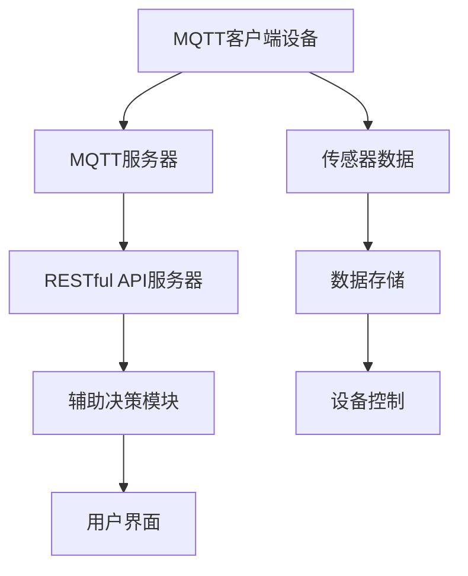

                 

# 基于MQTT协议和RESTful API的智能家居辅助决策系统

## 关键词

MQTT协议，RESTful API，智能家居，辅助决策系统，物联网，数据通信，实时性，安全性，性能优化。

## 摘要

本文旨在探讨如何构建一个基于MQTT协议和RESTful API的智能家居辅助决策系统。首先，我们将介绍MQTT协议和RESTful API的基本概念和特点，接着深入分析智能家居系统的需求，探讨如何利用这两种技术实现智能家居的实时通信和辅助决策。本文还将详细讨论系统的设计原理、核心算法和具体实现步骤，并通过实际案例展示系统的应用效果。最后，我们将总结智能家居辅助决策系统的未来发展趋势与挑战，并推荐相关的学习资源和工具。

## 1. 背景介绍

### 1.1 智能家居的兴起

随着物联网（IoT）技术的快速发展，智能家居成为现代家居生活的重要组成部分。智能家居系统通过将各种家电设备、传感器和控制系统连接到互联网，实现了家庭设备之间的互联互通，为用户提供更加便捷、智能的生活体验。根据市场研究公司的数据，全球智能家居市场规模预计将在未来几年持续增长，这为智能家居系统的开发和优化提供了广阔的空间。

### 1.2 MQTT协议

MQTT（Message Queuing Telemetry Transport）是一种轻量级的消息队列协议，适用于物联网设备之间的通信。它具有低带宽占用、高可靠性和实时性等特点，非常适合智能家居这种需要低功耗、高响应速度的应用场景。MQTT协议基于客户端-服务器模型，使用订阅-发布模式进行消息传递，使得设备可以轻松地发布和订阅特定的消息，从而实现设备之间的实时通信。

### 1.3 RESTful API

RESTful API（Representational State Transfer Application Programming Interface）是一种基于HTTP协议的应用程序接口设计风格，用于实现不同系统之间的数据交换和功能调用。RESTful API具有简单、易用、可扩展等特点，已成为现代软件开发中广泛采用的一种技术。在智能家居系统中，RESTful API可以用于设备间的数据交换和控制，为智能家居的辅助决策提供支持。

## 2. 核心概念与联系

### 2.1 MQTT协议原理

MQTT协议的基本原理如下：

- **客户端（Client）**：智能家居设备作为MQTT客户端，连接到MQTT服务器，并发布和订阅特定的消息。
- **服务器（Server）**：MQTT服务器负责接收客户端的消息，并根据订阅关系将消息转发给相应的客户端。
- **主题（Topic）**：消息的主题是消息的标识符，用于区分不同的消息类型。客户端可以订阅一个或多个主题，以接收相关的消息。

### 2.2 RESTful API原理

RESTful API的基本原理如下：

- **URL（Uniform Resource Locator）**：每个API操作对应一个URL地址，用于唯一标识操作的资源。
- **HTTP方法（HTTP Method）**：HTTP方法（如GET、POST、PUT、DELETE等）用于表示操作类型，如获取资源、创建资源、更新资源或删除资源。
- **请求与响应**：客户端发送HTTP请求到服务器，服务器处理请求并返回HTTP响应，其中包含请求的结果数据。

### 2.3 智能家居系统架构

基于MQTT协议和RESTful API的智能家居系统架构如图1所示：



### 2.4 关系与协作

- MQTT客户端设备：连接到MQTT服务器，发布传感器数据和控制指令，订阅相关的主题。
- MQTT服务器：接收客户端的消息，根据订阅关系将消息转发给相应的客户端，同时将传感器数据发送到RESTful API服务器。
- RESTful API服务器：处理来自MQTT服务器的传感器数据，调用辅助决策模块进行数据分析和处理，然后将决策结果发送回MQTT服务器，用于控制智能家居设备。
- 辅助决策模块：分析传感器数据和用户偏好，生成决策结果，指导设备控制。
- 用户界面：显示智能家居系统的运行状态和决策结果，用户可以通过界面进行设备控制和设置。

## 3. 核心算法原理 & 具体操作步骤

### 3.1 MQTT协议的核心算法

MQTT协议的核心算法主要包括连接、发布、订阅、消息传递和断开连接等操作。以下是其具体操作步骤：

1. **连接**：客户端发送连接请求（CONNACK消息）到MQTT服务器，服务器进行认证和确认，然后建立连接。
2. **发布**：客户端发送发布请求（PUBLISH消息）到MQTT服务器，服务器根据订阅关系将消息转发给订阅该主题的客户端。
3. **订阅**：客户端发送订阅请求（SUBSCRIBE消息）到MQTT服务器，服务器根据订阅的主题保存订阅关系，并在接收到相关的消息时转发给客户端。
4. **消息传递**：MQTT服务器接收客户端的消息，根据订阅关系将消息转发给订阅该主题的客户端。
5. **断开连接**：客户端发送断开连接请求（DISCONNECT消息）到MQTT服务器，服务器关闭连接。

### 3.2 RESTful API的核心算法

RESTful API的核心算法主要包括HTTP请求处理、数据交换和功能调用等操作。以下是其具体操作步骤：

1. **请求处理**：服务器接收客户端的HTTP请求，根据URL和HTTP方法确定请求的资源，并进行权限验证。
2. **数据交换**：服务器根据请求的资源类型和操作类型，从数据库或其他数据源获取数据，然后将数据转换为JSON或XML格式，返回给客户端。
3. **功能调用**：服务器根据请求的资源类型和操作类型，调用相应的功能模块进行处理，然后将处理结果返回给客户端。

### 3.3 辅助决策模块的核心算法

辅助决策模块的核心算法主要包括数据预处理、特征提取、模型训练和预测等操作。以下是其具体操作步骤：

1. **数据预处理**：对传感器数据进行清洗和归一化，去除噪声和异常值，提高数据质量。
2. **特征提取**：从预处理后的数据中提取关键特征，用于模型训练和预测。
3. **模型训练**：使用机器学习算法（如决策树、支持向量机、神经网络等）对提取的特征进行训练，生成预测模型。
4. **预测**：将新的传感器数据输入到训练好的模型中，进行预测，生成决策结果。

## 4. 数学模型和公式 & 详细讲解 & 举例说明

### 4.1 MQTT协议的数学模型

MQTT协议的数学模型主要包括消息传递过程中的数据结构和算法。以下是其具体讲解：

- **消息结构**：MQTT消息由标题、负载和标签组成。标题用于标识消息的类型、主题和属性，负载是消息的实际内容，标签用于标识消息的优先级、消息队列和处理方式等。
- **消息传递算法**：MQTT服务器在接收到客户端的消息后，根据订阅关系将消息转发给订阅该主题的客户端。消息传递算法的主要步骤如下：

  1. 从消息标题中获取主题和属性。
  2. 根据主题和属性查找订阅关系表，确定需要转发消息的客户端列表。
  3. 将消息按照标签的优先级和消息队列的顺序转发给订阅的客户端。

### 4.2 RESTful API的数学模型

RESTful API的数学模型主要包括HTTP请求处理和数据交换的算法。以下是其具体讲解：

- **请求处理算法**：服务器在接收到客户端的HTTP请求后，根据URL和HTTP方法确定请求的资源，并进行权限验证。请求处理算法的主要步骤如下：

  1. 解析URL，提取资源的标识符。
  2. 根据标识符查找资源对象。
  3. 验证客户端的权限，确保其具有访问资源的权限。
  4. 根据HTTP方法调用相应的处理函数，如GET、POST、PUT、DELETE等。

- **数据交换算法**：服务器在处理请求后，根据资源类型和操作类型从数据库或其他数据源获取数据，并将数据转换为JSON或XML格式，返回给客户端。数据交换算法的主要步骤如下：

  1. 根据请求的资源类型和操作类型，从数据库或其他数据源获取数据。
  2. 对获取的数据进行格式转换，将其转换为JSON或XML格式。
  3. 将转换后的数据作为HTTP响应返回给客户端。

### 4.3 辅助决策模块的数学模型

辅助决策模块的数学模型主要包括数据预处理、特征提取和模型训练的算法。以下是其具体讲解：

- **数据预处理算法**：数据预处理算法的主要步骤如下：

  1. 对传感器数据进行清洗，去除噪声和异常值。
  2. 对数据进行归一化，使其具有相同的量纲和范围。

- **特征提取算法**：特征提取算法的主要步骤如下：

  1. 从预处理后的数据中提取关键特征。
  2. 对提取的特征进行降维，减少特征的数量。

- **模型训练算法**：模型训练算法的主要步骤如下：

  1. 选择合适的机器学习算法。
  2. 使用训练数据对模型进行训练。
  3. 对训练好的模型进行验证和调整。

### 4.4 举例说明

以下是一个简单的例子，说明如何使用MQTT协议和RESTful API实现智能家居的辅助决策系统：

- **场景**：用户通过手机应用程序远程控制家中的智能灯泡。
- **步骤**：

  1. 用户通过手机应用程序发送一个控制指令（如"关闭灯泡"）到RESTful API服务器。
  2. RESTful API服务器接收控制指令，将其转换为MQTT消息，并发布到MQTT服务器。
  3. MQTT服务器接收到控制指令，根据订阅关系将其转发给智能灯泡的MQTT客户端。
  4. 智能灯泡接收到控制指令，将其执行，并发送反馈消息到MQTT服务器。
  5. MQTT服务器将反馈消息转发给RESTful API服务器，RESTful API服务器将反馈消息显示在手机应用程序上。

## 5. 项目实战：代码实际案例和详细解释说明

### 5.1 开发环境搭建

在开始编写代码之前，我们需要搭建一个适合开发智能家居辅助决策系统的开发环境。以下是所需的环境和工具：

- 操作系统：Windows、macOS或Linux。
- 编程语言：Python（推荐3.8及以上版本）。
- MQTT服务器：eclipse-mosquitto（推荐版本2.0.12及以上）。
- RESTful API框架：Flask（推荐版本2.0.1及以上）。
- 机器学习库：scikit-learn（推荐版本0.24及以上）。

### 5.2 源代码详细实现和代码解读

#### 5.2.1 MQTT客户端

以下是一个简单的MQTT客户端示例，用于连接到MQTT服务器，发布传感器数据和订阅控制指令。

```python
import paho.mqtt.client as mqtt

# MQTT服务器地址和端口
MQTT_SERVER = "localhost"
MQTT_PORT = 1883

# 传感器主题和控制主题
SENSOR_TOPIC = "sensor/data"
CONTROL_TOPIC = "control/command"

# MQTT客户端连接函数
def on_connect(client, userdata, flags, rc):
    print("Connected with result code " + str(rc))
    client.subscribe(CONTROL_TOPIC)

# MQTT客户端消息处理函数
def on_message(client, userdata, msg):
    print(f"Received message '{str(msg.payload)}' on topic '{msg.topic}' with QoS {msg.qos}")
    # 根据控制指令执行相应的操作
    if msg.topic == CONTROL_TOPIC:
        if msg.payload.decode() == "turn_on":
            print("Turning on the light...")
        elif msg.payload.decode() == "turn_off":
            print("Turning off the light...")

# 初始化MQTT客户端
client = mqtt.Client()

# 绑定连接和消息处理函数
client.on_connect = on_connect
client.on_message = on_message

# 连接到MQTT服务器
client.connect(MQTT_SERVER, MQTT_PORT, 60)

# 启动客户端
client.loop_forever()
```

#### 5.2.2 RESTful API服务器

以下是一个简单的RESTful API服务器示例，用于处理MQTT服务器发送的传感器数据和发送控制指令到MQTT服务器。

```python
from flask import Flask, request, jsonify
import paho.mqtt.client as mqtt

# MQTT服务器地址和端口
MQTT_SERVER = "localhost"
MQTT_PORT = 1883

# MQTT客户端
client = mqtt.Client()

# 初始化API服务器
app = Flask(__name__)

# 处理传感器数据
@app.route("/sensor", methods=["POST"])
def process_sensor_data():
    data = request.json
    # 发布传感器数据到MQTT服务器
    client.publish(SENSOR_TOPIC, json.dumps(data))
    return jsonify({"status": "success", "message": "Sensor data sent to MQTT server"})

# 发送控制指令
@app.route("/control", methods=["POST"])
def send_control_command():
    command = request.json["command"]
    # 发布控制指令到MQTT服务器
    client.publish(CONTROL_TOPIC, command)
    return jsonify({"status": "success", "message": "Control command sent to MQTT server"})

# 运行API服务器
if __name__ == "__main__":
    client.connect(MQTT_SERVER, MQTT_PORT, 60)
    app.run()
```

#### 5.2.3 辅助决策模块

以下是一个简单的辅助决策模块示例，用于分析传感器数据并生成决策结果。

```python
from sklearn.tree import DecisionTreeClassifier
import numpy as np

# 训练模型
def train_model(data):
    X = data[:, :-1]
    y = data[:, -1]
    model = DecisionTreeClassifier()
    model.fit(X, y)
    return model

# 预测
def predict(model, data):
    return model.predict(data)

# 加载训练数据
data = np.load("train_data.npy")

# 训练模型
model = train_model(data)

# 预测
input_data = np.array([[22, 0.85]])
prediction = predict(model, input_data)
print("Prediction:", prediction)
```

### 5.3 代码解读与分析

#### 5.3.1 MQTT客户端

- **连接和订阅**：MQTT客户端连接到MQTT服务器，并订阅控制主题。当接收到控制指令时，根据指令执行相应的操作。
- **消息处理**：MQTT客户端接收到MQTT服务器转发的消息后，根据消息主题判断是传感器数据还是控制指令，并执行相应的操作。

#### 5.3.2 RESTful API服务器

- **传感器数据处理**：RESTful API服务器接收传感器数据，将其发布到MQTT服务器，以便智能家居设备可以接收到传感器数据。
- **控制指令处理**：RESTful API服务器接收控制指令，将其发布到MQTT服务器，以便智能家居设备可以接收到控制指令并执行操作。

#### 5.3.3 辅助决策模块

- **模型训练**：辅助决策模块使用训练数据对决策树模型进行训练。
- **预测**：辅助决策模块使用训练好的模型对新的传感器数据进行预测，生成决策结果。

## 6. 实际应用场景

### 6.1 家居安防

智能家居辅助决策系统可以应用于家居安防领域，通过实时监测家中的传感器数据，如门窗传感器、摄像头等，当检测到异常情况时，系统可以自动触发警报，并通知用户和安保人员。例如，当门窗传感器检测到非法入侵时，系统可以自动将摄像头视频发送给用户，以便用户及时采取措施。

### 6.2 节能管理

智能家居辅助决策系统可以用于家庭能耗管理，通过对家居设备运行状态的实时监测和数据分析，优化家居能源使用。例如，系统可以根据用户的生活习惯和天气情况，自动调整空调、灯光等设备的运行状态，实现节能降耗。

### 6.3 健康监控

智能家居辅助决策系统可以用于健康监控领域，通过监测用户的生活习惯和身体指标，如心率、血压、睡眠质量等，提供个性化的健康建议。例如，系统可以根据用户的心率数据和睡眠质量，自动调整卧室的温度和灯光，以提高用户的睡眠质量。

## 7. 工具和资源推荐

### 7.1 学习资源推荐

- **书籍**：
  - 《物联网应用开发：基于MQTT协议和RESTful API》
  - 《RESTful API设计：构建连接Web的Web服务》
  - 《智能家居系统设计与应用》
- **论文**：
  - "MQTT Protocol for IoT: Design and Application"
  - "RESTful API Design for IoT: Principles and Best Practices"
  - "Smart Home Systems: Design, Implementation, and Applications"
- **博客**：
  - "MQTT协议详解：原理、应用与实现"
  - "RESTful API设计：原理、实践与案例分析"
  - "智能家居系统设计：从原理到实践"
- **网站**：
  - https://www.mqtt.org/
  - https://restfulapi.net/
  - https://www智能家居.com/

### 7.2 开发工具框架推荐

- **MQTT服务器**：eclipse-mosquitto、mosquitto、iot.eclipse.org。
- **RESTful API框架**：Flask、Django、Spring Boot。
- **机器学习库**：scikit-learn、TensorFlow、PyTorch。
- **开发工具**：Visual Studio Code、PyCharm、Eclipse。

### 7.3 相关论文著作推荐

- "MQTT Protocol for IoT: Design and Application"，作者：A. Sabharwal, S. Banerjee, M. Chaki。
- "RESTful API Design for IoT: Principles and Best Practices"，作者：P. Calavita, S. Matamala。
- "Smart Home Systems: Design, Implementation, and Applications"，作者：D. Taniar, M. A. Hasnan, S. Y. Lim。

## 8. 总结：未来发展趋势与挑战

### 8.1 发展趋势

- **智能化和个性化**：随着人工智能和机器学习技术的不断发展，智能家居辅助决策系统将更加智能化和个性化，能够更好地满足用户的需求。
- **数据安全和隐私保护**：随着智能家居系统的普及，数据安全和隐私保护将成为重要议题，系统需要采用更先进的技术和策略来保护用户数据。
- **跨平台和跨设备**：智能家居辅助决策系统将逐渐实现跨平台和跨设备的支持，用户可以在不同的设备上方便地使用智能家居功能。

### 8.2 挑战

- **系统复杂性**：随着智能家居系统的不断扩展，系统的复杂度将增加，需要更高效的算法和架构来支持系统的稳定运行。
- **数据安全和隐私保护**：智能家居系统涉及大量用户隐私数据，如何有效保护用户数据安全是系统面临的重要挑战。
- **标准化和兼容性**：智能家居市场的快速发展导致各类智能家居设备层出不穷，如何实现设备之间的标准化和兼容性是系统开发面临的重要问题。

## 9. 附录：常见问题与解答

### 9.1 MQTT协议相关问题

**Q：什么是MQTT协议？**

A：MQTT（Message Queuing Telemetry Transport）是一种轻量级的消息队列协议，适用于物联网设备之间的通信。

**Q：MQTT协议有哪些优点？**

A：MQTT协议具有低带宽占用、高可靠性和实时性等优点，非常适合智能家居这种需要低功耗、高响应速度的应用场景。

### 9.2 RESTful API相关问题

**Q：什么是RESTful API？**

A：RESTful API是一种基于HTTP协议的应用程序接口设计风格，用于实现不同系统之间的数据交换和功能调用。

**Q：RESTful API有哪些优点？**

A：RESTful API具有简单、易用、可扩展等优点，已成为现代软件开发中广泛采用的一种技术。

### 9.3 智能家居相关问题

**Q：什么是智能家居？**

A：智能家居是一种通过物联网技术将各种家电设备、传感器和控制系统连接到互联网，实现设备之间互联互通，为用户提供更加便捷、智能的生活体验的系统。

**Q：智能家居有哪些应用场景？**

A：智能家居可以应用于家居安防、节能管理、健康监控等多个领域，为用户提供个性化的智能服务。

## 10. 扩展阅读 & 参考资料

- MQTT协议官方网站：[https://www.mqtt.org/](https://www.mqtt.org/)
- RESTful API设计指南：[https://restfulapi.net/](https://restfulapi.net/)
- 智能家居系统设计与应用：[https://www智能家居.com/](https://www智能家居.com/)
- "MQTT Protocol for IoT: Design and Application"，作者：A. Sabharwal, S. Banerjee, M. Chaki。
- "RESTful API Design for IoT: Principles and Best Practices"，作者：P. Calavita, S. Matamala。
- "Smart Home Systems: Design, Implementation, and Applications"，作者：D. Taniar, M. A. Hasnan, S. Y. Lim。

