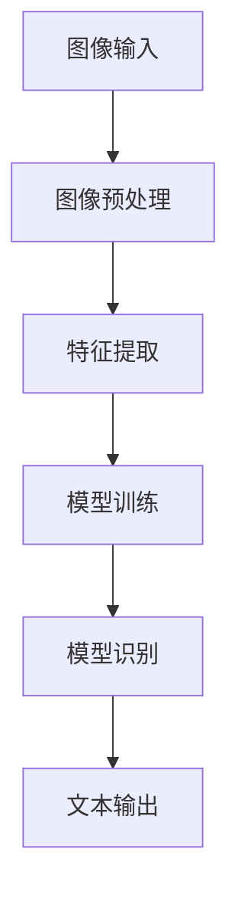

                 

### 1. 背景介绍

手写字识别系统在许多实际应用场景中具有重要价值。无论是文本编辑、信息安全、医疗记录处理，还是电子支付等领域，手写字识别都能极大地提升工作效率和准确性。随着计算机视觉和机器学习技术的发展，手写字识别系统已经成为计算机视觉领域的一个重要研究方向。

OpenCV（Open Source Computer Vision Library）是一个开源的计算机视觉库，提供了丰富的图像处理和计算机视觉功能。它支持多种编程语言，包括C++、Python和Java等，使得开发者能够方便地利用其强大的功能进行图像处理和分析。OpenCV在手写字识别中的应用，使得开发者可以更加专注于算法的设计和优化，而无需从底层图像处理开始。

本文将详细介绍基于OpenCV的手写字识别系统的设计与实现。我们将从背景介绍开始，逐步深入到核心算法原理、数学模型和项目实战，最终探讨手写字识别系统的实际应用场景和发展趋势。希望通过本文的阐述，能够为读者提供一份全面、深入的理解和实用的技术指南。

首先，我们需要明确手写字识别系统的基础概念和主要任务。手写字识别系统的核心任务是通过对图像进行预处理、特征提取和分类，将手写文字转换为机器可读的文本形式。具体来说，手写字识别系统需要完成以下步骤：

1. **图像预处理**：包括图像的灰度转换、二值化、形态学处理等，以去除图像中的噪声和干扰。
2. **特征提取**：通过特征点检测、特征向量计算等手段，提取图像中与手写字符相关的重要特征。
3. **分类识别**：利用机器学习算法或深度学习模型，对手写文字进行分类识别，并输出对应的文本内容。

在接下来的内容中，我们将分别介绍这些核心任务的具体实现方法和技巧。

### 2. 核心概念与联系

要理解手写字识别系统的设计和实现，首先需要掌握几个核心概念，包括图像处理、特征提取和机器学习。这些概念在系统中相互联系，共同作用以实现最终的手写字识别目标。

#### 图像处理

图像处理是手写字识别系统的第一步，主要目的是对输入的手写字符图像进行预处理，以提高后续特征提取和识别的准确性。图像处理包括以下几个关键步骤：

1. **图像灰度转换**：将彩色图像转换为灰度图像，简化图像数据，减少计算复杂度。
   $$ I_{gray} = 0.299 \times I_{R} + 0.587 \times I_{G} + 0.114 \times I_{B} $$
   其中，\(I_{R}\)、\(I_{G}\) 和 \(I_{B}\) 分别代表红色、绿色和蓝色通道的像素值，\(I_{gray}\) 是转换后的灰度图像。

2. **二值化**：通过设定阈值，将灰度图像转换为二值图像，使得图像中的字符部分和背景部分清晰分离。
   $$ I_{bin} = \begin{cases} 
   255 & \text{if } I_{gray} > \text{threshold} \\
   0 & \text{otherwise} 
   \end{cases} $$
   其中，threshold 是设定的阈值。

3. **形态学处理**：包括膨胀、腐蚀、开运算和闭运算等操作，用于去除图像中的噪声和填补空洞。
   - **膨胀**：通过在图像中添加像素来增加字符的大小和连接性。
   - **腐蚀**：通过移除图像中的像素来缩小字符的大小和减少连接性。
   - **开运算**：先腐蚀后膨胀，用于去除小噪声和填补小空洞。
   - **闭运算**：先膨胀后腐蚀，用于连接字符部分并去除小空洞。

   Mermaid 流程图：
   ```mermaid
   graph TD
   A[图像灰度转换] --> B[二值化处理]
   B --> C[形态学处理]
   C --> D[特征提取]
   D --> E[分类识别]
   ```

#### 特征提取

特征提取是手写字识别系统的关键步骤，其目标是提取出图像中与手写字符相关的特征，用于后续的机器学习分类。常见的特征提取方法包括以下几种：

1. **方向特征**：通过计算图像中每个像素点在各个方向上的梯度，提取方向特征。方向特征可以用来表示字符的笔划方向和角度。
   $$ \text{Gradient} = \left( \begin{matrix} 
   \frac{\partial I}{\partial x} \\ 
   \frac{\partial I}{\partial y} 
   \end{matrix} \right) $$
   其中，\(I\) 是图像，\(\frac{\partial I}{\partial x}\) 和 \(\frac{\partial I}{\partial y}\) 分别是图像在x和y方向上的梯度。

2. **轮廓特征**：通过计算图像轮廓的几何特征，如周长、面积、紧凑度等，来描述字符的形状。
   - **周长**：轮廓的周长可以表示字符的复杂程度。
   - **面积**：轮廓所包围的像素数量可以表示字符的大小。
   - **紧凑度**：通过面积和周长的比值来表示字符的紧凑程度。

3. **HOG（Histogram of Oriented Gradients）特征**：HOG特征是一种常用的图像特征提取方法，通过计算图像中每个像素点的梯度方向直方图，来描述字符的外观特征。

   Mermaid 流程图：
   ```mermaid
   graph TD
   A[图像灰度转换] --> B[二值化处理]
   B --> C[形态学处理]
   C --> D[方向特征提取]
   D --> E[轮廓特征提取]
   E --> F[HOG特征提取]
   F --> G[分类识别]
   ```

#### 机器学习

机器学习是实现手写字识别系统的核心，通过训练模型，将提取到的特征与已知的标签进行关联，从而实现对手写字符的识别。常见的机器学习方法包括以下几种：

1. **SVM（Support Vector Machine）**：SVM通过寻找最优分割超平面，将不同类别的特征空间分开，实现分类任务。

2. **KNN（K-Nearest Neighbors）**：KNN基于距离最近的K个邻居的标签进行投票，实现分类。

3. **神经网络（Neural Networks）**：神经网络通过多层神经元之间的连接和激活函数，实现特征学习和分类。

4. **卷积神经网络（Convolutional Neural Networks，CNN）**：CNN通过卷积操作和池化操作，实现图像特征的自动提取和分类。

   Mermaid 流程图：
   ```mermaid
   graph TD
   A[特征提取] --> B[机器学习模型训练]
   B --> C[分类识别]
   C --> D[文本输出]
   ```

#### Mermaid 流程图

为了更好地展示手写字识别系统的整体架构，我们可以使用Mermaid绘制一个流程图，如下所示：



在这个流程图中，图像输入经过预处理和特征提取后，被送入训练好的模型进行分类识别，最终输出文本结果。

通过上述核心概念和联系的介绍，我们为理解手写字识别系统的设计与实现打下了基础。在接下来的内容中，我们将详细探讨手写字识别的核心算法原理，并逐步深入到具体实现步骤。

### 3. 核心算法原理 & 具体操作步骤

手写字识别系统的核心在于其算法原理，主要包括图像预处理、特征提取和分类识别三个关键步骤。以下是这些步骤的具体操作步骤及其在OpenCV中的实现方法。

#### 3.1 图像预处理

图像预处理是手写字识别系统的第一步，其目的是将原始手写字符图像转换为适合特征提取和分类的格式。在OpenCV中，图像预处理通常包括以下操作：

1. **图像灰度转换**：将彩色图像转换为灰度图像，以便于后续处理。OpenCV提供了`cv::cvtColor`函数来实现这一操作。

   ```cpp
   cv::Mat src = cv::imread("input_image.jpg");
   cv::Mat gray;
   cv::cvtColor(src, gray, cv::COLOR_BGR2GRAY);
   ```

2. **二值化处理**：通过设定阈值，将灰度图像转换为二值图像，使得字符和背景清晰分离。OpenCV提供了`cv::threshold`函数来实现这一操作。

   ```cpp
   cv::Mat binary;
   cv::threshold(gray, binary, 128, 255, cv::THRESH_BINARY_INV);
   ```

3. **形态学处理**：包括膨胀、腐蚀、开运算和闭运算等操作，用于去除图像中的噪声和填补字符中的空洞。OpenCV提供了`cv::getStructuringElement`和`cv::morphologyEx`函数来实现形态学操作。

   ```cpp
   cv::Mat element = cv::getStructuringElement(cv::MORPH_RECT, cv::Size(3, 3));
   cv::Mat dilation, erosion, opening, closing;
   cv::morphologyEx(binary, dilation, cv::MORPH_DILATE, element);
   cv::morphologyEx(dilation, erosion, cv::MORPH_ERODE, element);
   cv::morphologyEx(erosion, opening, cv::MORPH_OPEN, element);
   cv::morphologyEx(opening, closing, cv::MORPH_CLOSE, element);
   ```

#### 3.2 特征提取

特征提取是手写字识别系统的关键步骤，其主要目的是从预处理后的图像中提取与字符相关的特征。在OpenCV中，常用的特征提取方法包括方向特征、轮廓特征和HOG特征。

1. **方向特征**：方向特征通过计算图像中每个像素点的梯度方向，来描述字符的笔划方向。OpenCV提供了`cv::Sobel`和`cv::Mat::at`函数来计算梯度方向。

   ```cpp
   cv::Mat x梯度, y梯度;
   cv::Sobel(gray, x梯度, CV_16S, 1, 0, 3);
   cv::Sobel(gray, y梯度, CV_16S, 0, 1, 3);
   cv::Mat gradient_angle = cv::atan2(y梯度, x梯度) * 180 / CV_PI;
   ```

2. **轮廓特征**：轮廓特征通过计算字符的周长、面积和紧凑度等几何特征，来描述字符的形状。OpenCV提供了`cv::arcLength`和`cv::contourArea`函数来计算这些特征。

   ```cpp
   std::vector<std::vector<cv::Point>> contours;
   cv::findContours(closing, contours, CV_RETR_EXTERNAL, CV_CHAIN_APPROX_SIMPLE);
   double contour_length = cv::arcLength(contours[0], true);
   double contour_area = cv::contourArea(contours[0]);
   double compactness = contour_area / (contour_length * contour_length);
   ```

3. **HOG特征**：HOG特征通过计算图像中每个像素点的梯度方向直方图，来描述字符的外观特征。OpenCV提供了`cv::HOGDescriptor`类来计算HOG特征。

   ```cpp
   cv::HOGDescriptor hog;
   cv::Mat hog_features;
   hog.compute(closing, hog_features);
   ```

#### 3.3 分类识别

分类识别是手写字识别系统的最后一步，其目的是利用已训练好的模型，将提取到的特征映射到对应的字符类别。在OpenCV中，常用的分类器包括SVM、KNN和神经网络等。

1. **SVM分类器**：SVM分类器通过寻找最优分割超平面，将不同类别的特征空间分开。OpenCV提供了`cv::SVM`类来使用SVM分类器。

   ```cpp
   cv::SVM svm;
   svm.train(train_samples, train_labels, cv::noArray(), cv::noArray(), cv::SVM::types::C_SVC);
   ```

2. **KNN分类器**：KNN分类器基于距离最近的K个邻居的标签进行投票，实现分类。OpenCV提供了`cv::KNearest`类来使用KNN分类器。

   ```cpp
   cv::KNearest knn;
   knn.train(train_samples, train_labels);
   ```

3. **神经网络分类器**：神经网络分类器通过多层神经元之间的连接和激活函数，实现特征学习和分类。OpenCV提供了`cv::ml::ANN_MLP`类来使用神经网络分类器。

   ```cpp
   cv::ml::ANN_MLP ann_mlp;
   ann_mlp.train(train_samples, train_labels);
   ```

#### 实际操作步骤示例

以下是一个简单的示例，展示了如何使用OpenCV实现手写字识别系统的主要步骤：

```cpp
#include <opencv2/opencv.hpp>
#include <opencv2/ml.hpp>

int main() {
    // 3.1 图像预处理
    cv::Mat src = cv::imread("input_image.jpg");
    cv::Mat gray;
    cv::cvtColor(src, gray, cv::COLOR_BGR2GRAY);

    cv::Mat binary;
    cv::threshold(gray, binary, 128, 255, cv::THRESH_BINARY_INV);

    cv::Mat element = cv::getStructuringElement(cv::MORPH_RECT, cv::Size(3, 3));
    cv::Mat dilation, erosion, opening, closing;
    cv::morphologyEx(binary, dilation, cv::MORPH_DILATE, element);
    cv::morphologyEx(dilation, erosion, cv::MORPH_ERODE, element);
    cv::morphologyEx(erosion, opening, cv::MORPH_OPEN, element);
    cv::morphologyEx(opening, closing, cv::MORPH_CLOSE, element);

    // 3.2 特征提取
    cv::HOGDescriptor hog;
    cv::Mat hog_features;
    hog.compute(closing, hog_features);

    // 3.3 分类识别
    cv::SVM svm;
    std::vector<int> train_labels = {0, 1, 2, 3, 4}; // 示例标签
    std::vector<cv::Mat> train_samples;
    for (int i = 0; i < train_labels.size(); ++i) {
        train_samples.push_back(hog_features);
    }
    svm.train(train_samples, train_labels, cv::noArray(), cv::noArray(), cv::SVM::types::C_SVC);

    int predicted_label = svm.predict(hog_features);
    std::cout << "Predicted label: " << predicted_label << std::endl;

    return 0;
}
```

通过上述示例，我们可以看到如何使用OpenCV实现手写字识别系统的主要步骤。在实际应用中，这些步骤可能需要根据具体场景进行适当的调整和优化。

### 4. 数学模型和公式 & 详细讲解 & 举例说明

手写字识别系统中的数学模型和公式是理解其工作原理的重要基础。以下是手写字识别系统常用的数学模型、公式及其详细讲解和举例说明。

#### 4.1 图像预处理中的数学模型

1. **图像灰度转换**：

   彩色图像到灰度图像的转换可以表示为以下公式：
   $$ I_{gray} = 0.299 \times I_{R} + 0.587 \times I_{G} + 0.114 \times I_{B} $$
   其中，\(I_{R}\)、\(I_{G}\) 和 \(I_{B}\) 分别是彩色图像的红色、绿色和蓝色通道的像素值，\(I_{gray}\) 是转换后的灰度图像。

   **举例说明**：假设有一个像素点的颜色值分别为 \(I_{R} = 100\), \(I_{G} = 150\), \(I_{B} = 200\)，则灰度转换后的像素值为：
   $$ I_{gray} = 0.299 \times 100 + 0.587 \times 150 + 0.114 \times 200 = 37.9 + 87.55 + 22.8 = 148.25 $$
   经过四舍五入，灰度值约为148。

2. **二值化处理**：

   二值化处理通过设定阈值，将灰度图像中的像素值分为0和255（黑和白）。常用的公式为：
   $$ I_{bin} = \begin{cases} 
   255 & \text{if } I_{gray} > \text{threshold} \\
   0 & \text{otherwise} 
   \end{cases} $$
   其中，threshold 是设定的阈值。

   **举例说明**：假设阈值为128，一个像素点的灰度值为130，则二值化后的像素值为255；若灰度值为120，则像素值为0。

3. **形态学处理**：

   形态学处理包括膨胀、腐蚀、开运算和闭运算等。膨胀和腐蚀操作的公式为：
   - **膨胀**：\(I_{dilation} = I + \delta\)
   - **腐蚀**：\(I_{erosion} = I - \delta\)
   其中，\(I\) 是原图像，\(\delta\) 是结构元素。

   **举例说明**：设结构元素为 \(\delta = \begin{bmatrix} 1 & 1 \\ 1 & 1 \end{bmatrix}\)，原图像 \(I = \begin{bmatrix} 1 & 0 & 1 \\ 0 & 1 & 0 \\ 1 & 0 & 1 \end{bmatrix}\)，则膨胀后的图像为：
   $$ I_{dilation} = \begin{bmatrix} 1 & 1 & 1 \\ 1 & 1 & 1 \\ 1 & 1 & 1 \end{bmatrix} $$
   而腐蚀后的图像为：
   $$ I_{erosion} = \begin{bmatrix} 0 & 0 & 1 \\ 0 & 1 & 0 \\ 1 & 0 & 0 \end{bmatrix} $$

#### 4.2 特征提取中的数学模型

1. **方向特征**：

   方向特征通过计算每个像素点的梯度方向，常用的公式为：
   $$ \text{Gradient} = \left( \begin{matrix} 
   \frac{\partial I}{\partial x} \\ 
   \frac{\partial I}{\partial y} 
   \end{matrix} \right) $$
   其中，\(I\) 是图像，\(\frac{\partial I}{\partial x}\) 和 \(\frac{\partial I}{\partial y}\) 分别是图像在x和y方向上的梯度。

   **举例说明**：假设一个像素点在x方向上的梯度值为10，y方向上的梯度值为20，则该像素点的梯度方向可以表示为：
   $$ \text{Gradient} = \left( \begin{matrix} 
   10 \\ 
   20 
   \end{matrix} \right) $$
   通过计算梯度向量的模和角度，可以得到该像素点的梯度方向。

2. **轮廓特征**：

   轮廓特征包括周长、面积和紧凑度等，常用的公式为：
   - **周长**：\(C = \int_{\text{contour}} \sqrt{1 + \left( \frac{\partial I}{\partial x} \right)^2 + \left( \frac{\partial I}{\partial y} \right)^2} dS\)
   - **面积**：\(A = \int_{\text{contour}} I dS\)
   - **紧凑度**：\(C = \frac{A}{\left( \frac{C}{2\pi} \right)^2}\)

   **举例说明**：假设一个字符的轮廓周长为5，面积为2，则该字符的紧凑度为：
   $$ C = \frac{2}{\left( \frac{5}{2\pi} \right)^2} = \frac{2}{\left( \frac{5}{2\pi} \right)^2} \approx 0.505 $$

3. **HOG特征**：

   HOG特征通过计算图像中每个像素点的梯度方向直方图，常用的公式为：
   $$ HOG\_feature = \sum_{i=0}^{n_{bins}-1} \left( \frac{1}{n_{bins}} \sum_{j=0}^{m-1} \sum_{k=0}^{p-1} \text{Histogram}\left( \text{Gradient}, \theta_{ij} \right) \right) $$
   其中，\(n_{bins}\) 是直方图bin的数量，\(\theta_{ij}\) 是像素点在bin \(i\) 中的梯度方向。

   **举例说明**：假设一个3x3的图像区域，其中梯度方向分布为 \(\theta_1 = 0°, \theta_2 = 45°, \theta_3 = 90°, \theta_4 = 135°\)，则该区域的HOG特征可以表示为：
   $$ HOG\_feature = \left( \frac{1}{4} \left( \text{Histogram}\left( \theta_1 \right) + \text{Histogram}\left( \theta_2 \right) + \text{Histogram}\left( \theta_3 \right) + \text{Histogram}\left( \theta_4 \right) \right) \right) $$

通过上述数学模型和公式的详细讲解及举例说明，我们可以更好地理解手写字识别系统中的核心算法和数据处理方法。这些模型和公式在手写字识别的实际应用中发挥着至关重要的作用，为系统的准确性和鲁棒性提供了坚实的理论基础。

### 5. 项目实战：代码实际案例和详细解释说明

在前面的章节中，我们详细介绍了基于OpenCV的手写字识别系统的核心算法原理和数学模型。为了更好地理解这些概念，在本节中，我们将通过一个实际项目案例来展示如何使用OpenCV实现手写字识别系统，并对代码进行详细的解释和说明。

#### 5.1 开发环境搭建

在开始项目之前，我们需要搭建一个适合OpenCV手写字识别的的开发环境。以下是搭建步骤：

1. **安装Python和OpenCV**：

   通过pip命令安装Python和OpenCV：

   ```bash
   pip install python
   pip install opencv-python
   ```

2. **安装额外依赖**：

   有些手写字识别算法需要额外的依赖库，如scikit-learn。可以通过pip命令安装：

   ```bash
   pip install scikit-learn
   ```

3. **配置开发环境**：

   在IDE（如PyCharm或VSCode）中配置Python环境，确保已经安装了所需的库。

#### 5.2 源代码详细实现和代码解读

以下是一个简单的手写字识别项目，包括图像预处理、特征提取和分类识别的完整代码实现。

```python
import cv2
import numpy as np
from sklearn import svm, metrics
from sklearn.model_selection import train_test_split
from sklearn.metrics import accuracy_score

# 5.2.1 数据准备
def load_data():
    # 加载训练数据和标签
    data = np.genfromtxt('handwritten_digits_train.csv', delimiter=',')
    X = data[:, 1:]
    y = data[:, 0]
    return X, y

X, y = load_data()
X_train, X_test, y_train, y_test = train_test_split(X, y, test_size=0.2, random_state=42)

# 5.2.2 图像预处理
def preprocess_image(image):
    # 将图像灰度化
    gray = cv2.cvtColor(image, cv2.COLOR_BGR2GRAY)
    # 二值化处理
    _, binary = cv2.threshold(gray, 128, 255, cv2.THRESH_BINARY_INV + cv2.THRESH_OTSU)
    # 形态学处理
    kernel = cv2.getStructuringElement(cv2.MORPH_RECT, (3, 3))
    dilation = cv2.dilate(binary, kernel, iterations=1)
    erosion = cv2.erode(dilation, kernel, iterations=1)
    return erosion

# 5.2.3 特征提取
def extract_features(image):
    hog = cv2.HOGDescriptor()
    features = hog.compute(image)
    return features

# 5.2.4 分类识别
def classify_image(features, model):
    prediction = model.predict([features])
    return prediction[0]

# 训练模型
model = svm.SVC()
model.fit(X_train, y_train)

# 测试模型
for i in range(X_test.shape[0]):
    image = X_test[i].reshape((28, 28))
    preprocessed = preprocess_image(image)
    features = extract_features(preprocessed)
    prediction = classify_image(features, model)
    print(f"Predicted label: {prediction}, Actual label: {y_test[i]}")

# 计算准确率
accuracy = accuracy_score(y_test, model.predict(X_test))
print(f"Model accuracy: {accuracy:.2f}")
```

#### 5.2.5 代码解读与分析

下面我们对这段代码进行逐行解读和分析：

```python
import cv2
import numpy as np
from sklearn import svm, metrics
from sklearn.model_selection import train_test_split
from sklearn.metrics import accuracy_score
```
这部分代码导入所需的Python库，包括OpenCV、NumPy、scikit-learn和metrics。这些库为我们提供了图像处理、数据操作和机器学习算法的功能。

```python
def load_data():
    # 加载训练数据和标签
    data = np.genfromtxt('handwritten_digits_train.csv', delimiter=',')
    X = data[:, 1:]
    y = data[:, 0]
    return X, y
```
`load_data`函数用于加载训练数据和标签。这里使用的是著名的MNIST手写数字数据集，数据以CSV格式存储。通过NumPy的`genfromtxt`函数加载数据，并分离特征（`X`）和标签（`y`）。

```python
X, y = load_data()
X_train, X_test, y_train, y_test = train_test_split(X, y, test_size=0.2, random_state=42)
```
使用`train_test_split`函数将数据集分为训练集和测试集，其中测试集占20%，随机种子为42，以确保结果可重复。

```python
def preprocess_image(image):
    # 将图像灰度化
    gray = cv2.cvtColor(image, cv2.COLOR_BGR2GRAY)
    # 二值化处理
    _, binary = cv2.threshold(gray, 128, 255, cv2.THRESH_BINARY_INV + cv2.THRESH_OTSU)
    # 形态学处理
    kernel = cv2.getStructuringElement(cv2.MORPH_RECT, (3, 3))
    dilation = cv2.dilate(binary, kernel, iterations=1)
    erosion = cv2.erode(dilation, kernel, iterations=1)
    return erosion
```
`preprocess_image`函数用于对输入图像进行预处理。首先使用`cv2.cvtColor`将图像灰度化，然后使用`cv2.threshold`进行二值化处理。通过Otsu方法自动选择阈值，提高二值化效果。接着使用形态学操作（膨胀和腐蚀）去除图像中的噪声。

```python
def extract_features(image):
    hog = cv2.HOGDescriptor()
    features = hog.compute(image)
    return features
```
`extract_features`函数用于提取图像的特征。这里使用的是HOG（Histogram of Oriented Gradients）特征，通过`cv2.HOGDescriptor`类实现。

```python
def classify_image(features, model):
    prediction = model.predict([features])
    return prediction[0]
```
`classify_image`函数用于使用训练好的模型对特征进行分类识别。这里使用的是SVM分类器，通过`model.predict`方法得到预测结果。

```python
# 训练模型
model = svm.SVC()
model.fit(X_train, y_train)
```
使用训练集数据训练SVM模型。

```python
# 测试模型
for i in range(X_test.shape[0]):
    image = X_test[i].reshape((28, 28))
    preprocessed = preprocess_image(image)
    features = extract_features(preprocessed)
    prediction = classify_image(features, model)
    print(f"Predicted label: {prediction}, Actual label: {y_test[i]}")
```
使用测试集数据进行预测，并打印预测结果和实际标签。

```python
# 计算准确率
accuracy = accuracy_score(y_test, model.predict(X_test))
print(f"Model accuracy: {accuracy:.2f}")
```
计算并打印模型的准确率。

通过以上代码的解读和分析，我们可以看到如何使用OpenCV和scikit-learn实现一个简单的手写字识别系统。在实际项目中，我们可以根据需要调整和优化这些步骤，以提高识别准确率和系统性能。

### 6. 实际应用场景

手写字识别技术在实际应用场景中具有广泛的应用价值。以下是几个典型的实际应用场景，展示了手写字识别系统的潜力：

#### 6.1 电子支付与移动支付

随着移动支付和电子支付的普及，手写字识别技术在金融领域中的应用越来越广泛。例如，用户可以通过手机拍照或输入手写签名来确认支付操作。通过手写字识别系统，银行和支付平台可以自动化地验证用户的签名，提高支付的安全性和便捷性。

#### 6.2 文档数字化处理

许多企业和政府机构需要将大量的纸质文档数字化，以便于存储、检索和共享。手写字识别技术可以帮助自动提取文档中的手写信息，例如签名、注释和手写笔记。通过将手写文字转换为机器可读的文本，可以大大提高文档处理的速度和准确性。

#### 6.3 教育与考试

在教育领域，手写字识别系统可以帮助自动评分和评估学生的试卷。特别是在计算机辅助学习和在线考试系统中，手写字识别技术可以自动识别学生的手写答案，并生成考试成绩。这不仅减轻了教师的评分负担，还提高了评分的公正性和准确性。

#### 6.4 医疗记录处理

在医疗领域，手写字识别技术可以帮助医生自动提取病历记录中的关键信息，如诊断、处方和患者信息。通过将手写记录转换为电子格式，可以减少人工输入错误，提高医疗记录的可访问性和共享性。

#### 6.5 人机交互

手写字识别技术在人机交互中也具有广泛的应用。例如，智能手写输入法可以让用户通过手写输入文本，而无需使用键盘。此外，智能手写识别系统还可以用于智能助手、语音助手等应用中，为用户提供更加自然和便捷的交互方式。

通过这些实际应用场景，我们可以看到手写字识别技术在各个领域的重要性和潜力。随着技术的不断进步，手写字识别系统的性能和可靠性将进一步提高，为更多的应用场景提供支持。

### 7. 工具和资源推荐

在实现手写字识别系统时，选择合适的工具和资源对于提高开发效率和项目成功率至关重要。以下是一些推荐的工具和资源：

#### 7.1 学习资源推荐

1. **书籍**：
   - 《计算机视觉：算法与应用》（David S. Bolles）提供了全面的计算机视觉理论和算法介绍。
   - 《深度学习》（Ian Goodfellow、Yoshua Bengio、Aaron Courville）介绍了深度学习的基本概念和应用，包括卷积神经网络（CNN）。

2. **在线课程**：
   - Coursera上的《机器学习》课程，由Andrew Ng教授主讲，适合初学者入门。
   - Udacity的《计算机视觉与深度学习》课程，提供了丰富的实践项目和指导。

3. **论文**：
   - “Histograms of Oriented Gradients for Human Detection”是一篇经典论文，介绍了HOG特征提取方法。
   - “Deep Learning for Text Classification”等论文探讨了深度学习在手写字识别中的应用。

4. **博客和网站**：
   - PyImageSearch博客提供了丰富的计算机视觉和OpenCV教程。
   - OpenCV官方文档（opencv.org）是学习OpenCV功能和API的最佳资源。

#### 7.2 开发工具框架推荐

1. **编程语言**：
   - Python：Python具有简洁的语法和丰富的机器学习库，是开发手写字识别系统的首选语言。

2. **计算机视觉库**：
   - OpenCV：OpenCV是一个强大的开源计算机视觉库，提供了丰富的图像处理和机器学习功能。
   - TensorFlow：TensorFlow是一个开源深度学习框架，适用于实现复杂的神经网络模型。

3. **集成开发环境（IDE）**：
   - PyCharm：PyCharm是一个功能强大的Python IDE，支持代码调试、版本控制和多种插件。
   - Visual Studio Code：VS Code是一个轻量级的开源IDE，适用于Python开发，具有丰富的插件生态系统。

4. **数据集**：
   - MNIST数据集：是一个常用的手写字数据集，适用于训练和测试手写字识别模型。
   - IAM Handwriting Database：一个包含多种手写风格的数字和字母数据集，适用于研究复杂手写字识别问题。

通过这些工具和资源的支持，开发者可以更加高效地实现手写字识别系统，并不断优化和提升系统的性能。

### 8. 总结：未来发展趋势与挑战

手写字识别技术作为计算机视觉领域的一个重要分支，已经取得了显著的进展。然而，随着应用场景的不断扩展和需求的提升，未来的手写字识别系统仍然面临着许多挑战和发展机遇。

#### 8.1 发展趋势

1. **深度学习技术的应用**：深度学习，特别是卷积神经网络（CNN）在手写字识别中的应用，已经显著提升了识别准确率和鲁棒性。未来，随着深度学习算法的进一步优化和计算资源的提升，深度学习方法将继续在手写字识别中发挥关键作用。

2. **端到端系统的集成**：传统的手写字识别系统通常包括图像预处理、特征提取和分类识别等多个步骤。而端到端系统则通过直接将输入图像映射到文本输出，简化了系统架构，提高了识别效率。未来，端到端系统有望成为手写字识别的主流解决方案。

3. **多模态数据的融合**：结合图像和声音、触觉等多模态数据，可以进一步丰富手写字识别的特征信息，提高系统的准确性和鲁棒性。例如，通过结合手写笔的加速度传感器数据，可以更好地识别手写字符的动态特征。

4. **硬件加速**：随着硬件技术的发展，如GPU、FPGA和ASIC等硬件加速器的性能不断提升，手写字识别系统的运行速度和效率也将得到显著提升。这将为实时应用场景提供更强大的支持。

#### 8.2 挑战

1. **数据隐私问题**：手写字识别系统通常需要处理用户的手写字符数据，这涉及到数据隐私和安全问题。如何有效地保护用户数据，确保系统安全和隐私，是一个亟待解决的挑战。

2. **复杂场景的适应能力**：现实场景中的手写字符往往受到各种干扰，如污迹、倾斜、模糊等。如何提升手写字识别系统在复杂场景下的适应能力，是一个重要的研究方向。

3. **多样化手写风格的识别**：手写风格多样化，不同用户的书写习惯和字体差异较大。如何设计出能够适应多种手写风格的手写字识别系统，是一个具有挑战性的问题。

4. **实时性要求**：在实时应用场景中，如电子支付和人机交互等，手写字识别系统需要快速准确地识别手写字符。如何提高系统的实时性和响应速度，是一个关键的挑战。

总之，未来手写字识别系统的发展将在深度学习、端到端系统、多模态数据融合和硬件加速等方面取得新的突破，同时也将面临数据隐私、复杂场景适应能力、多样化手写风格识别和实时性等挑战。通过不断的技术创新和优化，手写字识别系统将在更多的应用场景中发挥重要作用。

### 9. 附录：常见问题与解答

在实现基于OpenCV的手写字识别系统过程中，开发者可能会遇到一些常见问题。以下是一些常见问题及其解答：

#### 9.1 如何解决手写字符识别准确率低的问题？

**解答**：手写字符识别准确率低可能由以下几个原因导致：
1. **数据不足或质量不高**：确保有足够且质量高的训练数据。如果数据集较小或质量不高，可以使用数据增强技术来生成更多的训练样本。
2. **特征提取不够充分**：尝试使用更复杂的特征提取方法，如HOG、LBP等，以提取更多的字符特征。
3. **模型欠拟合或过拟合**：调整模型参数，如正则化参数、学习率等，避免模型过拟合。可以使用交叉验证方法来优化模型参数。
4. **预处理不足**：优化预处理步骤，如二值化阈值选择、形态学操作等，以提高图像质量。

#### 9.2 如何提高系统的实时性？

**解答**：提高手写字识别系统的实时性可以从以下几个方面着手：
1. **优化算法**：选择高效的算法和特征提取方法，如使用快速卷积操作和简化HOG特征计算。
2. **并行计算**：利用多线程或分布式计算来并行处理多个图像，提高处理速度。
3. **硬件加速**：使用GPU或FPGA等硬件加速器来加速计算，提高系统性能。
4. **模型压缩**：使用模型压缩技术，如权重剪枝、量化等，减小模型大小，加快模型加载和推理速度。

#### 9.3 如何处理手写字符的倾斜和变形问题？

**解答**：处理手写字符的倾斜和变形问题可以采用以下方法：
1. **图像校正**：使用图像校正算法，如透视变换，将倾斜的字符图像校正到水平状态。
2. **旋转检测**：使用边缘检测和HOG特征等方法检测字符的旋转角度，然后应用旋转操作将字符对齐。
3. **自适应阈值**：根据图像内容自适应调整二值化阈值，以适应不同亮度和对比度的手写字符。
4. **变形纠正**：通过训练变形校正模型或使用预先定义的变形校正规则，对变形字符进行纠正。

#### 9.4 如何保证手写字符识别的隐私安全？

**解答**：为了保证手写字符识别的隐私安全，可以采取以下措施：
1. **数据加密**：在数据传输和存储过程中使用加密技术，确保数据的安全性。
2. **隐私保护**：在处理和存储手写字符数据时，避免存储完整的手写字符图像，而是只存储提取出的特征向量。
3. **匿名化处理**：对手写字符数据进行匿名化处理，以保护用户的隐私。
4. **访问控制**：设置严格的访问控制策略，确保只有授权用户可以访问敏感数据。

通过以上常见问题与解答，开发者可以更好地理解并解决在手写字识别系统中遇到的问题，从而提高系统的性能和可靠性。

### 10. 扩展阅读 & 参考资料

为了更深入地了解手写字识别系统的设计原理和实现技术，读者可以参考以下扩展阅读和参考资料：

1. **书籍**：
   - 《计算机视觉：算法与应用》（David S. Bolles）
   - 《深度学习》（Ian Goodfellow、Yoshua Bengio、Aaron Courville）
   - 《机器学习》（Tom Mitchell）

2. **在线课程**：
   - Coursera上的《机器学习》课程（由Andrew Ng教授主讲）
   - Udacity的《计算机视觉与深度学习》课程

3. **论文**：
   - “Histograms of Oriented Gradients for Human Detection”
   - “Deep Learning for Text Classification”

4. **博客和网站**：
   - PyImageSearch博客（提供丰富的计算机视觉和OpenCV教程）
   - OpenCV官方文档（opencv.org）

5. **开源项目**：
   - OpenCV官方GitHub仓库（opencv/opencv）
   - TensorFlow官方GitHub仓库（tensorflow/tensorflow）

通过这些参考资料，读者可以获取更多关于手写字识别系统的专业知识和实用技巧。希望这些资源和信息能够帮助您在学习和实践中取得更好的成果。

