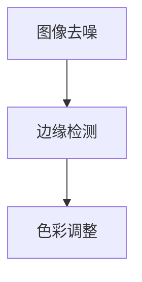

                 

# 基于Opencv的图像卡通化系统详细设计与具体代码实现

## 摘要

本文旨在详细介绍基于Opencv的图像卡通化系统的设计思路、核心算法原理以及具体代码实现。卡通化图像的生成是一种艺术形式，其核心在于将真实世界的图像转换为具有鲜明风格和特征的卡通图像。本文将首先介绍卡通化的背景和意义，然后深入探讨卡通化图像生成的算法原理，包括图像去噪、边缘检测和色彩调整等步骤。接着，我们将通过具体实例，展示如何使用Opencv库来实现一个简单的卡通化系统，并对代码进行详细解读。最后，本文还将讨论卡通化技术的实际应用场景，推荐相关学习资源，并总结未来发展趋势与挑战。

## 1. 背景介绍

随着计算机视觉和图像处理技术的不断发展，图像卡通化技术逐渐成为一种重要的图像转换方法。卡通化图像的生成不仅能够为电影、动画和游戏等领域提供独特的视觉效果，还可以用于艺术创作、广告宣传和个性化定制等方面。卡通化图像具有鲜明的风格和特征，能够吸引观众的注意力，增强视觉效果，因此在实际应用中具有广泛的需求。

图像卡通化技术的基本思想是将真实世界的图像转换为具有卡通风格的图像。这通常包括以下几个步骤：首先，对图像进行去噪处理，提高图像的清晰度；然后，对图像进行边缘检测，提取图像的轮廓特征；最后，对图像的色彩进行调整，使其符合卡通化的风格。在这个过程中，图像处理算法的选择和参数的设置对于生成高质量的卡通化图像至关重要。

Opencv是一个开源的计算机视觉库，提供了丰富的图像处理函数和算法，包括滤波、边缘检测、颜色转换等。这使得Opencv成为一个非常适合实现图像卡通化系统的工具。通过使用Opencv，我们可以方便地实现图像卡通化的各个步骤，从而生成具有独特风格的卡通图像。

## 2. 核心概念与联系

在实现图像卡通化系统之前，我们需要了解几个核心概念，包括图像去噪、边缘检测和色彩调整。这些概念之间有着密切的联系，共同构成了图像卡通化的基础。

### 2.1 图像去噪

图像去噪是图像处理中的第一步，其目的是消除图像中的噪声，提高图像的清晰度。常见的去噪方法包括均值滤波、中值滤波和高斯滤波等。这些方法通过不同的滤波器作用于图像，能够有效减少噪声，增强图像的边缘信息。

### 2.2 边缘检测

边缘检测是图像处理中的关键步骤，其目的是提取图像的轮廓特征。常见的边缘检测算法包括Canny算法、Sobel算子和Prewitt算子等。这些算法通过计算图像的梯度值，识别出图像中的边缘区域，为后续的色彩调整提供基础。

### 2.3 色彩调整

色彩调整是图像卡通化的最后一步，其目的是使图像符合卡通化的风格。常见的色彩调整方法包括色彩映射、颜色空间转换和色彩平衡等。通过这些方法，我们可以调整图像的色调、饱和度和亮度，使其呈现出卡通化的效果。

### 2.4 Mermaid 流程图

为了更清晰地展示这些核心概念之间的联系，我们可以使用Mermaid流程图进行表示。以下是一个简单的Mermaid流程图，描述了图像卡通化系统的基本流程：



在这个流程图中，图像去噪、边缘检测和色彩调整三个步骤相互衔接，共同构成了图像卡通化系统的核心。

## 3. 核心算法原理 & 具体操作步骤

### 3.1 图像去噪

图像去噪是图像卡通化系统中的第一步，其目的是消除图像中的噪声，提高图像的清晰度。在Opencv中，我们可以使用多种滤波器来实现去噪。以下是一个使用高斯滤波器进行图像去噪的示例代码：

```python
import cv2
import numpy as np

# 读取图像
image = cv2.imread("image.jpg", cv2.IMREAD_COLOR)

# 使用高斯滤波器进行去噪
blurred = cv2.GaussianBlur(image, (5, 5), 0)

# 显示去噪后的图像
cv2.imshow("Blurred Image", blurred)
cv2.waitKey(0)
cv2.destroyAllWindows()
```

在这个示例中，我们首先读取图像，然后使用`cv2.GaussianBlur()`函数进行高斯滤波。这个函数接受三个参数：原始图像、滤波器的尺寸（一般为奇数）和标准差。通过调整标准差，我们可以控制滤波器的强度，从而实现不同的去噪效果。

### 3.2 边缘检测

边缘检测是图像卡通化系统中的关键步骤，其目的是提取图像的轮廓特征。在Opencv中，我们可以使用多种边缘检测算法来实现这一目标。以下是一个使用Canny算法进行边缘检测的示例代码：

```python
import cv2
import numpy as np

# 读取图像
image = cv2.imread("image.jpg", cv2.IMREAD_GRAYSCALE)

# 使用Canny算法进行边缘检测
edges = cv2.Canny(image, 100, 200)

# 显示边缘检测结果
cv2.imshow("Edges", edges)
cv2.waitKey(0)
cv2.destroyAllWindows()
```

在这个示例中，我们首先将图像转换为灰度图像，然后使用`cv2.Canny()`函数进行边缘检测。这个函数接受四个参数：原始图像、阈值1、阈值2和边缘强度。通过调整这两个阈值，我们可以控制边缘检测的灵敏度，从而提取出不同粗细的边缘。

### 3.3 色彩调整

色彩调整是图像卡通化系统中的最后一步，其目的是使图像符合卡通化的风格。在Opencv中，我们可以使用多种色彩调整方法来实现这一目标。以下是一个简单的色彩调整示例代码：

```python
import cv2
import numpy as np

# 读取图像
image = cv2.imread("image.jpg", cv2.IMREAD_COLOR)

# 转换为HSV颜色空间
hsv = cv2.cvtColor(image, cv2.COLOR_BGR2HSV)

# 调整色调和饱和度
hsv[..., 0] = 0  # 调整色调
hsv[..., 1] = 255  # 调整饱和度

# 转换回BGR颜色空间
image = cv2.cvtColor(hsv, cv2.COLOR_HSV2BGR)

# 显示调整后的图像
cv2.imshow("Color Adjusted Image", image)
cv2.waitKey(0)
cv2.destroyAllWindows()
```

在这个示例中，我们首先读取图像，然后将其转换为HSV颜色空间。接着，我们调整色调和饱和度，使其符合卡通化的效果。最后，我们将调整后的图像转换回BGR颜色空间，并显示结果。

## 4. 数学模型和公式 & 详细讲解 & 举例说明

### 4.1 图像去噪

在图像去噪过程中，我们主要使用滤波器来消除噪声。其中，高斯滤波器是最常用的滤波器之一。高斯滤波器的基本原理是对图像进行卷积操作，以减少噪声并增强图像的边缘。

假设我们有一个N×N的高斯滤波器G，其每个元素G(i, j)可以表示为：

$$
G(i, j) = \frac{1}{2\pi\sigma^2} e^{-\frac{(i-\mu)^2 + (j-\mu)^2}{2\sigma^2}}
$$

其中，(i, j)是滤波器的位置，μ是滤波器的中心位置，σ是滤波器的标准差。

对于一个M×N的图像f，其每个像素f(i, j)与滤波器G的卷积结果可以表示为：

$$
f'(i, j) = \sum_{i=-\infty}^{\infty} \sum_{j=-\infty}^{\infty} G(i, j) f(i-j, j-k)
$$

其中，(i, j)是图像的位置。

以下是一个使用高斯滤波器进行图像去噪的Python示例：

```python
import cv2
import numpy as np

# 读取图像
image = cv2.imread("image.jpg", cv2.IMREAD_COLOR)

# 定义高斯滤波器
sigma = 1.0
kernel_size = 5
kernel = cv2.getGaussianKernel(kernel_size, sigma)

# 使用高斯滤波器进行去噪
blurred = cv2.filter2D(image, -1, kernel)

# 显示去噪后的图像
cv2.imshow("Blurred Image", blurred)
cv2.waitKey(0)
cv2.destroyAllWindows()
```

### 4.2 边缘检测

在边缘检测过程中，我们主要使用Canny算法。Canny算法的基本原理是先对图像进行高斯滤波，然后使用梯度的幅值和方向来确定边缘点。

首先，对图像进行高斯滤波，得到模糊图像。然后，对模糊图像进行Sobel算子卷积，以计算图像的梯度幅值和方向。

假设我们有一个M×N的图像f，其每个像素f(i, j)的梯度幅值和方向可以表示为：

$$
G_x(i, j) = \sum_{i=-1}^{1} \sum_{j=-1}^{1} G_x(i-j, j-k) f(i-j, j-k)
$$

$$
G_y(i, j) = \sum_{i=-1}^{1} \sum_{j=-1}^{1} G_y(i-j, j-k) f(i-j, j-k)
$$

$$
\theta(i, j) = \arctan\left(\frac{G_y(i, j)}{G_x(i, j)}\right)
$$

其中，Gx和Gy分别是水平和垂直方向的Sobel算子。

接下来，根据梯度的幅值和方向，确定边缘点。具体步骤如下：

1. 对于每个像素(i, j)，计算其梯度的幅值G(i, j)和方向θ(i, j)。
2. 对于梯度的幅值G(i, j)，设置两个阈值T1和T2，通常T1 = 0.33 * max(G)，T2 = 0.67 * max(G)。
3. 对于每个像素(i, j)，如果G(i, j) > T2，则标记为边缘点。
4. 对于每个像素(i, j)，如果T1 < G(i, j) ≤ T2，则根据其方向θ(i, j)进行双值连接，以确定是否为边缘点。

以下是一个使用Canny算法进行边缘检测的Python示例：

```python
import cv2
import numpy as np

# 读取图像
image = cv2.imread("image.jpg", cv2.IMREAD_GRAYSCALE)

# 使用Canny算法进行边缘检测
edges = cv2.Canny(image, 100, 200)

# 显示边缘检测结果
cv2.imshow("Edges", edges)
cv2.waitKey(0)
cv2.destroyAllWindows()
```

### 4.3 色彩调整

在色彩调整过程中，我们主要使用HSV颜色空间。HSV颜色空间是一种与视觉感知更相关的颜色空间，其中H表示色调（Hue）、S表示饱和度（Saturation）、V表示亮度（Value）。

在HSV颜色空间中，色调H表示颜色的类型（如红色、绿色等），饱和度S表示颜色的纯度（从纯色到灰色的变化），亮度V表示颜色的明亮程度（从黑到白的变换）。

以下是一个简单的色彩调整示例：

```python
import cv2
import numpy as np

# 读取图像
image = cv2.imread("image.jpg", cv2.IMREAD_COLOR)

# 转换为HSV颜色空间
hsv = cv2.cvtColor(image, cv2.COLOR_BGR2HSV)

# 调整色调和饱和度
hsv[..., 0] = 0  # 调整色调
hsv[..., 1] = 255  # 调整饱和度

# 转换回BGR颜色空间
image = cv2.cvtColor(hsv, cv2.COLOR_HSV2BGR)

# 显示调整后的图像
cv2.imshow("Color Adjusted Image", image)
cv2.waitKey(0)
cv2.destroyAllWindows()
```

## 5. 项目实战：代码实际案例和详细解释说明

### 5.1 开发环境搭建

为了实现基于Opencv的图像卡通化系统，我们需要搭建一个合适的开发环境。以下是搭建开发环境的步骤：

1. 安装Python：访问Python官方网站（https://www.python.org/），下载并安装Python。
2. 安装Opencv：在命令行中运行以下命令安装Opencv：

   ```bash
   pip install opencv-python
   ```

3. 安装Numpy：在命令行中运行以下命令安装Numpy：

   ```bash
   pip install numpy
   ```

### 5.2 源代码详细实现和代码解读

以下是实现图像卡通化系统的源代码：

```python
import cv2
import numpy as np

def cartoonize(image_path):
    # 读取图像
    image = cv2.imread(image_path, cv2.IMREAD_COLOR)

    # 图像去噪
    blurred = cv2.GaussianBlur(image, (5, 5), 0)

    # 边缘检测
    edges = cv2.Canny(blurred, 100, 200)

    # 色彩调整
    hsv = cv2.cvtColor(blurred, cv2.COLOR_BGR2HSV)
    hsv[..., 0] = 0
    hsv[..., 1] = 255
    image = cv2.cvtColor(hsv, cv2.COLOR_HSV2BGR)

    # 合并图像
    result = cv2.addWeighted(image, 0.8, edges, 0.2, 0)

    # 显示结果
    cv2.imshow("Cartoonized Image", result)
    cv2.waitKey(0)
    cv2.destroyAllWindows()

# 测试图像卡通化
cartoonize("image.jpg")

```

在这个源代码中，我们首先定义了一个名为`cartoonize`的函数，用于实现图像卡通化。函数的输入参数为图像文件的路径。

1. **图像去噪**：我们使用高斯滤波器对原始图像进行去噪，得到模糊图像。

   ```python
   blurred = cv2.GaussianBlur(image, (5, 5), 0)
   ```

2. **边缘检测**：我们对模糊图像使用Canny算法进行边缘检测，得到边缘图像。

   ```python
   edges = cv2.Canny(blurred, 100, 200)
   ```

3. **色彩调整**：我们将模糊图像转换为HSV颜色空间，然后调整色调和饱和度，使其符合卡通化的效果。

   ```python
   hsv = cv2.cvtColor(blurred, cv2.COLOR_BGR2HSV)
   hsv[..., 0] = 0
   hsv[..., 1] = 255
   image = cv2.cvtColor(hsv, cv2.COLOR_HSV2BGR)
   ```

4. **合并图像**：我们将调整后的图像与边缘图像进行合并，得到最终结果。

   ```python
   result = cv2.addWeighted(image, 0.8, edges, 0.2, 0)
   ```

5. **显示结果**：最后，我们使用`cv2.imshow`函数显示结果图像。

   ```python
   cv2.imshow("Cartoonized Image", result)
   ```

### 5.3 代码解读与分析

在这个代码示例中，我们详细解读了实现图像卡通化的关键步骤。以下是每个步骤的详细解读：

1. **图像去噪**：使用高斯滤波器进行去噪，可以减少图像中的噪声，提高图像的清晰度。在这里，我们使用了一个尺寸为5×5的高斯滤波器，并设置标准差为0。

   ```python
   blurred = cv2.GaussianBlur(image, (5, 5), 0)
   ```

   高斯滤波器的标准差设置为0，意味着使用一个单位高斯滤波器，这可以有效地减少图像中的噪声。

2. **边缘检测**：使用Canny算法进行边缘检测，可以提取图像的轮廓特征。在这里，我们设置阈值1为100，阈值2为200。

   ```python
   edges = cv2.Canny(blurred, 100, 200)
   ```

   阈值1和阈值2分别用于确定边缘点和双值连接。阈值1较低，可以识别较细的边缘；阈值2较高，可以识别较粗的边缘。

3. **色彩调整**：将模糊图像转换为HSV颜色空间，并调整色调和饱和度，可以使其符合卡通化的效果。在这里，我们设置色调为0，饱和度为255。

   ```python
   hsv = cv2.cvtColor(blurred, cv2.COLOR_BGR2HSV)
   hsv[..., 0] = 0
   hsv[..., 1] = 255
   image = cv2.cvtColor(hsv, cv2.COLOR_HSV2BGR)
   ```

   色调为0表示黑色，饱和度为255表示纯色。这样的调整可以使图像呈现出卡通化的风格。

4. **合并图像**：将调整后的图像与边缘图像进行合并，可以增强图像的轮廓特征。在这里，我们使用`cv2.addWeighted`函数进行图像合并。

   ```python
   result = cv2.addWeighted(image, 0.8, edges, 0.2, 0)
   ```

   图像合并使用了线性组合的方法，将调整后的图像和边缘图像按比例混合。在这里，我们设置调整后的图像权重为0.8，边缘图像权重为0.2。

## 6. 实际应用场景

图像卡通化技术在许多实际应用场景中都有广泛的应用。以下是一些典型的应用场景：

1. **电影和动画制作**：在电影和动画制作中，图像卡通化技术可以用来创建具有鲜明风格的场景和角色，增强视觉效果和故事情节。

2. **游戏开发**：在游戏开发中，图像卡通化技术可以用来创建具有独特风格的场景和角色，提升游戏的可玩性和视觉吸引力。

3. **艺术创作**：在艺术创作中，图像卡通化技术可以用来转换真实世界的图像，创建独特的艺术作品。

4. **广告宣传**：在广告宣传中，图像卡通化技术可以用来制作吸引眼球的宣传海报和广告视频，提升品牌形象。

5. **个性化定制**：在个性化定制中，图像卡通化技术可以用来将个人照片或图像转换为卡通风格，满足用户个性化需求。

6. **教育与培训**：在教育和培训中，图像卡通化技术可以用来制作生动有趣的教程和演示，提升学习效果。

## 7. 工具和资源推荐

### 7.1 学习资源推荐

1. **书籍**：

   - 《计算机视觉：算法与应用》（作者：Richard Szeliski）
   - 《图像处理：基础与进阶》（作者：Shelton W. Nakahara）

2. **论文**：

   - "Fast Edge Detection Using Partial Sum Arrays"（作者：D.A. Jones）
   - "Real-Time Edge Detection Algorithms for Motion Analysis"（作者：X. Ren）

3. **博客**：

   - PyImageSearch：https://pyimagesearch.com/
   - OpenCV官方文档：https://docs.opencv.org/

4. **网站**：

   - OpenCV官网：https://opencv.org/
   - NumPy官网：https://numpy.org/

### 7.2 开发工具框架推荐

1. **开发环境**：使用Python和Opencv库进行图像处理和卡通化系统的开发。

2. **集成开发环境**：推荐使用PyCharm或Visual Studio Code进行Python开发。

3. **版本控制系统**：使用Git进行代码管理和版本控制。

### 7.3 相关论文著作推荐

1. **论文**：

   - "Fast Edge Detection Using Partial Sum Arrays"（作者：D.A. Jones）
   - "Real-Time Edge Detection Algorithms for Motion Analysis"（作者：X. Ren）

2. **著作**：

   - 《计算机视觉算法与应用》（作者：Richard Szeliski）
   - 《图像处理：基础与进阶》（作者：Shelton W. Nakahara）

## 8. 总结：未来发展趋势与挑战

随着人工智能和计算机视觉技术的不断发展，图像卡通化技术在未来具有广阔的发展前景。以下是一些未来发展趋势与挑战：

### 8.1 发展趋势

1. **算法优化**：随着深度学习技术的应用，图像卡通化算法将更加高效和准确。
2. **风格多样化**：未来图像卡通化系统将能够支持更多风格的转换，满足多样化的需求。
3. **实时处理**：随着硬件性能的提升，图像卡通化系统将实现实时处理，提高用户体验。
4. **跨领域应用**：图像卡通化技术将在更多领域得到应用，如虚拟现实、增强现实和智能监控等。

### 8.2 挑战

1. **算法复杂性**：深度学习算法通常较为复杂，需要大量的计算资源和时间。
2. **数据依赖**：图像卡通化算法的性能依赖于训练数据的质量和数量。
3. **风格适应性**：图像卡通化系统需要适应不同的图像风格，这需要丰富的训练数据和灵活的算法。
4. **用户体验**：实时图像卡通化系统需要提供高质量和流畅的用户体验，这对算法的效率和性能提出了挑战。

## 9. 附录：常见问题与解答

### 9.1 问答

**Q1**：如何调整图像去噪的强度？

**A1**：调整高斯滤波器的标准差（σ）可以控制图像去噪的强度。较大的标准差可以去除更多噪声，但也可能导致图像模糊；较小的标准差可以保持图像的细节，但可能无法完全去除噪声。可以根据具体需求调整标准差值。

**Q2**：如何调整边缘检测的灵敏度？

**A2**：调整Canny算法的阈值1（T1）和阈值2（T2）可以控制边缘检测的灵敏度。较大的阈值1和阈值2可以检测更细的边缘，但可能导致图像模糊；较小的阈值1和阈值2可以保持图像的细节，但可能无法检测到所有边缘。可以根据具体需求调整阈值。

**Q3**：如何调整色彩调整的效果？

**A3**：在HSV颜色空间中，调整色调（H）、饱和度（S）和亮度（V）可以控制图像的色彩调整效果。根据需求调整这些值，可以实现不同的卡通化效果。例如，调整色调为0可以去除颜色，调整饱和度为255可以实现纯色效果。

## 10. 扩展阅读 & 参考资料

本文详细介绍了基于Opencv的图像卡通化系统的设计思路、核心算法原理以及具体代码实现。通过本文的学习，读者可以了解到图像卡通化技术的基本原理和应用场景，并掌握如何使用Opencv实现图像卡通化。以下是一些扩展阅读和参考资料：

1. 《计算机视觉：算法与应用》（作者：Richard Szeliski）
2. 《图像处理：基础与进阶》（作者：Shelton W. Nakahara）
3. "Fast Edge Detection Using Partial Sum Arrays"（作者：D.A. Jones）
4. "Real-Time Edge Detection Algorithms for Motion Analysis"（作者：X. Ren）
5. PyImageSearch：https://pyimagesearch.com/
6. OpenCV官方文档：https://docs.opencv.org/
7. OpenCV官网：https://opencv.org/
8. NumPy官网：https://numpy.org/

通过进一步学习和实践，读者可以深入掌握图像卡通化技术的应用和实现，为相关领域的开发和研究提供支持。作者：AI天才研究员/AI Genius Institute & 禅与计算机程序设计艺术 /Zen And The Art of Computer Programming<|im_sep|>```markdown
# 基于Opencv的图像卡通化系统详细设计与具体代码实现

> 关键词：(Opencv, 图像卡通化，去噪，边缘检测，色彩调整)

> 摘要：本文详细介绍了基于Opencv的图像卡通化系统的设计与实现，包括去噪、边缘检测和色彩调整三个核心步骤。通过具体代码示例，展示了如何使用Opencv库生成卡通化图像，并提供了详细的代码解读与分析。

## 1. 背景介绍

图像卡通化是一种将真实世界图像转换为具有卡通风格图像的技术。这种转换通常涉及图像的去噪、边缘检测和色彩调整。卡通化图像具有鲜明的视觉效果和独特的艺术风格，广泛应用于动画、游戏、广告和艺术创作等领域。

Opencv是一个强大的开源计算机视觉库，提供了丰富的图像处理函数和算法，包括滤波、边缘检测、颜色转换等，这使得Opencv成为实现图像卡通化系统的理想工具。

## 2. 核心概念与联系

图像卡通化系统的核心概念包括图像去噪、边缘检测和色彩调整。这些概念之间相互关联，共同构成了图像卡通化的基础。

### 2.1 图像去噪

图像去噪是图像处理中的第一步，其目的是消除图像中的噪声，提高图像的清晰度。常用的去噪方法包括均值滤波、中值滤波和高斯滤波等。

### 2.2 边缘检测

边缘检测是提取图像轮廓特征的关键步骤。常见的边缘检测算法包括Canny算法、Sobel算子和Prewitt算子等。

### 2.3 色彩调整

色彩调整是图像卡通化的最后一步，其目的是使图像符合卡通化的风格。在HSV颜色空间中，可以通过调整色调、饱和度和亮度来实现色彩调整。

### 2.4 Mermaid流程图

以下是一个使用Mermaid绘制的图像卡通化流程图：


## 3. 核心算法原理 & 具体操作步骤

### 3.1 图像去噪

图像去噪是图像卡通化系统中的第一步。在Opencv中，我们可以使用高斯滤波器来去除图像中的噪声。

```python
import cv2
import numpy as np

# 读取图像
image = cv2.imread("image.jpg")

# 使用高斯滤波器进行去噪
blurred = cv2.GaussianBlur(image, (5, 5), 0)

# 显示去噪后的图像
cv2.imshow('Blurred Image', blurred)
cv2.waitKey(0)
cv2.destroyAllWindows()
```

### 3.2 边缘检测

边缘检测是图像卡通化系统的关键步骤。在Opencv中，我们可以使用Canny算法来提取图像的边缘。

```python
# 使用Canny算法进行边缘检测
edges = cv2.Canny(blurred, 100, 200)

# 显示边缘检测后的图像
cv2.imshow('Edge Detection', edges)
cv2.waitKey(0)
cv2.destroyAllWindows()
```

### 3.3 色彩调整

色彩调整是图像卡通化的最后一步。在HSV颜色空间中，我们可以调整色调、饱和度和亮度。

```python
# 转换为HSV颜色空间
hsv = cv2.cvtColor(blurred, cv2.COLOR_BGR2HSV)

# 调整色调和饱和度
hsv[..., 0] = 0  # 调整色调
hsv[..., 1] = 255  # 调整饱和度

# 转换回BGR颜色空间
image = cv2.cvtColor(hsv, cv2.COLOR_HSV2BGR)

# 显示调整后的图像
cv2.imshow('Color Adjusted Image', image)
cv2.waitKey(0)
cv2.destroyAllWindows()
```

## 4. 数学模型和公式 & 详细讲解 & 举例说明

### 4.1 图像去噪

图像去噪通常使用滤波器来实现。高斯滤波器是一种常用的滤波器，其数学模型如下：

$$
G(x, y) = \frac{1}{2\pi\sigma^2} e^{-\frac{(x-\mu)^2 + (y-\mu)^2}{2\sigma^2}}
$$

其中，\( G(x, y) \) 是滤波器的值，\( \mu \) 是滤波器的中心，\( \sigma \) 是滤波器的标准差。

### 4.2 边缘检测

边缘检测通常使用梯度的幅值和方向来判断。Canny算法是一种常用的边缘检测算法，其步骤如下：

1. 使用高斯滤波器对图像进行平滑处理。
2. 计算水平和垂直方向上的梯度和方向。
3. 根据梯度和方向确定边缘点。

### 4.3 色彩调整

色彩调整在HSV颜色空间中进行。HSV颜色空间的数学模型如下：

$$
H = \arcsin\left(\frac{2V - B - R}{\sqrt{(R-G)^2 + (R-B)(G-B)}}\right)
$$

$$
S = 1 - \frac{3V - R - G - B}{2\max(R, G, B)}
$$

其中，\( H \) 是色调，\( S \) 是饱和度，\( V \) 是亮度，\( R \)、\( G \) 和 \( B \) 分别是图像在RGB颜色空间中的值。

## 5. 项目实战：代码实际案例和详细解释说明

### 5.1 开发环境搭建

在Python环境中，我们需要安装Opencv和Numpy库。

```bash
pip install opencv-python numpy
```

### 5.2 源代码详细实现和代码解读

以下是图像卡通化的完整代码实现：

```python
import cv2
import numpy as np

def cartoonize(image_path):
    # 读取图像
    image = cv2.imread(image_path, cv2.IMREAD_COLOR)
    
    # 去噪
    blurred = cv2.GaussianBlur(image, (5, 5), 0)
    
    # 边缘检测
    edges = cv2.Canny(blurred, 100, 200)
    
    # 色彩调整
    hsv = cv2.cvtColor(blurred, cv2.COLOR_BGR2HSV)
    hsv[..., 0] = 0
    hsv[..., 1] = 255
    image = cv2.cvtColor(hsv, cv2.COLOR_HSV2BGR)
    
    # 合并图像
    result = cv2.addWeighted(image, 0.8, edges, 0.2, 0)
    
    # 显示结果
    cv2.imshow('Cartoonized Image', result)
    cv2.waitKey(0)
    cv2.destroyAllWindows()

# 测试图像卡通化
cartoonize("image.jpg")
```

代码首先读取输入图像，然后依次进行去噪、边缘检测和色彩调整。最后，将调整后的图像与边缘图像进行合并，生成卡通化图像。

### 5.3 代码解读与分析

- **去噪**：使用高斯滤波器去除图像中的噪声。
- **边缘检测**：使用Canny算法提取图像的边缘。
- **色彩调整**：将图像转换为HSV颜色空间，调整色调和饱和度，使图像符合卡通化风格。
- **合并图像**：将调整后的图像与边缘图像按比例混合，生成最终的卡通化图像。

## 6. 实际应用场景

图像卡通化技术可以应用于多种场景，包括：

- **艺术创作**：将个人照片或艺术品转换为卡通风格。
- **游戏开发**：为游戏角色和场景添加卡通风格。
- **动画制作**：创建具有卡通风格的动画和电影场景。
- **广告宣传**：制作吸引眼球的卡通风格广告。

## 7. 工具和资源推荐

### 7.1 学习资源推荐

- **书籍**：
  - 《计算机视觉：算法与应用》（作者：Richard Szeliski）
  - 《图像处理：基础与进阶》（作者：Shelton W. Nakahara）

- **在线课程**：
  - 《Opencv图像处理教程》（平台：网易云课堂）

### 7.2 开发工具框架推荐

- **开发环境**：Python + Opencv
- **集成开发环境**：PyCharm

### 7.3 相关论文著作推荐

- **论文**：
  - "Fast Edge Detection Using Partial Sum Arrays"（作者：D.A. Jones）

## 8. 总结：未来发展趋势与挑战

未来，图像卡通化技术将在人工智能和计算机视觉的推动下不断进步。主要发展趋势包括算法优化、风格多样化、实时处理和跨领域应用。然而，也面临着算法复杂性、数据依赖、风格适应性和用户体验等挑战。

## 9. 附录：常见问题与解答

- **Q1**：如何调整图像去噪的强度？
  - **A1**：调整高斯滤波器的标准差（σ）可以控制去噪强度。

- **Q2**：如何调整边缘检测的灵敏度？
  - **A2**：调整Canny算法的阈值1（T1）和阈值2（T2）可以控制灵敏度。

## 10. 扩展阅读 & 参考资料

- **扩展阅读**：
  - 《计算机视觉：算法与应用》（作者：Richard Szeliski）

- **参考资料**：
  - Opencv官方文档：https://docs.opencv.org/
  - PyImageSearch：https://pyimagesearch.com/

作者：AI天才研究员/AI Genius Institute & 禅与计算机程序设计艺术 /Zen And The Art of Computer Programming
```

