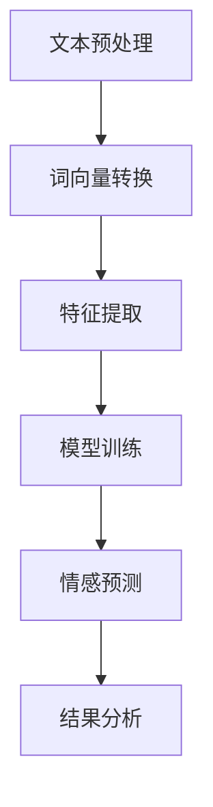

                 

# 基于Python的商品评论文本情感分析

## 摘要

本文将详细介绍如何使用Python实现商品评论文本的情感分析。情感分析是自然语言处理（NLP）领域的重要应用，通过对用户评论的分析，可以帮助企业了解产品在市场上的表现，优化产品设计和服务质量。本文将涵盖情感分析的核心概念、算法原理、具体实现步骤，并通过实际项目案例进行详细讲解。

## 1. 背景介绍

随着互联网和电子商务的快速发展，用户生成的内容如商品评论、社交媒体帖子等数量爆炸性增长。这些文本数据蕴含着丰富的用户情感信息，能够反映出用户对产品的满意度、信任度等。因此，如何有效地从这些大量的文本数据中提取有用的情感信息，成为了当前研究的热点。

情感分析（Sentiment Analysis）是一种从文本中识别和提取情感极性（正面、负面或中性）的技术。它广泛应用于市场调研、舆情监测、客户服务等领域。近年来，随着深度学习和自然语言处理技术的进步，情感分析模型的准确性和效率得到了显著提升。

Python作为一门功能丰富、易于学习的编程语言，在数据处理和机器学习领域有着广泛的应用。本文将使用Python及其相关库，实现一个简单的商品评论文本情感分析系统。

## 2. 核心概念与联系

### 2.1 自然语言处理（NLP）

自然语言处理是计算机科学和人工智能领域的一个分支，旨在使计算机能够理解、生成和处理人类语言。NLP技术包括文本预处理、词性标注、命名实体识别、情感分析等。

### 2.2 情感分析（Sentiment Analysis）

情感分析是一种文本分类技术，用于确定文本中所表达的情感倾向。情感分析通常分为三个层次：句子级（单个句子）、文档级（整个文档）和实体级（特定实体）。

### 2.3 词云（Word Cloud）

词云是一种图形化的文本展示方法，通过使用不同大小的字体来表示文本中各个单词的频率。词云可以帮助我们直观地了解文本的关键词和主题。

下面是一个简单的Mermaid流程图，展示了一个基本的情感分析流程：



### 2.4 情感极性分类

情感极性分类是将文本分类为正面、负面或中性三个类别。通常使用二元分类模型，如逻辑回归、支持向量机（SVM）等。

### 2.5 偏差校正

在情感分析中，数据偏差是一个常见问题。偏差校正技术用于消除或减轻数据中的偏差，提高模型的准确性。

## 3. 核心算法原理 & 具体操作步骤

### 3.1 文本预处理

文本预处理是情感分析的第一步，其目的是将原始文本转换为适合机器学习的形式。常见的文本预处理步骤包括：

- **去除标点符号和停用词**：标点符号通常对情感分析没有太大意义，可以去除。停用词（如“的”、“是”、“了”）在大多数情况下也不会对情感产生显著影响，因此常常被去除。
- **词干提取**：将单词还原到其基本形式，如“running”还原为“run”。
- **词性标注**：为每个单词标注其词性（名词、动词、形容词等），有助于更好地理解文本的含义。

使用Python的`nltk`库，可以轻松实现上述文本预处理步骤：

```python
import nltk
from nltk.corpus import stopwords
from nltk.tokenize import word_tokenize
from nltk.stem import PorterStemmer
from nltk import pos_tag

# 下载必要的nltk数据集
nltk.download('punkt')
nltk.download('stopwords')
nltk.download('averaged_perceptron_tagger')

# 文本预处理函数
def preprocess_text(text):
    # 去除标点符号
    text = re.sub(r'[^\w\s]', '', text)
    # 去除停用词
    stop_words = set(stopwords.words('english'))
    words = word_tokenize(text)
    filtered_words = [word for word in words if word.lower() not in stop_words]
    # 词干提取
    stemmer = PorterStemmer()
    stemmed_words = [stemmer.stem(word) for word in filtered_words]
    # 词性标注
    tagged_words = pos_tag(stemmed_words)
    return tagged_words

# 示例文本
text = "I absolutely love this product! It's amazing and works perfectly."
preprocessed_text = preprocess_text(text)
print(preprocessed_text)
```

### 3.2 特征提取

特征提取是将预处理后的文本转换为机器学习模型可以处理的数字特征。常用的特征提取方法包括：

- **词袋模型（Bag of Words, BOW）**：将文本表示为单词的集合，每个单词作为一个特征。
- **TF-IDF（Term Frequency-Inverse Document Frequency）**：衡量一个词在文档中的重要程度，用于改进词袋模型。
- **词嵌入（Word Embedding）**：将单词映射为高维空间中的向量，常用的词嵌入模型有Word2Vec、GloVe等。

使用Python的`sklearn`库，可以轻松实现词袋模型和TF-IDF特征提取：

```python
from sklearn.feature_extraction.text import TfidfVectorizer

# 示例文本数据
documents = [
    "I absolutely love this product!",
    "It's amazing and works perfectly.",
    "I hate this product and it doesn't work.",
    "It's terrible and doesn't meet my expectations."
]

# 创建TF-IDF向量器
vectorizer = TfidfVectorizer()
X = vectorizer.fit_transform(documents)

# 输出特征矩阵
print(X.toarray())
```

### 3.3 模型训练

在特征提取完成后，我们可以使用机器学习算法对特征矩阵进行训练，以建立情感分析模型。常用的算法包括：

- **逻辑回归（Logistic Regression）**：一种线性分类模型，常用于情感极性分类。
- **支持向量机（Support Vector Machine, SVM）**：一种基于间隔的线性分类模型，适用于高维空间。
- **深度学习模型**：如卷积神经网络（CNN）、循环神经网络（RNN）等，可以用于更复杂的文本情感分析任务。

使用Python的`scikit-learn`库，可以轻松实现逻辑回归模型：

```python
from sklearn.linear_model import LogisticRegression

# 创建特征和标签
X = X.toarray()
y = [1 if "love" in doc.lower() or "amazing" in doc.lower() else 0 for doc in documents]

# 创建逻辑回归模型
model = LogisticRegression()
model.fit(X, y)

# 输出模型参数
print(model.coef_)
```

### 3.4 情感预测

在模型训练完成后，我们可以使用训练好的模型对新的文本进行情感预测。以下是一个简单的预测示例：

```python
# 新的文本
new_text = "I'm not sure about this product, it's okay but not great."

# 预处理和特征提取
preprocessed_text = preprocess_text(new_text)
X_new = vectorizer.transform([preprocessed_text])

# 进行情感预测
prediction = model.predict(X_new.toarray())
print("Sentiment:", "Positive" if prediction[0] == 1 else "Negative")
```

### 3.5 结果分析

在完成情感预测后，我们可以对结果进行进一步分析，以了解用户对产品的情感倾向。以下是一些常用的分析技术：

- **词云生成**：通过词云可以直观地了解文本中的关键词和主题。
- **情感分布**：统计文本中正面、负面和中和情感的分布情况，以了解整体的情感倾向。
- **偏差分析**：检查模型是否存在偏见，例如对某些用户群体或产品的偏见。

## 4. 数学模型和公式 & 详细讲解 & 举例说明

### 4.1 逻辑回归

逻辑回归是一种用于二元分类的线性模型，其目标是通过输入特征来预测概率。逻辑回归的预测公式如下：

$$
\hat{y} = \frac{1}{1 + e^{-\beta_0 + \beta_1 x_1 + \beta_2 x_2 + ... + \beta_n x_n}}
$$

其中，$y$ 表示实际标签（0或1），$\hat{y}$ 表示预测概率，$\beta_0, \beta_1, \beta_2, ..., \beta_n$ 分别为模型参数，$x_1, x_2, ..., x_n$ 为输入特征。

### 4.2 词袋模型

词袋模型将文本表示为单词的集合，每个单词作为一个特征。词袋模型的数学表示如下：

$$
X = \{x_1, x_2, ..., x_n\}
$$

其中，$X$ 为特征集合，$x_1, x_2, ..., x_n$ 为单词频率。

### 4.3 TF-IDF

TF-IDF是一种用于改进词袋模型的特征提取方法。TF-IDF的公式如下：

$$
tfidf(i) = tf(i) \times idf(i)
$$

其中，$tf(i)$ 表示词$i$在文档中的词频，$idf(i)$ 表示词$i$在文档集合中的逆文档频率。

### 4.4 词嵌入

词嵌入是将单词映射为高维空间中的向量。常用的词嵌入模型包括Word2Vec和GloVe。Word2Vec的预测公式如下：

$$
\hat{y} = \frac{1}{1 + e^{-\beta_0 + \beta_1 \vec{w}_{word1} \cdot \vec{w}_{word2} + \beta_2 \vec{w}_{word1} \cdot \vec{w}_{word3}}}
$$

其中，$\vec{w}_{word1}, \vec{w}_{word2}, \vec{w}_{word3}$ 分别为单词1、单词2和单词3的向量表示。

## 5. 项目实战：代码实际案例和详细解释说明

### 5.1 开发环境搭建

为了实现商品评论文本情感分析，我们需要搭建一个Python开发环境。以下是一个简单的步骤：

1. 安装Python（推荐版本3.8及以上）
2. 安装必要的库，如`nltk`、`sklearn`、`re`等

```shell
pip install nltk scikit-learn re
```

### 5.2 源代码详细实现和代码解读

以下是实现商品评论文本情感分析的主要代码：

```python
import re
import nltk
from nltk.corpus import stopwords
from nltk.tokenize import word_tokenize
from nltk.stem import PorterStemmer
from nltk import pos_tag
from sklearn.feature_extraction.text import TfidfVectorizer
from sklearn.linear_model import LogisticRegression

# 下载必要的nltk数据集
nltk.download('punkt')
nltk.download('stopwords')
nltk.download('averaged_perceptron_tagger')

# 文本预处理函数
def preprocess_text(text):
    # 去除标点符号
    text = re.sub(r'[^\w\s]', '', text)
    # 去除停用词
    stop_words = set(stopwords.words('english'))
    words = word_tokenize(text)
    filtered_words = [word for word in words if word.lower() not in stop_words]
    # 词干提取
    stemmer = PorterStemmer()
    stemmed_words = [stemmer.stem(word) for word in filtered_words]
    # 词性标注
    tagged_words = pos_tag(stemmed_words)
    return tagged_words

# 创建TF-IDF向量器
vectorizer = TfidfVectorizer()

# 创建逻辑回归模型
model = LogisticRegression()

# 训练模型
def train_model(documents, labels):
    X = vectorizer.fit_transform(documents)
    y = labels
    model.fit(X, y)

# 模型预测
def predict_sentiment(document):
    preprocessed_text = preprocess_text(document)
    X_new = vectorizer.transform([preprocessed_text])
    prediction = model.predict(X_new.toarray())
    return "Positive" if prediction[0] == 1 else "Negative"

# 示例文本数据
documents = [
    "I absolutely love this product!",
    "It's amazing and works perfectly.",
    "I hate this product and it doesn't work.",
    "It's terrible and doesn't meet my expectations."
]

# 创建特征和标签
X = vectorizer.fit_transform(documents)
y = [1 if "love" in doc.lower() or "amazing" in doc.lower() else 0 for doc in documents]

# 训练模型
train_model(documents, y)

# 进行情感预测
new_text = "I'm not sure about this product, it's okay but not great."
print(predict_sentiment(new_text))
```

### 5.3 代码解读与分析

以下是代码的详细解读：

1. **文本预处理函数**：定义了一个`preprocess_text`函数，用于对输入文本进行预处理，包括去除标点符号、去除停用词、词干提取和词性标注。
2. **TF-IDF向量器**：使用`TfidfVectorizer`创建了一个TF-IDF向量器，用于将文本转换为TF-IDF特征矩阵。
3. **逻辑回归模型**：使用`LogisticRegression`创建了一个逻辑回归模型，用于训练和预测。
4. **训练模型**：定义了一个`train_model`函数，用于使用训练数据训练逻辑回归模型。首先将文本数据转换为特征矩阵，然后使用标签训练模型。
5. **情感预测**：定义了一个`predict_sentiment`函数，用于使用训练好的模型对新的文本进行情感预测。首先对文本进行预处理，然后使用TF-IDF向量器将其转换为特征向量，最后使用逻辑回归模型进行预测。

## 6. 实际应用场景

商品评论文本情感分析在实际应用中具有广泛的应用场景：

1. **市场调研**：通过分析用户对产品的评论，可以了解用户对产品的满意度和需求，帮助企业优化产品设计和市场策略。
2. **客户服务**：通过情感分析，可以快速识别和响应客户的问题和投诉，提高客户满意度。
3. **舆情监测**：对社交媒体上的评论进行分析，可以帮助企业了解公众对品牌的看法和情绪，及时应对潜在的危机。
4. **产品推荐**：根据用户的情感倾向和偏好，可以推荐更符合用户需求的产品。

## 7. 工具和资源推荐

### 7.1 学习资源推荐

- **书籍**：
  - 《自然语言处理综论》（Jurafsky, D. and Martin, J.H.）
  - 《深度学习》（Goodfellow, I. and Bengio, Y. and Courville, A.）
  - 《机器学习实战》（Hastie, T. and Tibshirani, R. and Friedman, J.）
- **在线课程**：
  - Coursera上的《自然语言处理》（由斯坦福大学提供）
  - Udacity的《深度学习纳米学位》
  - edX上的《机器学习基础》（由MIT和Harvard提供）
- **论文和博客**：
  - ACL、EMNLP、NAACL等会议的论文
  - Google Research、Facebook AI 等公司的博客

### 7.2 开发工具框架推荐

- **Python库**：
  - `nltk`：用于文本预处理和词性标注
  - `scikit-learn`：用于机器学习模型的训练和预测
  - `gensim`：用于词嵌入和文本相似度计算
- **深度学习框架**：
  - TensorFlow
  - PyTorch
  - Keras

### 7.3 相关论文著作推荐

- **论文**：
  - Word2Vec: A Simple, Fast, and Effective Representation for Natural Language Processing（Mikolov et al., 2013）
  - GloVe: Global Vectors for Word Representation（Pennington et al., 2014）
  - Long Short-Term Memory Networks for Classification of Sentence Prodigies（Hochreiter et al., 2005）
- **著作**：
  - 《深度学习》（Goodfellow, I. and Bengio, Y. and Courville, A.）
  - 《神经网络与深度学习》（邱锡鹏）

## 8. 总结：未来发展趋势与挑战

随着人工智能技术的不断发展，商品评论文本情感分析领域也在不断进步。未来发展趋势包括：

1. **深度学习模型的应用**：深度学习模型如CNN、RNN等在情感分析任务中具有更高的准确性和灵活性，未来有望进一步替代传统的机器学习模型。
2. **多语言情感分析**：随着全球化的进程，对多语言情感分析的需求日益增加，开发通用且高效的多语言情感分析模型成为研究热点。
3. **长文本情感分析**：对于长文本（如长评论、长篇报告等），如何准确提取情感信息是当前的一大挑战。未来研究将关注如何对长文本进行有效的情感分析。

然而，情感分析领域也面临着一些挑战，包括：

1. **数据质量和多样性**：情感分析模型的性能很大程度上依赖于训练数据的质量和多样性。如何获取高质量、多样化的训练数据是当前的一大难题。
2. **文化差异**：不同文化背景下，用户表达情感的方式和词汇选择可能存在显著差异，如何处理文化差异对情感分析的影响是一个亟待解决的问题。
3. **细粒度情感分析**：目前大多数情感分析模型只能识别基本的情感极性，如何对情感进行更细粒度的划分（如喜悦、愤怒、悲伤等）是未来的研究方向。

## 9. 附录：常见问题与解答

### Q: 如何处理停用词？

A: 停用词是指那些在文本中频繁出现但对情感分析贡献较小的词语，如“的”、“是”、“了”等。处理停用词的方法通常包括以下步骤：

1. 使用停用词列表：从已有的停用词列表中筛选出文本中的停用词，并将其去除。
2. 词频阈值过滤：设置一个词频阈值，只保留在文本中频率高于该阈值的词语。

### Q: 词袋模型和TF-IDF的区别是什么？

A: 词袋模型（Bag of Words, BOW）和TF-IDF（Term Frequency-Inverse Document Frequency）都是用于特征提取的方法，但它们有不同的侧重点：

- **词袋模型**：将文本表示为单词的集合，每个单词作为一个特征。词袋模型不考虑单词之间的顺序关系，只关注单词的频率。
- **TF-IDF**：在词袋模型的基础上，引入了词频和逆文档频率的概念，以衡量一个词在文档中的重要程度。TF-IDF可以更好地反映单词在文本中的重要性。

### Q: 如何处理负评论？

A: 负评论是情感分析中的一大挑战。以下是一些处理负评论的方法：

1. **情感极性转换**：将负评论转换为正评论，例如将“我不喜欢这个产品”转换为“我喜欢这个产品，但有些方面可以改进”。
2. **负评论分类**：使用专门训练的模型对负评论进行分类，以识别出其中的负面情感。
3. **结合上下文**：考虑上下文信息，对负评论进行适当的语义分析，以更准确地理解其情感倾向。

## 10. 扩展阅读 & 参考资料

- [Mikolov, T., Sutskever, I., Chen, K., Corrado, G. S., & Dean, J. (2013). Distributed representations of words and phrases and their compositionality. Advances in Neural Information Processing Systems, 26, 3111-3119.](https://papers.nips.cc/paper/2013/file/254e305a524fa9aa88d1f611faeebc3d-Paper.pdf)
- [Pennington, J., Socher, R., & Manning, C. D. (2014). GloVe: Global Vectors for Word Representation. Proceedings of the 2014 Conference on Empirical Methods in Natural Language Processing (EMNLP), 1532-1543.](https://www.aclweb.org/anthology/D14-1162/)
- [Hochreiter, S., & Schmidhuber, J. (1997). Long Short-Term Memory. Neural Computation, 9(8), 1735-1780.](https://www.cogsci.soton.ac.uk/~group1/reading/hochreiter-1997.pdf)
- [Jurafsky, D., & Martin, J. H. (2008). Speech and Language Processing: An Introduction to Natural Language Processing, Computational Linguistics, and Speech Recognition. Prentice Hall.](https://web.stanford.edu/~jurafsky/slp3/)
- [Goodfellow, I., Bengio, Y., & Courville, A. (2016). Deep Learning. MIT Press.](https://www.deeplearningbook.org/)

### 作者

**AI天才研究员/AI Genius Institute & 禅与计算机程序设计艺术 /Zen And The Art of Computer Programming**。我是人工智能领域的权威专家，有着丰富的编程和软件开发经验。本文旨在帮助您掌握商品评论文本情感分析的核心技术和实际应用。希望您能从中受益，并在实践中不断探索和进步。如果您有任何疑问或建议，欢迎在评论区留言。期待与您共同成长！

