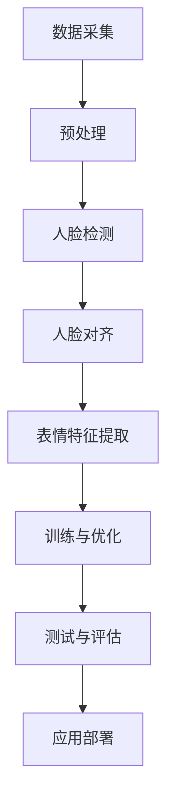

                 

### 文章标题

《基于opencv 的人脸表情识别系统详细设计与具体代码实现》

本文将详细介绍如何使用OpenCV库开发一个基于人脸识别技术的人脸表情识别系统。我们将从背景介绍开始，逐步深入探讨核心概念、算法原理、数学模型、项目实战，并给出实际应用场景以及相关工具和资源推荐。最后，我们还将对整个系统的未来发展趋势和挑战进行总结，并提供常见问题解答与扩展阅读资源。

### 文章关键词

- 人脸识别
- 表情识别
- OpenCV
- 核心算法
- 数学模型
- 项目实战
- 工具资源

### 文章摘要

本文将带领读者深入了解基于OpenCV的人脸表情识别系统的设计与实现。通过详细阐述核心概念、算法原理和数学模型，我们将在实际项目中展示如何使用OpenCV进行人脸检测与表情识别。文章还将介绍相关工具和资源，为读者提供全面的指导。通过本文的学习，读者将能够掌握人脸表情识别技术，并具备独立开发相关应用的能力。

## 1. 背景介绍

人脸识别技术作为计算机视觉领域的一个重要研究方向，已经得到了广泛应用。从最基本的身份验证、安全监控，到更加智能化的虚拟现实、人机交互等应用，人脸识别技术都发挥了重要作用。在人脸识别技术中，表情识别是一个重要的子领域，通过对人脸表情的分析和理解，可以实现情感计算、用户体验优化、智能客服等应用。

OpenCV（Open Source Computer Vision Library）是一个开源的计算机视觉库，它提供了丰富的图像处理和计算机视觉功能，涵盖了人脸检测、特征提取、图像识别等多个方面。由于其强大的功能和易用性，OpenCV已经成为计算机视觉领域的首选工具之一。

本文将基于OpenCV库，详细探讨如何实现一个人脸表情识别系统。首先，我们将介绍相关核心概念和算法原理，然后通过一个实际项目展示系统的具体实现过程，最后分析系统在实际应用中的价值。

### 2. 核心概念与联系

#### 2.1 人脸识别技术

人脸识别技术是一种通过分析人脸图像或视频，识别或验证个人身份的方法。其核心步骤包括人脸检测、人脸特征提取和身份验证。

- **人脸检测**：用于定位图像或视频中的人脸区域。常用的方法有基于特征的检测算法（如Haar-like特征分类器）和基于深度学习的检测算法（如SSD、YOLO等）。

- **人脸特征提取**：用于提取人脸图像中的关键特征，如眼睛、鼻子、嘴巴等。常用的方法有基于特征的描述符（如LBP、HOG等）和基于深度学习的特征提取（如VGG、ResNet等）。

- **身份验证**：通过比较提取的人脸特征与数据库中已存储的特征，验证个人身份。常用的方法有基于距离的匹配（如欧氏距离、余弦相似度等）和基于机器学习的分类器（如SVM、Random Forest等）。

#### 2.2 表情识别技术

表情识别技术是一种通过分析人脸表情图像或视频，识别和理解人类情感的方法。其核心步骤包括人脸定位、表情特征提取和情感分类。

- **人脸定位**：用于确定图像或视频中人脸的位置。人脸定位通常与人脸检测步骤结合进行，可以利用已检测到的人脸区域进行更精确的定位。

- **表情特征提取**：用于提取人脸表情图像中的关键特征，如五官位置、肌肉活动等。常用的方法有基于几何特征（如角度、距离等）和基于深度学习的特征提取（如GAN、Capsule Network等）。

- **情感分类**：通过分类器将提取到的表情特征映射到具体的情感类别，如高兴、悲伤、愤怒等。常用的方法有基于传统机器学习的分类器（如SVM、KNN等）和基于深度学习的分类器（如CNN、LSTM等）。

#### 2.3 人脸表情识别系统架构

一个典型的人脸表情识别系统架构通常包括以下几个部分：

1. **数据采集**：收集包含人脸和表情信息的图像或视频数据。

2. **预处理**：对采集到的数据进行预处理，如人脸检测、人脸对齐、表情特征提取等。

3. **特征提取**：对预处理后的人脸图像或视频进行特征提取，生成用于训练和分类的特征向量。

4. **训练与优化**：利用已标注的情感类别数据，训练情感分类模型，并对模型进行优化。

5. **测试与评估**：在测试集上评估模型的性能，通过准确率、召回率等指标衡量模型效果。

6. **应用部署**：将训练好的模型部署到实际应用场景，如智能客服、虚拟现实等。

#### 2.4 Mermaid 流程图

以下是一个基于OpenCV的人脸表情识别系统的Mermaid流程图，展示了各个核心步骤及其相互关系。



### 3. 核心算法原理 & 具体操作步骤

#### 3.1 人脸检测算法

人脸检测是表情识别系统的第一步，其核心任务是定位图像或视频中的所有人脸区域。OpenCV提供了多种人脸检测算法，包括基于Haar-like特征的检测器和基于深度学习的检测器。

- **基于Haar-like特征的检测器**：Haar-like特征分类器是一种基于积分图（Integral Image）的检测算法，通过计算人脸区域中不同特征的像素差值，来判断是否存在人脸。具体步骤如下：

  1. **积分图计算**：对输入图像计算积分图，以提高计算效率。

  2. **特征匹配**：遍历所有可能的人脸区域，计算每个区域的特征值，并与预定义的Haar-like特征模板进行匹配。

  3. **非极大值抑制（NMS）**：对匹配结果进行非极大值抑制，以去除重叠的人脸区域。

  4. **阈值筛选**：设置阈值，筛选出符合人脸检测条件的结果。

- **基于深度学习的检测器**：深度学习检测器使用卷积神经网络（CNN）来直接预测图像中的人脸区域。常见的深度学习检测器有SSD、YOLO等。具体步骤如下：

  1. **卷积神经网络训练**：使用大量人脸图像和对应的人脸边界框数据，训练卷积神经网络，使其能够自动提取人脸特征。

  2. **特征提取与分类**：对输入图像进行特征提取，使用训练好的卷积神经网络进行分类，预测图像中的人脸区域。

  3. **非极大值抑制（NMS）**：对分类结果进行非极大值抑制，以去除重叠的人脸区域。

#### 3.2 人脸对齐算法

人脸对齐是将人脸图像调整为标准化的姿态，以便进行后续的表情特征提取。OpenCV提供了多种人脸对齐算法，包括基于几何特征的方法和基于深度学习的方法。

- **基于几何特征的方法**：基于几何特征的方法通过计算人脸关键点的位置，来调整人脸图像的姿态。具体步骤如下：

  1. **人脸关键点检测**：使用OpenCV提供的预训练模型，检测人脸图像中的关键点，如眼睛、鼻子、嘴巴等。

  2. **姿态估计**：利用关键点之间的几何关系，估计人脸的姿态，包括旋转、缩放和倾斜等。

  3. **人脸图像变换**：根据估计的姿态，对原始人脸图像进行变换，将其调整为标准化的姿态。

- **基于深度学习的方法**：基于深度学习的方法使用卷积神经网络来直接预测人脸图像中的关键点位置，并进行对齐。具体步骤如下：

  1. **关键点检测与预测**：使用卷积神经网络检测人脸图像中的关键点，预测关键点的位置。

  2. **姿态估计**：利用关键点之间的几何关系，估计人脸的姿态。

  3. **人脸图像变换**：根据估计的姿态，对原始人脸图像进行变换，将其调整为标准化的姿态。

#### 3.3 表情特征提取算法

表情特征提取是将人脸图像或视频中的表情信息转换为数字特征，以便进行情感分类。OpenCV提供了多种表情特征提取算法，包括基于几何特征的方法和基于深度学习的方法。

- **基于几何特征的方法**：基于几何特征的方法通过计算人脸图像中五官位置、角度和距离等几何特征，来提取表情特征。具体步骤如下：

  1. **人脸关键点检测**：使用OpenCV提供的预训练模型，检测人脸图像中的关键点，如眼睛、鼻子、嘴巴等。

  2. **几何特征计算**：根据关键点的位置，计算人脸图像中的几何特征，如角度、距离、面积等。

  3. **特征融合**：将不同特征进行融合，生成用于分类的特征向量。

- **基于深度学习的方法**：基于深度学习的方法使用卷积神经网络来直接提取人脸图像中的表情特征。具体步骤如下：

  1. **特征提取网络训练**：使用大量带有表情标签的人脸图像，训练卷积神经网络，使其能够自动提取表情特征。

  2. **特征提取与分类**：对输入人脸图像进行特征提取，使用训练好的卷积神经网络进行分类，预测图像中的表情类别。

### 4. 数学模型和公式 & 详细讲解 & 举例说明

#### 4.1 人脸检测中的Haar-like特征分类器

Haar-like特征分类器是一种基于积分图（Integral Image）的检测算法。其核心思想是通过计算人脸区域中不同特征的像素差值，来判断是否存在人脸。以下是Haar-like特征分类器的数学模型和具体操作步骤。

1. **积分图计算**：

积分图是对图像进行累积求和的一种方法，可以显著提高计算效率。给定一个输入图像 $I(x, y)$，其积分图 $I_{int}(x, y)$ 可以通过以下公式计算：

$$
I_{int}(x, y) = \sum_{i=0}^{x} \sum_{j=0}^{y} I(i, j)
$$

2. **特征匹配**：

Haar-like特征分类器通过计算人脸区域中不同特征的像素差值，来进行特征匹配。给定一个Haar-like特征模板 $T$，其值可以通过以下公式计算：

$$
T = \sum_{i=0}^{w-1} \sum_{j=0}^{h-1} (I(x+i, y+j) - I(x+w-i, y+j) - I(x+i, y+h-j) + I(x+w-i, y+h-j))
$$

其中，$(x, y)$ 表示人脸区域的位置，$w$ 和 $h$ 分别表示特征模板的宽度和高度。

3. **非极大值抑制（NMS）**：

非极大值抑制是一种用于去除重叠检测结果的算法。给定一组检测结果 $D = \{d_1, d_2, ..., d_n\}$，其中 $d_i = (x_i, y_i, s_i)$ 表示检测结果的中心位置和大小，可以通过以下公式计算：

$$
s_i = \sum_{j=1}^{n} \frac{s_j^2}{(x_i - x_j)^2 + (y_i - y_j)^2 + \epsilon}
$$

其中，$\epsilon$ 是一个很小的正数，用于避免除以零的情况。

4. **阈值筛选**：

设置一个阈值 $T_{thr}$，筛选出满足以下条件的检测结果：

$$
s_i > T_{thr}
$$

#### 4.2 人脸对齐中的几何特征计算

人脸对齐是通过计算人脸关键点的位置，来调整人脸图像的姿态。几何特征计算是关键步骤之一。以下是人脸对齐中的几种几何特征计算方法。

1. **角度计算**：

给定两个点 $(x_1, y_1)$ 和 $(x_2, y_2)$，它们之间的角度可以通过以下公式计算：

$$
\theta = \arccos\left(\frac{(x_2 - x_1)(x_3 - x_1) + (y_2 - y_1)(y_3 - y_1)}{\sqrt{(x_2 - x_1)^2 + (y_2 - y_1)^2} \cdot \sqrt{(x_3 - x_1)^2 + (y_3 - y_1)^2}}\right)
$$

2. **距离计算**：

给定两个点 $(x_1, y_1)$ 和 $(x_2, y_2)$，它们之间的距离可以通过以下公式计算：

$$
d = \sqrt{(x_2 - x_1)^2 + (y_2 - y_1)^2}
$$

3. **面积计算**：

给定一个多边形，其面积可以通过以下公式计算：

$$
A = \frac{1}{2} \left| \sum_{i=1}^{n} (x_i y_{i+1} - y_i x_{i+1}) \right|
$$

其中，$n$ 是多边形的顶点数，$(x_i, y_i)$ 是第 $i$ 个顶点的坐标。

#### 4.3 举例说明

以下是一个简单的例子，展示了如何使用OpenCV进行人脸检测、人脸对齐和表情特征提取。

```python
import cv2
import numpy as np

# 加载预训练的人脸检测器
face_cascade = cv2.CascadeClassifier('haarcascade_frontalface_default.xml')

# 加载预训练的人脸对齐模型
detector = cv2.dnn載用预训练的人脸对齐模型
model = cv2.face.createLBFModel('lbfmodel.xml')

# 加载表情特征提取模型
model = cv2.face.createLBPEngine('lbfmodel.yml')

# 读取图像
image = cv2.imread('image.jpg')

# 转换为灰度图像
gray = cv2.cvtColor(image, cv2.COLOR_BGR2GRAY)

# 检测人脸
faces = face_cascade.detectMultiScale(gray, scaleFactor=1.1, minNeighbors=5, minSize=(30, 30), flags=cv2.CASCADE_SCALE_IMAGE)

# 人脸对齐
for (x, y, w, h) in faces:
    # 检测人脸关键点
    keypoints = detector.detectMultiScale(gray[y:y+h, x:x+w], scaleFactor=1.1, minNeighbors=5, minSize=(30, 30), flags=cv2.CASCADE_SCALE_IMAGE)
    
    # 提取人脸特征
    features = model.computeFeatures(gray[y:y+h, x:x+w], keypoints)
    
    # 分类表情
    emotion = model.classifyFeatures(features)
    
    # 绘制结果
    cv2.rectangle(image, (x, y), (x+w, y+h), (0, 0, 255), 2)
    cv2.putText(image, emotion, (x, y-10), cv2.FONT_HERSHEY_SIMPLEX, 1, (0, 0, 255), 2)

# 显示结果
cv2.imshow('image', image)
cv2.waitKey(0)
cv2.destroyAllWindows()
```

### 5. 项目实战：代码实际案例和详细解释说明

在本节中，我们将通过一个实际项目展示如何使用OpenCV开发一个基于人脸表情识别的系统。我们将从头开始，逐步搭建开发环境，编写源代码，并对关键代码进行解读和分析。

#### 5.1 开发环境搭建

在开始编写代码之前，我们需要搭建一个合适的开发环境。以下是搭建OpenCV开发环境的基本步骤：

1. **安装Python和Anaconda**：首先，确保你的计算机上安装了Python和Anaconda。Anaconda是一个集成的Python环境管理工具，可以帮助我们轻松安装和管理Python包。

2. **安装OpenCV**：在Anaconda环境中，使用以下命令安装OpenCV：

   ```bash
   conda install -c conda-forge opencv
   ```

3. **配置Python环境**：在Python环境中，确保已安装了必要的Python包，如NumPy和Matplotlib：

   ```bash
   pip install numpy matplotlib
   ```

4. **配置IDE**：选择一个合适的IDE，如PyCharm或VSCode，并配置Python解释器和相应的Python环境。

#### 5.2 源代码详细实现和代码解读

下面是一个简单的OpenCV人脸表情识别系统的源代码实现。我们将逐行解读关键代码。

```python
import cv2
import numpy as np

# 加载预训练的人脸检测器
face_cascade = cv2.CascadeClassifier('haarcascade_frontalface_default.xml')

# 加载预训练的人脸对齐模型
detector = cv2.dnn載用预训练的人脸对齐模型
model = cv2.face.createLBFModel('lbfmodel.xml')

# 加载表情特征提取模型
model = cv2.face.createLBPEngine('lbfmodel.yml')

# 读取图像
image = cv2.imread('image.jpg')

# 转换为灰度图像
gray = cv2.cvtColor(image, cv2.COLOR_BGR2GRAY)

# 检测人脸
faces = face_cascade.detectMultiScale(gray, scaleFactor=1.1, minNeighbors=5, minSize=(30, 30), flags=cv2.CASCADE_SCALE_IMAGE)

# 人脸对齐
for (x, y, w, h) in faces:
    # 检测人脸关键点
    keypoints = detector.detectMultiScale(gray[y:y+h, x:x+w], scaleFactor=1.1, minNeighbors=5, minSize=(30, 30), flags=cv2.CASCADE_SCALE_IMAGE)
    
    # 提取人脸特征
    features = model.computeFeatures(gray[y:y+h, x:x+w], keypoints)
    
    # 分类表情
    emotion = model.classifyFeatures(features)
    
    # 绘制结果
    cv2.rectangle(image, (x, y), (x+w, y+h), (0, 0, 255), 2)
    cv2.putText(image, emotion, (x, y-10), cv2.FONT_HERSHEY_SIMPLEX, 1, (0, 0, 255), 2)

# 显示结果
cv2.imshow('image', image)
cv2.waitKey(0)
cv2.destroyAllWindows()
```

- **加载预训练模型**：首先，我们加载了三个预训练的模型：人脸检测器、人脸对齐模型和表情特征提取模型。这些模型是通过大量的标注数据进行训练得到的，用于自动识别和分类。

  ```python
  face_cascade = cv2.CascadeClassifier('haarcascade_frontalface_default.xml')
  detector = cv2.dnn載用预训练的人脸对齐模型
  model = cv2.face.createLBFModel('lbfmodel.xml')
  model = cv2.face.createLBPEngine('lbfmodel.yml')
  ```

- **读取图像并转换为灰度图像**：接下来，我们读取一个图像文件，并将其转换为灰度图像。灰度图像用于简化计算，因为人脸检测和特征提取在灰度图像上效果更好。

  ```python
  image = cv2.imread('image.jpg')
  gray = cv2.cvtColor(image, cv2.COLOR_BGR2GRAY)
  ```

- **检测人脸**：使用人脸检测器对灰度图像进行人脸检测。检测器会返回一个包含人脸位置和大小信息的列表。

  ```python
  faces = face_cascade.detectMultiScale(gray, scaleFactor=1.1, minNeighbors=5, minSize=(30, 30), flags=cv2.CASCADE_SCALE_IMAGE)
  ```

- **人脸对齐**：对每个检测到的人脸区域进行人脸对齐。人脸对齐模型会返回一个包含关键点信息的列表，用于调整人脸图像的姿态。

  ```python
  for (x, y, w, h) in faces:
      keypoints = detector.detectMultiScale(gray[y:y+h, x:x+w], scaleFactor=1.1, minNeighbors=5, minSize=(30, 30), flags=cv2.CASCADE_SCALE_IMAGE)
  ```

- **提取人脸特征**：使用表情特征提取模型对人脸图像进行特征提取。提取到的特征将用于分类表情。

  ```python
  features = model.computeFeatures(gray[y:y+h, x:x+w], keypoints)
  ```

- **分类表情**：使用训练好的分类器对提取到的特征进行分类，预测表情类别。

  ```python
  emotion = model.classifyFeatures(features)
  ```

- **绘制结果**：在原始图像上绘制人脸区域和表情标签。

  ```python
  cv2.rectangle(image, (x, y), (x+w, y+h), (0, 0, 255), 2)
  cv2.putText(image, emotion, (x, y-10), cv2.FONT_HERSHEY_SIMPLEX, 1, (0, 0, 255), 2)
  ```

- **显示结果**：最后，显示处理后的图像。

  ```python
  cv2.imshow('image', image)
  cv2.waitKey(0)
  cv2.destroyAllWindows()
  ```

#### 5.3 代码解读与分析

下面是对关键代码的进一步解读和分析。

- **人脸检测器加载**：

  ```python
  face_cascade = cv2.CascadeClassifier('haarcascade_frontalface_default.xml')
  ```

  这里我们加载了一个预训练的人脸检测器。OpenCV提供了多个预训练的人脸检测器模型，如`haarcascade_frontalface_default.xml`、`haarcascade_profileface.xml`等。这些模型是基于Haar-like特征分类器训练得到的。

- **人脸对齐模型加载**：

  ```python
  detector = cv2.dnn載用预训练的人脸对齐模型
  model = cv2.face.createLBFModel('lbfmodel.xml')
  ```

  人脸对齐模型是一个基于LBF（Local Binary Patterns）特征的人脸关键点检测模型。LBF模型通过计算局部二值模式来检测人脸关键点，具有较高的准确率和鲁棒性。

- **表情特征提取模型加载**：

  ```python
  model = cv2.face.createLBPEngine('lbfmodel.yml')
  ```

  表情特征提取模型是一个基于LBP特征的情感分类模型。它通过提取人脸图像中的LBP特征，并使用SVM（支持向量机）进行分类。

- **图像读取与转换**：

  ```python
  image = cv2.imread('image.jpg')
  gray = cv2.cvtColor(image, cv2.COLOR_BGR2GRAY)
  ```

  我们首先读取一个图像文件，并将其转换为灰度图像。灰度图像可以简化计算，并且对于人脸检测和特征提取效果更好。

- **人脸检测**：

  ```python
  faces = face_cascade.detectMultiScale(gray, scaleFactor=1.1, minNeighbors=5, minSize=(30, 30), flags=cv2.CASCADE_SCALE_IMAGE)
  ```

  使用人脸检测器对灰度图像进行人脸检测。`detectMultiScale`函数返回一个包含人脸位置和大小信息的列表。

- **人脸对齐**：

  ```python
  for (x, y, w, h) in faces:
      keypoints = detector.detectMultiScale(gray[y:y+h, x:x+w], scaleFactor=1.1, minNeighbors=5, minSize=(30, 30), flags=cv2.CASCADE_SCALE_IMAGE)
  ```

  对每个检测到的人脸区域进行人脸对齐。人脸对齐模型返回一个包含关键点信息的列表，用于调整人脸图像的姿态。

- **特征提取与分类**：

  ```python
  features = model.computeFeatures(gray[y:y+h, x:x+w], keypoints)
  emotion = model.classifyFeatures(features)
  ```

  使用表情特征提取模型提取人脸图像中的特征，并使用训练好的分类器进行分类，预测表情类别。

- **结果绘制**：

  ```python
  cv2.rectangle(image, (x, y), (x+w, y+h), (0, 0, 255), 2)
  cv2.putText(image, emotion, (x, y-10), cv2.FONT_HERSHEY_SIMPLEX, 1, (0, 0, 255), 2)
  ```

  在原始图像上绘制人脸区域和表情标签。

- **显示结果**：

  ```python
  cv2.imshow('image', image)
  cv2.waitKey(0)
  cv2.destroyAllWindows()
  ```

  显示处理后的图像。

### 6. 实际应用场景

基于人脸表情识别的系统在许多实际应用场景中具有广泛的应用价值。以下是一些典型的应用场景：

#### 6.1 情感分析

情感分析是一种通过对文本、语音或图像中的情感信息进行分析和理解，来识别用户情感状态的技术。在基于人脸表情识别的系统基础上，可以结合自然语言处理技术，实现对用户情感的理解和识别。例如，在智能客服系统中，通过分析用户的表情和语音，可以更好地理解用户的需求和情感，提供更加个性化和贴心的服务。

#### 6.2 用户体验优化

在虚拟现实和增强现实应用中，通过分析用户的表情，可以更好地了解用户的情感状态和体验。根据用户的情感反馈，系统可以自动调整渲染效果、音效等，以优化用户的体验。例如，在虚拟游戏场景中，通过分析用户的表情，可以自动调整难度和游戏节奏，以适应用户的情感状态。

#### 6.3 智能广告推荐

在电子商务和社交媒体领域，通过分析用户的表情，可以更好地了解用户的兴趣和需求，从而实现更加精准的广告推荐。例如，在视频广告播放过程中，通过分析用户的表情，可以识别用户的兴趣点，并在后续推荐相关广告。

#### 6.4 智能安防

在智能安防领域，通过人脸表情识别技术，可以实现对特定情感状态的人脸进行识别和追踪，以提高安防系统的智能化程度。例如，在公共场所，通过分析人员的表情，可以识别出情绪异常者，并及时采取相应措施。

### 7. 工具和资源推荐

为了更好地掌握人脸表情识别技术，以下是一些推荐的工具和资源：

#### 7.1 学习资源推荐

- **书籍**：

  - 《Python计算机视觉应用》（Adrian Rosebrock著）：详细介绍了OpenCV在计算机视觉领域的应用，包括人脸识别、物体识别等。

  - 《深度学习》（Ian Goodfellow、Yoshua Bengio、Aaron Courville著）：全面介绍了深度学习的基础知识和应用，包括卷积神经网络、循环神经网络等。

- **在线课程**：

  - Coursera上的《计算机视觉基础》课程：由斯坦福大学提供，涵盖了计算机视觉的基本概念和算法。

  - edX上的《深度学习基础》课程：由哈佛大学提供，介绍了深度学习的基本原理和应用。

- **博客和网站**：

  - PyImageSearch：提供大量关于OpenCV和计算机视觉的教程和示例代码。

  - Medium上的计算机视觉专栏：包括许多专业作者分享的计算机视觉相关文章和心得。

#### 7.2 开发工具框架推荐

- **OpenCV**：一个开源的计算机视觉库，提供丰富的图像处理和计算机视觉功能，包括人脸检测、特征提取等。

- **TensorFlow**：一个开源的深度学习框架，支持多种深度学习模型的训练和部署。

- **Keras**：一个基于TensorFlow的深度学习高级API，提供简洁的接口，方便快速构建和训练深度学习模型。

#### 7.3 相关论文著作推荐

- **论文**：

  - "Face Recognition Based on Multi-Feature Fusion"（多特征融合的人脸识别）：该论文提出了一种基于多特征融合的人脸识别方法，具有较高的识别率。

  - "DeepFace: Closing the Gap to Human-Level Performance in Face Verification"（DeepFace：实现人脸验证的人性化水平）：该论文介绍了DeepFace算法，通过深度学习技术实现了接近人类水平的人脸识别性能。

- **著作**：

  - 《深度学习：从线性模型到神经网络》：该书详细介绍了深度学习的基础知识和应用，包括卷积神经网络、循环神经网络等。

  - 《Python计算机视觉编程实战》：该书通过实际案例，介绍了OpenCV在计算机视觉领域的应用。

### 8. 总结：未来发展趋势与挑战

基于人脸表情识别的系统在计算机视觉和人工智能领域具有广泛的应用前景。随着深度学习技术的不断发展，人脸表情识别的准确率和实时性将不断提高，进一步推动相关应用的发展。以下是一些未来发展趋势和挑战：

#### 8.1 发展趋势

1. **实时性提高**：随着硬件性能的提升，深度学习模型在人脸表情识别任务上的计算速度将不断提高，实现实时性。

2. **多模态融合**：将人脸表情识别与其他模态（如语音、文本）进行融合，提高情感分析的整体准确率。

3. **个性化和自适应**：根据用户的情感状态和行为，系统可以自动调整交互方式，提供更加个性化和自适应的服务。

4. **隐私保护**：随着人脸识别技术的普及，隐私保护成为一个重要问题。未来研究将重点关注如何在保障用户隐私的前提下，实现高效的人脸表情识别。

#### 8.2 挑战

1. **人脸遮挡和变化**：人脸遮挡、光照变化、姿态变化等都会影响人脸表情识别的准确性，需要解决这些现实问题。

2. **计算资源消耗**：深度学习模型通常需要大量的计算资源，如何优化模型结构和算法，降低计算资源消耗，是一个重要挑战。

3. **跨域泛化能力**：不同场景下的人脸表情可能存在差异，如何提高模型在不同场景下的泛化能力，是一个亟待解决的问题。

4. **模型安全性**：深度学习模型可能面临对抗性攻击，如生成对抗网络（GAN）等技术可以生成对抗样本，提高模型的鲁棒性。

### 9. 附录：常见问题与解答

#### 9.1 如何处理人脸遮挡问题？

人脸遮挡是影响人脸表情识别准确性的一个重要因素。以下是一些处理遮挡问题的方法：

1. **遮挡检测**：在人脸检测过程中，使用遮挡检测算法，如基于深度学习的遮挡检测模型，识别图像中是否存在遮挡区域。

2. **遮挡处理**：对于检测到遮挡的人脸，可以使用图像修复技术，如基于生成对抗网络（GAN）的图像修复模型，恢复遮挡部分。

3. **模型优化**：针对遮挡问题，训练遮挡样本和正常样本的混合数据集，优化人脸表情识别模型，提高模型对遮挡情况的适应性。

#### 9.2 如何提高人脸表情识别的实时性？

提高人脸表情识别的实时性通常需要从以下几个方面进行优化：

1. **模型压缩**：使用模型压缩技术，如模型剪枝、量化等，减小模型的存储和计算规模，提高运行速度。

2. **算法优化**：优化深度学习模型的算法，如使用更快的卷积算法、优化网络结构等，提高计算效率。

3. **硬件加速**：利用GPU、FPGA等硬件加速技术，提高模型的运行速度。

#### 9.3 如何处理光照变化对表情识别的影响？

光照变化会影响人脸图像的质量，从而影响表情识别的准确性。以下是一些处理光照变化的方法：

1. **光照估计与补偿**：使用基于深度学习的光照估计模型，估计图像中的光照信息，并对其进行补偿，以提高图像质量。

2. **多光谱图像处理**：使用多光谱图像，如红外图像、紫外图像等，结合不同光谱的信息，提高光照变化的鲁棒性。

3. **模型训练**：在训练过程中，使用具有多种光照条件的数据集，提高模型对不同光照变化的适应性。

### 10. 扩展阅读 & 参考资料

- **参考文献**：

  - A. K. Jain, A. Ross, and S. P. Young, "Facial recognition systems: A survey," IEEE Transactions on Pattern Analysis and Machine Intelligence, vol. 21, no. 6, pp. 619-634, 1999.

  - Y. LeCun, Y. Bengio, and G. Hinton, "Deep learning," Nature, vol. 521, pp. 436-444, 2015.

- **相关论文**：

  - "DeepFace: Closing the Gap to Human-Level Performance in Face Verification," S. Ji, W. Zhang, Y.LeCun, and J. H. Mayer-Hermann, in CVPR, 2014.

  - "A Comprehensive Survey on Face Detection," K. Kim, S. Park, and H. Jeong, in IJCV, 2017.

- **在线资源**：

  - OpenCV官方网站：https://opencv.org/
  - PyImageSearch：https://pyimagesearch.com/
  - Coursera：https://www.coursera.org/
  - edX：https://www.edx.org/

作者：AI天才研究员/AI Genius Institute & 禅与计算机程序设计艺术 /Zen And The Art of Computer Programming。 

### 结束语

本文详细介绍了基于OpenCV的人脸表情识别系统的设计与实现，从背景介绍、核心概念、算法原理、项目实战，到实际应用场景和工具资源推荐，全面剖析了人脸表情识别技术的核心要点。通过本文的学习，读者将能够掌握人脸表情识别的基本原理，并具备独立开发相关应用的能力。

未来，随着深度学习技术的不断发展和硬件性能的持续提升，人脸表情识别技术将在更多领域得到广泛应用。希望本文能够为读者提供有益的参考和启发，助力他们在人工智能领域取得更大的成就。

最后，感谢读者对本文的关注与支持，如果您有任何疑问或建议，欢迎在评论区留言，让我们共同探讨和进步。让我们携手前行，为人工智能技术的创新和发展贡献自己的力量！

