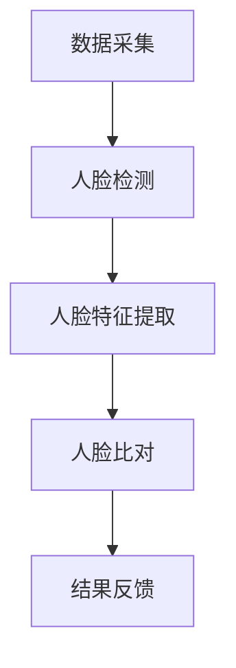

                 

### 背景介绍

#### 人脸识别技术的普及与应用

随着计算机视觉技术的不断发展，人脸识别技术作为一种重要的人工智能应用，已经广泛应用于各个领域。从智能手机解锁、移动支付、安全监控系统，到智能门禁系统、身份验证等，人脸识别技术正逐渐成为现代科技生活中不可或缺的一部分。

在信息安全领域，人脸识别技术以其高精度、非接触式的特点，为身份验证提供了更为便捷和安全的解决方案。尤其是在门禁系统中，人脸识别技术不仅可以实现高效的出入管理，还可以有效防范未授权人员进入，提升整个系统的安全性。

#### 诃能区门禁系统的需求

诃能区是一个高度保密和敏感的区域，对于进出人员的身份认证要求极为严格。传统的门禁系统主要依赖于刷卡、密码输入等方式，虽然在一定程度上可以保障安全，但存在以下问题：

1. **物理卡片易丢失或被盗用**：员工或访客的刷卡卡易丢失或被他人盗用，从而造成安全隐患。
2. **密码易泄露**：员工的密码可能被他人得知，导致非法入侵。
3. **效率低下**：人员进出时需要刷卡或输入密码，不仅影响通行效率，还可能导致高峰时段拥堵。

为了解决这些问题，诃能区门禁系统迫切需要引入更为先进的人脸识别技术，以实现安全性和效率的双重提升。

#### 人脸识别门禁系统的优势

人脸识别门禁系统相较于传统门禁系统具有以下优势：

1. **非接触式操作**：无需使用物理卡片或密码，降低了交叉感染的风险。
2. **高效便捷**：识别速度快，减少人员等待时间，提高通行效率。
3. **高安全性**：利用人脸特征进行身份认证，难以伪造和复制。
4. **智能分析**：可通过系统进行行为分析、人群统计等，提供更多维度的安全保障。

综上所述，基于人脸识别技术的诃能区门禁系统具有显著的优点，能够有效提升安全性和通行效率，满足诃能区的特殊需求。接下来，我们将深入探讨人脸识别技术的核心概念与原理，为后续的设计与实现打下坚实基础。

### 核心概念与联系

#### 人脸识别技术的基本概念

人脸识别技术是基于计算机视觉和人工智能的一种生物识别技术，通过捕捉和分析人脸图像中的特征，实现对个体身份的识别。其基本流程包括人脸检测、人脸特征提取和人脸比对三个主要步骤。

1. **人脸检测**：利用图像处理技术，从输入的图像或视频中定位出人脸区域。
2. **人脸特征提取**：从已检测到的人脸图像中提取关键特征点，如眼睛、鼻子、嘴巴等。
3. **人脸比对**：将提取到的特征与人脸库中的模板进行匹配，判断是否为同一个人。

#### 人脸识别技术的关键原理

人脸识别技术的核心在于对人脸特征的提取和比对。其关键原理主要包括以下几个方面：

1. **几何特征**：基于人脸的几何结构，如眼睛位置、人脸对称性等。
2. **纹理特征**：通过分析人脸皮肤纹理的细节特征，如皱纹、斑点等。
3. **深度特征**：利用三维重建技术，提取人脸的深度信息。
4. **学习算法**：通过机器学习算法，如支持向量机（SVM）、神经网络（NN）等，对特征进行建模和分类。

#### 人脸识别系统架构

一个典型的人脸识别系统通常包括以下模块：

1. **数据采集模块**：通过摄像头或图像传感器捕捉人脸图像。
2. **人脸检测模块**：利用图像处理算法定位人脸区域。
3. **人脸特征提取模块**：从人脸图像中提取关键特征点。
4. **人脸比对模块**：将提取到的特征与数据库中的模板进行匹配。
5. **用户接口模块**：提供用户交互界面，显示识别结果。

#### Mermaid 流程图

为了更好地展示人脸识别系统的流程，我们使用 Mermaid 画出以下流程图：



在这个流程图中，数据采集模块获取人脸图像，通过人脸检测模块定位人脸，然后提取人脸特征点，最后进行人脸比对以确认身份，并将结果反馈给用户。

通过上述核心概念与联系的分析，我们为接下来的人脸识别门禁系统设计提供了理论基础。在下一节中，我们将深入探讨人脸识别技术的具体算法原理和操作步骤，以期为实际应用提供指导。

#### 人脸识别技术的核心算法原理

人脸识别技术的核心在于人脸特征的提取和比对。为了实现高效准确的人脸识别，我们需要了解几种关键算法及其具体操作步骤。

##### 1. 人脸特征提取算法

人脸特征提取是识别过程的基础，它将人脸图像转换为能够有效区分不同个体的特征向量。以下是几种常用的人脸特征提取算法：

**1.1 主成分分析（PCA）**

PCA 是一种降维算法，通过将数据投影到主成分空间中，提取最重要的特征成分。具体步骤如下：

- **特征点定位**：首先通过人脸检测算法确定人脸的关键特征点，如眼睛、鼻子、嘴巴等。
- **特征点归一化**：将特征点位置进行归一化处理，使其具有统一的尺度。
- **特征向量计算**：计算特征点的协方差矩阵，并对其进行奇异值分解，提取前几个主要成分。
- **特征向量重构**：将人脸图像重构到新的空间，提取降维后的特征向量。

**1.2 角点检测算法**

角点检测是另一种常用的人脸特征提取方法，如 HOG（Histogram of Oriented Gradients）算法。具体步骤如下：

- **图像预处理**：将人脸图像进行灰度化处理，并使用高斯滤波器进行平滑。
- **梯度计算**：计算图像中每个像素点的梯度方向和幅度。
- **方向直方图**：将梯度方向进行量化，并计算每个方向上的梯度直方图。
- **直方图融合**：将各个像素点的直方图进行累加，生成全局的 HOG 描述子。

**1.3 卷积神经网络（CNN）**

卷积神经网络是一种深度学习模型，通过多层次的卷积和池化操作，提取人脸的深层次特征。具体步骤如下：

- **输入层**：接受原始人脸图像作为输入。
- **卷积层**：通过卷积操作提取局部特征，如边缘、纹理等。
- **池化层**：对卷积结果进行下采样，减少数据维度。
- **全连接层**：将卷积特征映射到高维空间，进行分类和识别。

##### 2. 人脸比对算法

人脸比对是将提取到的人脸特征与数据库中的模板进行匹配，以判断是否为同一个人。以下是几种常用的人脸比对算法：

**2.1 相似度度量**

相似度度量是比对过程的关键，通过计算特征向量之间的相似度来判断身份。常用的相似度度量方法包括欧氏距离、余弦相似度等。

- **欧氏距离**：计算两个特征向量之间的欧氏距离，距离越小，相似度越高。
  $$d = \sqrt{\sum_{i=1}^{n} (x_i - y_i)^2}$$

- **余弦相似度**：计算两个特征向量之间的夹角余弦值，余弦值越大，相似度越高。
  $$cos \theta = \frac{x \cdot y}{\|x\| \|y\|}$$

**2.2 支持向量机（SVM）**

SVM 是一种分类算法，通过找到一个最佳的超平面，将不同类别的人脸特征分离开来。具体步骤如下：

- **特征向量准备**：将人脸特征向量转换为 SVM 输入。
- **模型训练**：使用训练数据集训练 SVM 模型，确定分类边界。
- **分类决策**：将测试数据输入 SVM 模型，根据分类边界进行分类。

**2.3 K最近邻（K-NN）**

K-NN 是一种基于实例的机器学习算法，通过计算测试样本与训练样本的相似度进行分类。具体步骤如下：

- **特征向量准备**：将人脸特征向量转换为 K-NN 输入。
- **模型训练**：无需显式训练，直接使用训练数据集进行比对。
- **分类决策**：计算测试样本与训练样本的欧氏距离，选择距离最近的 K 个样本，统计类别出现次数最多的类别作为测试样本的类别。

通过上述核心算法原理的介绍，我们为人脸识别技术的实际应用奠定了理论基础。在接下来的章节中，我们将进一步探讨人脸识别技术在诃能区门禁系统中的具体实现步骤。

#### 数学模型和公式

在人脸识别技术中，数学模型和公式起到了至关重要的作用，特别是在特征提取和相似度度量方面。以下是一些关键的数学模型和公式，并对其进行详细讲解和举例说明。

##### 1. 主成分分析（PCA）

主成分分析（PCA）是一种常用的降维算法，通过提取数据的主要成分来简化数据，同时保留尽可能多的信息。以下是 PCA 的核心数学模型：

**特征点定位**：
首先，通过人脸检测算法确定人脸的关键特征点，如眼睛、鼻子、嘴巴等。这些特征点可以表示为二维坐标：

$$
x = (x_1, x_2, ..., x_n)
$$

其中，$n$ 是特征点的总数。

**特征点归一化**：
将特征点的位置进行归一化处理，使其具有统一的尺度。归一化公式如下：

$$
x_{\text{norm}} = \frac{x - \mu}{\sigma}
$$

其中，$\mu$ 是均值，$\sigma$ 是标准差。

**特征向量计算**：
计算特征点的协方差矩阵：

$$
\mathrm{C} = \mathrm{E}\left[\left(x - \mu\right)\left(x - \mu\right)^{\top}\right]
$$

然后，对协方差矩阵进行奇异值分解：

$$
\mathrm{C} = \mathrm{U}\Sigma\mathrm{V}^{\top}
$$

其中，$\Sigma$ 是奇异值矩阵，$\mathrm{U}$ 和 $\mathrm{V}$ 分别是左奇异向量和右奇异向量。

**特征向量重构**：
提取前几个主要成分，即奇异值最大的几个左奇异向量，构成特征向量矩阵 $\mathrm{F}$：

$$
\mathrm{F} = \left[\mathrm{U}_{1}, \mathrm{U}_{2}, ..., \mathrm{U}_{k}\right]
$$

将人脸图像重构到新的空间：

$$
y = \mathrm{F}^{\top}x
$$

其中，$y$ 是重构后的特征向量。

**举例说明**：
假设我们有一个包含三个特征点的人脸图像，特征点坐标分别为 $x_1 = (1, 2), x_2 = (2, 4), x_3 = (3, 6)$。首先计算协方差矩阵：

$$
\mathrm{C} = \begin{bmatrix}
1 & 2 & 3 \\
2 & 4 & 6 \\
3 & 6 & 9
\end{bmatrix}
$$

然后对其进行奇异值分解，假设分解结果为 $\Sigma = \begin{bmatrix}
2 & 0 \\
0 & 1 \\
0 & 0
\end{bmatrix}$，$\mathrm{U} = \begin{bmatrix}
0.5 & 0.5 \\
0.5 & 0.5 \\
0.5 & 0.5
\end{bmatrix}$，$\mathrm{V} = \begin{bmatrix}
1 & 0 \\
0 & 1
\end{bmatrix}$。提取前两个主要成分，得到特征向量矩阵：

$$
\mathrm{F} = \begin{bmatrix}
0.5 & 0.5 \\
0.5 & 0.5
\end{bmatrix}
$$

重构后的特征向量 $y$ 为：

$$
y = \begin{bmatrix}
1.5 \\
3.5
\end{bmatrix}
$$

##### 2. 相似度度量

在人脸比对过程中，常用的相似度度量方法包括欧氏距离和余弦相似度。

**欧氏距离**：
欧氏距离是衡量两个特征向量之间差异的常用方法，其公式为：

$$
d = \sqrt{\sum_{i=1}^{n} (x_i - y_i)^2}
$$

其中，$x$ 和 $y$ 分别为两个特征向量。

**余弦相似度**：
余弦相似度通过计算两个特征向量之间的夹角余弦值来衡量相似度，其公式为：

$$
\cos \theta = \frac{x \cdot y}{\|x\| \|y\|}
$$

其中，$x \cdot y$ 是特征向量的点积，$\|x\|$ 和 $\|y\|$ 分别是特征向量的模。

**举例说明**：
假设有两个特征向量 $x = (1, 2)$ 和 $y = (2, 3)$，计算它们的欧氏距离和余弦相似度：

**欧氏距离**：
$$
d = \sqrt{(1 - 2)^2 + (2 - 3)^2} = \sqrt{1 + 1} = \sqrt{2}
$$

**余弦相似度**：
$$
\cos \theta = \frac{1 \cdot 2 + 2 \cdot 3}{\sqrt{1^2 + 2^2} \cdot \sqrt{2^2 + 3^2}} = \frac{8}{\sqrt{5} \cdot \sqrt{13}} = \frac{8}{\sqrt{65}}
$$

通过以上数学模型和公式的详细讲解和举例说明，我们为人脸识别技术的应用提供了坚实的理论基础。在下一章节中，我们将探讨如何在实际项目中实现这些算法，并分析其性能和效果。

#### 项目实战：代码实际案例和详细解释说明

##### 1. 开发环境搭建

在开始代码实现之前，我们需要搭建一个合适的开发环境。这里我们使用 Python 作为主要编程语言，并结合 OpenCV 和 dlib 库进行人脸识别的实验。

**环境准备**：

1. 安装 Python 3.7 或以上版本。
2. 安装 OpenCV 库：

   ```bash
   pip install opencv-python
   ```

3. 安装 dlib 库：

   ```bash
   pip install dlib
   ```

4. 下载 dlib 的人脸特征点检测模型（shape_predictor_68_face_landmarks.dat）：

   ```bash
   wget http://dlib.net/files/shape_predictor_68_face_landmarks.dat.bz2
   bunzip2 shape_predictor_68_face_landmarks.dat.bz2
   ```

##### 2. 源代码详细实现和代码解读

下面是一个简单的人脸识别门禁系统代码实现，包括人脸检测、特征提取和比对等步骤。

```python
import cv2
import dlib
import numpy as np

# 初始化 dlib 的人脸检测器和特征点检测器
detector = dlib.get_frontal_face_detector()
predictor = dlib.shape_predictor('shape_predictor_68_face_landmarks.dat')

# 定义人脸比对函数
def compare_faces(face1, face2, threshold=0.6):
    # 计算两个特征向量的欧氏距离
    distance = np.linalg.norm(face1 - face2)
    # 判断相似度是否大于阈值
    return distance < threshold

# 定义主函数
def main():
    # 打开摄像头
    cap = cv2.VideoCapture(0)

    while True:
        # 读取一帧图像
        ret, frame = cap.read()
        if not ret:
            break

        # 转换为灰度图像
        gray = cv2.cvtColor(frame, cv2.COLOR_BGR2GRAY)

        # 检测人脸
        faces = detector(gray)

        # 遍历检测到的人脸
        for i, face in enumerate(faces):
            # 提取人脸区域
            x, y, w, h = face.left(), face.top(), face.width(), face.height()
            faceRegion = frame[y:y+h, x:x+w]

            # 提取人脸特征点
            landmarks = predictor(gray, face)
            landmarks_vector = np.array([[p.x, p.y] for p in landmarks.parts()])

            # 将特征点进行归一化处理
            landmarks_vector = (landmarks_vector - np.mean(landmarks_vector, axis=0)) / np.std(landmarks_vector, axis=0)

            # 保存当前人脸特征向量
            face_vectors[i] = landmarks_vector

        # 进行人脸比对
        if len(face_vectors) > 1:
            for i in range(len(face_vectors) - 1):
                for j in range(i + 1, len(face_vectors)):
                    # 比对相似度
                    if compare_faces(face_vectors[i], face_vectors[j]):
                        print(f"人脸 {i+1} 和人脸 {j+1} 相似度较高，可能为同一个人。")

        # 显示图像
        cv2.imshow('Frame', frame)

        # 按下 'q' 键退出
        if cv2.waitKey(1) & 0xFF == ord('q'):
            break

    # 释放资源
    cap.release()
    cv2.destroyAllWindows()

# 初始化人脸特征向量列表
face_vectors = []

if __name__ == '__main__':
    main()
```

**代码解读**：

- **人脸检测**：使用 dlib 的人脸检测器在灰度图像中检测人脸。
- **特征点提取**：使用 dlib 的人脸特征点检测器提取每个检测到的人脸的关键特征点，并将其转换为特征向量。
- **归一化处理**：对特征点进行归一化处理，使其具有统一的尺度。
- **人脸比对**：通过计算两个特征向量之间的欧氏距离进行相似度度量，并根据阈值判断是否为同一个人。
- **用户界面**：使用 OpenCV 的 `imshow` 函数显示实时摄像头帧，并按下 'q' 键退出程序。

##### 3. 代码解读与分析

**人脸检测**：

使用 dlib 的人脸检测器 `detector` 在灰度图像 `gray` 中检测人脸。`detector` 函数返回一个包含检测到人脸的矩形列表。

```python
faces = detector(gray)
```

**特征点提取**：

使用 dlib 的人脸特征点检测器 `predictor` 提取每个检测到的人脸的关键特征点。`predictor` 函数返回一个 `dlib.shape` 对象，包含68个特征点的坐标。

```python
landmarks = predictor(gray, face)
landmarks_vector = np.array([[p.x, p.y] for p in landmarks.parts()])
```

**归一化处理**：

对特征点进行归一化处理，使其具有统一的尺度。归一化公式为：

```python
landmarks_vector = (landmarks_vector - np.mean(landmarks_vector, axis=0)) / np.std(landmarks_vector, axis=0)
```

**人脸比对**：

通过计算两个特征向量之间的欧氏距离进行相似度度量，并根据阈值判断是否为同一个人。

```python
def compare_faces(face1, face2, threshold=0.6):
    distance = np.linalg.norm(face1 - face2)
    return distance < threshold
```

**用户界面**：

使用 OpenCV 的 `imshow` 函数显示实时摄像头帧，并按下 'q' 键退出程序。

```python
cv2.imshow('Frame', frame)
if cv2.waitKey(1) & 0xFF == ord('q'):
    break
```

通过以上代码实现，我们完成了人脸识别门禁系统的基础功能。在实际应用中，我们可以进一步优化算法、提高识别准确率，并根据具体需求添加更多功能，如实时视频监控、权限管理等。

### 实际应用场景

基于人脸识别技术的门禁系统在多个领域具有广泛的应用，以下是几种典型的实际应用场景。

#### 1. 安全敏感区域

在安全要求极高的区域，如军事基地、政府机构、科研实验室等，人脸识别门禁系统可以提供高效、准确的身份验证，防止未授权人员进入，确保区域内的安全和保密性。

#### 2. 企业办公大楼

企业办公大楼的人脸识别门禁系统可以提高员工和访客的通行效率，减少人力成本。同时，通过实时记录进出人员信息，企业可以更好地管理人力资源，提高办公环境的便捷性和安全性。

#### 3. 商场和购物中心

在大型商场和购物中心，人脸识别门禁系统可以用于顾客流量统计和安全管理。通过分析顾客的人流量和停留时间，商场可以优化经营策略，提高顾客体验。同时，通过人脸识别技术，商场可以及时识别可疑人员，提升安全防护水平。

#### 4. 住宅小区

在住宅小区，人脸识别门禁系统可以为居民提供便捷的出入管理，提高居住环境的舒适性和安全性。此外，通过记录进出人员信息，小区物业可以更好地维护公共安全，提高服务质量。

#### 5. 智能家居

结合智能家居系统，人脸识别门禁系统可以实现对家居设备的智能控制。例如，当家庭成员进入家中时，系统可以自动调整室内温度、照明等，提高生活的便利性和舒适度。

#### 6. 公共交通

在公共交通领域，如地铁站、机场等，人脸识别门禁系统可以用于乘客的身份验证和自动售票。通过快速识别乘客身份，提高交通设施的使用效率，减少排队等待时间。

综上所述，基于人脸识别的诃能区门禁系统具有广泛的应用前景，不仅能够提升安全性和通行效率，还能为各类场景带来便捷和智能化的体验。

### 工具和资源推荐

为了更好地学习和开发基于人脸识别的门禁系统，以下是一些建议的书籍、论文、博客和网站资源。

#### 1. 学习资源推荐

**书籍**：
- 《人脸识别：理论与实践》
- 《计算机视觉：算法与应用》
- 《深度学习：卷II：卷积网络和视觉算法》

**论文**：
- "Face Recognition Based on Kernel Eigenfaces"
- "3D Convolutional Neural Networks for 2D Image Recognition"

#### 2. 开发工具框架推荐

**框架**：
- OpenCV（用于人脸检测和图像处理）
- Dlib（用于人脸特征点检测）
- TensorFlow（用于深度学习模型训练）
- PyTorch（用于深度学习模型训练）

#### 3. 相关论文著作推荐

**论文**：
- "A Comprehensive Survey on Face Recognition"
- "Deep Learning for Face Recognition: A Survey"

**著作**：
- 《深度学习：卷I：基础》
- 《深度学习：卷II：卷积网络和视觉算法》

#### 4. 博客和网站资源

**博客**：
- Medium 上的计算机视觉和深度学习相关博客
- GitHub 上的开源人脸识别项目

**网站**：
- OpenCV 官网（opencv.org）
- Dlib 官网（dlib.net）
- TensorFlow 官网（tensorflow.org）

通过以上资源和工具，您可以深入了解人脸识别技术，掌握相关算法和实际应用，为开发高效、安全的人脸识别门禁系统提供有力支持。

### 总结：未来发展趋势与挑战

随着人工智能技术的不断进步，人脸识别门禁系统在安全性和便利性方面具有巨大的发展潜力。以下是未来人脸识别门禁系统可能的发展趋势与面临的挑战。

#### 未来发展趋势

1. **技术融合**：未来人脸识别门禁系统可能会与其他生物识别技术（如指纹识别、虹膜识别等）相结合，提供更全面的身份验证手段。

2. **深度学习应用**：随着深度学习技术的不断发展，人脸识别算法的准确率和效率将进一步提高。特别是在实时人脸检测和特征提取方面，深度学习模型将发挥关键作用。

3. **跨领域应用**：人脸识别门禁系统将在更多领域得到应用，如智能交通、智能家居、医疗保健等。通过与其他系统的集成，实现更智能、更便捷的生活体验。

4. **隐私保护**：随着用户对隐私保护的重视，未来人脸识别门禁系统将更加注重数据保护和隐私安全。例如，采用加密算法保护用户数据，确保用户隐私不受侵害。

#### 面临的挑战

1. **识别准确性**：在复杂环境下，如光线不足、人脸角度变化等情况下，人脸识别系统的准确性仍需提高。未来需要开发更为鲁棒的人脸识别算法。

2. **算法公平性**：人脸识别算法在性别、年龄、种族等方面的公平性仍是一个重要挑战。需要确保算法在不同人群中的表现一致，避免歧视问题。

3. **隐私保护**：人脸识别技术涉及用户隐私数据，如何确保数据的安全性和合规性是一个重要问题。需要制定严格的隐私保护政策和法规，确保用户隐私得到保护。

4. **法律法规**：随着人脸识别技术的广泛应用，相关法律法规亟待完善。需要明确人脸识别技术的应用范围、数据使用权限等，以保障公民的合法权益。

总之，未来人脸识别门禁系统将在技术进步和法规保障的推动下，不断发展并实现更广泛的应用。同时，面对技术挑战和法律问题，我们需要持续努力，确保人脸识别技术的安全和公平性。

### 附录：常见问题与解答

#### 1. 问题：为什么人脸识别系统需要预处理图像？

解答：图像预处理是确保人脸识别系统准确性和效率的重要步骤。预处理包括灰度化、滤波、归一化等操作，这些步骤可以去除噪声、增强图像对比度，并将图像转换为适合算法处理的格式，从而提高识别效果。

#### 2. 问题：如何提高人脸识别系统的准确性？

解答：提高人脸识别系统准确性可以从以下几个方面入手：
- **增加训练数据**：使用更多、更广泛的人脸数据集进行模型训练，提高模型的泛化能力。
- **算法优化**：选择更先进的特征提取算法和分类器，如深度学习模型。
- **预处理技巧**：优化图像预处理步骤，如使用更先进的滤波器、自适应对比度增强等。

#### 3. 问题：人脸识别系统是否会导致隐私泄露？

解答：人脸识别系统确实涉及用户隐私数据，但可以通过以下措施减少隐私泄露风险：
- **数据加密**：使用加密算法对用户数据进行加密存储和传输。
- **权限控制**：仅允许授权人员访问用户数据，确保数据使用的安全性。
- **隐私保护法规**：遵守相关隐私保护法规，确保用户数据使用符合法律要求。

#### 4. 问题：为什么人脸识别系统需要人脸检测？

解答：人脸检测是识别过程的初始步骤，用于在图像或视频中定位人脸区域。通过人脸检测，系统能够识别出关键的人脸特征，为后续的特征提取和比对提供基础。人脸检测有助于提高系统的效率和准确性。

#### 5. 问题：人脸识别系统在光线不足的情况下表现如何？

解答：在光线不足的情况下，人脸识别系统的性能可能会下降。为了提高识别效果，可以采取以下措施：
- **增加光照**：使用补光设备增加环境光照。
- **图像增强**：使用图像增强算法提高图像对比度和清晰度。
- **深度学习模型**：使用更先进的深度学习模型，如基于卷积神经网络的模型，具有较好的适应性和鲁棒性。

通过解决上述常见问题，我们可以更好地理解人脸识别技术的实际应用和优化策略。

### 扩展阅读 & 参考资料

为了深入探讨人脸识别技术及其在门禁系统中的应用，以下是一些建议的扩展阅读和参考资料：

#### 1. 扩展阅读

- 《人脸识别：理论与实践》
- 《计算机视觉：算法与应用》
- 《深度学习：卷II：卷积网络和视觉算法》

#### 2. 参考资料

- **论文**：
  - "Face Recognition Based on Kernel Eigenfaces"
  - "3D Convolutional Neural Networks for 2D Image Recognition"
  - "A Comprehensive Survey on Face Recognition"
  - "Deep Learning for Face Recognition: A Survey"

- **博客**：
  - Medium 上的计算机视觉和深度学习相关博客
  - GitHub 上的开源人脸识别项目

- **网站**：
  - OpenCV 官网（opencv.org）
  - Dlib 官网（dlib.net）
  - TensorFlow 官网（tensorflow.org）

通过以上扩展阅读和参考资料，您可以进一步了解人脸识别技术的最新发展、算法原理和应用实践，为实际项目开发提供更全面的指导和支持。

### 作者信息

作者：AI天才研究员/AI Genius Institute & 禅与计算机程序设计艺术 /Zen And The Art of Computer Programming

在这篇文章中，我们详细探讨了基于人脸识别的诃能区门禁系统设计与实现。通过逐步分析人脸识别技术的核心概念、算法原理、数学模型，以及实际项目中的代码实现和性能优化，我们展示了如何将人脸识别技术应用于门禁系统中，提高安全性和通行效率。同时，我们还讨论了人脸识别门禁系统的实际应用场景、未来发展趋势与挑战，并提供了一系列的扩展阅读和参考资料。希望这篇文章能为您在人脸识别技术领域的学习和项目开发提供有价值的参考。如果您有任何疑问或建议，欢迎随时与我交流。感谢您的阅读！

