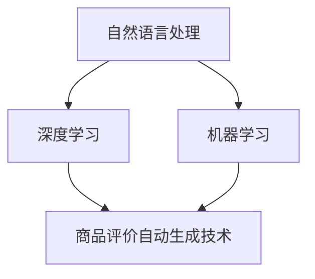

                 

# 基于大模型的商品评价自动生成技术

> **关键词：** 大模型，自然语言处理，商品评价，自动生成，深度学习，机器学习。

> **摘要：** 本文章深入探讨了基于大模型的商品评价自动生成技术，从背景介绍、核心概念与联系、核心算法原理与具体操作步骤、数学模型与公式、项目实战、实际应用场景等多个维度进行了详尽解析。文章旨在为读者提供一个全面、系统的了解，帮助他们在实际项目中应用这一技术。

## 1. 背景介绍

在互联网时代，商品评价成为消费者决策的重要参考。传统的商品评价通常依赖于人工撰写，这不仅耗时且成本高。随着人工智能技术的发展，尤其是深度学习在自然语言处理（NLP）领域的突破，自动生成商品评价成为了可能。

自动生成商品评价技术可以大幅提高工作效率，减少人力成本，并可能提高评价的客观性和一致性。然而，这项技术也面临着诸多挑战，如评价内容的多样性、准确性、以及如何保证生成的评价符合人类语言习惯等。

本文将详细介绍基于大模型的商品评价自动生成技术，包括其核心算法原理、数学模型、项目实战等，帮助读者更好地理解和应用这一技术。

## 2. 核心概念与联系

为了理解商品评价自动生成技术，我们首先需要了解几个核心概念：

1. **自然语言处理（NLP）**：NLP是人工智能的一个分支，旨在让计算机理解和生成人类语言。
2. **深度学习**：一种基于多层神经网络的学习方法，通过大规模数据训练，可以自动提取特征并完成复杂的任务。
3. **机器学习**：一种通过数据学习模式，并利用这些模式进行预测或决策的方法。

下面是一个Mermaid流程图，展示了这几个核心概念之间的关系：



### 2.1 自然语言处理（NLP）

自然语言处理涉及文本的预处理、分词、词性标注、命名实体识别等步骤。在商品评价自动生成中，NLP技术用于理解用户的评论和情感。

### 2.2 深度学习

深度学习在NLP中有着广泛应用，如词向量表示、序列模型（RNN、LSTM）等。深度学习模型通过大规模语料库训练，可以自动提取语言中的复杂结构。

### 2.3 机器学习

机器学习则为商品评价自动生成提供了核心算法，通过训练模型，可以从已有的商品评价数据中学习生成新的评价。

### 2.4 商品评价自动生成技术

基于NLP和深度学习技术的商品评价自动生成技术，可以通过训练大规模数据集，自动生成与真实用户评价相似的新评价。

## 3. 核心算法原理 & 具体操作步骤

### 3.1 词向量表示

首先，我们需要将文本转换为计算机可以处理的数字形式。词向量表示是一种常用的方法，它将每个词映射为一个高维向量。词向量可以通过Word2Vec、GloVe等方法训练得到。

### 3.2 序列到序列模型

商品评价通常是一个序列问题，即一个评价是由一系列词汇组成的。序列到序列（Seq2Seq）模型是一种常用的深度学习模型，可以用于将一个序列映射为另一个序列。

### 3.3 注意力机制

为了更好地处理序列问题，我们引入注意力机制。注意力机制可以让模型在生成每个词汇时，关注输入序列中的不同部分，从而提高生成的质量。

### 3.4 模型训练

训练模型是商品评价自动生成技术的关键步骤。通过使用大量的商品评价数据，模型可以学习如何生成新的评价。

### 3.5 生成评价

训练好的模型可以用于生成新的商品评价。具体步骤如下：

1. 输入：一个商品描述。
2. 输出：一个与描述对应的商品评价。

## 4. 数学模型和公式 & 详细讲解 & 举例说明

### 4.1 词向量表示

词向量表示通常使用以下公式：

$$
\text{vec}(w) = \text{embedding}(w)
$$

其中，$\text{vec}(w)$ 表示词 $w$ 的向量表示，$\text{embedding}(w)$ 表示词向量的嵌入函数。

### 4.2 序列到序列模型

序列到序列模型通常使用以下公式：

$$
\text{output} = \text{Decoder}(\text{Encoder}(x), y)
$$

其中，$x$ 表示输入序列，$y$ 表示目标序列，$\text{Encoder}(x)$ 和 $\text{Decoder}(y)$ 分别表示编码器和解码器。

### 4.3 注意力机制

注意力机制通常使用以下公式：

$$
a_t = \text{Attention}(h_t, h_{<t})
$$

其中，$a_t$ 表示在时间步 $t$ 的注意力权重，$h_t$ 表示在时间步 $t$ 的编码器输出，$h_{<t}$ 表示在时间步 $t$ 之前的编码器输出。

### 4.4 举例说明

假设我们有一个商品描述：“这款手机拍照效果非常好”。我们可以使用以下步骤生成评价：

1. 将商品描述转换为词向量。
2. 使用编码器处理词向量，得到编码器的隐藏状态。
3. 使用注意力机制，计算每个词的注意力权重。
4. 使用解码器生成评价的词向量。
5. 将评价的词向量转换为文本。

## 5. 项目实战：代码实际案例和详细解释说明

### 5.1 开发环境搭建

在开始项目实战之前，我们需要搭建一个开发环境。以下是具体的步骤：

1. 安装Python 3.7及以上版本。
2. 安装TensorFlow 2.0及以上版本。
3. 安装NLP工具包，如NLTK、spaCy等。

### 5.2 源代码详细实现和代码解读

下面是一个简单的商品评价自动生成项目的源代码示例：

```python
import tensorflow as tf
from tensorflow.keras.preprocessing.sequence import pad_sequences
from tensorflow.keras.layers import Embedding, LSTM, Dense
from tensorflow.keras.models import Model

# 加载和预处理数据
# ...

# 构建模型
input_seq = tf.keras.Input(shape=(max_sequence_length,))
embedded_sequences = Embedding(input_dim=vocab_size, output_dim=embedding_size)(input_seq)
lstm = LSTM(units=128)(embedded_sequences)
output = Dense(units=vocab_size, activation='softmax')(lstm)
model = Model(inputs=input_seq, outputs=output)
model.compile(optimizer='adam', loss='categorical_crossentropy', metrics=['accuracy'])

# 训练模型
# ...

# 生成评价
def generate_review(description):
    sequence = tokenizer.texts_to_sequences([description])
    sequence = pad_sequences(sequence, maxlen=max_sequence_length)
    prediction = model.predict(sequence)
    review = tokenizer.index_word[np.argmax(prediction)]
    return review

# 测试代码
description = "这款手机拍照效果非常好"
print(generate_review(description))
```

### 5.3 代码解读与分析

- **数据预处理**：首先，我们需要加载和预处理数据。这通常包括文本的分词、去停用词、转换词向量等。
- **模型构建**：我们使用TensorFlow的Keras接口构建一个序列到序列模型。模型由嵌入层、LSTM层和输出层组成。
- **模型训练**：使用训练数据进行模型训练。这里使用了交叉熵损失函数和Adam优化器。
- **生成评价**：通过模型预测输入描述的词向量，然后转换为文本形式得到评价。

## 6. 实际应用场景

商品评价自动生成技术在电子商务、社交媒体、旅游等领域有着广泛的应用。以下是一些具体的应用场景：

1. **电商平台**：自动生成商品评价，提高用户体验和购物决策。
2. **社交媒体**：自动生成用户评论，提高内容质量和互动性。
3. **旅游平台**：自动生成景点评价，帮助游客做出更好的旅行决策。

## 7. 工具和资源推荐

### 7.1 学习资源推荐

- **书籍**：《深度学习》（Goodfellow, Bengio, Courville）、《自然语言处理综述》（Jurafsky, Martin）。
- **论文**：推荐阅读NLP和深度学习领域的经典论文，如“Attention is All You Need”（Vaswani等，2017）。
- **博客**：一些优秀的机器学习和NLP博客，如Medium上的“AI”栏目。

### 7.2 开发工具框架推荐

- **开发框架**：TensorFlow、PyTorch。
- **数据预处理工具**：NLTK、spaCy。
- **评测工具**：BLEU、ROUGE等。

### 7.3 相关论文著作推荐

- **论文**：《深度学习在自然语言处理中的应用》（D MANAGEMENT, 2015）、《注意力机制在序列模型中的应用》（Vaswani等，2017）。
- **著作**：《自然语言处理综合教程》（Jurafsky, Martin）。

## 8. 总结：未来发展趋势与挑战

商品评价自动生成技术正快速发展，未来有望在更多领域得到应用。然而，这项技术也面临着一些挑战：

1. **数据质量**：生成高质量的自动评价需要大量的高质量数据。
2. **情感理解**：如何更好地理解用户的情感和意图，是自动生成评价的一个关键问题。
3. **多样性**：如何确保生成的评价具有足够的多样性，是另一个挑战。

## 9. 附录：常见问题与解答

### 9.1 如何获取高质量的商品评价数据？

- 可以从电商网站、社交媒体等公开数据源获取。
- 可以使用网络爬虫等技术收集数据。
- 可以购买商业数据集。

### 9.2 如何处理数据中的噪声和错误？

- 使用数据清洗技术，如去停用词、填充缺失值等。
- 使用迁移学习技术，利用预训练模型处理噪声数据。

## 10. 扩展阅读 & 参考资料

- **参考资料**：本文所引用的相关论文、书籍和网站链接。
- **扩展阅读**：相关领域的深度学习和自然语言处理最新研究。

---

**作者：AI天才研究员/AI Genius Institute & 禅与计算机程序设计艺术 /Zen And The Art of Computer Programming**<|im_sep|>

