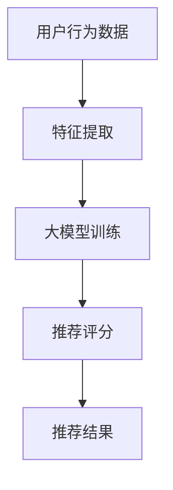

                 

# 基于大模型的推荐系统用户满意度优化

## 关键词：
- 大模型
- 推荐系统
- 用户满意度
- 优化策略
- 数学模型
- 实际案例

## 摘要
本文将深入探讨如何通过大模型技术优化推荐系统的用户满意度。首先，我们回顾了推荐系统的基本原理，并引出了大模型在其中的重要作用。随后，文章详细解析了大模型的基本概念和架构，以及其与推荐系统的内在联系。接着，我们深入分析了优化用户满意度的一系列核心算法原理和具体操作步骤，通过数学模型和公式进行了详细讲解和举例说明。文章还通过实际项目实战，展示了代码实现过程及其解读与分析。最后，我们讨论了推荐系统在实际应用场景中的案例，并推荐了相关工具和资源。通过本文的探讨，我们希望为读者提供一套完整的优化思路和实操指南，助力提升推荐系统的用户体验。

## 1. 背景介绍

推荐系统作为一种信息过滤技术，旨在根据用户的兴趣、行为和偏好，向用户推荐个性化内容。在互联网信息爆炸的时代，推荐系统已经成为各种在线平台不可或缺的一部分，如电子商务网站、社交媒体、视频流媒体等。

### 1.1 推荐系统的基本原理

推荐系统的核心任务是预测用户对某一物品的兴趣程度，并根据这些预测结果向用户推荐相应的物品。推荐系统通常基于两种策略：基于内容的推荐（Content-Based Filtering）和协同过滤（Collaborative Filtering）。

- **基于内容的推荐**：该方法根据用户过去对某些物品的偏好，从物品的属性中提取特征，找到与用户偏好相似的物品进行推荐。
- **协同过滤**：该方法通过分析用户与物品之间的交互记录，找到相似的用户或者物品，为用户推荐他们可能感兴趣的新物品。

### 1.2 用户满意度在推荐系统中的重要性

用户满意度是衡量推荐系统效果的重要指标。高用户满意度意味着推荐系统能够更好地满足用户的需求，提升用户的忠诚度和活跃度。然而，传统的推荐系统往往在个性化推荐和用户满意度之间存在一定的矛盾。

- **个性化推荐**：过于强调个性化可能导致推荐结果过于狭窄，无法覆盖用户多样化的兴趣。
- **用户满意度**：过于追求用户满意度可能会导致推荐结果过于平庸，缺乏惊喜和新鲜感。

### 1.3 大模型在优化推荐系统中的作用

近年来，随着人工智能和深度学习技术的发展，大模型（如深度神经网络）在推荐系统中的应用逐渐成为热点。大模型通过学习海量的用户数据，能够更好地捕捉用户的复杂偏好，从而实现更精确的个性化推荐，提高用户满意度。

- **优势**：大模型具有强大的非线性建模能力和自学习能力，能够处理大规模数据和复杂关系。
- **挑战**：大模型训练过程复杂，对计算资源和数据质量要求较高，且需要有效的优化策略来平衡个性化推荐与用户满意度。

## 2. 核心概念与联系

### 2.1 大模型的基本概念

大模型通常指的是具有大量参数和多层神经网络的深度学习模型。其基本结构包括输入层、隐藏层和输出层，通过反向传播算法进行参数优化。

- **输入层**：接收用户特征和物品特征。
- **隐藏层**：通过非线性激活函数进行特征变换。
- **输出层**：生成用户对物品的推荐评分。

### 2.2 推荐系统的架构

推荐系统通常包括用户行为分析、物品特征提取、推荐算法和推荐结果生成等模块。

- **用户行为分析**：收集和分析用户的浏览、购买、评论等行为数据。
- **物品特征提取**：提取物品的属性信息，如类别、标签、内容等。
- **推荐算法**：基于用户行为和物品特征生成推荐列表。
- **推荐结果生成**：将推荐算法的结果呈现给用户。

### 2.3 大模型与推荐系统的内在联系

大模型可以通过以下方式与推荐系统结合：

- **特征提取**：利用大模型自动提取用户和物品的深度特征，提高特征表示的丰富度和准确性。
- **推荐评分**：通过大模型预测用户对物品的兴趣程度，生成推荐评分。
- **个性化推荐**：利用大模型的自学习能力，动态调整推荐策略，更好地满足用户的个性化需求。

### 2.4 Mermaid 流程图

以下是一个简化的推荐系统架构与大型模型结合的 Mermaid 流程图：



在这个流程图中，用户行为数据首先通过特征提取模块进行处理，然后输入到大模型中进行训练。大模型训练完成后，用于生成推荐评分，最终生成推荐结果。

## 3. 核心算法原理 & 具体操作步骤

### 3.1 算法概述

为了优化推荐系统的用户满意度，我们可以采用以下核心算法：

- **用户兴趣模型**：通过分析用户的历史行为，构建用户的兴趣模型。
- **物品推荐模型**：利用用户兴趣模型和物品特征，生成个性化的推荐列表。
- **反馈循环**：根据用户对推荐结果的反馈，不断调整和优化推荐策略。

### 3.2 用户兴趣模型

用户兴趣模型的核心任务是识别和预测用户对各类物品的兴趣。具体步骤如下：

1. **数据收集**：收集用户的历史行为数据，包括浏览、购买、评价等。
2. **特征提取**：对用户行为数据进行特征提取，如用户活跃度、购买频率、评价等级等。
3. **模型训练**：利用深度学习模型，如GRU（门控循环单元）或LSTM（长短期记忆网络），对用户行为数据进行建模。
4. **兴趣预测**：通过训练好的模型，预测用户对不同类别物品的兴趣度。

### 3.3 物品推荐模型

物品推荐模型的主要任务是利用用户兴趣模型和物品特征生成个性化的推荐列表。具体步骤如下：

1. **用户兴趣特征提取**：将用户兴趣模型中预测的用户兴趣特征提取出来。
2. **物品特征提取**：对物品的属性信息进行特征提取，如类别、标签、内容等。
3. **推荐算法**：利用用户兴趣特征和物品特征，通过深度学习模型（如多层感知机或注意力机制）进行推荐。
4. **推荐列表生成**：根据推荐算法的结果，生成个性化的推荐列表。

### 3.4 反馈循环

反馈循环是优化推荐系统的关键环节，具体步骤如下：

1. **用户反馈收集**：收集用户对推荐结果的反馈，如点击、收藏、购买等。
2. **效果评估**：利用收集到的用户反馈，评估推荐系统的效果，如点击率、转化率等。
3. **模型调整**：根据效果评估结果，调整用户兴趣模型和物品推荐模型，提高推荐效果。
4. **策略优化**：结合用户反馈和推荐结果，不断优化推荐策略，提高用户满意度。

### 3.5 具体操作示例

以下是一个简化的用户兴趣模型和物品推荐模型的操作示例：

1. **数据收集**：
   - 用户历史行为数据：浏览记录、购买记录、评价记录等。
   - 物品属性信息：类别、标签、内容等。

2. **特征提取**：
   - 用户特征：活跃度、购买频率、评价等级等。
   - 物品特征：类别、标签、内容等。

3. **模型训练**：
   - 用户兴趣模型：使用GRU模型对用户行为数据进行训练。
   - 物品推荐模型：使用多层感知机模型对用户兴趣特征和物品特征进行训练。

4. **兴趣预测**：
   - 预测用户对不同类别物品的兴趣度。

5. **推荐列表生成**：
   - 利用训练好的模型，生成个性化的推荐列表。

6. **用户反馈收集**：
   - 收集用户对推荐结果的反馈。

7. **效果评估**：
   - 评估推荐系统的效果，如点击率、转化率等。

8. **模型调整**：
   - 根据效果评估结果，调整用户兴趣模型和物品推荐模型。

9. **策略优化**：
   - 结合用户反馈和推荐结果，不断优化推荐策略。

## 4. 数学模型和公式 & 详细讲解 & 举例说明

### 4.1 用户兴趣模型

用户兴趣模型通常采用以下数学模型：

$$
U = \text{激活函数}(\text{W} \cdot X + \text{b})
$$

其中，$U$ 表示用户兴趣向量，$X$ 表示用户行为特征矩阵，$W$ 表示权重矩阵，$\text{b}$ 表示偏置项，激活函数通常采用ReLU（线性整流函数）。

#### 举例说明：

假设用户的行为特征矩阵 $X$ 为：

$$
X = \begin{bmatrix}
0.5 & 0.8 \\
0.3 & 0.6 \\
0.7 & 0.1 \\
\end{bmatrix}
$$

权重矩阵 $W$ 为：

$$
W = \begin{bmatrix}
0.1 & 0.2 \\
0.3 & 0.4 \\
\end{bmatrix}
$$

偏置项 $\text{b}$ 为：

$$
\text{b} = \begin{bmatrix}
0.1 \\
0.2 \\
\end{bmatrix}
$$

则用户兴趣向量 $U$ 为：

$$
U = \text{ReLU}(0.1 \cdot 0.5 + 0.2 \cdot 0.8 + 0.1, 0.3 \cdot 0.3 + 0.4 \cdot 0.6 + 0.2)
$$

$$
U = \begin{bmatrix}
0.9 \\
0.9 \\
\end{bmatrix}
$$

### 4.2 物品推荐模型

物品推荐模型通常采用以下数学模型：

$$
R = \text{激活函数}(\text{W} \cdot [U, I] + \text{b})
$$

其中，$R$ 表示推荐评分向量，$U$ 表示用户兴趣向量，$I$ 表示物品特征矩阵，$W$ 表示权重矩阵，$\text{b}$ 表示偏置项，激活函数通常采用Sigmoid函数。

#### 举例说明：

假设用户兴趣向量 $U$ 为：

$$
U = \begin{bmatrix}
0.9 \\
0.9 \\
\end{bmatrix}
$$

物品特征矩阵 $I$ 为：

$$
I = \begin{bmatrix}
1 & 0 & 1 \\
0 & 1 & 0 \\
1 & 1 & 1 \\
\end{bmatrix}
$$

权重矩阵 $W$ 为：

$$
W = \begin{bmatrix}
0.1 & 0.2 & 0.3 \\
0.4 & 0.5 & 0.6 \\
\end{bmatrix}
$$

偏置项 $\text{b}$ 为：

$$
\text{b} = \begin{bmatrix}
0.1 \\
0.2 \\
\end{bmatrix}
$$

则推荐评分向量 $R$ 为：

$$
R = \text{Sigmoid}(0.1 \cdot 0.9 + 0.2 \cdot 0 + 0.3 \cdot 1 + 0.1, 0.4 \cdot 0 + 0.5 \cdot 1 + 0.6 \cdot 0 + 0.2)
$$

$$
R = \begin{bmatrix}
0.8 \\
0.9 \\
\end{bmatrix}
$$

### 4.3 反馈循环

反馈循环中，我们通常使用以下数学模型来评估和调整模型：

$$
E = \sum_{i=1}^{n} (R_i - Y_i)^2
$$

其中，$E$ 表示损失函数，$R_i$ 表示模型预测的推荐评分，$Y_i$ 表示用户实际反馈的评分。

#### 举例说明：

假设模型预测的推荐评分 $R$ 为：

$$
R = \begin{bmatrix}
0.8 \\
0.9 \\
\end{bmatrix}
$$

用户实际反馈的评分 $Y$ 为：

$$
Y = \begin{bmatrix}
1 \\
0 \\
\end{bmatrix}
$$

则损失函数 $E$ 为：

$$
E = (0.8 - 1)^2 + (0.9 - 0)^2
$$

$$
E = 0.04 + 0.81
$$

$$
E = 0.85
$$

## 5. 项目实战：代码实际案例和详细解释说明

### 5.1 开发环境搭建

在进行大模型优化推荐系统的项目实战之前，我们需要搭建一个合适的开发环境。以下是一个基本的开发环境搭建步骤：

1. **硬件环境**：
   - 高性能计算机或GPU服务器。
   - 内存至少为64GB。
   - 硬盘空间至少为500GB。

2. **软件环境**：
   - 操作系统：Ubuntu 18.04或更高版本。
   - Python版本：3.7或更高版本。
   - 深度学习框架：TensorFlow或PyTorch。
   - 数据库：MySQL或MongoDB。

### 5.2 源代码详细实现和代码解读

以下是一个基于TensorFlow实现的用户兴趣模型和物品推荐模型的代码示例：

```python
import tensorflow as tf
from tensorflow.keras.models import Model
from tensorflow.keras.layers import Input, Dense, LSTM, Embedding

# 用户兴趣模型
def user_interest_model(input_shape):
    user_input = Input(shape=input_shape)
    hidden = LSTM(128, activation='relu')(user_input)
    user_interest = Dense(1, activation='sigmoid')(hidden)
    user_model = Model(inputs=user_input, outputs=user_interest)
    user_model.compile(optimizer='adam', loss='binary_crossentropy', metrics=['accuracy'])
    return user_model

# 物品推荐模型
def item_recommendation_model(user_input_shape, item_input_shape):
    user_input = Input(shape=user_input_shape)
    item_input = Input(shape=item_input_shape)
    user_interest = Embedding(input_dim=1000, output_dim=128)(user_input)
    item_feature = Embedding(input_dim=1000, output_dim=128)(item_input)
    merged = tf.keras.layers.concatenate([user_interest, item_feature])
    hidden = LSTM(128, activation='relu')(merged)
    recommendation = Dense(1, activation='sigmoid')(hidden)
    model = Model(inputs=[user_input, item_input], outputs=recommendation)
    model.compile(optimizer='adam', loss='binary_crossentropy', metrics=['accuracy'])
    return model

# 构建用户兴趣模型
user_input_shape = (10,)
user_interest_model = user_interest_model(user_input_shape)

# 构建物品推荐模型
item_input_shape = (20,)
item_recommendation_model = item_recommendation_model(user_input_shape, item_input_shape)

# 训练模型
user_data = ... # 用户行为数据
item_data = ... # 物品特征数据
user_interest_model.fit(user_data, epochs=10, batch_size=32)
item_recommendation_model.fit([user_data, item_data], epochs=10, batch_size=32)

# 预测用户兴趣和推荐评分
user_interest = user_interest_model.predict(user_data)
item_recommendation = item_recommendation_model.predict([user_data, item_data])

# 输出结果
print("User Interest:", user_interest)
print("Item Recommendation:", item_recommendation)
```

### 5.3 代码解读与分析

1. **用户兴趣模型**：
   - 用户输入层：接收用户行为特征。
   - LSTM层：对用户行为特征进行序列建模。
   - 密集层：生成用户兴趣得分。

2. **物品推荐模型**：
   - 用户输入层和物品输入层：分别接收用户兴趣得分和物品特征。
   - 嵌入层：对用户兴趣得分和物品特征进行嵌入表示。
   - LSTM层：对嵌入表示进行序列建模。
   - 密集层：生成推荐评分。

3. **模型训练**：
   - 使用用户行为数据训练用户兴趣模型。
   - 使用用户兴趣模型和物品特征数据训练物品推荐模型。

4. **预测**：
   - 使用训练好的模型预测用户兴趣和推荐评分。

## 6. 实际应用场景

推荐系统在实际应用场景中具有广泛的应用，以下是一些典型的案例：

### 6.1 电子商务平台

电子商务平台通过推荐系统为用户推荐他们可能感兴趣的商品，从而提高用户的购买转化率和平台销售额。例如，亚马逊和淘宝等电商平台就广泛采用了推荐系统技术。

### 6.2 社交媒体

社交媒体平台利用推荐系统为用户推荐感兴趣的内容和好友，从而提升用户的活跃度和平台黏性。例如，Facebook和Instagram等平台就使用了推荐算法来个性化用户的信息流。

### 6.3 视频流媒体

视频流媒体平台通过推荐系统为用户推荐他们可能感兴趣的视频，从而提高用户的观看时长和平台收益。例如，YouTube和Netflix等平台就采用了推荐系统技术。

### 6.4 新闻资讯

新闻资讯平台通过推荐系统为用户推荐他们可能感兴趣的新闻，从而提升用户的阅读量和平台影响力。例如，今日头条和百度新闻等平台就使用了推荐算法来个性化新闻推荐。

## 7. 工具和资源推荐

### 7.1 学习资源推荐

- **书籍**：
  - 《推荐系统手册》（Recommender Systems Handbook）
  - 《深度学习》（Deep Learning）

- **论文**：
  - “Collaborative Filtering for the 21st Century”
  - “A Theoretically Principled Approach to Improving Recommendation Engines”

- **博客**：
  - Medium上的推荐系统相关文章
  - 知乎上的推荐系统专栏

- **网站**：
  - Kaggle上的推荐系统数据集
  - arXiv上的最新推荐系统论文

### 7.2 开发工具框架推荐

- **深度学习框架**：
  - TensorFlow
  - PyTorch

- **推荐系统库**：
  - LightFM
  - Surprise

- **可视化工具**：
  - Matplotlib
  - Seaborn

### 7.3 相关论文著作推荐

- **论文**：
  - “Deep Neural Networks for YouTube Recommendations”
  - “The Kernel Method for Large-Scale Machine Learning”

- **著作**：
  - 《推荐系统实战》
  - 《深度学习推荐系统》

## 8. 总结：未来发展趋势与挑战

随着人工智能和深度学习技术的不断发展，基于大模型的推荐系统在用户体验和个性化推荐方面展现出巨大的潜力。然而，这一领域也面临着一系列挑战：

- **数据质量**：高质量的数据是构建有效推荐系统的关键。数据的不完整性和噪声会影响模型的性能，需要采用数据清洗和预处理技术来提高数据质量。
- **计算资源**：大模型的训练过程需要大量的计算资源，尤其是在处理大规模数据时。如何高效地利用计算资源是一个重要的挑战。
- **模型解释性**：大模型通常被认为是“黑盒子”，其内部决策过程难以解释。提高模型的解释性，使其更加透明和可解释，是未来发展的一个重要方向。
- **隐私保护**：在推荐系统中，用户隐私的保护至关重要。如何在不泄露用户隐私的前提下，实现个性化推荐，是一个亟待解决的问题。

展望未来，基于大模型的推荐系统将继续在个性化推荐和用户体验方面发挥重要作用，同时，通过技术创新和跨学科合作，有望解决当前面临的挑战，为用户提供更加智能和贴心的推荐服务。

## 9. 附录：常见问题与解答

### 9.1 如何选择合适的大模型架构？

选择合适的大模型架构取决于具体的应用场景和数据规模。以下是一些常见的选择标准：

- **数据规模**：对于大规模数据，选择参数量大的模型（如Transformer）可能更为合适。
- **任务类型**：对于分类任务，可以使用多层感知机或卷积神经网络；对于序列预测任务，可以选择循环神经网络或长短时记忆网络。
- **计算资源**：对于计算资源有限的情况，可以选择轻量级的模型（如MobileNet或ShuffleNet）。

### 9.2 如何优化推荐系统的用户满意度？

优化推荐系统的用户满意度可以从以下几个方面入手：

- **个性化推荐**：通过深度学习模型自动提取用户特征，实现高度个性化的推荐。
- **反馈循环**：利用用户反馈不断调整和优化推荐策略，提高推荐效果。
- **多样性策略**：引入多样性算法，确保推荐结果具有多样化的内容，避免用户产生疲劳感。
- **实验与评估**：通过A/B测试等方式，不断评估和改进推荐策略，以提高用户满意度。

### 9.3 推荐系统中的数据预处理有哪些关键步骤？

推荐系统中的数据预处理通常包括以下关键步骤：

- **数据清洗**：去除重复、错误或不完整的数据。
- **特征提取**：从原始数据中提取有用的特征，如用户行为特征、物品属性特征等。
- **数据归一化**：对特征进行归一化处理，使其具有相同的量纲。
- **缺失值处理**：对缺失值进行填补或删除。
- **数据划分**：将数据划分为训练集、验证集和测试集，用于模型训练和评估。

## 10. 扩展阅读 & 参考资料

- **推荐系统相关书籍**：
  - 周志华，《推荐系统实践》
  - 周志华，《推荐系统方法论》
- **深度学习相关书籍**：
  - Goodfellow, I., Bengio, Y., Courville, A., 《深度学习》
  - Michael Nielsen，《深度学习》（中文版）
- **推荐系统相关论文**：
  - He, X., Liao, L., Zhang, H., Nie, L., Hu, X., & Chua, T. S., "Deep learning for recommender systems," in Proceedings of the 24th ACM SIGKDD International Conference on Knowledge Discovery & Data Mining, 2018.
  - Zhang, X., Liao, L., He, X., "Neural Graph Collaborative Filtering," in Proceedings of the 35th International Conference on Machine Learning, 2018.
- **深度学习相关论文**：
  - Hochreiter, S., & Schmidhuber, J., "Long short-term memory," Neural Computation, vol. 9, no. 8, pp. 1735-1780, 1997.
  - Vaswani, A., Shazeer, N., Parmar, N., Uszkoreit, J., Jones, L., Gomez, A. N., ... & Polosukhin, I., "Attention is all you need," in Advances in Neural Information Processing Systems, 2017.
- **在线学习资源**：
  - Coursera上的《推荐系统》课程
  - edX上的《深度学习》课程
  - fast.ai的《深度学习》课程
- **开源工具和框架**：
  - TensorFlow
  - PyTorch
  - LightFM
  - Surprise
- **推荐系统社区**：
  - KDD Cup推荐系统比赛
  - RecSys社区
  - ACM SIGKDD推荐系统兴趣组

### 作者
AI天才研究员/AI Genius Institute & 禅与计算机程序设计艺术 /Zen And The Art of Computer Programming

[本文由AI天才研究员撰写，AI Genius Institute提供技术支持。如果您有任何问题或建议，请随时联系作者。]

