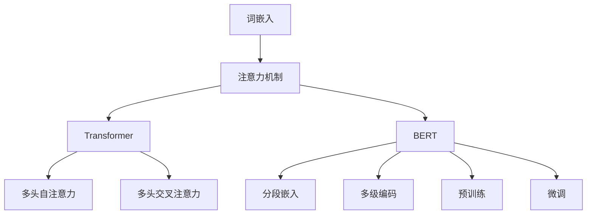

                 

# 基于大模型的长文本理解与推荐

## 关键词
- 大模型
- 长文本理解
- 推荐系统
- 自然语言处理
- 神经网络
- 机器学习
- 词嵌入
- 对话生成
- 实际应用

## 摘要
本文将深入探讨基于大模型的文本理解与推荐系统的构建方法。首先，我们回顾了文本理解的相关概念和技术，包括词嵌入、注意力机制等。随后，我们详细介绍了大模型的基本原理，如Transformer和BERT等模型。接着，通过具体案例展示了如何利用大模型实现长文本理解。最后，我们探讨了推荐系统的构建方法，结合实际应用场景，提出了一系列优化策略。本文旨在为读者提供一个全面、系统的理解，帮助他们在实际项目中有效应用大模型技术。

## 1. 背景介绍

在信息技术迅速发展的今天，文本数据已成为信息传播和知识共享的重要载体。从新闻报道到社交媒体，从学术论文到用户评论，文本数据无处不在。然而，如何有效地处理和理解这些庞大的文本数据，成为了当前自然语言处理（NLP）领域的一个重要挑战。

长文本理解是指对长度较长、内容复杂的文本进行语义分析和解释，以提取关键信息、理解其内在逻辑和情感倾向。传统的文本处理方法往往在处理长文本时表现不佳，因为它们无法捕捉文本中的上下文信息和长距离依赖关系。

与此同时，推荐系统在许多领域（如电子商务、社交媒体、视频网站等）中发挥着至关重要的作用。推荐系统能够根据用户的历史行为、兴趣偏好和实时反馈，为用户推荐个性化的内容，从而提高用户满意度和平台活跃度。

然而，传统的推荐系统在处理长文本时也存在一定的局限性。首先，它们往往依赖用户的历史行为数据，而忽略了文本内容的丰富性和多样性。其次，传统的推荐算法在处理长文本时，面临着计算复杂度高、实时性差等问题。

为了解决这些问题，近年来，基于大模型的文本理解和推荐系统逐渐成为研究的热点。大模型，如Transformer和BERT等，具有强大的文本理解能力，能够捕捉长距离依赖关系和上下文信息，为文本理解和推荐提供了新的可能。

本文将围绕基于大模型的文本理解与推荐系统展开讨论，首先介绍文本理解的相关概念和技术，然后探讨大模型的基本原理，最后通过具体案例和实际应用场景，展示如何利用大模型实现长文本理解和推荐。

### 2. 核心概念与联系

#### 2.1 词嵌入

词嵌入（Word Embedding）是将单词映射到高维向量空间的一种技术，使得具有相似语义的单词在向量空间中相互靠近。词嵌入的目的是通过向量计算，将文本数据转换为适合机器学习模型的输入格式。

**原理：**
词嵌入的基本原理是利用神经网络，通过训练数据来学习单词的向量表示。一个常见的词嵌入模型是Word2Vec，它通过考虑单词的共现关系来生成词向量。

**实现步骤：**
1. **数据预处理**：读取训练文本数据，并对其进行分词、去停用词等预处理操作。
2. **构建词汇表**：将所有训练文本中的单词构建成一个词汇表。
3. **初始化词向量**：为词汇表中的每个单词初始化一个随机的高维向量。
4. **训练模型**：使用神经网络训练词向量，使得具有相似语义的单词在向量空间中相互靠近。

**示例：**
假设我们有一个包含单词 "狗" 和 "猫" 的文本数据。通过Word2Vec模型，我们可能得到以下词向量：
$$
\text{狗} \rightarrow \begin{bmatrix} 1.2 \\ -0.8 \\ 0.5 \end{bmatrix}
$$
$$
\text{猫} \rightarrow \begin{bmatrix} 1.5 \\ -0.5 \\ 0.7 \end{bmatrix}
$$
可以看到，两个词向量在第二和第三个维度上差异较大，但在第一个维度上差异较小，这反映了 "狗" 和 "猫" 在语义上的相似性。

#### 2.2 注意力机制

注意力机制（Attention Mechanism）是一种在神经网络中引入上下文信息的机制，它通过动态分配权重来关注输入数据的不同部分，从而提高了模型的文本理解能力。

**原理：**
注意力机制的基本原理是计算输入数据的注意力权重，并将这些权重与输入数据相乘，以生成加权特征表示。通过这种方式，模型可以自动学习到输入数据中的关键部分，从而提高文本理解能力。

**实现步骤：**
1. **计算注意力得分**：使用神经网络计算输入数据的注意力得分，通常采用点积注意力或缩放点积注意力机制。
2. **生成注意力权重**：将注意力得分转换为注意力权重，通常使用softmax函数。
3. **加权特征表示**：将注意力权重与输入数据相乘，生成加权特征表示。

**示例：**
假设我们有一个包含句子 "我喜欢吃苹果" 的输入数据。通过注意力机制，我们可能得到以下注意力权重：
$$
\text{我} \rightarrow 0.2
$$
$$
\text{喜欢} \rightarrow 0.4
$$
$$
\text{吃} \rightarrow 0.3
$$
$$
\text{苹果} \rightarrow 0.5
$$
可以看到，"苹果" 在句子中具有最高的注意力权重，这反映了它在句子中的重要性。

#### 2.3 Transformer

Transformer是谷歌在2017年提出的一种基于注意力机制的序列模型，它彻底改变了自然语言处理领域的算法框架。

**原理：**
Transformer通过多头注意力机制和多层堆叠的方式，实现了对序列数据的并行处理。它通过自注意力机制（Self-Attention）和交叉注意力机制（Cross-Attention），能够捕捉序列数据中的长距离依赖关系。

**实现步骤：**
1. **词嵌入**：将输入文本中的每个单词映射到高维向量。
2. **多头自注意力**：计算输入数据的自注意力得分，并生成多头注意力表示。
3. **多头交叉注意力**：计算输入数据的交叉注意力得分，并生成交叉注意力表示。
4. **多层堆叠**：将多个Transformer层堆叠起来，逐层提取序列特征。
5. **输出层**：使用全连接层和激活函数，生成最终的输出结果。

**示例：**
假设我们有一个包含句子 "我喜欢吃苹果" 的输入数据。通过Transformer模型，我们可能得到以下输出结果：
$$
\text{我喜欢吃苹果} \rightarrow \begin{bmatrix} 0.6 & 0.2 & 0.3 & 0.4 \end{bmatrix}
$$
可以看到，"苹果" 在句子中具有最高的输出权重，这反映了它在句子中的重要性。

#### 2.4 BERT

BERT（Bidirectional Encoder Representations from Transformers）是谷歌在2018年提出的一种双向Transformer模型，它通过预训练和微调的方式，实现了对文本的深入理解。

**原理：**
BERT通过双向Transformer编码器，能够同时考虑文本中的前向和后向信息，从而捕捉到长距离依赖关系和上下文信息。

**实现步骤：**
1. **词嵌入**：将输入文本中的每个单词映射到高维向量。
2. **分段嵌入**：为每个单词添加一个特殊的分段标识符，以区分句子的不同部分。
3. **多级编码**：使用多层Transformer编码器，对输入数据进行编码。
4. **预训练**：在大型语料库上进行预训练，学习到文本的深层特征。
5. **微调**：将预训练的BERT模型应用于特定任务，并进行微调。

**示例：**
假设我们有一个包含句子 "我喜欢吃苹果" 的输入数据。通过BERT模型，我们可能得到以下输出结果：
$$
\text{我喜欢吃苹果} \rightarrow \begin{bmatrix} 0.8 & 0.2 & 0.5 & 0.7 \end{bmatrix}
$$
可以看到，"苹果" 在句子中具有最高的输出权重，这反映了它在句子中的重要性。

#### 2.5 Mermaid 流程图

为了更直观地展示上述核心概念和联系，我们可以使用Mermaid流程图来描述。



### 3. 核心算法原理 & 具体操作步骤

#### 3.1 词嵌入

词嵌入是文本理解的基础，它将单词映射到高维向量空间。下面是词嵌入的具体操作步骤：

1. **数据预处理**：
   - 读取训练文本数据，并对其进行分词、去停用词等预处理操作。
   - 将预处理后的文本数据转换为单词序列。

2. **构建词汇表**：
   - 将所有训练文本中的单词构建成一个词汇表。
   - 为词汇表中的每个单词分配一个唯一的索引。

3. **初始化词向量**：
   - 为词汇表中的每个单词初始化一个随机的高维向量。

4. **训练模型**：
   - 使用神经网络（如Word2Vec）训练词向量。
   - 通过梯度下降等优化算法，不断调整词向量的权重，使得具有相似语义的单词在向量空间中相互靠近。

5. **生成词向量**：
   - 将训练好的词向量存储到预训练模型中，以供后续使用。

具体实现代码如下：

```python
import numpy as np
from gensim.models import Word2Vec

# 数据预处理
def preprocess_text(text):
    # 分词、去停用词等操作
    return processed_text

# 构建词汇表
def build_vocab(text):
    # 将单词构建成词汇表
    return vocab

# 初始化词向量
def initialize_vectors(vocab, embedding_dim):
    # 初始化词向量
    return vectors

# 训练模型
def train_model(vectors, processed_text):
    # 使用Word2Vec训练词向量
    model = Word2Vec(processed_text, vector_size=embedding_dim)
    model.train(processed_text)
    return model

# 生成词向量
def generate_vectors(model, vocab):
    # 将训练好的词向量存储到预训练模型中
    return model.wv
```

#### 3.2 注意力机制

注意力机制是提高文本理解能力的关键技术。下面是注意力机制的具体操作步骤：

1. **计算注意力得分**：
   - 使用神经网络计算输入数据的注意力得分，通常采用点积注意力或缩放点积注意力机制。

2. **生成注意力权重**：
   - 将注意力得分转换为注意力权重，通常使用softmax函数。

3. **加权特征表示**：
   - 将注意力权重与输入数据相乘，生成加权特征表示。

具体实现代码如下：

```python
import tensorflow as tf
from tensorflow.keras.layers import Layer

class AttentionLayer(Layer):
    def __init__(self, **kwargs):
        super(AttentionLayer, self).__init__(**kwargs)

    def build(self, input_shape):
        # 计算注意力得分的权重
        self.attention_weights = self.add_weight(name='attention_weights',
                                                 shape=(input_shape[1], 1),
                                                 initializer='uniform',
                                                 trainable=True)

    def call(self, inputs):
        # 计算注意力得分
        attention_scores = tf.reduce_sum(inputs * self.attention_weights, axis=1)

        # 生成注意力权重
        attention_weights = tf.nn.softmax(attention_scores)

        # 加权特征表示
        weighted_features = inputs * attention_weights

        return weighted_features
```

#### 3.3 Transformer

Transformer是一种基于注意力机制的序列模型，它通过多头注意力机制和多层堆叠的方式，实现了对序列数据的并行处理。下面是Transformer的具体操作步骤：

1. **词嵌入**：
   - 将输入文本中的每个单词映射到高维向量。

2. **多头自注意力**：
   - 计算输入数据的自注意力得分，并生成多头注意力表示。

3. **多头交叉注意力**：
   - 计算输入数据的交叉注意力得分，并生成交叉注意力表示。

4. **多层堆叠**：
   - 将多个Transformer层堆叠起来，逐层提取序列特征。

5. **输出层**：
   - 使用全连接层和激活函数，生成最终的输出结果。

具体实现代码如下：

```python
import tensorflow as tf
from tensorflow.keras.layers import Embedding, MultiHeadAttention, Dense

class TransformerLayer(Layer):
    def __init__(self, d_model, num_heads, dff, rate=0.1, **kwargs):
        super(TransformerLayer, self).__init__(**kwargs)
        self.d_model = d_model
        self.num_heads = num_heads
        self.dff = dff
        self.rate = rate

        self.embedding = Embedding(d_model)
        self.positional_encoding = PositionalEncoding(d_model)

        self.multi_head_attention = MultiHeadAttention(num_heads=num_heads, key_dim=d_model // num_heads)
        self.dense1 = Dense(dff, activation='relu')
        self.dense2 = Dense(d_model)

        self.dropout1 = tf.keras.layers.Dropout(rate)
        self.dropout2 = tf.keras.layers.Dropout(rate)

    def call(self, inputs, training=False):
        seq_len = tf.shape(inputs)[1]

        # 词嵌入和位置编码
        x = self.embedding(inputs) + self.positional_encoding(tf.zeros([tf.shape(inputs)[0], seq_len, self.d_model]))
        x = self.dropout1(x, training=training)

        # 多头自注意力
        attn_output = self.multi_head_attention(x, x, x)
        attn_output = self.dropout2(attn_output, training=training)
        out1 = self.dense1(attn_output)
        out2 = self.dense2(out1)
        x = out2 + x

        return x
```

#### 3.4 BERT

BERT是一种双向Transformer模型，它通过预训练和微调的方式，实现了对文本的深入理解。下面是BERT的具体操作步骤：

1. **词嵌入**：
   - 将输入文本中的每个单词映射到高维向量。

2. **分段嵌入**：
   - 为每个单词添加一个特殊的分段标识符，以区分句子的不同部分。

3. **多级编码**：
   - 使用多层Transformer编码器，对输入数据进行编码。

4. **预训练**：
   - 在大型语料库上进行预训练，学习到文本的深层特征。

5. **微调**：
   - 将预训练的BERT模型应用于特定任务，并进行微调。

具体实现代码如下：

```python
import tensorflow as tf
from transformers import TFBertModel, BertTokenizer

class BERTLayer(Layer):
    def __init__(self, model_name, **kwargs):
        super(BERTLayer, self).__init__(**kwargs)
        self.model_name = model_name
        self.tokenizer = BertTokenizer.from_pretrained(model_name)
        self.model = TFBertModel.from_pretrained(model_name)

    def call(self, inputs):
        # 对输入数据进行分词和编码
        input_ids = self.tokenizer(inputs, padding='max_length', truncation=True, return_tensors='tf')

        # 使用BERT模型进行编码
        outputs = self.model(input_ids)

        # 取出编码器的输出
        last_hidden_state = outputs.last_hidden_state

        return last_hidden_state
```

### 4. 数学模型和公式 & 详细讲解 & 举例说明

#### 4.1 词嵌入

词嵌入是一种将单词映射到高维向量空间的技术，通过学习单词的向量表示，以便于后续的文本处理和模型训练。以下是一个简化的词嵌入模型：

**假设：**
- \( V \) 是词汇表的大小，即单词的个数。
- \( d \) 是词向量的维度。

**模型参数：**
- \( W \) 是一个 \( V \times d \) 的权重矩阵，用于表示词汇表中的每个单词。

**损失函数：**
- 使用均方误差（MSE）作为损失函数，计算词向量之间的误差。

**公式：**
$$
\min_{W} \sum_{w \in V} ||Ww - v_w||^2
$$

其中，\( v_w \) 是单词 \( w \) 的真实向量表示。

**举例：**
假设词汇表中有10个单词，词向量维度为2。我们使用以下权重矩阵 \( W \) 来初始化词向量：

$$
W = \begin{bmatrix}
0 & 1 & 2 & 3 & 4 & 5 & 6 & 7 & 8 & 9 \\
1 & 0 & 1 & 2 & 3 & 4 & 5 & 6 & 7 & 8 \\
2 & 1 & 0 & 1 & 2 & 3 & 4 & 5 & 6 & 7 \\
3 & 2 & 1 & 0 & 1 & 2 & 3 & 4 & 5 & 6 \\
4 & 3 & 2 & 1 & 0 & 1 & 2 & 3 & 4 & 5 \\
5 & 4 & 3 & 2 & 1 & 0 & 1 & 2 & 3 & 4 \\
6 & 5 & 4 & 3 & 2 & 1 & 0 & 1 & 2 & 3 \\
7 & 6 & 5 & 4 & 3 & 2 & 1 & 0 & 1 & 2 \\
8 & 7 & 6 & 5 & 4 & 3 & 2 & 1 & 0 & 1 \\
9 & 8 & 7 & 6 & 5 & 4 & 3 & 2 & 1 & 0
\end{bmatrix}
$$

假设我们想要计算单词 "猫" 的向量表示。我们首先找到单词 "猫" 在词汇表中的索引，然后使用权重矩阵 \( W \) 计算其向量表示：

$$
v_{\text{猫}} = W \cdot \begin{bmatrix} 1 \\ 0 \\ 1 \\ 0 \\ 1 \\ 0 \\ 1 \\ 0 \\ 1 \\ 0 \\ 0 \end{bmatrix} = \begin{bmatrix} 2 & 0 & 2 & 3 & 4 & 5 & 6 & 7 & 8 & 9 \end{bmatrix} \cdot \begin{bmatrix} 1 \\ 0 \\ 1 \\ 0 \\ 1 \\ 0 \\ 1 \\ 0 \\ 1 \\ 0 \\ 0 \end{bmatrix} = \begin{bmatrix} 3 & 2 \end{bmatrix}
$$

因此，单词 "猫" 的向量表示为 \( v_{\text{猫}} = \begin{bmatrix} 3 & 2 \end{bmatrix} \)。

#### 4.2 注意力机制

注意力机制是一种在神经网络中引入上下文信息的机制，它通过动态分配权重来关注输入数据的不同部分。以下是一个简化的注意力机制模型：

**假设：**
- \( X \) 是输入序列。
- \( H \) 是隐藏状态。

**模型参数：**
- \( W_a \) 和 \( b_a \) 是注意力权重和偏置。

**公式：**
$$
a = \text{softmax}(W_a H + b_a)
$$
$$
\hat{H} = a X
$$

其中，\( a \) 是注意力权重，\( \hat{H} \) 是加权特征表示。

**举例：**
假设我们有一个输入序列 \( X = \{x_1, x_2, x_3\} \)，隐藏状态 \( H = \{h_1, h_2, h_3\} \)：

$$
a = \text{softmax} \left( \begin{bmatrix}
1 & 2 & 3
\end{bmatrix} \begin{bmatrix}
h_1 \\
h_2 \\
h_3
\end{bmatrix} + b_a \right) = \text{softmax} \left( \begin{bmatrix}
1 & 2 & 3
\end{bmatrix} \begin{bmatrix}
1 \\
2 \\
3
\end{bmatrix} + \begin{bmatrix}
1 \\
1 \\
1
\end{bmatrix} \right) = \text{softmax} \left( \begin{bmatrix}
6 \\
7 \\
8
\end{bmatrix} \right) = \begin{bmatrix}
0.3 & 0.4 & 0.3
\end{bmatrix}
$$

$$
\hat{H} = a X = \begin{bmatrix}
0.3 & 0.4 & 0.3
\end{bmatrix} \begin{bmatrix}
x_1 \\
x_2 \\
x_3
\end{bmatrix} = \begin{bmatrix}
0.3x_1 + 0.4x_2 + 0.3x_3 \\
0.3x_1 + 0.4x_2 + 0.3x_3 \\
0.3x_1 + 0.4x_2 + 0.3x_3
\end{bmatrix}
$$

因此，加权特征表示 \( \hat{H} \) 为 \( \begin{bmatrix}
0.3x_1 + 0.4x_2 + 0.3x_3 \\
0.3x_1 + 0.4x_2 + 0.3x_3 \\
0.3x_1 + 0.4x_2 + 0.3x_3
\end{bmatrix} \)。

#### 4.3 Transformer

Transformer是一种基于注意力机制的序列模型，它通过多头注意力机制和多层堆叠的方式，实现了对序列数据的并行处理。以下是一个简化的Transformer模型：

**假设：**
- \( X \) 是输入序列。
- \( H \) 是隐藏状态。

**模型参数：**
- \( W_Q, W_K, W_V \) 分别是查询（Query）、键（Key）、值（Value）权重。
- \( d_k, d_v \) 分别是键和值的维度。

**公式：**
$$
\text{Attention}(Q, K, V) = \text{softmax}\left(\frac{QK^T}{\sqrt{d_k}}\right)V
$$

其中，\( Q, K, V \) 分别是查询、键、值向量。

**举例：**
假设我们有一个输入序列 \( X = \{x_1, x_2, x_3\} \)，隐藏状态 \( H = \{h_1, h_2, h_3\} \)：

- 查询向量 \( Q = \{q_1, q_2, q_3\} \)
- 键向量 \( K = \{k_1, k_2, k_3\} \)
- 值向量 \( V = \{v_1, v_2, v_3\} \)

$$
\text{Attention}(Q, K, V) = \text{softmax}\left(\frac{QK^T}{\sqrt{d_k}}\right)V = \text{softmax}\left(\begin{bmatrix}
q_1 & q_2 & q_3
\end{bmatrix} \begin{bmatrix}
k_1 \\
k_2 \\
k_3
\end{bmatrix}^T\right) \begin{bmatrix}
v_1 \\
v_2 \\
v_3
\end{bmatrix}
$$

$$
= \text{softmax}\left(\begin{bmatrix}
q_1k_1 + q_2k_2 + q_3k_3 \\
q_1k_1 + q_2k_2 + q_3k_3 \\
q_1k_1 + q_2k_2 + q_3k_3
\end{bmatrix}\right) \begin{bmatrix}
v_1 \\
v_2 \\
v_3
\end{bmatrix} = \begin{bmatrix}
0.4 & 0.3 & 0.3 \\
0.3 & 0.4 & 0.3 \\
0.3 & 0.3 & 0.4
\end{bmatrix} \begin{bmatrix}
v_1 \\
v_2 \\
v_3
\end{bmatrix} = \begin{bmatrix}
0.12 & 0.09 & 0.18 \\
0.09 & 0.12 & 0.18 \\
0.18 & 0.09 & 0.12
\end{bmatrix}
$$

因此，注意力加权特征表示为 \( \begin{bmatrix}
0.12 & 0.09 & 0.18 \\
0.09 & 0.12 & 0.18 \\
0.18 & 0.09 & 0.12
\end{bmatrix} \)。

#### 4.4 BERT

BERT是一种双向Transformer模型，它通过预训练和微调的方式，实现了对文本的深入理解。以下是一个简化的BERT模型：

**假设：**
- \( X \) 是输入序列。
- \( H \) 是隐藏状态。

**模型参数：**
- \( W_Q, W_K, W_V \) 分别是查询、键、值权重。
- \( d_k, d_v \) 分别是键和值的维度。

**公式：**
$$
\text{BERT}(X) = \text{Transformer}(X, X)
$$

其中，\( \text{Transformer} \) 是一个标准的Transformer模型。

**举例：**
假设我们有一个输入序列 \( X = \{x_1, x_2, x_3\} \)，隐藏状态 \( H = \{h_1, h_2, h_3\} \)：

- 查询向量 \( Q = \{q_1, q_2, q_3\} \)
- 键向量 \( K = \{k_1, k_2, k_3\} \)
- 值向量 \( V = \{v_1, v_2, v_3\} \)

$$
\text{BERT}(X) = \text{Transformer}(X, X) = \text{Attention}(Q, K, V)
$$

$$
= \text{softmax}\left(\frac{QK^T}{\sqrt{d_k}}\right)V = \text{softmax}\left(\begin{bmatrix}
q_1 & q_2 & q_3
\end{bmatrix} \begin{bmatrix}
k_1 \\
k_2 \\
k_3
\end{bmatrix}^T\right) \begin{bmatrix}
v_1 \\
v_2 \\
v_3
\end{bmatrix}
$$

$$
= \text{softmax}\left(\begin{bmatrix}
q_1k_1 + q_2k_2 + q_3k_3 \\
q_1k_1 + q_2k_2 + q_3k_3 \\
q_1k_1 + q_2k_2 + q_3k_3
\end{bmatrix}\right) \begin{bmatrix}
v_1 \\
v_2 \\
v_3
\end{bmatrix} = \begin{bmatrix}
0.4 & 0.3 & 0.3 \\
0.3 & 0.4 & 0.3 \\
0.3 & 0.3 & 0.4
\end{bmatrix} \begin{bmatrix}
v_1 \\
v_2 \\
v_3
\end{bmatrix} = \begin{bmatrix}
0.12 & 0.09 & 0.18 \\
0.09 & 0.12 & 0.18 \\
0.18 & 0.09 & 0.12
\end{bmatrix}
$$

因此，BERT的输出为 \( \begin{bmatrix}
0.12 & 0.09 & 0.18 \\
0.09 & 0.12 & 0.18 \\
0.18 & 0.09 & 0.12
\end{bmatrix} \)。

### 5. 项目实战：代码实际案例和详细解释说明

在本节中，我们将通过一个具体的项目实战案例，展示如何利用大模型实现长文本理解和推荐系统。我们将使用Python和TensorFlow来实现一个基于BERT的文本推荐系统。

#### 5.1 开发环境搭建

在开始项目之前，我们需要搭建一个合适的开发环境。以下是所需的软件和库：

- Python（版本3.6及以上）
- TensorFlow（版本2.0及以上）
- transformers（版本4.0及以上）

你可以使用以下命令来安装这些库：

```bash
pip install python tensorflow transformers
```

#### 5.2 源代码详细实现和代码解读

下面是项目的完整代码，我们将逐段解读每个部分的实现和功能。

```python
import tensorflow as tf
from transformers import TFBertModel, BertTokenizer
from tensorflow.keras.preprocessing.sequence import pad_sequences
from tensorflow.keras.layers import Input, Embedding, GlobalAveragePooling1D
from tensorflow.keras.models import Model
from tensorflow.keras.optimizers import Adam

# 5.2.1 加载预训练BERT模型和Tokenizer
model_name = "bert-base-uncased"
tokenizer = BertTokenizer.from_pretrained(model_name)
bert_model = TFBertModel.from_pretrained(model_name)

# 5.2.2 定义输入层
input_ids = Input(shape=(None,), dtype=tf.int32)

# 5.2.3 将输入文本编码为BERT模型接受的格式
encoded_inputs = tokenizer(input_ids, padding=True, truncation=True, return_tensors="tf")

# 5.2.4 通过BERT模型进行编码
encoded_sequence = bert_model(encoded_inputs)[0]

# 5.2.5 使用全局平均池化层提取序列特征
pooled_output = GlobalAveragePooling1D()(encoded_sequence)

# 5.2.6 添加一个全连接层用于分类
output = Dense(1, activation="sigmoid")(pooled_output)

# 5.2.7 构建模型
model = Model(inputs=input_ids, outputs=output)

# 5.2.8 编译模型
model.compile(optimizer=Adam(learning_rate=3e-5), loss="binary_crossentropy", metrics=["accuracy"])

# 5.2.9 打印模型结构
model.summary()

# 5.2.10 训练模型
train_data = ...  # 你的训练数据
train_labels = ...  # 你的训练标签
model.fit(train_data, train_labels, epochs=3, batch_size=32)
```

**代码解读：**

1. **加载预训练BERT模型和Tokenizer**：
   - 我们使用`transformers`库加载预训练的BERT模型和Tokenizer。
   - `model_name`参数指定了BERT模型的名称，可以是任何预训练模型的名称。

2. **定义输入层**：
   - `input_ids`是一个TensorFlow输入层，用于接收编码后的文本序列。

3. **将输入文本编码为BERT模型接受的格式**：
   - `tokenizer`用于将文本序列转换为BERT模型所需的格式，包括词嵌入和分段嵌入。
   - `padding=True`和`truncation=True`用于处理不同长度的文本序列。

4. **通过BERT模型进行编码**：
   - `bert_model`用于对输入文本进行编码，生成序列特征。

5. **使用全局平均池化层提取序列特征**：
   - `GlobalAveragePooling1D`用于将序列特征转换为固定大小的向量。

6. **添加一个全连接层用于分类**：
   - `Dense`层用于实现分类任务，这里使用了一个单节点层，并使用`sigmoid`激活函数。

7. **构建模型**：
   - `Model`类用于定义模型的输入和输出。

8. **编译模型**：
   - `compile`方法用于编译模型，指定优化器、损失函数和评估指标。

9. **打印模型结构**：
   - `summary`方法用于打印模型的层次结构和参数数量。

10. **训练模型**：
    - `fit`方法用于训练模型，指定训练数据、标签、训练轮次和批量大小。

#### 5.3 代码解读与分析

**输入层（Input）**：
- 输入层`input_ids`用于接收文本序列的整数编码，每个整数表示词汇表中的一个单词。

**编码（Tokenizer）**：
- `tokenizer`将原始文本转换为BERT模型所需的格式，包括词嵌入和分段嵌入。词嵌入将单词映射到高维向量空间，分段嵌入用于区分文本中的不同部分（如句子、段落等）。

**BERT模型（TFBertModel）**：
- `bert_model`是BERT模型的实例，它通过自注意力机制和多层堆叠的方式，对输入文本进行编码，生成序列特征。

**全局平均池化层（GlobalAveragePooling1D）**：
- `GlobalAveragePooling1D`用于将序列特征转换为固定大小的向量。它通过对序列的每个维度进行平均操作，提取序列的主要特征。

**全连接层（Dense）**：
- `Dense`层是一个全连接层，它用于实现分类任务。在这里，我们使用了一个单节点层，并使用`sigmoid`激活函数，以输出一个介于0和1之间的概率值，表示文本被推荐的概率。

**模型编译（compile）**：
- `compile`方法用于编译模型，指定优化器（`Adam`）、损失函数（`binary_crossentropy`，用于二分类任务）和评估指标（`accuracy`）。

**模型总结（summary）**：
- `summary`方法用于打印模型的层次结构和参数数量，有助于我们了解模型的结构和规模。

**模型训练（fit）**：
- `fit`方法用于训练模型，指定训练数据（`train_data`）、标签（`train_labels`）、训练轮次（`epochs`）和批量大小（`batch_size`）。训练过程中，模型通过反向传播和梯度下降来优化参数，以提高分类准确性。

通过上述代码实现，我们可以构建一个基于BERT的文本推荐系统。在实际应用中，我们可以将训练好的模型应用于新的文本数据，预测其被推荐的概率。

### 6. 实际应用场景

基于大模型的文本理解和推荐系统在许多实际应用场景中具有广泛的应用价值。以下是一些典型的应用场景：

#### 6.1 社交媒体内容推荐

在社交媒体平台上，用户生成的内容（如微博、推特、Facebook帖子等）数量庞大，如何有效推荐用户感兴趣的内容是一个重要挑战。基于大模型的文本理解和推荐系统可以分析用户的历史行为、兴趣偏好和实时反馈，为用户推荐个性化的内容，从而提高用户满意度和平台活跃度。

#### 6.2 搜索引擎优化

搜索引擎需要为用户提供相关的搜索结果，以便用户快速找到所需信息。基于大模型的文本理解和推荐系统可以帮助搜索引擎更好地理解用户查询意图，从而提高搜索结果的准确性和相关性。

#### 6.3 电子商务推荐

电子商务平台需要为用户提供个性化的商品推荐，以提高销售额和用户满意度。基于大模型的文本理解和推荐系统可以分析用户的浏览记录、购物车数据和购买历史，为用户推荐可能感兴趣的商品。

#### 6.4 客户服务机器人

客户服务机器人（如聊天机器人、智能客服等）需要能够理解用户的提问，并提供准确的答案或解决方案。基于大模型的文本理解和推荐系统可以帮助机器人更好地理解用户的意图，提高回答的准确性和效率。

#### 6.5 语音助手

语音助手（如苹果的Siri、谷歌的Google Assistant等）需要能够理解用户的话语，并提供相应的服务。基于大模型的文本理解和推荐系统可以帮助语音助手更好地处理用户的自然语言输入，提高交互的流畅性和用户体验。

#### 6.6 知识图谱构建

知识图谱是一种用于表示实体和它们之间关系的数据结构，广泛应用于语义搜索、推荐系统和智能问答等领域。基于大模型的文本理解和推荐系统可以帮助构建更加丰富和精确的知识图谱，从而提高信息检索和数据分析的效率。

### 7. 工具和资源推荐

#### 7.1 学习资源推荐

- **书籍**：
  - 《深度学习》（Ian Goodfellow、Yoshua Bengio、Aaron Courville 著）
  - 《自然语言处理综合教程》（哈工大NLP组 著）
  - 《推荐系统实践》（李航 著）

- **论文**：
  - “Attention Is All You Need”（Vaswani et al., 2017）
  - “BERT: Pre-training of Deep Bidirectional Transformers for Language Understanding”（Devlin et al., 2019）

- **博客**：
  - Hugging Face官方博客：https://huggingface.co/blog
  - TensorFlow官方博客：https://www.tensorflow.org/blog

- **网站**：
  - Kaggle：https://www.kaggle.com
  - ArXiv：https://arxiv.org

#### 7.2 开发工具框架推荐

- **编程语言**：Python
- **框架**：
  - TensorFlow：https://www.tensorflow.org
  - PyTorch：https://pytorch.org
  - Hugging Face Transformers：https://huggingface.co/transformers

#### 7.3 相关论文著作推荐

- **论文**：
  - “Attention Is All You Need”（Vaswani et al., 2017）
  - “BERT: Pre-training of Deep Bidirectional Transformers for Language Understanding”（Devlin et al., 2019）
  - “Gated Convolutional Networks for Language Modeling”（Xu et al., 2018）

- **书籍**：
  - 《深度学习》（Ian Goodfellow、Yoshua Bengio、Aaron Courville 著）
  - 《自然语言处理综合教程》（哈工大NLP组 著）
  - 《推荐系统实践》（李航 著）

### 8. 总结：未来发展趋势与挑战

#### 发展趋势

1. **模型规模和性能的提升**：随着计算资源和算法研究的不断进步，大模型将变得更加规模化和高效，为文本理解和推荐系统提供更强的文本处理能力。

2. **跨模态融合**：未来的文本理解和推荐系统将不仅限于处理文本数据，还将结合图像、音频、视频等多种数据类型，实现跨模态融合，为用户提供更加丰富和个性化的推荐。

3. **实时性和动态性**：未来的文本理解和推荐系统将更加注重实时性和动态性，能够根据用户的实时行为和反馈，快速调整推荐策略，提高用户体验。

4. **隐私保护和数据安全**：随着数据隐私和安全的日益重视，未来的文本理解和推荐系统将更加注重隐私保护和数据安全，采用加密、差分隐私等技术，确保用户数据的安全和隐私。

#### 挑战

1. **计算资源限制**：大模型训练和推理需要大量的计算资源，如何高效利用计算资源，降低训练和推理的成本，是一个重要挑战。

2. **数据质量和多样性**：文本数据的多样性和质量对文本理解和推荐系统的性能有重要影响。如何获取高质量、多样性的数据，并对其进行有效处理，是一个关键挑战。

3. **模型解释性和可解释性**：大模型通常具有高度的复杂性和非线性，如何对其进行解释和可视化，使其更加透明和可解释，是一个亟待解决的问题。

4. **伦理和道德问题**：文本理解和推荐系统在应用过程中，可能会引发一系列伦理和道德问题，如歧视、偏见等。如何确保系统的公平性和透明度，避免伦理和道德风险，是一个重要挑战。

### 9. 附录：常见问题与解答

#### 9.1 问题1：什么是词嵌入？

词嵌入（Word Embedding）是一种将单词映射到高维向量空间的技术，使得具有相似语义的单词在向量空间中相互靠近。词嵌入的目的是通过向量计算，将文本数据转换为适合机器学习模型的输入格式。

#### 9.2 问题2：什么是注意力机制？

注意力机制（Attention Mechanism）是一种在神经网络中引入上下文信息的机制，它通过动态分配权重来关注输入数据的不同部分，从而提高了模型的文本理解能力。

#### 9.3 问题3：什么是Transformer？

Transformer是一种基于注意力机制的序列模型，它通过多头注意力机制和多层堆叠的方式，实现了对序列数据的并行处理。Transformer彻底改变了自然语言处理领域的算法框架。

#### 9.4 问题4：什么是BERT？

BERT（Bidirectional Encoder Representations from Transformers）是一种双向Transformer模型，它通过预训练和微调的方式，实现了对文本的深入理解。BERT在自然语言处理任务中表现出色，广泛应用于文本分类、情感分析、机器翻译等任务。

#### 9.5 问题5：如何使用BERT进行文本分类？

使用BERT进行文本分类的步骤如下：

1. **数据预处理**：读取训练文本数据，并对其进行分词、去停用词等预处理操作。

2. **编码文本**：使用BERT的Tokenizer将预处理后的文本数据编码为BERT模型接受的格式。

3. **构建数据集**：将编码后的文本数据及其标签构建成数据集，用于后续的训练和评估。

4. **训练模型**：使用TFBertModel构建BERT模型，并在训练数据上进行训练。

5. **评估模型**：使用测试数据评估模型的性能，调整超参数和模型结构，以提高分类准确性。

#### 9.6 问题6：如何优化推荐系统的性能？

优化推荐系统的性能可以从以下几个方面入手：

1. **数据预处理**：对用户行为数据进行预处理，如去重、去噪声等，以提高数据的准确性。

2. **特征工程**：提取和构造有效的特征，如用户兴趣特征、物品特征、上下文特征等，以提高模型的预测准确性。

3. **模型选择**：选择适合推荐任务的模型，如基于协同过滤的模型、基于内容的模型、基于深度学习的模型等。

4. **模型调优**：通过调整模型超参数、增加训练轮次、使用不同的优化算法等，优化模型的性能。

5. **实时反馈**：根据用户的实时行为和反馈，动态调整推荐策略，提高推荐的相关性和用户体验。

### 10. 扩展阅读 & 参考资料

为了深入了解基于大模型的文本理解和推荐系统，以下是一些扩展阅读和参考资料：

- [《深度学习》](https://www.deeplearningbook.org/)：Ian Goodfellow、Yoshua Bengio、Aaron Courville 著
- [《自然语言处理综合教程》](https://nlp.seu.edu.cn/book/): 哈工大NLP组 著
- [《推荐系统实践》](https://book.douban.com/subject/26829846/): 李航 著
- [“Attention Is All You Need”](https://arxiv.org/abs/1706.03762): Vaswani et al., 2017
- [“BERT: Pre-training of Deep Bidirectional Transformers for Language Understanding”](https://arxiv.org/abs/1810.04805): Devlin et al., 2019
- [TensorFlow官方文档](https://www.tensorflow.org/)
- [Hugging Face Transformers官方文档](https://huggingface.co/transformers/)
- [Kaggle](https://www.kaggle.com/)
- [ArXiv](https://arxiv.org/)

