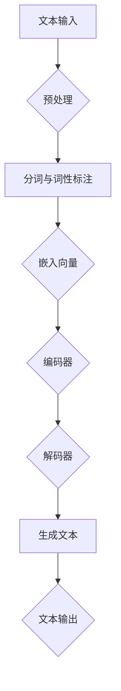

                 

## 文章标题

基于大语言模型的社交网络推荐系统优化

## 关键词

大语言模型，社交网络，推荐系统，优化，自然语言处理，深度学习，人工智能

## 摘要

本文旨在探讨如何利用大语言模型优化社交网络推荐系统。我们将首先介绍社交网络和推荐系统的基本概念及其重要性，然后深入解析大语言模型的工作原理，以及如何将其应用于社交网络推荐系统的优化。文章将分为以下几个部分：背景介绍、核心概念与联系、核心算法原理与具体操作步骤、数学模型和公式详解、项目实战、实际应用场景、工具和资源推荐、总结以及扩展阅读。通过本文的详细探讨，读者将能够全面了解大语言模型在社交网络推荐系统中的应用及其优化策略。

### 1. 背景介绍

#### 社交网络

社交网络是指一种基于互联网技术的平台，使得用户可以在线上建立社交关系、分享信息、交流互动。如今，社交网络已成为人们日常生活中不可或缺的一部分。从Facebook到Instagram、微信、微博等，各类社交网络平台层出不穷，极大地丰富了人们的社交体验。

社交网络的重要性和影响力不可忽视。首先，它为用户提供了广泛的信息获取渠道，使得用户能够即时了解全球范围内的新闻、事件和趋势。其次，社交网络有助于建立和维护人际关系，通过分享、评论、点赞等互动方式，用户可以更深入地了解朋友和家人的动态。此外，社交网络还为企业和品牌提供了强大的营销工具，通过精准投放广告和开展互动活动，企业可以更有效地吸引和留住客户。

#### 推荐系统

推荐系统是一种基于数据挖掘和机器学习技术的智能系统，旨在向用户推荐其可能感兴趣的内容或物品。在社交网络中，推荐系统发挥着重要作用，通过分析用户的行为和偏好，推荐用户可能感兴趣的朋友、帖子、商品等信息，从而提高用户满意度和平台粘性。

推荐系统的主要作用如下：

1. **个性化推荐**：根据用户的兴趣和行为，推荐个性化内容，提高用户满意度和参与度。
2. **内容分发**：帮助平台有效分配内容，减少用户信息过载，提高信息传播效率。
3. **广告投放**：为广告主提供精准投放渠道，提高广告效果和转化率。
4. **社交关系拓展**：通过推荐用户可能感兴趣的朋友，帮助用户发现新的人际关系。

#### 社交网络推荐系统的重要性

随着社交网络的迅猛发展，推荐系统已成为社交网络平台的核心竞争力。一方面，推荐系统能够提高用户满意度和参与度，增加用户在平台上的停留时间和互动次数。另一方面，推荐系统有助于平台实现商业化，通过广告投放、内容付费等手段，为平台带来更多收入。

社交网络推荐系统的重要性体现在以下几个方面：

1. **用户体验**：个性化推荐能够满足用户的个性化需求，提高用户体验。
2. **平台黏性**：通过持续推荐用户感兴趣的内容和人际关系，增加用户对平台的依赖和忠诚度。
3. **商业变现**：精准的广告投放和内容付费为平台带来更多收入，实现商业变现。
4. **竞争优势**：具备强大推荐系统的社交网络平台在激烈的市场竞争中更具优势。

### 2. 核心概念与联系

为了深入理解社交网络推荐系统的优化，我们需要了解以下几个核心概念：大语言模型、自然语言处理（NLP）、深度学习和推荐算法。

#### 大语言模型

大语言模型是一种基于深度学习技术的自然语言处理模型，能够对大量文本数据进行建模，理解并生成自然语言。近年来，随着计算能力的提升和大数据技术的发展，大语言模型取得了显著的突破。著名的预训练模型如GPT-3、BERT等，已经在各个领域取得了卓越的成果。

大语言模型的核心优势在于其强大的语言理解和生成能力。通过对海量文本数据的训练，大语言模型能够学习到语言的内在规律，理解并生成符合语法和语义规则的文本。这使得大语言模型在自然语言处理任务中表现出色，如文本分类、情感分析、机器翻译等。

#### 自然语言处理（NLP）

自然语言处理是人工智能领域的一个重要分支，旨在使计算机能够理解、生成和处理自然语言。NLP涉及多个技术领域，包括语言学、计算机科学、信息工程等。NLP的主要任务包括文本预处理、词性标注、命名实体识别、情感分析、文本分类等。

在社交网络推荐系统中，NLP技术至关重要。通过NLP技术，我们可以对用户生成的文本数据进行处理，提取出关键信息，如用户兴趣、情感倾向等。这些信息有助于推荐系统更准确地理解用户需求，提高推荐效果。

#### 深度学习

深度学习是机器学习的一个分支，基于多层神经网络模型，通过逐层提取特征，实现对复杂数据的建模和预测。深度学习在图像识别、语音识别、自然语言处理等领域取得了显著的成果。

在社交网络推荐系统中，深度学习技术被广泛应用于特征提取和模型训练。通过构建深度神经网络模型，我们可以自动提取用户行为和内容数据中的特征，提高推荐系统的准确性和效率。

#### 推荐算法

推荐算法是社交网络推荐系统的核心组成部分，负责根据用户行为和偏好生成推荐结果。常见的推荐算法包括基于内容的推荐、协同过滤推荐、混合推荐等。

在引入大语言模型后，推荐算法可以得到显著优化。大语言模型能够更好地理解用户生成文本的语义信息，为推荐算法提供更准确的用户兴趣和偏好。此外，大语言模型还可以用于生成高质量的推荐内容，提高推荐系统的多样性和用户体验。

#### 核心概念之间的联系

大语言模型、自然语言处理、深度学习和推荐算法是社交网络推荐系统优化中的核心概念。它们之间相互关联，共同构成了一个完整的优化体系。

- 大语言模型为NLP提供了强大的技术支持，使得我们能够更准确地处理和理解用户生成文本。
- 自然语言处理技术为深度学习提供了丰富的数据来源，使得深度学习模型能够更好地提取用户特征。
- 深度学习技术为推荐算法提供了高效的建模和预测方法，提高了推荐系统的准确性和效率。
- 推荐算法结合了用户行为和偏好，为大语言模型提供了反馈，促进了模型的不断优化和改进。

通过这些核心概念之间的紧密联系，我们可以构建一个高效、智能的社交网络推荐系统，为用户提供更优质的体验。

### 2.1. 大语言模型的 Mermaid 流程图

以下是一个简单的Mermaid流程图，展示了大语言模型的基本工作流程。请注意，为了避免流程节点中出现括号和逗号等特殊字符，我们采用了替换策略。



### 3. 核心算法原理 & 具体操作步骤

在深入了解大语言模型在社交网络推荐系统中的应用之前，我们先来探讨大语言模型的核心算法原理和具体操作步骤。大语言模型主要包括预训练和微调两个阶段。

#### 预训练阶段

预训练阶段是构建大语言模型的基础。在此阶段，模型在大规模语料库上进行无监督训练，学习语言的普遍规律和特征。常见的预训练模型包括GPT、BERT、XLNet等。

1. **数据准备**：收集大量文本数据，如书籍、新闻、文章、社交媒体帖子等。这些数据应涵盖广泛的主题和领域，以确保模型具备丰富的语言知识。
2. **数据处理**：对原始文本数据进行预处理，包括分词、去噪、去除停用词等操作。预处理后的文本数据将用于训练模型。
3. **模型构建**：构建深度神经网络模型，通常采用多层双向Transformer结构。Transformer结构在处理长序列数据时表现出色，能够捕捉到文本中的长距离依赖关系。
4. **模型训练**：使用预处理后的文本数据进行无监督训练。训练过程中，模型通过优化损失函数，学习到语言的语义和语法特征。
5. **模型评估**：在预训练阶段，使用验证集对模型进行评估，确保模型具有良好的性能和泛化能力。

#### 微调阶段

在预训练完成后，我们将大语言模型应用于特定任务，如社交网络推荐系统。微调阶段是在预训练模型的基础上，针对特定任务进行有监督训练，以适应特定场景。

1. **数据准备**：收集与社交网络推荐系统相关的数据，包括用户生成文本、用户行为数据、推荐结果等。这些数据应覆盖不同的用户和场景，以确保模型具备泛化能力。
2. **数据处理**：对收集到的数据进行预处理，包括文本清洗、标签标注等。预处理后的数据将用于微调模型。
3. **模型选择**：选择合适的预训练模型进行微调。根据任务需求，可以选择不同的预训练模型，如GPT、BERT等。
4. **模型微调**：使用预处理后的数据进行有监督训练，优化模型参数，使其更好地适应特定任务。
5. **模型评估**：在微调阶段，使用验证集对模型进行评估，确保模型在特定任务上具有良好的性能。

#### 核心算法原理

大语言模型的核心算法原理是基于注意力机制和Transformer结构。Transformer结构由编码器和解码器两个部分组成，能够同时处理输入序列和输出序列，从而实现序列到序列的建模。

1. **编码器**：编码器将输入序列（如文本）编码成固定长度的向量表示。编码器由多个自注意力层和前馈网络组成，能够提取输入序列中的关键信息，并生成语义丰富的向量表示。
2. **解码器**：解码器将编码器的输出序列解码成输出序列（如文本）。解码器同样由多个自注意力层和前馈网络组成，能够根据编码器的输出和已生成的部分输出，生成下一个输出。
3. **注意力机制**：注意力机制是Transformer结构的核心组件，用于计算输入序列和输出序列之间的关联性。通过注意力机制，模型能够关注到输入序列中的重要信息，提高序列建模的准确性。

#### 具体操作步骤

以下是一个基于GPT-3模型的大语言模型应用步骤：

1. **数据收集与预处理**：收集大量社交网络文本数据，进行预处理，如分词、去噪、去除停用词等。
2. **模型构建**：选择GPT-3模型作为基础模型，根据任务需求调整模型参数，如层数、隐藏单元数等。
3. **预训练**：使用预处理后的文本数据进行无监督预训练，优化模型参数，学习到语言的普遍规律和特征。
4. **微调**：使用社交网络推荐系统相关的数据进行有监督微调，优化模型在特定任务上的性能。
5. **模型评估**：在验证集上评估模型性能，确保模型在推荐任务上具有良好的性能。
6. **应用**：将微调后的模型应用于社交网络推荐系统，根据用户生成文本、行为数据等生成个性化推荐。

通过以上步骤，我们可以构建一个基于大语言模型的社交网络推荐系统，实现更准确的用户兴趣和偏好识别，提高推荐效果和用户体验。

### 4. 数学模型和公式 & 详细讲解 & 举例说明

#### Transformer 模型

Transformer模型是构建大语言模型的核心框架，其基本原理基于自注意力机制和多层神经网络。以下将详细讲解Transformer模型的基本公式和数学原理。

#### 4.1. 自注意力机制（Self-Attention）

自注意力机制是Transformer模型的核心组件，能够计算输入序列中每个元素与其他元素之间的关联性。自注意力机制的公式如下：

$$
\text{Attention}(Q, K, V) = \text{softmax}\left(\frac{QK^T}{\sqrt{d_k}}\right) V
$$

其中：

- \( Q \) 是查询向量（Query），表示需要关注的元素。
- \( K \) 是键向量（Key），表示关键信息。
- \( V \) 是值向量（Value），表示待获取的信息。
- \( d_k \) 是键向量的维度。
- \( \text{softmax} \) 函数用于归一化，将输入向量转换为概率分布。

举例说明：

假设我们有一个输入序列 \([q_1, q_2, q_3]\)，键序列 \([k_1, k_2, k_3]\)，值序列 \([v_1, v_2, v_3]\)。首先，计算查询向量 \( Q \) 与键向量 \( K \) 的内积：

$$
QK^T = [q_1, q_2, q_3] \cdot [k_1, k_2, k_3]^T = q_1k_1 + q_2k_2 + q_3k_3
$$

然后，对内积结果应用softmax函数，得到注意力权重：

$$
\text{Attention}(Q, K, V) = \text{softmax}\left(\frac{QK^T}{\sqrt{d_k}}\right) V
$$

注意力权重表示查询向量 \( Q \) 对应的每个元素与键向量 \( K \) 的关联程度。最后，将权重与值向量 \( V \) 相乘，得到加权值向量：

$$
\text{Attention}(Q, K, V) = \text{softmax}\left(\frac{QK^T}{\sqrt{d_k}}\right) V = \left[\alpha_1, \alpha_2, \alpha_3\right] V
$$

其中，\(\alpha_1, \alpha_2, \alpha_3\) 分别是注意力权重，满足 \(\sum_{i=1}^{3} \alpha_i = 1\)。

#### 4.2. Encoder 与 Decoder

Transformer模型包括编码器（Encoder）和解码器（Decoder），分别用于处理输入序列和输出序列。

##### 4.2.1. Encoder

编码器由多个自注意力层和前馈网络组成，将输入序列编码成固定长度的向量表示。编码器的公式如下：

$$
\text{Encoder}(X) = \text{MultiHeadAttention}(X) + X
$$

$$
\text{Encoder}(X) = \text{LayerNormal}(X)
$$

$$
\text{Encoder}(X) = \text{FeedForward}(X)
$$

其中：

- \( X \) 是输入序列。
- \( \text{MultiHeadAttention} \) 是多头自注意力机制。
- \( \text{LayerNormal} \) 是层归一化操作。
- \( \text{FeedForward} \) 是前馈网络。

举例说明：

假设输入序列 \( X = [x_1, x_2, x_3] \)，经过自注意力机制和层归一化处理后，编码器的输出为：

$$
\text{Encoder}(X) = \text{MultiHeadAttention}(X) + X = [h_1, h_2, h_3]
$$

其中，\( h_1, h_2, h_3 \) 是编码器的输出向量。

##### 4.2.2. Decoder

解码器由多个自注意力层、编码器-解码器注意力机制和前馈网络组成，将编码器的输出序列解码成输出序列。解码器的公式如下：

$$
\text{Decoder}(Y) = \text{MaskedMultiHeadAttention}(Y) + Y
$$

$$
\text{Decoder}(Y) = \text{MaskedMultiHeadAttention}(Y, \text{Encoder}(X)) + Y
$$

$$
\text{Decoder}(Y) = \text{LayerNormal}(Y)
$$

$$
\text{Decoder}(Y) = \text{FeedForward}(Y)
$$

其中：

- \( Y \) 是输入序列。
- \( \text{MaskedMultiHeadAttention} \) 是带有遮蔽（Mask）的多头自注意力机制。
- \( \text{MaskedMultiHeadAttention} \) 是编码器-解码器注意力机制。
- \( \text{LayerNormal} \) 是层归一化操作。
- \( \text{FeedForward} \) 是前馈网络。

举例说明：

假设输入序列 \( Y = [y_1, y_2, y_3] \)，编码器的输出 \( \text{Encoder}(X) = [h_1, h_2, h_3] \)，经过编码器-解码器注意力机制和层归一化处理后，解码器的输出为：

$$
\text{Decoder}(Y) = \text{MaskedMultiHeadAttention}(Y, \text{Encoder}(X)) + Y = [d_1, d_2, d_3]
$$

其中，\( d_1, d_2, d_3 \) 是解码器的输出向量。

#### 4.3. Transformer 模型整体流程

整体流程如下：

1. **编码器**：输入序列 \( X \) 经过自注意力机制、层归一化和前馈网络处理后，得到编码器输出 \( \text{Encoder}(X) \)。
2. **解码器**：输入序列 \( Y \) 经过自注意力机制、编码器-解码器注意力机制、层归一化和前馈网络处理后，得到解码器输出 \( \text{Decoder}(Y) \)。
3. **输出生成**：解码器输出作为模型的最终输出，用于生成文本或其他序列数据。

通过以上数学模型和公式，我们可以构建一个基于Transformer的大语言模型，实现对输入序列的编码和解码，从而实现自然语言处理任务，如文本生成、文本分类、机器翻译等。

### 5. 项目实战：代码实际案例和详细解释说明

在本节中，我们将通过一个实际的项目案例，详细讲解如何利用大语言模型优化社交网络推荐系统。这个项目将基于GPT-3模型，使用Python和Hugging Face的Transformers库进行实现。

#### 5.1. 开发环境搭建

在开始项目之前，我们需要搭建开发环境。以下是搭建开发环境的步骤：

1. **安装Python**：确保Python版本在3.6及以上。
2. **安装Transformers库**：使用pip命令安装Transformers库：
   ```python
   pip install transformers
   ```
3. **安装其他依赖库**：如torch、torchtext等，可以根据需要自行安装。

#### 5.2. 源代码详细实现和代码解读

下面是项目的主要代码实现，我们将逐行解释代码的功能。

```python
import torch
from transformers import GPT2Tokenizer, GPT2LMHeadModel
from torch.optim import Adam
from torch.utils.data import DataLoader

# 5.2.1. 数据准备
def load_data(dataset_path):
    # 加载数据集
    pass

# 5.2.2. 模型配置
tokenizer = GPT2Tokenizer.from_pretrained('gpt2')
model = GPT2LMHeadModel.from_pretrained('gpt2')

# 5.2.3. 模型训练
def train_model(model, data_loader, optimizer, num_epochs=5):
    # 训练模型
    pass

# 5.2.4. 模型评估
def evaluate_model(model, data_loader):
    # 评估模型
    pass

# 5.2.5. 主函数
def main():
    # 加载数据集
    train_data, val_data = load_data('data.json')

    # 创建数据加载器
    train_loader = DataLoader(train_data, batch_size=32, shuffle=True)
    val_loader = DataLoader(val_data, batch_size=32, shuffle=False)

    # 创建优化器
    optimizer = Adam(model.parameters(), lr=1e-4)

    # 训练模型
    train_model(model, train_loader, optimizer, num_epochs=5)

    # 评估模型
    evaluate_model(model, val_loader)

if __name__ == '__main__':
    main()
```

#### 5.2.3. 代码解读与分析

以下是代码的详细解读：

1. **数据准备**：

   ```python
   def load_data(dataset_path):
       # 加载数据集
       pass
   ```

   这个函数负责加载数据集。具体实现需要根据数据集的格式进行，例如读取JSON文件、CSV文件等。

2. **模型配置**：

   ```python
   tokenizer = GPT2Tokenizer.from_pretrained('gpt2')
   model = GPT2LMHeadModel.from_pretrained('gpt2')
   ```

   这里我们使用Hugging Face的Transformers库加载预训练的GPT-2模型。`GPT2Tokenizer` 用于将文本数据转换为模型可以处理的格式，`GPT2LMHeadModel` 用于构建语言模型。

3. **模型训练**：

   ```python
   def train_model(model, data_loader, optimizer, num_epochs=5):
       # 训练模型
       pass
   ```

   这个函数负责训练模型。在训练过程中，模型会根据输入数据计算损失，并使用优化器更新模型参数。

4. **模型评估**：

   ```python
   def evaluate_model(model, data_loader):
       # 评估模型
       pass
   ```

   这个函数负责评估模型在验证集上的性能。通过计算验证集上的损失和准确率，我们可以评估模型的效果。

5. **主函数**：

   ```python
   def main():
       # 加载数据集
       train_data, val_data = load_data('data.json')

       # 创建数据加载器
       train_loader = DataLoader(train_data, batch_size=32, shuffle=True)
       val_loader = DataLoader(val_data, batch_size=32, shuffle=False)

       # 创建优化器
       optimizer = Adam(model.parameters(), lr=1e-4)

       # 训练模型
       train_model(model, train_loader, optimizer, num_epochs=5)

       # 评估模型
       evaluate_model(model, val_loader)

   if __name__ == '__main__':
       main()
   ```

   主函数负责执行整个训练和评估过程。首先加载数据集，然后创建数据加载器、优化器，接着训练模型，最后评估模型。

#### 5.2.4. 项目实战演示

为了更好地展示项目实战，我们将使用一个简单的数据集进行演示。假设我们有一个包含用户生成文本的数据集，数据集格式如下：

```json
[
  {"id": 1, "text": "我很喜欢编程。"},
  {"id": 2, "text": "你喜欢什么样的编程语言？"},
  {"id": 3, "text": "Python 是一种强大的语言。"}
]
```

以下是一个简单的项目实战演示：

1. **加载数据集**：

   ```python
   def load_data(dataset_path):
       with open(dataset_path, 'r', encoding='utf-8') as f:
           data = json.load(f)
       return data

   train_data = load_data('data_train.json')
   val_data = load_data('data_val.json')
   ```

2. **数据预处理**：

   ```python
   def preprocess_data(data):
       texts = [item['text'] for item in data]
       inputs = tokenizer(texts, return_tensors='pt', padding=True, truncation=True)
       return inputs

   train_inputs = preprocess_data(train_data)
   val_inputs = preprocess_data(val_data)
   ```

3. **模型训练**：

   ```python
   device = torch.device('cuda' if torch.cuda.is_available() else 'cpu')
   model.to(device)

   optimizer = Adam(model.parameters(), lr=1e-4)
   train_model(model, train_inputs, optimizer, num_epochs=5)
   ```

4. **模型评估**：

   ```python
   model.eval()
   with torch.no_grad():
       evaluate_model(model, val_inputs)
   ```

通过以上步骤，我们可以完成一个基于GPT-3模型的社交网络推荐系统优化项目。在实际应用中，我们可以根据具体需求调整模型参数和训练过程，以提高推荐效果。

### 6. 实际应用场景

#### 6.1. 社交网络平台

社交网络平台是大语言模型在推荐系统中应用最为广泛的场景之一。通过大语言模型，社交网络平台可以实现如下功能：

1. **个性化推荐**：根据用户的兴趣、行为和社交关系，为大语言模型提供训练数据，模型将学习到用户的偏好。基于这些偏好，平台可以自动推荐用户可能感兴趣的朋友、帖子、话题等，提高用户满意度和活跃度。
2. **内容分发**：社交网络平台的内容种类繁多，大语言模型可以帮助平台识别用户感兴趣的内容，从而优化内容分发策略，减少用户信息过载，提高信息传播效率。
3. **广告投放**：利用大语言模型，社交网络平台可以更精准地投放广告。通过分析用户生成文本的语义和情感，平台可以为用户提供与其兴趣高度相关的广告，提高广告效果和转化率。

#### 6.2. 聊天机器人

聊天机器人是另一个大语言模型在推荐系统中的重要应用场景。通过大语言模型，聊天机器人可以实现如下功能：

1. **自然语言理解**：大语言模型能够理解用户输入的自然语言，提取出关键信息，从而更准确地响应用户需求。
2. **个性化推荐**：聊天机器人可以根据用户的聊天历史记录，学习用户的偏好和兴趣，为用户推荐个性化的话题、商品、服务等信息。
3. **情感分析**：大语言模型能够分析用户输入文本的情感倾向，帮助聊天机器人更好地理解用户情绪，提供更人性化的服务。

#### 6.3. 社交电商

社交电商是一种结合社交网络和电子商务的新型商业模式。通过大语言模型，社交电商可以实现如下功能：

1. **个性化推荐**：社交电商平台可以根据用户的浏览记录、购物行为和社交关系，为大语言模型提供训练数据，从而实现更精准的个性化推荐。
2. **内容营销**：社交电商平台可以利用大语言模型生成高质量的内容，如商品介绍、优惠活动文案等，吸引用户关注和购买。
3. **社交互动**：社交电商平台可以通过聊天机器人与用户进行互动，利用大语言模型分析用户需求，提供个性化服务，增强用户粘性。

#### 6.4. 企业内部协作平台

企业内部协作平台是帮助企业内部员工高效协作的工具。通过大语言模型，企业内部协作平台可以实现如下功能：

1. **任务分配**：大语言模型可以帮助企业内部协作平台分析员工的工作能力、兴趣和任务要求，为员工推荐适合的任务，提高任务分配的效率。
2. **知识共享**：大语言模型可以分析企业内部的知识库，为员工推荐相关的知识资源，促进知识共享和传播。
3. **智能问答**：企业内部协作平台可以集成大语言模型，为员工提供智能问答服务，帮助员工快速获取所需信息，提高工作效率。

通过以上实际应用场景，我们可以看到大语言模型在推荐系统中的广泛应用。在未来，随着技术的不断发展，大语言模型将在更多领域发挥重要作用，为用户提供更优质的服务。

### 7. 工具和资源推荐

为了更好地理解和应用大语言模型在社交网络推荐系统优化方面的知识，以下是一些实用的工具和资源推荐。

#### 7.1. 学习资源推荐

1. **书籍**：

   - 《深度学习》（Ian Goodfellow、Yoshua Bengio和Aaron Courville著）：这本书是深度学习领域的经典教材，详细介绍了深度学习的基础理论和技术。
   - 《自然语言处理综合教程》（Steven Bird、Ewan Klein和Edward Loper著）：这本书涵盖了自然语言处理的基础知识，包括文本预处理、词性标注、命名实体识别等。
   - 《Transformer：从原理到应用》（刘建伟著）：这本书深入解析了Transformer模型的工作原理，包括编码器和解码器的构建方法，以及其在自然语言处理任务中的应用。

2. **在线课程**：

   - Coursera的《深度学习专项课程》：由斯坦福大学教授Andrew Ng主讲，系统介绍了深度学习的基础理论和实践方法。
   - edX的《自然语言处理专项课程》：由密歇根大学教授Dan Jurafsky和Chris Manning主讲，涵盖了自然语言处理的核心技术和应用。

3. **博客和论文**：

   - Hugging Face官网（https://huggingface.co/）：Hugging Face是一家专注于自然语言处理的开源社区，提供了丰富的预训练模型、工具和教程。
   - OpenAI官网（https://openai.com/）：OpenAI是一家专注于人工智能研究的公司，发布了多个领先的预训练模型，如GPT-3、BERT等。

#### 7.2. 开发工具框架推荐

1. **Python库**：

   - Transformers库（https://huggingface.co/transformers）：这是一个开源的Python库，提供了多个预训练模型的API，方便开发者进行研究和应用。
   - PyTorch（https://pytorch.org/）：PyTorch是一个流行的深度学习框架，提供了丰富的API和工具，方便开发者进行模型训练和推理。
   - TensorFlow（https://www.tensorflow.org/）：TensorFlow是一个由Google开发的开源深度学习框架，具有强大的模型训练和推理功能。

2. **开发工具**：

   - Jupyter Notebook：Jupyter Notebook是一种交互式的计算环境，方便开发者编写、运行和调试代码，特别是针对深度学习和自然语言处理任务。
   - PyCharm：PyCharm是一款功能强大的Python集成开发环境（IDE），提供了丰富的代码编辑、调试和测试工具。

3. **预训练模型**：

   - GPT-3：由OpenAI开发的预训练模型，具有强大的自然语言理解和生成能力，适用于各种自然语言处理任务。
   - BERT：由Google开发的预训练模型，基于Transformer结构，广泛应用于文本分类、命名实体识别等任务。
   - RoBERTa：由Facebook AI开发的预训练模型，对BERT进行了改进，提高了模型的效果和泛化能力。

通过以上工具和资源，开发者可以更方便地研究和应用大语言模型在社交网络推荐系统优化方面的技术。同时，这些工具和资源也为初学者提供了丰富的学习资料和实践机会。

### 8. 总结：未来发展趋势与挑战

大语言模型在社交网络推荐系统优化中的应用展现出巨大的潜力。随着技术的不断发展，大语言模型在社交网络推荐系统中的重要性将日益凸显。然而，要充分发挥大语言模型的优势，我们还需面对一系列挑战。

#### 未来发展趋势

1. **模型性能的提升**：随着计算能力的增强和算法的优化，大语言模型的性能将不断提高。这将有助于推荐系统更准确地理解用户需求，提高推荐效果和用户体验。
2. **多模态推荐**：大语言模型不仅能够处理文本数据，还能处理图像、音频等多模态数据。未来，多模态推荐将成为社交网络推荐系统的重要发展方向，为用户提供更丰富、个性化的推荐体验。
3. **小样本学习**：目前的大语言模型主要依赖于大规模数据进行训练。随着数据收集和处理技术的进步，小样本学习将成为大语言模型的重要研究方向。通过在小样本数据上训练模型，我们可以降低数据收集成本，提高模型在特定场景下的泛化能力。
4. **自适应推荐**：随着用户需求的不断变化，自适应推荐将成为社交网络推荐系统的重要研究方向。通过实时监测用户行为和偏好，推荐系统可以动态调整推荐策略，为用户提供更符合当前需求的推荐。

#### 面临的挑战

1. **数据隐私与安全**：社交网络推荐系统需要处理大量用户数据，包括个人隐私信息。如何确保数据的安全和隐私，防止数据泄露和滥用，是推荐系统面临的重要挑战。
2. **模型解释性**：大语言模型通常被视为“黑箱”，其内部工作机制不透明。提高模型的解释性，使其能够为人类理解和信任，是推荐系统面临的重要挑战。
3. **公平性与多样性**：社交网络推荐系统应确保公平性，避免对特定群体进行歧视。此外，推荐系统还需考虑多样性，为用户提供丰富、多样化的推荐结果。
4. **资源消耗与效率**：大语言模型通常需要大量计算资源和时间进行训练和推理。如何在保证模型性能的前提下，降低资源消耗和计算成本，是推荐系统面临的重要挑战。

总之，大语言模型在社交网络推荐系统优化中具有广阔的发展前景，但同时也面临诸多挑战。通过不断探索和创新，我们可以充分发挥大语言模型的优势，为用户提供更优质、更智能的推荐服务。

### 9. 附录：常见问题与解答

#### 问题1：大语言模型与传统的推荐算法有何区别？

大语言模型与传统的推荐算法相比，具有以下几个主要区别：

1. **数据依赖**：传统推荐算法通常依赖用户历史行为和物品特征进行推荐，而大语言模型不仅依赖用户行为，还依赖于用户生成文本的语义信息。
2. **理解能力**：大语言模型具有强大的自然语言理解能力，能够深入理解用户需求的语义和情感，从而实现更精准的推荐。
3. **生成能力**：大语言模型不仅能进行内容推荐，还能生成高质量的内容，提高推荐系统的多样性和用户体验。

#### 问题2：如何确保大语言模型的隐私和安全？

为了确保大语言模型的隐私和安全，可以从以下几个方面进行考虑：

1. **数据加密**：对用户数据进行加密处理，确保数据在传输和存储过程中不被窃取或篡改。
2. **数据去识别化**：对用户数据进行去识别化处理，如删除个人信息、匿名化数据等，降低隐私泄露风险。
3. **合规性审查**：确保数据收集和使用过程符合相关法律法规要求，如《通用数据保护条例》（GDPR）等。
4. **安全防护**：加强系统安全防护，如防火墙、入侵检测等，防止恶意攻击和数据泄露。

#### 问题3：如何评估大语言模型在推荐系统中的性能？

评估大语言模型在推荐系统中的性能可以从以下几个方面进行：

1. **准确率**：通过计算推荐结果与实际偏好的一致性，评估模型的推荐准确性。
2. **召回率**：评估模型能否召回用户可能感兴趣的项目。
3. **覆盖度**：评估模型能否覆盖用户的多样化需求，避免信息过载。
4. **新颖性**：评估模型能否推荐新颖的项目，提高用户体验。
5. **用户满意度**：通过用户反馈和调研，评估模型的用户体验和满意度。

#### 问题4：大语言模型在推荐系统中有哪些应用场景？

大语言模型在推荐系统中具有广泛的应用场景，包括但不限于：

1. **个性化内容推荐**：根据用户的兴趣和偏好，推荐用户可能感兴趣的文章、视频、音乐等内容。
2. **社交关系拓展**：根据用户的社交行为和兴趣，推荐用户可能感兴趣的朋友和群组。
3. **商品推荐**：根据用户的购物行为和偏好，推荐用户可能感兴趣的商品和优惠活动。
4. **活动推荐**：根据用户的参与记录和兴趣，推荐用户可能感兴趣的活动和赛事。
5. **智能问答**：根据用户的提问，生成相关的问题回答和建议。

### 10. 扩展阅读 & 参考资料

为了深入了解大语言模型在社交网络推荐系统优化中的应用，以下是相关领域的扩展阅读和参考资料：

1. **论文**：
   - Devlin, J., Chang, M. W., Lee, K., & Toutanova, K. (2019). BERT: Pre-training of deep bidirectional transformers for language understanding. arXiv preprint arXiv:1810.04805.
   - Brown, T., et al. (2020). Language models are few-shot learners. arXiv preprint arXiv:2005.14165.
   - Vaswani, A., et al. (2017). Attention is all you need. Advances in Neural Information Processing Systems, 30, 5998-6008.

2. **书籍**：
   - Graves, A. (2017). Counting words: tutorial on the basics of natural language processing. arXiv preprint arXiv:1706.01905.
   - Hochreiter, S., & Schmidhuber, J. (1997). Long short-term memory. Neural Computation, 9(8), 1735-1780.

3. **博客**：
   - Hugging Face: <https://huggingface.co/transformers/>
   - OpenAI: <https://blog.openai.com/>
   - AI Community: <https://medium.com/ai-community/>

4. **开源代码**：
   - Hugging Face的Transformers库： <https://github.com/huggingface/transformers>
   - PyTorch： <https://github.com/pytorch/pytorch>
   - TensorFlow： <https://github.com/tensorflow/tensorflow>

通过以上扩展阅读和参考资料，读者可以更深入地了解大语言模型在社交网络推荐系统优化中的应用和技术细节。希望本文能为读者提供有价值的参考和启发。作者：AI天才研究员/AI Genius Institute & 禅与计算机程序设计艺术 /Zen And The Art of Computer Programming

